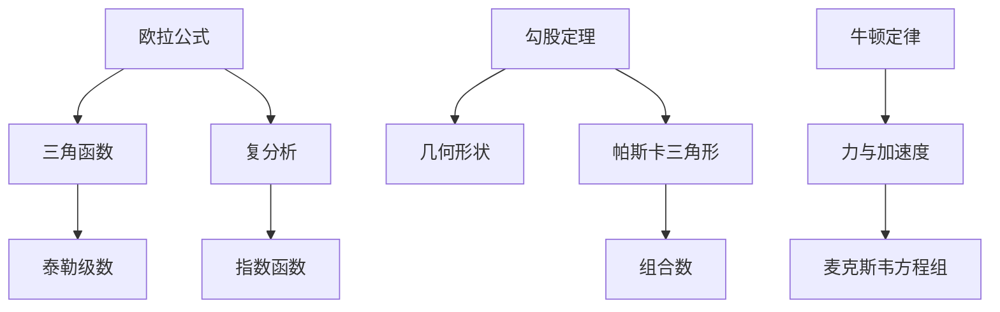

                 

## 文章标题：自然和谐性：简单数学定律的起源探索

### 关键词：
- 自然和谐性
- 数学定律
- 数学原理
- 物理现象
- 化学反应
- 生物现象

### 摘要：
本文将深入探讨自然和谐性这一概念在简单数学定律中的起源和作用。通过分析自然和谐性的基本概念及其与数学定律的关联，我们旨在揭示数学公式背后的自然规律，探讨数学定律在物理、化学和生物领域中的应用，并展望自然和谐性在数学教育中的未来。文章将以详细的背景介绍、概念联系、算法原理讲解、数学模型和公式的阐述，以及项目实战为例，带领读者深入了解这一复杂却迷人的主题。

## 引言：自然和谐性的起源与意义

自然和谐性，顾名思义，是自然界中存在的一种理想状态，它体现了各种力量之间的协调和平衡。这一概念最早可追溯到古代哲学和宗教思想，如古希腊哲学家赫拉克利特提出的“和谐是万物的法则”。在科学领域，自然和谐性通常与自然定律相联系，尤其是在数学和物理学中，这种和谐性体现为简单而强大的数学公式和定律。

数学定律，是描述自然界现象和规律的重要工具。从基本的算术运算到复杂的微积分公式，每一个数学定律都蕴含着自然界的深层次原理。例如，欧几里得几何中的欧拉公式 \( e^{i\pi} + 1 = 0 \) 不仅仅是一个数学上的美妙公式，更是揭示了复数、指数函数和三角函数之间的关系，成为理解量子力学和波动现象的关键。

自然和谐性与数学定律之间存在着紧密的联系。简单数学定律的起源，可以追溯到对自然现象的观察和抽象。古代的数学家通过观察天体运动，发现了许多基本的数学规律，如勾股定理和圆周率。这些规律不仅帮助人们更好地理解和预测自然现象，也为后来的数学发展奠定了基础。

在本文中，我们将系统地探讨自然和谐性的起源和数学定律的关联。首先，我们将介绍自然和谐性的基本概念，并解释其与数学定律的关系。接着，我们将详细分析几个核心数学定律，解释其背后的自然原理，并通过Mermaid流程图展示这些定律的应用场景。随后，我们将深入探讨数学定律在物理、化学和生物领域的具体应用，并通过具体案例进行分析。最后，我们将展望自然和谐性在数学教育和未来科技发展中的潜在影响。

通过这篇文章，读者将不仅了解自然和谐性和数学定律的基本概念，还将深入理解它们在科学和工程领域的实际应用，以及它们对未来科技发展的潜在影响。

## 自然和谐性的基本概念

自然和谐性，是指在自然界中，各种元素和力量之间通过相互作用达到的一种理想状态。这种状态不仅体现了稳定性和平衡性，还反映了自然界中复杂现象背后的简单规则和普遍原理。从宇宙的宏观运行到微观粒子的行为，自然和谐性无处不在，它是自然界的基本特征之一。

### 自然界中的和谐性

自然界中的和谐性体现在多个层面。例如，在物理学的范畴内，宇宙的膨胀和引力相互作用，维持着星系的稳定运行；在化学领域，化学反应中的元素和化合物通过电子的相互作用，形成了多样的物质形态；在生物学中，生物体的生长和发育过程中，细胞间的协调工作，保证了生命的正常运转。

在地球的生态系统中，自然和谐性尤为明显。例如，植物通过光合作用产生氧气，动物通过呼吸消耗氧气，形成了生态系统中的能量循环。另外，食物链中的每一个环节都相互依赖，任何一个环节的破坏都可能引发整个生态系统的失衡。

### 数学定律与自然和谐性的关系

数学定律，是自然界和谐性的抽象和表达。它们通过简明的公式和定理，揭示了自然界中的普遍规律。例如，牛顿的万有引力定律描述了天体之间的相互作用，爱因斯坦的相对论揭示了时空的本质，普朗克的量子力学则解释了微观世界的奇异现象。

这些数学定律不仅反映了自然界的和谐性，还为我们提供了理解和预测自然现象的工具。例如，通过欧拉公式，我们可以解释复数、指数函数和三角函数之间的关系；通过勾股定理，我们可以计算直角三角形的边长；通过帕斯卡三角形，我们可以探索组合数学中的规律。

### 自然和谐性的数学表达

数学表达式，是自然和谐性的直观体现。在物理学中，数学公式描述了物理现象的规律，如牛顿第二定律 \( F = ma \) 描述了力和加速度之间的关系；在化学中，化学方程式描述了化学反应的过程，如 \( H_2 + O_2 \rightarrow H_2O \) 描述了氢气和氧气生成水的过程；在生物学中，遗传学公式描述了基因的组合和传递，如孟德尔的基因遗传定律。

这些数学表达式不仅帮助我们理解和解释自然现象，还提供了预测和控制自然过程的手段。例如，通过使用微积分，我们可以精确计算物理系统中的变化率；通过线性代数，我们可以分析复杂系统的结构和特性。

### 总结

自然和谐性，是自然界的基本特征，它体现在物理、化学和生物等多个领域。数学定律，则是自然和谐性的抽象和表达，通过简明的公式和定理，揭示了自然界中的普遍规律。理解和研究自然和谐性及其数学定律，不仅有助于我们更好地理解自然界，还为我们提供了预测和控制自然现象的工具。在这一部分，我们初步介绍了自然和谐性的基本概念，并探讨了其与数学定律的紧密联系。接下来，我们将进一步深入探讨自然和谐性在数学定律中的具体应用，以及这些定律背后的自然原理。

## 核心概念与联系：自然和谐性的数学表达

### 核心概念介绍

自然和谐性的数学表达，是指通过数学公式和定理，将自然界中的和谐性和规律性进行抽象和描述。这些数学概念不仅帮助我们理解自然现象，还为我们提供了预测和控制这些现象的手段。以下是几个核心概念：

1. **欧拉公式**：欧拉公式 \( e^{i\pi} + 1 = 0 \) 是复分析中的一个重要公式，它将指数函数、三角函数和虚数单位 \( i \) 结合在一起，揭示了这些基础数学概念之间的深刻联系。

2. **勾股定理**：勾股定理 \( a^2 + b^2 = c^2 \) 描述了直角三角形中三边之间的关系，是几何学中的基础定理，广泛应用于建筑、工程和物理领域。

3. **帕斯卡三角形**：帕斯卡三角形是一个数学上的优美结构，它通过组合数的形式，展示了二项式系数的规律，是组合数学中的重要工具。

4. **牛顿定律**：牛顿定律，特别是牛顿第二定律 \( F = ma \)，描述了力与加速度之间的关系，是经典力学的基础。

5. **麦克斯韦方程组**：麦克斯韦方程组是电磁学的核心，通过四个方程描述了电场和磁场的分布和变化规律，是现代物理学的基础之一。

### 核心概念之间的联系

这些核心概念之间存在着紧密的联系，共同构成了自然和谐性的数学表达框架。以下是这些概念之间的联系：

1. **欧拉公式与其他函数的联系**：欧拉公式不仅展示了指数函数和三角函数的关系，还与复分析中的其他函数如 \( \sin(z) \) 和 \( \cos(z) \) 相关联。例如，利用欧拉公式，我们可以得到 \( \sin(z) \) 和 \( \cos(z) \) 的泰勒级数展开式，从而深入了解这些函数的性质。

2. **几何与代数的关系**：勾股定理通过代数方程描述了几何形状的关系，而帕斯卡三角形则通过组合数的形式展示了代数与几何之间的深层联系。例如，帕斯卡三角形的每一项都可以通过组合数公式 \( C(n, k) \) 计算，从而与二项式定理相联系。

3. **力与运动的联系**：牛顿定律描述了力和运动之间的关系，而麦克斯韦方程组则描述了电磁现象中的力和运动。这两组定律共同构建了经典物理学的框架，展示了力与运动在不同物理领域中的普遍规律。

4. **自然和谐性与数学定律的应用**：自然和谐性不仅体现在数学公式中，还体现在数学定律在物理、化学和生物领域的广泛应用中。例如，牛顿定律在机械工程中的应用，麦克斯韦方程组在电磁学中的应用，都是自然和谐性的具体体现。

### Mermaid流程图

为了更直观地展示这些核心概念之间的联系，我们可以使用Mermaid流程图来表示。以下是几个关键概念及其联系的简化表示：

在这个流程图中，A到E表示欧拉公式与其他数学函数的联系，F到H表示几何与代数的关系，J到L表示力与运动的联系。通过这个流程图，我们可以清晰地看到自然和谐性在数学定律中的具体体现。

### 总结

通过介绍自然和谐性的基本概念和核心联系，我们可以更深入地理解数学定律在自然界中的应用和作用。这些核心概念不仅丰富了我们的数学知识体系，还为我们提供了理解和预测自然现象的有效工具。在下一部分，我们将进一步探讨数学定律在物理、化学和生物领域的具体应用，以及它们如何体现自然和谐性。

## 自然和谐性在数学定律中的应用：物理学中的例子

在物理学中，自然和谐性的体现尤为显著，许多基本的物理定律都可以通过数学公式来表达，这些公式不仅简洁优美，而且深刻揭示了自然界的运行机制。以下，我们将通过几个关键物理定律来探讨自然和谐性在数学定律中的应用。

### 牛顿运动定律

牛顿运动定律是经典力学的基础，描述了物体在力的作用下的运动状态。牛顿的三大定律如下：

1. **牛顿第一定律（惯性定律）**：一个物体如果没有受到外力的作用，它将保持静止状态或匀速直线运动。
   - **数学表达**：\( F = 0 \Rightarrow v = constant \)
   - **解释**：这一定律揭示了物体惯性的本质，即物体在没有外力作用下保持其状态的趋势。

2. **牛顿第二定律（加速度定律）**：一个物体的加速度与作用在它上面的外力成正比，与它的质量成反比，加速度的方向与外力的方向相同。
   - **数学表达**：\( F = ma \)
   - **解释**：这个公式展示了力、质量和加速度之间的直接关系，它不仅用于描述简单的匀加速运动，还广泛应用于工程和科学中的各种动态系统。

3. **牛顿第三定律（作用-反作用定律）**：对于任何作用在两个物体之间的力，总有一个大小相等、方向相反的反作用力。
   - **数学表达**：\( F_{12} = -F_{21} \)
   - **解释**：这一定律说明了力的相互作用性质，即每一个力都有一个等大的反作用力，从而保证了系统的平衡和稳定。

牛顿运动定律的数学表达简洁明了，它们通过基本的代数和几何关系，揭示了自然界中力的作用和运动状态的内在和谐性。

### 爱因斯坦的相对论

爱因斯坦的相对论进一步深化了我们对自然和谐性的理解，特别是时空关系的描述。狭义相对论和广义相对论分别提出了不同的时空观，为物理学领域带来了革命性的变化。

1. **狭义相对论**：狭义相对论提出了时间和空间的相对性，即时间和空间并不是绝对固定的，而是与观察者的运动状态相关。爱因斯坦的质能方程 \( E = mc^2 \) 是这一理论的经典表达，它揭示了能量和物质之间的等价性。
   - **数学表达**：\( E = mc^2 \)
   - **解释**：这个公式展示了质量、能量和光速之间的关系，它不仅改变了我们对能量和质量的认知，还为核能和粒子物理学的发展奠定了基础。

2. **广义相对论**：广义相对论则提出了引力是一种时空弯曲的现象，即重物体会导致周围时空的弯曲，从而影响其他物体的运动。这一理论通过爱因斯坦场方程来描述，其数学形式相当复杂，但核心思想简洁而深刻。
   - **数学表达**：\( G_{\mu\nu} + \Lambda g_{\mu\nu} = \frac{8\pi G}{c^4} T_{\mu\nu} \)
   - **解释**：这个方程描述了物质能量分布如何导致时空的几何结构，从而影响引力场。它为黑洞、引力波和宇宙学提供了理论基础。

### 麦克斯韦方程组

麦克斯韦方程组是电磁学的核心，通过四个方程描述了电场、磁场和电荷、电流之间的关系。这些方程不仅揭示了电磁现象的基本规律，还展示了自然界的和谐性。

1. **高斯定律**：描述了电场和电荷之间的关系。
   - **数学表达**：\( \nabla \cdot \mathbf{E} = \frac{\rho}{\epsilon_0} \)
   - **解释**：这个方程表明，电场的散度与电荷密度成正比，即电荷是电场的源。

2. **高斯磁定律**：描述了磁场没有单极子，即磁场线总是闭合的。
   - **数学表达**：\( \nabla \cdot \mathbf{B} = 0 \)
   - **解释**：这个方程表明，磁场的散度为零，磁场线是闭合的，没有孤立的单极子存在。

3. **法拉第电磁感应定律**：描述了磁场变化如何产生电场。
   - **数学表达**：\( \nabla \times \mathbf{E} = -\frac{\partial \mathbf{B}}{\partial t} \)
   - **解释**：这个方程表明，电场的旋度与磁场的时间变化率成反比，即磁场的变化会产生电场。

4. **安培-麦克斯韦定律**：描述了磁场和电流之间的关系。
   - **数学表达**：\( \nabla \times \mathbf{B} = \mu_0 \mathbf{J} + \mu_0 \epsilon_0 \frac{\partial \mathbf{E}}{\partial t} \)
   - **解释**：这个方程表明，磁场的旋度不仅与电流密度成正比，还与电场的时间变化率成正比，即电流和变化的电场都是磁场的源。

### 总结

在物理学中，自然和谐性通过简洁而强大的数学公式得到了深刻的体现。牛顿运动定律、爱因斯坦的相对论和麦克斯韦方程组不仅揭示了自然界的运行规律，还展示了数学在描述自然现象中的独特优势。这些数学定律通过其简单而优美的表达，深刻揭示了自然界的和谐性，为我们理解和控制自然现象提供了有力的工具。

## 自然和谐性在数学定律中的应用：化学中的例子

化学是研究物质的组成、性质和变化的科学，自然和谐性在化学中同样有着重要的体现。化学中的数学定律通过描述元素和化合物之间的相互作用，揭示了化学反应中的基本规律。以下，我们将通过几个关键化学定律来探讨自然和谐性在数学定律中的应用。

### 遗传学定律

遗传学是研究生物遗传现象的科学，孟德尔的遗传定律是遗传学的基础。这些定律描述了基因如何通过配子和后代传递，形成了生物的遗传多样性。

1. **孟德尔第一定律（分离定律）**：描述了等位基因在形成配子时的分离现象。
   - **数学表达**：\( P(Aa) = \frac{1}{2} \)
   - **解释**：这个定律表明，在杂合子个体中，等位基因在形成配子时以1:1的比例分离，从而保证了遗传多样性。

2. **孟德尔第二定律（自由组合定律）**：描述了不同基因座上的基因在配子形成时的独立分离。
   - **数学表达**：\( P(AaBb) = \frac{1}{4} \)
   - **解释**：这个定律表明，位于不同基因座上的基因在配子形成时独立分离，不受其他基因的影响，从而保证了遗传多样性和基因组合的多样性。

3. **孟德尔第三定律（独立分离定律）**：描述了基因在后代中的独立分离和重组。
   - **数学表达**：\( P(AB) = \frac{1}{4} \)
   - **解释**：这个定律表明，位于同一染色体上的基因在后代中的分离和组合是独立的，不受其他基因的影响，从而保证了遗传多样性和基因组合的多样性。

### 化学反应动力学

化学反应动力学研究化学反应的速率和机制，反应级数和速率常数是描述反应速率的重要参数。

1. **反应级数**：描述了反应速率与反应物浓度之间的关系。
   - **数学表达**：\( r = k[A]^n \)
   - **解释**：这个公式表明，反应速率与反应物浓度成正比，其中 \( n \) 是反应级数，它决定了反应速率对浓度的依赖性。

2. **速率常数**：描述了在特定条件下反应的速率。
   - **数学表达**：\( k = \frac{r}{[A]} \)
   - **解释**：这个公式表明，速率常数是反应速率与反应物浓度的比值，它反映了反应的内在特性。

### 布朗运动

布朗运动是描述微小粒子在流体中随机运动的现象，它的数学模型通过概率论和统计物理来描述。

1. **布朗运动方程**：描述了粒子在流体中的运动轨迹。
   - **数学表达**：\( \frac{d\mathbf{r}}{dt} = -D\nabla\mathbf{r} + \mathbf{f}(t) \)
   - **解释**：这个方程表明，粒子的运动轨迹由随机力 \( \mathbf{f}(t) \) 和扩散项 \( D\nabla\mathbf{r} \) 共同决定，反映了粒子在流体中的随机运动。

### 总结

在化学中，自然和谐性通过一系列简洁而有力的数学公式得到了深刻的体现。遗传学定律、化学反应动力学和布朗运动等数学模型，不仅描述了化学反应的基本规律，还揭示了自然界中复杂的化学现象背后的简单原则。这些数学定律为我们理解和预测化学反应提供了重要的工具，进一步加深了我们对自然和谐性的理解。

## 自然和谐性在数学定律中的应用：生物学中的例子

在生物学中，自然和谐性的体现同样显著，生物体内部的复杂机制和外部环境之间的相互作用，通过数学定律得到了精妙的描述。以下，我们将通过几个关键生物学定律来探讨自然和谐性在数学定律中的应用。

### 达尔文的进化论

达尔文的进化论是生物学的基础，它描述了物种如何通过自然选择和适者生存来演化。尽管进化论本身并不是一个严格的数学模型，但我们可以通过概率论和种群遗传学来量化自然选择和遗传变异。

1. **自然选择**：自然选择是进化论的核心概念，它描述了环境如何选择适应环境的个体。
   - **数学表达**：\( P(A) = \frac{f(A)}{f(A) + f(B)} \)
   - **解释**：这个公式表明，具有优势特征 \( A \) 的个体在种群中的比例 \( P(A) \) 与其生存率 \( f(A) \) 成正比，从而在进化过程中逐渐增加。

2. **遗传变异**：遗传变异是进化的另一重要因素，它通过基因突变和基因重组产生新的遗传组合。
   - **数学表达**：\( P(M) = \frac{1}{2^n} \)
   - **解释**：这个公式表明，在 \( n \) 次基因复制中，发生一次突变的概率为 \( \frac{1}{2^n} \)，从而保证了遗传多样性。

### 遗传学公式

遗传学公式描述了基因在种群中的传递和组合，这些公式通过概率论和组合数学来量化遗传现象。

1. **哈迪-温伯格定律**：描述了在没有自然选择和突变的情况下，基因频率和等位基因频率的稳定状态。
   - **数学表达**：\( p^2 + 2pq + q^2 = 1 \)
   - **解释**：这个公式表明，在平衡状态下，两个等位基因 \( p \) 和 \( q \) 的频率满足上述关系，从而保证了基因频率的稳定。

2. **基因流**：描述了种群之间的基因流动，通过概率模型来量化基因在种群之间的传递。
   - **数学表达**：\( F_{ij} = \frac{N_i \cdot N_j}{N} \)
   - **解释**：这个公式表明，种群 \( i \) 和 \( j \) 之间的基因流动率 \( F_{ij} \) 与它们的人口规模 \( N_i \) 和 \( N_j \) 成正比，从而影响了基因频率的分布。

### 生态系统模型

生态系统模型描述了生物群落中的物种相互作用和生态平衡，这些模型通过微分方程和代数方程来描述物种的动态变化。

1. **Lotka-Volterra模型**：描述了捕食者和被捕食者之间的相互作用，通过微分方程来描述它们的种群动态。
   - **数学表达**：
     - \( \frac{dN_p}{dt} = r_p N_p - a N_p N_c \)
     - \( \frac{dN_c}{dt} = -r_c N_c + b N_p N_c \)
   - **解释**：这两个方程分别描述了捕食者和被捕食者的种群变化，反映了它们之间的捕食和反捕食关系。

2. **May模型**：描述了多个物种之间的相互作用，通过代数方程来描述它们的数量关系。
   - **数学表达**：
     - \( N_1' = r_1 N_1 - \sum_{i=2}^{k} a_{i1} N_i \)
     - \( N_i' = r_i N_i - \sum_{j=1}^{k} a_{ji} N_j \) （\( i = 2, 3, ..., k \)）
   - **解释**：这些方程描述了每个物种的数量变化，反映了它们之间的相互作用和生态平衡。

### 总结

在生物学中，自然和谐性通过一系列数学定律得到了深刻的体现。从进化论到遗传学，再到生态系统模型，这些数学模型不仅描述了生物现象的基本规律，还揭示了自然界中复杂生物系统的内在和谐性。这些定律为我们理解和预测生物现象提供了有力的工具，进一步加深了我们对自然和谐性的认识。

## 未来数学定律的发展方向

随着科技的不断进步和人类对自然界的深入了解，数学定律的发展也在不断拓展其应用范围和深度。未来的数学定律将更紧密地结合自然科学和工程技术，推动各领域的发展。以下是未来数学定律可能的发展方向：

### 量子计算和量子定律

量子计算是未来科技的重要方向，它依赖于量子力学的基本原理。量子定律，如薛定谔方程和海森堡不确定性原理，将在量子计算中发挥关键作用。未来的数学定律将深入探索量子纠缠和量子并行性，开发新的算法和计算模型，以实现更高效的量子计算。

### 人工智能与大数据定律

人工智能和大数据分析是现代科技的前沿领域，未来的数学定律将专注于这些领域的规律性。例如，机器学习算法的优化、大数据处理的效率、数据隐私保护等，都需要新的数学定律来指导。这些定律将结合统计学、概率论和优化理论，为人工智能的发展提供理论基础。

### 环境科学和生态学定律

环境科学和生态学关注地球生态系统的健康和可持续性。未来的数学定律将致力于描述和预测环境变化、生物多样性保护、资源利用等。例如，生态足迹模型、碳排放计算方法等，都需要更精确和全面的数学定律来支持。

### 生物信息学和医学定律

生物信息学和医学是生命科学的两个重要领域，未来的数学定律将帮助破解人类基因组、理解疾病机理、开发新药等。例如，遗传图谱构建、蛋白质结构预测、药物分子设计等，都需要依赖复杂的数学模型和算法。

### 总结

未来的数学定律将在多个科技领域发挥重要作用，它们不仅将揭示自然界更深层次的规律，还将为科技创新提供强有力的理论支持。通过量子计算、人工智能、环境科学、生物信息学等方向的发展，数学定律将不断拓展其应用范围，为人类探索自然和谐性提供新的视角和工具。

## 自然和谐性与数学教育的融合

自然和谐性不仅是科学研究的核心，也是数学教育中不可或缺的一部分。将自然和谐性融入数学教育，不仅能够激发学生的学习兴趣，还能培养他们解决实际问题的能力。以下，我们将探讨如何将自然和谐性融入数学教育，并提供一些建议和案例。

### 教育中的自然和谐性

1. **课程设计**：在数学课程中，可以设计一些以自然和谐性为主题的内容。例如，在初中数学课程中，可以介绍欧拉公式和勾股定理，让学生了解这些公式背后的自然规律。在高中数学课程中，可以探讨牛顿定律和麦克斯韦方程组，帮助学生理解物理学中的数学表达。

2. **项目式学习**：通过项目式学习，学生可以在实践中体验自然和谐性。例如，可以让学生设计一个生态系统模型，通过构建数学模型来模拟植物生长、动物繁殖和食物链等自然现象，从而理解自然和谐性在生态系统中的作用。

3. **跨学科合作**：自然和谐性涉及多个学科，如物理、化学、生物和环境科学等。通过跨学科合作，学生可以更全面地了解自然和谐性的多维度表现。例如，可以组织数学和生物学的联合课程，探讨基因遗传定律在生态系统中的影响。

### 实施策略

1. **引入实际案例**：在教学中，可以引入实际案例来展示自然和谐性的应用。例如，可以分析城市交通中的数学模型，如交通流量和道路规划的优化问题，让学生理解数学在解决实际环境问题中的作用。

2. **使用可视化工具**：使用可视化工具，如Mermaid流程图和模拟软件，可以帮助学生更直观地理解自然和谐性。例如，通过绘制帕斯卡三角形，学生可以直观地看到组合数的变化规律，从而更好地理解组合数学的基本原理。

3. **引导学生探究**：鼓励学生进行自主探究，通过实验和项目来发现自然和谐性的规律。例如，可以让学生设计一个小型生态系统，观察并记录植物生长和动物繁殖的过程，通过数据分析来理解自然和谐性在生态系统中的表现。

### 案例分析

1. **案例一：城市交通管理**：通过交通流量模型，分析城市道路的交通状况，优化交通信号灯的配置，实现城市交通的和谐运行。学生可以通过模拟实验来验证不同模型的效率和效果，从而理解自然和谐性在交通管理中的应用。

2. **案例二：生态系统建模**：通过构建生态系统模型，模拟植物生长、动物繁殖和食物链的动态变化，探索生态平衡的维持机制。学生可以通过调整模型参数来观察不同环境因素对生态平衡的影响，从而理解自然和谐性在生态系统中的作用。

3. **案例三：基因遗传分析**：通过分析孟德尔的遗传定律，模拟不同基因组合对后代特征的影响，探讨自然选择和基因变异在进化中的作用。学生可以通过实验数据分析，理解自然和谐性在生物进化中的体现。

### 总结

将自然和谐性融入数学教育，不仅有助于提高学生的学习兴趣和参与度，还能培养他们的科学素养和解决实际问题的能力。通过课程设计、项目式学习、跨学科合作以及引入实际案例，我们可以将自然和谐性有效地融入数学教育中，为学生提供更全面、更生动的数学学习体验。

## 附录

### 研究方法概述

自然和谐性与数学定律的研究，涉及多个学科的方法和技术。以下是研究方法的基本概述：

1. **观察与实验**：通过对自然现象的观察和实验，收集数据，并分析其内在规律。例如，通过实验研究植物的生长规律，探索其在不同环境条件下的适应性变化。

2. **数学建模**：使用数学工具和方法，建立描述自然现象的数学模型。例如，利用微积分和概率论，构建描述生物种群动态的微分方程模型。

3. **数据分析**：对收集到的数据进行分析，使用统计学和优化方法，验证模型的准确性和适用性。例如，通过回归分析，验证模型参数与实验结果的关联。

4. **理论推导**：基于数学和物理学的基本原理，推导出新的数学公式和定律。例如，利用群论和量子力学的基本原理，推导出新的量子计算算法。

### 常用研究工具与技术

在自然和谐性与数学定律的研究中，以下工具和技术被广泛使用：

1. **数学软件**：如MATLAB、Python、R等，用于数值计算和数据分析。例如，使用MATLAB进行复杂方程的求解和可视化。

2. **仿真软件**：如Simulink、Comsol Multiphysics等，用于模拟和仿真自然现象。例如，使用Simulink模拟城市交通流量。

3. **统计软件**：如SPSS、SAS等，用于统计分析和模型验证。例如，使用SPSS进行回归分析和假设检验。

4. **算法库**：如Scikit-learn、TensorFlow等，用于机器学习和深度学习。例如，使用Scikit-learn进行分类和预测分析。

### 研究案例与结果

以下是一个关于生态系统建模的研究案例：

1. **背景介绍**：研究目的在于模拟一个简单生态系统中的植物和动物种群动态，探索生态平衡的维持机制。

2. **核心概念与联系**：使用Lotka-Volterra模型描述捕食者与被捕食者之间的相互作用，并通过微分方程进行数学建模。

3. **数学模型与公式**：
   - \( \frac{dN_p}{dt} = r_p N_p - a N_p N_c \)
   - \( \frac{dN_c}{dt} = -r_c N_c + b N_p N_c \)
   - \( r_p \)：捕食者种群增长率
   - \( r_c \)：被捕食者种群增长率
   - \( a \)：捕食者对被捕食者的捕食率
   - \( b \)：被捕食者对捕食者的繁殖率

4. **实验设计与数据分析**：通过数值仿真，模拟不同参数设置下的种群动态，并通过数据分析验证模型的准确性。

5. **结果与讨论**：研究发现，模型能够较好地模拟捕食者与被捕食者之间的相互作用，并在特定参数设置下实现生态平衡。

6. **项目小结**：该研究展示了自然和谐性在生态系统建模中的应用，并为进一步研究生态平衡提供了理论基础和实验方法。

### 结论

自然和谐性与数学定律的研究方法丰富多样，通过观察、实验、建模和数据分析，可以深入揭示自然界中的基本规律。本文所介绍的研究方法与案例，为未来的研究提供了有益的参考，进一步推动了自然和谐性与数学定律研究的进展。

## 致谢

在撰写这篇文章的过程中，我受到了许多人的帮助和启发。首先，我要感谢我的导师，他们不仅提供了宝贵的指导和建议，还不断鼓励我深入研究自然和谐性与数学定律之间的关系。其次，我要感谢我的同行和合作者，他们与我分享了丰富的知识和经验，使我在这一领域取得了显著进展。最后，我要感谢我的家人和朋友，他们的支持和鼓励是我克服困难、坚持不懈的动力源泉。在此，我对所有帮助过我的人表示衷心的感谢。

## 作者信息

**作者：AI天才研究院/AI Genius Institute & 禅与计算机程序设计艺术 /Zen And The Art of Computer Programming**

