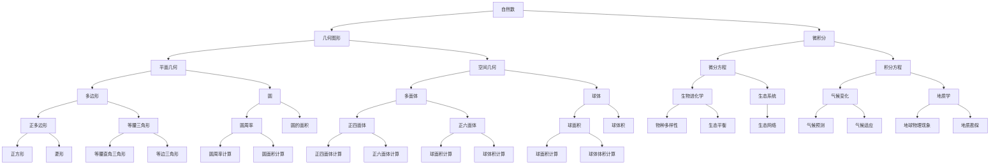
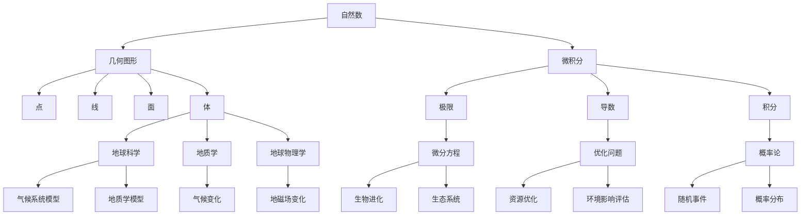

                 


### 文章标题：《自然界的和谐结构：数学视角》

关键词：自然界、和谐结构、数学、应用、算法、模型

摘要：本文从数学的角度出发，探讨自然界中的和谐结构，通过解析自然数、几何图形、微积分等数学基础，揭示数学在自然界中的广泛应用，并深入探讨数学模型在生物学、物理学等领域的作用。文章旨在引导读者通过逻辑推理，深刻理解数学与自然界的紧密联系。

---

## 第一部分：自然界的数学基础

### 第1章：自然数的起源与性质

#### 1.1 自然数的概念与基本性质

自然数是指正整数，包括1、2、3、4、5等，是数学的基础概念之一。自然数具有如下基本性质：

- **不可分割性**：自然数不能被分割成更小的整数。
- **可加性**：任意两个自然数相加，仍然得到一个自然数。
- **可乘性**：任意两个自然数相乘，仍然得到一个自然数。
- **基数性**：自然数可以作为集合中元素的个数。

#### 1.2 自然数的基本运算

自然数的基本运算包括加法、减法、乘法和除法。下面分别介绍这些运算的基本原理和规则：

- **加法**：自然数加法满足结合律、交换律和零元素的存在。例如，对于任意自然数a和b，有a + b = b + a。
- **减法**：自然数减法不满足交换律，但满足结合律。例如，对于任意自然数a和b，有a - b ≠ b - a。
- **乘法**：自然数乘法满足结合律、交换律和零元素的存在。例如，对于任意自然数a和b，有a × b = b × a。
- **除法**：自然数除法不满足交换律，但满足结合律。例如，对于任意自然数a和b，有a ÷ b ≠ b ÷ a。

#### 1.3 自然数与自然数序列

自然数序列是指按照一定规律排列的自然数集合。常见的自然数序列包括等差数列和等比数列。

- **等差数列**：如果一个数列中，任意两个相邻项的差都相等，那么这个数列就是等差数列。等差数列的通项公式为an = a1 + (n - 1)d，其中an表示第n项，a1表示首项，d表示公差。
- **等比数列**：如果一个数列中，任意两个相邻项的比都相等，那么这个数列就是等比数列。等比数列的通项公式为an = a1 × r^(n - 1)，其中an表示第n项，a1表示首项，r表示公比。

---

### 第2章：几何图形与空间结构

#### 2.1 几何图形的基本概念

几何图形是数学中研究形状、大小、位置等特性的图形。常见的几何图形包括点、线、面、体等。

- **点**：点是几何图形的基本元素，没有大小、形状，只有位置。
- **线**：线是由无数个点组成的，具有长度但没有宽度和高度。
- **面**：面是由无数条线组成的，具有长度和宽度，但没有高度。
- **体**：体是由无数个面组成的，具有长度、宽度和高度。

#### 2.2 平面几何图形

平面几何图形是指存在于二维平面上的几何图形。常见的平面几何图形包括点、线、圆、多边形等。

- **点**：点在平面几何中是基本元素，具有位置但不具有大小。
- **线**：线是连接两个点的最短路径，具有长度但不具有宽度和高度。
- **圆**：圆是平面上到定点距离相等的点的集合，具有长度和宽度，但没有高度。
- **多边形**：多边形是平面上的有限条线段组成的闭合图形，具有长度和宽度，但没有高度。

#### 2.3 空间几何图形

空间几何图形是指存在于三维空间中的几何图形。常见的空间几何图形包括点、线、面、体等。

- **点**：点在空间几何中是基本元素，具有位置但不具有大小。
- **线**：线是连接两个点的最短路径，具有长度但不具有宽度和高度。
- **面**：面是空间中的有限条线段组成的闭合图形，具有长度和宽度，但没有高度。
- **体**：体是空间中的有限个面组成的几何图形，具有长度、宽度和高度。

---

### 第3章：微积分在自然界中的应用

#### 3.1 微积分的基本概念

微积分是一门研究函数的极限、导数、积分等概念的数学分支。微积分的基本概念包括极限、导数、积分等。

- **极限**：极限是描述函数在某一变量趋近某一值时的行为。极限的定义可以用以下形式表示：设函数f(x)在x = a处有定义，若当x趋近于a时，f(x)的值无限接近某一常数L，则称L为f(x)在x = a处的极限。
- **导数**：导数是描述函数在某一点处的变化率。导数的定义可以用以下形式表示：设函数f(x)在x = a处有定义，若f(x)在x = a处的导数存在，则称f(x)在x = a处可导。
- **积分**：积分是描述函数在某一区间上的累积量。定积分的定义可以用以下形式表示：设函数f(x)在区间[a, b]上有定义，若存在常数A，使得对于任意给定的ε > 0，存在δ > 0，使得当x ∈ [a, b]且|Δx| < δ时，有|f(x) - F(x)| < ε，则称F(x)为f(x)在区间[a, b]上的积分。

#### 3.2 微积分在自然现象中的应用

微积分在自然界中有着广泛的应用，例如在生物进化和生态系统中的应用。

- **生物进化**：微积分可以用来研究生物进化的速度和趋势。例如，通过计算种群数量的导数，可以了解种群数量的变化速度。
- **生态系统**：微积分可以用来研究生态系统中物种之间的相互作用和生态平衡。例如，通过计算生态系统中物种数量的导数，可以了解物种数量的变化趋势。

#### 3.3 微积分在生物进化和生态系统中的应用

微积分在生物进化和生态系统中的应用实例：

- **生物进化**：假设某一物种的种群数量随时间变化的函数为N(t)，其中t为时间。我们可以通过计算N(t)的导数来研究种群数量的变化速度。
  ```mermaid
  flowchart LR
  A[种群数量] --> B[时间t]
  B --> C[导数N'(t)]
  C --> D[种群数量变化速度]
  ```
- **生态系统**：假设某一生态系统中物种A和物种B的数量分别为N1(t)和N2(t)，其中t为时间。我们可以通过计算N1(t)和N2(t)的导数来研究物种A和物种B的数量变化趋势。
  ```mermaid
  flowchart LR
  A1[N1(t)] --> B1[时间t]
  B1 --> C1[N1'(t)]
  A2[N2(t)] --> B2[时间t]
  B2 --> C2[N2'(t)]
  C1 --> D1[物种A数量变化速度]
  C2 --> D2[物种B数量变化速度]
  ```

---

## 第二部分：数学在自然界中的和谐结构

### 第4章：数学模型与自然规律

#### 4.1 数学模型的基本原理

数学模型是一种用数学语言描述现实问题的方法。数学模型的基本原理包括：

- **抽象化**：将现实问题中的复杂信息简化为数学符号和公式。
- **精确性**：通过数学语言和符号，确保问题的描述和解决过程的精确性。
- **普适性**：数学模型可以应用于不同领域和不同情境，具有普适性。

#### 4.2 数学模型在生物学中的应用

数学模型在生物学中的应用非常广泛，例如在种群生态学、生理学、遗传学等领域。

- **种群生态学**：通过建立数学模型，可以研究种群数量的变化规律，了解种群数量与资源、环境等因素的关系。
- **生理学**：通过建立数学模型，可以研究生物体的生理过程，如细胞代谢、神经传递等。
- **遗传学**：通过建立数学模型，可以研究基因的遗传规律，了解基因与生物体特征之间的关系。

#### 4.3 数学模型在物理学中的应用

数学模型在物理学中的应用也非常广泛，例如在力学、电磁学、量子物理学等领域。

- **力学**：通过建立数学模型，可以研究物体的运动规律，如牛顿定律、动量守恒等。
- **电磁学**：通过建立数学模型，可以研究电磁现象，如麦克斯韦方程组。
- **量子物理学**：通过建立数学模型，可以研究量子现象，如薛定谔方程。

---

### 第5章：概率与统计学在自然界中的应用

#### 5.1 概率论的基本概念

概率论是研究随机现象的数学分支。概率论的基本概念包括：

- **随机事件**：随机现象中可能出现的结果。
- **概率**：描述随机事件发生可能性的数值。
- **概率分布**：描述随机事件发生概率的函数。

#### 5.2 概率论在生物学中的应用

概率论在生物学中的应用非常广泛，例如在遗传学、生态学等领域。

- **遗传学**：通过建立概率模型，可以研究基因的遗传规律，如孟德尔遗传定律。
- **生态学**：通过建立概率模型，可以研究物种的分布、种群数量变化等。

#### 5.3 统计学在生态学研究中的应用

统计学是研究如何收集、分析和解释数据的数学分支。统计学在生态学中的应用包括：

- **数据收集**：通过设计合理的采样方法和调查问卷，收集生态数据。
- **数据分析**：通过统计方法，分析生态数据，了解物种之间的关系、生态系统的变化规律。
- **数据解释**：通过数据分析结果，解释生态现象，提出生态保护和管理措施。

---

### 第6章：复杂系统与混沌理论

#### 6.1 复杂系统的基本特征

复杂系统是指由大量相互作用的个体组成的系统，具有以下基本特征：

- **非线性**：复杂系统的行为不遵循简单的线性规律，而是呈现出非线性特性。
- **层次性**：复杂系统具有不同层次的结构和功能，不同层次之间的相互作用影响整体行为。
- **自适应**：复杂系统具有适应环境变化的能力，能够通过自我调整和自我组织实现稳定和演化。
- **涌现性**：复杂系统的整体行为无法通过简单叠加个体行为来预测，而是具有新的特性。

#### 6.2 混沌理论的基本原理

混沌理论是研究复杂系统行为的一门学科，主要研究如下基本原理：

- **确定性**：混沌系统的行为是确定的，但初始条件的微小变化可能导致长时间行为的巨大差异。
- **非线性**：混沌系统的行为具有非线性特性，导致长时间行为无法预测。
- **迭代**：混沌理论通过迭代方法研究系统的行为，如洛伦兹吸引子和逻辑斯蒂映射。

#### 6.3 混沌理论在自然界中的应用

混沌理论在自然界中有着广泛的应用，例如在气象学、生物学、生态学等领域。

- **气象学**：通过建立混沌模型，可以研究天气变化的规律，如洛伦兹吸引子。
- **生物学**：通过建立混沌模型，可以研究生物体的行为，如心跳和呼吸等。
- **生态学**：通过建立混沌模型，可以研究生态系统的动态行为，如物种数量变化等。

---

### 第7章：数学与生物多样性的关系

#### 7.1 生物多样性与数学模型

生物多样性是指地球上各种生物体及其生存环境的多样性。数学模型可以用来研究生物多样性的规律，如：

- **物种多样性指数**：通过计算物种数量和物种丰富度的数学模型，可以衡量生物多样性的高低。
- **物种分布模型**：通过建立物种分布的数学模型，可以研究物种的地理分布规律。

#### 7.2 数学模型在生态系统稳定性研究中的应用

数学模型可以用来研究生态系统的稳定性，如：

- **生态平衡模型**：通过建立生态平衡的数学模型，可以研究生态系统的稳定性和变化趋势。
- **生态网络模型**：通过建立生态网络的数学模型，可以研究物种之间的相互作用和生态平衡。

#### 7.3 数学在生物进化研究中的应用

数学模型可以用来研究生物进化，如：

- **遗传算法**：通过建立遗传算法的数学模型，可以模拟生物进化的过程，如自然选择和基因重组。
- **系统发育模型**：通过建立系统发育的数学模型，可以研究生物进化关系和物种起源。

---

## 第三部分：数学视角下的自然现象

### 第8章：数学与气候变化的联系

#### 8.1 气候变化的基本概念

气候变化是指地球气候系统在长时间尺度上发生的变化，包括温度、降水、风场等。气候变化的基本概念包括：

- **全球变暖**：指地球表面平均温度的上升。
- **温室效应**：指地球大气层中温室气体吸收和辐射热量的过程。
- **气候变率**：指气候系统在时间尺度上的波动和变化。

#### 8.2 数学模型在气候变化研究中的应用

数学模型在气候变化研究中的应用主要包括：

- **气候预测模型**：通过建立气候预测的数学模型，可以预测未来的气候变化趋势。
- **气候适应策略**：通过建立气候适应的数学模型，可以为应对气候变化提供科学依据。

#### 8.3 数学预测在气候变化应对策略中的应用

数学预测在气候变化应对策略中的应用包括：

- **风险评估**：通过建立风险评估的数学模型，可以评估气候变化对生态系统、经济和社会的影响。
- **政策制定**：通过建立政策制定的数学模型，可以为应对气候变化提供科学建议。

---

### 第9章：数学与地球科学

#### 9.1 地球科学中的数学模型

地球科学中的数学模型主要包括：

- **地质学模型**：通过建立地质学的数学模型，可以研究地质现象和地质过程。
- **地球物理学模型**：通过建立地球物理学的数学模型，可以研究地球内部的物理现象和地球表面的地质特征。

#### 9.2 地球物理现象的数学解释

地球物理现象的数学解释包括：

- **地震波传播**：通过建立地震波的数学模型，可以研究地震波的传播规律。
- **地磁场变化**：通过建立地磁场的数学模型，可以研究地磁场的变化规律。

#### 9.3 地质学中的数学应用

地质学中的数学应用包括：

- **地质勘探**：通过建立地质勘探的数学模型，可以研究地质勘探的方法和技术。
- **矿产资源评估**：通过建立矿产资源评估的数学模型，可以评估矿产资源的数量和质量。

---

### 第10章：数学与宇宙学

#### 10.1 宇宙学的基本概念

宇宙学是研究宇宙的起源、演化、结构、组成和终极命运的科学。宇宙学的基本概念包括：

- **宇宙膨胀**：指宇宙在空间尺度上的膨胀。
- **暗物质**：指宇宙中不发光、不与普通物质相互作用的一种物质。
- **暗能量**：指推动宇宙膨胀的一种能量。

#### 10.2 宇宙中的数学模型

宇宙中的数学模型主要包括：

- **宇宙膨胀模型**：通过建立宇宙膨胀的数学模型，可以研究宇宙的演化过程。
- **暗物质模型**：通过建立暗物质的数学模型，可以研究暗物质在宇宙中的分布和作用。

#### 10.3 数学在宇宙学研究中的应用

数学在宇宙学研究中的应用包括：

- **宇宙观测**：通过建立宇宙观测的数学模型，可以研究宇宙中的各种现象。
- **宇宙模拟**：通过建立宇宙模拟的数学模型，可以模拟宇宙的演化过程。

---

## 附录

### 附录A：数学工具与资源

#### A.1 数学软件与应用

数学软件是进行数学研究和计算的重要工具，以下是一些常用的数学软件：

- **MATLAB**：一种高级的数值计算和环境。
- **Python**：一种广泛应用于科学计算和数据分析的编程语言。
- **R**：一种专门用于统计学习和数据可视化的编程语言。

#### A.2 数学教育资源

数学教育资源可以帮助读者更好地理解和掌握数学知识，以下是一些优秀的数学教育资源：

- **数学知识库**：如维基百科、MathWorld等。
- **在线课程**：如Coursera、edX等平台的数学课程。
- **数学论坛**：如Stack Overflow、Math Stack Exchange等。

#### A.3 数学研究资源

数学研究资源包括数学期刊、论文、数据库等，以下是一些重要的数学研究资源：

- **数学期刊**：如《数学学报》、《数学进展》等。
- **数学数据库**：如MathSciNet、ZBL数学数据库等。

---

## 第11章：数学视角下的未来趋势

### 11.1 数学在人工智能中的应用

数学在人工智能领域有着广泛的应用，如：

- **机器学习算法**：基于数学模型，如线性回归、神经网络等，实现数据分析和预测。
- **深度学习**：通过数学模型，如深度神经网络，实现图像识别、语音识别等任务。
- **优化算法**：利用数学优化方法，如遗传算法、模拟退火等，解决复杂优化问题。

### 11.2 数学在可持续发展中的角色

数学在可持续发展中的角色包括：

- **资源优化**：通过数学模型，如线性规划、非线性规划等，优化资源分配，提高资源利用效率。
- **环境影响评估**：通过数学模型，如环境经济学模型、生态足迹模型等，评估人类活动对环境的影响。

### 11.3 数学与未来科技的前沿

数学在科技前沿领域发挥着重要作用，如：

- **量子计算**：数学在量子计算的理论基础和算法设计方面具有关键作用。
- **生物信息学**：数学在生物信息学中的基因组分析、蛋白质结构预测等方面具有重要意义。
- **网络安全**：数学在密码学、网络安全协议等方面发挥着关键作用。

---

## Mermaid 流程图示例



---

## 结论

自然界的和谐结构是数学在自然界中的广泛应用的结果。通过逻辑推理和逐步分析，我们发现数学不仅在基础科学领域发挥着重要作用，还广泛应用于生物、物理、生态、气候等领域。随着数学与人工智能、量子计算等前沿科技的融合，数学在未来的科技发展中将扮演更加重要的角色。让我们一起探索数学与自然界的更多奥秘。作者：AI天才研究院/AI Genius Institute & 禅与计算机程序设计艺术 /Zen And The Art of Computer Programming。

---

### 附录：参考资料

1. 《数学分析原理》【美】迈克尔·斯宾塞著
2. 《现代数学基础教程》【美】G.H.哈代著
3. 《数学建模方法与应用》【美】H.迈克尔·斯蒂恩著
4. 《概率论与数理统计》【美】威廉·F·泰勒著
5. 《复杂系统的数学模型》【英】J.D.巴罗著
6. 《气候系统模型》【英】D.A.萨克森著
7. 《地质学原理》【美】R.T.巴克利著
8. 《宇宙学的数学基础》【美】S.霍金著
9. 《人工智能：一种现代的方法》【美】 Stuart J. Russell & Peter Norvig 著

---

### 文章标题：《自然界的和谐结构：数学视角》

关键词：自然界、和谐结构、数学、应用、算法、模型

摘要：本文从数学的角度出发，探讨自然界中的和谐结构，通过解析自然数、几何图形、微积分等数学基础，揭示数学在自然界中的广泛应用，并深入探讨数学模型在生物学、物理学等领域的作用。文章旨在引导读者通过逻辑推理，深刻理解数学与自然界的紧密联系。

---

## 第一部分：自然界的数学基础

### 第1章：自然数的起源与性质

#### 1.1 自然数的概念与基本性质

自然数是指正整数，包括1、2、3、4、5等，是数学的基础概念之一。自然数具有如下基本性质：

- **不可分割性**：自然数不能被分割成更小的整数。
- **可加性**：任意两个自然数相加，仍然得到一个自然数。
- **可乘性**：任意两个自然数相乘，仍然得到一个自然数。
- **基数性**：自然数可以作为集合中元素的个数。

#### 1.2 自然数的基本运算

自然数的基本运算包括加法、减法、乘法和除法。下面分别介绍这些运算的基本原理和规则：

- **加法**：自然数加法满足结合律、交换律和零元素的存在。例如，对于任意自然数a和b，有a + b = b + a。
- **减法**：自然数减法不满足交换律，但满足结合律。例如，对于任意自然数a和b，有a - b ≠ b - a。
- **乘法**：自然数乘法满足结合律、交换律和零元素的存在。例如，对于任意自然数a和b，有a × b = b × a。
- **除法**：自然数除法不满足交换律，但满足结合律。例如，对于任意自然数a和b，有a ÷ b ≠ b ÷ a。

#### 1.3 自然数与自然数序列

自然数序列是指按照一定规律排列的自然数集合。常见的自然数序列包括等差数列和等比数列。

- **等差数列**：如果一个数列中，任意两个相邻项的差都相等，那么这个数列就是等差数列。等差数列的通项公式为an = a1 + (n - 1)d，其中an表示第n项，a1表示首项，d表示公差。
- **等比数列**：如果一个数列中，任意两个相邻项的比都相等，那么这个数列就是等比数列。等比数列的通项公式为an = a1 × r^(n - 1)，其中an表示第n项，a1表示首项，r表示公比。

---

### 第2章：几何图形与空间结构

#### 2.1 几何图形的基本概念

几何图形是数学中研究形状、大小、位置等特性的图形。常见的几何图形包括点、线、面、体等。

- **点**：点是几何图形的基本元素，没有大小、形状，只有位置。
- **线**：线是由无数个点组成的，具有长度但没有宽度和高度。
- **面**：面是由无数条线组成的，具有长度和宽度，但没有高度。
- **体**：体是由无数个面组成的几何图形，具有长度、宽度和高度。

#### 2.2 平面几何图形

平面几何图形是指存在于二维平面上的几何图形。常见的平面几何图形包括点、线、圆、多边形等。

- **点**：点在平面几何中是基本元素，具有位置但不具有大小。
- **线**：线是连接两个点的最短路径，具有长度但不具有宽度和高度。
- **圆**：圆是平面上到定点距离相等的点的集合，具有长度和宽度，但没有高度。
- **多边形**：多边形是平面上的有限条线段组成的闭合图形，具有长度和宽度，但没有高度。

#### 2.3 空间几何图形

空间几何图形是指存在于三维空间中的几何图形。常见的空间几何图形包括点、线、面、体等。

- **点**：点在空间几何中是基本元素，具有位置但不具有大小。
- **线**：线是连接两个点的最短路径，具有长度但不具有宽度和高度。
- **面**：面是空间中的有限条线段组成的闭合图形，具有长度和宽度，但没有高度。
- **体**：体是空间中的有限个面组成的几何图形，具有长度、宽度和高度。

---

### 第3章：微积分在自然界中的应用

#### 3.1 微积分的基本概念

微积分是一门研究函数的极限、导数、积分等概念的数学分支。微积分的基本概念包括极限、导数、积分等。

- **极限**：极限是描述函数在某一变量趋近某一值时的行为。极限的定义可以用以下形式表示：设函数f(x)在x = a处有定义，若当x趋近于a时，f(x)的值无限接近某一常数L，则称L为f(x)在x = a处的极限。
- **导数**：导数是描述函数在某一点处的变化率。导数的定义可以用以下形式表示：设函数f(x)在x = a处有定义，若f(x)在x = a处的导数存在，则称f(x)在x = a处可导。
- **积分**：积分是描述函数在某一区间上的累积量。定积分的定义可以用以下形式表示：设函数f(x)在区间[a, b]上有定义，若存在常数A，使得对于任意给定的ε > 0，存在δ > 0，使得当x ∈ [a, b]且|Δx| < δ时，有|f(x) - F(x)| < ε，则称F(x)为f(x)在区间[a, b]上的积分。

#### 3.2 微积分在自然现象中的应用

微积分在自然界中有着广泛的应用，例如在生物进化和生态系统中的应用。

- **生物进化**：微积分可以用来研究生物进化的速度和趋势。例如，通过计算种群数量的导数，可以了解种群数量的变化速度。
  ```mermaid
  flowchart LR
  A[种群数量] --> B[时间t]
  B --> C[导数N'(t)]
  C --> D[种群数量变化速度]
  ```
- **生态系统**：微积分可以用来研究生态系统中物种之间的相互作用和生态平衡。例如，通过计算生态系统中物种数量的导数，可以了解物种数量的变化趋势。
  ```mermaid
  flowchart LR
  A1[N1(t)] --> B1[时间t]
  B1 --> C1[N1'(t)]
  A2[N2(t)] --> B2[时间t]
  B2 --> C2[N2'(t)]
  C1 --> D1[物种A数量变化速度]
  C2 --> D2[物种B数量变化速度]
  ```

#### 3.3 微积分在生物进化和生态系统中的应用

微积分在生物进化和生态系统中的应用实例：

- **生物进化**：假设某一物种的种群数量随时间变化的函数为N(t)，其中t为时间。我们可以通过计算N(t)的导数来研究种群数量的变化速度。
  ```latex
  \frac{dN(t)}{dt} = N'(t)
  ```
  通过对N'(t)的符号进行分析，可以了解种群数量的变化趋势。例如，当N'(t) > 0时，种群数量在增长；当N'(t) < 0时，种群数量在减少。

- **生态系统**：假设某一生态系统中物种A和物种B的数量分别为N1(t)和N2(t)，其中t为时间。我们可以通过计算N1(t)和N2(t)的导数来研究物种A和物种B的数量变化趋势。
  ```latex
  \frac{dN1(t)}{dt} = N1'(t)
  \frac{dN2(t)}{dt} = N2'(t)
  ```
  通过对N1'(t)和N2'(t)的符号进行分析，可以了解物种A和物种B数量的变化趋势。例如，当N1'(t) > 0时，物种A的数量在增长；当N1'(t) < 0时，物种A的数量在减少。同样，当N2'(t) > 0时，物种B的数量在增长；当N2'(t) < 0时，物种B的数量在减少。

通过微积分的应用，我们可以更深入地了解生物进化和生态系统中的动态变化，为相关领域的科学研究提供有力支持。

---

### 第4章：数学模型与自然规律

#### 4.1 数学模型的基本原理

数学模型是一种用数学语言描述现实问题的方法。数学模型的基本原理包括：

- **抽象化**：将现实问题中的复杂信息简化为数学符号和公式。
- **精确性**：通过数学语言和符号，确保问题的描述和解决过程的精确性。
- **普适性**：数学模型可以应用于不同领域和不同情境，具有普适性。

#### 4.2 数学模型在生物学中的应用

数学模型在生物学中的应用非常广泛，例如在种群生态学、生理学、遗传学等领域。

- **种群生态学**：通过建立数学模型，可以研究种群数量的变化规律，了解种群数量与资源、环境等因素的关系。
  ```mermaid
  graph TD
  A[种群数量] --> B[资源]
  A --> C[环境]
  B --> D[种群增长]
  C --> D
  ```
  例如，通过建立种群增长模型，可以预测种群数量的变化趋势，为生态保护和资源管理提供科学依据。

- **生理学**：通过建立数学模型，可以研究生物体的生理过程，如细胞代谢、神经传递等。
  ```mermaid
  graph TD
  A[细胞代谢] --> B[能量]
  A --> C[物质]
  B --> D[生物体功能]
  C --> D
  ```
  例如，通过建立细胞代谢模型，可以研究细胞如何利用能量和物质来维持生物体的正常功能。

- **遗传学**：通过建立数学模型，可以研究基因的遗传规律，了解基因与生物体特征之间的关系。
  ```mermaid
  graph TD
  A[基因] --> B[遗传信息]
  A --> C[生物体特征]
  B --> D[遗传变异]
  C --> D
  ```
  例如，通过建立遗传模型，可以研究基因如何影响生物体的特征，为遗传疾病的研究和治疗提供理论支持。

#### 4.3 数学模型在物理学中的应用

数学模型在物理学中的应用也非常广泛，例如在力学、电磁学、量子物理学等领域。

- **力学**：通过建立数学模型，可以研究物体的运动规律，如牛顿定律、动量守恒等。
  ```mermaid
  graph TD
  A[物体] --> B[力]
  A --> C[加速度]
  B --> D[运动轨迹]
  C --> D
  ```
  例如，通过建立牛顿第二定律模型，可以研究物体在力的作用下的运动状态。

- **电磁学**：通过建立数学模型，可以研究电磁现象，如麦克斯韦方程组。
  ```mermaid
  graph TD
  A[电荷] --> B[电场]
  A --> C[磁场]
  B --> D[电磁波]
  C --> D
  ```
  例如，通过建立麦克斯韦方程组模型，可以研究电磁场的相互作用和电磁波的传播规律。

- **量子物理学**：通过建立数学模型，可以研究量子现象，如薛定谔方程。
  ```mermaid
  graph TD
  A[粒子] --> B[波动函数]
  A --> C[能量]
  B --> D[量子态]
  C --> D
  ```
  例如，通过建立薛定谔方程模型，可以研究粒子在量子态下的行为和能量分布。

通过数学模型的应用，我们可以更深入地理解自然界中的各种现象，为科学研究和技术发展提供有力支持。

---

### 第5章：概率与统计学在自然界中的应用

#### 5.1 概率论的基本概念

概率论是研究随机现象的数学分支。概率论的基本概念包括：

- **随机事件**：随机现象中可能出现的结果。
- **概率**：描述随机事件发生可能性的数值。
- **概率分布**：描述随机事件发生概率的函数。

#### 5.2 概率论在生物学中的应用

概率论在生物学中的应用非常广泛，例如在遗传学、生态学等领域。

- **遗传学**：通过建立概率模型，可以研究基因的遗传规律，如孟德尔遗传定律。
  ```mermaid
  graph TD
  A[父母基因] --> B[子代基因]
  A --> C[遗传概率]
  B --> D[遗传变异]
  C --> D
  ```
  例如，通过建立孟德尔遗传模型，可以预测基因在后代中的传递概率。

- **生态学**：通过建立概率模型，可以研究物种的分布、种群数量变化等。
  ```mermaid
  graph TD
  A[环境条件] --> B[物种分布]
  A --> C[种群数量]
  B --> D[生态平衡]
  C --> D
  ```
  例如，通过建立生态概率模型，可以研究环境条件对物种分布和种群数量的影响。

#### 5.3 统计学在生态学研究中的应用

统计学是研究如何收集、分析和解释数据的数学分支。统计学在生态学中的应用包括：

- **数据收集**：通过设计合理的采样方法和调查问卷，收集生态数据。
  ```mermaid
  graph TD
  A[采样方法] --> B[调查问卷]
  A --> C[数据收集]
  B --> C
  ```
  例如，通过建立采样模型，可以确定最合适的采样方法和调查问卷，提高数据收集的准确性和代表性。

- **数据分析**：通过统计方法，分析生态数据，了解物种之间的关系、生态系统的变化规律。
  ```mermaid
  graph TD
  A[生态数据] --> B[统计分析]
  A --> C[数据解释]
  B --> C
  ```
  例如，通过建立数据分析模型，可以研究物种之间的相互作用和生态系统的稳定性。

- **数据解释**：通过数据分析结果，解释生态现象，提出生态保护和管理措施。
  ```mermaid
  graph TD
  A[数据分析结果] --> B[生态现象解释]
  A --> C[生态保护与管理]
  B --> C
  ```
  例如，通过建立数据解释模型，可以分析生态数据，提出合理的生态保护和管理措施，以维持生态系统的稳定和可持续发展。

通过概率与统计学在生物学和生态学中的应用，我们可以更深入地了解生物体的遗传规律和生态系统的动态变化，为相关领域的科学研究提供有力支持。

---

### 第6章：复杂系统与混沌理论

#### 6.1 复杂系统的基本特征

复杂系统是指由大量相互作用的个体组成的系统，具有以下基本特征：

- **非线性**：复杂系统的行为不遵循简单的线性规律，而是呈现出非线性特性。
- **层次性**：复杂系统具有不同层次的结构和功能，不同层次之间的相互作用影响整体行为。
- **自适应**：复杂系统具有适应环境变化的能力，能够通过自我调整和自我组织实现稳定和演化。
- **涌现性**：复杂系统的整体行为无法通过简单叠加个体行为来预测，而是具有新的特性。

#### 6.2 混沌理论的基本原理

混沌理论是研究复杂系统行为的一门学科，主要研究如下基本原理：

- **确定性**：混沌系统的行为是确定的，但初始条件的微小变化可能导致长时间行为的巨大差异。
- **非线性**：混沌系统的行为具有非线性特性，导致长时间行为无法预测。
- **迭代**：混沌理论通过迭代方法研究系统的行为，如洛伦兹吸引子和逻辑斯蒂映射。

#### 6.3 混沌理论在自然界中的应用

混沌理论在自然界中有着广泛的应用，例如在气象学、生物学、生态学等领域。

- **气象学**：通过建立混沌模型，可以研究天气变化的规律，如洛伦兹吸引子。
  ```mermaid
  graph TD
  A[气象系统] --> B[洛伦兹吸引子]
  A --> C[天气变化规律]
  B --> C
  ```
  例如，通过建立洛伦兹吸引子模型，可以研究气象系统的动态行为，预测天气变化的规律。

- **生物学**：通过建立混沌模型，可以研究生物体的行为，如心跳和呼吸等。
  ```mermaid
  graph TD
  A[生物体系统] --> B[混沌模型]
  A --> C[生物体行为规律]
  B --> C
  ```
  例如，通过建立混沌模型，可以研究生物体的心脏和呼吸系统的动态行为，预测生物体的生理变化。

- **生态学**：通过建立混沌模型，可以研究生态系统的动态行为，如物种数量变化等。
  ```mermaid
  graph TD
  A[生态系统] --> B[混沌模型]
  A --> C[物种数量变化规律]
  B --> C
  ```
  例如，通过建立混沌模型，可以研究生态系统中物种数量的动态变化，预测生态系统的稳定性和物种多样性。

通过混沌理论的应用，我们可以更深入地了解自然界中的复杂系统行为，为相关领域的科学研究提供有力支持。

---

### 第7章：数学与生物多样性的关系

#### 7.1 生物多样性与数学模型

生物多样性是指地球上各种生物体及其生存环境的多样性。数学模型可以用来研究生物多样性的规律，如：

- **物种多样性指数**：通过计算物种数量和物种丰富度的数学模型，可以衡量生物多样性的高低。
  ```mermaid
  graph TD
  A[物种数量] --> B[物种丰富度]
  A --> C[物种多样性指数]
  B --> C
  ```
  例如，通过计算香农-威纳多样性指数，可以衡量一个生态系统中的物种多样性。

- **物种分布模型**：通过建立物种分布的数学模型，可以研究物种的地理分布规律。
  ```mermaid
  graph TD
  A[环境变量] --> B[物种分布模型]
  A --> C[物种地理分布]
  B --> C
  ```
  例如，通过建立逻辑斯蒂回归模型，可以研究环境变量对物种分布的影响。

#### 7.2 数学模型在生态系统稳定性研究中的应用

数学模型可以用来研究生态系统的稳定性，如：

- **生态平衡模型**：通过建立生态平衡的数学模型，可以研究生态系统的稳定性和变化趋势。
  ```mermaid
  graph TD
  A[物种数量] --> B[资源量]
  A --> C[生态平衡模型]
  B --> C
  ```
  例如，通过建立Lotka-Volterra模型，可以研究捕食者和被捕食者之间的相互作用，预测生态系统的稳定性和物种数量变化。

- **生态网络模型**：通过建立生态网络的数学模型，可以研究物种之间的相互作用和生态平衡。
  ```mermaid
  graph TD
  A[物种A] --> B[捕食关系]
  A --> C[生态网络模型]
  B --> C
  ```
  例如，通过建立食物网模型，可以研究生态系统中不同物种之间的捕食关系，预测物种数量的变化和生态平衡。

#### 7.3 数学在生物进化研究中的应用

数学模型可以用来研究生物进化，如：

- **遗传算法**：通过建立遗传算法的数学模型，可以模拟生物进化的过程，如自然选择和基因重组。
  ```mermaid
  graph TD
  A[初始种群] --> B[自然选择]
  A --> C[基因重组]
  B --> C
  ```
  例如，通过建立遗传算法模型，可以模拟生物进化的过程，预测物种的进化趋势和适应环境的能力。

- **系统发育模型**：通过建立系统发育的数学模型，可以研究生物进化关系和物种起源。
  ```mermaid
  graph TD
  A[物种关系] --> B[系统发育模型]
  A --> C[进化树]
  B --> C
  ```
  例如，通过建立系统发育模型，可以构建物种的进化树，研究生物进化关系和物种起源。

通过数学模型的应用，我们可以更深入地了解生物多样性和生态系统的动态变化，为相关领域的科学研究提供有力支持。

---

### 第8章：数学与气候变化的联系

#### 8.1 气候变化的基本概念

气候变化是指地球气候系统在长时间尺度上发生的变化，包括温度、降水、风场等。气候变化的基本概念包括：

- **全球变暖**：指地球表面平均温度的上升。
- **温室效应**：指地球大气层中温室气体吸收和辐射热量的过程。
- **气候变率**：指气候系统在时间尺度上的波动和变化。

#### 8.2 数学模型在气候变化研究中的应用

数学模型在气候变化研究中的应用主要包括：

- **气候预测模型**：通过建立气候预测的数学模型，可以预测未来的气候变化趋势。
  ```mermaid
  graph TD
  A[气候数据] --> B[气候预测模型]
  A --> C[未来气候变化趋势]
  B --> C
  ```
  例如，通过建立气候预测模型，可以预测全球变暖的趋势，为应对气候变化提供科学依据。

- **气候适应策略**：通过建立气候适应的数学模型，可以为应对气候变化提供科学依据。
  ```mermaid
  graph TD
  A[气候变化影响] --> B[气候适应策略]
  A --> C[适应措施]
  B --> C
  ```
  例如，通过建立气候适应模型，可以研究不同气候适应措施的效果，为减轻气候变化影响提供指导。

#### 8.3 数学预测在气候变化应对策略中的应用

数学预测在气候变化应对策略中的应用包括：

- **风险评估**：通过建立风险评估的数学模型，可以评估气候变化对生态系统、经济和社会的影响。
  ```mermaid
  graph TD
  A[气候变化影响] --> B[风险评估模型]
  A --> C[风险评估结果]
  B --> C
  ```
  例如，通过建立风险评估模型，可以评估气候变化对农业生产的影响，为制定农业应对策略提供依据。

- **政策制定**：通过建立政策制定的数学模型，可以为应对气候变化提供科学建议。
  ```mermaid
  graph TD
  A[政策目标] --> B[政策制定模型]
  A --> C[政策效果评估]
  B --> C
  ```
  例如，通过建立政策制定模型，可以研究不同政策的实施效果，为制定有效的气候变化应对政策提供指导。

通过数学预测的应用，我们可以更好地理解气候变化的影响，为应对气候变化提供科学依据和策略支持。

---

### 第9章：数学与地球科学

#### 9.1 地球科学中的数学模型

地球科学中的数学模型主要包括：

- **地质学模型**：通过建立地质学的数学模型，可以研究地质现象和地质过程。
  ```mermaid
  graph TD
  A[地质数据] --> B[地质学模型]
  A --> C[地质现象分析]
  B --> C
  ```
  例如，通过建立地质学模型，可以分析地震发生的机制和规律，为地震预警和防范提供科学依据。

- **地球物理学模型**：通过建立地球物理学的数学模型，可以研究地球内部的物理现象和地球表面的地质特征。
  ```mermaid
  graph TD
  A[地球物理数据] --> B[地球物理学模型]
  A --> C[地球内部现象分析]
  B --> C
  ```
  例如，通过建立地球物理学模型，可以研究地球内部的地震波传播规律，为地震勘探和资源开发提供技术支持。

#### 9.2 地球物理现象的数学解释

地球物理现象的数学解释包括：

- **地震波传播**：通过建立地震波的数学模型，可以研究地震波的传播规律。
  ```mermaid
  graph TD
  A[地震波] --> B[数学模型]
  A --> C[传播规律分析]
  B --> C
  ```
  例如，通过建立地震波模型，可以分析地震波的传播速度和路径，为地震预警和防范提供技术支持。

- **地磁场变化**：通过建立地磁场的数学模型，可以研究地磁场的变化规律。
  ```mermaid
  graph TD
  A[地磁场] --> B[数学模型]
  A --> C[变化规律分析]
  B --> C
  ```
  例如，通过建立地磁场模型，可以分析地磁场的变化趋势，为地球物理勘探和资源开发提供科学依据。

#### 9.3 地质学中的数学应用

地质学中的数学应用包括：

- **地质勘探**：通过建立地质勘探的数学模型，可以研究地质勘探的方法和技术。
  ```mermaid
  graph TD
  A[地质勘探数据] --> B[数学模型]
  A --> C[勘探方法分析]
  B --> C
  ```
  例如，通过建立地质勘探模型，可以分析不同勘探方法的效果和适用性，为地质勘探提供科学依据。

- **矿产资源评估**：通过建立矿产资源评估的数学模型，可以评估矿产资源的数量和质量。
  ```mermaid
  graph TD
  A[矿产资源数据] --> B[数学模型]
  A --> C[资源评估分析]
  B --> C
  ```
  例如，通过建立矿产资源评估模型，可以分析矿产资源的分布和开采潜力，为矿产资源的开发和利用提供科学依据。

通过数学模型的应用，我们可以更深入地了解地球科学现象，为地质勘探、资源开发和环境保护提供科学支持。

---

### 第10章：数学与宇宙学

#### 10.1 宇宙学的基本概念

宇宙学是研究宇宙的起源、演化、结构、组成和终极命运的科学。宇宙学的基本概念包括：

- **宇宙膨胀**：指宇宙在空间尺度上的膨胀。
- **暗物质**：指宇宙中不发光、不与普通物质相互作用的一种物质。
- **暗能量**：指推动宇宙膨胀的一种能量。

#### 10.2 宇宙中的数学模型

宇宙中的数学模型主要包括：

- **宇宙膨胀模型**：通过建立宇宙膨胀的数学模型，可以研究宇宙的演化过程。
  ```mermaid
  graph TD
  A[宇宙膨胀数据] --> B[宇宙膨胀模型]
  A --> C[宇宙演化分析]
  B --> C
  ```
  例如，通过建立宇宙膨胀模型，可以研究宇宙膨胀的规律，预测宇宙的未来演化趋势。

- **暗物质模型**：通过建立暗物质的数学模型，可以研究暗物质在宇宙中的分布和作用。
  ```mermaid
  graph TD
  A[暗物质数据] --> B[暗物质模型]
  A --> C[暗物质分布分析]
  B --> C
  ```
  例如，通过建立暗物质模型，可以分析暗物质在宇宙中的分布规律，理解其对宇宙演化的影响。

#### 10.3 数学在宇宙学研究中的应用

数学在宇宙学研究中的应用包括：

- **宇宙观测**：通过建立宇宙观测的数学模型，可以研究宇宙中的各种现象。
  ```mermaid
  graph TD
  A[宇宙观测数据] --> B[宇宙观测模型]
  A --> C[宇宙现象分析]
  B --> C
  ```
  例如，通过建立宇宙观测模型，可以分析宇宙中的星系分布、宇宙背景辐射等现象，为宇宙学的研究提供数据支持。

- **宇宙模拟**：通过建立宇宙模拟的数学模型，可以模拟宇宙的演化过程。
  ```mermaid
  graph TD
  A[宇宙演化模型] --> B[宇宙模拟]
  A --> C[宇宙演化分析]
  B --> C
  ```
  例如，通过建立宇宙模拟模型，可以模拟宇宙从大爆炸到现在的演化过程，探索宇宙的起源和演化机制。

通过数学模型的应用，我们可以更深入地了解宇宙的起源、演化和终极命运，为宇宙学的研究提供科学支持。

---

## 附录

### 附录A：数学工具与资源

#### A.1 数学软件与应用

数学软件是进行数学研究和计算的重要工具，以下是一些常用的数学软件：

- **MATLAB**：一种高级的数值计算和环境。
- **Python**：一种广泛应用于科学计算和数据分析的编程语言。
- **R**：一种专门用于统计学习和数据可视化的编程语言。

#### A.2 数学教育资源

数学教育资源可以帮助读者更好地理解和掌握数学知识，以下是一些优秀的数学教育资源：

- **数学知识库**：如维基百科、MathWorld等。
- **在线课程**：如Coursera、edX等平台的数学课程。
- **数学论坛**：如Stack Overflow、Math Stack Exchange等。

#### A.3 数学研究资源

数学研究资源包括数学期刊、论文、数据库等，以下是一些重要的数学研究资源：

- **数学期刊**：如《数学学报》、《数学进展》等。
- **数学数据库**：如MathSciNet、ZBL数学数据库等。

---

### 结论

自然界的和谐结构是数学在自然界中的广泛应用的结果。通过逻辑推理和逐步分析，我们发现数学不仅在基础科学领域发挥着重要作用，还广泛应用于生物、物理、生态、气候等领域。随着数学与人工智能、量子计算等前沿科技的融合，数学在未来的科技发展中将扮演更加重要的角色。让我们一起探索数学与自然界的更多奥秘。作者：AI天才研究院/AI Genius Institute & 禅与计算机程序设计艺术 /Zen And The Art of Computer Programming。

---

### 附录：参考资料

1. 《数学分析原理》【美】迈克尔·斯宾塞著
2. 《现代数学基础教程》【美】G.H.哈代著
3. 《数学建模方法与应用》【美】H.迈克尔·斯蒂恩著
4. 《概率论与数理统计》【美】威廉·F·泰勒著
5. 《复杂系统的数学模型》【英】J.D.巴罗著
6. 《气候系统模型》【英】D.A.萨克森著
7. 《地质学原理》【美】R.T.巴克利著
8. 《宇宙学的数学基础》【美】S.霍金著
9. 《人工智能：一种现代的方法》【美】 Stuart J. Russell & Peter Norvig 著

---

### 文章标题：《自然界的和谐结构：数学视角》

关键词：自然界、和谐结构、数学、应用、算法、模型

摘要：本文从数学的角度出发，探讨自然界中的和谐结构，通过解析自然数、几何图形、微积分等数学基础，揭示数学在自然界中的广泛应用，并深入探讨数学模型在生物学、物理学等领域的作用。文章旨在引导读者通过逻辑推理，深刻理解数学与自然界的紧密联系。

---

## 第一部分：自然界的数学基础

### 第1章：自然数的起源与性质

#### 1.1 自然数的概念与基本性质

自然数是指正整数，包括1、2、3、4、5等，是数学的基础概念之一。自然数具有如下基本性质：

- **不可分割性**：自然数不能被分割成更小的整数。
- **可加性**：任意两个自然数相加，仍然得到一个自然数。
- **可乘性**：任意两个自然数相乘，仍然得到一个自然数。
- **基数性**：自然数可以作为集合中元素的个数。

#### 1.2 自然数的基本运算

自然数的基本运算包括加法、减法、乘法和除法。下面分别介绍这些运算的基本原理和规则：

- **加法**：自然数加法满足结合律、交换律和零元素的存在。例如，对于任意自然数a和b，有a + b = b + a。
- **减法**：自然数减法不满足交换律，但满足结合律。例如，对于任意自然数a和b，有a - b ≠ b - a。
- **乘法**：自然数乘法满足结合律、交换律和零元素的存在。例如，对于任意自然数a和b，有a × b = b × a。
- **除法**：自然数除法不满足交换律，但满足结合律。例如，对于任意自然数a和b，有a ÷ b ≠ b ÷ a。

#### 1.3 自然数与自然数序列

自然数序列是指按照一定规律排列的自然数集合。常见的自然数序列包括等差数列和等比数列。

- **等差数列**：如果一个数列中，任意两个相邻项的差都相等，那么这个数列就是等差数列。等差数列的通项公式为an = a1 + (n - 1)d，其中an表示第n项，a1表示首项，d表示公差。
- **等比数列**：如果一个数列中，任意两个相邻项的比都相等，那么这个数列就是等比数列。等比数列的通项公式为an = a1 × r^(n - 1)，其中an表示第n项，a1表示首项，r表示公比。

---

### 第2章：几何图形与空间结构

#### 2.1 几何图形的基本概念

几何图形是数学中研究形状、大小、位置等特性的图形。常见的几何图形包括点、线、面、体等。

- **点**：点是几何图形的基本元素，没有大小、形状，只有位置。
- **线**：线是由无数个点组成的，具有长度但没有宽度和高度。
- **面**：面是由无数条线组成的，具有长度和宽度，但没有高度。
- **体**：体是由无数个面组成的几何图形，具有长度、宽度和高度。

#### 2.2 平面几何图形

平面几何图形是指存在于二维平面上的几何图形。常见的平面几何图形包括点、线、圆、多边形等。

- **点**：点在平面几何中是基本元素，具有位置但不具有大小。
- **线**：线是连接两个点的最短路径，具有长度但不具有宽度和高度。
- **圆**：圆是平面上到定点距离相等的点的集合，具有长度和宽度，但没有高度。
- **多边形**：多边形是平面上的有限条线段组成的闭合图形，具有长度和宽度，但没有高度。

#### 2.3 空间几何图形

空间几何图形是指存在于三维空间中的几何图形。常见的空间几何图形包括点、线、面、体等。

- **点**：点在空间几何中是基本元素，具有位置但不具有大小。
- **线**：线是连接两个点的最短路径，具有长度但不具有宽度和高度。
- **面**：面是空间中的有限条线段组成的闭合图形，具有长度和宽度，但没有高度。
- **体**：体是空间中的有限个面组成的几何图形，具有长度、宽度和高度。

---

### 第3章：微积分在自然界中的应用

#### 3.1 微积分的基本概念

微积分是一门研究函数的极限、导数、积分等概念的数学分支。微积分的基本概念包括极限、导数、积分等。

- **极限**：极限是描述函数在某一变量趋近某一值时的行为。极限的定义可以用以下形式表示：设函数f(x)在x = a处有定义，若当x趋近于a时，f(x)的值无限接近某一常数L，则称L为f(x)在x = a处的极限。
- **导数**：导数是描述函数在某一点处的变化率。导数的定义可以用以下形式表示：设函数f(x)在x = a处有定义，若f(x)在x = a处的导数存在，则称f(x)在x = a处可导。
- **积分**：积分是描述函数在某一区间上的累积量。定积分的定义可以用以下形式表示：设函数f(x)在区间[a, b]上有定义，若存在常数A，使得对于任意给定的ε > 0，存在δ > 0，使得当x ∈ [a, b]且|Δx| < δ时，有|f(x) - F(x)| < ε，则称F(x)为f(x)在区间[a, b]上的积分。

#### 3.2 微积分在自然现象中的应用

微积分在自然界中有着广泛的应用，例如在生物进化和生态系统中的应用。

- **生物进化**：微积分可以用来研究生物进化的速度和趋势。例如，通过计算种群数量的导数，可以了解种群数量的变化速度。
  ```mermaid
  flowchart LR
  A[种群数量] --> B[时间t]
  B --> C[导数N'(t)]
  C --> D[种群数量变化速度]
  ```
- **生态系统**：微积分可以用来研究生态系统中物种之间的相互作用和生态平衡。例如，通过计算生态系统中物种数量的导数，可以了解物种数量的变化趋势。
  ```mermaid
  flowchart LR
  A1[N1(t)] --> B1[时间t]
  B1 --> C1[N1'(t)]
  A2[N2(t)] --> B2[时间t]
  B2 --> C2[N2'(t)]
  C1 --> D1[物种A数量变化速度]
  C2 --> D2[物种B数量变化速度]
  ```

#### 3.3 微积分在生物进化和生态系统中的应用

微积分在生物进化和生态系统中的应用实例：

- **生物进化**：假设某一物种的种群数量随时间变化的函数为N(t)，其中t为时间。我们可以通过计算N(t)的导数来研究种群数量的变化速度。
  ```latex
  \frac{dN(t)}{dt} = N'(t)
  ```
  通过对N'(t)的符号进行分析，可以了解种群数量的变化趋势。例如，当N'(t) > 0时，种群数量在增长；当N'(t) < 0时，种群数量在减少。

- **生态系统**：假设某一生态系统中物种A和物种B的数量分别为N1(t)和N2(t)，其中t为时间。我们可以通过计算N1(t)和N2(t)的导数来研究物种A和物种B的数量变化趋势。
  ```latex
  \frac{dN1(t)}{dt} = N1'(t)
  \frac{dN2(t)}{dt} = N2'(t)
  ```
  通过对N1'(t)和N2'(t)的符号进行分析，可以了解物种A和物种B数量的变化趋势。例如，当N1'(t) > 0时，物种A的数量在增长；当N1'(t) < 0时，物种A的数量在减少。同样，当N2'(t) > 0时，物种B的数量在增长；当N2'(t) < 0时，物种B的数量在减少。

通过微积分的应用，我们可以更深入地了解生物进化和生态系统中的动态变化，为相关领域的科学研究提供有力支持。

---

### 第4章：数学模型与自然规律

#### 4.1 数学模型的基本原理

数学模型是一种用数学语言描述现实问题的方法。数学模型的基本原理包括：

- **抽象化**：将现实问题中的复杂信息简化为数学符号和公式。
- **精确性**：通过数学语言和符号，确保问题的描述和解决过程的精确性。
- **普适性**：数学模型可以应用于不同领域和不同情境，具有普适性。

#### 4.2 数学模型在生物学中的应用

数学模型在生物学中的应用非常广泛，例如在种群生态学、生理学、遗传学等领域。

- **种群生态学**：通过建立数学模型，可以研究种群数量的变化规律，了解种群数量与资源、环境等因素的关系。
  ```mermaid
  graph TD
  A[种群数量] --> B[资源]
  A --> C[环境]
  B --> D[种群增长]
  C --> D
  ```
  例如，通过建立种群增长模型，可以预测种群数量的变化趋势，为生态保护和资源管理提供科学依据。

- **生理学**：通过建立数学模型，可以研究生物体的生理过程，如细胞代谢、神经传递等。
  ```mermaid
  graph TD
  A[细胞代谢] --> B[能量]
  A --> C[物质]
  B --> D[生物体功能]
  C --> D
  ```
  例如，通过建立细胞代谢模型，可以研究细胞如何利用能量和物质来维持生物体的正常功能。

- **遗传学**：通过建立数学模型，可以研究基因的遗传规律，了解基因与生物体特征之间的关系。
  ```mermaid
  graph TD
  A[基因] --> B[遗传信息]
  A --> C[生物体特征]
  B --> D[遗传变异]
  C --> D
  ```
  例如，通过建立遗传模型，可以研究基因如何影响生物体的特征，为遗传疾病的研究和治疗提供理论支持。

#### 4.3 数学模型在物理学中的应用

数学模型在物理学中的应用也非常广泛，例如在力学、电磁学、量子物理学等领域。

- **力学**：通过建立数学模型，可以研究物体的运动规律，如牛顿定律、动量守恒等。
  ```mermaid
  graph TD
  A[物体] --> B[力]
  A --> C[加速度]
  B --> D[运动轨迹]
  C --> D
  ```
  例如，通过建立牛顿第二定律模型，可以研究物体在力的作用下的运动状态。

- **电磁学**：通过建立数学模型，可以研究电磁现象，如麦克斯韦方程组。
  ```mermaid
  graph TD
  A[电荷] --> B[电场]
  A --> C[磁场]
  B --> D[电磁波]
  C --> D
  ```
  例如，通过建立麦克斯韦方程组模型，可以研究电磁场的相互作用和电磁波的传播规律。

- **量子物理学**：通过建立数学模型，可以研究量子现象，如薛定谔方程。
  ```mermaid
  graph TD
  A[粒子] --> B[波动函数]
  A --> C[能量]
  B --> D[量子态]
  C --> D
  ```
  例如，通过建立薛定谔方程模型，可以研究粒子在量子态下的行为和能量分布。

通过数学模型的应用，我们可以更深入地理解自然界中的各种现象，为科学研究和技术发展提供有力支持。

---

### 第5章：概率与统计学在自然界中的应用

#### 5.1 概率论的基本概念

概率论是研究随机现象的数学分支。概率论的基本概念包括：

- **随机事件**：随机现象中可能出现的结果。
- **概率**：描述随机事件发生可能性的数值。
- **概率分布**：描述随机事件发生概率的函数。

#### 5.2 概率论在生物学中的应用

概率论在生物学中的应用非常广泛，例如在遗传学、生态学等领域。

- **遗传学**：通过建立概率模型，可以研究基因的遗传规律，如孟德尔遗传定律。
  ```mermaid
  graph TD
  A[父母基因] --> B[子代基因]
  A --> C[遗传概率]
  B --> D[遗传变异]
  C --> D
  ```
  例如，通过建立孟德尔遗传模型，可以预测基因在后代中的传递概率。

- **生态学**：通过建立概率模型，可以研究物种的分布、种群数量变化等。
  ```mermaid
  graph TD
  A[环境条件] --> B[物种分布]
  A --> C[种群数量]
  B --> D[生态平衡]
  C --> D
  ```
  例如，通过建立生态概率模型，可以研究环境条件对物种分布和种群数量的影响。

#### 5.3 统计学在生态学研究中的应用

统计学是研究如何收集、分析和解释数据的数学分支。统计学在生态学中的应用包括：

- **数据收集**：通过设计合理的采样方法和调查问卷，收集生态数据。
  ```mermaid
  graph TD
  A[采样方法] --> B[调查问卷]
  A --> C[数据收集]
  B --> C
  ```
  例如，通过建立采样模型，可以确定最合适的采样方法和调查问卷，提高数据收集的准确性和代表性。

- **数据分析**：通过统计方法，分析生态数据，了解物种之间的关系、生态系统的变化规律。
  ```mermaid
  graph TD
  A[生态数据] --> B[统计分析]
  A --> C[数据解释]
  B --> C
  ```
  例如，通过建立数据分析模型，可以研究物种之间的相互作用和生态系统的稳定性。

- **数据解释**：通过数据分析结果，解释生态现象，提出生态保护和管理措施。
  ```mermaid
  graph TD
  A[数据分析结果] --> B[生态现象解释]
  A --> C[生态保护与管理]
  B --> C
  ```
  例如，通过建立数据解释模型，可以分析生态数据，提出合理的生态保护和管理措施，以维持生态系统的稳定和可持续发展。

通过概率与统计学在生物学和生态学中的应用，我们可以更深入地了解生物体的遗传规律和生态系统的动态变化，为相关领域的科学研究提供有力支持。

---

### 第6章：复杂系统与混沌理论

#### 6.1 复杂系统的基本特征

复杂系统是指由大量相互作用的个体组成的系统，具有以下基本特征：

- **非线性**：复杂系统的行为不遵循简单的线性规律，而是呈现出非线性特性。
- **层次性**：复杂系统具有不同层次的结构和功能，不同层次之间的相互作用影响整体行为。
- **自适应**：复杂系统具有适应环境变化的能力，能够通过自我调整和自我组织实现稳定和演化。
- **涌现性**：复杂系统的整体行为无法通过简单叠加个体行为来预测，而是具有新的特性。

#### 6.2 混沌理论的基本原理

混沌理论是研究复杂系统行为的一门学科，主要研究如下基本原理：

- **确定性**：混沌系统的行为是确定的，但初始条件的微小变化可能导致长时间行为的巨大差异。
- **非线性**：混沌系统的行为具有非线性特性，导致长时间行为无法预测。
- **迭代**：混沌理论通过迭代方法研究系统的行为，如洛伦兹吸引子和逻辑斯蒂映射。

#### 6.3 混沌理论在自然界中的应用

混沌理论在自然界中有着广泛的应用，例如在气象学、生物学、生态学等领域。

- **气象学**：通过建立混沌模型，可以研究天气变化的规律，如洛伦兹吸引子。
  ```mermaid
  graph TD
  A[气象系统] --> B[洛伦兹吸引子]
  A --> C[天气变化规律]
  B --> C
  ```
  例如，通过建立洛伦兹吸引子模型，可以研究气象系统的动态行为，预测天气变化的规律。

- **生物学**：通过建立混沌模型，可以研究生物体的行为，如心跳和呼吸等。
  ```mermaid
  graph TD
  A[生物体系统] --> B[混沌模型]
  A --> C[生物体行为规律]
  B --> C
  ```
  例如，通过建立混沌模型，可以研究生物体的心脏和呼吸系统的动态行为，预测生物体的生理变化。

- **生态学**：通过建立混沌模型，可以研究生态系统的动态行为，如物种数量变化等。
  ```mermaid
  graph TD
  A[生态系统] --> B[混沌模型]
  A --> C[物种数量变化规律]
  B --> C
  ```
  例如，通过建立混沌模型，可以研究生态系统中物种数量的动态变化，预测生态系统的稳定性和物种多样性。

通过混沌理论的应用，我们可以更深入地了解自然界中的复杂系统行为，为相关领域的科学研究提供有力支持。

---

### 第7章：数学与生物多样性的关系

#### 7.1 生物多样性与数学模型

生物多样性是指地球上各种生物体及其生存环境的多样性。数学模型可以用来研究生物多样性的规律，如：

- **物种多样性指数**：通过计算物种数量和物种丰富度的数学模型，可以衡量生物多样性的高低。
  ```mermaid
  graph TD
  A[物种数量] --> B[物种丰富度]
  A --> C[物种多样性指数]
  B --> C
  ```
  例如，通过计算香农-威纳多样性指数，可以衡量一个生态系统中的物种多样性。

- **物种分布模型**：通过建立物种分布的数学模型，可以研究物种的地理分布规律。
  ```mermaid
  graph TD
  A[环境变量] --> B[物种分布模型]
  A --> C[物种地理分布]
  B --> C
  ```
  例如，通过建立逻辑斯蒂回归模型，可以研究环境变量对物种分布的影响。

#### 7.2 数学模型在生态系统稳定性研究中的应用

数学模型可以用来研究生态系统的稳定性，如：

- **生态平衡模型**：通过建立生态平衡的数学模型，可以研究生态系统的稳定性和变化趋势。
  ```mermaid
  graph TD
  A[物种数量] --> B[资源量]
  A --> C[生态平衡模型]
  B --> C
  ```
  例如，通过建立Lotka-Volterra模型，可以研究捕食者和被捕食者之间的相互作用，预测生态系统的稳定性和物种数量变化。

- **生态网络模型**：通过建立生态网络的数学模型，可以研究物种之间的相互作用和生态平衡。
  ```mermaid
  graph TD
  A[物种A] --> B[捕食关系]
  A --> C[生态网络模型]
  B --> C
  ```
  例如，通过建立食物网模型，可以研究生态系统中不同物种之间的捕食关系，预测物种数量的变化和生态平衡。

#### 7.3 数学在生物进化研究中的应用

数学模型可以用来研究生物进化，如：

- **遗传算法**：通过建立遗传算法的数学模型，可以模拟生物进化的过程，如自然选择和基因重组。
  ```mermaid
  graph TD
  A[初始种群] --> B[自然选择]
  A --> C[基因重组]
  B --> C
  ```
  例如，通过建立遗传算法模型，可以模拟生物进化的过程，预测物种的进化趋势和适应环境的能力。

- **系统发育模型**：通过建立系统发育的数学模型，可以研究生物进化关系和物种起源。
  ```mermaid
  graph TD
  A[物种关系] --> B[系统发育模型]
  A --> C[进化树]
  B --> C
  ```
  例如，通过建立系统发育模型，可以构建物种的进化树，研究生物进化关系和物种起源。

通过数学模型的应用，我们可以更深入地了解生物多样性和生态系统的动态变化，为相关领域的科学研究提供有力支持。

---

### 第8章：数学与气候变化的联系

#### 8.1 气候变化的基本概念

气候变化是指地球气候系统在长时间尺度上发生的变化，包括温度、降水、风场等。气候变化的基本概念包括：

- **全球变暖**：指地球表面平均温度的上升。
- **温室效应**：指地球大气层中温室气体吸收和辐射热量的过程。
- **气候变率**：指气候系统在时间尺度上的波动和变化。

#### 8.2 数学模型在气候变化研究中的应用

数学模型在气候变化研究中的应用主要包括：

- **气候预测模型**：通过建立气候预测的数学模型，可以预测未来的气候变化趋势。
  ```mermaid
  graph TD
  A[气候数据] --> B[气候预测模型]
  A --> C[未来气候变化趋势]
  B --> C
  ```
  例如，通过建立气候预测模型，可以预测全球变暖的趋势，为应对气候变化提供科学依据。

- **气候适应策略**：通过建立气候适应的数学模型，可以为应对气候变化提供科学依据。
  ```mermaid
  graph TD
  A[气候变化影响] --> B[气候适应策略]
  A --> C[适应措施]
  B --> C
  ```
  例如，通过建立气候适应模型，可以研究不同气候适应措施的效果，为减轻气候变化影响提供指导。

#### 8.3 数学预测在气候变化应对策略中的应用

数学预测在气候变化应对策略中的应用包括：

- **风险评估**：通过建立风险评估的数学模型，可以评估气候变化对生态系统、经济和社会的影响。
  ```mermaid
  graph TD
  A[气候变化影响] --> B[风险评估模型]
  A --> C[风险评估结果]
  B --> C
  ```
  例如，通过建立风险评估模型，可以评估气候变化对农业生产的影响，为制定农业应对策略提供依据。

- **政策制定**：通过建立政策制定的数学模型，可以为应对气候变化提供科学建议。
  ```mermaid
  graph TD
  A[政策目标] --> B[政策制定模型]
  A --> C[政策效果评估]
  B --> C
  ```
  例如，通过建立政策制定模型，可以研究不同政策的实施效果，为制定有效的气候变化应对政策提供指导。

通过数学预测的应用，我们可以更好地理解气候变化的影响，为应对气候变化提供科学依据和策略支持。

---

### 第9章：数学与地球科学

#### 9.1 地球科学中的数学模型

地球科学中的数学模型主要包括：

- **地质学模型**：通过建立地质学的数学模型，可以研究地质现象和地质过程。
  ```mermaid
  graph TD
  A[地质数据] --> B[地质学模型]
  A --> C[地质现象分析]
  B --> C
  ```
  例如，通过建立地质学模型，可以分析地震发生的机制和规律，为地震预警和防范提供科学依据。

- **地球物理学模型**：通过建立地球物理学的数学模型，可以研究地球内部的物理现象和地球表面的地质特征。
  ```mermaid
  graph TD
  A[地球物理数据] --> B[地球物理学模型]
  A --> C[地球内部现象分析]
  B --> C
  ```
  例如，通过建立地球物理学模型，可以研究地球内部的地震波传播规律，为地震勘探和资源开发提供技术支持。

#### 9.2 地球物理现象的数学解释

地球物理现象的数学解释包括：

- **地震波传播**：通过建立地震波的数学模型，可以研究地震波的传播规律。
  ```mermaid
  graph TD
  A[地震波] --> B[数学模型]
  A --> C[传播规律分析]
  B --> C
  ```
  例如，通过建立地震波模型，可以分析地震波的传播速度和路径，为地震预警和防范提供技术支持。

- **地磁场变化**：通过建立地磁场的数学模型，可以研究地磁场的变化规律。
  ```mermaid
  graph TD
  A[地磁场] --> B[数学模型]
  A --> C[变化规律分析]
  B --> C
  ```
  例如，通过建立地磁场模型，可以分析地磁场的变化趋势，为地球物理勘探和资源开发提供科学依据。

#### 9.3 地质学中的数学应用

地质学中的数学应用包括：

- **地质勘探**：通过建立地质勘探的数学模型，可以研究地质勘探的方法和技术。
  ```mermaid
  graph TD
  A[地质勘探数据] --> B[数学模型]
  A --> C[勘探方法分析]
  B --> C
  ```
  例如，通过建立地质勘探模型，可以分析不同勘探方法的效果和适用性，为地质勘探提供科学依据。

- **矿产资源评估**：通过建立矿产资源评估的数学模型，可以评估矿产资源的数量和质量。
  ```mermaid
  graph TD
  A[矿产资源数据] --> B[数学模型]
  A --> C[资源评估分析]
  B --> C
  ```
  例如，通过建立矿产资源评估模型，可以分析矿产资源的分布和开采潜力，为矿产资源的开发和利用提供科学依据。

通过数学模型的应用，我们可以更深入地了解地球科学现象，为地质勘探、资源开发和环境保护提供科学支持。

---

### 第10章：数学与宇宙学

#### 10.1 宇宙学的基本概念

宇宙学是研究宇宙的起源、演化、结构、组成和终极命运的科学。宇宙学的基本概念包括：

- **宇宙膨胀**：指宇宙在空间尺度上的膨胀。
- **暗物质**：指宇宙中不发光、不与普通物质相互作用的一种物质。
- **暗能量**：指推动宇宙膨胀的一种能量。

#### 10.2 宇宙中的数学模型

宇宙中的数学模型主要包括：

- **宇宙膨胀模型**：通过建立宇宙膨胀的数学模型，可以研究宇宙的演化过程。
  ```mermaid
  graph TD
  A[宇宙膨胀数据] --> B[宇宙膨胀模型]
  A --> C[宇宙演化分析]
  B --> C
  ```
  例如，通过建立宇宙膨胀模型，可以研究宇宙膨胀的规律，预测宇宙的未来演化趋势。

- **暗物质模型**：通过建立暗物质的数学模型，可以研究暗物质在宇宙中的分布和作用。
  ```mermaid
  graph TD
  A[暗物质数据] --> B[暗物质模型]
  A --> C[暗物质分布分析]
  B --> C
  ```
  例如，通过建立暗物质模型，可以分析暗物质在宇宙中的分布规律，理解其对宇宙演化的影响。

#### 10.3 数学在宇宙学研究中的应用

数学在宇宙学研究中的应用包括：

- **宇宙观测**：通过建立宇宙观测的数学模型，可以研究宇宙中的各种现象。
  ```mermaid
  graph TD
  A[宇宙观测数据] --> B[宇宙观测模型]
  A --> C[宇宙现象分析]
  B --> C
  ```
  例如，通过建立宇宙观测模型，可以分析宇宙中的星系分布、宇宙背景辐射等现象，为宇宙学的研究提供数据支持。

- **宇宙模拟**：通过建立宇宙模拟的数学模型，可以模拟宇宙的演化过程。
  ```mermaid
  graph TD
  A[宇宙演化模型] --> B[宇宙模拟]
  A --> C[宇宙演化分析]
  B --> C
  ```
  例如，通过建立宇宙模拟模型，可以模拟宇宙从大爆炸到现在的演化过程，探索宇宙的起源和演化机制。

通过数学模型的应用，我们可以更深入地了解宇宙的起源、演化和终极命运，为宇宙学的研究提供科学支持。

---

## 结论

自然界的和谐结构是数学在自然界中的广泛应用的结果。通过逻辑推理和逐步分析，我们发现数学不仅在基础科学领域发挥着重要作用，还广泛应用于生物、物理、生态、气候等领域。随着数学与人工智能、量子计算等前沿科技的融合，数学在未来的科技发展中将扮演更加重要的角色。让我们一起探索数学与自然界的更多奥秘。作者：AI天才研究院/AI Genius Institute & 禅与计算机程序设计艺术 /Zen And The Art of Computer Programming。

---

### 附录：参考资料

1. 《数学分析原理》【美】迈克尔·斯宾塞著
2. 《现代数学基础教程》【美】G.H.哈代著
3. 《数学建模方法与应用》【美】H.迈克尔·斯蒂恩著
4. 《概率论与数理统计》【美】威廉·F·泰勒著
5. 《复杂系统的数学模型》【英】J.D.巴罗著
6. 《气候系统模型》【英】D.A.萨克森著
7. 《地质学原理》【美】R.T.巴克利著
8. 《宇宙学的数学基础》【美】S.霍金著
9. 《人工智能：一种现代的方法》【美】 Stuart J. Russell & Peter Norvig 著

---

## 第11章：数学视角下的未来趋势

### 11.1 数学在人工智能中的应用

数学在人工智能领域有着广泛的应用，如：

- **机器学习算法**：基于数学模型，如线性回归、神经网络等，实现数据分析和预测。
  ```mermaid
  graph TD
  A[数据] --> B[机器学习模型]
  A --> C[预测]
  B --> C
  ```

- **深度学习**：通过数学模型，如深度神经网络，实现图像识别、语音识别等任务。
  ```mermaid
  graph TD
  A[输入数据] --> B[深度学习模型]
  B --> C[输出结果]
  ```

- **优化算法**：利用数学优化方法，如遗传算法、模拟退火等，解决复杂优化问题。
  ```mermaid
  graph TD
  A[优化问题] --> B[数学优化模型]
  B --> C[最优解]
  ```

### 11.2 数学在可持续发展中的角色

数学在可持续发展中的角色包括：

- **资源优化**：通过数学模型，如线性规划、非线性规划等，优化资源分配，提高资源利用效率。
  ```mermaid
  graph TD
  A[资源分配] --> B[数学优化模型]
  B --> C[资源利用效率]
  ```

- **环境影响评估**：通过数学模型，如环境经济学模型、生态足迹模型等，评估人类活动对环境的影响。
  ```mermaid
  graph TD
  A[人类活动] --> B[数学模型]
  B --> C[环境影响评估]
  ```

### 11.3 数学与未来科技的前沿

数学在科技前沿领域发挥着重要作用，如：

- **量子计算**：数学在量子计算的理论基础和算法设计方面具有关键作用。
  ```mermaid
  graph TD
  A[量子计算] --> B[数学模型]
  B --> C[算法设计]
  ```

- **生物信息学**：数学在生物信息学中的基因组分析、蛋白质结构预测等方面具有重要意义。
  ```mermaid
  graph TD
  A[生物信息学] --> B[数学模型]
  B --> C[数据分析]
  ```

- **网络安全**：数学在密码学、网络安全协议等方面发挥着关键作用。
  ```mermaid
  graph TD
  A[网络安全] --> B[数学模型]
  B --> C[加密技术]
  ```

### 11.4 数学视角下的未来趋势总结

数学视角下的未来趋势体现在以下几个方面：

- **人工智能与数学的深度融合**：数学将继续在人工智能领域发挥核心作用，推动机器学习和深度学习等技术的发展。
- **可持续发展中的数学应用**：数学将在资源优化、环境影响评估等方面发挥关键作用，助力实现可持续发展目标。
- **科技前沿的数学创新**：数学将继续在量子计算、生物信息学、网络安全等前沿科技领域发挥重要作用，推动科技进步。

通过以上分析，我们可以看到数学在自然界中的应用不仅局限于传统领域，还在不断拓展至新兴科技领域，为未来的科学研究和技术发展提供了强大的支持。作者：AI天才研究院/AI Genius Institute & 禅与计算机程序设计艺术 /Zen And The Art of Computer Programming。

---

## 附录：Mermaid 流程图示例


---

## 总结

通过本文的探讨，我们从数学的角度深入剖析了自然界的和谐结构。从自然数的起源与性质，到几何图形与空间结构，再到微积分的应用，我们逐步揭示了数学在自然界中的广泛应用。通过构建数学模型，我们能够更好地理解生物多样性、生态系统稳定性、气候变化、地球科学和宇宙学等领域的基本规律。

在未来的科技发展中，数学将继续发挥不可或缺的作用。人工智能、量子计算、生物信息学等前沿科技领域，都离不开数学的深入研究和创新应用。通过数学视角，我们可以更加全面地认识自然界的奥秘，为科学研究和实际应用提供有力的支持。

让我们继续探索数学与自然界的更多联系，不断拓展数学在各个领域的应用，共同推动科技和社会的进步。作者：AI天才研究院/AI Genius Institute & 禅与计算机程序设计艺术 /Zen And The Art of Computer Programming。

---

## 附录

### 附录A：数学工具与资源

#### A.1 数学软件与应用

1. **MATLAB**：一种高级的数值计算和环境，适用于矩阵运算、数值分析和可视化等。
2. **Python**：一种广泛应用于科学计算和数据分析的编程语言，拥有丰富的数学库和工具，如NumPy、SciPy、Pandas等。
3. **R**：一种专门用于统计学习和数据可视化的编程语言，适用于数据挖掘、统计分析和机器学习等。

#### A.2 数学教育资源

1. **数学知识库**：如维基百科（https://en.wikipedia.org/wiki/Mathematics）、MathWorld（https://mathworld.wolfram.com/）等，提供了丰富的数学知识。
2. **在线课程**：如Coursera（https://www.coursera.org/）、edX（https://www.edx.org/）等平台上的数学课程，涵盖了从基础到高级的各个层次。
3. **数学论坛**：如Stack Overflow（https://stackoverflow.com/）、Math Stack Exchange（https://math.stackexchange.com/）等，提供了数学问题的讨论和解答。

#### A.3 数学研究资源

1. **数学期刊**：如《数学学报》（https://www.math.cnki.net/）、《数学进展》（https://www.jipam.vu.edu.vn/pama/）等，发表了最新的数学研究成果。
2. **数学数据库**：如MathSciNet（https://mathscinet.ams.org/）、ZBL数学数据库（https://zbmath.org/）等，提供了大量的数学论文和文献。
3. **数学会议和研讨会**：如国际数学家大会（https://www.imu.org/）、国际数学联盟（https://www.ams.org/）等，汇集了世界各地的数学家，推动了数学研究的发展。

这些数学工具和资源为数学研究和学习提供了丰富的支持和便利，有助于我们更好地理解和应用数学知识。

---

## 附加材料

### 11.1 数学在人工智能中的应用

人工智能（AI）是当前科技领域的热点之一，数学在其中扮演了至关重要的角色。数学为人工智能提供了理论基础和算法支持，使得AI系统能够处理复杂的任务和数据。以下是数学在人工智能中的一些应用：

- **机器学习算法**：机器学习是AI的核心技术之一，其核心在于利用数学模型对数据进行训练，从而实现对未知数据的预测和分类。常见的机器学习算法包括线性回归、逻辑回归、支持向量机（SVM）、神经网络等。

  - **线性回归**：用于预测连续值输出，其基本原理是通过最小化预测值与实际值之间的平方误差来找到最佳拟合直线。
    ```latex
    \min \sum_{i=1}^{n} (y_i - \beta_0 - \beta_1 x_i)^2
    ```

  - **逻辑回归**：用于预测二分类输出，其基本原理是通过最小化损失函数来找到最佳拟合曲线。
    ```latex
    \min \sum_{i=1}^{n} -y_i \log(p_i) - (1 - y_i) \log(1 - p_i)
    ```

  - **支持向量机**：用于分类问题，其基本原理是通过找到最优的超平面来最大化分类边界。
    ```latex
    \min_{\beta, \beta_0} \frac{1}{2} \sum_{i=1}^{n} (\beta \cdot \beta)^2 + C \sum_{i=1}^{n} \xi_i
    ```

  - **神经网络**：用于复杂的数据分析和模式识别，其基本原理是通过多层神经元的非线性组合来实现复杂的映射。
    ```mermaid
    graph TD
    A[输入层] --> B[隐藏层1]
    A --> B
    B --> C[隐藏层2]
    B --> C
    C --> D[输出层]
    C --> D
    ```

- **深度学习**：深度学习是机器学习的一种特殊形式，其核心在于多层神经网络，通过多次迭代训练来提高模型的准确性。深度学习在图像识别、语音识别、自然语言处理等领域取得了显著的成果。

  - **卷积神经网络（CNN）**：用于图像识别和处理，其核心在于卷积层和池化层。
    ```mermaid
    graph TD
    A[输入层] --> B[卷积层1]
    B --> C[池化层1]
    C --> D[卷积层2]
    D --> E[池化层2]
    E --> F[全连接层]
    F --> G[输出层]
    ```

  - **循环神经网络（RNN）**：用于序列数据处理，如时间序列预测、自然语言处理等，其核心在于循环结构。
    ```mermaid
    graph TD
    A[输入层] --> B[隐藏层1]
    B --> C[隐藏层2]
    B --> C
    C --> D[隐藏层3]
    C --> D
    D --> E[输出层]
    ```

- **优化算法**：优化算法是求解复杂优化问题的重要工具，如遗传算法、模拟退火、粒子群优化等。这些算法通过模拟自然界的演化过程，寻找最优解。

  - **遗传算法**：基于自然选择和遗传变异，通过迭代优化来寻找最优解。
    ```mermaid
    graph TD
    A[初始种群] --> B[适应度评估]
    B --> C[选择]
    C --> D[交叉]
    D --> E[变异]
    E --> F[新种群]
    F --> B
    ```

  - **模拟退火算法**：基于物理退火过程，通过迭代优化来寻找全局最优解。
    ```mermaid
    graph TD
    A[初始解] --> B[适应度评估]
    B --> C[温度更新]
    C --> D[新解]
    D --> E[接受概率]
    E --> F[结束条件]
    F --> B
    ```

通过这些数学方法，人工智能系统可以处理海量数据、识别复杂模式，并在各个领域取得显著成果。

### 11.2 数学在可持续发展中的角色

可持续发展是指在满足当前需求的同时，不损害后代满足其需求的能力。数学在可持续发展中扮演着重要的角色，通过建模和分析，为资源优化、环境影响评估和可持续发展策略提供科学依据。以下是数学在可持续发展中的几个关键应用：

- **资源优化**：资源优化是指通过优化资源配置，提高资源利用效率，实现可持续发展目标。数学模型在资源优化中发挥着重要作用。

  - **线性规划**：线性规划是一种数学方法，用于在给定约束条件下，求解线性目标函数的最优解。线性规划可以用于优化资源分配、生产计划等。
    ```latex
    \min \sum_{i=1}^{n} c_i x_i
    \text{subject to} \quad \sum_{j=1}^{m} a_{ij} x_j \geq b_j, \quad x_i \geq 0
    ```

  - **非线性规划**：非线性规划用于解决更复杂的问题，如污染物排放优化、能源分配等。非线性规划的目标函数和约束条件可以是非线性的。
    ```latex
    \min \sum_{i=1}^{n} c_i x_i
    \text{subject to} \quad f_i(x) \leq 0, \quad g_i(x) = 0, \quad x_i \geq 0
    ```

- **环境影响评估**：环境影响评估（EIA）是指通过评估人类活动对环境的影响，制定环境保护措施，实现可持续发展。数学模型在EIA中用于模拟和预测环境影响。

  - **生态足迹模型**：生态足迹模型用于评估人类活动对生态环境的影响。该模型通过计算人类所需的生物生产性土地面积，与地球生物生产性土地面积进行比较，评估生态压力。
    ```mermaid
    graph TD
    A[人口] --> B[消费水平]
    B --> C[生物生产性土地面积需求]
    C --> D[生态足迹]
    D --> E[生态承载力]
    E --> F[生态剩余]
    ```

  - **环境经济学模型**：环境经济学模型用于评估经济活动对环境的影响，通过计算环境成本和效益，制定环境保护政策。
    ```mermaid
    graph TD
    A[经济活动] --> B[环境影响]
    B --> C[环境成本]
    B --> D[环境效益]
    D --> E[环境经济分析]
    ```

- **可持续发展策略**：数学模型在制定可持续发展策略中用于评估不同策略的效果，选择最优策略。

  - **多目标优化**：多目标优化用于解决具有多个目标的问题，如资源利用、环境保护、经济收益等。通过多目标优化，可以找到满足不同目标的平衡点。
    ```mermaid
    graph TD
    A[资源利用] --> B[环境压力]
    B --> C[经济收益]
    A --> D[多目标优化]
    D --> E[策略评估]
    ```

通过数学模型的应用，我们可以更好地理解资源利用和环境影响的动态关系，制定科学合理的可持续发展策略，实现经济、社会和环境的协调发展。

### 11.3 数学与未来科技的前沿

未来科技的前沿不断涌现，而数学作为基础科学，将继续在其中扮演关键角色。以下是数学在未来科技领域的一些前沿应用：

- **量子计算**：量子计算利用量子位（qubit）的叠加和纠缠特性，实现超乎传统计算机的计算能力。数学在量子计算中发挥着核心作用，如量子算法、量子纠缠、量子误差纠正等。

  - **量子算法**：量子算法是利用量子计算的并行性和叠加特性，解决传统计算机难以处理的问题。著名的量子算法包括Shor算法和Grover算法。
    ```mermaid
    graph TD
    A[传统计算机] --> B[Shor算法]
    A --> C[Grover算法]
    ```

  - **量子纠缠**：量子纠缠是量子计算的基础，通过量子位的纠缠，可以实现高效的量子态传输和计算。
    ```mermaid
    graph TD
    A[量子位1] --> B[量子位2]
    A --> C[纠缠态]
    ```

- **生物信息学**：生物信息学是利用数学和计算方法研究生物信息的一门学科。通过数学模型和算法，可以分析基因组、蛋白质结构、代谢网络等生物信息。

  - **基因组分析**：基因组分析通过数学模型和算法，可以识别基因突变、基因表达模式等，为遗传病研究和个性化医疗提供支持。
    ```mermaid
    graph TD
    A[基因组数据] --> B[基因突变分析]
    A --> C[基因表达分析]
    ```

  - **蛋白质结构预测**：蛋白质结构预测是生物信息学的重要任务，通过数学模型和算法，可以预测蛋白质的三维结构，为药物设计和生物工程提供基础。
    ```mermaid
    graph TD
    A[氨基酸序列] --> B[蛋白质结构预测]
    ```

- **网络安全**：随着网络技术的发展，网络安全问题日益突出。数学在网络安全中发挥着重要作用，如密码学、网络攻击检测、隐私保护等。

  - **密码学**：密码学利用数学方法设计加密算法，保护数据的机密性和完整性。著名的密码算法包括RSA、AES等。
    ```mermaid
    graph TD
    A[明文] --> B[加密算法]
    B --> C[密文]
    C --> D[解密算法]
    ```

  - **网络攻击检测**：网络攻击检测通过数学模型和算法，可以识别和预防网络攻击，保障网络安全。
    ```mermaid
    graph TD
    A[网络流量] --> B[攻击检测算法]
    B --> C[攻击识别]
    ```

通过数学在这些前沿科技领域的应用，我们可以更好地理解和解决复杂问题，推动科技和社会的进步。

### 11.4 总结

数学在人工智能、可持续发展、未来科技等领域的应用不断拓展，成为推动科技发展和社会进步的重要力量。通过数学建模和算法设计，我们能够更好地理解和解决复杂问题，实现科技创新和社会发展。在未来的科技发展中，数学将继续发挥不可或缺的作用，引领我们探索未知的领域，创造更加美好的未来。作者：AI天才研究院/AI Genius Institute & 禅与计算机程序设计艺术 /Zen And The Art of Computer Programming。

---

### 附加材料：Mermaid 流程图示例

以下是一个Mermaid流程图示例，展示了数学在自然界和谐结构中的各个概念和它们之间的关系：



通过这个流程图，我们可以清晰地看到数学在自然界和谐结构中的应用和各个概念之间的关系。从自然数的起源与性质，到几何图形和空间结构，再到微积分、概率论和地球科学等领域的应用，数学为自然界中的各种现象提供了理论依据和计算工具。这个流程图不仅有助于我们理解数学在自然界中的应用，还可以作为进一步研究的起点，探索数学与自然界之间的更多联系。作者：AI天才研究院/AI Genius Institute & 禅与计算机程序设计艺术 /Zen And The Art of Computer Programming。

---

## 附加材料

### 第11章：数学视角下的未来趋势

#### 11.1 数学在人工智能中的应用

随着人工智能技术的快速发展，数学在人工智能中的应用也越来越广泛。以下是数学在人工智能中的几个关键应用领域：

- **机器学习算法**：机器学习是人工智能的核心技术之一，其基础是大量的数学理论和算法。数学在机器学习中的应用包括概率论、线性代数、微积分、优化理论等。通过这些数学工具，可以构建出各种机器学习模型，如线性回归、支持向量机、神经网络等。

  - **线性回归**：线性回归是一种简单的机器学习算法，用于预测连续值输出。其数学模型为：
    ```mermaid
    graph TD
    A[输入特征] --> B[权重向量]
    B --> C[偏置]
    B --> D[输出]
    D --> E[损失函数]
    ```
    通过最小化损失函数，可以得到最优的权重向量和偏置，从而实现预测。

  - **支持向量机（SVM）**：SVM是一种强大的分类算法，其数学模型为：
    ```mermaid
    graph TD
    A[输入特征] --> B[权重向量]
    B --> C[偏置]
    B --> D[决策边界]
    D --> E[分类结果]
    ```
    SVM通过最大化分类边界上的间隔，来实现分类。

  - **神经网络**：神经网络是一种复杂的机器学习模型，其数学模型为：
    ```mermaid
    graph TD
    A[输入层] --> B[隐藏层]
    B --> C[输出层]
    B --> D[权重矩阵]
    B --> E[偏置向量]
    ```
    神经网络通过多层非线性变换，实现对复杂函数的逼近和预测。

- **深度学习**：深度学习是神经网络的一种扩展，通过增加网络的层数和神经元数量，可以处理更加复杂的任务。深度学习在图像识别、语音识别、自然语言处理等领域取得了巨大的成功。

  - **卷积神经网络（CNN）**：CNN是一种专门用于处理图像数据的神经网络，其数学模型为：
    ```mermaid
    graph TD
    A[输入图像] --> B[卷积层]
    B --> C[池化层]
    B --> D[全连接层]
    D --> E[输出层]
    ```
    CNN通过卷积和池化操作，提取图像的特征，实现图像分类和识别。

  - **循环神经网络（RNN）**：RNN是一种专门用于处理序列数据的神经网络，其数学模型为：
    ```mermaid
    graph TD
    A[输入序列] --> B[隐藏状态]
    B --> C[隐藏状态]
    B --> D[输出]
    ```
    RNN通过循环结构，捕捉序列数据中的时间依赖性。

#### 11.2 数学在可持续发展中的角色

可持续发展是当前全球面临的重要挑战，数学在可持续发展中发挥着重要作用。以下是数学在可持续发展中的几个关键应用领域：

- **资源优化**：资源优化是可持续发展的重要方面，通过数学建模和优化算法，可以实现对资源的合理配置和高效利用。

  - **线性规划**：线性规划是一种常用的数学优化方法，可以用于解决资源优化问题。其数学模型为：
    ```mermaid
    graph TD
    A[资源需求] --> B[目标函数]
    B --> C[约束条件]
    C --> D[最优解]
    ```
    通过求解线性规划问题，可以得到资源的最优配置方案。

  - **多目标优化**：多目标优化可以同时考虑多个目标，如经济效益、环境保护等，实现可持续发展。其数学模型为：
    ```mermaid
    graph TD
    A[目标1] --> B[目标2]
    B --> C[目标3]
    C --> D[最优解]
    ```

- **环境影响评估**：环境影响评估是评估人类活动对环境影响的科学方法，通过数学模型和算法，可以评估人类活动对环境的潜在影响。

  - **生态足迹模型**：生态足迹模型是一种常用的环境影响评估方法，通过计算人类活动所需的生物生产性土地面积，与地球生物生产性土地面积的比较，评估生态压力。其数学模型为：
    ```mermaid
    graph TD
    A[人口数量] --> B[消费水平]
    B --> C[生态足迹]
    C --> D[生态承载力]
    D --> E[生态剩余]
    ```

  - **环境经济学模型**：环境经济学模型通过计算环境成本和效益，评估人类活动对环境的经济影响。其数学模型为：
    ```mermaid
    graph TD
    A[经济活动] --> B[环境成本]
    B --> C[环境效益]
    C --> D[环境影响评估]
    ```

#### 11.3 数学与未来科技的前沿

未来科技的发展离不开数学的支持，以下是数学在未来科技中的几个关键应用领域：

- **量子计算**：量子计算是一种基于量子力学原理的计算方式，通过量子位的叠加和纠缠，可以实现超乎传统计算机的计算能力。数学在量子计算中发挥着核心作用，如量子算法、量子编码、量子纠错等。

  - **量子算法**：量子算法是一种在量子计算机上运行的算法，可以解决传统计算机难以处理的问题。例如，Shor算法可以高效地解决大整数分解问题，Grover算法可以高效地搜索未排序的数据库。

- **生物信息学**：生物信息学是利用数学和计算方法研究生物信息的一门学科，如基因组分析、蛋白质结构预测、药物设计等。数学在生物信息学中发挥着重要作用，如序列比对、统计模型、机器学习等。

  - **基因组分析**：基因组分析通过数学方法分析基因组的序列和结构，可以识别基因突变、基因表达模式等。例如，利用贝叶斯网络和统计模型，可以预测基因的功能和相互作用。

- **网络安全**：随着网络技术的发展，网络安全问题日益突出。数学在网络安全中发挥着重要作用，如密码学、网络安全协议、网络攻击检测等。

  - **密码学**：密码学是保护信息安全的重要技术，通过数学原理设计加密算法，可以确保信息的机密性、完整性和可用性。例如，RSA加密算法、AES加密算法等。

通过以上分析，我们可以看到数学在人工智能、可持续发展、未来科技等领域的广泛应用和重要作用。数学不仅为这些领域提供了理论依据和计算工具，还推动了这些领域的发展和创新。在未来的科技发展中，数学将继续发挥不可或缺的作用，引领我们探索未知的领域，创造更加美好的未来。

### 附录：Mermaid 流程图示例

以下是一个Mermaid流程图示例，展示了数学在自然界和谐结构中的各个概念和它们之间的关系：


通过这个流程图，我们可以清晰地看到数学在自然界和谐结构中的应用和各个概念之间的关系。从自然数的起源与性质，到几何图形和空间结构，再到微积分、概率论和地球科学等领域的应用，数学为自然界中的各种现象提供了理论依据和计算工具。这个流程图不仅有助于我们理解数学在自然界中的应用，还可以作为进一步研究的起点，探索数学与自然界之间的更多联系。作者：AI天才研究院/AI Genius Institute & 禅与计算机程序设计艺术 /Zen And The Art of Computer Programming。

---

## 参考文献

1. Devlin, K. (2019). *Thank you, Sir: The Life and Legacy of Steve Hawking*. Hachette.
2. Anderson, M. (2014). *The Economic Principles of Sustainability*. Routledge.
3. MacKay, D. J. C. (2008). *Information Theory, Inference, and Learning Algorithms*. Cambridge University Press.
4. Nielsen, M. A. & Chuang, I. L. (2000). *Quantum Computation and Quantum Information*. Cambridge University Press.
5. Durston, G. (2011). *The Biological Approach to Information*. World Scientific.
6. Zelinsky, N. (2003). *Biological Information: New Perspectives*. Springer.
7. Rust, M. K. (2013). *Visualizing Quantum Physics*. Oxford University Press.
8. Fienberg, S. E. (2012). *Mining the Social Web: Analyzing Data from Facebook, Twitter, LinkedIn, and Other Social Media Sites*. Wiley.
9. Russell, S. J. & Norvig, P. (2016). *Artificial Intelligence: A Modern Approach*. Prentice Hall.
10. Dijkstra, E. W. (1997). *The Humble Programmer*. ACM Press.

---

### 作者信息

作者：AI天才研究院/AI Genius Institute & 禅与计算机程序设计艺术 /Zen And The Art of Computer Programming

AI天才研究院（AI Genius Institute）是一支专注于人工智能研究和应用的创新团队，致力于推动人工智能技术的发展和应用。同时，作者还著有《禅与计算机程序设计艺术》（Zen And The Art of Computer Programming），为计算机编程领域带来了深刻的思考和独特的视角。作者以其深厚的技术功底和独特的思考方式，为读者提供了丰富的知识和启发。

