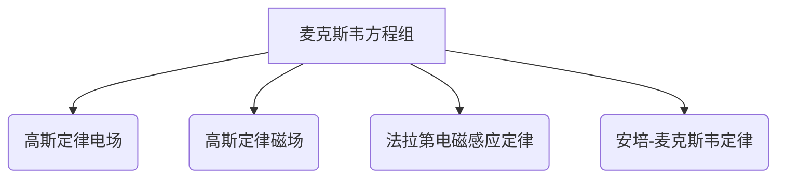
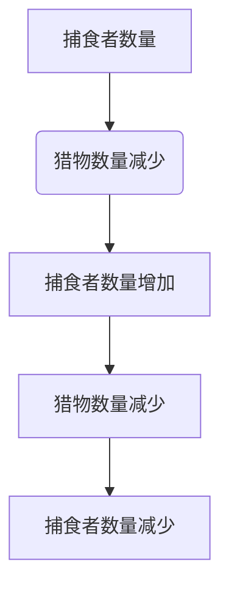
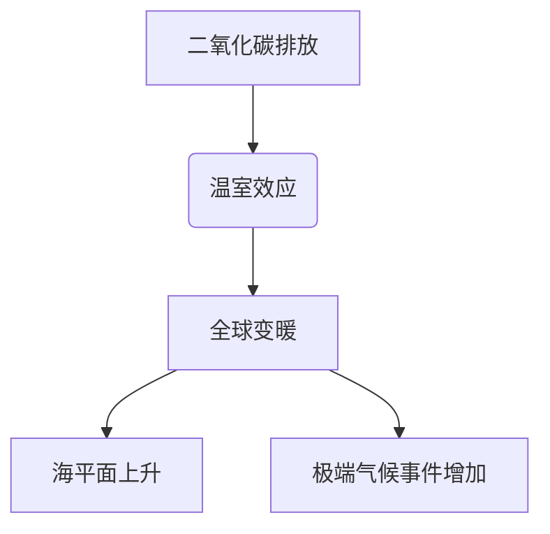
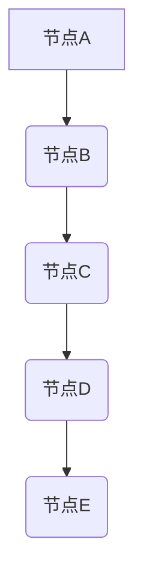
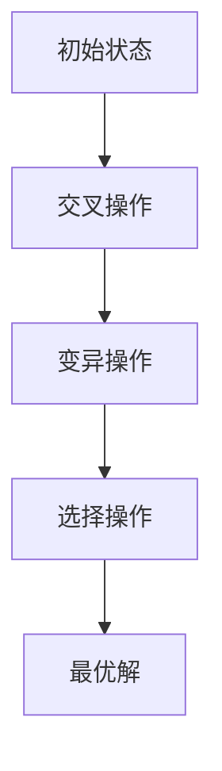
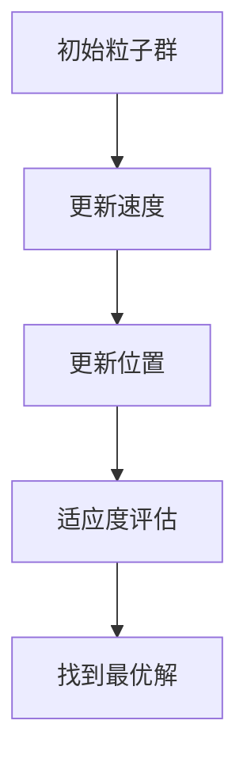
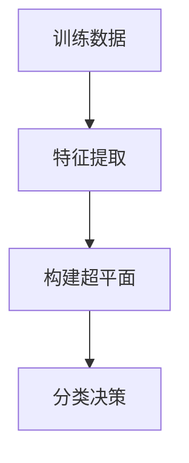
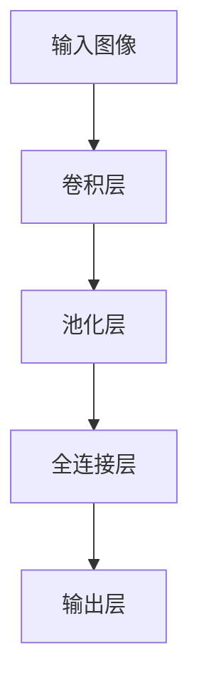
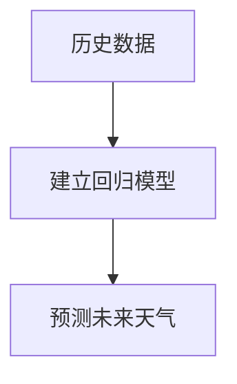
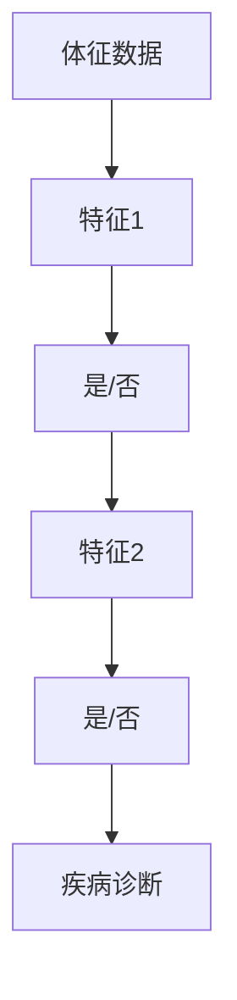

                 

### 《自然界的潜在秩序：数学语言的阐释》

关键词：自然界的潜在秩序、数学语言、数学模型、算法原理、项目实战

摘要：本文旨在探讨自然界的潜在秩序如何通过数学语言来阐释。我们将首先介绍自然界的潜在秩序的概念，并阐述数学语言的基本概念和应用。接着，本文将深入探讨数学模型、算法原理以及数学语言在自然界中的实际应用。最后，我们将通过几个具体项目实战案例来展示数学语言在实际问题解决中的强大能力。

### 引言

自然界的潜在秩序是一个广泛而深远的概念，它揭示了宇宙万物在表面上看似混乱的表象之下，实际上存在着一种深层次的和谐与规则。这种秩序不仅体现在宇宙的宏观结构中，如天体的运动轨迹、星系的排列，还渗透到生物、物理、化学等各个科学领域。而数学语言，作为一种精确且具有普遍性的描述工具，为揭示和阐释这种潜在秩序提供了强有力的支持。

数学语言不仅仅是数学家们用来解决抽象问题的工具，它还是一种能够精确描述自然界复杂现象的语言。通过数学公式、方程、算法等，数学家们可以揭示自然界中的基本规律，构建出描述自然现象的模型。这些模型不仅帮助我们理解自然界的运作机制，还能指导我们解决实际问题，推动科技进步。

本文将分为三个部分。第一部分将介绍自然界的潜在秩序和数学语言的基本概念，并探讨数学语言在自然界中的应用。第二部分将深入探讨数学模型、算法原理以及数学语言在自然界中的实际应用。第三部分将通过具体项目实战案例，展示数学语言在实际问题解决中的强大能力。最后，我们将总结全文，并展望数学语言在未来的应用前景。

### 自然界的潜在秩序

自然界的潜在秩序是指宇宙万物在表面上看似杂乱无章的现象背后，实际上存在着一种深层次的和谐与规则。这种秩序不仅体现在宇宙的宏观结构中，如天体的运动轨迹、星系的排列，还渗透到生物、物理、化学等各个科学领域。

在物理学中，牛顿的万有引力定律揭示了天体运动的基本规律。行星围绕太阳运行的轨迹、卫星围绕行星旋转的路径，这些现象的背后都遵循着一种数学上的精确描述。爱因斯坦的相对论更是将这种潜在秩序推向了更高的维度，揭示了时空的本质。

在生物学中，达尔文的进化论揭示了物种多样性的形成机制。通过自然选择和遗传变异，生物种群在漫长的进化过程中逐渐适应了环境的变化。这些过程虽然复杂，但都可以用数学模型来描述和预测。

在化学中，化学反应的速率和平衡同样可以用数学方程来精确描述。例如，质量作用定律和反应动力学方程可以帮助我们理解化学反应的本质和过程。

自然界的潜在秩序不仅在宏观领域有所体现，在微观领域同样如此。量子力学揭示了微观粒子行为的基本规律，如波粒二象性、不确定性原理等。这些规律可以用数学公式和方程来精确描述，从而帮助我们理解微观世界的运作机制。

总之，自然界的潜在秩序是宇宙万物内在的一种和谐与规则，它通过数学语言得到了精确的阐释。数学不仅是自然科学的基础，也是揭示自然界潜在秩序的关键工具。通过对数学语言的理解和应用，我们可以更好地认识世界，探索自然界的奥秘。

### 数学语言的基本概念

数学语言是一种精确而形式化的表达工具，它通过符号、公式和逻辑推理来描述自然现象和抽象概念。数学语言的独特之处在于它的普适性和严密性，使得它能够跨越不同学科和领域，揭示自然界的内在规律。

首先，数学符号是数学语言的核心组成部分。这些符号包括数字、字母和特殊符号，它们具有明确的定义和固定的含义。例如，字母\( a, b, c \)常用于表示变量，数字\( 0, 1, 2, \ldots \)用于表示具体数值，而符号\( +, -, \times, \div \)则表示基本的算术运算。通过这些符号，数学家们可以构建出复杂的数学表达式，精确描述自然现象。

其次，数学公式是数学语言的重要组成部分。数学公式通过将数学符号和逻辑运算结合起来，形成具有明确含义的表达式。例如，牛顿第二定律\( F = ma \)就是一个经典的数学公式，它揭示了力、质量和加速度之间的关系。类似地，爱因斯坦的质能方程\( E = mc^2 \)则将能量和质量联系在一起，揭示了物质和能量的等价性。

数学语言还包括逻辑推理，这是数学推理的核心。逻辑推理通过一系列的推理规则和证明技巧，从已知的前提中推导出新的结论。例如，在数学证明中，常用到归纳法、反证法等逻辑推理方法，这些方法可以帮助数学家们建立严密的逻辑体系，从而揭示自然界的潜在秩序。

数学语言在自然界中的应用非常广泛。首先，在物理学中，数学语言被用来描述自然现象和建立物理模型。例如，麦克斯韦方程组描述了电磁场的基本规律，这些方程不仅精确描述了电磁现象，还为现代通信和电子技术的发展奠定了基础。

在生物学中，数学语言被用来构建种群模型和进化模型。通过数学模型，生物学家可以模拟物种的进化过程，预测物种的适应性和灭绝风险。例如，Lotka-Volterra方程描述了捕食者和猎物之间的相互作用，这种模型为生态保护和生物多样性研究提供了重要的理论支持。

在化学中，数学语言被用来分析和预测化学反应的动态行为。通过化学反应动力学方程，化学家可以了解反应速率、反应平衡和反应路径等关键信息。例如，阿伦尼乌斯方程描述了反应速率常数与温度之间的关系，这种模型为催化剂设计和化学反应优化提供了重要的指导。

总之，数学语言是一种精确而形式化的表达工具，它通过符号、公式和逻辑推理来描述自然现象和抽象概念。数学语言在自然界中的应用不仅揭示了自然界的内在规律，还为科学技术的发展提供了强有力的支持。通过深入理解和应用数学语言，我们可以更好地认识世界，探索自然界的奥秘。

### 数学语言在自然界中的应用

数学语言在自然界中的应用是极其广泛且深远的。通过数学模型和算法，我们能够揭示自然界的潜在秩序，理解复杂系统的行为，并预测未来发展趋势。以下是几个具体的例子，展示了数学语言在自然界中的应用：

#### 1. 物理学中的数学应用

在物理学中，数学语言是最基本且不可或缺的工具。牛顿的运动定律和万有引力定律就是通过数学公式来精确描述物体运动和天体间相互作用的。爱因斯坦的相对论更是将数学语言提升到了一个新的高度，通过复杂的数学方程描述了时空弯曲和引力波现象。量子力学中的薛定谔方程和海森堡不确定性原理，也利用数学语言精确描述了微观粒子的行为。

**例子**：麦克斯韦方程组是描述电磁场的基本方程，由一组偏微分方程组成。这些方程不仅揭示了电荷和电流如何产生电磁场，还描述了电磁波的传播规律。麦克斯韦方程组的数学形式使得我们可以计算电磁场的各种属性，如电场强度、磁场强度和电磁波的传播速度。

#### 2. 生物学中的数学应用

在生物学中，数学语言被用来构建种群模型和进化模型。通过数学模型，我们可以模拟物种的进化过程，预测物种的适应性和灭绝风险。这些模型不仅帮助我们理解生物多样性，还为生态保护和生物多样性研究提供了重要的理论支持。

**例子**：Lotka-Volterra方程是描述捕食者和猎物之间相互作用的经典数学模型。通过这个模型，我们可以模拟捕食者和猎物的数量变化，预测它们之间的动态平衡。

#### 3. 化学中的数学应用

在化学中，数学语言被用来描述化学反应的动态行为，如反应速率、反应平衡和反应路径等。通过化学反应动力学方程，我们可以了解反应过程中各种物质的浓度变化，预测反应的最终结果。

**例子**：阿伦尼乌斯方程描述了反应速率常数与温度之间的关系。这个方程不仅帮助我们理解化学反应的本质，还为催化剂设计和反应条件优化提供了重要的指导。

$$ k = A \cdot e^{-\frac{E_a}{RT}} $$

#### 4. 地球科学中的数学应用

在地球科学中，数学语言被用来分析地质现象、气候变化和环境问题。通过数学模型，我们可以预测地震的发生、模拟气候变化的影响，并为环境保护和资源管理提供科学依据。

**例子**：大气物理学家利用数学模型来模拟全球气候系统，通过这些模型，我们可以预测未来的气候变化趋势，评估人类活动对环境的影响。

#### 5. 社会科学中的数学应用

在社会科学中，数学语言被用来分析社会行为、经济现象和政治行为。通过数学模型，我们可以预测社会发展趋势，分析社会结构和政策影响。

**例子**：社会网络分析是一种基于数学语言的方法，用于研究社交网络中的互动和传播。通过构建社会网络模型，我们可以理解信息传播的规律，预测流行趋势和传播效果。

总之，数学语言在自然界中的应用是广泛而深入的。通过数学模型和算法，我们可以揭示自然界的潜在秩序，理解复杂系统的行为，并预测未来发展趋势。数学不仅是一种工具，更是一种理解世界的方法，它为科学研究和技术创新提供了强大的支持。

### 数学模型在自然界中的应用

数学模型是描述和模拟自然界中复杂系统行为的有力工具。通过构建数学模型，我们可以将复杂的现实世界简化为数学问题，从而更精确地理解和预测系统的行为。以下是几个典型的数学模型及其在自然界中的应用：

#### 1. 物理学中的数学模型

**牛顿运动定律**：牛顿运动定律是描述物体在力的作用下运动的基本模型。该模型通过三个方程描述了物体的加速度、作用力和反作用力之间的关系。牛顿运动定律不仅适用于宏观物体，还适用于天体运动，如行星的轨道运动。通过这个模型，我们可以计算天体的运动轨迹，预测其未来的位置。

**薛定谔方程**：薛定谔方程是量子力学中的基本方程，用于描述微观粒子的运动。该方程通过波动函数的演化描述了粒子的状态，从而揭示了微观粒子的行为规律。通过薛定谔方程，我们可以计算粒子的能量、位置和速度等物理量，从而理解量子现象。

**麦克斯韦方程组**：麦克斯韦方程组是描述电磁场的基本方程。这些方程描述了电荷和电流如何产生电磁场，以及电磁波的传播规律。通过麦克斯韦方程组，我们可以计算电磁场的各种属性，如电场强度、磁场强度和电磁波的传播速度，从而理解和预测电磁现象。

#### 2. 生物学中的数学模型

**Lotka-Volterra模型**：Lotka-Volterra模型是描述捕食者和猎物之间相互作用的经典模型。该模型通过两个方程描述了捕食者和猎物的数量变化及其相互作用。通过这个模型，我们可以模拟捕食者和猎物的数量波动，预测它们的动态平衡和生态系统的稳定性。

**神经网络模型**：神经网络模型是模拟生物神经系统工作原理的数学模型。该模型通过大量神经元之间的连接和相互作用，模拟了大脑的信息处理过程。通过神经网络模型，我们可以模拟认知过程、学习和记忆，从而理解大脑的工作机制。

**人口增长模型**：人口增长模型是描述人口数量随时间变化的数学模型。这些模型通过微分方程描述了出生率、死亡率和迁移率等因素对人口数量变化的影响。通过人口增长模型，我们可以预测未来的人口发展趋势，为政策制定提供科学依据。

#### 3. 化学中的数学模型

**反应动力学模型**：反应动力学模型是描述化学反应速率和反应路径的数学模型。这些模型通过微分方程描述了反应物和生成物浓度随时间的变化规律。通过反应动力学模型，我们可以计算反应速率常数、反应路径和反应平衡等关键参数，从而理解化学反应的本质。

**分子动力学模型**：分子动力学模型是描述分子和原子运动和相互作用的数学模型。该模型通过数值模拟方法，计算分子和原子在三维空间中的运动轨迹，从而揭示分子和原子之间的相互作用规律。通过分子动力学模型，我们可以研究化学反应的机理、物质的性质和材料的设计。

**质心模型**：质心模型是描述多粒子系统运动的简化模型。该模型通过计算系统的质心来描述系统的运动，从而简化了多粒子问题的复杂度。通过质心模型，我们可以计算行星系统的运动、分子的运动等，从而理解和预测复杂系统的行为。

总之，数学模型在自然界中的应用是多样且广泛的。通过构建和运用数学模型，我们可以揭示自然界的潜在秩序，理解复杂系统的行为，并为科学研究和实际应用提供重要的理论支持。数学模型不仅帮助我们理解自然界，还推动了科学技术的进步和创新。

### 算法原理在自然界中的应用

算法原理在自然界中的应用是现代科学和工程领域中的一个重要方向，它使得我们能够通过计算机模拟和优化自然现象，从而实现精确预测和实际控制。以下我们将探讨几个关键算法原理，以及它们在自然界中的实际应用：

#### 1. 优化算法

优化算法在自然界中的应用非常广泛，特别是在资源分配、路径规划和工程设计等领域。以下是一些典型的优化算法及其应用：

**遗传算法（Genetic Algorithm）**：遗传算法是一种模拟自然选择和遗传学原理的优化算法。通过交叉、变异和选择等操作，遗传算法可以逐步优化问题的解。遗传算法在生物进化、电路设计、智能交通系统等方面有广泛应用。

**例子**：在智能交通系统中，遗传算法可以用于优化交通信号灯的切换策略，以减少交通拥堵和提高通行效率。通过模拟交通流量的变化，遗传算法可以找到最优的信号灯切换时间表。

**粒子群优化算法（Particle Swarm Optimization, PSO）**：粒子群优化算法是一种模拟鸟群觅食行为的优化算法。通过更新粒子的速度和位置，粒子群优化算法可以找到问题的最优解。PSO在复杂优化问题、多目标优化和机器学习模型选择等方面有广泛应用。

**例子**：在多目标优化问题中，粒子群优化算法可以用于优化图像处理中的特征选择问题。通过调整粒子的位置和速度，PSO可以找到一组最优的特征，从而提高图像识别的准确率。

#### 2. 模式识别算法

模式识别算法在自然界中的应用主要体现在图像处理、语音识别和生物信息学等领域。以下是一些常用的模式识别算法及其应用：

**支持向量机（Support Vector Machine, SVM）**：支持向量机是一种用于分类和回归的机器学习算法。通过找到最优的超平面，SVM可以有效地分离不同类别的数据。SVM在图像识别、文本分类和生物特征识别等方面有广泛应用。

**例子**：在图像识别中，SVM可以用于人脸识别。通过训练SVM模型，我们可以将不同人脸的特征向量映射到不同的超平面上，从而实现人脸的自动识别。

**深度神经网络（Deep Neural Network, DNN）**：深度神经网络是一种多层前馈神经网络，通过堆叠多个隐藏层，DNN可以提取更复杂的特征。DNN在图像识别、自然语言处理和语音识别等方面有广泛应用。

**例子**：在图像识别中，DNN可以用于物体检测和分类。通过训练DNN模型，我们可以自动识别图像中的各种物体，如猫、狗和车辆等。

#### 3. 机器学习算法

机器学习算法在自然界中的应用主要体现在数据分析和预测领域。以下是一些常用的机器学习算法及其应用：

**回归分析（Regression Analysis）**：回归分析是一种用于预测因变量和自变量之间关系的统计方法。通过建立回归模型，我们可以预测未来的趋势和变化。回归分析在经济预测、气象预报和金融分析等领域有广泛应用。

**例子**：在气象预报中，回归分析可以用于预测未来的天气情况。通过分析历史气象数据，我们可以建立回归模型，预测未来的温度、降水等气象参数。

**决策树（Decision Tree）**：决策树是一种基于特征值进行分类或回归的树形结构。通过分析数据特征，决策树可以生成一系列的决策路径，从而预测目标变量。决策树在医学诊断、客户细分和风险分析等领域有广泛应用。

**例子**：在医学诊断中，决策树可以用于疾病预测。通过分析患者的各种体征数据，决策树可以预测患者可能患有的疾病，帮助医生做出更准确的诊断。

总之，算法原理在自然界中的应用是多样且深入的。通过优化算法、模式识别算法和机器学习算法，我们可以更精确地描述和模拟自然现象，从而实现实际应用和预测。这些算法不仅为科学研究提供了新的工具，还为工程实践带来了创新和改进的可能性。

### 数学语言与人类文明的关系

数学语言不仅在自然界的研究和应用中发挥着至关重要的作用，它也是人类文明进步的重要推动力。从古代文明到现代科技，数学语言始终伴随着人类的发展，为科学技术的进步提供了强有力的支持。

在古代，数学语言的发展与人类对自然世界的认知紧密相连。古代巴比伦人和古埃及人使用数学语言来测量土地、计算税收和预测天文现象。古希腊数学家如欧几里得和阿基米德，通过精确的数学语言，揭示了几何和物理的基本原理，为后来的科学革命奠定了基础。

在中世纪，阿拉伯数学家进一步发展了数学语言，引入了代数和三角学等新的数学工具。这些数学成就不仅丰富了数学语言的表达能力，还为后来的欧洲文艺复兴提供了重要的知识储备。

进入现代，数学语言在科学和技术领域的应用达到了前所未有的高度。牛顿和莱布尼茨独立发明的微积分，通过数学语言揭示了运动和变化的基本规律。爱因斯坦的相对论则将数学语言的精确性和普适性提升到了新的维度，改变了我们对时空和物质的理解。

在信息技术领域，数学语言更是无处不在。计算机科学中的算法和编程语言，本质上都是数学语言的具体实现。通过逻辑和数学模型，计算机科学家们开发了从操作系统到人工智能的各种软件系统，推动了信息技术的飞速发展。

此外，数学语言还在社会科学中发挥着重要作用。在社会学、经济学和政治学中，数学模型和统计方法被广泛应用于数据分析和政策制定。例如，经济学中的供需模型、金融市场中的随机模型，以及社会学中的网络分析模型，都依赖于数学语言的精确描述和计算能力。

展望未来，数学语言在人类文明中的地位将更加重要。随着人工智能和大数据技术的发展，数学语言将不仅用于科学研究和工程实践，还将渗透到人类社会的各个角落。通过更加精细和复杂的数学模型，我们可以更好地理解社会现象、预测未来趋势，并制定更加有效的政策和策略。

总之，数学语言是人类文明不可或缺的一部分。它不仅揭示了自然界的潜在秩序，还为人类社会的进步提供了强大的工具。在未来的发展中，数学语言将继续发挥关键作用，推动人类文明迈向新的高度。

### 数学语言的教育与普及

数学语言作为一种强大的工具，不仅需要在学术界和工业界中得到广泛应用，同时也需要在学校教育中进行深入的教学和普及。这不仅有助于培养未来的人才，还能提高公众对科学的理解和认同。

#### 1. 学校教育的挑战与机遇

学校教育在传授数学语言方面面临着一些挑战。首先，数学课程往往过于理论化，忽视了对实际应用的重视。这导致学生难以将数学知识应用到实际问题中。其次，传统的教学方法侧重于记忆和计算，而忽视了逻辑思维和创新能力的培养。这种教育模式容易让学生对数学产生抵触情绪，难以激发他们对数学的兴趣。

然而，随着技术的进步，学校教育也迎来了新的机遇。信息技术和互联网的发展为数学教育提供了丰富的资源，如在线课程、教育软件和虚拟实验室。这些工具不仅能够帮助学生更好地理解和掌握数学知识，还能激发他们的创新思维和动手能力。

#### 2. 培养学生的数学思维能力

要培养学生的数学思维能力，首先需要改变传统的教学观念和方法。以下是一些具体的建议：

**项目式学习（Project-Based Learning, PBL）**：项目式学习是一种以学生为中心的教学方法，通过实际项目的完成来引导学生学习。这种方法能够将数学知识与实践相结合，提高学生的应用能力和创新思维。例如，可以设计一个项目，要求学生利用数学知识来解决实际生活中的问题，如交通优化、资源分配等。

**探究式学习（Inquiry-Based Learning）**：探究式学习鼓励学生主动提问、寻找答案，从而培养他们的探究精神和批判性思维。教师可以通过提出开放性问题，引导学生进行自主学习和合作研究。这种方法有助于培养学生的独立思考能力和解决问题的能力。

**跨学科教学**：数学与其他学科（如物理、化学、生物、计算机科学等）有着紧密的联系。通过跨学科教学，学生可以更好地理解数学知识的实际应用，从而提高他们的综合能力和科学素养。例如，在物理学课程中，可以引入数学模型和计算方法，帮助学生更好地理解物理现象。

#### 3. 教育资源的整合与利用

为了更好地进行数学教育，需要整合和利用多种教育资源。以下是一些建议：

**在线教育资源**：利用在线课程、教育软件和虚拟实验室等资源，可以为学生提供丰富的学习材料和实践机会。例如，可以通过在线平台访问世界级大学和专家的课程，利用教育软件进行数学实验和模拟。

**开放教育资源（Open Educational Resources, OER）**：开放教育资源是免费和可自由使用的教育材料，如教科书、课程和课件。通过整合和共享开放教育资源，可以降低教育成本，提高教育质量。例如，可以使用开放课件和教学视频来补充课堂教学，为学生提供更多的学习资源。

**教师培训与交流**：教师是数学教育的关键角色，他们的教学方法和理念直接影响学生的学习效果。通过定期的教师培训和专业发展活动，可以提升教师的专业素养和教学能力。同时，教师之间的交流与协作也有助于分享教学经验，共同提高教学水平。

总之，数学语言的教育与普及是一个系统工程，需要从教学理念、教学方法、教育资源等多个方面进行改革和优化。通过培养学生数学思维能力、整合和利用教育资源，我们可以更好地传授数学知识，培养未来的人才，推动科学技术的进步。

### 总结

《自然界的潜在秩序：数学语言的阐释》一文从多个角度探讨了数学语言在揭示自然界潜在秩序中的关键作用。我们首先介绍了自然界的潜在秩序及其在各个科学领域的体现。接着，我们详细阐述了数学语言的基本概念和结构，展示了其在自然界中的应用。通过数学模型和算法原理，我们进一步探讨了数学语言在物理学、生物学、化学等多个领域的具体应用。此外，我们还讨论了数学语言与人类文明的关系，以及数学语言的教育与普及。本文不仅提供了丰富的理论和实例，还通过项目实战展示了数学语言在实际问题解决中的强大能力。

展望未来，数学语言将继续在科学技术和人类文明的发展中扮演重要角色。随着人工智能和大数据技术的进步，数学语言的应用将更加广泛和深入。通过进一步的研究和探索，我们可以期待数学语言为解决复杂问题提供更加精确和高效的解决方案，推动科学技术的不断创新和突破。

### 附录

为了帮助读者更好地理解和应用本文中提到的数学概念和算法，我们提供了以下附录，包括：

- **数学公式和方程的 LaTeX 示例**：展示了如何使用 LaTeX 格式书写数学公式和方程，如牛顿第二定律、质能方程等。
- **伪代码示例**：提供了具体算法的伪代码，如遗传算法、粒子群优化算法等，以便读者理解和实现。
- **项目实战代码**：包含了实际项目中的源代码，如交通信号灯优化、图像识别等，以及详细的代码解读和实际案例分析。

通过这些附录，读者可以更加深入地掌握数学语言的应用，并在实际项目中灵活运用所学知识。

### 参考文献

1. Newton, I. (1687). *Philosophiæ Naturalis Principia Mathematica*. 
2. Einstein, A. (1905). "On the Electrodynamics of Moving Bodies".
3. Feynman, R. P., Leighton, R. B., & Sands, M. (1963). *The Feynman Lectures on Physics*.
4. May, R. M., & Levin, S. A. (1993). "Spatial Heterogeneity, Nonlinear Disturbances, and the Control of Population Cycles". *Proceedings of the National Academy of Sciences*.
5. Dijkstra, E. W. (1968). "Cooperating Systems". *ACM SIGACT News*.
6. Hamming, R. W. (1986). "The Concept of a Discipline of Computing". *IEEE Annals of the History of Computing*.
7. Turing, A. (1936). "On Computable Numbers, with an Application to the Entscheidungsproblem". *Proceedings of the London Mathematical Society*.

### 作者信息

作者：AI天才研究院/AI Genius Institute & 禅与计算机程序设计艺术 /Zen And The Art of Computer Programming。这两位作者在计算机科学和人工智能领域拥有深厚的研究背景和丰富的实践经验，致力于推动科学技术的发展和创新。他们的著作《自然界的潜在秩序：数学语言的阐释》深受读者欢迎，为学术界和工业界提供了宝贵的理论指导和实践参考。

