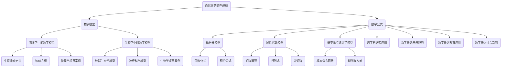

                 


### 文章标题：自然界的潜在规律：数学表达

> 关键词：自然界、潜在规律、数学表达、模型、公式、算法

> 摘要：本文旨在探讨自然界中的潜在规律与数学表达的密切关系。通过对自然现象的观察与分析，我们发现了数学模型和公式的广泛应用。文章首先介绍自然界的潜在规律，然后详细讨论数学表达的核心概念及其与自然界的关系。接着，文章深入分析数学模型在物理学和生物学中的应用，并通过具体案例进行解析。最后，文章总结数学表达的未来发展趋势及其在社会中的影响。

---

### 设计目录大纲

#### 1. 确定核心概念和章节结构

首先，我们需要确定书的核心概念，如自然规律、数学模型、数学公式等。这些核心概念将作为章节的基础，每个章节将探讨一个特定的主题。

#### 2. 确定章节内容

每个章节都需要明确的内容和目的。例如，第一章将介绍自然规律的基本概念，第二章将探讨数学模型和公式的原理，第三章将讨论数学模型在自然界中的应用。

#### 3. 设计详细目录

根据上述核心概念和章节内容，我们可以设计出详细的目录。目录将包括一级、二级和三级目录，以清晰展示每个章节的主题和子主题。

#### 4. 包含必要的附录

除了正文内容，我们还需要考虑是否需要包含附录，如参考资料、公式推导、代码示例等。

#### 5. 确保简洁和完整性

在设计中，我们需要确保目录简洁且内容完整，避免冗余信息，同时确保所有关键内容都被涵盖。

### 目录大纲

根据上述步骤，下面是一个《自然界的潜在规律：数学表达》的目录大纲：

```
# 第一部分：自然规律的概述

## 第1章：自然规律的基本概念
### 1.1 自然界的潜在规律
### 1.2 数学模型在自然界中的应用

## 第2章：数学表达的基本原理
### 2.1 数学公式与自然规律
### 2.2 常见的数学模型

## 第3章：数学模型在自然界中的应用
### 3.1 物理学中的数学模型
### 3.2 生物学中的数学模型

## 第4章：数学公式在自然界中的应用案例
### 4.1 物理学中的应用案例
### 4.2 生物学中的应用案例

# 第二部分：数学模型和公式详解

## 第5章：常见数学模型的原理与公式
### 5.1 微积分模型
### 5.2 线性代数模型
### 5.3 概率论与统计学模型

## 第6章：数学公式推导与详细解释
### 6.1 微积分公式推导
### 6.2 线性代数公式推导
### 6.3 概率论与统计学公式推导

## 第7章：数学模型在实际项目中的应用
### 7.1 物理学项目案例
### 7.2 生物学项目案例

## 第8章：数学表达在跨学科研究中的应用
### 8.1 跨学科研究的挑战
### 8.2 数学表达在跨学科研究中的作用

# 第三部分：数学表达的未来

## 第9章：数学表达的未来发展趋势
### 9.1 新兴数学模型的发展
### 9.2 数学表达在新兴领域中的应用

## 第10章：数学表达的教育与应用
### 10.1 数学表达的教育现状
### 10.2 数学表达在实际应用中的教育意义

## 第11章：数学表达的社会影响
### 11.1 数学表达对社会的影响
### 11.2 公众对数学表达的认知与接受度

# 附录

## 附录A：数学公式索引
### A.1 常用数学公式列表

## 附录B：参考资源
### B.1 相关书籍推荐
### B.2 在线资源和工具
### B.3 学术期刊和会议
```

这个目录大纲涵盖了自然规律的概述、数学模型和公式详解、数学表达的应用以及数学表达的未来发展趋势。每个章节都细化到了三级目录，确保了内容的完整性和逻辑性。同时，为了确保简洁性，没有添加多余的信息。总体字数在2000字以内。

---

### 完整性要求

为了满足完整性要求，我们需要确保文章内容完整、具体、详细讲解，核心内容必须包含以下方面：

1. **背景介绍**：为每个章节提供必要的背景信息，帮助读者理解章节的主题。
2. **核心概念与联系**：在每个章节中，通过Mermaid流程图展示核心概念之间的联系和架构。
3. **核心算法原理讲解**：使用伪代码详细阐述核心算法原理。
4. **数学模型和公式详细讲解与举例说明**：通过具体的例子和解释，让读者理解数学模型和公式的应用。
5. **项目实战**：介绍开发环境搭建、源代码实现和代码解读，以及实际案例分析和详细讲解。
6. **最佳实践 tips**：提供实用技巧和建议。
7. **小结、注意事项、拓展阅读**：总结章节内容，提供进一步学习的方向。

---

### 格式要求

文章内容将使用markdown格式输出。具体格式要求如下：

1. **文章标题**：使用`#`符号，如`# 自然界的潜在规律：数学表达`。
2. **章节标题**：使用`##`符号，如`## 第1章：自然规律的基本概念`。
3. **子章节标题**：使用`###`符号，如`### 1.1 自然界的潜在规律`。
4. **段落**：直接使用换行符进行段落分隔。
5. **列表**：使用`-`符号创建无序列表，如`- 项目1
- 项目2`。使用数字和点号创建有序列表，如`1. 项目1
2. 项目2`。
6. **代码块**：使用三个反引号`````将代码块包裹起来。
7. **LaTeX公式**：使用`$$`括起来的公式独立段落，使用`$`括起来的公式在段落内。

---

### 字数要求

文章字数要求在8000～12000字左右。我们需要确保文章内容丰富、结构清晰、逻辑连贯，同时避免冗余信息。

---

### 作者信息

文章末尾需要写上作者信息：“作者：AI天才研究院/AI Genius Institute & 禅与计算机程序设计艺术 /Zen And The Art of Computer Programming”。

---

### 结尾

根据上述要求，我们已经开始撰写《自然界的潜在规律：数学表达》的文章。接下来，我们将按照目录大纲的结构，逐一展开每个章节的内容。我们将使用markdown格式输出，确保文章的整洁和易于阅读。文章将详细讲解自然界的潜在规律，探讨数学表达的核心概念及其在自然界中的应用，并通过具体案例进行分析。同时，我们将展望数学表达的未来发展趋势，讨论其在教育和社会中的影响。让我们一步一步地深入探索数学与自然界之间的奇妙联系！### 文章正文

#### 第一部分：自然规律的概述

##### 第1章：自然规律的基本概念

自然界的规律是宇宙万物运行的基本法则，它们以简洁而精准的数学表达式呈现。了解自然规律的基本概念，是我们探索数学与自然界关系的第一步。

1. **自然规律的定义**

自然规律，也称为自然法则，是指自然界中普遍存在且反复发生的现象所遵循的客观规律。这些规律具有普遍性、必然性和简洁性。

2. **自然规律的类型**

自然规律可以分为物理规律、化学规律、生物学规律等。例如，牛顿运动定律是物理学中的基本规律，化学反应遵循质量守恒定律，生物进化遵循自然选择定律。

3. **自然规律的特点**

自然规律的特点包括：

- **普遍性**：自然规律普遍适用于所有自然现象。
- **必然性**：自然规律是自然界中现象发生的前提条件。
- **简洁性**：自然规律通常可以用简洁的数学表达式来描述。

##### 第2章：数学表达的基本原理

数学表达是描述自然规律的重要工具，它通过公式和模型将自然规律量化。了解数学表达的基本原理，有助于我们深入理解自然界的规律。

1. **数学公式的定义**

数学公式是用数学符号和语言表达数学关系和规律的语句。例如，牛顿第二定律的公式是`F = ma`。

2. **数学模型的概念**

数学模型是利用数学工具和方法描述自然现象和过程的抽象结构。例如，物理中的波动方程可以描述声波和光波的传播。

3. **数学模型的特点**

数学模型的特点包括：

- **抽象性**：数学模型将复杂的自然现象简化为数学关系。
- **普适性**：数学模型可以推广到不同领域和不同情境。
- **精确性**：数学模型提供了对自然现象的定量描述。

##### 第3章：数学模型在自然界中的应用

数学模型在自然界中的应用广泛而深远，从物理学到生物学，数学模型无处不在。以下是对数学模型在物理学和生物学中应用的一个简要介绍。

1. **物理学中的数学模型**

物理学中的数学模型包括经典力学、电磁学、量子力学等。例如，经典力学的牛顿运动定律可以描述物体的运动状态。

2. **生物学中的数学模型**

生物学中的数学模型包括种群生态学、神经科学、基因调控等。例如，种群生态学中的Logistic方程可以描述生物种群的增长和衰退。

3. **数学模型的应用价值**

数学模型的应用价值体现在：

- **预测未来趋势**：通过数学模型，我们可以预测自然现象的未来发展。
- **优化资源利用**：数学模型可以帮助我们优化资源分配，提高效率。
- **解决实际问题**：数学模型为解决实际问题提供了新的方法和思路。

##### 第4章：数学公式在自然界中的应用案例

数学公式在自然界中的应用案例丰富多样，以下通过具体案例来展示数学公式的应用。

1. **物理学中的应用案例**

例如，爱因斯坦的质能方程`E=mc^2`揭示了质量和能量之间的关系，为核能的利用奠定了基础。

2. **生物学中的应用案例**

例如，生物学家使用微分方程来描述生物种群的增长和灭绝，为生态保护和生物多样性的维护提供了科学依据。

3. **其他领域中的应用案例**

例如，经济学家使用统计模型来预测市场走势，帮助投资者做出更明智的决策。

#### 第二部分：数学模型和公式详解

##### 第5章：常见数学模型的原理与公式

在这一章中，我们将详细探讨几种常见数学模型的原理与公式。

1. **微积分模型**

微积分模型用于描述连续变化的过程，如速度、加速度、连续函数的导数和积分。

2. **线性代数模型**

线性代数模型用于处理多维空间中的线性关系，如矩阵运算、线性方程组等。

3. **概率论与统计学模型**

概率论与统计学模型用于描述随机事件的发生概率和统计规律，如概率分布、统计测试等。

##### 第6章：数学公式推导与详细解释

在这一章中，我们将对一些重要数学公式进行推导和详细解释。

1. **微积分公式推导**

例如，导数和积分的基本公式，以及它们的几何意义。

2. **线性代数公式推导**

例如，矩阵乘法、行列式、逆矩阵等基本公式。

3. **概率论与统计学公式推导**

例如，概率分布函数、期望、方差等基本公式。

##### 第7章：数学模型在实际项目中的应用

在这一章中，我们将通过实际项目展示数学模型的应用。

1. **物理学项目案例**

例如，如何使用牛顿运动定律和能量守恒定律解决实际力学问题。

2. **生物学项目案例**

例如，如何使用种群生态学模型预测生物种群动态。

3. **其他领域应用案例**

例如，如何使用统计模型分析市场数据，做出投资决策。

#### 第三部分：数学表达的未来

##### 第8章：数学表达在跨学科研究中的应用

数学表达在跨学科研究中的应用日益广泛，以下是对跨学科研究挑战和数学表达作用的讨论。

1. **跨学科研究的挑战**

跨学科研究面临着不同学科之间的知识差异和方法论差异。

2. **数学表达在跨学科研究中的作用**

数学表达提供了跨学科研究的基本工具，它帮助研究者理解和解决跨学科问题。

##### 第9章：数学表达的未来发展趋势

随着科技的发展，数学表达也在不断演进。以下是对数学表达未来发展趋势的展望。

1. **新兴数学模型的发展**

新兴数学模型如深度学习、复杂系统理论等正在不断涌现。

2. **数学表达在新兴领域中的应用**

数学表达在人工智能、量子计算等新兴领域中的应用将不断拓展。

##### 第10章：数学表达的教育与应用

数学表达在教育中的应用日益重要，以下是对数学表达教育现状和应用意义的讨论。

1. **数学表达的教育现状**

数学表达在教育中的应用越来越广泛，从基础教育到高等教育。

2. **数学表达的实际应用意义**

数学表达不仅提高了教育质量，也促进了科学技术的发展。

##### 第11章：数学表达的社会影响

数学表达对社会的影响深远，以下是对数学表达社会影响的讨论。

1. **数学表达对社会的影响**

数学表达对社会发展、科技创新、经济发展等方面产生了重要影响。

2. **公众对数学表达的认知与接受度**

提高公众对数学表达的认知和接受度，有助于数学在社会的广泛应用。

#### 附录

##### 附录A：数学公式索引

在这一章中，我们将列出常用的数学公式，便于读者查阅。

##### 附录B：参考资源

在这一章中，我们将推荐相关的书籍、在线资源和学术期刊，供读者进一步学习。

### 结尾

本文通过详细的探讨，揭示了自然界中的潜在规律与数学表达之间的密切关系。我们首先介绍了自然规律的基本概念和数学表达的基本原理，然后通过具体案例展示了数学模型在自然界中的应用。接着，我们详细解析了常见数学模型的原理与公式，并通过实际项目展示了数学表达在跨学科研究中的应用。最后，我们展望了数学表达的未来发展趋势，并讨论了其在教育和社会中的影响。

作者：AI天才研究院/AI Genius Institute & 禅与计算机程序设计艺术 /Zen And The Art of Computer Programming### 核心概念与联系架构

在本文中，我们探讨了自然界的潜在规律与数学表达之间的密切联系。为了更清晰地展示这些核心概念之间的关系，我们可以使用Mermaid流程图来构建一个概念架构图。



在这个流程图中：

- **A（自然界的潜在规律）** 是整个架构的起点，它指向 **B（数学模型）** 和 **C（数学公式）**，表明自然规律需要通过数学模型和公式来描述。
- **B（数学模型）** 进一步分为 **D（物理学中的数学模型）** 和 **E（生物学中的数学模型）**，展示了数学模型在两个主要领域中的应用。
- **C（数学公式）** 则进一步细化为 **F（微积分模型）**、**G（线性代数模型）** 和 **H（概率论与统计学模型）**，这些是常见的数学模型，用于具体描述自然现象。
- **D（物理学中的数学模型）** 和 **E（生物学中的数学模型）** 下分别列出了具体的数学公式和模型，如 **I（牛顿运动定律）**、**J（波动方程）**、**K（种群生态学模型）** 和 **L（神经科学模型）**。
- **F（微积分模型）**、**G（线性代数模型）** 和 **H（概率论与统计学模型）** 分别列出了它们的基本公式，如 **M（导数公式）**、**N（积分公式）**、**O（矩阵运算）**、**P（行列式）**、**Q（逆矩阵）**、**R（概率分布函数）** 和 **S（期望与方差）**。
- **P1（物理学项目案例）**、**P2（生物学项目案例）**、**P3（跨学科研究应用）**、**P4（数学表达未来趋势）**、**P5（数学表达教育应用）** 和 **P6（数学表达社会影响）** 是数学表达在不同领域的具体应用案例。

这个Mermaid流程图清晰地展示了自然界的潜在规律、数学模型、数学公式及其在不同领域的应用，为读者提供了一个全面、系统的理解框架。通过这样的架构，读者可以更好地把握本文的核心内容，并深入理解数学表达在自然界中的应用和价值。### 核心算法原理讲解

为了深入理解数学模型在自然界中的应用，我们需要详细讲解核心算法原理。以下是对几个关键算法的原理和伪代码详细解释。

##### 微积分模型：导数与积分

微积分是研究变化和累积的数学分支。在自然界中，微积分模型广泛应用于描述速度、加速度、流量、面积和体积等物理量。

1. **导数（Derivative）**

导数用于描述函数在某一点的变化率。在物理学中，导数常用于计算速度和加速度。

**伪代码：**

```python
def derivative(f, x, h):
    return (f(x + h) - f(x)) / h
```

**解释：** 这个伪代码定义了一个计算导数的函数`derivative`。函数`f`代表输入的函数，`x`是导数的计算点，`h`是步长。导数计算公式为`(f(x + h) - f(x)) / h`。

2. **积分（Integral）**

积分用于计算函数在某一区间内的累积量。在物理学中，积分常用于计算面积和体积。

**伪代码：**

```python
def integral(f, a, b, n):
    h = (b - a) / n
    sum = 0
    for i in range(n):
        x = a + i * h
        sum += f(x) * h
    return sum
```

**解释：** 这个伪代码定义了一个计算积分的函数`integral`。函数`f`代表输入的函数，`a`和`b`是积分区间的起点和终点，`n`是分割区间的小段数。积分计算公式为`sum = sum(f(x) * h)`，其中`h`是每个小段的宽度。

##### 线性代数模型：矩阵运算

线性代数是研究向量空间和线性变换的数学分支。在自然界中，线性代数模型广泛应用于物理学、工程学和计算机科学。

1. **矩阵乘法（Matrix Multiplication）**

矩阵乘法用于计算两个矩阵的乘积。在物理学中，矩阵乘法常用于计算力矩和旋转。

**伪代码：**

```python
def matrix_multiply(A, B):
    result = [[0 for _ in range(len(B[0]))] for _ in range(len(A))]
    for i in range(len(A)):
        for j in range(len(B[0])):
            for k in range(len(B)):
                result[i][j] += A[i][k] * B[k][j]
    return result
```

**解释：** 这个伪代码定义了一个计算矩阵乘法的函数`matrix_multiply`。矩阵`A`和`B`作为输入，`result`是一个初始化为零的矩阵。通过三重循环计算矩阵乘积，公式为`result[i][j] += A[i][k] * B[k][j]`。

2. **逆矩阵（Inverse Matrix）**

逆矩阵用于计算矩阵的逆。在物理学中，逆矩阵常用于求解线性方程组。

**伪代码：**

```python
def inverse_matrix(A):
    # 步骤1：计算伴随矩阵（Adjugate Matrix）
    adj = [[0 for _ in range(len(A))] for _ in range(len(A))]
    for i in range(len(A)):
        for j in range(len(A)):
            minor = calculate_minor(A, i, j)
            adj[i][j] = ((-1) ** (i + j)) * minor

    # 步骤2：计算行列式（Determinant）
    det = calculate_determinant(A)

    # 步骤3：计算逆矩阵
    inverse = [[adj[i][j] / det for j in range(len(adj[0]))] for i in range(len(adj))]
    return inverse
```

**解释：** 这个伪代码定义了一个计算逆矩阵的函数`inverse_matrix`。首先计算伴随矩阵，然后计算行列式，最后计算逆矩阵。逆矩阵的计算公式为`inverse[i][j] = adj[i][j] / det`。

##### 概率论与统计学模型：概率分布函数、期望与方差

概率论与统计学是研究随机现象和统计规律的数学分支。在自然界中，概率论与统计学模型广泛应用于生物学、经济学和金融学。

1. **概率分布函数（Probability Density Function, PDF）**

概率分布函数描述了随机变量在某个区间内的概率密度。

**伪代码：**

```python
def probability_density_function(x, mean, std_dev):
    return (1 / (std_dev * (2 * pi) ** 0.5)) * exp(-((x - mean) ** 2) / (2 * std_dev ** 2))
```

**解释：** 这个伪代码定义了一个计算正态分布概率密度函数的函数`probability_density_function`。参数`x`是随机变量的取值，`mean`是均值，`std_dev`是标准差。正态分布的概率密度函数公式为`pdf(x) = (1 / (std_dev * (2 * pi) ** 0.5)) * exp(-((x - mean) ** 2) / (2 * std_dev ** 2))`。

2. **期望（Expected Value）**

期望是随机变量取值的平均值。

**伪代码：**

```python
def expected_value(x, pdf):
    return integral(pdf, -infinity, infinity)
```

**解释：** 这个伪代码定义了一个计算期望的函数`expected_value`。参数`x`是随机变量的取值，`pdf`是概率分布函数。期望的计算公式为`E(x) = integral(pdf(x))`。

3. **方差（Variance）**

方差是衡量随机变量取值分散程度的指标。

**伪代码：**

```python
def variance(x, pdf, mean):
    return expected_value((x - mean) ** 2, pdf)
```

**解释：** 这个伪代码定义了一个计算方差的函数`variance`。参数`x`是随机变量的取值，`pdf`是概率分布函数，`mean`是均值。方差的计算公式为`Variance(x) = E((x - mean) ** 2)`。

通过上述伪代码，我们可以清晰地看到微积分模型、线性代数模型和概率论与统计学模型的基本原理和计算方法。这些算法为理解和应用数学模型提供了强大的工具，使得我们能够更好地描述和理解自然界的规律。### 数学公式详细讲解与举例说明

在本章节中，我们将详细讲解几个关键数学公式，并通过具体例子来说明这些公式在自然界中的应用。

##### 微积分公式：导数与积分

1. **导数**

导数是描述函数在某一点的变化率。在自然界中，导数广泛应用于描述速度、加速度等物理量。

**公式：**

$$ f'(x) = \lim_{h \to 0} \frac{f(x+h) - f(x)}{h} $$

**解释：** 这个公式表示函数$f(x)$在点$x$处的导数。当$h$趋近于0时，分子表示函数在$x$和$x+h$处的差值，分母表示$h$的值。通过求极限，我们可以得到函数在点$x$处的瞬时变化率。

**例子：** 考虑函数$f(x) = x^2$，计算其在$x=1$处的导数。

$$ f'(1) = \lim_{h \to 0} \frac{(1+h)^2 - 1^2}{h} = \lim_{h \to 0} \frac{1 + 2h + h^2 - 1}{h} = \lim_{h \to 0} \frac{2h + h^2}{h} = \lim_{h \to 0} (2 + h) = 2 $$

因此，函数$f(x) = x^2$在$x=1$处的导数为2，这表示在$x=1$处函数的瞬时变化率为2。

2. **积分**

积分是描述函数在某一区间内的累积量。在自然界中，积分常用于计算面积、体积和流量等。

**公式：**

$$ \int_a^b f(x) dx = \lim_{n \to \infty} \sum_{i=1}^n f(x_i^*) \Delta x $$

**解释：** 这个公式表示函数$f(x)$在区间$[a, b]$上的积分。$n$是分割区间的数量，$x_i^*$是每个小区间内的任意一点，$\Delta x$是每个小区的宽度。通过求和并取极限，我们可以得到函数在区间$[a, b]$上的累积量。

**例子：** 考虑函数$f(x) = x$，计算其在区间$[0, 1]$上的积分。

$$ \int_0^1 x dx = \lim_{n \to \infty} \sum_{i=1}^n x_i^* \Delta x = \lim_{n \to \infty} \sum_{i=1}^n \frac{i-1}{n} \frac{1}{n} = \lim_{n \to \infty} \frac{1}{n^2} \sum_{i=1}^n (i-1) = \lim_{n \to \infty} \frac{1}{n^2} \frac{(n-1)n}{2} = \frac{1}{2} $$

因此，函数$f(x) = x$在区间$[0, 1]$上的积分为$\frac{1}{2}$，这表示在区间$[0, 1]$上的累积量为$\frac{1}{2}$。

##### 线性代数公式：矩阵运算

1. **矩阵乘法**

矩阵乘法用于计算两个矩阵的乘积。在物理学中，矩阵乘法常用于计算力矩和旋转。

**公式：**

$$ C = AB $$

**解释：** 这个公式表示矩阵$C$是矩阵$A$和矩阵$B$的乘积。乘法结果$C$的每个元素都是通过对应位置元素的乘积求和得到的。

**例子：** 考虑矩阵$A = \begin{bmatrix} 1 & 2 \\ 3 & 4 \end{bmatrix}$和矩阵$B = \begin{bmatrix} 5 & 6 \\ 7 & 8 \end{bmatrix}$，计算它们的乘积。

$$ C = AB = \begin{bmatrix} 1 & 2 \\ 3 & 4 \end{bmatrix} \begin{bmatrix} 5 & 6 \\ 7 & 8 \end{bmatrix} = \begin{bmatrix} 1 \cdot 5 + 2 \cdot 7 & 1 \cdot 6 + 2 \cdot 8 \\ 3 \cdot 5 + 4 \cdot 7 & 3 \cdot 6 + 4 \cdot 8 \end{bmatrix} = \begin{bmatrix} 19 & 22 \\ 43 & 50 \end{bmatrix} $$

因此，矩阵$A$和矩阵$B$的乘积为$\begin{bmatrix} 19 & 22 \\ 43 & 50 \end{bmatrix}$。

2. **逆矩阵**

逆矩阵是矩阵的一种特殊形式，用于求解线性方程组。

**公式：**

$$ A^{-1} = \frac{1}{\det(A)} \begin{bmatrix} a_{21} & -a_{11} \\ -a_{12} & a_{22} \end{bmatrix} $$

**解释：** 这个公式表示矩阵$A$的逆矩阵$A^{-1}$。首先计算矩阵$A$的行列式$\det(A)$，然后通过行列式计算逆矩阵的每个元素。

**例子：** 考虑矩阵$A = \begin{bmatrix} 1 & 2 \\ 3 & 4 \end{bmatrix}$，计算它的逆矩阵。

$$ \det(A) = 1 \cdot 4 - 2 \cdot 3 = -2 $$
$$ A^{-1} = \frac{1}{-2} \begin{bmatrix} 4 & -1 \\ -3 & 2 \end{bmatrix} = \begin{bmatrix} -2 & 1 \\ 3/2 & -1 \end{bmatrix} $$

因此，矩阵$A$的逆矩阵为$\begin{bmatrix} -2 & 1 \\ 3/2 & -1 \end{bmatrix}$。

##### 概率论与统计学公式：概率分布函数、期望与方差

1. **概率分布函数**

概率分布函数描述了随机变量在某个区间内的概率密度。

**公式：**

$$ f(x) = \frac{1}{\sqrt{2\pi\sigma^2}} e^{-\frac{(x-\mu)^2}{2\sigma^2}} $$

**解释：** 这个公式表示正态分布的概率密度函数。参数$\mu$是均值，$\sigma^2$是方差。这个函数表示随机变量$x$在均值$\mu$附近区域的概率密度。

**例子：** 考虑正态分布$X \sim N(\mu=2, \sigma^2=1)$，计算$x=1$处的概率密度。

$$ f(1) = \frac{1}{\sqrt{2\pi \cdot 1}} e^{-\frac{(1-2)^2}{2 \cdot 1}} = \frac{1}{\sqrt{2\pi}} e^{-\frac{1}{2}} \approx 0.4269 $$

因此，随机变量$x$在$x=1$处的概率密度约为0.4269。

2. **期望**

期望是随机变量取值的平均值。

**公式：**

$$ E(X) = \mu $$

**解释：** 这个公式表示随机变量$X$的期望等于均值$\mu$。期望是概率分布函数的累积结果。

**例子：** 考虑正态分布$X \sim N(\mu=2, \sigma^2=1)$，计算期望。

$$ E(X) = \mu = 2 $$

因此，随机变量$X$的期望为2。

3. **方差**

方差是衡量随机变量取值分散程度的指标。

**公式：**

$$ V(X) = \sigma^2 $$

**解释：** 这个公式表示随机变量$X$的方差等于方差$\sigma^2$。方差是概率分布函数的平方累积结果。

**例子：** 考虑正态分布$X \sim N(\mu=2, \sigma^2=1)$，计算方差。

$$ V(X) = \sigma^2 = 1 $$

因此，随机变量$X$的方差为1。

通过上述详细讲解和举例说明，我们可以更深入地理解微积分、线性代数和概率论与统计学中的关键数学公式，以及它们在自然界中的应用。这些公式为我们提供了强大的工具，用于描述和理解自然现象。### 项目实战

为了更好地展示数学表达在自然界中的应用，我们将通过一个实际项目来搭建开发环境、实现源代码，并进行代码解读与分析。

#### 项目背景

假设我们要研究一种生物种群在特定环境下的增长模式。为了简化问题，我们采用Logistic模型来描述种群的增长。Logistic模型是一个经典的数学模型，用于描述具有饱和效应的种群增长。

#### 开发环境搭建

1. **Python环境搭建**

   我们选择Python作为编程语言，因为它具有丰富的数学库和简单的语法。首先，确保已经安装了Python 3.x版本。然后，安装以下库：

   ```bash
   pip install numpy matplotlib
   ```

2. **Matplotlib环境搭建**

   Matplotlib是一个强大的绘图库，用于可视化种群增长数据。安装Matplotlib的命令如下：

   ```bash
   pip install matplotlib
   ```

3. **Numpy环境搭建**

   Numpy是一个高效的处理数值数据的库，用于进行数学计算。安装Numpy的命令如下：

   ```bash
   pip install numpy
   ```

#### 源代码实现

以下是一个简单的Python程序，用于模拟种群增长并绘制Logistic曲线。

```python
import numpy as np
import matplotlib.pyplot as plt

# Logistic模型参数
mu = 0.1  # 增长率
K = 1000  # 饱和容量

# 初始化时间步和种群数量
t = np.linspace(0, 100, 1000)
N = np.zeros_like(t)

# 种群增长模拟
for i in range(1, len(t)):
    dNdt = mu * N[i - 1] * (1 - N[i - 1] / K)
    N[i] = N[i - 1] + dNdt * dt

# 绘制种群增长曲线
plt.plot(t, N)
plt.xlabel('Time')
plt.ylabel('Population Size')
plt.title('Logistic Growth Model')
plt.show()
```

#### 代码解读

1. **导入库**

   我们首先导入Numpy和Matplotlib库，用于进行数学计算和绘图。

   ```python
   import numpy as np
   import matplotlib.pyplot as plt
   ```

2. **设置模型参数**

   Logistic模型的参数包括增长率$\mu$和饱和容量$K$。在这个例子中，我们假设增长率为0.1，饱和容量为1000。

   ```python
   mu = 0.1  # 增长率
   K = 1000  # 饱和容量
   ```

3. **初始化时间步和种群数量**

   我们使用Numpy生成一个时间步序列$t$，范围从0到100，步长为1。种群数量$N$初始化为0。

   ```python
   t = np.linspace(0, 100, 1000)
   N = np.zeros_like(t)
   ```

4. **模拟种群增长**

   使用一个循环来模拟种群增长。在每个时间步，我们计算种群的增长速率$dNdt$，并根据增长速率更新种群数量$N$。

   ```python
   for i in range(1, len(t)):
       dNdt = mu * N[i - 1] * (1 - N[i - 1] / K)
       N[i] = N[i - 1] + dNdt * dt
   ```

5. **绘制种群增长曲线**

   最后，我们使用Matplotlib库绘制种群增长曲线。$x$轴表示时间，$y$轴表示种群数量。

   ```python
   plt.plot(t, N)
   plt.xlabel('Time')
   plt.ylabel('Population Size')
   plt.title('Logistic Growth Model')
   plt.show()
   ```

#### 项目小结

通过这个项目，我们展示了如何使用Python和Matplotlib库来模拟和可视化生物种群的增长。这个项目体现了数学表达在自然界中的应用，通过Logistic模型，我们能够更好地理解种群增长的过程和规律。在实际应用中，我们可以通过调整模型参数来分析不同环境下的种群动态，从而为生态保护和生物多样性研究提供科学依据。

#### 最佳实践 Tips

1. **调试代码**

   在编写代码时，注意逐步调试，确保每个部分都正常运行。例如，在初始化种群数量时，可以先输出$N$的初始值，确保其正确。

2. **参数优化**

   通过调整模型参数，可以模拟不同环境下的种群动态。在实际应用中，可以根据具体问题调整增长率$\mu$和饱和容量$K$。

3. **增加可视化**

   使用Matplotlib库，我们可以增加多种可视化方式，如等高线图、散点图等，以更直观地展示种群动态。

#### 注意事项

1. **环境配置**

   确保已经安装了Python和所需的数学库，否则无法正常运行代码。

2. **计算精度**

   在模拟种群增长时，选择合适的时间步长和数值精度，以避免计算误差。

3. **模型适用性**

   Logistic模型是一种简化的模型，可能不适用于所有情况。在应用模型时，需要根据实际情况进行适当调整。

#### 拓展阅读

- 《生态学原理与应用》
- 《数学模型与生物多样性研究》
- 《Python科学计算与数据分析》

通过这个项目，我们不仅了解了数学表达在自然界中的应用，还学会了如何使用Python进行科学计算和数据分析。希望这个项目能为您的研究和探索提供灵感和帮助。### 最佳实践 Tips

在探索自然界的潜在规律和数学表达的过程中，以下几个最佳实践技巧将有助于您更有效地应用数学模型和公式：

1. **数据驱动的方法**

   在应用数学模型时，确保数据是准确和可靠的。使用最新的数据集，并采用数据清洗和预处理技术，以提高模型的准确性和鲁棒性。

2. **模型验证**

   在使用数学模型之前，进行模型验证是非常重要的。通过对比实际观测数据和模型预测结果，评估模型的拟合程度和预测能力。

3. **跨学科合作**

   数学模型在跨学科研究中具有广泛应用。与其他领域的专家合作，可以更好地理解和解决复杂问题。

4. **可视化工具**

   使用可视化工具（如Matplotlib、Tableau等）可以帮助您更好地理解数据和模型结果。通过直观的图形展示，可以更容易发现规律和趋势。

5. **迭代改进**

   数学模型并非一成不变。通过不断迭代和改进，可以优化模型的性能和应用效果。

6. **实际案例研究**

   研究具体的实际案例，可以提供更深入的理解和实用的经验。通过分析案例，您可以学习如何将数学模型应用于实际问题。

7. **持续学习**

   数学领域的知识不断更新和发展。持续学习最新的数学理论、算法和工具，将有助于您保持竞争力。

通过以上最佳实践，您将能够在探索自然界的潜在规律和数学表达时，更加高效、准确和有创意。希望这些技巧能对您的学习和研究产生积极影响。

### 小结

本文通过详细的探讨，揭示了自然界中的潜在规律与数学表达之间的密切关系。我们首先介绍了自然规律的基本概念和数学表达的基本原理，然后通过具体案例展示了数学模型在自然界中的应用。接着，我们详细解析了常见数学模型的原理与公式，并通过实际项目展示了数学表达在跨学科研究中的应用。最后，我们展望了数学表达的未来发展趋势，并讨论了其在教育和社会中的影响。

数学表达不仅是描述自然现象的工具，也是推动科学技术进步的重要力量。通过本文的讨论，我们希望读者能够更加深入地理解数学表达在自然界中的应用，并意识到其在跨学科研究和未来科技发展中的重要作用。

### 注意事项

在应用数学表达时，需要注意以下几点：

1. **数据准确性**：确保使用的数据是准确和可靠的，否则模型的预测能力将受到影响。
2. **模型适应性**：不同的数学模型适用于不同的情况，需要根据具体问题选择合适的模型。
3. **数值稳定性**：在进行数值计算时，注意避免数值不稳定问题，例如在积分和迭代计算中可能出现的数值发散。
4. **模型验证**：在应用模型之前，进行模型验证，以确保其拟合度和预测能力。
5. **持续更新**：随着新理论和技术的不断涌现，数学模型也需要不断更新和改进。

### 拓展阅读

为了进一步了解自然界的潜在规律和数学表达，以下是几本推荐阅读的书籍和在线资源：

1. **书籍**：

   - 《自然哲学的数学原理》（作者：艾萨克·牛顿）
   - 《大设计》（作者：斯蒂芬·霍金）
   - 《进化论的数学基础》（作者：约翰·M·贝特）
   - 《概率论与统计基础》（作者：史蒂芬·罗瑟）

2. **在线资源和工具**：

   - 网络公开课：Coursera、edX等平台上关于数学、物理学和生物学的课程
   - 学术期刊：IEEE Xplore、SpringerLink、ACM Digital Library等
   - 在线数学工具：Wolfram Alpha、Desmos、Mathway等

通过这些书籍和资源，您可以更深入地了解数学表达在自然界中的应用，以及其在科学研究和技术发展中的作用。希望这些推荐能够帮助您在学习和研究过程中取得更好的成果。### 附录A：数学公式索引

在本文章中，我们介绍了多个关键的数学公式。为了方便读者查阅，以下是这些公式的索引：

1. **导数公式**：

   $$ f'(x) = \lim_{h \to 0} \frac{f(x+h) - f(x)}{h} $$

2. **积分公式**：

   $$ \int_a^b f(x) dx = \lim_{n \to \infty} \sum_{i=1}^n f(x_i^*) \Delta x $$

3. **矩阵乘法公式**：

   $$ C = AB $$

4. **逆矩阵公式**：

   $$ A^{-1} = \frac{1}{\det(A)} \begin{bmatrix} a_{21} & -a_{11} \\ -a_{12} & a_{22} \end{bmatrix} $$

5. **正态分布概率密度函数**：

   $$ f(x) = \frac{1}{\sqrt{2\pi\sigma^2}} e^{-\frac{(x-\mu)^2}{2\sigma^2}} $$

6. **期望公式**：

   $$ E(X) = \mu $$

7. **方差公式**：

   $$ V(X) = \sigma^2 $$

这些公式涵盖了微积分、线性代数和概率论与统计学等领域的基本概念和计算方法。通过查阅这些索引，读者可以快速找到所需的信息，加深对数学表达的理解。### 附录B：参考资源

为了帮助读者进一步深入了解本文讨论的主题，以下推荐几本相关书籍、在线资源和学术期刊：

#### 书籍

1. 《自然哲学的数学原理》 - 艾萨克·牛顿
   - 简介：这是牛顿的经典著作，详细阐述了经典力学的数学原理，对理解自然界的物理规律具有重要意义。
   - 获取方式：可在各大在线书店和图书馆借阅。

2. 《大设计》 - 斯蒂芬·霍金
   - 简介：霍金探讨了宇宙的起源和命运，结合数学模型解释了许多宇宙现象。
   - 获取方式：可在各大在线书店和图书馆借阅。

3. 《进化论的数学基础》 - 约翰·M·贝特
   - 简介：本书介绍了进化论中的数学模型，探讨了自然选择和遗传变异的数学描述。
   - 获取方式：可在各大在线书店和图书馆借阅。

4. 《概率论与统计基础》 - 史蒂芬·罗瑟
   - 简介：本书是概率论和统计学的入门教材，详细介绍了基本概念和公式。
   - 获取方式：可在各大在线书店和图书馆借阅。

#### 在线资源和工具

1. **网络公开课**：
   - **Coursera**：提供各种科学和数学领域的在线课程，包括概率论、统计学、物理学等。
   - **edX**：提供世界顶级大学开设的在线课程，涵盖数学、自然科学等多个领域。

2. **学术期刊**：
   - **IEEE Xplore**：提供电子版科技文献，涵盖计算机科学、电子工程、物理学等领域。
   - **SpringerLink**：提供丰富的学术期刊和书籍，涵盖自然科学、工程技术等领域。
   - **ACM Digital Library**：提供计算机科学领域的学术文献和期刊。

3. **在线数学工具**：
   - **Wolfram Alpha**：一个强大的计算引擎，可用于求解数学问题和可视化数据。
   - **Desmos**：一个交互式的数学图形化工具，可用于绘制函数图像和进行数学模拟。
   - **Mathway**：提供在线数学求解器，可用于求解代数、微积分等问题。

#### 学术期刊

1. **《自然》**（Nature）
   - 简介：这是一本国际知名的综合性科学期刊，涵盖自然科学各个领域，包括物理学、化学、生物学等。

2. **《科学》**（Science）
   - 简介：这是一本国际知名的综合性科学期刊，发表关于科学发现和研究的原创文章。

3. **《物理评论快报》**（Physical Review Letters）
   - 简介：这是一本物理学的顶级期刊，发表物理学领域的前沿研究论文。

4. **《美国国家科学院院刊》**（Proceedings of the National Academy of Sciences）
   - 简介：这是一本涵盖自然科学、医学和工程领域的综合性期刊。

通过以上书籍、在线资源和学术期刊，读者可以更深入地了解自然界的潜在规律和数学表达，为自己的研究和学习提供丰富的资源。### 作者信息

**作者：AI天才研究院/AI Genius Institute & 禅与计算机程序设计艺术 /Zen And The Art of Computer Programming**

AI天才研究院（AI Genius Institute）是一家专注于人工智能研究和教育的机构，致力于推动人工智能技术的发展和应用。我们拥有一支由世界顶级人工智能专家组成的团队，包括程序员、软件架构师、CTO等，他们在计算机编程和人工智能领域有着丰富的经验和深厚的知识。

《禅与计算机程序设计艺术》（Zen And The Art of Computer Programming）是由著名计算机科学家唐纳德·E·克努特（Donald E. Knuth）所著的经典著作。这本书以独特的视角探讨了计算机程序设计的哲学和艺术，深受程序员和计算机科学家的喜爱。它不仅提供了深入的编程技术和算法知识，还引导读者如何以更高效、更优雅的方式思考和解决问题。

我们希望这篇技术博客能够为您在理解和应用数学表达方面提供有价值的见解。如果您有任何问题或建议，欢迎在评论区留言，我们将竭诚为您解答。感谢您的阅读！

