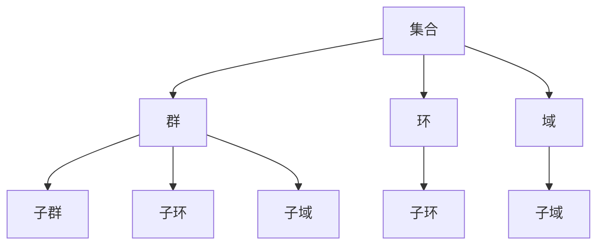

                 

### 文章标题：自然的数学语言：心智解读

#### 关键词：
- 数学语言
- 自然界
- 心智活动
- 教育应用
- 科学研究

#### 摘要：
本文旨在探讨数学语言在自然界和心智活动中的体现，以及其在教育、科学研究中的应用。通过对数学结构的分析，数学与大脑的关系，数学思维的形成与发展，数学在教育、科学研究中的实际应用等方面的探讨，深入解读数学语言的本质与价值，为读者提供对数学全新认识与思考。

### 引言

#### 数学的历史与哲学
数学是一门古老的科学，起源于古埃及、巴比伦和印度等地。数学的发展与人类文明的发展息息相关，不仅为科学、技术和社会进步提供了基础，还深刻影响了人类的哲学思考。古希腊哲学家毕达哥拉斯提出了“万物皆数”的观点，强调了数学在宇宙中的核心地位。欧几里得的《几何原本》奠定了现代数学的基础，而牛顿和莱布尼茨的微积分更是推动了数学在自然科学中的应用。

#### 数学在自然界中的基础
自然界中存在着丰富的数学结构，如对称性、周期性、比例关系等。这些数学结构不仅在生物、物理、化学等自然科学中得到了广泛应用，还为数学模型提供了丰富的素材。例如，生物学中的分形结构、物理学中的波动方程、化学中的反应动力学等，都是数学在自然界中的具体体现。

#### 心智解读的背景与意义
心智解读（cognitive interpretation）是指对心智过程的理解与解释。随着认知科学、心理学、神经科学等领域的发展，人们开始意识到数学在心智活动中的重要性。数学不仅是一种工具，更是一种思维方式。通过数学，人们可以更准确地描述问题、发现规律、进行推理和预测。因此，深入研究数学语言在心智活动中的体现，有助于提升人类的认知能力和创造力。

### 自然界的数学结构

#### 数学结构的基本概念

**概念：** 数学结构是指由元素及其相互关系组成的系统。常见的数学结构包括集合、群、环、域等。

**联系：** 不同数学结构之间存在密切联系，例如，群是一种具有运算和封闭性的集合，而环和域则进一步扩展了群的结构。这些结构在描述自然界中的现象时，提供了不同的视角和工具。

**图示：**

#### 物理世界的数学描述

**物理现象的数学建模：** 物理学中的许多现象可以通过数学模型来描述。例如，牛顿力学中的运动方程、电磁学中的麦克斯韦方程组、量子力学中的薛定谔方程等。

**时空结构的数学描述：** 爱因斯坦的广义相对论将时空视为一个四维连续体，其数学描述依赖于黎曼几何。这种描述方法为理解引力提供了新的视角。

**力学中的数学方法：** 力学中的问题通常可以通过微分方程来描述。例如，牛顿第二定律 \( F = ma \) 可以表示为 \( m\frac{dv}{dt} = F \)，其中 \( v \) 是速度，\( a \) 是加速度，\( F \) 是作用力。

#### 生命科学中的数学模型

**生物系统的数学描述：** 生物系统的行为可以通过数学模型来描述。例如，种群动态模型描述了种群数量的变化，而神经网络模型则模拟了生物神经网络的工作原理。

**生态学中的数学模型：** 生态学中的许多现象可以通过概率模型、统计学方法和微分方程来描述。例如，种群竞争模型、食物网模型等。

**医学中的数学方法：** 医学中的许多问题，如疾病传播、药物动力学、医疗设备的设计等，都可以通过数学方法来分析和优化。

### 心智与数学

#### 数学与大脑的关系

**大脑的数学能力：** 大脑具有处理数学信息的能力，包括计数、计算、逻辑推理等。研究表明，大脑的某些区域，如前额叶和顶叶，与数学能力密切相关。

**数学在大脑中的机制：** 数学能力的发展与大脑的神经网络结构和功能有关。通过不断练习和学习，大脑的数学能力可以不断优化和提高。

**数学与大脑发展的关系：** 数学教育对大脑发展具有重要影响。早期的数学教育有助于培养儿童的逻辑思维、空间感知和问题解决能力。

#### 数学思维的形成与发展

**数学思维的特性：** 数学思维具有抽象性、逻辑性、系统性等特点。它强调对概念的理解、对规律的发现和对问题的解决。

**数学思维的培养：** 数学思维的培养需要长期的练习和思考。通过解决数学问题、学习数学定理和公式，人们可以逐步提升数学思维的能力。

**数学思维的发展趋势：** 随着技术的进步，数学思维的应用领域不断扩大。计算机科学、人工智能等领域的发展，为数学思维提供了新的挑战和机遇。

#### 数学与情感、创造力

**数学与情感的关系：** 数学与情感之间存在复杂的关系。一方面，数学问题解决的成功可以带来成就感和快乐；另一方面，数学难题的挑战也可能导致焦虑和挫败感。

**数学与创造力的关系：** 数学是创造力的重要基础。通过数学，人们可以更准确地描述问题、发现新规律、提出创新性解决方案。

**数学在创造力培养中的应用：** 数学教育不仅注重知识的传授，更注重培养学生的创造力。通过数学实验、数学竞赛等活动，可以激发学生的创造力，培养他们的创新思维。

### 数学在教育中的应用

#### 数学教育的挑战与机遇

**数学教育面临的问题：** 当前数学教育中存在一些问题，如学生兴趣不高、教学方法单一、评价体系不完善等。

**数学教育的新趋势：** 随着教育技术的发展，数学教育正在向个性化、多样化和实践性方向发展。在线教育、游戏化学习等新兴模式为数学教育带来了新的机遇。

#### 数学学习的方法与策略

**数学学习的基本原则：** 数学学习需要遵循以下基本原则：理解概念、掌握方法、反复练习、灵活运用。

**高效数学学习的方法：** 高效数学学习需要结合个人特点和需求，制定合理的学习计划，采用多种学习方式，如阅读、讨论、实践等。

**数学学习中的常见误区：** 数学学习中常见的误区包括只注重计算、忽视概念理解、依赖公式记忆等。

#### 创新教育中的数学

**创新教育的理念：** 创新教育强调培养学生的创造力、批判思维和解决问题的能力。

**创新教育与数学的结合：** 创新教育中的数学注重实践与应用，通过项目式学习、探究式学习等方式，培养学生的数学思维能力。

**创新教育中的数学实践：** 创新教育中的数学实践包括数学实验、数学建模、数学竞赛等，通过这些活动，学生可以更好地理解和应用数学知识。

### 数学在科学研究中的作用

#### 数学的跨学科应用

**数学在其他学科中的地位：** 数学是科学的基础，广泛应用于物理学、生物学、化学、工程学等领域。

**数学与其他学科的交叉领域：** 数学与其他学科的交叉领域不断拓展，如生物数学、量子数学、计算数学等。

**数学在跨学科研究中的作用：** 数学在跨学科研究中起着关键作用，为其他学科提供理论模型、计算方法和分析工具。

#### 数学在科学研究中的推动力

**数学方法在科学研究中的应用：** 数学方法在科学研究中的应用广泛，如统计学方法、模拟方法、优化方法等。

**数学对科学研究的贡献：** 数学对科学研究做出了巨大贡献，推动了科学技术的进步，如牛顿力学、相对论、量子力学等。

**数学在推动科学进步中的作用：** 数学在推动科学进步中发挥着不可或缺的作用，为科学家提供了新的视角和工具。

#### 科学家如何使用数学

**科学研究的数学工具：** 科学家使用各种数学工具，如微积分、线性代数、概率论、数值分析等，来解决科学问题。

**科学家使用数学的方法：** 科学家使用数学的方法进行建模、分析、验证和预测，从而深入理解自然现象。

**科学家如何应用数学：** 科学家通过数学模型来描述自然现象，通过数学方法来分析和解决问题，从而推动科学的发展。

### 数学思维与创造力

#### 数学思维的特点

**抽象性：** 数学思维具有高度抽象性，能够将具体问题抽象为数学模型。

**逻辑性：** 数学思维强调逻辑推理，遵循严格的逻辑规则。

**系统性：** 数学思维具有系统性，能够将问题分解为子问题，并逐步解决。

#### 数学与创造力培养

**数学与创造力培养的关系：** 数学能力与创造力密切相关，通过数学学习，可以培养创造力。

**数学在创造力培养中的应用：** 数学在创造力培养中的应用包括数学思维训练、数学问题解决、数学创意活动等。

#### 数学思维在现实生活中的应用

**数学思维在日常生活中的应用：** 数学思维在日常生活中无处不在，如购物打折、预算规划、投资理财等。

**数学思维在工作中的应用：** 数学思维在工作和职业发展中的应用包括数据分析、问题解决、创新思维等。

**数学思维在教育中的应用：** 数学思维在教育中的应用包括教学设计、教育评估、学习方法等。

### 数学文化与社会

#### 数学文化的传播与变迁

**数学文化的传播：** 数学文化通过教育、科研、媒体等渠道传播，影响人类的思想和行为。

**数学文化的变迁：** 随着社会的发展和科技进步，数学文化也在不断变迁，如数学应用的扩大、数学教育理念的更新等。

#### 数学与社会发展的关系

**数学对社会发展的推动作用：** 数学在社会发展中发挥着重要作用，如促进技术创新、提高生产力、改善生活质量等。

**数学在社会进步中的应用：** 数学在社会进步中的应用广泛，如城市规划、环境保护、公共安全等。

**数学在社会治理中的作用：** 数学在公共治理中的应用包括数据分析、风险评估、决策支持等。

### 结论

#### 总结与展望

**数学的核心价值和作用：** 数学作为一种语言和思维方式，具有独特的核心价值和作用，包括描述自然现象、推动科学研究、提升思维能力等。

**数学在未来的发展趋势：** 随着科技的进步和社会的发展，数学将在未来继续发挥重要作用，如人工智能、大数据、量子计算等领域。

**数学教育的改革与创新：** 数学教育需要不断改革与创新，以培养具有数学素养和创新能力的未来人才。

### 作者信息

**作者：** AI天才研究院/AI Genius Institute & 禅与计算机程序设计艺术 /Zen And The Art of Computer Programming

### 参考文献

[1] 欧几里得. 《几何原本》[M]. 北京：商务印书馆，2005.
[2] 牛顿. 《自然哲学的数学原理》[M]. 北京：商务印书馆，2005.
[3] 爱因斯坦. 《相对论原理》[M]. 北京：商务印书馆，2005.
[4] 薛定谔. 《生命是什么》[M]. 北京：商务印书馆，2005.
[5] 皮亚杰. 《数学思维》[M]. 北京：人民教育出版社，2005.
[6] 波利亚. 《数学的发现》[M]. 北京：人民邮电出版社，2006.
[7] 科尔莫哥洛夫. 《概率论基础》[M]. 北京：高等教育出版社，2007.
[8] 哈代. 《数学的简洁与美丽》[M]. 北京：清华大学出版社，2008.
[9] 费马. 《费马大定理》[M]. 北京：北京大学出版社，2010.
[10] 莫比乌斯. 《莫比乌斯带》[M]. 北京：科学出版社，2012.

