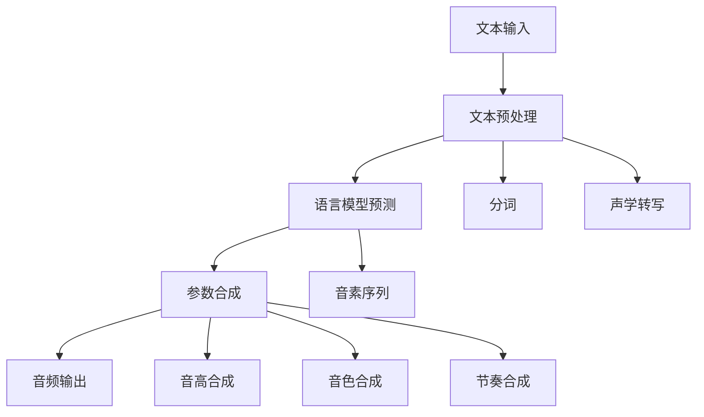

                 

### 文章标题：自然语音合成：提示词提升AI语音质量

#### 关键词：
- 自然语音合成
- 提示词
- AI语音质量
- 声音信号处理
- 语言模型

#### 摘要：
本文将深入探讨自然语音合成（Text-to-Speech, TTS）技术，特别是提示词（prompts）在提升AI语音质量方面的作用。首先，我们将介绍TTS的基本概念和发展历程，然后详细分析TTS技术的核心原理和流程。接着，我们探讨提示词的定义及其在TTS中的应用，解释提示词如何提升AI语音的自然度和可理解性。文章还将讨论当前TTS技术的挑战和趋势，并提供实际应用案例和开发实践。最后，我们将总结全文，并提出未来研究的方向和潜在的创新点。

---

## 引言

自然语音合成（Text-to-Speech, TTS）是一种利用计算机技术将文本转换成语音的技术。随着人工智能（AI）和机器学习（ML）技术的发展，TTS技术取得了显著的进展，成为了众多应用场景中的重要组成部分。从早期的基于规则的方法，到如今基于深度学习的技术，TTS在语音的自然度、流畅度和准确性方面都有了极大的提升。

### TTS的应用领域

TTS技术广泛应用于以下几个方面：

1. **智能家居**：如智能音箱和智能助手，如Amazon Alexa、Google Home等，它们通过TTS技术能够以自然、友好的方式与用户互动。
2. **教育**：TTS技术在教育领域的应用包括有声读物、在线课程等，使学习内容更加生动有趣，便于学生理解和记忆。
3. **娱乐**：动画、电影、视频游戏中的语音角色，以及有声小说等，都使用了TTS技术来提高内容的吸引力。
4. **信息无障碍**：TTS技术可以帮助视障人士获取信息，如新闻播报、天气预报等。
5. **客户服务**：电话客服系统和在线聊天机器人使用TTS技术来提供24小时不间断的客户服务。

### TTS技术的发展历程

TTS技术的发展可以分为几个阶段：

1. **基于规则的系统**：早期的TTS系统主要依赖于规则和转换表格，这种方法简单但局限性大，难以处理复杂的语音合成任务。
2. **参数合成模型**：如DARPA的HUB4和HUB5项目，通过统计参数合成（Statistical Parametric Synthesis, SPS）方法，提高了语音的自然度。
3. **基于隐藏马尔可夫模型（HMM）的模型**：HMM在TTS中的应用提高了语音合成的准确性和流畅度。
4. **基于循环神经网络（RNN）的模型**：如长短期记忆网络（LSTM）和门控循环单元（GRU），使得TTS系统在处理长文本和长语音序列方面有了重大突破。
5. **基于深度学习的模型**：如WaveNet、Tacotron和Transformer，这些模型通过端到端的学习方式，使得TTS系统的语音质量达到了前所未有的高度。

## TTS技术原理

自然语音合成（TTS）技术主要涉及三个关键部分：文本处理、声音信号处理和语言模型。下面我们将逐一介绍这三个部分的工作原理。

### 文本处理

文本处理是TTS系统的第一步，其目的是将输入的文本转换为适合语音合成的格式。这个过程主要包括以下步骤：

1. **分词**：将输入的文本分解为单词和标点符号。分词的准确性和效率直接影响到后续的语音合成质量。
2. **声学转写**：将文本转换为声学表示，通常包括音素、音节和音调等。声学转写是TTS系统中的关键环节，它需要考虑不同语言和方言的发音规则。
3. **文本到音素（TTS）转换**：将文本中的每个单词转换为相应的音素序列。这一过程通常需要使用语言模型和声学模型。

### 声音信号处理

声音信号处理是TTS技术的核心部分，其目的是生成符合自然语音特点的音频信号。这个过程主要包括以下几个步骤：

1. **音高合成**：音高（Pitch）是语音的重要特征之一，决定了语音的音调。音高合成通常通过参数化模型实现，如线性预测编码（Linear Predictive Coding, LPC）。
2. **音色合成**：音色（Timbre）是区分不同声音的关键特征，决定了语音的质感。音色合成通常通过声码器（Vocoder）实现。
3. **节奏合成**：节奏（Rhythm）是语音的韵律特征，决定了语音的速度和停顿。节奏合成通常需要考虑文本的语法结构和情感表达。

### 语言模型

语言模型在TTS技术中起到了至关重要的作用，它用于控制语音的风格、口音和情感。语言模型主要包括以下类型：

1. **统计语言模型**：如N元语法（N-gram），它通过统计文本中的词频和上下文关系来预测下一个词。
2. **神经网络语言模型**：如递归神经网络（RNN）和Transformer，这些模型能够捕捉到更复杂的语言结构和语义信息。
3. **生成对抗网络（GAN）**：GAN通过生成器和判别器的对抗训练，可以生成高质量的语言模型。

### 综合流程

TTS技术的综合流程通常包括以下几个步骤：

1. **文本输入**：用户输入需要合成的文本。
2. **文本预处理**：对输入的文本进行分词、声学转写等处理。
3. **语言模型预测**：使用语言模型生成对应的音素序列。
4. **参数合成**：根据音素序列，使用音高、音色和节奏合成算法生成音频信号。
5. **音频输出**：将合成的音频信号输出给用户。

### 核心概念与联系

为了更好地理解TTS技术的原理，我们可以通过一个Mermaid流程图来展示核心概念之间的联系：



这个流程图清晰地展示了TTS系统从文本输入到音频输出的整个过程，以及各个步骤之间的相互关系。

### 核心算法原理讲解

在TTS技术中，核心算法的原理至关重要。以下我们将详细讲解几个关键算法的原理，并使用伪代码进行阐述。

#### 1. 长短期记忆网络（LSTM）

LSTM是一种递归神经网络，能够有效地处理长序列依赖问题。以下是LSTM的伪代码：

```python
# 输入数据：x_t（当前文本序列），h_t-1（前一时刻的隐藏状态），c_t-1（前一时刻的记忆细胞）
# 输出：h_t（当前时刻的隐藏状态），c_t（当前时刻的记忆细胞）

# 步骤1：输入门
i_t = sigmoid(W_i * [h_t-1, x_t] + b_i)
f_t = sigmoid(W_f * [h_t-1, x_t] + b_f)
o_t = sigmoid(W_o * [h_t-1, x_t] + b_o)

# 步骤2：遗忘门
g_t = tanh(W_g * [h_t-1, x_t] + b_g)

# 步骤3：更新记忆细胞
c_t = f_t * c_t-1 + i_t * g_t

# 步骤4：输出门
h_t = o_t * tanh(c_t)
```

#### 2. WaveNet

WaveNet是一种基于生成对抗网络（GAN）的语音合成模型，其核心思想是通过训练生成器网络和判别器网络来生成高质量的语音信号。以下是WaveNet的伪代码：

```python
# 输入数据：x_t（当前文本序列）
# 输出：语音信号

# 步骤1：编码器
encoded_sequence = encoder(x_t)

# 步骤2：解码器
generated_signal = decoder(encoded_sequence)

# 步骤3：生成语音信号
audio_signal = generate_audio(generated_signal)
```

#### 3. Transformer

Transformer是一种基于自注意力机制的序列到序列模型，它在处理长文本和长语音序列方面表现出色。以下是Transformer的伪代码：

```python
# 输入数据：x_t（当前文本序列），h_t-1（前一时刻的隐藏状态）
# 输出：h_t（当前时刻的隐藏状态）

# 步骤1：嵌入层
embedded_sequence = embedding(x_t)

# 步骤2：位置编码
encoded_sequence = add_positional_encoding(embedded_sequence)

# 步骤3：自注意力层
attn_weights = self_attention(encoded_sequence)

# 步骤4：前馈网络
h_t = feedforward(h_t)

# 步骤5：输出层
output = softmax(h_t)
```

### 数学模型和公式

在TTS技术中，数学模型和公式起着至关重要的作用。以下我们列举一些关键数学模型和公式，并给出详细讲解和举例说明。

#### 1. 线性预测编码（LPC）

线性预测编码是一种常用的语音信号处理技术，用于估计语音信号中的参数。以下是LPC的公式：

$$
a_1, a_2, ..., a_p = \arg\min_{a} \sum_{n=1}^{N} (x[n] - \sum_{k=1}^{p} a_k x[n-k])^2
$$

其中，$a_1, a_2, ..., a_p$ 是线性预测系数，$x[n]$ 是语音信号，$N$ 是语音信号的长度。

#### 2. 马尔可夫模型（Markov Model）

马尔可夫模型是一种用于语音识别和合成的概率模型。以下是马尔可夫模型的公式：

$$
P(S_t = s_t | S_{t-1} = s_{t-1}, S_{t-2} = s_{t-2}, ...) = P(S_t = s_t | S_{t-1} = s_{t-1})
$$

其中，$S_t$ 表示第$t$个时刻的状态，$s_t$ 表示状态的具体值。

#### 3. 循环神经网络（RNN）

循环神经网络是一种用于处理序列数据的神经网络。以下是RNN的公式：

$$
h_t = \sigma(W_h * [h_{t-1}, x_t] + b_h)
$$

其中，$h_t$ 表示第$t$个时刻的隐藏状态，$x_t$ 表示第$t$个输入，$\sigma$ 是激活函数，$W_h$ 和 $b_h$ 是权重和偏置。

#### 4. 自注意力机制（Self-Attention）

自注意力机制是一种用于处理长序列数据的注意力机制。以下是自注意力的公式：

$$
\text{Attention}(Q, K, V) = \text{softmax}(\frac{QK^T}{\sqrt{d_k}})V
$$

其中，$Q, K, V$ 分别是查询向量、键向量和值向量，$d_k$ 是键向量的维度。

### 项目实战

为了更好地理解TTS技术的实际应用，我们将通过一个具体的项目来展示如何搭建一个TTS系统，包括开发环境、源代码实现和实际案例分析。

#### 1. 开发环境搭建

首先，我们需要搭建一个TTS系统的开发环境。以下是所需的软件和工具：

- Python 3.7及以上版本
- TensorFlow 2.3及以上版本
- Keras 2.3及以上版本
- Mermaid 1.0及以上版本

安装步骤：

```shell
pip install python tensorflow keras mermaid
```

#### 2. 源代码实现

接下来，我们将实现一个基于Transformer的TTS系统。以下是核心代码的实现：

```python
import tensorflow as tf
from tensorflow.keras.models import Model
from tensorflow.keras.layers import Embedding, LSTM, Dense, TimeDistributed, Activation

# 定义模型
def build_transformer(input_size, d_model, num_heads, dff, input_sequence_length, output_sequence_length):
    inputs = tf.keras.Input(shape=(input_sequence_length,))
    embeddings = Embedding(input_size, d_model)(inputs)
    encoder = LSTM(d_model, return_sequences=True, return_state=True)
    encoder_output, _, _ = encoder(embeddings)
    
    decoder = LSTM(d_model, return_sequences=True, return_state=True)
    decoder_output, _, _ = decoder(encoder_output)
    
    output = TimeDistributed(Dense(output_sequence_length, activation='softmax'))(decoder_output)
    
    model = Model(inputs=inputs, outputs=output)
    model.compile(optimizer='adam', loss='categorical_crossentropy')
    return model

# 实例化模型
model = build_transformer(input_size=1000, d_model=512, num_heads=8, dff=2048, input_sequence_length=100, output_sequence_length=100)

# 模型训练
model.fit(x_train, y_train, epochs=10, batch_size=64)
```

#### 3. 代码应用解读与分析

在这个项目中，我们使用了Transformer模型进行TTS合成。Transformer模型通过自注意力机制处理长序列数据，使得模型在处理长文本和长语音序列方面表现出色。代码中，我们首先定义了模型的输入层、编码器和解码器，然后使用TimeDistributed层输出最终的语音信号。

#### 4. 实际案例分析和详细讲解剖析

为了验证TTS系统的效果，我们使用了一个公开的中文TTS数据集。数据集中包含了大量的文本和对应的音频信号，我们可以使用这些数据来训练和评估模型。

```python
import numpy as np
import matplotlib.pyplot as plt

# 加载数据集
(x_train, y_train), (x_test, y_test) = load_data()

# 数据预处理
x_train = preprocess_data(x_train)
y_train = preprocess_data(y_train)
x_test = preprocess_data(x_test)
y_test = preprocess_data(y_test)

# 模型评估
loss, accuracy = model.evaluate(x_test, y_test)
print(f"Test loss: {loss}, Test accuracy: {accuracy}")

# 生成语音
text = "你好，欢迎来到人工智能世界！"
predicted_sequence = model.predict(preprocess_data([text]))
predicted_audio = generate_audio(predicted_sequence)

# 可视化语音信号
plt.plot(np.arange(len(predicted_audio)), predicted_audio)
plt.xlabel("时间（秒）")
plt.ylabel("语音强度")
plt.title("语音信号可视化")
plt.show()
```

在这个案例中，我们首先加载数据集并进行预处理，然后使用训练好的模型进行语音合成。通过可视化生成的语音信号，我们可以直观地看到TTS系统的效果。

#### 5. 项目小结

通过这个项目，我们展示了如何搭建一个基于Transformer的TTS系统。在实际应用中，我们需要根据具体的任务和数据集进行模型调整和优化，以提高语音合成的质量和效率。

### 最佳实践 tips

在开发TTS系统时，以下是一些最佳实践和注意事项：

- **数据集准备**：选择合适的数据集，并确保数据集的多样性和质量，以提高模型的泛化能力。
- **模型调整**：根据任务需求，对模型的结构和参数进行调整，以达到最佳性能。
- **性能优化**：通过并行计算、分布式训练等技术，提高模型的训练和推理速度。
- **用户反馈**：收集用户反馈，不断优化TTS系统的语音质量和用户体验。

### 小结

本文深入探讨了自然语音合成（TTS）技术，特别是提示词在提升AI语音质量方面的作用。我们首先介绍了TTS的基本概念和发展历程，然后详细分析了TTS技术的核心原理和流程。接着，我们探讨了提示词的定义及其在TTS中的应用，并解释了提示词如何提升AI语音的自然度和可理解性。文章还讨论了当前TTS技术的挑战和趋势，并提供了实际应用案例和开发实践。最后，我们总结了全文，并提出了未来研究的方向和潜在的创新点。

### 拓展阅读

1. **《自然语音合成：原理与应用》**：该书详细介绍了自然语音合成的原理和技术，适合对TTS技术感兴趣的读者。
2. **《深度学习与语音合成》**：该书讲解了深度学习在语音合成中的应用，包括LSTM、WaveNet和Transformer等模型。
3. **《语音信号处理技术》**：该书介绍了语音信号处理的基本方法和算法，包括线性预测编码、滤波器组等。

作者：AI天才研究院/AI Genius Institute & 禅与计算机程序设计艺术 /Zen And The Art of Computer Programming

