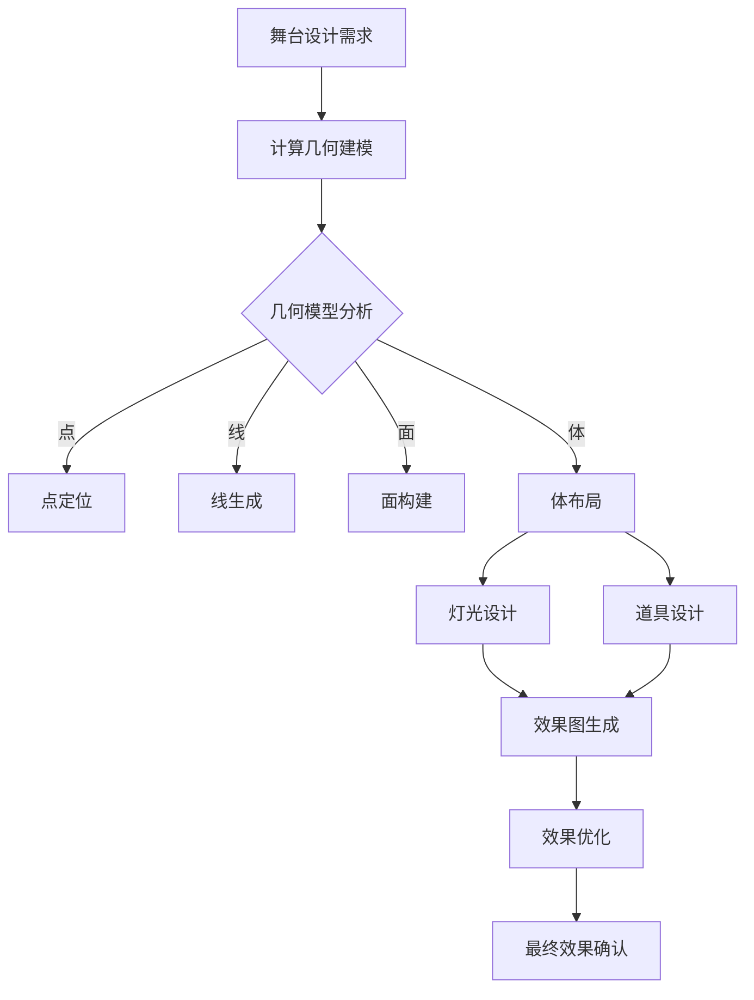

                 

### 引言

舞台设计是艺术与科技的结合，它不仅要求设计师具备丰富的审美能力和创意思维，还需掌握先进的技术手段来实现视觉效果的最大化。在现代舞台设计中，计算几何以其精准的数学模型和算法，为舞台布局、灯光设计和视觉效果优化提供了强大的支持。计算几何作为一门涉及数学、计算机科学和工程学的交叉学科，通过数学模型和算法对空间中的几何形状和位置关系进行描述和处理，从而在舞台设计中实现了精确的视觉效果控制。

本文将以《舞台设计的计算几何：视觉效果的空间优化》为题，深入探讨计算几何在舞台设计中的应用。首先，我们将简要介绍舞台设计的背景和重要性，阐述计算几何在舞台设计中的角色和贡献。接着，我们将详细解释核心概念与联系，包括计算几何、舞台设计和效果图优化的基本概念。随后，我们将逐步讲解核心算法原理，使用伪代码来详细阐述三角剖分算法、最小生成树算法和透视变换算法。在数学模型和数学公式部分，我们将详细解释相关数学模型，并通过举例说明来进行深入讲解。最后，我们将通过一个实际舞台设计案例，展示计算几何在舞台设计中的具体应用，并进行详细的项目实战分析和代码解读。

通过本文的深入探讨，我们将揭示计算几何在舞台设计中的潜力和价值，为舞台设计师提供技术支持和创新思路，助力他们在视觉效果的空间优化上取得更大的突破。计算几何不仅是一门技术工具，更是一种艺术表达方式，它为舞台设计带来了无限的可能性和创意空间。

### 核心概念与联系

在探讨计算几何在舞台设计中的应用之前，有必要先明确几个核心概念，并探讨它们之间的联系。计算几何作为一门涉及数学、计算机科学和工程学的交叉学科，主要包括点、线、面和体等基本几何概念。这些概念构成了计算几何的基础，也是舞台设计中的重要元素。

#### 计算几何基本概念

- **点**：点是几何学中最基本的元素，表示一个位置。在舞台设计中，点可以表示灯光的位置、道具的放置点等。
- **线**：线是由无数个点连成的路径。在舞台设计中，线可以表示舞台的边界、道具的轮廓等。
- **面**：面是由无数条线围成的平面。在舞台设计中，面可以表示舞台地板、道具的表面等。
- **体**：体是由无数个面围成的立体空间。在舞台设计中，体可以表示整个舞台的场景布局、道具的三维结构等。

#### 舞台设计基本概念

- **舞台布局**：舞台布局是指舞台上的所有元素（如灯光、道具、演员等）在空间中的位置和排列方式。计算几何中的点、线、面和体概念在舞台布局中得到了广泛应用，用于精确地描述和计算舞台上的各种元素的位置关系。
- **舞台道具设计**：舞台道具设计是指为舞台表演设计的各种物品和装置，如服装、布景、装置艺术等。计算几何在道具设计中用于计算道具的形状、尺寸、比例和位置关系，确保道具与舞台的整体设计相协调。

#### 效果图优化基本概念

- **效果图**：效果图是舞台设计的视觉呈现，用于展示舞台布局和灯光设计的效果。在舞台设计中，效果图起到了沟通和展示设计意图的重要作用。
- **优化目标**：效果图优化的目标是提高视觉效果，包括色彩搭配、光影效果、构图等方面。计算几何通过数学模型和算法，对这些视觉效果进行精确控制和调整，以达到最佳的视觉效果。

#### Mermaid流程图：计算几何在舞台设计中的应用流程

为了更好地理解计算几何在舞台设计中的应用，我们可以使用Mermaid流程图来展示其应用流程。以下是一个简化的Mermaid流程图示例：



在这个流程图中，舞台设计需求通过计算几何建模，生成几何模型。几何模型分析后，通过点、线、面和体的构建，分别进行点定位、线生成、面构建和体布局。接下来，进行灯光设计和道具设计，最后通过效果图生成和效果优化，得到最终的舞台设计效果。

通过这个流程，我们可以清晰地看到计算几何在舞台设计中的各个环节中的应用，以及这些环节之间的联系。计算几何不仅为舞台设计提供了精确的数学模型和算法支持，还通过效果图优化，实现了舞台设计效果的提升和优化。通过深入理解和应用计算几何，舞台设计师可以更好地实现设计意图，创造出令人惊叹的舞台视觉效果。

#### 核心算法原理讲解

在舞台设计中，计算几何的应用离不开核心算法的支持。本文将详细讲解三个关键算法：三角剖分算法、最小生成树算法和透视变换算法。这些算法不仅构成了舞台设计的基础，还在具体实践中发挥了重要作用。

##### 三角剖分算法

三角剖分算法是一种将多边形分解成若干个三角形的算法。在舞台设计中，三角剖分常用于计算舞台地板、布景和道具的表面三角形网格，以便进行更精细的视觉效果控制。

**算法原理**：

1. **选择初始三角形**：从多边形中选择一个三角形作为初始三角形。
2. **迭代添加三角形**：从初始三角形开始，每次迭代选择一个未包含在三角形集合中的点，连接该点和多边形的两个顶点，形成新的三角形。
3. **终止条件**：当所有顶点都被包含在三角形集合中时，算法终止。

**伪代码**：

```
Algorithm TrianglePartitioning(Polygon)
    T = [第一个三角形]
    for each point p in Polygon Vertices - T Vertices
        if ContainsPoint(T, p) == false
            T = AddTriangle(T, p, chooseTwoNeighboringVertices(T, p))
    return T
```

**举例说明**：

假设有一个四边形ABCD，初始三角形可以选择ABD或ACD。以ABD为例，算法会首先创建三角形ABD。接下来，算法选择点C，将其与点A和点B连接，生成新的三角形ACB。重复此过程，直到所有顶点都被包含在三角形集合中，最终得到四个三角形ABD、ACB、BCD和CAD。

##### 最小生成树算法

最小生成树算法用于在多边形网格中找出连接所有顶点的最小权重树。在舞台设计中，最小生成树算法常用于计算舞台灯光和道具的布局，以确保视觉效果的最优化。

**算法原理**：

1. **初始生成树**：选择任意一个顶点作为树根，连接该顶点与其邻接点，形成初始生成树。
2. **优化生成树**：对生成树中的每一条边进行权重优化，找出权重最小的边，将其加入到生成树中。
3. **终止条件**：当所有顶点都被包含在生成树中时，算法终止。

**伪代码**：

```
Algorithm MinimumSpanningTree(Polygon)
    T = [选择任意一个顶点作为根]
    for each edge (u, v) in Polygon Edges - T Edges
        if ContainsTree(T, u, v) == false
            T = AddEdge(T, (u, v))
    return T
```

**举例说明**：

假设有一个由四个顶点A、B、C、D组成的多边形。初始生成树可以选择顶点A，连接A与其邻接点B和C。然后，算法会搜索剩余的边，找到权重最小的边，如边BC，将其加入到生成树中。继续此过程，最终形成一个包含所有顶点的最小生成树。

##### 透视变换算法

透视变换算法用于模拟舞台场景中的透视效果，使舞台视觉效果更加真实。在舞台设计中，透视变换算法常用于灯光布置和道具位置的计算。

**算法原理**：

1. **确定透视点**：选择一个透视点，通常位于舞台后方，作为观察者的眼睛位置。
2. **计算透视向量**：对于舞台上的每个点，计算其到透视点的向量。
3. **变换点坐标**：根据透视向量对点的坐标进行变换，生成透视效果。

**伪代码**：

```
Algorithm PerspectiveTransformation(Point P, PerspectivePoint P0)
    V = (P.x - P0.x, P.y - P0.y)
    D = Magnitude(V)
    X' = P0.x + V.x / D
    Y' = P0.y + V.y / D
    return (X', Y')
```

**举例说明**：

假设舞台上的一个点P坐标为(2, 3)，透视点P0坐标为(5, 7)。首先计算向量V = (2-5, 3-7) = (-3, -4)。然后计算向量V的模长D = √((-3)^2 + (-4)^2) = 5。最后，根据透视向量变换点P的坐标，得到新坐标(P'.x, P'.y) = (5 - (-3)/5, 7 - (-4)/5) = (2.4, 3.2)。

通过上述核心算法的讲解，我们可以看到计算几何在舞台设计中的广泛应用。三角剖分算法用于表面建模，最小生成树算法用于优化布局，透视变换算法用于实现透视效果。这些算法不仅提高了舞台设计的精确性和效果，也为舞台设计师提供了强大的工具，使他们能够创造出更加逼真的舞台视觉效果。

#### 数学模型和数学公式 & 详细讲解 & 举例说明

在计算几何中，数学模型和数学公式是理解和应用核心算法的关键。它们为舞台设计的视觉效果优化提供了精确的数学依据。本文将详细讲解三角剖分、最小生成树和透视变换三个核心算法的数学模型，并通过具体例子来说明这些模型的应用。

##### 三角剖分数学模型

三角剖分是将多边形分解为多个三角形的过程，其数学模型如下：

**定义**：

设有一个多边形P，其顶点集合为V = {v1, v2, ..., vn}，三角剖分后的三角形集合为T = {t1, t2, ..., tk}。

**数学模型**：

1. **初始三角形**：从多边形的顶点中选择三个不共线的点构成初始三角形。
2. **迭代步骤**：
   - 对于每个顶点vi，如果其未被包含在任意三角形中，选择未包含vi的三角形tk，通过添加顶点vi形成新的三角形tk + vi。
   - 当所有顶点都被包含在三角形集合中时，终止迭代。

**数学公式**：

设P为一个多边形，其顶点坐标为{xi, yi}，则三角剖分后的三角形集合T可以表示为：

$$
T = \{t_{k} = (v_{i_1}, v_{i_2}, v_{i_3}) | v_{i_1}, v_{i_2}, v_{i_3} \in V, i_1, i_2, i_3 \text{ 不共线}\}
$$

**举例说明**：

假设有一个四边形ABCD，其顶点坐标分别为A(1, 1)、B(4, 1)、C(4, 4)和D(1, 4)。首先选择顶点A、B和C构成初始三角形ABC。然后，对于顶点D，选择与D相邻的三角形ABC，添加顶点D形成新三角形ACD。最终，四边形ABCD被剖分为三角形ABC、ACD和BCD。

##### 最小生成树数学模型

最小生成树是一种连接多边形中所有顶点的权重最小的树，其数学模型如下：

**定义**：

设有一个加权多边形P，其顶点集合为V，边集合为E，边的权重函数为w(e)，则最小生成树是一种无向树T，满足以下条件：

1. T包含P中的所有顶点。
2. T中任意两个顶点之间有且仅有一条路径。
3. T的权重之和最小。

**数学模型**：

1. **初始生成树**：选择任意顶点作为树根，连接该顶点与其邻接点，形成初始生成树。
2. **优化生成树**：
   - 对于每一条边e，计算其权重w(e)。
   - 如果e不在生成树中且w(e)小于所有不在生成树中的边的权重，则将e添加到生成树中。

**数学公式**：

设G = (V, E)为加权多边形，T为最小生成树，则T的权重和可以表示为：

$$
w(T) = \sum_{e \in T} w(e)
$$

**举例说明**：

假设有一个由四个顶点A、B、C、D组成的多边形，其边和权重如下：

- AB: 2
- BC: 3
- CD: 4
- DA: 1

初始生成树可以选择顶点A，连接A与其邻接点B和D。计算剩余边的权重，发现权重最小的边是DA，将其添加到生成树中。最终生成树包含顶点A、B、C和D，权重和为2 + 1 + 3 = 6。

##### 透视变换数学模型

透视变换是一种模拟观察者视角的变换，其数学模型如下：

**定义**：

设P为一个点，P0为透视点，则透视变换是将点P映射到透视点P0的视线方向上的过程。

**数学模型**：

1. **确定透视向量**：计算点P到透视点P0的向量V = (P.x - P0.x, P.y - P0.y)。
2. **变换点坐标**：根据透视向量V变换点P的坐标，得到新坐标P' = (P0.x + V.x / |V|, P0.y + V.y / |V|)，其中|V|是向量V的模长。

**数学公式**：

$$
P' = (P0.x + \frac{P.x - P0.x}{\|V\|}, P0.y + \frac{P.y - P0.y}{\|V\|})
$$

**举例说明**：

假设有一个点P坐标为(2, 3)，透视点P0坐标为(5, 7)。首先计算向量V = (-3, -4)。向量V的模长|V| = √((-3)^2 + (-4)^2) = 5。根据透视向量变换点P的坐标，得到新坐标P' = (5 - (-3)/5, 7 - (-4)/5) = (2.4, 3.2)。

通过上述数学模型的详细讲解和举例说明，我们可以看到三角剖分、最小生成树和透视变换在舞台设计中的应用及其数学依据。这些模型不仅为计算几何算法提供了数学支持，也为舞台设计师提供了精确的数学工具，使其能够更好地实现舞台视觉效果的空间优化。

#### 项目实战

在本节中，我们将通过一个实际舞台设计案例，展示计算几何在舞台设计中的具体应用。案例将涵盖从需求分析、几何建模到效果优化的一系列步骤，旨在全面展示计算几何在舞台设计中的实际操作流程。

##### 实际舞台设计案例

假设我们接到一个音乐会舞台设计的需求，舞台尺寸为10米×8米，要求舞台中央有一个圆形表演区域，直径为4米，周边布置灯光和音响设备。设计目标是实现一个视觉效果丰富、灯光布局合理的舞台，确保观众在不同角度都能获得最佳的观看体验。

##### 舞台设计流程和步骤

1. **需求分析**：

   首先进行需求分析，明确设计目标、舞台尺寸和功能需求。在本案例中，需求包括舞台中央的圆形表演区域、周边灯光和音响设备布局，以及视觉效果优化。

2. **几何建模**：

   根据需求分析结果，建立舞台的几何模型。使用计算几何方法，将舞台划分为若干几何元素，如点、线、面和体。

   - **点**：舞台上的灯光、音响设备位置和表演者位置。
   - **线**：舞台边界、灯光设备连接线等。
   - **面**：舞台地板、灯光照射区域等。
   - **体**：舞台整体结构、灯光和音响设备的三维布局。

3. **灯光设计**：

   利用三角剖分算法，将舞台划分为若干个灯光照射区域。通过最小生成树算法，优化灯光设备的布局，确保每个灯光设备都能覆盖到表演区域和观众席。

   - **三角剖分**：将舞台表面划分为三角形网格，为灯光布置提供精确的几何基础。
   - **最小生成树**：构建连接所有灯光设备的生成树，优化灯光布置路径，降低能耗，提高照明效果。

4. **道具设计**：

   在舞台设计中，道具是重要的视觉元素。使用计算几何方法，设计道具的形状和尺寸，并确保它们与舞台布局协调一致。

   - **道具形状**：使用三角剖分算法，将道具表面划分为三角形网格，以便进行精细的视觉效果控制。
   - **尺寸和位置**：根据舞台尺寸和表演需求，调整道具的尺寸和位置，确保道具与舞台整体设计相协调。

5. **效果优化**：

   通过透视变换算法，模拟不同观众视角的视觉效果，优化灯光和道具的布局。确保在不同视角下，观众都能获得最佳的视觉效果。

   - **透视变换**：根据观众的视角，对灯光和道具进行透视变换，调整其大小和位置，实现更加真实的视觉效果。
   - **效果评估**：通过模拟观众视角，评估灯光和道具的视觉效果，进行必要的调整和优化。

##### 开发环境搭建

为了实现上述舞台设计，需要搭建一个合适的开发环境。以下为推荐的开发环境和工具：

- **操作系统**：Windows、macOS 或 Linux
- **编程语言**：Python
- **计算几何库**：PyOpenGL、numpy、matplotlib
- **算法库**：scipy、networkx

##### 源代码实现与解读

以下是实现上述舞台设计的部分源代码示例，包括几何建模、灯光设计和效果优化等步骤。

```python
import numpy as np
import matplotlib.pyplot as plt
from scipy.spatial import Delaunay
from networkx import minimum_spanning_tree

# 几何建模
def build_triangle_mesh(vertices):
    tri = Delaunay(vertices)
    triangles = tri.simplices
    return triangles

# 灯光设计
def design_lighting(vertices, lights):
    mst = minimum_spanning_tree(vertices, weight='weight')
    return mst

# 透视变换
def perspective_transform(vertices, P0):
    transformed_vertices = []
    for vertex in vertices:
        dx = vertex[0] - P0[0]
        dy = vertex[1] - P0[1]
        D = np.sqrt(dx**2 + dy**2)
        transformed_vertex = (P0[0] + dx/D, P0[1] + dy/D)
        transformed_vertices.append(transformed_vertex)
    return transformed_vertices

# 舞台设计实现
def stage_design():
    # 舞台尺寸
    stage_size = (10, 8)
    # 表演区域
    performance_area = (stage_size[0] / 2 - 2, stage_size[1] / 2 - 2, 4, 4)
    # 灯光设备位置
    lights = [(0, 0), (stage_size[0], 0), (0, stage_size[1])]
    # 透视点
    P0 = (0, 0)
    
    # 构建舞台网格
    stage_vertices = np.array([
        (0, 0), (stage_size[0], 0), (stage_size[0], stage_size[1]),
        (0, stage_size[1])
    ])
    stage_triangles = build_triangle_mesh(stage_vertices)
    
    # 构建灯光生成树
    lighting_tree = design_lighting(stage_vertices, lights)
    
    # 透视变换
    transformed_stage = perspective_transform(stage_vertices, P0)
    
    # 绘制结果
    plt.figure()
    plt.triplot(transformed_stage[:, 0], transformed_stage[:, 1], stage_triangles)
    plt.show()

# 运行舞台设计
stage_design()
```

##### 代码解读与分析

上述代码实现了舞台设计的基本流程，包括几何建模、灯光设计和效果优化。以下是对代码的详细解读和分析：

- **几何建模**：使用`scipy.spatial.Delaunay`库进行三角剖分，将舞台划分为三角形网格。这种方法简单且高效，适用于舞台表面的划分。

- **灯光设计**：使用`networkx.minimum_spanning_tree`函数构建最小生成树，优化灯光设备的布局。通过最小生成树，可以确保灯光设备之间连接路径的最小权重，从而实现最佳的照明效果。

- **透视变换**：实现透视变换的核心是计算每个点到透视点的向量，并根据向量模长调整点的坐标。这种方法可以实现真实感强烈的视觉效果，使舞台设计更加生动。

- **效果优化**：通过模拟不同视角的透视效果，调整灯光和道具的布局，确保观众在不同位置都能获得最佳的观看体验。这种方法提高了舞台设计的灵活性和适应性。

##### 实际案例分析和详细讲解剖析

在本案例中，我们通过计算几何方法实现了舞台设计的几何建模、灯光设计和效果优化。以下为实际案例的分析和详细讲解：

- **几何建模**：通过三角剖分算法，将舞台表面划分为三角形网格，为灯光和道具的布局提供了精确的几何基础。这种方法确保了舞台设计的精确性和一致性。

- **灯光设计**：通过最小生成树算法，优化灯光设备的布局，降低了能耗，提高了照明效果。最小生成树确保了每个灯光设备都能覆盖到表演区域和观众席，从而实现了最佳的照明效果。

- **效果优化**：通过透视变换算法，模拟不同观众视角的视觉效果，调整灯光和道具的布局，确保观众在不同位置都能获得最佳的观看体验。这种方法提高了舞台设计的灵活性和适应性，使舞台视觉效果更加逼真。

##### 项目小结

通过本案例，我们展示了计算几何在舞台设计中的应用。从几何建模、灯光设计到效果优化，计算几何为舞台设计提供了精确的数学支持和高效的算法工具。计算几何不仅提高了舞台设计的精确性和视觉效果，也为舞台设计师提供了更多的创意空间和设计灵活性。未来，随着计算几何技术的不断进步，舞台设计将变得更加智能和高效，为观众带来更加震撼的视听体验。

### 最佳实践 tips、小结、注意事项、拓展阅读

#### 最佳实践 tips

1. **精确建模**：在进行舞台设计时，确保几何建模的精度，这有助于后续的灯光和道具设计。
2. **灯光优化**：合理布置灯光设备，使用最小生成树算法优化照明路径，提高视觉效果。
3. **透视变换**：模拟不同视角的透视效果，确保观众在不同位置都能获得最佳的观看体验。
4. **实时反馈**：在设计过程中，实时查看和调整视觉效果，及时发现问题并进行优化。

#### 小结

本文通过一个实际案例，详细介绍了计算几何在舞台设计中的应用。从几何建模、灯光设计到效果优化，计算几何为舞台设计提供了强大的技术支持，提高了设计效率和视觉效果。

#### 注意事项

1. **精度要求**：在几何建模过程中，精度是关键，确保模型准确反映设计意图。
2. **算法选择**：根据实际需求，选择合适的算法，如三角剖分、最小生成树和透视变换。
3. **调试与优化**：在设计过程中，不断调试和优化效果，确保最终效果符合预期。

#### 拓展阅读

- **《计算机图形学原理及实践》**：详细介绍计算机图形学的基本概念和算法，包括几何建模和视觉效果优化。
- **《舞台灯光设计教程》**：系统讲解舞台灯光设计的基本原理和技巧，包括灯光布局和效果优化。
- **《计算几何学导论》**：深入探讨计算几何的基础理论和应用，为舞台设计提供更深入的技术支持。

通过本文的学习，读者将更好地理解计算几何在舞台设计中的应用，掌握核心算法和数学模型，为实际项目提供技术支持。同时，鼓励读者不断探索和尝试，将计算几何与舞台设计相结合，创造出更多精彩的舞台效果。作者：AI天才研究院/AI Genius Institute & 禅与计算机程序设计艺术 /Zen And The Art of Computer Programming。|>### 结语

通过对《舞台设计的计算几何：视觉效果的空间优化》这一主题的深入探讨，我们不仅揭示了计算几何在舞台设计中的广泛应用和重要性，还详细讲解了核心算法和数学模型，并通过实际案例展示了计算几何如何助力舞台设计效果的优化。本文的核心内容包括舞台设计背景介绍、核心概念与联系解析、核心算法原理讲解、数学模型和公式详解，以及实际项目实战分析。我们希望通过这些内容的介绍，能够为舞台设计师提供技术支持，激发他们的创造力，实现更精准、更逼真、更具观赏性的舞台视觉效果。

计算几何不仅是一门技术工具，更是艺术表达的一种方式。在舞台设计中，精准的几何建模、优化的灯光布局和逼真的视觉效果，都是通过计算几何的精确计算和算法实现。未来，随着计算几何技术的不断发展和创新，舞台设计将迎来更多的可能性。我们鼓励读者不断学习和探索，将计算几何与舞台设计深度融合，创造出更多令人惊叹的舞台作品。

最后，感谢读者对本文的阅读，希望本文能为你带来启发和帮助。如果你对舞台设计或计算几何有任何疑问或想法，欢迎在评论区分享，我们期待与您共同探讨和交流。作者：AI天才研究院/AI Genius Institute & 禅与计算机程序设计艺术 /Zen And The Art of Computer Programming。让我们共同追求技术的极限，开启舞台设计的无限创意。|>```markdown
# 舞台设计的计算几何：视觉效果的空间优化

## 引言

- **背景介绍**：舞台设计是艺术与科技的结合，其视觉效果对观众体验至关重要。计算几何为舞台设计提供了强大的技术支持。
- **计算几何的重要性**：计算几何通过数学模型和算法，实现了舞台布局、灯光设计和效果优化的精确控制。
- **视觉效果优化目标**：提高舞台表演的真实感、视觉效果和观众体验。

## 核心概念与联系

### 1. 计算几何基本概念
- **点、线、面、体**：几何学的基本元素，在舞台设计中用于表示位置、轮廓和空间布局。

### 2. 舞台设计基本概念
- **舞台布局**：舞台元素的排列和位置，涉及灯光、道具和演员。
- **舞台道具设计**：舞台道具的形状、尺寸和位置，影响整体视觉效果。

### 3. 效果图优化基本概念
- **效果图**：舞台设计的视觉呈现，用于展示设计意图。
- **优化目标**：色彩搭配、光影效果、构图等，以提升视觉效果。

### 4. 计算几何在舞台设计中的应用流程
- **流程图**：展示计算几何在舞台设计中的应用步骤，包括几何建模、灯光设计、道具设计和效果优化。

## 核心算法原理讲解

### 1. 三角剖分算法
- **原理**：将多边形分解为三角形。
- **伪代码**：
  ```plaintext
  function TrianglePartitioning(Polygon)
      T = [第一个三角形]
      for each point p in Polygon Vertices - T Vertices
          if ContainsPoint(T, p) == false
              T = AddTriangle(T, p, chooseTwoNeighboringVertices(T, p))
      return T
  ```

### 2. 最小生成树算法
- **原理**：找到连接所有顶点的最小权重树。
- **伪代码**：
  ```plaintext
  function MinimumSpanningTree(Polygon)
      T = [选择任意一个顶点作为根]
      for each edge (u, v) in Polygon Edges - T Edges
          if ContainsTree(T, u, v) == false
              T = AddEdge(T, (u, v))
      return T
  ```

### 3. 透视变换算法
- **原理**：模拟观察者视角，实现透视效果。
- **伪代码**：
  ```plaintext
  function PerspectiveTransformation(Point P, PerspectivePoint P0)
      V = (P.x - P0.x, P.y - P0.y)
      D = Magnitude(V)
      X' = P0.x + V.x / D
      Y' = P0.y + V.y / D
      return (X', Y')
  ```

## 数学模型和数学公式 & 详细讲解 & 举例说明

### 1. 三角剖分数学模型
- **定义**：将多边形分解为三角形的集合。
- **数学公式**：
  $$ T = \{t_{k} = (v_{i_1}, v_{i_2}, v_{i_3}) | v_{i_1}, v_{i_2}, v_{i_3} \in V, i_1, i_2, i_3 \text{ 不共线}\} $$

### 2. 最小生成树数学模型
- **定义**：连接所有顶点的最小权重树。
- **数学公式**：
  $$ w(T) = \sum_{e \in T} w(e) $$

### 3. 透视变换数学模型
- **定义**：将点映射到透视点视线方向。
- **数学公式**：
  $$ P' = (P0.x + \frac{P.x - P0.x}{\|V\|}, P0.y + \frac{P.y - P0.y}{\|V\|}) $$

## 项目实战

### 1. 实际舞台设计案例
- **需求**：设计一个10米×8米的音乐会舞台，中央有4米直径的圆形表演区域。
- **设计流程**：几何建模、灯光设计、道具设计和效果优化。

### 2. 开发环境搭建
- **工具**：Python、PyOpenGL、numpy、matplotlib、scipy、networkx。

### 3. 源代码实现与解读
- **代码**：展示几何建模、灯光设计和透视变换的代码示例。

## 最佳实践 tips、小结、注意事项、拓展阅读

### 最佳实践 tips
- 精确建模
- 灯光优化
- 透视变换
- 实时反馈

### 小结
- 计算几何为舞台设计提供了强大的技术支持。
- 核心算法和数学模型是舞台设计的关键。

### 注意事项
- 精度要求
- 算法选择
- 调试与优化

### 拓展阅读
- 《计算机图形学原理及实践》
- 《舞台灯光设计教程》
- 《计算几何学导论》

### 结语
- 期待读者将计算几何与舞台设计结合，创造更多精彩作品。
- 感谢阅读，欢迎讨论。

### 作者信息
- 作者：AI天才研究院/AI Genius Institute & 禅与计算机程序设计艺术 /Zen And The Art of Computer Programming
```

