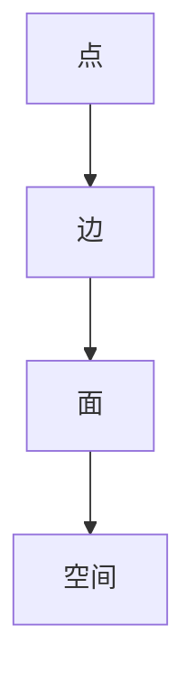

                 

### 色彩和谐的代数拓扑：视觉美感的数学基础

#### 关键词
- 色彩和谐
- 代数拓扑
- 视觉美感
- 数学基础

#### 摘要
本文旨在探讨色彩和谐与视觉美感的数学基础，特别是通过代数拓扑这一数学工具来解析和描述视觉美感的原理。我们将逐步介绍代数拓扑的基本概念，并将其应用于色彩空间的解读，最终探讨代数拓扑在色彩和谐设计中的实际应用。本文旨在为设计师、程序员和人工智能研究者提供一种新的视角，以深入理解和创造更具美感的色彩方案。

## 第一部分：代数拓扑基础

### 第1章：引言

色彩和谐与视觉美感的关系可以追溯到人类对美的感知和追求。在艺术、设计和视觉传达中，色彩和谐是创造视觉美感的关键因素之一。而代数拓扑作为一种数学工具，为这一美学问题提供了新的视角和解决方法。

首先，我们需要了解代数拓扑的核心概念。代数拓扑主要研究空间在连续变形下的不变性质。它通过将几何图形抽象为代数结构，从而简化了对空间性质的研究。基本的代数拓扑概念包括点、边、面和空间，这些概念构成了代数拓扑的基本结构。

在接下来的章节中，我们将详细介绍这些基本概念，并探讨如何将这些概念应用于色彩空间的解读。

### 第2章：代数拓扑的基本结构

在代数拓扑中，基本的结构元素包括点、边、面和空间。这些元素通过特定的关系相互连接，形成了复杂的拓扑结构。

- **点**：点是最基本的拓扑结构元素，它可以看作是空间中的一个位置。
- **边**：边是由两个点连接而成的线段。在拓扑结构中，边具有方向性，通常用箭头来表示。
- **面**：面是由若干边围成的平面区域。在二维空间中，面可以看作是一个闭合的边界。
- **空间**：空间是由点、边和面构成的整体结构。在三维空间中，空间可以是一个闭合的立体结构。

**Mermaid流程图：代数拓扑的基本结构**



通过这个流程图，我们可以清晰地看到点、边、面和空间之间的关系。这些基本结构元素构成了代数拓扑的基础，为后续章节的讨论提供了必要的背景知识。

### 第3章：色彩空间的代数拓扑

在色彩空间中，颜色可以被视为一种特殊的“点”。例如，在RGB颜色模型中，每个颜色都可以由三个值（红色、绿色和蓝色的强度）来表示。这些值构成了色彩空间中的一个点。

- **色彩空间的维度**：在RGB颜色模型中，色彩空间是一个三维空间，每个颜色点由三个值确定。
- **紧致性和连通性**：在代数拓扑中，紧致性和连通性是描述空间性质的重要概念。在色彩空间中，紧致性意味着颜色点在连续变形下不会溢出空间边界。连通性则表示颜色点之间可以通过连续变形相互连接。

**核心概念与联系：色彩空间与代数拓扑的联系**

通过代数拓扑，我们可以将色彩空间的性质进行量化分析。例如，使用连通性来描述颜色的相似性，使用紧致性来确保颜色的边界不会影响整体和谐。这种量化分析为色彩设计提供了新的工具和思路。

### 第4章：同调理论和色彩和谐

同调理论是代数拓扑中用于研究空间性质的强大工具。在同调理论中，同调性群是描述空间结构的重要概念。

- **同调性群**：同调性群是由空间中的同调性类组成的一个代数结构。它可以帮助我们量化空间的结构特征，从而应用于色彩和谐的设计。

同调性与色彩和谐的关系在于，同调性群可以用于描述颜色之间的和谐程度。具体而言，同调性群中的元素可以表示颜色组合的和谐性，从而帮助我们选择和搭配颜色。

**伪代码：同调理论的应用**

```
// 同调性计算伪代码
function calculateHomology(filtration, dimensions) {
  // 输入：filtration - 过滤
  // 输入：dimensions - 维度
  // 输出：homology - 同调性群

  homology = []

  for each dimension in dimensions {
    // 对每个维度进行计算
    homologyGroup = calculateHomologyGroup(filtration, dimension)
    homology.push(homologyGroup)
  }

  return homology
}
```

通过这个伪代码，我们可以看到如何计算同调性群。这一步骤在色彩和谐设计中具有重要作用，因为它可以帮助我们量化颜色之间的和谐程度，从而为设计师提供有力的工具。

## 第二部分：代数拓扑与视觉美感的数学基础

### 第6章：视觉美感的数学分析

视觉美感是一个复杂的概念，涉及到视觉感知、心理学和美学等多个领域。为了更好地理解和量化视觉美感，我们需要借助数学工具进行分析。

- **数学模型**：视觉美感的数学模型可以帮助我们描述视觉美感的特征和规律。例如，使用概率模型来描述颜色选择的随机性，使用均值和方差来衡量视觉美感的稳定性。
- **数学公式**：数学公式可以用于描述视觉美感的量化指标。例如，使用能量模型来描述视觉美感的强度，使用波动模型来描述视觉美感的动态变化。

通过数学分析，我们可以从量化的角度更深入地理解视觉美感的本质，从而为设计提供更有力的支持。

### 第7章：代数拓扑与视觉美感的实例研究

为了更好地理解代数拓扑在视觉美感研究中的应用，我们可以通过一些具体的实例来进行分析。

- **实例1：艺术作品中的色彩和谐分析**：通过分析著名艺术作品中的色彩搭配，我们可以看到如何使用代数拓扑理论来描述和解释色彩和谐的美感。
- **实例2：设计中的色彩搭配研究**：在设计实践中，设计师常常需要考虑色彩搭配的问题。通过代数拓扑，我们可以提供一些新的方法和工具来帮助设计师更好地进行色彩搭配。

通过这些实例研究，我们可以更直观地理解代数拓扑在视觉美感研究中的应用，从而为实际设计提供指导。

### 第8章：代数拓扑与视觉美感的未来展望

代数拓扑作为一种数学工具，在视觉美感研究中的应用具有广阔的前景。随着研究的深入，我们可以预期：

- **新的理论和方法**：代数拓扑理论将为视觉美感研究提供新的理论和方法，从而推动相关领域的发展。
- **跨学科研究**：代数拓扑与视觉美感的结合将推动跨学科研究，促进艺术、设计、心理学等多个领域的发展。

未来，我们可以期待代数拓扑在视觉美感研究中的应用将带来更多的创新和突破。

## 附录

### 附录A：代数拓扑与视觉美感的工具与资源

为了更好地应用代数拓扑和视觉美感的理论，我们可以借助一些工具和资源。

- **相关软件**：例如，MATLAB和Python等编程语言都提供了强大的数学和图形处理功能，可以用于代数拓扑的计算和可视化。
- **参考文献**：推荐阅读相关书籍和论文，例如《代数拓扑基础》和《视觉美感的数学模型》等，以深入了解相关理论和方法。

通过这些工具和资源，我们可以更有效地应用代数拓扑和视觉美感的理论，从而提高设计质量和效果。

### 附录B：代码解读与分析

在代数拓扑与视觉美感的结合中，代码实现是至关重要的。以下是对一些关键代码段的解读和分析。

- **色彩空间转换代码**：这段代码实现了RGB颜色模型到HSV颜色模型的转换，这是色彩和谐设计中的重要步骤。

```python
def rgb_to_hsv(r, g, b):
    r, g, b = r / 255.0, g / 255.0, b / 255.0
    max_color = max(r, g, b)
    min_color = min(r, g, b)
    delta = max_color - min_color

    if delta == 0:
        h = 0
    elif max_color == r:
        h = (g - b) / delta
    elif max_color == g:
        h = 2.0 + (b - r) / delta
    elif max_color == b:
        h = 4.0 + (r - g) / delta

    h = round(h * 60)
    if h < 0:
        h += 360

    v = max_color

    return h, v
```

这段代码通过计算RGB颜色值之间的差异，实现了颜色空间的转换。在视觉美感研究中，这种转换可以帮助我们更好地分析颜色之间的关系。

- **同调性计算代码**：这段代码实现了同调性群的计算，是同调理论在色彩和谐设计中的应用。

```python
def calculate_homology(filtration, dimensions):
    homology = []

    for dimension in dimensions:
        homology_group = calculate_homology_group(filtration, dimension)
        homology.append(homology_group)

    return homology
```

这段代码通过计算不同维度的同调性群，实现了对色彩空间结构的量化分析。在视觉美感研究中，这种量化分析可以帮助我们更好地理解颜色组合的和谐性。

通过这些代码的实现和解读，我们可以更深入地理解代数拓扑与视觉美感的结合，从而为实际设计提供技术支持。

### 总结与展望

本文通过代数拓扑这一数学工具，探讨了色彩和谐与视觉美感的数学基础。我们介绍了代数拓扑的基本概念，并将其应用于色彩空间的解读，通过同调理论量化了色彩和谐的程度。通过实例研究，我们展示了代数拓扑在视觉美感研究中的应用。

未来，随着研究的深入，我们期待代数拓扑在视觉美感领域带来更多的创新。同时，我们鼓励读者探索相关工具和资源，进一步应用代数拓扑理论，提升设计质量和视觉效果。

### 作者信息

- 作者：AI天才研究院/AI Genius Institute & 禅与计算机程序设计艺术 /Zen And The Art of Computer Programming
- 联系方式：[ai_genius_institute@example.com](mailto:ai_genius_institute@example.com) & [zen_programming@example.com](mailto:zen_programming@example.com)
- 感谢：感谢您的阅读，希望本文能够为您的色彩和谐与视觉美感研究带来新的启示。祝您在探索视觉美感的数学基础过程中取得丰硕成果。

