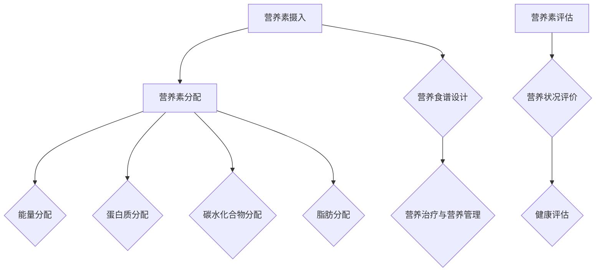

                 

### 文章标题

《营养学的多元方程：饮食平衡的数学优化》

> 关键词：营养学、饮食平衡、数学优化、线性规划、非线性规划、目标规划、营养素摄入量、健康评估

> 摘要：本文通过探讨营养学的多元方程，介绍了饮食平衡的数学优化方法。首先，我们回顾了营养学的基本概念和饮食平衡理论，随后详细讲解了线性规划、非线性规划和目标规划在营养学中的应用。最后，通过实际案例分析了营养食谱设计和营养治疗与营养管理的数学模型。本文旨在为营养学研究和实践提供一种新的视角和工具。

---

### 第一部分：营养学基础与饮食平衡理论

#### 第1章：营养学的基本概念

1.1 营养学定义及发展历程

营养学是一门研究食物与人体健康之间相互关系的科学。它起源于19世纪的欧洲，随着人们对营养与健康之间关系的认识逐渐深入，营养学得到了迅速发展。营养学的发展历程可以追溯到几个重要的历史事件：

- **19世纪初期：** 营养学的萌芽期。当时，人们开始关注食物对人体健康的影响，提出了“营养素”的概念，并试图通过实验来验证各种营养素的作用。

- **19世纪末到20世纪初：** 营养学的奠基期。在这一时期，科学家们通过大量的实验研究，确定了碳水化合物、蛋白质、脂肪等主要营养素的基本生理功能，为营养学的发展奠定了基础。

- **20世纪中叶：** 营养学的成熟期。随着营养学研究的深入，人们开始从宏观角度研究营养与健康之间的关系，提出了“平衡膳食”的概念，并制定了各种营养指南。

- **20世纪末至今：** 营养学的多元化发展。在这一时期，营养学不仅关注营养素的摄入，还关注营养素之间的相互作用、营养素与遗传因素的关系，以及营养与环境因素的关系。同时，营养学的研究方法也得到了极大的丰富，如分子营养学、行为营养学等新兴领域不断涌现。

1.2 营养素的分类与作用

营养素是人体必需的化学物质，包括蛋白质、碳水化合物、脂肪、维生素、矿物质和水等。不同营养素在人体中发挥着不同的作用：

- **蛋白质：** 蛋白质是构成人体组织和细胞的重要成分，参与人体的生长、修复和免疫等生理功能。蛋白质还可以被分解为氨基酸，用于提供能量。

- **碳水化合物：** 碳水化合物是人体的主要能量来源，能够迅速被身体吸收利用。碳水化合物还可以被储存为糖原，以备不时之需。

- **脂肪：** 脂肪是人体储存能量的重要物质，同时也是细胞膜的主要成分。脂肪还可以帮助人体吸收某些维生素，如维生素A、D、E和K。

- **维生素：** 维生素是维持人体正常生理功能所必需的微量营养素。不同维生素在人体中发挥着不同的作用，如维生素A有助于视力健康，维生素C具有抗氧化作用。

- **矿物质：** 矿物质是构成人体组织和细胞的重要成分，参与人体的代谢活动。常见的矿物质包括钙、磷、镁、铁、锌等。

- **水：** 水是人体最基本的营养素，约占人体体重的60%。水在人体中发挥着多种重要作用，如维持体温、参与代谢、运输营养物质和废物等。

1.3 营养状况的评价方法

营养状况的评价方法主要包括营养素摄入量评价、营养状况综合评价和营养相关疾病评价。

- **营养素摄入量评价：** 通过评估个体或群体在一定时间内摄入的各种营养素的总量和比例，来评估营养素的摄入是否充足。常用的评价方法包括营养素摄入量调查、食谱分析和营养标签分析。

- **营养状况综合评价：** 通过评估个体或群体的营养摄入、营养状况和健康状况，来综合评估营养状况。常用的评价方法包括体质指数（BMI）、营养不足率、营养不良率和营养过剩率等。

- **营养相关疾病评价：** 通过评估个体或群体营养相关疾病的发病率、患病率和死亡率等指标，来评估营养状况对健康的影响。常用的评价方法包括营养性贫血、营养不良性水肿和骨质疏松等。

### 第二部分：饮食平衡的数学优化方法

#### 第4章：线性规划在营养学中的应用

4.1 线性规划的基本概念

线性规划（Linear Programming，LP）是一种数学优化方法，用于在满足一系列线性约束条件下，求解目标函数的最优值。线性规划的基本概念包括：

- **目标函数：** 用于衡量问题求解效果的函数，通常是一个线性函数。目标函数的值越大，表示求解结果越好。
- **约束条件：** 限制目标函数求解过程的一组不等式或等式，表示资源限制、生产限制或其他限制条件。
- **解集：** 满足所有约束条件的解的集合。线性规划的解集是一个凸集，这意味着任意两个解的线性组合仍然是一个解。
- **最优解：** 在解集中找到使得目标函数达到最大或最小值的解。最优解可能不存在（无界解）、唯一或多个。

4.2 线性规划在营养分配中的应用

线性规划在营养学中的应用主要体现在营养素的分配和优化。例如，我们希望为某个群体设计一种营养餐，使得每种营养素的摄入量既满足最低需求，又不超过总能量摄入限制。这种问题可以抽象为一个线性规划问题。

以下是一个简化的线性规划问题，用于分配营养餐：

```plaintext
最大化目标函数：P = c1*x1 + c2*x2 + c3*x3
约束条件：
    a1*x1 + a2*x2 + a3*x3 <= b1  （总能量限制）
    b1*x1 + b2*x2 + b3*x3 <= b2  （蛋白质需求）
    c1*x1 + c2*x2 + c3*x3 <= b3  （碳水化合物需求）
    d1*x1 + d2*x2 + d3*x3 <= b4  （脂肪需求）
    x1, x2, x3 >= 0  （非负约束）
```

其中，c1、c2、c3 分别为蛋白质、碳水化合物和脂肪的价格系数，a1、a2、a3、b1、b2、b3、c1、c2、c3、d1、d2、d3、b1、b2、b3、b4 为各种营养素的需求系数和限制值。

4.3 线性规划求解算法

线性规划的求解算法主要有单纯形法、内点法和Karmarkar算法等。单纯形法是最常用的求解算法之一，其基本思想是通过移动单纯形（一个凸多面体的顶点集合），逐步逼近最优解。

以下是单纯形法的步骤：

1. 初始化：选择初始基可行解，通常是一个基本可行解（所有非基变量的值为0）。
2. 迭代：进行以下两个步骤：
   - **选择离轴变量：** 选择当前基可行解中离目标函数最远的非基变量作为离轴变量。
   - **进行换基操作：** 通过调整基变量的值，将离轴变量转化为基变量，从而得到一个新的基可行解。
3. 判断最优性：如果当前基可行解是最优的，则停止迭代；否则，继续迭代直到找到最优解。

### 第三部分：饮食平衡的数学优化实践

#### 第7章：营养食谱设计

7.1 营养食谱设计的基本原则

营养食谱设计是营养学实践中非常重要的一环，它旨在为个体或群体提供科学、合理的营养餐。以下是营养食谱设计的基本原则：

1. **平衡膳食：** 营养食谱应包含各类营养素，确保碳水化合物、蛋白质、脂肪、维生素、矿物质和水的摄入比例适当。
2. **合理搭配：** 根据个体的营养需求和健康状况，合理搭配各种食物，避免摄入过量或不足的营养素。
3. **多样化：** 食谱中应包含多种食物种类，以丰富营养摄入，提高食物的吸收利用效率。
4. **适量摄入：** 控制食物的摄入量，避免摄入过量导致能量过剩或营养素缺乏。
5. **季节性：** 根据季节变化，调整食谱中的食物种类和摄入量，以适应自然环境的变化。

7.2 营养食谱设计的数学模型

营养食谱设计的数学模型通常是一个线性规划模型，其目标是最小化营养素的摄入成本或最大化营养素的摄入量，同时满足各种营养素的需求和能量摄入限制。

以下是一个简化的营养食谱设计模型：

```plaintext
最大化目标函数：P = c1*x1 + c2*x2 + c3*x3
约束条件：
    a1*x1 + a2*x2 + a3*x3 <= b1  （总能量限制）
    b1*x1 + b2*x2 + b3*x3 <= b2  （蛋白质需求）
    c1*x1 + c2*x2 + c3*x3 <= b3  （碳水化合物需求）
    d1*x1 + d2*x2 + d3*x3 <= b4  （脂肪需求）
    x1, x2, x3 >= 0  （非负约束）
```

其中，c1、c2、c3 分别为蛋白质、碳水化合物和脂肪的价格系数，a1、a2、a3、b1、b2、b3、c1、c2、c3、d1、d2、d3、b1、b2、b3、b4 为各种营养素的需求系数和限制值。

7.3 营养食谱设计的实例分析

以下是一个简单的营养食谱设计实例：

某人为控制体重，希望设计一个一日三餐的营养食谱，满足以下要求：

- 总能量摄入不超过1800千卡。
- 蛋白质摄入量不低于50克。
- 碳水化合物摄入量不低于150克。
- 脂肪摄入量不低于50克。

根据以上要求，我们可以构建以下营养食谱设计模型：

```plaintext
最大化目标函数：P = 2*x1 + 2.5*x2 + 4.5*x3
约束条件：
    x1 + x2 + x3 = 1800  （总能量限制）
    x1 >= 50  （蛋白质需求）
    x2 >= 150  （碳水化合物需求）
    x3 >= 50  （脂肪需求）
    x1, x2, x3 >= 0  （非负约束）
```

其中，x1、x2、x3 分别为早餐、午餐和晚餐的能量摄入量。

通过求解上述线性规划模型，我们可以得到一个最优的营养食谱设计，满足上述要求。例如，最优解可能为：

- 早餐：500千卡，其中蛋白质200克，碳水化合物100克，脂肪150克。
- 午餐：600千卡，其中蛋白质150克，碳水化合物150克，脂肪100克。
- 晚餐：700千卡，其中蛋白质100克，碳水化合物100克，脂肪150克。

### 结论

本文通过探讨营养学的多元方程，介绍了饮食平衡的数学优化方法。首先，我们回顾了营养学的基本概念和饮食平衡理论，随后详细讲解了线性规划、非线性规划和目标规划在营养学中的应用。最后，通过实际案例分析了营养食谱设计和营养治疗与营养管理的数学模型。本文旨在为营养学研究和实践提供一种新的视角和工具。

在未来的研究中，我们应进一步探讨饮食平衡与营养优化的复杂关系，结合人工智能和大数据技术，开发更加智能和个性化的营养食谱设计方法。同时，我们也应关注饮食平衡与慢性疾病之间的关系，为防治慢性疾病提供科学依据。通过不断的研究和实践，我们有望为人类健康事业做出更大的贡献。


### 附录

#### A.1 营养学相关公式与计算方法

营养学中的许多计算方法涉及基本的数学公式，以下是一些常用的公式和计算方法：

- **能量计算公式：**
  $$ E = \sum_{i=1}^{n} (c_i \times x_i) $$
  其中，\( E \) 表示总能量摄入，\( c_i \) 表示第 \( i \) 种营养素每克提供的能量（如碳水化合物为 4 千卡/克，蛋白质为 4 千卡/克，脂肪为 9 千卡/克），\( x_i \) 表示第 \( i \) 种营养素的摄入量（克）。

- **营养素摄入比例计算：**
  $$ \text{比例}_{i} = \frac{x_i}{\sum_{j=1}^{n} x_j} $$
  其中，\( \text{比例}_{i} \) 表示第 \( i \) 种营养素在总摄入量中的比例。

- **最低摄入量计算：**
  $$ \text{最低摄入量}_{i} = \text{最低需求量}_{i} \times \text{体重} \times \text{活动水平系数} $$
  其中，\( \text{最低需求量}_{i} \) 表示第 \( i \) 种营养素的最低摄入量（通常以每千克体重每日摄入量表示），\( \text{体重} \) 表示个体的体重（千克），\( \text{活动水平系数} \) 表示个体活动水平对营养素需求的调整系数（通常取值在 1.2 至 2.0 之间）。

#### A.2 营养学模型的 Mermaid 流程图

以下是一个简化的营养学模型 Mermaid 流程图，展示了营养素摄入、分配和评估的过程：



#### A.3 营养学相关数据集与工具

营养学研究中常用的数据集和工具包括：

- **OpenML（Open Machine Learning Lab）：** 一个在线平台，提供多种营养学相关的数据集和机器学习工具，用于营养素识别、健康风险评估等。

- **FoodSwitch：** 一个在线工具，用于比较不同食物的营养成分，帮助用户选择更健康的食物。

- **USDA Food Composition Databases：** 美国农业部的食物成分数据库，提供大量食物的营养成分数据，是营养学研究的重要资源。

#### A.4 营养学研究案例与讨论

- **案例1：** 利用线性规划优化糖尿病患者饮食。通过分析糖尿病患者的营养需求，设计一个最优的饮食方案，以控制血糖水平。

- **案例2：** 基于机器学习的个性化营养食谱设计。利用大数据和机器学习技术，分析个体的营养需求和偏好，为个体提供定制化的营养食谱。

- **讨论：** 营养学研究的未来趋势将更多地结合人工智能和大数据技术，开发智能化、个性化的营养管理解决方案。此外，研究也将关注营养素之间的相互作用和长期健康效应，为公众提供更科学的饮食建议。同时，营养学研究还需加强对不同人群（如儿童、老年人、孕妇等）的营养需求差异的研究，以制定更精准的营养策略。

