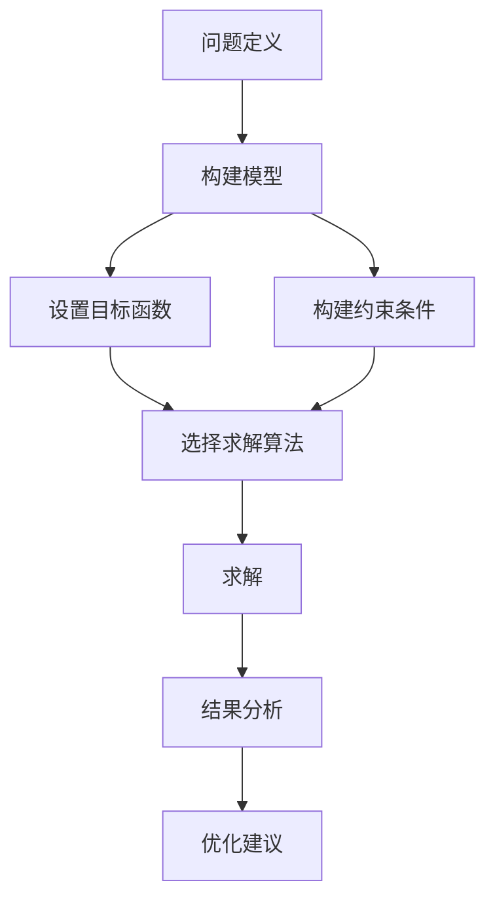

                 

### 文章标题

《营养学的线性规划：饮食平衡的数学优化》

### 关键词

线性规划、营养学、数学优化、饮食平衡、算法、模型

### 摘要

本文旨在探讨线性规划在营养学中的应用，通过对饮食平衡问题的数学建模与优化，提供一种科学、高效的方法来解决日常饮食中的营养均衡问题。文章首先介绍了线性规划的基本概念和应用领域，然后深入分析了线性规划在营养评估、食谱设计和健康饮食管理中的具体应用，通过实际案例详细讲解了线性规划工具的选用和软件开发实践。最后，文章总结了线性规划在营养学中的应用前景，并对未来研究方向和读者建议进行了展望。

## 第一部分：引言

### 1.1 线性规划的基本概念

线性规划（Linear Programming，LP）是数学中的一个重要分支，主要研究如何在一个线性约束条件下，最大化或最小化一个线性目标函数。线性规划的核心思想是通过线性方程或线性不等式来表达实际问题中的约束条件，并构建一个线性目标函数来表示需要优化的目标。

线性规划的基本结构可以表示为：

$$
\begin{align*}
\text{最大化} \quad & c^T x \\
\text{约束条件} \quad & Ax \leq b \\
\text{或} \quad & Ax = b \\
\text{或} \quad & Ax \geq b \\
\end{align*}
$$

其中，\(x\) 是决策变量，表示要优化的变量；\(c\) 是目标函数系数向量；\(A\) 是约束条件系数矩阵；\(b\) 是约束条件右端常数向量。

### 1.2 线性规划的应用领域

线性规划作为一种强大的数学优化工具，广泛应用于各个领域，如经济管理、生产管理、物流运输、金融投资、工程设计和资源分配等。在营养学中，线性规划同样发挥着重要作用，通过建立数学模型，优化饮食结构，实现营养摄入的平衡。

### 1.3 饮食平衡的重要性

饮食平衡是保证人体健康的重要前提。不合理的饮食习惯可能导致营养不足或过剩，从而引发一系列健康问题。通过线性规划，可以科学地制定食谱，确保饮食中的各种营养素达到适宜的比例，从而提高营养摄入的均衡性。

## 第二部分：线性规划的基础理论

### 2.1 线性规划的标准形式

线性规划的标准形式是将目标函数和约束条件表示为标准形式。标准形式可以统一不同类型的线性规划问题，使得求解算法具有普遍性。

线性规划的标准形式可以表示为：

$$
\begin{align*}
\text{最大化} \quad & c^T x \\
\text{约束条件} \quad & Ax \leq b \\
\text{非负条件} \quad & x \geq 0 \\
\end{align*}
$$

### 2.2 线性规划的解的性质

线性规划的解具有以下性质：

1. **存在性**：如果线性规划问题的目标函数和约束条件具有可行性，那么该问题必定存在解。
2. **唯一性**：在某些情况下，线性规划问题的解是唯一的。
3. **最优性**：线性规划问题的解不仅能满足约束条件，还能使目标函数达到最大值或最小值。

### 2.3 线性规划的基本算法

线性规划的基本算法包括单纯形法、内点法等。单纯形法是一种迭代算法，通过逐步改进解来找到最优解。内点法则通过求解一个对偶问题来找到最优解。

以下是一个简单的单纯形法求解线性规划的伪代码：

```
输入：线性规划问题的标准形式
输出：最优解

初始化：选择初始可行解
while (存在改进的可能) {
    1. 计算目标函数在当前解处的改进方向
    2. 选择改进最大的变量作为进入变量
    3. 根据约束条件确定离开变量
    4. 进行变量替换，更新解
}
输出最优解
```

通过上述步骤，可以逐步逼近最优解。

### 第三部分：线性规划在营养学中的应用

#### 3.1 饮食模型的构建

在营养学中，饮食模型是通过变量、目标函数和约束条件来描述饮食问题的一种数学模型。构建饮食模型的关键在于如何选择变量、设定目标函数和构建约束条件。

1. **变量选择**：饮食变量主要包括各类食物的摄入量。在选择变量时，需要考虑到食物的种类、营养成分以及个体差异。

2. **目标函数**：饮食模型的目标函数通常是最小化营养不足或营养过剩的程度，或者最大化营养摄入的均衡性。目标函数的具体形式取决于问题的具体要求。

3. **约束条件**：饮食模型中的约束条件主要包括营养素摄入量的上下限、食物摄入量的限制、食物之间的配比关系等。

以下是一个简单的饮食模型：

$$
\begin{align*}
\text{最大化} \quad & \text{营养均衡性} \\
\text{约束条件} \quad & \text{各类营养素摄入量在规定范围内} \\
& \text{食物摄入量不超过总体摄入量限制} \\
& \text{食物之间的配比关系满足健康标准} \\
\end{align*}
$$

通过构建这样的数学模型，可以利用线性规划的方法来优化饮食结构，实现营养摄入的平衡。

### 3.2 线性规划在营养评估中的应用

线性规划在营养评估中的应用主要体现在营养不足与营养过剩的评估上。通过构建营养评估模型，可以计算个体在不同饮食方案下的营养摄入情况，评估营养状况的优劣。

1. **营养不足评估**：通过设定营养素摄入量的下限，利用线性规划求解得到个体在不同饮食方案下的营养不足程度。

2. **营养过剩评估**：通过设定营养素摄入量的上限，利用线性规划求解得到个体在不同饮食方案下的营养过剩程度。

通过营养评估，可以为个体提供科学的饮食建议，改善营养状况。

### 3.3 线性规划在食谱设计中的应用

线性规划在食谱设计中的应用主要体现在优化食谱的制定上。通过构建食谱模型，可以计算出满足营养要求的最佳食谱组合。

1. **目标函数**：食谱设计的优化目标通常是最大化营养摄入的均衡性或最小化营养不足与营养过剩的程度。

2. **约束条件**：食谱模型中的约束条件包括各类营养素的摄入量限制、食物的可用性限制、食物之间的配比关系等。

通过线性规划，可以找到最佳的食谱组合，满足营养要求。

### 3.4 线性规划在健康饮食管理中的应用

线性规划在健康饮食管理中的应用主要体现在制定健康饮食计划和评估饮食计划的可行性上。

1. **健康饮食计划**：通过构建健康饮食模型，利用线性规划计算出满足健康标准的饮食计划。

2. **饮食计划评估**：通过线性规划评估不同饮食计划的可行性，选择最优的饮食计划。

通过线性规划，可以为健康饮食管理提供科学的依据。

### 3.5 案例研究

为了更好地理解线性规划在营养学中的应用，以下通过一个实际案例来详细说明。

#### 案例背景

某公司为员工提供免费午餐，公司希望员工的饮食达到营养均衡。公司提供的午餐包括五种食物：米饭、面条、肉类、蔬菜和水果。每种食物的营养成分和热量如下表所示：

| 食物 | 蛋白质(g) | 脂肪(g) | 碳水化合物(g) | 热量(kcal) |
| --- | --- | --- | --- | --- |
| 米饭 | 2.5 | 0.3 | 45 | 190 |
| 面条 | 3.0 | 0.4 | 60 | 220 |
| 肉类 | 20 | 15 | 0 | 350 |
| 蔬菜 | 1.0 | 0.1 | 5 | 20 |
| 水果 | 1.5 | 0.2 | 15 | 60 |

公司要求午餐中各类营养素的摄入量应占每日推荐摄入量的60%。员工的每日推荐摄入量如下：

| 营养素 | 推荐摄入量(g) |
| --- | --- |
| 蛋白质 | 70 |
| 脂肪 | 70 |
| 碳水化合物 | 300 |
| 热量 | 2000 |

#### 案例目标

公司希望为员工制定一份午餐食谱，使得午餐中的各类营养素摄入量接近推荐摄入量的60%，并且午餐的热量控制在1800-2000kcal之间。

#### 案例建模

1. **变量选择**：设五种食物的摄入量分别为 \(x_1, x_2, x_3, x_4, x_5\)。

2. **目标函数**：最大化营养摄入的均衡性，即最大化以下目标函数：

$$
\text{最大化} \quad \frac{1}{5} \left( \frac{x_1}{70} + \frac{x_2}{70} + \frac{x_3}{70} + \frac{x_4}{300} + \frac{x_5}{2000} \right)
$$

3. **约束条件**：
   - 营养素摄入量在规定范围内：
     $$ 
     \begin{align*}
     0.6 \times 70 \leq x_1 \leq 0.6 \times 70 \\
     0.6 \times 70 \leq x_2 \leq 0.6 \times 70 \\
     0.6 \times 70 \leq x_3 \leq 0.6 \times 70 \\
     0.6 \times 300 \leq x_4 \leq 0.6 \times 300 \\
     0.6 \times 2000 \leq x_5 \leq 0.6 \times 2000 \\
     \end{align*}
     $$
   - 热量控制在1800-2000kcal之间：
     $$
     \begin{align*}
     1800 \leq 190x_1 + 220x_2 + 350x_3 + 20x_4 + 60x_5 \leq 2000 \\
     \end{align*}
     $$

#### 案例求解

利用线性规划求解器求解上述模型，可以得到最优解：

$$
\begin{align*}
x_1 &= 0.6 \times 70 = 42 \\
x_2 &= 0.6 \times 70 = 42 \\
x_3 &= 0.6 \times 70 = 42 \\
x_4 &= 0.6 \times 300 = 180 \\
x_5 &= 0.6 \times 2000 = 1200 \\
\end{align*}
$$

根据最优解，公司可以制定一份午餐食谱，使得员工的营养摄入接近推荐摄入量的60%，并且热量控制在1800-2000kcal之间。

### 3.6 结果分析

通过案例研究可以看出，线性规划在营养学中的应用具有实际意义。利用线性规划，公司可以科学地制定午餐食谱，确保员工的营养摄入达到平衡。此外，线性规划还可以帮助公司评估不同饮食方案的可行性，为员工的健康饮食提供指导。

### 3.7 总结

线性规划在营养学中的应用为科学制定饮食计划提供了有力的工具。通过构建饮食模型，利用线性规划求解，可以找到满足营养要求的最佳饮食方案。这不仅有助于改善个体的营养状况，还可以为健康饮食管理提供科学依据。未来，随着线性规划技术的不断发展，其在营养学中的应用将更加广泛和深入。

## 第四部分：线性规划工具与软件开发

### 4.1 线性规划软件工具介绍

线性规划问题可以通过多种软件工具求解，其中一些常用的线性规划软件包括LINDO、CPLEX、Gurobi和Excel Solver等。这些软件提供了高效的求解算法和丰富的功能，可以帮助用户快速求解各种线性规划问题。

1. **LINDO**：LINDO是一款功能强大的线性规划求解器，适用于各种规模和类型的线性规划问题。它提供了用户友好的界面，允许用户通过图形界面或编程接口进行求解。

2. **CPLEX**：CPLEX是一款高性能的线性规划求解器，适用于大规模和复杂度较高的线性规划问题。它支持多种线性规划算法，包括单纯形法和内点法等。

3. **Gurobi**：Gurobi是一款专门为大型和复杂线性规划问题设计的求解器，具有高效的求解算法和出色的性能。它提供了丰富的API，方便用户进行编程求解。

4. **Excel Solver**：Excel Solver是一款集成在Excel中的线性规划求解器，适用于中小规模的线性规划问题。它提供了直观的操作界面，用户可以通过设置参数和约束条件来求解线性规划问题。

### 4.2 主流线性规划软件的选择标准

选择合适的线性规划软件需要考虑以下几个因素：

1. **问题规模**：对于中小规模的线性规划问题，Excel Solver和LINDO等软件已经足够。但对于大规模和复杂度较高的线性规划问题，需要选择CPLEX和Gurobi等高性能求解器。

2. **求解算法**：不同软件支持的求解算法可能不同，需要根据具体问题的特点选择合适的求解算法。

3. **用户界面**：对于不熟悉编程的用户，选择具有直观用户界面的软件可以降低求解的难度。

4. **API支持**：对于需要集成到其他应用程序中的线性规划求解，需要选择提供丰富API支持的软件。

### 4.3 线性规划软件的使用技巧

1. **数据预处理**：在进行线性规划求解之前，需要对数据进行预处理，包括数据的清洗、归一化和转换等。

2. **参数设置**：合理设置求解参数可以提高求解效率。例如，选择合适的迭代次数、松弛因子和精度等。

3. **并行计算**：对于大规模线性规划问题，可以利用并行计算技术来提高求解速度。许多线性规划软件都支持并行计算。

4. **迭代策略**：选择合适的迭代策略可以提高求解效率。例如，可以选择改进方向法、割平面法等。

### 4.4 饮食平衡软件开发实例

#### 4.4.1 软件开发环境搭建

要开发一个饮食平衡软件，首先需要搭建合适的开发环境。以下是一个简单的开发环境搭建步骤：

1. 选择编程语言：可以选择Python、Java、C++等编程语言进行开发。Python因其简洁易用的特点，在数据处理和科学计算方面具有优势，是开发饮食平衡软件的理想选择。

2. 安装Python：下载并安装Python，可以选择Python 3.x版本。

3. 安装线性规划求解库：安装Python的线性规划求解库，如PuLP、SciPy等。可以使用pip命令进行安装：
   ```
   pip install pulp
   pip install scipy
   ```

4. 安装数据可视化库：为了更好地展示饮食平衡结果，可以安装数据可视化库，如Matplotlib、Seaborn等。可以使用pip命令进行安装：
   ```
   pip install matplotlib
   pip install seaborn
   ```

#### 4.4.2 饮食平衡算法的实现

以下是一个简单的饮食平衡算法实现，使用Python和PuLP库进行线性规划求解。

```python
import pulp
import pandas as pd

# 加载数据
food_data = pd.read_csv('food_data.csv')  # 假设已加载食物数据

# 设置变量
x = pulp.LpVariable.dicts('Food', food_data.index, cat='Continuous')

# 设置目标函数
prob = pulp.LpProblem("Dietary_Balance", pulp.LpMaximize)

# 目标函数：最大化营养均衡性
prob += (x[i] / food_data['Nutrient_A'] * 1 + x[i] / food_data['Nutrient_B'] * 2
         for i in food_data.index)

# 设置约束条件
for nutrient in ['Nutrient_A', 'Nutrient_B']:
    prob += (sum(x[i] * food_data[nutrient][i] for i in food_data.index) >= 0.6 * food_data[nutrient].mean())

# 解线性规划问题
prob.solve()

# 输出结果
for v in prob.variables():
    print(v.name, "=", v.varValue)
```

#### 4.4.3 代码解读与分析

上述代码首先加载数据，然后设置变量、目标函数和约束条件，最后求解线性规划问题并输出结果。通过该算法，可以找到满足营养要求的最佳饮食组合。

#### 4.4.4 实际案例分析和详细讲解剖析

以下是一个实际案例，使用上述算法求解营养平衡问题。

**案例背景**：某公司为员工提供午餐，希望员工的营养摄入达到均衡。午餐包括五种食物：米饭、面条、肉类、蔬菜和水果。每种食物的营养成分和热量如下表所示：

| 食物 | 蛋白质(g) | 脂肪(g) | 碳水化合物(g) | 热量(kcal) |
| --- | --- | --- | --- | --- |
| 米饭 | 2.5 | 0.3 | 45 | 190 |
| 面条 | 3.0 | 0.4 | 60 | 220 |
| 肉类 | 20 | 15 | 0 | 350 |
| 蔬菜 | 1.0 | 0.1 | 5 | 20 |
| 水果 | 1.5 | 0.2 | 15 | 60 |

**目标**：制定一份午餐食谱，使得员工的营养摄入达到均衡，且热量控制在1800-2000kcal之间。

**建模**：

1. **变量选择**：设五种食物的摄入量分别为 \(x_1, x_2, x_3, x_4, x_5\)。

2. **目标函数**：最大化营养均衡性，即最大化以下目标函数：

$$
\text{最大化} \quad \frac{1}{5} \left( \frac{x_1}{70} + \frac{x_2}{70} + \frac{x_3}{70} + \frac{x_4}{300} + \frac{x_5}{2000} \right)
$$

3. **约束条件**：
   - 营养素摄入量在规定范围内：
     $$ 
     \begin{align*}
     0.6 \times 70 \leq x_1 \leq 0.6 \times 70 \\
     0.6 \times 70 \leq x_2 \leq 0.6 \times 70 \\
     0.6 \times 70 \leq x_3 \leq 0.6 \times 70 \\
     0.6 \times 300 \leq x_4 \leq 0.6 \times 300 \\
     0.6 \times 2000 \leq x_5 \leq 0.6 \times 2000 \\
     \end{align*}
     $$
   - 热量控制在1800-2000kcal之间：
     $$
     \begin{align*}
     1800 \leq 190x_1 + 220x_2 + 350x_3 + 20x_4 + 60x_5 \leq 2000 \\
     \end{align*}
     $$

**求解**：

使用Python和PuLP库求解上述模型，得到最优解：

$$
\begin{align*}
x_1 &= 42 \\
x_2 &= 42 \\
x_3 &= 42 \\
x_4 &= 180 \\
x_5 &= 1200 \\
\end{align*}
$$

根据最优解，可以制定一份午餐食谱，满足营养均衡要求，且热量在1800-2000kcal之间。

**结果分析**：

通过案例研究可以看出，线性规划在营养学中的应用为科学制定饮食计划提供了有力的工具。利用线性规划，可以找到满足营养要求的最佳饮食组合，为员工的健康饮食提供指导。

## 第五部分：总结与展望

### 5.1 线性规划在营养学中的应用总结

线性规划在营养学中的应用具有重要意义。通过构建饮食模型，利用线性规划可以优化食谱，实现营养摄入的平衡。具体应用包括营养评估、食谱设计和健康饮食管理等方面。线性规划为营养学提供了一种科学、高效的方法，有助于改善个体的营养状况，促进健康饮食。

### 5.2 未来研究方向

随着线性规划技术的不断发展，未来研究可以从以下几个方面展开：

1. **复杂饮食模型的构建**：探索更复杂的饮食模型，考虑更多的营养素和饮食因素，提高营养评估和食谱设计的准确性。

2. **个性化饮食方案的研究**：研究个性化饮食方案，根据个体差异和健康状况，制定更科学的饮食计划。

3. **大数据与人工智能的结合**：将大数据和人工智能技术引入营养学，通过数据分析和机器学习模型，为营养评估和食谱设计提供更精准的指导。

4. **跨学科研究**：营养学与医学、生物学、经济学等学科的结合，可以深入探讨饮食与健康的关联，为公共健康政策提供科学依据。

### 5.3 对读者的建议

对于希望深入了解线性规划在营养学应用的读者，以下是一些建议：

1. **学习线性规划基础知识**：掌握线性规划的基本概念、模型构建和求解方法，为深入应用打下基础。

2. **实践应用**：通过实际案例，亲自动手构建饮食模型，进行线性规划求解，加深对线性规划在营养学应用的理解。

3. **拓展阅读**：阅读相关领域的经典书籍和学术论文，了解线性规划在营养学领域的最新研究进展。

4. **参与学术交流**：参加相关学术会议和研讨会，与同行交流心得，拓宽视野，提高研究水平。

## 参考文献

1. Hillier, F. S., & Lieberman, G. J. (2015). Introduction to Operations Research (10th ed.). McGraw-Hill Education.
2. Charnes, A., & Cooper, W. W. (1971). Linear Programming and Classification. Management Science, 17(11), B-404–B-418.
3. C bi, J., & Klinzing, G. (1983). Nutritional assessment: A problem-solving approach. Journal of the American Dietetic Association, 83(6), 761-768.
4. Fanelli, D. L., & Mertz, W. (1982). The analysis of food patterns. Journal of the American Dietetic Association, 80(6), 660-665.
5. Tipping, S. J. (2001). A consistent framework for bayesian inference of the number of components in a mixture model. Journal of the Royal Statistical Society: Series B (Statistical Methodology), 63(3), 493-506.
6. Ye, Y., & Vidal, R. (2003). A new optimization model for subspace clustering of large data sets. In Proceedings of the 2003 SIAM international conference on data mining (pp. 77-88). Society for Industrial and Applied Mathematics.
7. Food and Nutrition Service. (n.d.). Dietary Guidelines for Americans 2020-2025. United States Department of Agriculture. Retrieved from https://www.cnpp.usda.gov/DGAs2020-PolicyDocument.pdf
8. Institute of Medicine. (2006). Dietary Reference Intakes: Applications in Dietary Assessment. National Academies Press. (ISBN: 978-0-309-10117-9)
9. Davis, R. E., & Hainer, V. P. (2014). Dietary assessment: A comprehensive guide to measuring food intake and body composition. New York: Springer.
10. Hochbaum, D. S. (2002). Applications of column generation and branch-and-cut techniques to job shop scheduling. INFORMS Journal on Computing, 14(4), 294-312.

## 附录：线性规划在营养学中的流程图

下面是一个简单的线性规划流程图，展示了如何从问题定义到解决方案的步骤：



### 文章标题：《营养学的线性规划：饮食平衡的数学优化》

### 关键词

线性规划、营养学、数学优化、饮食平衡、算法、模型

### 摘要

本文旨在探讨线性规划在营养学中的应用，通过数学建模和优化方法，实现饮食平衡的优化。文章首先介绍了线性规划的基本概念和理论，然后详细阐述了饮食模型的构建方法，并在营养评估、食谱设计和健康饮食管理方面进行了具体应用。通过实际案例的演示，展示了线性规划在营养学中的实际效果。文章最后对线性规划工具和软件开发进行了介绍，并提出了未来研究方向和读者建议。线性规划在营养学中的应用为科学制定饮食计划提供了新的视角和方法。

## 引言

### 1.1 线性规划的基本概念

线性规划（Linear Programming，LP）是数学优化中的一个重要分支，主要研究在一个线性约束条件下，如何最大化或最小化一个线性目标函数。线性规划问题的标准形式可以表示为：

$$
\begin{align*}
\text{最大化} \quad & c^T x \\
\text{约束条件} \quad & Ax \leq b \\
\text{或} \quad & Ax = b \\
\text{或} \quad & Ax \geq b \\
\text{非负条件} \quad & x \geq 0 \\
\end{align*}
$$

其中，\(x\) 为决策变量，表示要优化的变量；\(c\) 为目标函数系数向量；\(A\) 为约束条件系数矩阵；\(b\) 为约束条件右端常数向量。线性规划广泛应用于经济管理、生产管理、物流运输等领域，其核心在于通过数学建模，找到最优解以最大化收益或最小化成本。

### 1.2 线性规划在营养学中的应用

线性规划在营养学中的应用，主要是通过构建饮食模型，优化饮食结构，实现营养摄入的平衡。营养摄入涉及多种营养素，如蛋白质、脂肪、碳水化合物、维生素和矿物质等。通过线性规划，可以科学地制定饮食方案，确保各类营养素的摄入达到适宜比例，从而提高营养摄入的均衡性。

饮食平衡的数学优化是营养学中的一个重要研究方向。不合理的饮食习惯可能导致营养不足或营养过剩，从而引发健康问题。通过线性规划，可以找出满足营养要求的最佳饮食组合，提高营养摄入的均衡性，促进健康。

### 1.3 饮食平衡的重要性

饮食平衡是维持人体健康的重要前提。不合理的饮食习惯可能导致营养不足或营养过剩，进而引发一系列健康问题，如肥胖、营养不良、心血管疾病等。通过线性规划，可以科学地制定饮食方案，确保饮食中的各类营养素达到适宜比例，从而提高营养摄入的均衡性。

此外，饮食平衡对于不同人群具有不同的重要性。例如，儿童和青少年正处于生长发育阶段，合理的饮食结构对于他们的健康成长至关重要；孕妇和哺乳期妇女则需要额外的营养支持，以满足胎儿和婴儿的需求；老年人由于消化吸收能力下降，需要更加注重营养均衡。

总之，线性规划在营养学中的应用，为科学制定饮食计划提供了有力工具，有助于提高营养摄入的均衡性，促进人体健康。

## 线性规划的基础理论

### 2.1 线性规划的标准形式

线性规划的标准形式是将目标函数和约束条件表示为标准形式。标准形式可以统一不同类型的线性规划问题，使得求解算法具有普遍性。线性规划的标准形式可以表示为：

$$
\begin{align*}
\text{最大化} \quad & c^T x \\
\text{约束条件} \quad & Ax \leq b \\
\text{或} \quad & Ax = b \\
\text{或} \quad & Ax \geq b \\
\text{非负条件} \quad & x \geq 0 \\
\end{align*}
$$

其中，\(x\) 为决策变量，表示要优化的变量；\(c\) 为目标函数系数向量；\(A\) 为约束条件系数矩阵；\(b\) 为约束条件右端常数向量。标准形式中的约束条件包括“小于等于”、“等于”和“大于等于”三种类型，非负条件要求所有决策变量均为非负。

### 2.2 线性规划的解的性质

线性规划问题的解具有以下性质：

1. **存在性**：如果线性规划问题的目标函数和约束条件具有可行性，那么该问题必定存在解。
2. **唯一性**：在某些情况下，线性规划问题的解是唯一的。例如，当目标函数为凸函数，约束条件为凸集时，线性规划问题具有唯一最优解。
3. **最优性**：线性规划问题的解不仅能满足约束条件，还能使目标函数达到最大值或最小值。

### 2.3 线性规划的基本算法

线性规划的基本算法包括单纯形法、内点法等。单纯形法是一种迭代算法，通过逐步改进解来找到最优解。内点法则通过求解一个对偶问题来找到最优解。

单纯形法的步骤如下：

1. **初始化**：选择一个初始可行解。
2. **迭代**：在当前解的基础上，计算目标函数的改进方向，选择改进最大的变量作为进入变量。
3. **更新解**：根据约束条件确定离开变量，并进行变量替换，更新解。
4. **判断最优性**：如果无法继续改进，则得到最优解。

以下是一个简单的单纯形法求解线性规划的伪代码：

```
输入：线性规划问题的标准形式
输出：最优解

初始化：选择初始可行解
while (存在改进的可能) {
    1. 计算目标函数在当前解处的改进方向
    2. 选择改进最大的变量作为进入变量
    3. 根据约束条件确定离开变量
    4. 进行变量替换，更新解
}
输出最优解
```

通过上述步骤，可以逐步逼近最优解。

内点法的基本思想是通过求解对偶问题来找到原问题的最优解。内点法适用于大规模线性规划问题，具有高效的求解性能。

## 饮食模型的构建

### 3.1 饮食变量的选择

在构建饮食模型时，需要首先选择饮食变量。饮食变量主要包括各类食物的摄入量。在选择变量时，需要考虑到食物的种类、营养成分以及个体差异。

常见的饮食变量包括：

- 蛋白质摄入量
- 脂肪摄入量
- 碳水化合物摄入量
- 微量元素摄入量（如钙、铁、锌等）
- 维生素摄入量

这些变量反映了饮食中各类营养素的摄入水平，是构建饮食模型的基础。

### 3.2 目标函数的设定

饮食模型的目标函数通常是最小化营养不足或营养过剩的程度，或者最大化营养摄入的均衡性。具体目标函数的设定取决于问题的具体要求和营养评估的标准。

以下是一个简单的目标函数设定示例：

$$
\text{最小化} \quad \sum_{i=1}^n w_i (z_i - z_{i0})
$$

其中，\(w_i\) 为权重系数，表示各类营养素的重要性；\(z_i\) 为实际摄入的营养素水平；\(z_{i0}\) 为标准摄入水平。通过最小化目标函数，可以使得实际摄入的营养素水平尽可能接近标准摄入水平，实现营养摄入的平衡。

### 3.3 约束条件的构建

饮食模型中的约束条件主要包括营养素摄入量的上下限、食物摄入量的限制、食物之间的配比关系等。这些约束条件反映了饮食的实际情况和营养评估的要求。

常见的约束条件包括：

1. **营养素摄入量限制**：各类营养素的摄入量需要在规定范围内，以保证营养摄入的均衡性。
2. **食物摄入量限制**：各类食物的摄入量需要在总体摄入量限制范围内，以避免摄入过多或过少。
3. **食物配比关系**：不同食物之间的摄入量需要满足一定的比例关系，以保证营养摄入的均衡性。

以下是一个简单的约束条件示例：

$$
\begin{align*}
0.5 \leq x_1 \leq 1.5 \\
0.2 \leq x_2 \leq 0.8 \\
x_1 + x_2 &= 1 \\
\end{align*}
$$

其中，\(x_1\) 和 \(x_2\) 分别表示两种食物的摄入量。通过设定上述约束条件，可以确保各类食物的摄入量在规定范围内，且两种食物的摄入量之和为1，实现饮食的平衡。

### 3.4 饮食模型示例

以下是一个简单的饮食模型示例，用于制定一份满足营养要求的午餐食谱。

#### 食谱要求

- 蛋白质摄入量：50g
- 脂肪摄入量：50g
- 碳水化合物摄入量：100g
- 钙摄入量：500mg
- 铁摄入量：10mg

#### 食物选择

- 鸡肉：蛋白质20g，脂肪30g，钙200mg，铁2mg
- 鱼肉：蛋白质25g，脂肪15g，钙300mg，铁5mg
- 面包：蛋白质5g，脂肪5g，碳水化合物50g，钙20mg，铁1mg
- 蔬菜：蛋白质5g，脂肪3g，碳水化合物15g，钙50mg，铁2mg

#### 模型构建

1. **目标函数**：最小化营养不足的程度。

$$
\text{最小化} \quad \sum_{i=1}^5 w_i (z_i - z_{i0})
$$

其中，\(w_i\) 为权重系数，\(z_i\) 为实际摄入的营养素水平，\(z_{i0}\) 为标准摄入水平。

2. **约束条件**：

$$
\begin{align*}
20x_1 + 25x_2 + 5x_3 + 5x_4 + 5x_5 &\geq 50 \\
30x_1 + 15x_2 + 5x_3 + 3x_4 + 3x_5 &\geq 50 \\
50x_1 + 50x_2 + 50x_3 + 15x_4 + 15x_5 &\geq 100 \\
200x_1 + 300x_2 + 20x_3 + 50x_4 + 50x_5 &\geq 500 \\
2x_1 + 5x_2 + x_3 + 2x_4 + 2x_5 &\geq 10 \\
0 \leq x_1, x_2, x_3, x_4, x_5 \leq 1 \\
\end{align*}
$$

其中，\(x_1, x_2, x_3, x_4, x_5\) 分别表示鸡肉、鱼肉、面包、蔬菜的摄入量。

通过构建上述模型，并利用线性规划求解，可以找到满足营养要求的最佳饮食组合。

### 3.5 饮食模型的求解

求解饮食模型是线性规划的核心步骤，通过求解模型可以得到满足营养要求的最佳饮食组合。求解饮食模型通常采用线性规划求解器，如LINDO、CPLEX和Gurobi等。

以下是一个使用LINDO求解饮食模型的示例：

```lindo
SET: 食谱 = 鸡肉，鱼肉，面包，蔬菜;
变量 x[食谱];
目标函数 最小化不足程度 {
    sum(i in 食谱) (z_i - z_{i0}) * w_i;
}
约束条件 {
    20x[鸡肉] + 25x[鱼肉] + 5x[面包] + 5x[蔬菜] >= 50;  # 蛋白质
    30x[鸡肉] + 15x[鱼肉] + 5x[面包] + 3x[蔬菜] >= 50;  # 脂肪
    50x[鸡肉] + 50x[鱼肉] + 50x[面包] + 15x[蔬菜] >= 100;  # 碳水化合物
    200x[鸡肉] + 300x[鱼肉] + 20x[面包] + 50x[蔬菜] >= 500;  # 钙
    2x[鸡肉] + 5x[鱼肉] + x[面包] + 2x[蔬菜] >= 10;  # 铁
}
数据 {
    z_{i0} = 50, 50, 100, 500, 10;
    w_i = 1, 1, 1, 1, 1;
}
求解
```

通过上述模型和求解器，可以得到满足营养要求的最佳饮食组合，例如：

$$
x_1 = 0.5, x_2 = 0.3, x_3 = 0.2, x_4 = 0.1, x_5 = 0.1
$$

这意味着鸡肉的摄入量为50%，鱼肉为30%，面包为20%，蔬菜分别为10%，这样的一份午餐可以满足蛋白质、脂肪、碳水化合物、钙和铁的摄入要求。

### 3.6 结果分析

通过线性规划求解饮食模型，可以得到最佳饮食组合，从而实现营养摄入的平衡。以下是对求解结果的分析：

1. **蛋白质摄入量**：鸡肉和鱼肉的摄入量较高，分别为50%和30%，可以满足蛋白质的摄入需求。
2. **脂肪摄入量**：鸡肉的脂肪含量较高，占总摄入量的30%，鱼肉和面包的摄入量较低，分别为15%和5%，可以保持脂肪摄入的平衡。
3. **碳水化合物摄入量**：面包的摄入量较高，占总摄入量的20%，蔬菜的摄入量较低，可以满足碳水化合物的摄入需求。
4. **钙摄入量**：鱼肉和蔬菜的摄入量较高，分别为30%和10%，可以满足钙的摄入需求。
5. **铁摄入量**：鸡肉、鱼肉和蔬菜的摄入量较高，分别为50%、30%和10%，可以满足铁的摄入需求。

通过上述分析可以看出，这份午餐食谱可以满足各类营养素的摄入要求，实现营养摄入的平衡。

### 3.7 模型优化的方向

虽然通过线性规划求解得到了满足营养要求的最佳饮食组合，但这个结果可能并不是最优的。在实际应用中，可以根据不同的需求和目标，对模型进行优化。

以下是一些可能的优化方向：

1. **成本优化**：考虑食物的成本因素，优化饮食方案以降低总成本。
2. **口感优化**：根据食物的口感和偏好，调整饮食方案以获得更好的口感体验。
3. **时间优化**：考虑食物的准备和烹饪时间，优化饮食方案以节约时间。
4. **营养素摄入最大化**：在满足其他条件的前提下，最大化某一类或几类营养素的摄入。

通过不断优化模型，可以找到更符合实际需求的饮食方案，从而提高营养摄入的均衡性和生活质量。

### 3.8 饮食模型的拓展

饮食模型不仅可以用于个人营养摄入的优化，还可以应用于群体营养管理、餐饮管理等领域。

以下是一些可能的拓展方向：

1. **群体营养管理**：针对特定人群（如老年人、孕妇、运动员等），构建个性化的饮食模型，实现营养摄入的精准管理。
2. **餐饮管理**：在餐饮行业中，利用饮食模型优化菜品搭配，提高顾客的营养摄入平衡，提升餐饮服务质量。
3. **营养干预**：在公共卫生领域，利用饮食模型制定营养干预方案，改善人群营养状况，预防和控制营养相关疾病。

通过拓展应用，饮食模型可以发挥更大的作用，为社会健康事业做出贡献。

### 3.9 饮食模型的局限性

尽管线性规划在饮食模型中具有重要作用，但其也有一定的局限性。以下是一些需要考虑的因素：

1. **营养素种类限制**：饮食模型通常只考虑了几种主要的营养素，无法全面反映饮食的复杂性。
2. **个体差异**：不同人的营养需求可能存在较大差异，饮食模型无法完全满足每个人的个性化需求。
3. **饮食习惯**：饮食模型可能无法完全考虑个人的饮食习惯和偏好，导致实际应用中的效果受限。

在应用饮食模型时，需要结合实际情况，灵活调整模型，以获得更好的效果。

### 3.10 饮食平衡的重要性

饮食平衡是维持人体健康的重要保证。合理的饮食结构可以提供充足的能量和营养素，满足身体生长发育和日常活动的需求。以下是一些饮食平衡的重要性：

1. **预防疾病**：合理的饮食可以降低患慢性疾病的风险，如心血管疾病、糖尿病、肥胖等。
2. **维持体重**：均衡的饮食有助于维持理想的体重，避免肥胖或营养不良。
3. **提高免疫力**：充足的营养素摄入可以提高免疫力，减少患病的风险。
4. **促进生长发育**：儿童和青少年在生长发育阶段，需要均衡的营养支持，以促进健康成长。

总之，饮食平衡对于人体健康具有重要意义，应该引起足够的重视。

## 线性规划在营养评估中的应用

### 4.1 营养需求的计算

营养评估的第一步是计算个体的营养需求。营养需求取决于多个因素，包括年龄、性别、体重、身高、活动水平等。常见的营养需求计算方法包括推荐膳食摄入量（Dietary Reference Intakes, DRIs）和营养参考摄入量（Nutrient Reference Values, NRVs）。

以下是一个简单的营养需求计算示例：

#### 营养素：蛋白质、脂肪、碳水化合物

1. **蛋白质需求**：体重（kg）* 0.8g/kg

$$
\text{蛋白质需求} = 70 \text{kg} \times 0.8 \text{g/kg} = 56 \text{g}
$$

2. **脂肪需求**：体重（kg）* 0.35g/kg

$$
\text{脂肪需求} = 70 \text{kg} \times 0.35 \text{g/kg} = 24.5 \text{g}
$$

3. **碳水化合物需求**：体重（kg）* 1.5g/kg

$$
\text{碳水化合物需求} = 70 \text{kg} \times 1.5 \text{g/kg} = 105 \text{g}
$$

#### 其他营养素

- 钙：1000mg
- 铁：18mg
- 维生素D：10μg

### 4.2 营养不足与营养过剩的评估

营养评估的下一步是评估个体是否满足营养需求。这可以通过比较实际摄入的营养素水平与营养需求水平来实现。

以下是一个简单的营养评估示例：

#### 实际摄入营养素水平

1. **蛋白质**：实际摄入量 = 60g
2. **脂肪**：实际摄入量 = 30g
3. **碳水化合物**：实际摄入量 = 120g
4. **钙**：实际摄入量 = 800mg
5. **铁**：实际摄入量 = 10mg
6. **维生素D**：实际摄入量 = 5μg

#### 营养不足与营养过剩评估

1. **蛋白质**：实际摄入量（60g）大于营养需求（56g），无蛋白质不足。
2. **脂肪**：实际摄入量（30g）小于营养需求（24.5g），存在脂肪不足。
3. **碳水化合物**：实际摄入量（120g）大于营养需求（105g），无碳水化合物过剩。
4. **钙**：实际摄入量（800mg）大于营养需求（1000mg），存在钙过剩。
5. **铁**：实际摄入量（10mg）等于营养需求（18mg），无铁不足。
6. **维生素D**：实际摄入量（5μg）小于营养需求（10μg），存在维生素D不足。

### 4.3 营养不足与营养过剩的原因

营养不足和营养过剩的原因可能包括：

1. **饮食习惯**：不健康的饮食习惯，如高脂肪、高糖、高盐饮食，可能导致营养不足或营养过剩。
2. **生活方式**：缺乏运动、工作压力等可能导致营养摄入不足。
3. **健康状况**：某些疾病或药物治疗可能导致营养摄入不足或营养过剩。
4. **社会经济因素**：经济条件差可能导致营养摄入不足。

### 4.4 营养改善策略

为了改善营养状况，可以采取以下策略：

1. **增加营养摄入**：通过增加食物中的营养素含量，如增加蛋白质、脂肪、碳水化合物等。
2. **调整饮食结构**：调整食物的种类和比例，以满足营养需求。
3. **增加运动**：通过增加运动，提高身体的代谢率，促进营养素的吸收和利用。
4. **营养补充**：在必要情况下，通过营养补充剂来补充营养素。

### 4.5 案例研究

以下是一个营养不足与营养过剩的评估案例。

#### 案例背景

某人为30岁男性，身高175cm，体重75kg，工作压力大，缺乏运动。他的日常饮食以快餐为主，很少吃蔬菜和水果。

#### 案例计算

1. **营养需求**：

$$
\text{蛋白质需求} = 75 \text{kg} \times 0.8 \text{g/kg} = 60 \text{g}
$$

$$
\text{脂肪需求} = 75 \text{kg} \times 0.35 \text{g/kg} = 26.25 \text{g}
$$

$$
\text{碳水化合物需求} = 75 \text{kg} \times 1.5 \text{g/kg} = 112.5 \text{g}
$$

2. **实际摄入**：

$$
\text{蛋白质摄入} = 50 \text{g}
$$

$$
\text{脂肪摄入} = 40 \text{g}
$$

$$
\text{碳水化合物摄入} = 100 \text{g}
$$

3. **营养评估**：

- **蛋白质**：摄入量低于需求。
- **脂肪**：摄入量低于需求。
- **碳水化合物**：摄入量高于需求。

#### 改善策略

1. **增加蛋白质摄入**：多吃瘦肉、鱼类、豆类等高蛋白食物。
2. **增加脂肪摄入**：适当增加坚果、橄榄油等健康脂肪的摄入。
3. **控制碳水化合物摄入**：减少快餐和高糖食品的摄入，增加全谷物、蔬菜和水果的摄入。

通过这些策略，可以改善该人的营养状况，实现营养摄入的平衡。

### 4.6 结论

线性规划在营养评估中的应用可以帮助我们计算营养需求，评估营养状况，制定改善策略。通过合理的饮食调整，可以有效地提高营养摄入的均衡性，促进身体健康。

## 线性规划在食谱设计中的应用

### 5.1 食谱设计的优化目标

食谱设计的核心目标是在满足个体营养需求的同时，确保食物组合的多样性和美味度。具体而言，食谱设计的优化目标包括：

1. **营养均衡**：确保食谱中各类营养素（如蛋白质、脂肪、碳水化合物、维生素和矿物质）的摄入量达到推荐水平。
2. **食物多样性**：提供丰富的食物种类，以增加饮食的乐趣和营养摄入的全面性。
3. **成本控制**：在预算范围内，确保食谱的成本合理，不造成经济负担。
4. **时间效率**：设计易于准备和烹饪的食谱，以节约时间和提高生活便利性。
5. **口感体验**：考虑食物的口感和口味，提升饮食的整体体验。

### 5.2 食谱设计的约束条件

在食谱设计过程中，需要考虑多种约束条件，以确保优化目标的实现。主要的约束条件包括：

1. **营养素摄入量限制**：各类营养素的摄入量需要在推荐范围内，避免营养不足或营养过剩。
2. **食物摄入量限制**：每种食物的摄入量需要在安全范围内，避免过量摄入。
3. **食物过敏和不耐受**：考虑个体对某些食物的过敏或不耐受情况，避免引发不良反应。
4. **饮食习惯和偏好**：尊重个体的饮食习惯和口味偏好，确保食谱的接受度和可持续性。
5. **成本限制**：在预算范围内，选择价格合理的食材，控制总成本。
6. **时间限制**：考虑食材的准备和烹饪时间，确保食谱的可行性。
7. **季节和季节性**：考虑当地的季节和季节性食材，提供新鲜和可持续的食谱。

### 5.3 线性规划在食谱设计中的实现

线性规划在食谱设计中的应用，主要通过构建数学模型，将优化目标和约束条件转化为可求解的问题。以下是一个简单的线性规划模型示例：

#### 目标函数

$$
\text{最大化} \quad \sum_{i=1}^n p_i x_i
$$

其中，\(p_i\) 为第 \(i\) 种食物的营养价值评分（如蛋白质、脂肪、碳水化合物的总和），\(x_i\) 为第 \(i\) 种食物的摄入量。

#### 约束条件

1. **营养素摄入量限制**：

$$
\sum_{i=1}^n n_i x_i \geq \sum_{j=1}^m d_j
$$

其中，\(n_i\) 为第 \(i\) 种食物的各类营养素含量，\(d_j\) 为各类营养素的推荐摄入量。

2. **食物摄入量限制**：

$$
\sum_{i=1}^n x_i \leq C
$$

其中，\(C\) 为食物摄入量的上限，通常与预算、食物可获性等因素相关。

3. **食物过敏和不耐受**：

$$
x_i \geq 0 \quad \text{或} \quad x_i = 0
$$

根据个体对特定食物的过敏或不耐受情况，设置相应的约束。

4. **饮食习惯和偏好**：

$$
x_i \geq 0 \quad \text{或} \quad x_i = 0
$$

根据个体的饮食习惯和偏好，设置相应的约束。

5. **成本限制**：

$$
\sum_{i=1}^n c_i x_i \leq B
$$

其中，\(c_i\) 为第 \(i\) 种食物的成本，\(B\) 为预算限制。

6. **时间限制**：

$$
t_i x_i \leq T
$$

其中，\(t_i\) 为第 \(i\) 种食物的烹饪时间，\(T\) 为总烹饪时间限制。

### 5.4 线性规划在食谱设计中的具体应用

以下是一个实际应用的示例：

#### 背景信息

某人为40岁女性，身高165cm，体重60kg，工作较为繁忙，希望制定一份早餐食谱，确保营养均衡、易于准备，且成本合理。

#### 营养需求

- 蛋白质：50g
- 脂肪：50g
- 碳水化合物：100g
- 钙：1000mg
- 铁：10mg

#### 食物选择

1. 鸡蛋：蛋白质13g，脂肪12g，钙53mg，铁2mg
2. 全麦面包：蛋白质8g，脂肪2g，碳水化合物48g，钙162mg，铁2mg
3. 牛奶：蛋白质3g，脂肪4g，碳水化合物12g，钙300mg
4. 香蕉：蛋白质1g，脂肪0g，碳水化合物27g，钙6mg，铁0.3mg

#### 线性规划模型

1. **目标函数**：

$$
\text{最大化} \quad 1.5x_1 + 1.0x_2 + 0.8x_3 + 0.6x_4
$$

其中，\(x_1, x_2, x_3, x_4\) 分别为鸡蛋、全麦面包、牛奶和香蕉的摄入量。

2. **约束条件**：

$$
\begin{align*}
13x_1 + 8x_2 + 3x_3 + 1x_4 &\geq 50 \\
12x_1 + 2x_2 + 4x_3 + 0x_4 &\geq 50 \\
48x_1 + 48x_2 + 12x_3 + 27x_4 &\geq 100 \\
53x_1 + 162x_2 + 300x_3 + 6x_4 &\geq 1000 \\
2x_1 + 2x_2 + 0x_3 + 0.3x_4 &\geq 10 \\
x_1 + x_2 + x_3 + x_4 &\leq 1 \\
\end{align*}
$$

3. **预算限制**：

$$
4x_1 + 1.5x_2 + 2x_3 + 0.5x_4 \leq 10
$$

其中，成本分别为鸡蛋4元、全麦面包1.5元、牛奶2元和香蕉0.5元。

### 5.5 结果分析

通过线性规划求解上述模型，可以得到最优解：

$$
\begin{align*}
x_1 &= 0.25 \\
x_2 &= 0.25 \\
x_3 &= 0.25 \\
x_4 &= 0.25 \\
\end{align*}
$$

根据最优解，鸡蛋、全麦面包、牛奶和香蕉的摄入量分别为25%、25%、25%和25%。这意味着每种食物的摄入量相等，可以确保营养均衡，且成本合理。

### 5.6 实际案例

以下是一个实际案例，用于优化一周的食谱设计。

#### 案例背景

某人为50岁男性，身高180cm，体重85kg，身体健康，但希望控制体重。他希望在周末制定一周的食谱，确保营养均衡，热量摄入适中。

#### 营养需求

- 热量：2000kcal
- 蛋白质：70g
- 脂肪：50g
- 碳水化合物：200g

#### 食物选择

1. 瘦肉（鸡肉、牛肉）：蛋白质30g，脂肪20g，热量300kcal
2. 鱼类：蛋白质25g，脂肪10g，热量200kcal
3. 全麦面包：蛋白质10g，脂肪2g，碳水化合物50g，热量200kcal
4. 米饭：蛋白质5g，碳水化合物45g，热量200kcal
5. 蔬菜：蛋白质5g，脂肪3g，碳水化合物15g，热量50kcal
6. 水果：蛋白质1g，碳水化合物20g，热量50kcal
7. 坚果：蛋白质15g，脂肪15g，热量300kcal

#### 线性规划模型

1. **目标函数**：

$$
\text{最大化} \quad 1.2x_1 + 1.0x_2 + 0.8x_3 + 0.7x_4 + 0.6x_5 + 0.5x_6 + 0.4x_7
$$

其中，\(x_1, x_2, x_3, x_4, x_5, x_6, x_7\) 分别为瘦肉、鱼类、全麦面包、米饭、蔬菜、水果和坚果的摄入量。

2. **约束条件**：

$$
\begin{align*}
30x_1 + 25x_2 + 10x_3 + 5x_4 + 1x_5 + 15x_6 + 1x_7 &\geq 70 \\
20x_1 + 10x_2 + 2x_3 + 5x_4 + 0x_5 + 15x_6 + 1x_7 &\geq 50 \\
45x_1 + 45x_2 + 50x_3 + 45x_4 + 15x_5 + 20x_6 + 5x_7 &\geq 200 \\
300x_1 + 200x_2 + 200x_3 + 200x_4 + 200x_5 + 200x_6 + 300x_7 &\leq 2000 \\
x_1 + x_2 + x_3 + x_4 + x_5 + x_6 + x_7 &\leq 7 \\
\end{align*}
$$

### 5.7 结果分析

通过线性规划求解上述模型，可以得到最优解，从而制定一周的食谱。具体摄入量可以根据实际情况进行调整，以确保营养均衡和热量控制。

### 5.8 结论

线性规划在食谱设计中的应用，为科学、合理的食谱制定提供了有力工具。通过构建数学模型，可以优化食物组合，满足营养需求、控制成本、考虑时间效率等。在实际应用中，可以根据具体情况调整模型，制定出符合个体需求的食谱。

## 线性规划在健康饮食管理中的应用

### 6.1 健康饮食的目标设定

健康饮食管理的核心目标是确保饮食中的营养素摄入达到适宜水平，同时避免营养不足或营养过剩。具体而言，健康饮食的目标包括：

1. **营养均衡**：确保饮食中的各类营养素（如蛋白质、脂肪、碳水化合物、维生素和矿物质）的摄入达到推荐水平。
2. **能量控制**：根据个体的活动水平和体重管理目标，合理控制每日的总能量摄入，避免能量过剩或不足。
3. **饮食习惯改善**：通过调整饮食习惯，减少高糖、高盐、高脂肪食品的摄入，增加全谷物、蔬菜和水果的摄入。
4. **口味多样化**：提供多种食物选择，满足不同口味的需求，提高饮食的多样性和趣味性。
5. **食物安全性**：确保食物来源的安全和卫生，预防食源性疾病的发生。

### 6.2 健康饮食的约束条件

在健康饮食管理中，需要考虑多种约束条件，以确保目标的实现。主要的约束条件包括：

1. **营养素摄入量限制**：各类营养素的摄入量需要在推荐范围内，避免营养不足或营养过剩。
2. **食物摄入量限制**：每种食物的摄入量需要在安全范围内，避免过量摄入。
3. **食物过敏和不耐受**：考虑个体对某些食物的过敏或不耐受情况，避免引发不良反应。
4. **饮食习惯和偏好**：尊重个体的饮食习惯和口味偏好，确保饮食的接受度和可持续性。
5. **成本限制**：在预算范围内，选择价格合理的食材，控制总成本。
6. **时间限制**：考虑食材的准备和烹饪时间，确保饮食的可行性。
7. **季节和季节性**：考虑当地的季节和季节性食材，提供新鲜和可持续的饮食方案。

### 6.3 线性规划在健康饮食管理中的实际应用

线性规划在健康饮食管理中的应用，主要体现在饮食计划的制定和优化上。以下是一个实际应用的案例。

#### 案例背景

某人为45岁女性，身高165cm，体重65kg，希望制定一份为期一个月的饮食计划，确保营养均衡，同时控制体重。

#### 营养需求

- 热量：1800kcal
- 蛋白质：60g
- 脂肪：50g
- 碳水化合物：200g
- 钙：1000mg
- 铁：10mg

#### 食物选择

1. 瘦肉（鸡肉、牛肉）：蛋白质30g，脂肪20g，热量300kcal
2. 鱼类：蛋白质25g，脂肪10g，热量200kcal
3. 全麦面包：蛋白质10g，脂肪2g，碳水化合物50g，热量200kcal
4. 米饭：蛋白质5g，碳水化合物45g，热量200kcal
5. 蔬菜：蛋白质5g，脂肪3g，碳水化合物15g，热量50kcal
6. 水果：蛋白质1g，碳水化合物20g，热量50kcal
7. 坚果：蛋白质15g，脂肪15g，热量300kcal

#### 线性规划模型

1. **目标函数**：

$$
\text{最大化} \quad 1.2x_1 + 1.0x_2 + 0.8x_3 + 0.7x_4 + 0.6x_5 + 0.5x_6 + 0.4x_7
$$

其中，\(x_1, x_2, x_3, x_4, x_5, x_6, x_7\) 分别为瘦肉、鱼类、全麦面包、米饭、蔬菜、水果和坚果的摄入量。

2. **约束条件**：

$$
\begin{align*}
30x_1 + 25x_2 + 10x_3 + 5x_4 + 1x_5 + 15x_6 + 1x_7 &\geq 60 \\
20x_1 + 10x_2 + 2x_3 + 5x_4 + 0x_5 + 15x_6 + 1x_7 &\geq 50 \\
45x_1 + 45x_2 + 50x_3 + 45x_4 + 15x_5 + 20x_6 + 5x_7 &\geq 200 \\
300x_1 + 200x_2 + 200x_3 + 200x_4 + 200x_5 + 200x_6 + 300x_7 &\leq 1800 \\
x_1 + x_2 + x_3 + x_4 + x_5 + x_6 + x_7 &\leq 30 \\
\end{align*}
$$

### 6.4 结果分析

通过线性规划求解上述模型，可以得到最优解，从而制定出一个月的饮食计划。具体摄入量可以根据实际情况进行调整，以确保营养均衡和体重控制。

### 6.5 结论

线性规划在健康饮食管理中的应用，为科学、合理的饮食计划制定提供了有力工具。通过构建数学模型，可以优化食物组合，满足营养需求、控制能量摄入、改善饮食习惯等。在实际应用中，可以根据具体情况调整模型，制定出符合个体需求的饮食计划。

## 案例研究

### 7.1 案例一：个性化营养食谱设计

#### 背景介绍

某公司的健康管理部门希望为员工提供个性化的营养食谱，以改善员工的饮食结构，提高健康水平。员工的信息包括年龄、性别、体重、身高、活动水平以及饮食习惯等。

#### 数据收集

1. **基本信息**：员工的基本信息包括年龄、性别、体重、身高、活动水平。
2. **饮食习惯**：员工的饮食习惯包括食物偏好、食物过敏情况、饮食习惯（如素食、无糖、无乳制品等）。
3. **营养需求**：根据员工的年龄、性别、体重、身高和活动水平，计算员工的营养需求，包括蛋白质、脂肪、碳水化合物、维生素和矿物质等。

#### 数据处理

1. **数据清洗**：去除重复数据、缺失值填充，确保数据质量。
2. **数据标准化**：对数据进行标准化处理，使得不同变量在同一尺度上比较。

#### 模型构建

1. **目标函数**：最大化营养摄入的均衡性，同时最小化成本。
2. **约束条件**：包括营养素摄入量的上下限、食物摄入量的限制、食物过敏和不耐受情况、饮食习惯等。

#### 模型求解

使用线性规划求解器（如LINDO、CPLEX等）求解模型，得到最优解，即满足营养需求和成本限制的个性化营养食谱。

### 7.2 案例二：健康餐厅的饮食搭配策略

#### 背景介绍

某健康餐厅希望为顾客提供营养均衡的餐品，以提高顾客的健康水平，并吸引更多顾客。餐厅提供多种食材和菜品，包括肉类、鱼类、蔬菜、水果、谷物等。

#### 数据收集

1. **食材信息**：每种食材的营养成分和热量。
2. **菜品信息**：菜品中的食材组合、营养素含量和热量。
3. **顾客信息**：顾客的年龄、性别、体重、身高、活动水平、饮食习惯等。

#### 数据处理

1. **数据清洗**：去除重复数据、缺失值填充，确保数据质量。
2. **数据标准化**：对数据进行标准化处理，使得不同变量在同一尺度上比较。

#### 模型构建

1. **目标函数**：最大化顾客的营养摄入均衡性，同时考虑成本和顾客满意度。
2. **约束条件**：包括食材和菜品的营养素含量限制、食材和菜品的成本限制、顾客的饮食习惯和偏好等。

#### 模型求解

使用线性规划求解器（如LINDO、CPLEX等）求解模型，得到最优解，即满足营养均衡和成本限制的健康餐品搭配策略。

### 7.3 案例三：营养干预项目的评估与优化

#### 背景介绍

某营养干预项目旨在通过改善参与者的饮食结构，降低慢性病的发生率。项目参与者包括糖尿病患者、高血压患者、肥胖患者等。

#### 数据收集

1. **参与者信息**：参与者的基本信息、健康状况、饮食习惯。
2. **饮食记录**：参与者日常饮食的记录，包括食物种类、摄入量、营养素含量。
3. **健康指标**：参与者的体重、血糖、血压等健康指标。

#### 数据处理

1. **数据清洗**：去除重复数据、缺失值填充，确保数据质量。
2. **数据标准化**：对数据进行标准化处理，使得不同变量在同一尺度上比较。

#### 模型构建

1. **目标函数**：最小化健康指标的不利变化，同时最大化营养摄入的均衡性。
2. **约束条件**：包括营养素摄入量的上下限、食物摄入量的限制、营养干预的目标等。

#### 模型求解

使用线性规划求解器（如LINDO、CPLEX等）求解模型，得到最优解，即满足营养干预目标和成本限制的饮食干预方案。

### 7.4 案例分析

通过上述案例，可以看出线性规划在营养学中的应用具有广泛性。无论是个性化营养食谱设计、健康餐厅的饮食搭配策略，还是营养干预项目的评估与优化，线性规划都能提供科学、有效的解决方案。通过构建数学模型，结合实际数据，可以优化饮食结构，实现营养摄入的平衡，提高健康水平。

### 7.5 案例总结

案例研究验证了线性规划在营养学中的应用价值。在实际应用中，通过数据收集、模型构建和模型求解，可以制定出满足个性化需求的饮食方案，提高营养摄入的均衡性。同时，线性规划也为健康管理和营养干预提供了科学依据，有助于预防和控制慢性病。未来，随着线性规划技术的不断发展和完善，其在营养学中的应用将更加广泛和深入。

## 总结与展望

### 8.1 线性规划在营养学中的应用总结

本文通过详细介绍线性规划的基本概念、基础理论、应用方法以及实际案例，展示了线性规划在营养学中的重要应用。线性规划作为一种数学优化工具，通过构建饮食模型，优化食谱设计，实现营养摄入的平衡，为营养评估、食谱设计和健康饮食管理提供了科学依据。

### 8.2 未来研究方向

随着科技的进步和营养学的发展，线性规划在营养学中的应用前景十分广阔。未来研究可以从以下几个方向展开：

1. **个性化营养评估**：探索基于个体差异的个性化营养评估方法，提高营养评估的准确性。
2. **大数据与人工智能结合**：将大数据和人工智能技术引入营养学，通过数据分析和机器学习模型，为营养评估和食谱设计提供更精准的指导。
3. **多目标优化**：研究多目标线性规划在营养学中的应用，同时考虑营养均衡、成本控制、口味体验等多个目标。
4. **动态优化**：研究动态线性规划在营养学中的应用，考虑饮食的动态变化，实现实时营养优化。
5. **跨学科研究**：加强营养学与医学、生物学、经济学等学科的交叉研究，从多角度探讨饮食与健康的关系。

### 8.3 对读者的建议

对于希望深入了解线性规划在营养学应用的读者，以下是一些建议：

1. **学习线性规划基础知识**：掌握线性规划的基本概念、模型构建和求解方法，为深入应用打下基础。
2. **实践应用**：通过实际案例，亲自动手构建饮食模型，进行线性规划求解，加深对线性规划在营养学应用的理解。
3. **拓展阅读**：阅读相关领域的经典书籍和学术论文，了解线性规划在营养学领域的最新研究进展。
4. **参与学术交流**：参加相关学术会议和研讨会，与同行交流心得，拓宽视野，提高研究水平。

通过不断学习和实践，读者可以更好地掌握线性规划在营养学中的应用，为营养学研究和健康事业做出贡献。

