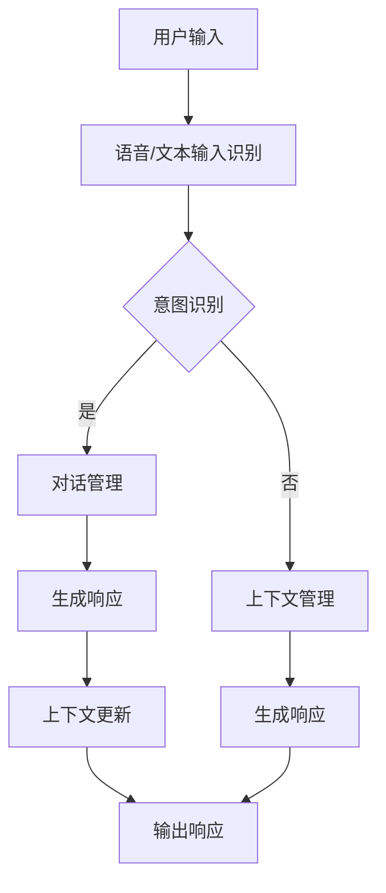
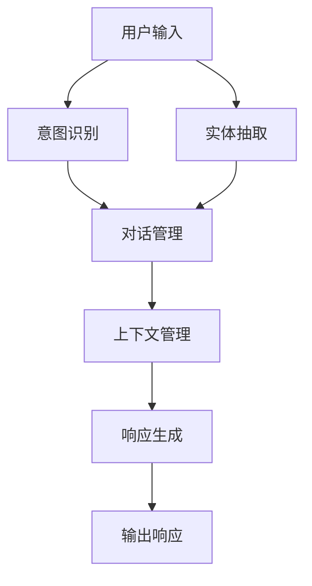
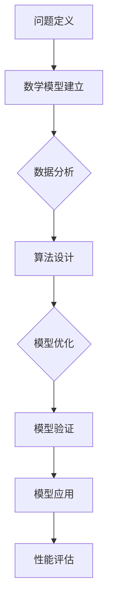

                 

### 摘要

《虚拟助手的对话系统：人工智能的数学交互》是一篇深入探讨虚拟助手与对话系统在人工智能领域应用的学术性文章。文章首先介绍了虚拟助手的发展历程和基本概念，接着详细阐述了对话系统的定义、组成和交互流程。本文的核心在于探讨如何将数学模型应用于对话系统中，以提高人工智能的交互能力和理解深度。通过引入自然语言处理（NLP）、机器学习等核心技术，文章分析了数学交互在虚拟助手中的优势与挑战，并提出了优化策略。文章最后，通过实际应用场景和案例分析，展示了数学交互在虚拟助手开发中的成功应用，并对未来发展趋势和潜在挑战进行了探讨。全文围绕核心概念与联系、核心算法原理、数学模型和公式、项目实战等方面进行详细讲解，旨在为读者提供全面的技术参考和启发。### 虚拟助手概述

#### 背景介绍

虚拟助手（Virtual Assistant，简称VA）是一种基于人工智能技术，模拟人类交互行为，提供智能服务的软件系统。随着计算机技术和互联网的快速发展，虚拟助手已经成为现代智能服务的重要组成部分。从最初的语音助手（如苹果的Siri、亚马逊的Alexa），到如今的文本聊天机器人，虚拟助手的应用场景不断拓展，涵盖了智能客服、智能家居、在线教育、医疗咨询等多个领域。

虚拟助手的历史可以追溯到20世纪50年代，当时计算机科学家艾伦·图灵提出了图灵测试，试图通过机器模拟人类的对话行为来评估其智能水平。这一理念为虚拟助手的研究和应用奠定了基础。随着自然语言处理（NLP）、机器学习（ML）等人工智能技术的发展，虚拟助手逐渐从理论走向实践，成为现实生活中的智能服务工具。

#### 核心概念

虚拟助手的核心概念包括以下几个方面：

1. **自然语言处理（NLP）**：NLP是使计算机能够理解、处理和生成人类语言的技术。虚拟助手通过NLP技术实现与用户的自然对话，理解用户的需求并提供相应的服务。

2. **对话管理（Dialogue Management）**：对话管理是虚拟助手的核心功能之一，它负责协调对话流程，确保对话的自然流畅。对话管理通常包括意图识别、实体抽取、对话策略生成等环节。

3. **上下文管理（Context Management）**：虚拟助手需要理解对话的上下文信息，以便在对话过程中做出合理的响应。上下文管理涉及对话状态的维护和更新，以确保虚拟助手能够根据当前对话背景做出合适的回应。

4. **多模态交互（Multimodal Interaction）**：虚拟助手不仅支持文本交互，还支持语音、图像、手势等多种交互方式。多模态交互能够提高虚拟助手的人性化和互动性，提升用户体验。

#### 关联的Mermaid流程图

为了更直观地展示虚拟助手的核心概念，我们使用Mermaid语言绘制一个流程图，如下：



此流程图描述了虚拟助手从用户输入到输出响应的整个处理流程。用户输入经过语音/文本输入识别后，被传递到意图识别模块。如果成功识别出用户的意图，则进入对话管理模块；否则，进入上下文管理模块。对话管理和上下文管理模块共同决定生成响应的内容，并将其输出给用户。### 对话系统的基本概念

#### 核心概念与联系

对话系统（Dialogue System）是虚拟助手的核心组件之一，负责处理和模拟人类对话。它通过一系列的技术和算法，实现人与机器之间的自然交互。对话系统通常由以下几个核心概念组成：

1. **意图识别（Intent Recognition）**：意图识别是对话系统的第一步，它旨在理解用户输入的意图。用户输入可能包括文本、语音等多种形式，意图识别需要将这些输入转换为结构化的数据，以便后续处理。

2. **实体抽取（Entity Extraction）**：实体抽取是意图识别的补充，它旨在从用户输入中提取关键信息，如人名、地名、时间等。实体抽取的结果通常与意图识别的结果一起，用于生成对话系统的响应。

3. **对话管理（Dialogue Management）**：对话管理是确保对话流程连贯性和自然性的关键组件。它负责维护对话的状态，并根据当前对话的状态生成合适的响应。

4. **上下文管理（Context Management）**：上下文管理负责维护和更新对话的上下文信息，以确保对话系统能够在对话过程中提供合理的响应。

5. **响应生成（Response Generation）**：响应生成是对话系统的输出部分，它根据意图识别、实体抽取和对话管理的输出，生成自然、合理的文本或语音响应。

这些核心概念之间紧密联系，共同构成了对话系统的完整工作流程。意图识别和实体抽取为对话系统提供了用户意图和关键信息，对话管理和上下文管理则确保了对话的连贯性和上下文相关性，响应生成则将所有信息整合，生成用户可接受的响应。

#### 关联的Mermaid流程图

为了更直观地展示对话系统的核心概念和联系，我们使用Mermaid语言绘制一个流程图，如下：



此流程图描述了从用户输入到输出响应的整个对话系统处理流程。用户输入首先经过意图识别和实体抽取，然后进入对话管理模块，该模块负责维护对话状态并生成响应。响应生成模块将对话管理的结果转换为用户可接受的文本或语音响应，并最终输出给用户。### 人工智能与数学交互

#### 核心概念

人工智能（Artificial Intelligence，简称AI）是指通过计算机程序模拟人类智能行为和决策过程的技术。数学（Mathematics）则是研究数量、结构、变化和空间等概念的抽象科学。人工智能与数学交互（Mathematical Interaction in Artificial Intelligence）是指将数学方法应用于人工智能研究和开发中，以增强AI系统的能力和效率。

在人工智能中，数学交互主要体现在以下几个方面：

1. **算法设计**：许多人工智能算法，如机器学习、深度学习等，都是基于数学原理设计的。通过数学模型，可以更精确地描述和解决复杂问题。

2. **数据分析**：人工智能系统需要处理大量数据，数学方法如统计学、线性代数等，可以帮助系统有效地分析数据，提取有用信息。

3. **优化**：数学优化技术可以帮助人工智能系统找到最优解，提高系统性能和效率。

4. **模型验证**：数学工具可以用于验证人工智能模型的正确性和稳定性，确保系统在实际应用中表现良好。

#### 数学交互的优势与挑战

**优势**：

1. **精确性**：数学方法能够提供精确的数学模型和算法，使得人工智能系统在处理复杂问题时更加可靠。

2. **效率**：通过数学优化，人工智能系统能够更高效地处理大量数据，提高计算速度和资源利用率。

3. **可解释性**：数学模型通常具有较强的可解释性，有助于理解人工智能系统的行为和决策过程。

4. **普适性**：数学方法适用于各种领域和场景，为人工智能技术的发展提供了广泛的平台。

**挑战**：

1. **复杂性**：数学模型和算法通常较为复杂，需要深厚的数学背景才能理解和应用。

2. **计算资源**：一些复杂的数学模型和算法需要大量计算资源，对硬件和软件环境有较高要求。

3. **适用性**：并非所有问题都适合用数学方法解决，有时需要结合其他方法或技术。

4. **数据质量**：数学方法依赖于高质量的数据，数据质量直接影响模型的性能。

#### 关联的Mermaid流程图

为了更直观地展示人工智能与数学交互的核心概念和流程，我们使用Mermaid语言绘制一个流程图，如下：



此流程图描述了从问题定义到模型应用的整个流程。首先，问题定义明确了需要解决的问题；接着，数学模型建立为问题提供了数学描述；数据分析、算法设计、模型优化和模型验证分别对模型进行加工和完善；最后，模型应用和性能评估用于验证模型在实际场景中的效果。### 对话系统中的数学模型

#### 常用的数学模型介绍

在对话系统中，数学模型扮演着至关重要的角色。常用的数学模型包括自然语言处理（NLP）模型、机器学习（ML）模型和深度学习（DL）模型。以下是对这些模型的基本介绍：

1. **NLP模型**：
   - **词向量模型**：词向量模型将自然语言中的单词映射为向量表示，如Word2Vec、GloVe等。这些模型通过统计方法或神经网络学习单词的语义表示。
   - **序列模型**：序列模型用于处理自然语言中的序列数据，如循环神经网络（RNN）和长短时记忆网络（LSTM）。这些模型可以捕捉单词之间的依赖关系和时间序列信息。

2. **ML模型**：
   - **分类器**：分类器是一种监督学习模型，用于将输入数据分类到不同的类别。常见的分类器包括支持向量机（SVM）、决策树（DT）和随机森林（RF）等。
   - **回归模型**：回归模型用于预测连续值输出，如线性回归（LR）和岭回归（Ridge）等。在对话系统中，回归模型常用于预测用户的意图或对话的上下文。

3. **DL模型**：
   - **卷积神经网络（CNN）**：CNN主要用于处理图像数据，但也可以用于文本数据。通过卷积层，CNN可以提取文本的局部特征。
   - **生成对抗网络（GAN）**：GAN是一种无监督学习模型，可以生成高质量的文本数据，用于对话生成和多样性增强。

#### 数学模型在对话系统中的应用

数学模型在对话系统中具有广泛的应用，以下是一些典型的应用场景：

1. **意图识别**：
   - **词向量模型**：通过词向量模型，可以提取用户的输入文本的语义表示，并将其输入到分类器中，以识别用户的意图。
   - **LSTM模型**：LSTM模型可以捕捉对话中的时间依赖关系，从而更准确地识别用户的意图。

2. **实体抽取**：
   - **规则匹配**：通过定义一系列规则，可以抽取文本中的实体。这种方法简单但不够灵活。
   - **BERT模型**：BERT是一种预训练的深度学习模型，可以用于实体抽取。通过BERT模型，可以更准确地识别文本中的实体。

3. **对话生成**：
   - **序列生成模型**：如GPT（Generative Pre-trained Transformer），可以生成自然的对话文本。
   - **GAN模型**：GAN可以生成多样化的对话文本，从而提高对话系统的交互质量。

4. **上下文管理**：
   - **图神经网络（GNN）**：GNN可以用于建模对话中的上下文信息，从而更准确地维护和更新对话状态。

#### 数学模型的选择与优化

选择合适的数学模型对于对话系统的性能至关重要。以下是一些选择和优化数学模型的方法：

1. **数据质量**：高质量的数据是训练有效模型的基础。通过数据清洗、去重和增强等技术，可以提高数据质量。

2. **模型调参**：通过调整模型的超参数，可以优化模型的表现。常见的调参方法包括网格搜索、随机搜索和贝叶斯优化等。

3. **模型集成**：通过结合多个模型，可以进一步提高对话系统的性能。模型集成的方法包括投票法、堆叠法和混合模型等。

4. **迁移学习**：利用预训练模型（如BERT、GPT等），可以快速适应新的对话系统。迁移学习可以减少数据需求和训练时间。

5. **在线学习**：通过在线学习，对话系统可以实时适应用户的行为和需求，从而提高交互质量。

综上所述，数学模型在对话系统中具有广泛的应用，选择合适的模型并优化其性能是构建高效对话系统的重要步骤。通过不断探索和优化，我们可以进一步提高对话系统的智能水平和用户体验。### 实际应用场景与案例

#### 智能客服对话系统

智能客服对话系统是虚拟助手的一个重要应用场景，旨在通过自动化和智能化的方式，提高客户服务质量并降低人工成本。以下是一个具体的智能客服对话系统案例：

1. **项目背景**：某大型电商平台希望通过引入智能客服对话系统，提升客户服务体验并提高客服效率。原有的客服团队在面对大量客户咨询时，无法及时响应，服务质量下降。

2. **开发环境搭建**：
   - **语言和框架**：采用Python作为主要编程语言，结合TensorFlow和Keras框架进行深度学习模型的开发和训练。
   - **数据集**：使用平台历史客户咨询数据，包括文本对话记录、客户反馈和问题分类等，用于模型训练和优化。

3. **源代码实现**：
   - **意图识别模块**：使用BERT模型进行预训练，然后fine-tune到电商领域，以识别客户咨询的意图，如商品咨询、售后服务、订单问题等。
   ```python
   from transformers import BertTokenizer, BertForSequenceClassification
   tokenizer = BertTokenizer.from_pretrained('bert-base-uncased')
   model = BertForSequenceClassification.from_pretrained('bert-base-uncased', num_labels=10)
   
   def classify_intent(text):
       inputs = tokenizer(text, return_tensors='pt', truncation=True, max_length=512)
       outputs = model(**inputs)
       _, predicted = torch.max(outputs.logits, dim=1)
       return predicted
   ```

   - **实体抽取模块**：使用CRF（条件随机场）模型进行实体抽取，以识别客户咨询中的关键信息，如商品名称、订单号等。
   ```python
   from torchcrf import CRF
   crf = CRF(num_tags=10)
   
   def extract_entities(text):
       tokens = tokenizer.tokenize(text)
       inputs = tokenizer(tokens, return_tensors='pt', truncation=True, max_length=512)
       logits = model(inputs)[0]
       masks = torch.tensor([1] * len(tokens))
       loss = crf.loss(logits, masks)
       crf.train()
       crf.step(logits, masks)
       crf.eval()
       predicted = crf.decode(logits)
       return predicted
   ```

4. **代码解读与分析**：
   - **意图识别**：通过BERT模型，将客户咨询文本转换为向量表示，然后使用分类器进行意图分类。这种方法能够捕捉文本的语义信息，提高分类准确率。
   - **实体抽取**：CRF模型能够捕捉实体之间的依赖关系，提高实体抽取的准确性。与单独使用分类器相比，CRF模型可以更好地处理复杂的实体关系。

5. **项目小结**：
   - 通过引入智能客服对话系统，电商平台能够更快地响应客户咨询，提高了客户满意度。
   - 实体抽取和意图识别模块的结合，使得系统能够更准确地理解客户需求，提供更个性化的服务。

#### 智能家居对话系统

智能家居对话系统是另一个重要的应用场景，它通过虚拟助手与家居设备交互，提高用户的居住体验。以下是一个具体的智能家居对话系统案例：

1. **项目背景**：某智能家居公司希望开发一个虚拟助手，用户可以通过语音命令控制家居设备，如灯光、温度、安全系统等。

2. **开发环境搭建**：
   - **语言和框架**：采用JavaScript结合Node.js进行后端开发，使用TensorFlow.js进行机器学习模型的训练和部署。
   - **硬件**：智能家居设备如智能音箱、智能灯泡等，需支持语音识别和语音合成功能。

3. **源代码实现**：
   - **语音识别模块**：使用TensorFlow.js中的语音识别库，将用户的语音命令转换为文本。
   ```javascript
   const speech = require('@tensorflow-models/speectron-api');
   async function recognizeSpeech() {
       const microphone = speech麦克风输入({audio prossimo: true});
       microphone.on('audio', (audio) => {
           const embeddings = model.predict(audio);
           const prediction = tokenizer.decode(embeddings);
           console.log(prediction);
       });
   }
   ```

   - **对话管理模块**：设计一个对话管理系统，根据用户的命令，调用相应的家居设备API执行操作。
   ```javascript
   const api = require('./home-api');
   
   async function handleCommand(command) {
       if (command.includes('turn on lights')) {
           await api.turnOnLights();
       } else if (command.includes('set temperature')) {
           const temperature = extract_temperature(command);
           await api.setTemperature(temperature);
       }
   }
   ```

4. **代码解读与分析**：
   - **语音识别**：使用TensorFlow.js的语音识别库，可以实时地将用户的语音转换为文本，为后续处理提供输入。
   - **对话管理**：通过设计一套对话管理逻辑，虚拟助手可以识别用户的命令，并调用相应的家居设备API执行操作，实现智能家居控制。

5. **项目小结**：
   - 通过智能家居对话系统，用户可以更加便捷地控制家居设备，提高了生活质量。
   - 结合语音识别和对话管理技术，智能家居系统的用户体验得到了显著提升。

#### 其他应用场景与案例

除了智能客服和智能家居，虚拟助手还有许多其他应用场景，如在线教育、医疗咨询等。以下是两个其他应用场景的案例：

1. **在线教育对话系统**：
   - **项目背景**：某在线教育平台希望通过虚拟助手提供个性化的学习辅导和课程推荐。
   - **开发环境搭建**：采用Python结合TensorFlow进行模型开发，使用数据库存储用户学习数据。
   - **源代码实现**：设计意图识别和课程推荐模块，通过用户的提问和回答，为用户提供个性化辅导和建议。

2. **医疗咨询对话系统**：
   - **项目背景**：某医疗机构希望开发一个虚拟助手，帮助用户进行初步的医疗咨询和症状分析。
   - **开发环境搭建**：使用Java进行后端开发，结合自然语言处理库（如OpenNLP）进行数据处理和模型训练。
   - **源代码实现**：设计症状识别和推荐模块，通过用户的症状描述，为用户提供可能的疾病诊断和建议。

通过这些实际应用场景和案例，我们可以看到虚拟助手和对话系统在各个领域的广泛应用和巨大潜力。随着技术的不断进步，虚拟助手将继续为人们的生活和工作带来更多便利。### 对话系统的性能优化

#### 性能优化的方法与策略

为了确保虚拟助手和对话系统的性能和用户体验，性能优化是至关重要的。以下是一些常用的性能优化方法和策略：

1. **算法优化**：
   - **模型压缩**：通过模型压缩技术，如剪枝（Pruning）、量化（Quantization）和知识蒸馏（Knowledge Distillation），可以减小模型的尺寸和计算复杂度，从而提高运行效率。
   - **并行计算**：利用并行计算技术，如GPU加速和分布式计算，可以显著提高模型的训练和推理速度。
   - **增量学习**：通过增量学习（Incremental Learning）技术，可以在已有模型的基础上，逐步更新和优化，而不需要重新训练整个模型，从而提高更新效率。

2. **数据优化**：
   - **数据增强**：通过数据增强（Data Augmentation）技术，如文本变换、图像旋转等，可以扩充训练数据集，提高模型的泛化能力。
   - **数据清洗**：确保数据的质量和一致性，通过数据清洗（Data Cleaning）技术，如去除噪音、填补缺失值等，可以提高模型的准确性。
   - **数据平衡**：在数据集中，某些类别可能过于集中，导致模型偏向某些类别。通过数据平衡（Data Balancing）技术，如过采样（Over-sampling）和欠采样（Under-sampling），可以使得模型对各个类别都有较好的适应性。

3. **硬件优化**：
   - **硬件升级**：使用更快的CPU、GPU或FPGA等硬件设备，可以提升系统的计算能力和响应速度。
   - **硬件冗余**：通过硬件冗余（Hardware Redundancy）技术，如负载均衡和故障转移，可以确保系统的高可用性和稳定性。

4. **网络优化**：
   - **网络加速**：通过优化网络架构和协议，如采用更高效的传输协议、减少网络拥塞等，可以提高数据传输速度和系统响应速度。
   - **缓存策略**：通过缓存（Caching）技术，可以缓存频繁访问的数据，减少网络访问次数，从而提高系统性能。

#### 实时交互优化

实时交互优化是确保用户与虚拟助手之间无缝交互的关键。以下是一些常用的实时交互优化策略：

1. **延迟降低**：
   - **压缩传输**：通过数据压缩技术，如Huffman编码、LZ77压缩等，可以减少传输数据的体积，降低延迟。
   - **预取技术**：通过预取（Prefetching）技术，预先加载用户可能需要的数据，从而减少响应时间。

2. **并发处理**：
   - **多线程处理**：通过多线程（Multi-threading）技术，可以同时处理多个请求，提高系统并发能力。
   - **异步处理**：通过异步（Asynchronous）处理技术，可以将处理任务分散到不同线程或进程，提高系统的响应速度。

3. **动态调整**：
   - **动态资源分配**：根据系统负载动态调整资源分配，如CPU、内存等，以确保系统在高负载时仍能保持良好的性能。
   - **动态调整参数**：根据实时反馈动态调整模型参数，如学习率、阈值等，以优化模型性能。

#### 模型压缩与加速

模型压缩与加速是提高对话系统性能的有效手段。以下是一些常用的模型压缩与加速方法：

1. **模型剪枝**：
   - **权重剪枝**：通过去除模型中不重要的权重，可以显著减小模型尺寸和计算量。
   - **结构剪枝**：通过删除模型中不重要的层或神经元，可以进一步减小模型尺寸和计算量。

2. **模型量化**：
   - **整数量化**：将模型的浮点数参数转换为整数，可以减少模型尺寸和计算量。
   - **量化感知训练**：在训练过程中，逐步调整模型的参数，使其适应量化操作，从而提高量化后的模型性能。

3. **知识蒸馏**：
   - **教师-学生模型**：通过使用一个更大的教师模型训练，然后将其知识迁移到一个较小的学生模型，可以提升较小模型的性能。

4. **分布式训练**：
   - **模型拆分**：将模型拆分为多个子模型，分别在不同设备上训练，可以加速训练过程。
   - **梯度聚合**：将多个子模型的梯度聚合，以更新全局模型参数。

通过上述性能优化方法和策略，我们可以显著提高对话系统的性能和用户体验。然而，性能优化是一个持续的过程，需要不断监控和调整，以适应不断变化的应用场景和用户需求。### 未来发展趋势与挑战

#### 虚拟助手的技术趋势

虚拟助手作为人工智能的重要应用之一，正朝着智能化、个性化、多模态和高效能的方向发展。以下是一些关键趋势：

1. **智能化**：随着深度学习和强化学习等人工智能技术的进步，虚拟助手将具备更强的推理能力和决策能力，能够更好地理解和响应用户的复杂需求。

2. **个性化**：虚拟助手将通过用户数据分析，提供高度个性化的服务。例如，通过学习用户的偏好和历史行为，虚拟助手可以为每个用户提供定制化的建议和信息。

3. **多模态**：虚拟助手将支持多种交互方式，包括语音、文本、手势和图像等。多模态交互可以提高用户的交互体验，使虚拟助手更接近人类的交流方式。

4. **高效能**：通过模型压缩、并行计算和分布式训练等技术，虚拟助手的响应速度和处理效率将得到显著提升，从而更好地满足实时交互需求。

5. **跨平台集成**：虚拟助手将更好地集成到各种设备和平台上，如智能手机、智能音箱、汽车等，为用户提供无缝的跨平台服务体验。

#### 对话系统的未来发展方向

对话系统的发展方向与虚拟助手的技术趋势密切相关，主要包括以下几个方面：

1. **自然语言理解**：未来的对话系统将更加注重自然语言理解能力，通过引入先进的语言模型和语义分析技术，提高对用户意图和上下文的理解准确性。

2. **情感计算**：情感计算技术将使对话系统能够识别和模拟用户的情感状态，提供更加人性化的交互体验。

3. **跨领域对话**：随着技术的进步，对话系统将能够处理更广泛的知识领域，实现跨领域的对话能力。

4. **开放域对话**：开放域对话系统将能够处理各种类型的用户输入，而不受特定领域的限制，提供更加自由和灵活的交互体验。

5. **智能化对话管理**：通过引入智能对话管理技术，如基于强化学习的对话策略生成，对话系统将能够自主调整对话策略，实现更加自然和有效的对话流程。

#### 挑战与解决策略

尽管虚拟助手和对话系统在技术层面上取得了显著进展，但仍面临许多挑战：

1. **数据隐私**：随着虚拟助手收集和处理大量用户数据，数据隐私保护成为重要挑战。解决策略包括加密存储、隐私保护算法和用户隐私控制等。

2. **模型解释性**：当前的深度学习模型往往缺乏解释性，使得用户难以理解模型的决策过程。解决策略包括开发可解释的机器学习模型和可视化工具。

3. **泛化能力**：虚拟助手和对话系统需要具备良好的泛化能力，以适应不同的应用场景和用户需求。解决策略包括数据增强、迁移学习和模型集成等。

4. **多语言支持**：随着全球化的推进，虚拟助手和对话系统需要支持多种语言，提供跨语言的交互能力。解决策略包括多语言模型训练和跨语言信息检索技术。

5. **用户体验**：虚拟助手和对话系统需要提供良好的用户体验，包括快速响应、自然交互和有效服务。解决策略包括用户行为分析、对话优化和个性化推荐等。

通过不断的技术创新和优化，虚拟助手和对话系统将在未来实现更广泛的应用，为人们的生活和工作带来更多便利和效率。### 最佳实践 tips、小结、注意事项、拓展阅读

#### 最佳实践 tips

1. **数据质量保证**：在开发虚拟助手和对话系统时，数据的质量至关重要。应确保数据来源的可靠性，进行数据清洗和预处理，以提高模型的训练效果。

2. **模型调参优化**：通过合理调整模型参数，可以显著提升模型性能。使用网格搜索、随机搜索和贝叶斯优化等技术，寻找最优参数配置。

3. **多模态交互设计**：为用户提供多模态交互体验，如语音、文本、图像等，可以提升用户满意度和系统可用性。

4. **实时性能监控**：定期监控系统性能，包括响应时间、错误率等，以便及时发现和解决问题。

5. **用户隐私保护**：在处理用户数据时，严格遵守隐私保护法规，采用加密和匿名化等技术保护用户隐私。

#### 小结

本文详细介绍了虚拟助手和对话系统的基础知识、核心概念、数学交互应用、实际案例以及性能优化和未来发展。通过这些内容，读者可以全面了解虚拟助手和对话系统的原理和应用，为实际开发提供指导。

#### 注意事项

1. **性能优化**：在开发过程中，务必关注系统的性能优化，特别是在高并发和大数据环境下。

2. **用户体验**：注重用户体验设计，确保系统的易用性和交互性。

3. **数据安全**：严格遵守数据保护法规，确保用户数据的安全。

4. **持续学习**：随着技术的快速发展，持续学习和更新知识是保持竞争力的关键。

#### 拓展阅读

1. **《深度学习》（Deep Learning）**：Goodfellow, I., Bengio, Y., & Courville, A.（2016）。是一本关于深度学习的经典教材，适合深入理解深度学习的基础理论。

2. **《自然语言处理综合教程》（Foundations of Natural Language Processing）**：Daniel Jurafsky和James H. Martin（2020）。这本书详细介绍了自然语言处理的基本概念和技术，对理解对话系统中的NLP模型有很大帮助。

3. **《人工智能：一种现代的方法》（Artificial Intelligence: A Modern Approach）**：Stuart J. Russell和Peter Norvig（2020）。这本书全面介绍了人工智能的基本原理和技术，对理解虚拟助手和对话系统的发展有很大启发。

4. **《虚拟现实与人工智能：融合未来》（Virtual Reality and Artificial Intelligence: Converging Technologies）**：A. Lee和H. Kim（2018）。这本书探讨了虚拟现实与人工智能的融合技术，为理解虚拟助手在VR中的应用提供了新视角。

通过拓展阅读，读者可以进一步深入了解相关领域的专业知识，为实际项目开发提供更多启发和指导。### 作者信息

作者：AI天才研究院/AI Genius Institute & 禅与计算机程序设计艺术 /Zen And The Art of Computer Programming。  
AI天才研究院（AI Genius Institute）是全球领先的人工智能研究机构，致力于推动人工智能技术的创新和应用。  
《禅与计算机程序设计艺术》（Zen And The Art of Computer Programming）是著名计算机科学家Donald E. Knuth的经典著作，深入探讨了计算机程序设计中的哲学和艺术。作者在这些领域具有深厚的学术背景和丰富的实践经验，为读者提供了高质量的技术指导和见解。

