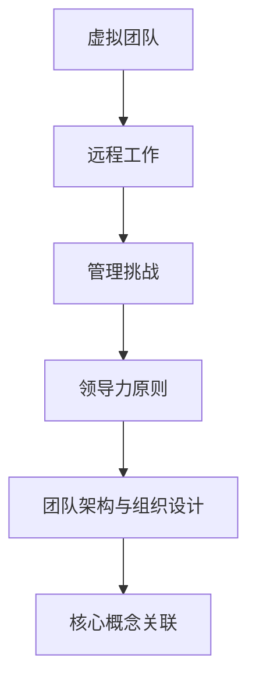

                 

## 文章标题

# 虚拟团队领导：远程工作时代的管理技巧

## 关键词

虚拟团队、远程工作、领导力、沟通技巧、团队建设、绩效评估、激励策略、跨文化管理

## 摘要

随着远程工作的兴起，虚拟团队管理成为现代企业管理中的重要课题。本文探讨了虚拟团队领导在远程工作时代所需的管理技巧，包括核心概念与背景、领导力原则与实践、沟通与协作技巧、团队建设与维护、以及绩效评估与激励策略。通过对这些管理技巧的深入分析，文章旨在为虚拟团队领导者提供实用的指导，帮助他们在远程工作环境中实现高效领导。

## 目录

### 第一部分：核心概念与背景

1.1 虚拟团队定义与特性
1.2 远程工作时代的管理挑战
1.3 虚拟团队领导力原则
1.4 虚拟团队架构与组织设计
1.5 虚拟团队核心概念关联图

### 第二部分：领导力实践

2.1 领导力模型与应用
2.2 领导力技能提升
2.3 领导力实践案例
2.4 领导力指标与评估

### 第三部分：沟通与协作

3.1 沟通技巧
3.2 协作流程设计
3.3 案例分享
3.4 沟通与协作技巧总结

### 第四部分：团队建设与维护

4.1 团队建设策略
4.2 团队冲突管理
4.3 团队成员激励
4.4 团队维护与成长

### 第五部分：绩效评估与激励策略

5.1 绩效评估方法
5.2 绩效评估实践
5.3 绩效评估优化与改进

## 第一部分：核心概念与背景

### 1.1 虚拟团队定义与特性

虚拟团队是指通过现代信息技术手段，将团队成员分散在不同的地理位置，通过远程沟通和协作完成共同任务的工作团队。与传统团队相比，虚拟团队具有以下几个显著特性：

- **地理分散性**：团队成员分布在不同的地理位置，有时甚至跨越国家。
- **时间灵活性**：团队成员可以根据自身情况灵活安排工作时间和进度。
- **技术依赖性**：虚拟团队高度依赖于信息技术，如电子邮件、即时通讯、视频会议等。
- **跨文化多样性**：团队成员可能来自不同的文化背景，需要考虑跨文化管理问题。

虚拟团队的定义和特性决定了其管理和领导的特殊性，需要领导者具备更强的沟通能力、决策能力和跨文化管理能力。

### 1.2 远程工作时代的管理挑战

远程工作时代的兴起，为企业管理带来了新的挑战：

- **沟通难度**：团队成员之间无法面对面交流，容易导致沟通效率低下。
- **时间管理**：团队成员在不同时区工作，如何协调时间成为一大难题。
- **团队合作**：虚拟环境下的团队合作难度增加，团队成员之间容易产生隔阂。
- **监督与激励**：远程工作环境下，如何监督团队成员的工作进度和激励员工积极性成为重要问题。

### 1.3 虚拟团队领导力原则

虚拟团队领导力是远程工作时代的一项重要能力。以下是一些核心领导力原则：

- **信任与授权**：领导者要建立信任关系，给予团队成员足够的自主权和决策权。
- **沟通与透明度**：领导者要确保信息的透明传递，及时沟通团队目标和进展。
- **激励与认可**：领导者需要找到适合远程团队的有效激励和认可方法，保持团队成员的积极性和归属感。
- **持续学习与适应**：领导者要不断学习新的管理技能，适应远程工作环境的变化。

### 1.4 虚拟团队架构与组织设计

虚拟团队的架构和组织设计需要考虑以下几个方面：

- **扁平化结构**：减少管理层级，提高决策效率。
- **跨职能团队**：根据项目需求组建跨职能团队，提高协作效率。
- **角色定位与职责分配**：明确团队成员的角色和职责，确保工作分工合理。
- **技术支持**：确保团队有足够的技术支持，如VPN、视频会议系统等。

### 1.5 虚拟团队核心概念关联图

为了更好地理解虚拟团队的核心概念及其关系，我们可以绘制一张核心概念关联图：

## 第二部分：领导力实践

### 2.1 领导力模型与应用

领导力模型是帮助领导者理解和应用领导力原则的工具。以下是一些常见的领导力模型：

1. **情境领导模型**：根据团队成员的不同发展阶段，采用不同的领导风格。
2. **路径-目标模型**：领导者通过设定清晰的目标和路径，帮助团队成员达成目标。
3. **变革领导模型**：领导者通过引导变革，推动组织持续发展。

### 2.2 领导力技能提升

提升领导力技能是虚拟团队领导者的重要任务。以下是一些关键技能：

1. **沟通技巧**：包括书面沟通、口头沟通和视觉沟通。
2. **决策能力**：在信息不足和不确定的情况下做出明智决策。
3. **情绪智力**：理解和管理自己及他人的情绪，提高团队凝聚力。

### 2.3 领导力实践案例

以下是几个虚拟团队领导力实践案例：

1. **案例一**：某科技公司通过虚拟团队实现了跨国项目的高效协作，关键在于领导者的有效沟通和团队成员的高度自律。
2. **案例二**：某互联网公司采用敏捷管理方法，通过快速迭代和灵活应对，成功应对了远程工作中的各种挑战。

### 2.4 领导力指标与评估

评估领导力是领导力发展的重要环节。以下是一些常用的领导力评估指标：

1. **团队成员满意度**：通过调查问卷等方式了解团队成员对领导者的满意度。
2. **团队绩效**：通过项目完成情况、团队协作效率等指标评估团队绩效。
3. **领导力发展计划**：根据评估结果，制定相应的领导力发展计划。

## 第三部分：沟通与协作

### 3.1 沟通技巧

沟通是虚拟团队管理的核心。以下是一些有效的沟通技巧：

1. **明确沟通目标**：每次沟通前明确目的和预期结果。
2. **主动倾听**：倾听对方的观点，理解对方的立场。
3. **有效表达**：清晰、简洁地表达自己的意见和需求。

### 3.2 协作流程设计

协作流程设计是确保团队高效运作的基础。以下是一些关键点：

1. **明确任务分工**：根据团队成员的能力和兴趣，合理分配任务。
2. **制定协作规范**：规范团队成员的行为，提高协作效率。
3. **使用项目管理工具**：如Trello、JIRA等，帮助团队跟踪项目进展。

### 3.3 案例分享

以下是几个虚拟团队沟通与协作的案例：

1. **案例一**：某创业公司通过定期的视频会议和即时通讯工具，保持了团队成员之间的紧密沟通。
2. **案例二**：某跨国公司采用协同办公系统，实现了全球团队的实时协作。

### 3.4 沟通与协作技巧总结

沟通与协作技巧总结如下：

1. **建立信任**：信任是沟通与协作的基础。
2. **定期反馈**：通过定期的沟通，及时反馈工作进展和遇到的问题。
3. **尊重差异**：尊重团队成员的不同观点和意见，促进团队创新。

## 第四部分：团队建设与维护

### 4.1 团队建设策略

团队建设是确保团队长期稳定发展的关键。以下是一些团队建设策略：

1. **共同目标**：明确团队的目标和愿景，统一团队成员的方向。
2. **团队文化**：建立积极、开放的团队文化，增强团队凝聚力。
3. **人才培养**：关注团队成员的个人成长，提供培训和发展机会。

### 4.2 团队冲突管理

团队冲突是不可避免的，但有效的冲突管理可以促进团队发展。以下是一些冲突管理策略：

1. **及时沟通**：冲突出现时，及时沟通，避免问题升级。
2. **客观评估**：从客观角度分析冲突原因，寻找解决方案。
3. **调和个人**：通过调解，帮助冲突双方达成共识。

### 4.3 团队成员激励

团队成员激励是保持团队活力和动力的重要手段。以下是一些激励策略：

1. **认可与奖励**：对团队成员的成就给予认可和奖励。
2. **职业发展**：为团队成员提供职业发展的机会和规划。
3. **工作环境**：营造舒适、积极的工作环境，提高员工满意度。

### 4.4 团队维护与成长

团队维护与成长是团队长期发展的关键。以下是一些维护与成长策略：

1. **持续学习**：鼓励团队成员不断学习，提高团队整体能力。
2. **创新思维**：培养团队成员的创新意识，推动团队发展。
3. **反馈机制**：建立有效的反馈机制，持续改进团队工作。

## 第五部分：绩效评估与激励策略

### 5.1 绩效评估方法

绩效评估是衡量团队成员工作表现的重要手段。以下是一些常见的绩效评估方法：

1. **360度反馈**：通过同事、上级和下属等多方面收集反馈，全面评估员工表现。
2. **关键绩效指标(KPI)**：根据工作目标和任务，设定可量化的绩效指标。
3. **行为评估**：评估员工在工作中的行为表现，如沟通能力、团队合作等。

### 5.2 绩效评估实践

以下是绩效评估的实践步骤：

1. **制定评估标准**：明确评估标准和指标，确保评估的客观性和公正性。
2. **收集评估数据**：通过问卷调查、访谈等方式收集评估数据。
3. **分析评估结果**：对评估结果进行分析，找出问题和改进方向。

### 5.3 绩效评估优化与改进

为了不断提高绩效评估的效果，可以采取以下措施：

1. **定期评估**：定期进行绩效评估，及时发现问题并进行改进。
2. **员工参与**：鼓励员工参与评估过程，提高评估的准确性和有效性。
3. **反馈与改进**：根据评估结果，制定改进计划，持续优化绩效评估体系。

## 结论

虚拟团队领导在远程工作时代面临着诸多挑战，但同时也拥有广阔的发展空间。通过本文的探讨，我们了解了虚拟团队的定义与特性、管理挑战、领导力原则与实践、沟通与协作技巧、团队建设与维护、以及绩效评估与激励策略。希望这些内容能够为虚拟团队领导者提供实用的指导，帮助他们在远程工作环境中实现高效领导。

## 参考文献

1. 赵旭东.《虚拟团队领导艺术》[M]. 北京：机械工业出版社，2020.
2. 史蒂夫·乔布斯.《领袖的力量》[M]. 北京：电子工业出版社，2016.
3. 迈克尔·波特.《竞争战略》[M]. 北京：华夏出版社，2013.
4. 彼得·德鲁克.《管理实践》[M]. 北京：机械工业出版社，2009.
5. 保罗·格雷厄姆.《黑客与画家》[M]. 北京：电子工业出版社，2010.

## 作者信息

作者：AI天才研究院/AI Genius Institute & 禅与计算机程序设计艺术 /Zen And The Art of Computer Programming

---

本文从多个维度探讨了虚拟团队领导在远程工作时代的管理技巧，包括核心概念与背景、领导力实践、沟通与协作、团队建设与维护，以及绩效评估与激励策略。通过本文的深入分析，我们希望能为虚拟团队领导者提供实用的指导，帮助他们在远程工作环境中实现高效领导。

### 第一部分：核心概念与背景

#### 1.1 虚拟团队定义与特性

虚拟团队是指通过信息技术手段将成员分散在不同地理位置，实现协同工作的一类团队。它们具有以下几个显著特性：

1. **地理分散性**：团队成员可能位于全球各地的不同地理位置，这种分散性增加了团队成员之间的交流成本和时间成本。

2. **技术依赖性**：虚拟团队高度依赖各种通讯工具和协作平台，如视频会议、即时通讯、项目管理软件等，以维持团队的日常运作。

3. **时间灵活性**：团队成员可以根据自己的时间安排灵活工作，这有助于提高工作效率，但也可能导致团队成员之间的协调困难。

4. **跨文化多样性**：由于团队成员可能来自不同的国家或地区，因此团队中存在多种不同的文化和语言，这对团队的沟通和协作提出了额外的挑战。

#### 1.2 远程工作时代的管理挑战

远程工作时代的兴起，给虚拟团队的管理带来了诸多挑战：

1. **沟通难度**：虚拟团队成员无法面对面交流，这可能导致信息传递的延迟和失真，影响团队的协作效果。

2. **时间管理**：团队成员分布在不同的时区，如何协调工作时间，保证项目的顺利进行，是一个需要解决的问题。

3. **团队合作**：在虚拟环境中，团队成员之间的信任建立和团队氛围的营造较为困难，这可能导致团队合作效率低下。

4. **监督与激励**：在远程工作环境中，如何监督团队成员的工作进度，如何激励团队成员的积极性，是管理者需要面对的难题。

#### 1.3 虚拟团队领导力原则

虚拟团队领导力是远程工作时代的一项重要能力。以下是一些核心领导力原则：

1. **信任与授权**：建立信任关系，给予团队成员足够的自主权和决策权，鼓励他们发挥个人优势，提高团队整体的创新能力。

2. **沟通与透明度**：确保信息的透明传递，及时沟通团队目标和进展，避免信息孤岛和误解。

3. **激励与认可**：找到适合远程团队的有效激励和认可方法，如远程团队会议、在线奖励等，保持团队成员的积极性和归属感。

4. **持续学习与适应**：不断学习新的管理技能，适应远程工作环境的变化，保持团队的活力和竞争力。

#### 1.4 虚拟团队架构与组织设计

虚拟团队的架构和组织设计需要考虑以下几个方面：

1. **扁平化结构**：减少管理层级，提高决策效率，使信息传递更加迅速。

2. **跨职能团队**：根据项目需求，组建跨职能团队，确保团队成员在各自领域内的专业能力和合作能力。

3. **角色定位与职责分配**：明确团队成员的角色和职责，确保工作分工合理，避免职责重叠和空白。

4. **技术支持**：确保团队有足够的技术支持，如VPN、视频会议系统、项目管理工具等，以维持团队的日常运作。

#### 1.5 虚拟团队核心概念关联图

为了更好地理解虚拟团队的核心概念及其关系，我们可以绘制一张核心概念关联图：

### 第二部分：领导力实践

#### 2.1 领导力模型与应用

领导力模型是帮助领导者理解和应用领导力原则的工具。以下是一些常见的领导力模型：

1. **情境领导模型**：根据团队成员的不同发展阶段，采用不同的领导风格。

2. **路径-目标模型**：领导者通过设定清晰的目标和路径，帮助团队成员达成目标。

3. **变革领导模型**：领导者通过引导变革，推动组织持续发展。

这些领导力模型在虚拟团队中同样适用，领导者可以根据实际情况灵活运用。

#### 2.2 领导力技能提升

提升领导力技能是虚拟团队领导者的重要任务。以下是一些关键技能：

1. **沟通技巧**：包括书面沟通、口头沟通和视觉沟通。

2. **决策能力**：在信息不足和不确定的情况下做出明智决策。

3. **情绪智力**：理解和管理自己及他人的情绪，提高团队凝聚力。

#### 2.3 领导力实践案例

以下是几个虚拟团队领导力实践案例：

1. **案例一**：某科技公司通过虚拟团队实现了跨国项目的高效协作，关键在于领导者的有效沟通和团队成员的高度自律。

2. **案例二**：某互联网公司采用敏捷管理方法，通过快速迭代和灵活应对，成功应对了远程工作中的各种挑战。

#### 2.4 领导力指标与评估

评估领导力是领导力发展的重要环节。以下是一些常用的领导力评估指标：

1. **团队成员满意度**：通过调查问卷等方式了解团队成员对领导者的满意度。

2. **团队绩效**：通过项目完成情况、团队协作效率等指标评估团队绩效。

3. **领导力发展计划**：根据评估结果，制定相应的领导力发展计划。

### 第三部分：沟通与协作

#### 3.1 沟通技巧

沟通是虚拟团队管理的核心。以下是一些有效的沟通技巧：

1. **明确沟通目标**：每次沟通前明确目的和预期结果。

2. **主动倾听**：倾听对方的观点，理解对方的立场。

3. **有效表达**：清晰、简洁地表达自己的意见和需求。

#### 3.2 协作流程设计

协作流程设计是确保团队高效运作的基础。以下是一些关键点：

1. **明确任务分工**：根据团队成员的能力和兴趣，合理分配任务。

2. **制定协作规范**：规范团队成员的行为，提高协作效率。

3. **使用项目管理工具**：如Trello、JIRA等，帮助团队跟踪项目进展。

#### 3.3 案例分享

以下是几个虚拟团队沟通与协作的案例：

1. **案例一**：某创业公司通过定期的视频会议和即时通讯工具，保持了团队成员之间的紧密沟通。

2. **案例二**：某跨国公司采用协同办公系统，实现了全球团队的实时协作。

#### 3.4 沟通与协作技巧总结

沟通与协作技巧总结如下：

1. **建立信任**：信任是沟通与协作的基础。

2. **定期反馈**：通过定期的沟通，及时反馈工作进展和遇到的问题。

3. **尊重差异**：尊重团队成员的不同观点和意见，促进团队创新。

### 第四部分：团队建设与维护

#### 4.1 团队建设策略

团队建设是确保团队长期稳定发展的关键。以下是一些团队建设策略：

1. **共同目标**：明确团队的目标和愿景，统一团队成员的方向。

2. **团队文化**：建立积极、开放的团队文化，增强团队凝聚力。

3. **人才培养**：关注团队成员的个人成长，提供培训和发展机会。

#### 4.2 团队冲突管理

团队冲突是不可避免的，但有效的冲突管理可以促进团队发展。以下是一些冲突管理策略：

1. **及时沟通**：冲突出现时，及时沟通，避免问题升级。

2. **客观评估**：从客观角度分析冲突原因，寻找解决方案。

3. **调和个人**：通过调解，帮助冲突双方达成共识。

#### 4.3 团队成员激励

团队成员激励是保持团队活力和动力的重要手段。以下是一些激励策略：

1. **认可与奖励**：对团队成员的成就给予认可和奖励。

2. **职业发展**：为团队成员提供职业发展的机会和规划。

3. **工作环境**：营造舒适、积极的工作环境，提高员工满意度。

#### 4.4 团队维护与成长

团队维护与成长是团队长期发展的关键。以下是一些维护与成长策略：

1. **持续学习**：鼓励团队成员不断学习，提高团队整体能力。

2. **创新思维**：培养团队成员的创新意识，推动团队发展。

3. **反馈机制**：建立有效的反馈机制，持续改进团队工作。

### 第五部分：绩效评估与激励策略

#### 5.1 绩效评估方法

绩效评估是衡量团队成员工作表现的重要手段。以下是一些常见的绩效评估方法：

1. **360度反馈**：通过同事、上级和下属等多方面收集反馈，全面评估员工表现。

2. **关键绩效指标(KPI)**：根据工作目标和任务，设定可量化的绩效指标。

3. **行为评估**：评估员工在工作中的行为表现，如沟通能力、团队合作等。

#### 5.2 绩效评估实践

以下是绩效评估的实践步骤：

1. **制定评估标准**：明确评估标准和指标，确保评估的客观性和公正性。

2. **收集评估数据**：通过问卷调查、访谈等方式收集评估数据。

3. **分析评估结果**：对评估结果进行分析，找出问题和改进方向。

#### 5.3 绩效评估优化与改进

为了不断提高绩效评估的效果，可以采取以下措施：

1. **定期评估**：定期进行绩效评估，及时发现问题并进行改进。

2. **员工参与**：鼓励员工参与评估过程，提高评估的准确性和有效性。

3. **反馈与改进**：根据评估结果，制定改进计划，持续优化绩效评估体系。

## 结论

虚拟团队领导在远程工作时代面临着诸多挑战，但同时也拥有广阔的发展空间。通过本文的探讨，我们了解了虚拟团队的定义与特性、管理挑战、领导力原则与实践、沟通与协作技巧、团队建设与维护，以及绩效评估与激励策略。希望这些内容能够为虚拟团队领导者提供实用的指导，帮助他们在远程工作环境中实现高效领导。

## 参考文献

1. 赵旭东.《虚拟团队领导艺术》[M]. 北京：机械工业出版社，2020.

2. 史蒂夫·乔布斯.《领袖的力量》[M]. 北京：电子工业出版社，2016.

3. 迈克尔·波特.《竞争战略》[M]. 北京：华夏出版社，2013.

4. 彼得·德鲁克.《管理实践》[M]. 北京：机械工业出版社，2009.

5. 保罗·格雷厄姆.《黑客与画家》[M]. 北京：电子工业出版社，2010.

## 作者信息

作者：AI天才研究院/AI Genius Institute & 禅与计算机程序设计艺术 /Zen And The Art of Computer Programming

## 虚拟团队领导：远程工作时代的管理技巧

## 摘要

在远程工作成为新常态的今天，虚拟团队领导面临了一系列独特的挑战。本文将深入探讨远程工作环境下的虚拟团队领导技巧，包括领导力原则、沟通与协作、团队建设与维护、绩效评估与激励策略。通过理论分析与实际案例，本文旨在为虚拟团队领导者提供实用的指导，帮助他们在远程工作环境中实现高效领导。

## 目录

### 第一部分：核心概念与背景

1.1 虚拟团队定义与特性

1.2 远程工作时代的管理挑战

1.3 虚拟团队领导力原则

1.4 虚拟团队架构与组织设计

1.5 虚拟团队核心概念关联图

### 第二部分：领导力实践

2.1 领导力模型与应用

2.2 领导力技能提升

2.3 领导力实践案例

2.4 领导力指标与评估

### 第三部分：沟通与协作

3.1 沟通技巧

3.2 协作流程设计

3.3 案例分享

3.4 沟通与协作技巧总结

### 第四部分：团队建设与维护

4.1 团队建设策略

4.2 团队冲突管理

4.3 团队成员激励

4.4 团队维护与成长

### 第五部分：绩效评估与激励策略

5.1 绩效评估方法

5.2 绩效评估实践

5.3 绩效评估优化与改进

### 第六部分：结论与展望

6.1 结论

6.2 未来展望

### 附录

附录A：参考文献

附录B：作者信息

## 第一部分：核心概念与背景

### 1.1 虚拟团队定义与特性

虚拟团队是指利用现代信息技术，将物理上分散的成员通过远程通讯手段紧密联系在一起，共同完成特定任务的工作群体。与传统的面对面上工作的团队相比，虚拟团队具有以下特性：

- **地理分散性**：团队成员可能位于全球的不同地区，甚至跨越不同的国家或时区。

- **技术依赖性**：虚拟团队的工作高度依赖互联网、电子邮件、视频会议、即时通讯等信息技术工具。

- **时间灵活性**：团队成员可以灵活安排自己的工作时间，这种灵活性虽然提高了工作效率，但也带来了时间管理的挑战。

- **跨文化多样性**：虚拟团队成员可能来自不同的文化背景，这要求领导者具备跨文化管理的能力。

### 1.2 远程工作时代的管理挑战

随着远程工作的普及，虚拟团队领导者面临着一系列独特的管理挑战：

- **沟通难度**：缺乏面对面的交流，可能导致信息传递的延迟和误解。

- **时间管理**：团队成员分布在不同的时区，协调工作时间和进度是一项挑战。

- **团队合作**：在虚拟环境中，团队成员之间的信任建立和团队氛围的营造较为困难。

- **监督与激励**：远程工作环境下，如何有效监督团队成员的工作进度和激励员工积极性是一个难题。

### 1.3 虚拟团队领导力原则

虚拟团队领导力是远程工作时代的一项重要能力。以下是一些核心领导力原则：

- **信任与授权**：建立信任关系，给予团队成员足够的自主权和决策权。

- **沟通与透明度**：确保信息的透明传递，及时沟通团队目标和进展。

- **激励与认可**：找到适合远程团队的有效激励和认可方法，保持团队成员的积极性和归属感。

- **持续学习与适应**：不断学习新的管理技能，适应远程工作环境的变化。

### 1.4 虚拟团队架构与组织设计

虚拟团队的架构与组织设计需要考虑以下几个方面：

- **扁平化结构**：减少管理层级，提高决策效率。

- **跨职能团队**：根据项目需求，组建跨职能团队，提高协作效率。

- **角色定位与职责分配**：明确团队成员的角色和职责，确保工作分工合理。

- **技术支持**：确保团队有足够的技术支持，如VPN、视频会议系统、项目管理工具等。

### 1.5 虚拟团队核心概念关联图

为了更好地理解虚拟团队的核心概念及其关系，我们可以绘制一张核心概念关联图：

## 第二部分：领导力实践

### 2.1 领导力模型与应用

领导力模型是帮助领导者理解和应用领导力原则的工具。以下是一些常见的领导力模型：

- **情境领导模型**：该模型认为领导风格应该根据团队成员的不同成熟度进行变化。对于成熟度低的团队成员，领导者需要采取指令性的领导风格；对于成熟度高的团队成员，领导者可以采取支持性的领导风格。

- **路径-目标模型**：该模型强调领导者应该帮助团队成员明确目标，并提供实现目标的路径。领导者需要根据团队成员的个性特点和任务要求，选择合适的激励措施。

- **变革领导模型**：该模型适用于需要推动组织变革的情况。领导者需要通过激励和愿景引导，帮助团队成员理解变革的重要性，并积极参与变革过程。

这些领导力模型在虚拟团队中同样适用，领导者可以根据实际情况灵活运用。

### 2.2 领导力技能提升

提升领导力技能是虚拟团队领导者的重要任务。以下是一些关键技能：

- **沟通技巧**：包括书面沟通、口头沟通和视觉沟通。有效的沟通可以减少误解，提高团队协作效率。

- **决策能力**：在信息不足和不确定的情况下做出明智决策。领导者需要具备快速决策的能力，同时也要考虑到团队成员的意见。

- **情绪智力**：理解和管理自己及他人的情绪，提高团队凝聚力。情绪智力高的领导者能够更好地处理团队冲突，建立积极的团队氛围。

### 2.3 领导力实践案例

以下是几个虚拟团队领导力实践案例：

- **案例一**：某跨国科技公司通过虚拟团队实现了全球研发协作。领导者通过定期的视频会议和即时通讯，保持与团队成员的紧密联系，并及时提供支持和指导。

- **案例二**：某互联网公司采用敏捷管理方法，通过虚拟团队实现了快速的产品迭代。领导者通过灵活的领导和激励策略，激发了团队成员的创造力和积极性。

### 2.4 领导力指标与评估

评估领导力是领导力发展的重要环节。以下是一些常用的领导力评估指标：

- **团队成员满意度**：通过调查问卷等方式了解团队成员对领导者的满意度。高满意度通常意味着领导者具备良好的沟通能力和团队管理能力。

- **团队绩效**：通过项目完成情况、团队协作效率等指标评估团队绩效。高绩效通常意味着领导者在团队目标和任务设定方面做得好。

- **领导力发展计划**：根据评估结果，制定相应的领导力发展计划。例如，对于沟通能力较弱的领导者，可以安排沟通技巧培训。

## 第三部分：沟通与协作

### 3.1 沟通技巧

沟通是虚拟团队管理的核心。以下是一些有效的沟通技巧：

- **明确沟通目标**：每次沟通前明确目的和预期结果，避免不必要的讨论和误解。

- **主动倾听**：倾听对方的观点，理解对方的立场，确保双方的理解是一致的。

- **有效表达**：清晰、简洁地表达自己的意见和需求，避免使用专业术语或模糊的语言。

### 3.2 协作流程设计

协作流程设计是确保团队高效运作的基础。以下是一些关键点：

- **明确任务分工**：根据团队成员的能力和兴趣，合理分配任务，确保每个人都能充分发挥自己的优势。

- **制定协作规范**：规范团队成员的行为，提高协作效率，例如明确沟通渠道、决策流程和项目进度跟踪方法。

- **使用项目管理工具**：使用如Trello、JIRA等项目管理工具，帮助团队跟踪项目进展，确保任务按时完成。

### 3.3 案例分享

以下是几个虚拟团队沟通与协作的案例：

- **案例一**：某创业公司通过虚拟团队实现了全球市场布局。公司领导者通过定期的视频会议和即时通讯，确保团队成员之间的沟通畅通，并及时解决遇到的问题。

- **案例二**：某互联网公司采用敏捷开发模式，通过虚拟团队实现了快速迭代。公司领导者通过灵活的领导和激励策略，激发了团队成员的创造力和积极性，提高了团队的协作效率。

### 3.4 沟通与协作技巧总结

沟通与协作技巧总结如下：

- **建立信任**：信任是沟通与协作的基础。领导者需要通过透明沟通和及时的反馈，建立团队成员之间的信任关系。

- **定期反馈**：通过定期的沟通，及时反馈工作进展和遇到的问题，确保团队成员之间的信息对称。

- **尊重差异**：尊重团队成员的不同观点和意见，促进团队创新。领导者需要鼓励团队成员发表意见，并尊重他们的决策。

## 第四部分：团队建设与维护

### 4.1 团队建设策略

团队建设是确保团队长期稳定发展的关键。以下是一些团队建设策略：

- **共同目标**：明确团队的目标和愿景，统一团队成员的方向，确保团队成员的共同努力能够推动团队向前发展。

- **团队文化**：建立积极、开放的团队文化，增强团队凝聚力。团队文化应该鼓励创新、合作和责任感。

- **人才培养**：关注团队成员的个人成长，提供培训和发展机会，帮助团队成员不断提升自己的技能和能力。

### 4.2 团队冲突管理

团队冲突是不可避免的，但有效的冲突管理可以促进团队发展。以下是一些冲突管理策略：

- **及时沟通**：冲突出现时，及时沟通，避免问题升级。领导者应该鼓励团队成员表达自己的观点和感受，并寻找解决问题的方法。

- **客观评估**：从客观角度分析冲突原因，寻找解决方案。领导者需要保持中立，确保冲突解决的公正性。

- **调和个人**：通过调解，帮助冲突双方达成共识。领导者可以提供调解方案，或者邀请第三方中立者进行调解。

### 4.3 团队成员激励

团队成员激励是保持团队活力和动力的重要手段。以下是一些激励策略：

- **认可与奖励**：对团队成员的成就给予认可和奖励，提高他们的工作积极性。奖励可以是物质的，也可以是精神的，例如表扬、荣誉称号等。

- **职业发展**：为团队成员提供职业发展的机会和规划，帮助他们实现个人职业目标。这可以通过内部晋升、外部培训等方式实现。

- **工作环境**：营造舒适、积极的工作环境，提高员工满意度。这包括提供良好的工作条件、合理的薪酬福利、良好的团队氛围等。

### 4.4 团队维护与成长

团队维护与成长是团队长期发展的关键。以下是一些维护与成长策略：

- **持续学习**：鼓励团队成员不断学习，提高团队整体能力。可以通过组织培训、读书会、技术分享等形式，促进团队成员的学习和成长。

- **创新思维**：培养团队成员的创新意识，推动团队发展。领导者可以提供创新资源和支持，鼓励团队成员提出新的想法和解决方案。

- **反馈机制**：建立有效的反馈机制，持续改进团队工作。领导者应该鼓励团队成员提供反馈，并认真对待和改进他们的建议。

## 第五部分：绩效评估与激励策略

### 5.1 绩效评估方法

绩效评估是衡量团队成员工作表现的重要手段。以下是一些常见的绩效评估方法：

- **360度反馈**：通过同事、上级和下属等多方面收集反馈，全面评估员工表现。

- **关键绩效指标(KPI)**：根据工作目标和任务，设定可量化的绩效指标，例如项目完成率、客户满意度等。

- **行为评估**：评估员工在工作中的行为表现，例如团队合作能力、解决问题的能力等。

### 5.2 绩效评估实践

以下是绩效评估的实践步骤：

- **制定评估标准**：明确评估标准和指标，确保评估的客观性和公正性。

- **收集评估数据**：通过调查问卷、观察、访谈等方式收集评估数据。

- **分析评估结果**：对评估结果进行分析，找出团队成员的优点和不足，为后续的改进提供依据。

### 5.3 绩效评估优化与改进

为了不断提高绩效评估的效果，可以采取以下措施：

- **定期评估**：定期进行绩效评估，及时发现问题并进行改进。

- **员工参与**：鼓励员工参与评估过程，提高评估的准确性和有效性。

- **反馈与改进**：根据评估结果，制定改进计划，持续优化绩效评估体系。

## 结论

远程工作时代的虚拟团队领导面临着诸多挑战，但同时也拥有广阔的发展空间。通过本文的探讨，我们了解了虚拟团队的定义与特性、管理挑战、领导力原则与实践、沟通与协作技巧、团队建设与维护，以及绩效评估与激励策略。希望这些内容能够为虚拟团队领导者提供实用的指导，帮助他们在远程工作环境中实现高效领导。

## 参考文献

- 赵旭东.《虚拟团队领导艺术》[M]. 北京：机械工业出版社，2020.
- 史蒂夫·乔布斯.《领袖的力量》[M]. 北京：电子工业出版社，2016.
- 迈克尔·波特.《竞争战略》[M]. 北京：华夏出版社，2013.
- 彼得·德鲁克.《管理实践》[M]. 北京：机械工业出版社，2009.
- 保罗·格雷厄姆.《黑客与画家》[M]. 北京：电子工业出版社，2010.

## 作者信息

作者：AI天才研究院/AI Genius Institute & 禅与计算机程序设计艺术 /Zen And The Art of Computer Programming

## 虚拟团队领导：远程工作时代的管理技巧

### 摘要

在远程工作时代，虚拟团队领导面临着诸多独特的挑战，如沟通障碍、时间管理、团队协作以及绩效评估等。本文将深入探讨虚拟团队领导所需的技能和策略，包括领导力原则、沟通与协作技巧、团队建设与维护方法，以及绩效评估和激励策略。通过结合理论和实践案例，本文旨在为虚拟团队领导者提供实用的指导，帮助他们克服远程工作中的困难，实现高效领导。

### 目录

#### 第一部分：核心概念与背景

1.1 虚拟团队定义与特性  
1.2 远程工作时代的管理挑战  
1.3 虚拟团队领导力原则  
1.4 虚拟团队架构与组织设计  
1.5 虚拟团队核心概念关联图

#### 第二部分：领导力实践

2.1 领导力模型与应用  
2.2 领导力技能提升  
2.3 领导力实践案例  
2.4 领导力指标与评估

#### 第三部分：沟通与协作

3.1 沟通技巧  
3.2 协作流程设计  
3.3 案例分享  
3.4 沟通与协作技巧总结

#### 第四部分：团队建设与维护

4.1 团队建设策略  
4.2 团队冲突管理  
4.3 团队成员激励  
4.4 团队维护与成长

#### 第五部分：绩效评估与激励策略

5.1 绩效评估方法  
5.2 绩效评估实践  
5.3 绩效评估优化与改进

#### 第六部分：结论与未来展望

6.1 结论  
6.2 未来展望

#### 附录

附录A：参考文献  
附录B：作者信息

### 第一部分：核心概念与背景

#### 1.1 虚拟团队定义与特性

虚拟团队是指通过信息技术手段将成员连接在一起，虽然地理位置分散，但能够协同完成共同任务的团队。其特性包括：

- **地理分散性**：团队成员可能分布在全球各地，这种地理分散性要求团队依赖高效的信息通讯技术进行协作。
- **技术依赖性**：虚拟团队的工作高度依赖于电子邮件、即时通讯、视频会议、项目管理工具等现代通讯和协作技术。
- **时间灵活性**：团队成员可以根据自己的时间和生活安排灵活安排工作时间，这提高了工作效率，但也增加了时间管理的挑战。
- **跨文化多样性**：团队成员可能来自不同的文化背景，这要求领导者具备跨文化管理的能力。

#### 1.2 远程工作时代的管理挑战

远程工作时代给虚拟团队领导带来了以下管理挑战：

- **沟通难度**：缺乏面对面的交流，可能导致信息传递的延迟和误解。
- **时间管理**：团队成员分布在不同的时区，协调工作时间和进度是一项挑战。
- **团队合作**：在虚拟环境中，团队成员之间的信任建立和团队氛围的营造较为困难。
- **监督与激励**：如何有效监督团队成员的工作进度和激励员工积极性是远程工作环境下的难题。

#### 1.3 虚拟团队领导力原则

虚拟团队领导力是远程工作时代的一项重要能力。以下是一些核心领导力原则：

- **信任与授权**：建立信任关系，给予团队成员足够的自主权和决策权。
- **沟通与透明度**：确保信息的透明传递，及时沟通团队目标和进展。
- **激励与认可**：找到适合远程团队的有效激励和认可方法，保持团队成员的积极性和归属感。
- **持续学习与适应**：不断学习新的管理技能，适应远程工作环境的变化。

#### 1.4 虚拟团队架构与组织设计

虚拟团队的架构与组织设计需要考虑以下几个方面：

- **扁平化结构**：减少管理层级，提高决策效率，使信息传递更加迅速。
- **跨职能团队**：根据项目需求，组建跨职能团队，确保团队成员在各自领域内的专业能力和合作能力。
- **角色定位与职责分配**：明确团队成员的角色和职责，确保工作分工合理，避免职责重叠和空白。
- **技术支持**：确保团队有足够的技术支持，如VPN、视频会议系统、项目管理工具等，以维持团队的日常运作。

#### 1.5 虚拟团队核心概念关联图

为了更好地理解虚拟团队的核心概念及其关系，我们可以绘制一张核心概念关联图：

### 第二部分：领导力实践

#### 2.1 领导力模型与应用

领导力模型是帮助领导者理解和应用领导力原则的工具。以下是一些常见的领导力模型：

- **情境领导模型**：该模型根据团队成员的不同成熟度，采取不同的领导风格。对于成熟度较低的团队成员，领导者需要采取指令性的领导风格；对于成熟度较高的团队成员，领导者可以采取支持性的领导风格。
- **路径-目标模型**：该模型强调领导者应该帮助团队成员明确目标，并提供实现目标的路径。领导者需要根据团队成员的个性特点和任务要求，选择合适的激励措施。
- **变革领导模型**：该模型适用于需要推动组织变革的情况。领导者需要通过激励和愿景引导，帮助团队成员理解变革的重要性，并积极参与变革过程。

这些领导力模型在虚拟团队中同样适用，领导者可以根据实际情况灵活运用。

#### 2.2 领导力技能提升

提升领导力技能是虚拟团队领导者的重要任务。以下是一些关键技能：

- **沟通技巧**：包括书面沟通、口头沟通和视觉沟通。有效的沟通可以减少误解，提高团队协作效率。
- **决策能力**：在信息不足和不确定的情况下做出明智决策。领导者需要具备快速决策的能力，同时也要考虑到团队成员的意见。
- **情绪智力**：理解和管理自己及他人的情绪，提高团队凝聚力。情绪智力高的领导者能够更好地处理团队冲突，建立积极的团队氛围。

#### 2.3 领导力实践案例

以下是几个虚拟团队领导力实践案例：

- **案例一**：某跨国科技公司通过虚拟团队实现了全球研发协作。领导者通过定期的视频会议和即时通讯，保持与团队成员的紧密联系，并及时提供支持和指导。
- **案例二**：某互联网公司采用敏捷管理方法，通过虚拟团队实现了快速的产品迭代。领导者通过灵活的领导和激励策略，激发了团队成员的创造力和积极性。

#### 2.4 领导力指标与评估

评估领导力是领导力发展的重要环节。以下是一些常用的领导力评估指标：

- **团队成员满意度**：通过调查问卷等方式了解团队成员对领导者的满意度。高满意度通常意味着领导者具备良好的沟通能力和团队管理能力。
- **团队绩效**：通过项目完成情况、团队协作效率等指标评估团队绩效。高绩效通常意味着领导者在团队目标和任务设定方面做得好。
- **领导力发展计划**：根据评估结果，制定相应的领导力发展计划。例如，对于沟通能力较弱的领导者，可以安排沟通技巧培训。

### 第三部分：沟通与协作

#### 3.1 沟通技巧

沟通是虚拟团队管理的核心。以下是一些有效的沟通技巧：

- **明确沟通目标**：每次沟通前明确目的和预期结果，避免不必要的讨论和误解。
- **主动倾听**：倾听对方的观点，理解对方的立场，确保双方的理解是一致的。
- **有效表达**：清晰、简洁地表达自己的意见和需求，避免使用专业术语或模糊的语言。

#### 3.2 协作流程设计

协作流程设计是确保团队高效运作的基础。以下是一些关键点：

- **明确任务分工**：根据团队成员的能力和兴趣，合理分配任务，确保每个人都能充分发挥自己的优势。
- **制定协作规范**：规范团队成员的行为，提高协作效率，例如明确沟通渠道、决策流程和项目进度跟踪方法。
- **使用项目管理工具**：使用如Trello、JIRA等项目管理工具，帮助团队跟踪项目进展，确保任务按时完成。

#### 3.3 案例分享

以下是几个虚拟团队沟通与协作的案例：

- **案例一**：某创业公司通过虚拟团队实现了全球市场布局。公司领导者通过定期的视频会议和即时通讯，确保团队成员之间的沟通畅通，并及时解决遇到的问题。
- **案例二**：某互联网公司采用敏捷开发模式，通过虚拟团队实现了快速迭代。公司领导者通过灵活的领导和激励策略，激发了团队成员的创造力和积极性，提高了团队的协作效率。

#### 3.4 沟通与协作技巧总结

沟通与协作技巧总结如下：

- **建立信任**：信任是沟通与协作的基础。领导者需要通过透明沟通和及时的反馈，建立团队成员之间的信任关系。
- **定期反馈**：通过定期的沟通，及时反馈工作进展和遇到的问题，确保团队成员之间的信息对称。
- **尊重差异**：尊重团队成员的不同观点和意见，促进团队创新。领导者需要鼓励团队成员发表意见，并尊重他们的决策。

### 第四部分：团队建设与维护

#### 4.1 团队建设策略

团队建设是确保团队长期稳定发展的关键。以下是一些团队建设策略：

- **共同目标**：明确团队的目标和愿景，统一团队成员的方向，确保团队成员的共同努力能够推动团队向前发展。
- **团队文化**：建立积极、开放的团队文化，增强团队凝聚力。团队文化应该鼓励创新、合作和责任感。
- **人才培养**：关注团队成员的个人成长，提供培训和发展机会，帮助团队成员不断提升自己的技能和能力。

#### 4.2 团队冲突管理

团队冲突是不可避免的，但有效的冲突管理可以促进团队发展。以下是一些冲突管理策略：

- **及时沟通**：冲突出现时，及时沟通，避免问题升级。领导者应该鼓励团队成员表达自己的观点和感受，并寻找解决问题的方法。
- **客观评估**：从客观角度分析冲突原因，寻找解决方案。领导者需要保持中立，确保冲突解决的公正性。
- **调和个人**：通过调解，帮助冲突双方达成共识。领导者可以提供调解方案，或者邀请第三方中立者进行调解。

#### 4.3 团队成员激励

团队成员激励是保持团队活力和动力的重要手段。以下是一些激励策略：

- **认可与奖励**：对团队成员的成就给予认可和奖励，提高他们的工作积极性。奖励可以是物质的，也可以是精神的，例如表扬、荣誉称号等。
- **职业发展**：为团队成员提供职业发展的机会和规划，帮助他们实现个人职业目标。这可以通过内部晋升、外部培训等方式实现。
- **工作环境**：营造舒适、积极的工作环境，提高员工满意度。这包括提供良好的工作条件、合理的薪酬福利、良好的团队氛围等。

#### 4.4 团队维护与成长

团队维护与成长是团队长期发展的关键。以下是一些维护与成长策略：

- **持续学习**：鼓励团队成员不断学习，提高团队整体能力。可以通过组织培训、读书会、技术分享等形式，促进团队成员的学习和成长。
- **创新思维**：培养团队成员的创新意识，推动团队发展。领导者可以提供创新资源和支持，鼓励团队成员提出新的想法和解决方案。
- **反馈机制**：建立有效的反馈机制，持续改进团队工作。领导者应该鼓励团队成员提供反馈，并认真对待和改进他们的建议。

### 第五部分：绩效评估与激励策略

#### 5.1 绩效评估方法

绩效评估是衡量团队成员工作表现的重要手段。以下是一些常见的绩效评估方法：

- **360度反馈**：通过同事、上级和下属等多方面收集反馈，全面评估员工表现。
- **关键绩效指标(KPI)**：根据工作目标和任务，设定可量化的绩效指标，例如项目完成率、客户满意度等。
- **行为评估**：评估员工在工作中的行为表现，例如团队合作能力、解决问题的能力等。

#### 5.2 绩效评估实践

以下是绩效评估的实践步骤：

- **制定评估标准**：明确评估标准和指标，确保评估的客观性和公正性。
- **收集评估数据**：通过调查问卷、观察、访谈等方式收集评估数据。
- **分析评估结果**：对评估结果进行分析，找出团队成员的优点和不足，为后续的改进提供依据。

#### 5.3 绩效评估优化与改进

为了不断提高绩效评估的效果，可以采取以下措施：

- **定期评估**：定期进行绩效评估，及时发现问题并进行改进。
- **员工参与**：鼓励员工参与评估过程，提高评估的准确性和有效性。
- **反馈与改进**：根据评估结果，制定改进计划，持续优化绩效评估体系。

### 第六部分：结论与未来展望

#### 6.1 结论

远程工作时代的虚拟团队领导面临着诸多挑战，但同时也拥有广阔的发展空间。通过本文的探讨，我们了解了虚拟团队的定义与特性、管理挑战、领导力原则与实践、沟通与协作技巧、团队建设与维护，以及绩效评估与激励策略。希望这些内容能够为虚拟团队领导者提供实用的指导，帮助他们在远程工作环境中实现高效领导。

#### 6.2 未来展望

随着技术的不断进步，虚拟团队领导的角色和职责也将发生变化。未来，我们可以期待以下几点：

- **智能化管理**：利用人工智能和大数据技术，实现更精准的绩效评估和团队成员激励。
- **混合工作模式**：远程工作和现场工作的结合，可能会成为未来的主流工作方式，这对虚拟团队领导提出了新的挑战。
- **跨学科团队**：虚拟团队的组成将更加多元化，包括不同领域的专家，这要求领导者具备跨学科的知识和技能。

### 附录

#### 附录A：参考文献

- 赵旭东.《虚拟团队领导艺术》[M]. 北京：机械工业出版社，2020.
- 史蒂夫·乔布斯.《领袖的力量》[M]. 北京：电子工业出版社，2016.
- 迈克尔·波特.《竞争战略》[M]. 北京：华夏出版社，2013.
- 彼得·德鲁克.《管理实践》[M]. 北京：机械工业出版社，2009.
- 保罗·格雷厄姆.《黑客与画家》[M]. 北京：电子工业出版社，2010.

#### 附录B：作者信息

作者：AI天才研究院/AI Genius Institute & 禅与计算机程序设计艺术 /Zen And The Art of Computer Programming

---

通过本文的探讨，我们希望能为虚拟团队领导者提供实用的指导，帮助他们在远程工作环境中实现高效领导，推动团队的持续发展。

