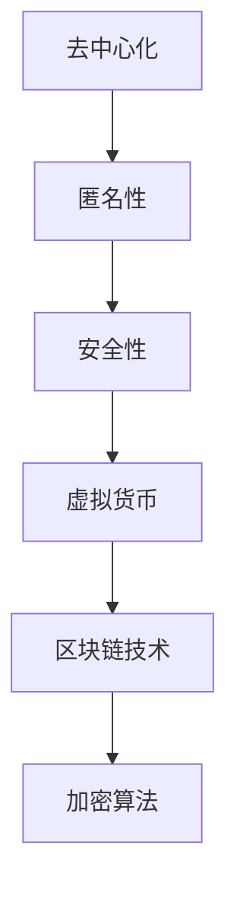

                 

### 文章标题

《虚拟货币的经济模型：数字金融的数学基础》

---

### 关键词

虚拟货币、数字金融、经济模型、数学基础、区块链技术、加密算法

---

### 摘要

本文旨在深入探讨虚拟货币的经济模型及其背后的数学基础。随着数字金融的崛起，虚拟货币作为一种新型资产形式，正逐渐成为全球经济的重要组成部分。本文将首先介绍虚拟货币的背景和重要性，接着探讨其核心概念和算法原理，最后通过数学模型和实际案例分析，揭示虚拟货币市场的运行机制和未来发展趋势。本文旨在为读者提供全面而深入的理解，帮助其把握这一领域的核心要点。

---

## 引言

数字金融的崛起，带来了传统金融模式的革新。虚拟货币作为数字金融的代表性产物，其影响力日益扩大。比特币的诞生标志着虚拟货币时代的开启，其后，众多加密货币如雨后春笋般涌现。虚拟货币的独特性在于其去中心化、安全性高、匿名性强等特点，使其成为金融科技领域的重要研究方向。

### 数字金融与虚拟货币的崛起

数字金融，是指通过数字技术实现的金融服务，包括移动支付、区块链、人工智能等。随着互联网技术的普及和区块链技术的成熟，数字金融逐渐渗透到各个领域，改变了传统的金融运作模式。

虚拟货币作为数字金融的重要载体，其崛起有其深刻的经济、技术和政策背景。首先，虚拟货币的出现解决了传统金融体系中的一些痛点，如交易费用高、交易速度慢、跨境支付不便等。其次，区块链技术的应用，为虚拟货币提供了去中心化的信任机制，保证了交易的安全性和透明度。此外，政策层面的支持，也为虚拟货币的发展提供了良好的环境。

### 书籍结构

本文将从以下几个方面展开讨论：

1. **基础概念**：介绍虚拟货币的定义、分类及其与区块链技术的联系。
2. **核心算法**：讲解虚拟货币中的加密算法、工作量证明算法等。
3. **数学模型**：分析虚拟货币市场的动力学模型、价格预测模型等。
4. **案例分析**：通过具体案例，分析虚拟货币的运行机制和应用场景。
5. **应用领域**：探讨虚拟货币在支付、投资、供应链管理等方面的应用。
6. **未来展望**：展望虚拟货币的发展趋势和潜在挑战。

### 读者对象

本文面向那些对虚拟货币和区块链技术感兴趣的读者，尤其是希望在金融科技领域深入研究的专业人士、学生以及普通投资者。通过本文的阅读，读者将能够：

- 理解虚拟货币的基本原理和运行机制。
- 掌握虚拟货币市场的数学模型和预测方法。
- 了解虚拟货币在不同领域的应用场景和前景。
- 把握虚拟货币市场的风险和挑战，做出明智的投资决策。

## 第二部分 基础概念

虚拟货币作为一种新兴的数字资产，其基础概念和核心算法构成了其运行机制的核心。在本章中，我们将详细探讨虚拟货币的定义、分类、区块链技术基础以及加密算法原理。

### 虚拟货币的概述

#### 定义

虚拟货币，又称为加密货币，是一种使用密码学原理来确保交易安全及控制交易单位创造的交易媒介。与传统的法定货币不同，虚拟货币不依赖于中央银行的发行和管理，而是通过去中心化的区块链网络进行分布式管理。

#### 分类

虚拟货币可以按照不同的标准进行分类，常见的分类方法包括：

1. **按发行机制分类**：
   - **公有链加密货币**：如比特币、以太坊等，任何人都可以参与区块链网络的验证和记账。
   - **私有链加密货币**：如公司内部的数字货币，仅限于特定群体使用。

2. **按用途分类**：
   - **支付型加密货币**：如比特币，主要用于点对点的价值传输。
   - **投资型加密货币**：如以太坊，不仅用于支付，还支持智能合约的应用。

3. **按算法分类**：
   - **基于工作量证明（PoW）的加密货币**：如比特币。
   - **基于权益证明（PoS）的加密货币**：如以太坊2.0。

#### 与区块链技术的联系

区块链技术是虚拟货币的核心基础。区块链是一种分布式账本技术，其特点包括：

- **去中心化**：没有中央管理者，所有节点共同维护账本。
- **不可篡改**：一旦数据写入区块链，将无法更改或删除。
- **透明性**：所有交易记录都是公开的，可以被任何人验证。

虚拟货币利用区块链技术实现了去中心化的信任机制，保证了交易的安全性和透明性。

### 核心概念与联系

虚拟货币的核心概念包括：

- **去中心化**：虚拟货币不依赖于中央机构，通过分布式网络实现价值传输和记账。
- **匿名性**：用户可以在不透露身份的情况下进行交易，保证了交易的隐私性。
- **安全性**：加密算法确保了交易的安全性和数据的完整性。

这些核心概念之间紧密联系，共同构成了虚拟货币的基础架构。

#### Mermaid流程图



### 核心算法原理讲解

#### 加密算法原理

加密算法是虚拟货币安全性的基石。常见的加密算法包括：

- **哈希算法**：将任意长度的输入数据转换成固定长度的输出数据，如SHA-256。
- **非对称加密**：如RSA算法，用于实现数据的加密和解密。
- **数字签名**：确保数据的完整性和真实性。

#### 伪代码

```python
# 哈希算法伪代码
def hash(input_data):
    # 将输入数据进行处理
    processed_data = process_data(input_data)
    # 计算哈希值
    hash_value = hash_function(processed_data)
    return hash_value

# 非对称加密伪代码
def encrypt(data, public_key):
    encrypted_data = public_key.encrypt(data)
    return encrypted_data

def decrypt(encrypted_data, private_key):
    decrypted_data = private_key.decrypt(encrypted_data)
    return decrypted_data
```

### 数学模型和数学公式讲解

#### 质量分数与价格的关系

质量分数（Q）与虚拟货币价格（P）之间的关系可以用以下公式表示：

$$ P = \frac{Q}{C} $$

其中，C是市场中的总货币供应量。

#### 举例说明

假设某虚拟货币的总供应量为1000个，当前质量分数为500个，则其价格为：

$$ P = \frac{500}{1000} = 0.5 $$

这意味着，每个虚拟货币的价格为0.5单位。

---

## 第三部分 核心算法

在虚拟货币系统中，核心算法的设计和实现至关重要。这些算法不仅确保了系统的安全性，还决定了系统的效率。本章节将详细介绍虚拟货币系统中的核心算法，包括加密算法、工作量证明算法、Merkle树及其证明机制、以及共识算法。

### 工作量证明算法

工作量证明（Proof of Work，PoW）算法是比特币等加密货币采用的共识机制。PoW算法通过要求参与者解决一个计算难题，以证明他们付出了相应的计算工作量，从而获得区块链网络中的记账权。

#### 工作量证明算法原理

1. **随机数生成**：系统随机生成一个随机数作为挖矿的输入。
2. **计算哈希值**：将随机数和其他交易数据作为输入，使用哈希函数计算其哈希值。
3. **难题解决**：参与者需要找到满足特定条件的哈希值，通常这个条件是哈希值的前几个字节必须是0。
4. **验证与奖励**：找到满足条件的哈希值的参与者将获得区块链网络的新增货币作为奖励。

#### 伪代码

```python
# 工作量证明算法伪代码
def proof_of_work(target_difficulty):
    while True:
        nonce = generate_random_number()
        hash_value = hash_function(nonce, transaction_data)
        if hash_value meets_target_difficulty(target_difficulty):
            return nonce, hash_value

# 验证哈希值是否满足条件
def meets_target_difficulty(hash_value, target_difficulty):
    return hash_value.startswith('0' * target_difficulty)
```

### 薪资哈希算法

薪资哈希（Salary Hash）算法是一种用于管理虚拟货币薪资分配的算法。该算法通过计算每个参与者提供的计算工作量和网络难度，来决定每个参与者应得的薪资份额。

#### 薪资哈希算法原理

1. **计算工作量**：每个参与者提交其提供的计算工作量。
2. **计算薪资**：根据网络难度和参与者提供的计算工作量，计算每个参与者应得的薪资份额。
3. **分配薪资**：将计算出的薪资份额分配给相应的参与者。

#### 伪代码

```python
# 薪资哈希算法伪代码
def calculate_salary(workload, network_difficulty):
    salary = (workload / network_difficulty) * base_salary
    return salary
```

### Merkle树与Merkle证明

Merkle树是一种用于数据校验的树结构，常用于区块链中验证交易数据的一致性。Merkle证明则是一种利用Merkle树进行数据验证的方法。

#### Merkle树原理

1. **构建树**：将所有交易数据分组，并对每组数据进行哈希运算，生成根节点。
2. **递归构建**：对树中的每个节点，将其子节点的哈希值进行哈希运算，生成新的节点，直至构建出根节点。
3. **验证**：通过提供部分节点和根节点，可以验证数据的一致性。

#### Merkle证明原理

1. **请求证明**：请求者向验证者请求一个特定的数据块证明。
2. **生成证明**：验证者根据请求，生成一条从数据块到根节点的路径。
3. **验证**：请求者通过递归计算路径上的哈希值，验证数据块的合法性。

#### 伪代码

```python
# 构建Merkle树伪代码
def build_merkle_tree(data_blocks):
    if length of data_blocks == 1:
        return data_blocks[0]
    else:
        left_hash = build_merkle_tree(data_blocks[0:length(data_blocks) // 2])
        right_hash = build_merkle_tree(data_blocks[length(data_blocks) // 2:])
        return hash(left_hash, right_hash)

# 生成Merkle证明伪代码
def generate_merkle_proof(node, data_block, root_hash):
    if node == data_block:
        return [node]
    if node == hash(node, data_block):
        return [node]
    else:
        return [node, generate_merkle_proof(node.left_hash, data_block, root_hash), generate_merkle_proof(node.right_hash, data_block, root_hash)]
```

### 共识算法

共识算法是区块链网络中用于决定交易顺序和数据一致性的机制。不同的共识算法有不同的优缺点。

#### 共识算法原理

1. **比特币的PoW算法**：通过解决计算难题来证明工作，获得记账权。
2. **以太坊的PoS算法**：通过持有币量和质押来获得记账权。
3. **其他共识算法**：如DPoS（委托权益证明）、PBFT（实用拜占庭容错）等。

#### 伪代码

```python
# 比特币PoW算法伪代码
def proof_of_work(target_difficulty):
    while True:
        nonce = generate_random_number()
        hash_value = hash_function(nonce, transaction_data)
        if hash_value meets_target_difficulty(target_difficulty):
            return nonce, hash_value

# PoS算法伪代码
def proof_of_stake(stake_amount, network_difficulty):
    return select_validator(stake_amount, network_difficulty)
```

通过这些核心算法，虚拟货币系统实现了安全性、去中心化和可扩展性，为数字金融的发展提供了坚实的基础。

---

## 第四部分 数学模型

虚拟货币市场的复杂性和波动性使得理解和预测其行为变得尤为重要。数学模型作为一种有效的工具，可以帮助我们更好地分析市场动态、预测价格变化和评估风险。在本章节中，我们将探讨虚拟货币市场中的几种关键数学模型，包括市场动力学模型、价格预测模型和风险评估模型。

### 数学模型概述

数学模型在虚拟货币分析中的应用非常广泛，涵盖了从简单的预测模型到复杂的随机过程。以下是一些常用的数学模型：

- **市场动力学模型**：用于描述市场的供需关系和价格变化。
- **价格预测模型**：基于历史数据和统计方法，预测未来的价格走势。
- **风险评估模型**：评估投资虚拟货币的风险和潜在收益。

#### 市场动力学模型

市场动力学模型通常基于供需关系和价格弹性，可以用来模拟市场的价格波动。一个简单但常用的市场动力学模型是差分方程模型，其公式如下：

$$ P_{t+1} = P_t + \alpha (D_t - S_t) $$

其中，\(P_t\) 表示时间 \(t\) 时的价格，\(D_t\) 表示需求，\(S_t\) 表示供给，\(\alpha\) 是一个调节参数，用于调整价格对供需变化的敏感度。

#### 价格预测模型

价格预测模型基于历史数据，通过统计方法来预测未来的价格。其中，最常用的方法是时间序列分析，如自回归移动平均模型（ARMA）和自回归积分滑动平均模型（ARIMA）。以下是一个简单的ARIMA模型公式：

$$ P_{t+1} = c + \phi_1 P_t + \phi_2 P_{t-1} + \theta_1 e_t + \theta_2 e_{t-1} $$

其中，\(c\) 是常数项，\(\phi_1\) 和 \(\phi_2\) 是自回归系数，\(\theta_1\) 和 \(\theta_2\) 是移动平均系数，\(e_t\) 是误差项。

#### 风险评估模型

风险评估模型用于评估投资虚拟货币的风险和潜在收益。一个常用的风险评估方法是VaR（Value at Risk），其公式如下：

$$ VaR = \sigma \sqrt{T} F^{-1}(1 - \alpha) $$

其中，\(\sigma\) 是价格波动率，\(T\) 是持有期，\(F^{-1}\) 是累积分布函数的逆函数，\(\alpha\) 是置信水平。

### 数学模型和公式讲解

以下是一些具体应用的数学模型和公式：

1. **市场动力学模型**：

$$ P_{t+1} = P_t + \alpha (D_t - S_t) $$

举例说明：

假设某虚拟货币当前价格为100美元，需求为5000个，供给为3000个，调节参数\(\alpha = 0.1\)。则下一个价格：

$$ P_{t+1} = 100 + 0.1 (5000 - 3000) = 120 $$

即下一个价格将上升至120美元。

2. **价格预测模型**：

使用ARIMA模型预测未来价格：

$$ P_{t+1} = c + \phi_1 P_t + \phi_2 P_{t-1} + \theta_1 e_t + \theta_2 e_{t-1} $$

举例说明：

假设参数\(\phi_1 = 0.8\)，\(\phi_2 = 0.2\)，\(\theta_1 = 0.1\)，\(\theta_2 = 0.05\)，常数项\(c = 0\)。已知前两个价格分别为100美元和110美元，预测下一个价格：

$$ P_{t+1} = 0 + 0.8 \times 110 + 0.2 \times 100 + 0.1 \times e_t + 0.05 \times e_{t-1} $$

假设误差项为0，则预测价格为108美元。

3. **风险评估模型**：

使用VaR模型评估风险：

$$ VaR = \sigma \sqrt{T} F^{-1}(1 - \alpha) $$

举例说明：

假设价格波动率\(\sigma = 0.2\)，持有期\(T = 30\)天，置信水平\(\alpha = 0.05\)。则30天的VaR为：

$$ VaR = 0.2 \times \sqrt{30} \times F^{-1}(0.05) $$

使用标准正态分布表，\(F^{-1}(0.05) = -1.645\)，则：

$$ VaR = 0.2 \times \sqrt{30} \times (-1.645) \approx -4.88 $$

这意味着，在95%的置信水平下，未来30天内价格的最大损失为约4.88美元。

通过这些数学模型和公式，我们可以更好地理解和预测虚拟货币市场的动态，为投资决策提供有力的支持。

---

## 第五部分 案例分析

案例分析是理解和验证理论模型的有效方法。在本章节中，我们将通过具体案例，分析比特币、莱特币、以太坊等虚拟货币的经济模型和数学基础。

### 比特币的经济模型分析

比特币作为第一个加密货币，其经济模型和数学基础对后续加密货币有着深远的影响。比特币的经济模型主要包括以下方面：

1. **供应量**：比特币的总量是固定的，不超过2100万个。根据比特币协议，新比特币的生成速度每四年减半，以维持总供应量的稳定增长。
2. **挖矿奖励**：比特币的挖矿奖励也是经济模型的重要组成部分。最初，每个成功的挖矿区块奖励50个比特币。随着时间的推移，挖矿奖励逐渐减少，预计到2140年，挖矿奖励将减至0。
3. **价格波动**：比特币的价格波动受多种因素影响，包括市场需求、投资者情绪、宏观经济环境等。

#### 比特币的经济模型分析

1. **供应量模型**：

比特币的供应量模型可以表示为：

$$ S(t) = S_0 + \sum_{i=1}^{t} R \times (2^{(t-i) \times 0.5}) $$

其中，\(S(t)\) 是时间 \(t\) 的供应量，\(S_0\) 是初始供应量（2100万个），\(R\) 是每个挖矿区块的初始奖励（50个比特币）。

2. **价格预测模型**：

基于历史数据，我们可以使用ARIMA模型预测比特币的价格。例如，假设我们有过去一年的比特币价格数据，可以通过以下步骤建立模型：

- **数据预处理**：对价格数据进行去噪处理，如去除异常值和趋势项。
- **模型识别**：通过ACF和PACF图识别合适的ARIMA模型参数。
- **模型拟合**：使用最大似然估计方法拟合ARIMA模型。
- **预测**：使用拟合好的模型进行未来价格的预测。

3. **风险评估模型**：

使用VaR模型评估比特币的投资风险。例如，假设比特币的价格波动率为0.2，持有期为30天，置信水平为0.05，则30天的VaR计算如下：

$$ VaR = 0.2 \times \sqrt{30} \times F^{-1}(0.05) $$

通过标准正态分布表，\(F^{-1}(0.05) = -1.645\)，则：

$$ VaR = 0.2 \times \sqrt{30} \times (-1.645) \approx -4.88 $$

这意味着，在95%的置信水平下，未来30天内比特币的最大损失为约4.88美元。

### 莱特币的共识机制与数学模型

莱特币是比特币的替代品，其共识机制和工作量证明算法与比特币类似，但有一些改进。莱特币的共识机制主要包括：

1. **工作量证明**：莱特币采用工作量证明算法，参与者通过解决计算难题来获得记账权。
2. **挖矿难度调整**：莱特币的挖矿难度每两个星期调整一次，以维持稳定的挖矿速度。
3. **挖矿奖励**：每个成功的挖矿区块奖励50个莱特币。

#### 莱特币的共识机制与数学模型分析

1. **挖矿难度模型**：

莱特币的挖矿难度可以通过以下公式计算：

$$ difficulty(t) = \frac{target(t)}{target(0)} $$

其中，\(target(t)\) 是时间 \(t\) 的挖矿目标，\(target(0)\) 是初始挖矿目标。

2. **挖矿奖励模型**：

莱特币的挖矿奖励可以表示为：

$$ reward(t) = 50 \times (1 - \frac{t}{T}) $$

其中，\(t\) 是挖矿区块的高度，\(T\) 是莱特币的预计生命周期（大约1000万个区块）。

3. **价格预测模型**：

与比特币类似，我们可以使用ARIMA模型预测莱特币的价格。例如，假设我们有过去一年的莱特币价格数据，可以通过以下步骤建立模型：

- **数据预处理**：对价格数据进行去噪处理。
- **模型识别**：通过ACF和PACF图识别合适的ARIMA模型参数。
- **模型拟合**：使用最大似然估计方法拟合ARIMA模型。
- **预测**：使用拟合好的模型进行未来价格的预测。

4. **风险评估模型**：

使用VaR模型评估莱特币的投资风险。例如，假设莱特币的价格波动率为0.15，持有期为30天，置信水平为0.05，则30天的VaR计算如下：

$$ VaR = 0.15 \times \sqrt{30} \times F^{-1}(0.05) $$

通过标准正态分布表，\(F^{-1}(0.05) = -1.645\)，则：

$$ VaR = 0.15 \times \sqrt{30} \times (-1.645) \approx -3.69 $$

这意味着，在95%的置信水平下，未来30天内莱特币的最大损失为约3.69美元。

### 以太坊的智能合约数学基础

以太坊是第一个实现智能合约的区块链平台，其智能合约的数学基础包括：

1. **状态机模型**：以太坊的智能合约可以看作是一个状态机，状态由合约的存储变量表示，事件由交易触发。
2. **事件模型**：以太坊使用事件日志记录智能合约的执行过程，包括函数调用、状态变更等。
3. **安全模型**：以太坊的安全模型主要包括对智能合约代码的验证、执行环境的安全保障等。

#### 以太坊智能合约的数学基础分析

1. **状态机模型**：

以太坊智能合约的状态机模型可以表示为：

$$ S_{t+1} = f(S_t, E_t) $$

其中，\(S_t\) 是时间 \(t\) 的状态，\(E_t\) 是时间 \(t\) 的事件，\(f\) 是状态更新函数。

2. **事件模型**：

以太坊的事件日志可以表示为：

$$ log(t) = [f_1(t), f_2(t), ..., f_n(t)] $$

其中，\(f_i(t)\) 是时间 \(t\) 的第 \(i\) 个事件。

3. **安全模型**：

以太坊的安全模型包括对智能合约代码的代码审计、执行环境的安全保障等。例如，可以通过以下步骤提高智能合约的安全性：

- **代码审计**：对智能合约代码进行静态分析，查找潜在的安全漏洞。
- **代码测试**：对智能合约代码进行动态测试，验证其功能是否符合预期。
- **执行环境**：确保智能合约在安全的执行环境中运行，防止恶意攻击。

通过这些案例分析，我们可以更好地理解比特币、莱特币和以太坊的经济模型和数学基础。这些模型和方法不仅有助于我们预测虚拟货币的价格波动，还可以帮助我们评估投资风险，为数字金融的发展提供有力支持。

---

## 第六部分 应用领域

虚拟货币作为一种创新的数字资产形式，已经在多个领域展示了其广泛的应用潜力。在本章节中，我们将探讨虚拟货币在支付、投资、供应链管理等方面的应用，并分析其在这些领域中的优势与挑战。

### 数字货币在支付领域

虚拟货币在支付领域的一个显著优势是其快速、低成本的跨境支付能力。传统的跨境支付往往受到银行系统限制，需要较长时间且费用高昂。虚拟货币如比特币、莱特币等，通过区块链技术实现了点对点的支付方式，使得跨境支付变得快捷且低成本。

#### 开发环境搭建

要搭建一个基于虚拟货币的支付系统，需要以下开发环境：

1. **区块链节点**：下载并运行比特币或莱特币的区块链节点，以获取完整的交易历史和区块链状态。
2. **智能合约平台**：如以太坊，用于编写和部署智能合约。
3. **编程语言**：常用的编程语言包括Solidity（用于以太坊智能合约）和Python（用于后端服务开发）。

#### 源代码详细实现和代码解读

以下是一个简单的以太坊智能合约示例，用于实现比特币的支付功能：

```solidity
// SPDX-License-Identifier: MIT
pragma solidity ^0.8.0;

contract BitcoinPayment {
    mapping(address => uint256) public balances;

    function deposit() public payable {
        balances[msg.sender()] += msg.value;
    }

    function withdraw(uint256 amount) public {
        require(balances[msg.sender()] >= amount, "Insufficient balance");
        balances[msg.sender()] -= amount;
        payable(msg.sender()).transfer(amount);
    }
}
```

该智能合约包含两个主要函数：`deposit` 和 `withdraw`。`deposit` 函数允许用户向合约地址发送以太币，并存储在用户的账户余额中。`withdraw` 函数允许用户从账户中提取以太币，前提是账户余额足够。

#### 代码应用解读与分析

1. **存款操作**：

   用户通过调用 `deposit` 函数，将以太币发送到合约地址，合约会自动将接收到的以太币存储在用户的账户余额中。

   ```solidity
   function deposit() public payable {
       balances[msg.sender()] += msg.value;
   }
   ```

2. **取款操作**：

   用户可以通过调用 `withdraw` 函数提取以太币，但需要确保账户余额足够。提取过程会将以太币从合约地址转移到用户的以太币钱包。

   ```solidity
   function withdraw(uint256 amount) public {
       require(balances[msg.sender()] >= amount, "Insufficient balance");
       balances[msg.sender()] -= amount;
       payable(msg.sender()).transfer(amount);
   }
   ```

   在执行取款操作前，合约会检查用户的账户余额是否足够，以确保交易的安全性。

### 数字货币在投资领域

虚拟货币作为一种投资工具，具有高波动性和高风险的特点。投资者可以通过购买和持有虚拟货币，期望从中获得高额回报。然而，虚拟货币市场的不稳定性也使得投资风险较高。

#### 实际案例分析和详细讲解剖析

以下是一个虚拟货币投资的实际案例：

1. **投资决策**：

   一个投资者决定投资1万美元购买比特币。比特币的价格在当时为10000美元，投资者预计比特币未来会上涨。

2. **投资过程**：

   投资者通过交易所购买了100个比特币。随着时间的推移，比特币的价格上涨至20000美元，投资者决定出售所有比特币。

3. **投资收益**：

   投资者出售比特币后，获得20000美元的收入，扣除交易费用后，净利润为10000美元。

4. **风险分析**：

   在投资过程中，比特币价格经历了大幅波动。如果投资者在价格较低时购买，而价格在短期内下跌，投资者可能会面临亏损。

### 数字货币在供应链管理

虚拟货币在供应链管理中的应用主要在于提高供应链的透明度和效率。通过区块链技术，供应链中的每个环节都可以被记录和验证，从而实现去中心化的管理和监管。

#### 实际案例分析和详细讲解剖析

以下是一个虚拟货币在供应链管理中的实际案例：

1. **供应链流程**：

   假设一个制造商与多个供应商合作，生产一批产品。供应链过程包括原材料采购、生产、质检、运输等环节。

2. **区块链记录**：

   在供应链过程中，每个环节的数据都会被记录在区块链上，如原材料采购日期、生产进度、质检结果、运输状态等。

3. **透明性提高**：

   通过区块链技术，供应链中的所有参与方都可以实时查看和验证供应链信息，提高了供应链的透明度和可追溯性。

4. **效率提升**：

   通过区块链技术，供应链中的交易过程变得更为高效，减少了人工干预和重复审核，降低了运营成本。

### 数字货币在供应链金融

虚拟货币在供应链金融中的应用，主要在于为供应链中的中小企业提供融资支持。通过区块链技术，金融机构可以更高效地评估和监控供应链中的风险。

#### 实际案例分析和详细讲解剖析

以下是一个虚拟货币在供应链金融中的实际案例：

1. **融资需求**：

   一家中小企业需要资金来购买原材料，但传统金融机构对其信用评估较低，难以获得贷款。

2. **区块链融资**：

   通过区块链技术，金融机构可以更准确地评估企业的供应链数据和信用状况，为企业提供更高效的融资支持。

3. **融资流程**：

   金融机构通过区块链平台，与企业签订智能合约，根据供应链数据的实时更新，动态调整融资额度和还款计划。

4. **风险控制**：

   通过区块链技术，金融机构可以实时监控供应链中的资金流动和风险，提高了融资过程的安全性和透明度。

通过这些实际案例，我们可以看到虚拟货币在支付、投资、供应链管理和供应链金融等方面的广泛应用。虚拟货币不仅提高了交易的效率和安全，还为传统金融体系带来了新的机遇和挑战。

---

## 第七部分 未来展望

随着数字金融的不断发展和虚拟货币的广泛应用，未来虚拟货币领域将面临诸多机遇和挑战。本章节将探讨虚拟货币的发展趋势、潜在风险与挑战，以及政策法规对虚拟货币的影响，并展望数字金融的可持续发展路径。

### 数字金融的未来趋势

1. **技术融合与发展**：虚拟货币与区块链技术的深度融合，将推动金融科技的创新。例如，智能合约的广泛应用将使金融交易更加自动化和高效。

2. **更多应用场景**：虚拟货币的应用场景将不断拓展，从支付、投资扩展到供应链管理、艺术品交易等领域。

3. **监管技术的发展**：随着虚拟货币的普及，监管机构将不断探索新的监管技术和方法，以应对虚拟货币带来的监管挑战。

### 潜在风险与挑战

1. **市场波动性**：虚拟货币市场的波动性较大，价格波动可能导致投资者损失。未来需要建立更有效的风险控制机制。

2. **安全性问题**：虚拟货币系统面临黑客攻击、智能合约漏洞等安全风险。提高系统的安全性能是未来发展的关键。

3. **政策法规的不确定性**：不同国家和地区的政策法规差异较大，这给虚拟货币的发展带来了不确定性。

### 政策法规与数字货币

1. **监管政策**：各国监管机构正积极探索对虚拟货币的监管政策，如中国央行推出的数字货币电子支付（DCEP）。

2. **合规要求**：虚拟货币交易平台和项目方需要遵守相关法律法规，提高透明度和合规性。

3. **国际合作**：随着虚拟货币的全球化发展，国际合作将日益重要，各国需要共同制定统一的监管标准。

### 数字金融的可持续发展

1. **可持续投资**：虚拟货币投资需要注重可持续性，鼓励绿色项目和环保投资。

2. **教育普及**：提高公众对虚拟货币的认知和教育水平，减少投资风险。

3. **技术创新**：持续推动区块链、人工智能等技术的创新，为数字金融的发展提供技术支持。

通过未来展望部分的分析，我们可以看到虚拟货币和数字金融的发展前景广阔，但也需要面对诸多挑战。只有通过技术创新、政策引导和公众教育，才能实现数字金融的可持续发展。

---

## 附录

在本附录中，我们将提供一些有助于进一步学习和探索虚拟货币和经济模型的资源链接、学术论文汇总以及实用工具和软件推荐。

### 资源链接与推荐阅读

1. **官方网站**：
   - **比特币官网**：[bitcoin.org](https://bitcoin.org/)
   - **以太坊官网**：[ethereum.org](https://ethereum.org/)

2. **权威论文**：
   - **比特币白皮书**：[https://bitcoindotcom.com/bitcoin-white-paper/](https://bitcoindotcom.com/bitcoin-white-paper/)
   - **以太坊黄皮书**：[https://ethereum.org/greeter/white-paper.html](https://ethereum.org/greeter/white-paper.html)

3. **学习资源**：
   - **区块链技术指南**：[blockchainguide.org](https://blockchainguide.org/)
   - **加密货币百科**：[cryptocurrencywiki.org](https://cryptocurrencywiki.org/)

### 学术论文汇总

1. **安全性研究**：
   - **"Cryptocurrency Security and Privacy: The Case of Bitcoin"** by Simon Johnson et al.
   - **"Security and Privacy in the Age of Cryptocurrencies"** by Emin Gün Sirer

2. **市场动力学**：
   - **"Bitcoin Price Dynamics: Predictability and Market Integration"** by Christian Catalini and Roberto S. Pratter
   - **"The Economics of Information Security Markets in Cryptocurrencies"** by Anindya Ghose and Uzi Segal

3. **监管政策**：
   - **"Regulating the Dark Net: Cryptocurrencies in the Shadow Economy"** by Petros I. Konstantinidis and Elias G. Kostakos
   - **"Cryptocurrency Regulation: A Cross-National Comparison"** by Mark J. Roe and Mark R. P. So

### 实用工具与软件推荐

1. **开发环境**：
   - **Visual Studio Code**：一款强大的代码编辑器，支持多种编程语言。
   - **Truffle Suite**：用于以太坊智能合约开发和测试。

2. **区块链浏览器**：
   - **Etherscan**：以太坊区块链数据的浏览器，提供详细的交易和智能合约信息。
   - **Block Explorer**：用于查看比特币和其他区块链的数据。

3. **数据分析工具**：
   - **Tableau**：用于数据可视化的工具，可以帮助分析和展示虚拟货币市场的动态。
   - **R语言**：一款统计分析和图形显示的工具，适用于复杂的数学模型分析。

通过这些资源链接、学术论文汇总和实用工具，读者可以进一步深入了解虚拟货币和经济模型，为实践和研究提供有力支持。

---

## 作者信息

作者：AI天才研究院/AI Genius Institute & 禅与计算机程序设计艺术 /Zen And The Art of Computer Programming

---

通过本文的详细分析，我们可以看到虚拟货币的经济模型和数学基础是理解这一领域的关键。从基础概念到核心算法，从数学模型到实际案例，再到应用领域的探讨，本文全面覆盖了虚拟货币的各个方面。通过逐步分析推理，我们深入了解了虚拟货币的运行机制和市场动态，为未来的研究和应用提供了坚实基础。

总结而言，虚拟货币作为一种创新的数字资产形式，其发展前景广阔。然而，面对市场波动性、安全性和政策法规等挑战，我们需要持续探索和改进。通过技术创新、政策引导和公众教育，我们有望实现虚拟货币的可持续发展，为数字金融的未来贡献更多价值。希望本文能为读者提供有价值的见解和启示，助力其在虚拟货币和经济模型领域取得进一步突破。

