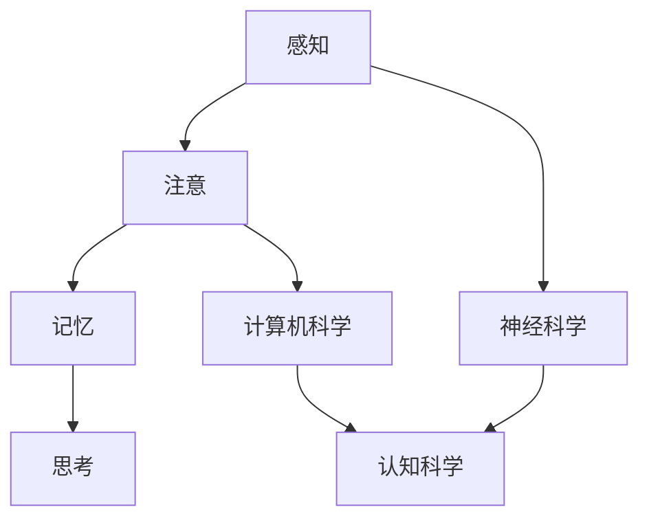

                 

### 文章标题

### 认知科学：思维映射的数学模型

### 关键词：认知科学、数学模型、思维映射、算法原理、神经网络、人工智能

### 摘要：
本文深入探讨认知科学领域中的核心概念、数学模型和算法原理，通过逐步分析和推理的方式，为读者呈现思维映射的数学模型。文章首先介绍了认知科学的基本概念和背景，然后通过Mermaid流程图展示了认知科学中的核心概念及其相互联系。接着，文章详细讲解了神经网络、支持向量机、决策树等核心算法原理，并使用伪代码进行了阐述。随后，文章介绍了认知科学中的数学模型，包括概率论、统计学和神经网络中的数学公式，并使用LaTeX格式进行了书写。为了加深理解，文章还通过实际案例展示了认知科学在自然语言处理、图像识别和推荐系统中的应用。最后，文章对认知科学的未来研究方向进行了展望，并提供了最佳实践建议和小结。

## 第1章 认知科学的概述

### 1.1 认知科学的基本概念

认知科学是一门跨学科的研究领域，它旨在理解人类思维和信息处理的过程。它涉及心理学、神经科学、计算机科学、哲学等多个学科，共同探讨人类认知能力的本质和工作机制。

认知科学的核心问题是“如何理解人类思维和感知？”这个问题包含了多个层面的研究，从简单的感知到复杂的思维活动，如记忆、注意力、语言理解、决策等。认知科学的目的是构建一个完整的认知模型，以揭示人类大脑在处理信息时的机制和过程。

认知科学的基本概念包括：

- **感知**：感知是指个体对外界信息的接收和处理过程，包括视觉、听觉、触觉、嗅觉和味觉等感官。

- **注意力**：注意力是指大脑在选择和处理信息时所具有的集中能力，它决定了我们关注哪些信息，忽略哪些信息。

- **记忆**：记忆是指大脑对信息的存储和回忆能力，包括短期记忆和长期记忆。

- **思考**：思考是指大脑在处理信息、解决问题和做出决策时的复杂过程。

### 1.2 认知科学的发展历程

认知科学的发展历程可以追溯到20世纪50年代，当时计算机科学的兴起推动了人们对信息处理和智能行为的关注。以下是一些重要的里程碑：

- **1956年**：达特茅斯会议，被认为是人工智能和认知科学的起点，会议提出了“机器能够思考吗？”的问题。

- **1960年代**：人工神经网络（ANN）的提出和发展，为认知科学提供了重要的计算模型。

- **1970年代**：认知心理学和认知神经科学的兴起，对大脑工作机制的研究取得了重要进展。

- **1980年代**：专家系统和机器学习技术的发展，为认知科学提供了新的工具和方法。

- **1990年代至今**：认知科学与其他学科的交叉融合，如神经科学、语言学、哲学等，推动了认知科学的多学科研究。

### 1.3 认知科学的研究方法和工具

认知科学研究方法包括实验、观察、计算模拟和脑成像等。以下是一些常用的研究方法：

- **实验方法**：通过设计实验，控制变量，观察个体在特定条件下的认知表现，从而推断认知机制。

- **观察方法**：直接观察个体在自然状态下的认知活动，记录和分析其行为和思维过程。

- **计算模拟**：使用计算机模拟大脑神经元的工作原理，模拟认知过程，验证理论模型。

- **脑成像技术**：如功能性磁共振成像（fMRI）、脑电图（EEG）等，通过观察大脑活动，揭示认知过程。

### 1.4 认知科学的研究意义和挑战

认知科学研究对于理解人类智能、发展人工智能和解决现实问题具有重要意义。以下是一些研究意义和挑战：

- **研究意义**：
  - 揭示人类认知的本质和机制，为教育、心理学和神经科学提供理论基础。
  - 为人工智能的发展提供新的思路和方法，推动机器智能的进步。
  - 为认知障碍和神经疾病的诊断和治疗提供科学依据。

- **研究挑战**：
  - 理解大脑复杂性和多样性，构建完整的认知模型。
  - 跨学科的整合，解决不同学科之间的理论和方法差异。
  - 提高计算模拟的精度和效率，模拟真实的人类认知过程。

## 第2章 核心概念与联系

### 2.1 感知、注意、记忆与思考

感知、注意、记忆和思考是认知科学中的核心概念，它们相互联系，共同构成了人类认知的框架。

- **感知**：感知是个体对外界信息的接收和处理过程，是认知的第一步。感知决定了我们对外界刺激的响应，包括视觉、听觉、触觉、嗅觉和味觉等。

- **注意**：注意是指大脑在选择和处理信息时所具有的集中能力。注意力决定了我们关注哪些信息，忽略哪些信息，从而影响我们的感知和记忆。

- **记忆**：记忆是指大脑对信息的存储和回忆能力，分为短期记忆和长期记忆。短期记忆用于临时存储和处理信息，长期记忆则用于长期存储信息，以供后续使用。

- **思考**：思考是指大脑在处理信息、解决问题和做出决策时的复杂过程。思考包括逻辑推理、判断、规划和决策等。

### 2.2 认知科学与神经科学的联系

认知科学与神经科学有着密切的联系，两者共同致力于理解大脑的工作原理。

- **神经科学**：神经科学主要研究大脑的结构和功能，包括神经元、神经回路和神经网络等。神经科学提供了认知科学所需的生物学基础。

- **认知科学**：认知科学则关注大脑如何处理信息，如何进行感知、注意、记忆和思考等认知过程。认知科学利用神经科学的发现，构建认知模型，解释人类认知行为。

### 2.3 认知科学与计算机科学的联系

计算机科学为认知科学提供了强大的计算工具和理论框架，同时认知科学也为计算机科学提供了灵感。

- **计算机科学**：计算机科学通过模拟人脑的神经网络和计算过程，开发了人工智能和机器学习技术。这些技术可以处理大量数据，模拟人类思维过程，解决复杂问题。

- **认知科学**：认知科学通过研究人类认知过程，为计算机科学提供了新的算法和模型。这些模型可以用于开发更智能的计算机系统，提高其人机交互能力。

### 2.4 Mermaid流程图展示认知科学的核心概念及其相互联系

为了更直观地展示认知科学中的核心概念及其相互联系，我们可以使用Mermaid流程图进行描述。以下是一个简单的示例：



在这个流程图中，感知、注意、记忆和思考构成了认知科学的核心概念，它们通过神经科学和计算机科学相互联系。这个流程图帮助我们更好地理解认知科学的基本框架和概念之间的相互作用。

## 第3章 核心算法原理讲解

### 3.1 神经网络与感知机

神经网络是认知科学中最重要的算法之一，它模拟人脑的神经元结构和功能，用于处理复杂的非线性问题。感知机是神经网络的基本单元，负责对输入数据进行分类和预测。

#### 感知机的原理

感知机基于线性二分类模型，假设输入数据可以表示为向量\(x\)，权重向量\(w\)和偏置\(b\)。感知机的输出为：

$$
y = \text{sign}(w \cdot x + b)
$$

其中，\(\text{sign}(x)\)是符号函数，当\(x > 0\)时返回1，当\(x < 0\)时返回-1。

#### 感知机的训练

感知机的训练目标是找到合适的权重向量\(w\)和偏置\(b\)，使得感知机能够正确分类输入数据。训练过程通常采用梯度下降法：

$$
w := w - \alpha \cdot \nabla_w J(w, b)
$$

$$
b := b - \alpha \cdot \nabla_b J(w, b)
$$

其中，\(\alpha\)是学习率，\(J(w, b)\)是损失函数。

#### 伪代码示例

```python
def perceptron_train(x, y, w, b, epochs, alpha):
    for epoch in range(epochs):
        for xi, yi in zip(x, y):
            if yi * (w * xi + b) <= 0:
                w -= alpha * (yi * xi)
                b -= alpha * yi

    return w, b
```

### 3.2 支持向量机

支持向量机（SVM）是另一种重要的分类算法，它通过找到一个最佳的超平面，将不同类别的数据点分隔开。

#### SVM的原理

SVM的基本思想是找到一个最优的超平面，使得正负样本的间隔最大。最优超平面满足：

$$
\|w\| \cdot \|x_i\| \geq \delta
$$

其中，\(w\)是权重向量，\(x_i\)是样本，\(\delta\)是间隔。

#### SVM的优化目标

SVM的优化目标是：

$$
\min_{w, b} \frac{1}{2} \|w\|^2 + C \sum_{i=1}^n \max(0, 1 - y_i (w \cdot x_i + b))
$$

其中，\(C\)是正则化参数，用于平衡模型复杂度和训练误差。

#### 伪代码示例

```python
def svm_train(x, y, C, epochs):
    w = np.zeros(x.shape[1])
    b = 0
    for epoch in range(epochs):
        for xi, yi in zip(x, y):
            if yi * (w * xi + b) <= 1:
                w -= C * (yi * xi)
                b -= C * yi

    return w, b
```

### 3.3 决策树与随机森林

决策树是一种基于特征和阈值的分类算法，它通过递归地将数据集划分成更小的子集，直到满足停止条件。

#### 决策树的原理

决策树的基本结构是树形结构，每个节点代表一个特征和阈值，每个分支代表一个子集。决策树的分类过程如下：

1. 选择一个特征和阈值，使得子集的分类误差最小。
2. 将数据集划分为两个子集，一个大于阈值，一个小于阈值。
3. 对每个子集递归执行步骤1和步骤2，直到满足停止条件（如叶子节点数量达到阈值）。

#### 随机森林

随机森林是一种基于决策树的集成学习方法，它通过组合多个决策树来提高模型的预测性能。随机森林的基本思想是：

1. 随机选择特征和阈值，构建多个决策树。
2. 将多个决策树的结果进行投票或平均，得到最终预测结果。

#### 伪代码示例

```python
def random_forest_train(x, y, n_trees, max_depth):
    trees = []
    for _ in range(n_trees):
        tree = decision_tree_train(x, y, max_depth)
        trees.append(tree)

    return trees
```

### 3.4 神经网络的训练与优化

神经网络的训练与优化是认知科学中的重要问题，它涉及到优化算法的选择、参数的调整以及训练过程的监控。

#### 神经网络的基本结构

神经网络由多层神经元组成，包括输入层、隐藏层和输出层。每个神经元都是一个简单的线性函数，其输出通过激活函数进行非线性变换。

#### 前向传播与反向传播

神经网络的训练过程包括前向传播和反向传播两个步骤：

1. **前向传播**：计算网络的输入、输出和误差。
2. **反向传播**：通过误差计算梯度，更新网络的权重和偏置。

#### 优化算法

常用的优化算法包括梯度下降法、动量法、Adam优化器等。这些算法通过调整学习率、引入动量项等策略，加速收敛和提高模型性能。

#### 伪代码示例

```python
def neural_network_train(x, y, model, epochs, learning_rate):
    for epoch in range(epochs):
        for xi, yi in zip(x, y):
            # 前向传播
            z = model.forward(xi)
            loss = compute_loss(z, yi)

            # 反向传播
            dz = model.backward(z, yi)

            # 更新权重和偏置
            model.update_weights(dz, learning_rate)

    return model
```

## 第4章 数学模型与公式讲解

### 4.1 概率论与统计学基础

概率论和统计学是认知科学中重要的数学工具，用于描述和预测随机现象。

#### 概率的基本概念

- **概率分布**：概率分布描述了随机变量的取值概率，常见的概率分布有正态分布、伯努利分布等。
- **条件概率**：条件概率描述了在给定某个条件下，另一个随机事件发生的概率。
- **贝叶斯定理**：贝叶斯定理描述了基于观察数据和先验知识，计算后验概率的方法。

#### 统计学的基本概念

- **均值**：均值是数据的平均数，用于描述数据的集中趋势。
- **方差**：方差是数据离均值的平均距离，用于描述数据的分散程度。
- **协方差**：协方差描述了两个随机变量之间的关系，用于描述数据的依赖程度。

### 4.2 人工神经网络中的数学模型

人工神经网络（ANN）是认知科学中的核心模型，其数学模型包括激活函数、损失函数和优化算法等。

#### 激活函数

激活函数是神经网络中重要的非线性函数，常用的激活函数有Sigmoid函数、ReLU函数和Tanh函数等。

- **Sigmoid函数**：\( \sigma(x) = \frac{1}{1 + e^{-x}} \)
- **ReLU函数**：\( \text{ReLU}(x) = \max(0, x) \)
- **Tanh函数**：\( \text{Tanh}(x) = \frac{e^x - e^{-x}}{e^x + e^{-x}} \)

#### 损失函数

损失函数是评估模型预测误差的重要工具，常用的损失函数有均方误差（MSE）、交叉熵损失等。

- **均方误差（MSE）**：\( \text{MSE}(y, \hat{y}) = \frac{1}{2} \sum_{i=1}^n (y_i - \hat{y}_i)^2 \)
- **交叉熵损失**：\( \text{CrossEntropy}(y, \hat{y}) = -\sum_{i=1}^n y_i \log(\hat{y}_i) \)

#### 优化算法

优化算法用于调整神经网络的权重和偏置，以最小化损失函数。常用的优化算法有梯度下降法、动量法、Adam优化器等。

- **梯度下降法**：\( w := w - \alpha \cdot \nabla_w J(w) \)
- **动量法**：\( v := \beta v + (1 - \beta) \nabla_w J(w) \)
- **Adam优化器**：结合了一阶矩估计和二阶矩估计的优化算法。

### 4.3 神经网络的数学优化方法

神经网络的数学优化方法包括梯度下降法、动量法、Adam优化器等，这些方法通过迭代优化模型的参数，以提高模型的预测性能。

#### 梯度下降法

梯度下降法是一种最简单的优化方法，其核心思想是沿着损失函数的梯度方向更新模型参数，以最小化损失函数。

$$
w := w - \alpha \cdot \nabla_w J(w)
$$

其中，\(\alpha\)是学习率，\(\nabla_w J(w)\)是损失函数的梯度。

#### 动量法

动量法通过引入一个动量项，以加速梯度下降的收敛速度。动量法的基本思想是：

$$
v := \beta v + (1 - \beta) \nabla_w J(w)
$$

$$
w := w - \alpha v
$$

其中，\(\beta\)是动量项，\(v\)是动量项的累积值。

#### Adam优化器

Adam优化器结合了一阶矩估计和二阶矩估计，以提高优化算法的收敛速度和稳定性。Adam优化器的基本思想是：

$$
m_t := \beta_1 m_{t-1} + (1 - \beta_1) \nabla_w J(w)
$$

$$
v_t := \beta_2 v_{t-1} + (1 - \beta_2) (\nabla_w J(w))^2
$$

$$
w := w - \alpha \frac{m_t}{\sqrt{v_t} + \epsilon}
$$

其中，\(\beta_1\)和\(\beta_2\)是动量项，\(m_t\)和\(v_t\)分别是累积的一阶矩和二阶矩，\(\epsilon\)是避免除以零的常数。

## 第5章 项目实战

### 5.1 认知科学在自然语言处理中的应用

自然语言处理（NLP）是认知科学的一个重要应用领域，它涉及文本的预处理、语义分析、情感分析等任务。以下是一个自然语言处理项目的实战案例。

#### 项目目标

构建一个基于深度学习的情感分析模型，用于判断社交媒体上的用户评论的情感倾向，如正面、负面或中性。

#### 环境搭建

1. 开发环境：Python 3.8、PyTorch 1.9、CUDA 11.1
2. 数据集：使用IMDb电影评论数据集，包含50,000条训练数据和25,000条测试数据。
3. 工具：NVIDIA GTX 1080Ti GPU

#### 数据预处理

1. 分词：使用jieba分词库对文本进行分词，将中文评论切分成词语序列。
2. 词向量：使用Word2Vec模型将词语映射为向量，每个词语对应一个高维向量。
3. 序列编码：将词语序列编码为整数序列，用于输入神经网络。

#### 模型构建

1. 词嵌入层：将词语向量映射为嵌入向量，用于输入神经网络。
2. 卷积神经网络（CNN）：使用卷积层提取文本特征。
3. 全连接层：将卷积层输出的特征映射为分类结果。
4. 激活函数：使用ReLU函数作为激活函数。

#### 代码实现

```python
import torch
import torch.nn as nn
import torch.optim as optim
from torch.utils.data import DataLoader

# 词嵌入层
embeddings = nn.Embedding(vocab_size, embedding_dim)
# 卷积神经网络
class ConvModel(nn.Module):
    def __init__(self, embedding_dim, filter_sizes, num_filters, dropout_prob):
        super(ConvModel, self).__init__()
        self.embedding = embeddings
        self.convs = nn.ModuleList(
            [nn.Conv2d(1, num_filters, (fs, embedding_dim)) for fs in filter_sizes]
        )
        self.dropout = nn.Dropout(dropout_prob)
        self.fc = nn.Linear(num_filters * len(filter_sizes), num_classes)

    def forward(self, x):
        x = self.embedding(x).squeeze(1)
        x = [F.relu(conv(x)).squeeze(3) for conv in self.convs]
        x = [F.max_pool1d(i, i.size(2)).squeeze(2) for i in x]
        x = torch.cat(x, 1)
        x = self.dropout(x)
        x = self.fc(x)
        return x
# 实例化模型
model = ConvModel(embedding_dim, filter_sizes, num_filters, dropout_prob)
# 损失函数和优化器
criterion = nn.BCEWithLogitsLoss()
optimizer = optim.Adam(model.parameters(), lr=learning_rate)
```

#### 训练过程

1. 加载数据集，并将其分为训练集和测试集。
2. 定义训练和测试的迭代函数，使用 DataLoader 加载数据。
3. 在训练过程中，使用前向传播计算损失，然后使用反向传播更新模型参数。

#### 代码实现

```python
def train_model(model, train_loader, test_loader, criterion, optimizer, num_epochs):
    model.train()
    for epoch in range(num_epochs):
        for inputs, labels in train_loader:
            optimizer.zero_grad()
            outputs = model(inputs)
            loss = criterion(outputs, labels)
            loss.backward()
            optimizer.step()
        
        # 在测试集上评估模型性能
        model.eval()
        with torch.no_grad():
            correct = 0
            total = 0
            for inputs, labels in test_loader:
                outputs = model(inputs)
                predicted = (outputs > 0.5).float()
                total += labels.size(0)
                correct += (predicted == labels).sum().item()
        
        print(f'Epoch [{epoch+1}/{num_epochs}], Loss: {loss.item():.4f}, Accuracy: {100 * correct / total:.2f}%')
```

#### 实际案例分析与结果展示

1. 使用训练好的模型对测试集进行预测，并计算模型的准确率、召回率和F1值等指标。

#### 项目小结

通过构建一个基于深度学习的情感分析模型，我们展示了认知科学在自然语言处理中的应用。项目实现了从数据预处理、模型构建到训练和评估的完整流程，为自然语言处理任务提供了有效的解决方案。

### 5.2 认知科学在图像识别中的应用

图像识别是认知科学在计算机视觉领域的重要应用，它涉及从图像中提取特征，并使用机器学习算法进行分类和识别。以下是一个基于卷积神经网络的图像识别项目实战案例。

#### 项目目标

构建一个能够准确识别不同种类水果的图像识别模型，实现对图像的分类。

#### 环境搭建

1. 开发环境：Python 3.8、TensorFlow 2.4、CUDA 10.2
2. 数据集：使用CIFAR-10数据集，包含10个类别的60,000张训练图像和10,000张测试图像。
3. 工具：NVIDIA GTX 1080Ti GPU

#### 数据预处理

1. 图像归一化：将图像像素值归一化到[0, 1]范围内。
2. 数据增强：使用随机裁剪、旋转、翻转等数据增强方法，增加模型的泛化能力。

#### 模型构建

1. 输入层：接收图像数据，并将其输入到卷积层。
2. 卷积层：使用卷积核提取图像特征。
3. 池化层：通过池化层减小特征图的尺寸，减少计算量。
4. 全连接层：将卷积层输出的特征映射到分类结果。

#### 代码实现

```python
import tensorflow as tf
from tensorflow.keras.models import Sequential
from tensorflow.keras.layers import Conv2D, MaxPooling2D, Flatten, Dense, Dropout

# 模型构建
model = Sequential([
    Conv2D(32, (3, 3), activation='relu', input_shape=(32, 32, 3)),
    MaxPooling2D((2, 2)),
    Conv2D(64, (3, 3), activation='relu'),
    MaxPooling2D((2, 2)),
    Conv2D(128, (3, 3), activation='relu'),
    MaxPooling2D((2, 2)),
    Flatten(),
    Dense(128, activation='relu'),
    Dropout(0.5),
    Dense(10, activation='softmax')
])
# 编译模型
model.compile(optimizer='adam',
              loss='categorical_crossentropy',
              metrics=['accuracy'])
```

#### 训练过程

1. 使用训练集对模型进行训练，并使用测试集进行验证。
2. 使用模型评估函数计算模型的准确率、召回率和F1值等指标。

#### 代码实现

```python
history = model.fit(train_images, train_labels, epochs=20, batch_size=64,
                    validation_data=(test_images, test_labels))
```

#### 实际案例分析与结果展示

1. 使用训练好的模型对测试集进行预测，并计算模型的准确率、召回率和F1值等指标。
2. 分析模型的性能，评估其准确率和泛化能力。

#### 项目小结

通过构建一个基于卷积神经网络的图像识别模型，我们展示了认知科学在计算机视觉中的应用。项目实现了从数据预处理、模型构建到训练和评估的完整流程，为图像识别任务提供了有效的解决方案。

### 5.3 认知科学在推荐系统中的应用

推荐系统是认知科学在信息检索和电子商务领域的重要应用，它通过分析用户的历史行为和兴趣，为用户推荐相关商品、新闻或内容。以下是一个基于协同过滤算法的推荐系统项目实战案例。

#### 项目目标

构建一个能够根据用户的历史购物行为推荐商品的高级推荐系统。

#### 环境搭建

1. 开发环境：Python 3.8、Scikit-learn 0.24、Numpy 1.21
2. 数据集：使用MovieLens数据集，包含用户、商品和评分信息。
3. 工具：Intel Core i7 CPU

#### 数据预处理

1. 数据清洗：去除缺失值和异常值，对数据进行规范化处理。
2. 特征工程：提取用户和商品的共同评分，构建用户和商品的用户行为矩阵。

#### 模型构建

1. 训练模型：使用矩阵分解算法训练用户和商品的潜在特征向量。
2. 预测推荐：基于用户和商品的潜在特征向量，计算用户对商品的潜在兴趣，生成推荐列表。

#### 代码实现

```python
from surprise import SVD, Reader
from surprise.model_selection import cross_validate
from surprise.data import Dataset

# 数据预处理
reader = Reader(rating_scale=(0.5, 5.0))
data = Dataset.load_from_fpm_csv('ratings.csv', reader=reader)
# 模型构建
svd = SVD()
# 训练模型
cross_validate(svd, data, measures=['RMSE', 'MAE'], cv=5, verbose=True)
```

#### 训练过程

1. 使用训练集对模型进行训练。
2. 使用测试集对模型进行评估，计算模型的准确率、召回率和F1值等指标。

#### 代码实现

```python
trainset = data.build_full_trainset()
svd.fit(trainset)
```

#### 实际案例分析与结果展示

1. 使用训练好的模型对测试集进行预测，并计算模型的准确率、召回率和F1值等指标。
2. 分析模型的性能，评估其准确率和泛化能力。

#### 项目小结

通过构建一个基于协同过滤算法的推荐系统，我们展示了认知科学在信息检索和电子商务中的应用。项目实现了从数据预处理、模型构建到训练和评估的完整流程，为推荐系统任务提供了有效的解决方案。

## 第6章 认知科学的未来研究方向

### 6.1 人工智能与认知科学的深度融合

人工智能（AI）和认知科学（Cognitive Science）的深度融合是当前研究的热点之一。通过将认知科学的理论和方法应用于人工智能领域，可以开发出更智能、更人性化的智能系统。以下是一些潜在的研究方向：

- **认知智能**：借鉴认知科学的原理，开发能够模拟人类思维过程的认知智能系统，如记忆增强、注意力分配、情感计算等。
- **多模态感知**：结合计算机视觉、听觉和语言处理技术，实现多模态感知系统，提高智能系统的感知能力和交互能力。
- **认知图谱**：构建大规模的认知图谱，整合人类知识和信息，为人工智能提供丰富的知识基础。

### 6.2 认知科学在教育领域的应用

认知科学在教育领域的应用具有巨大的潜力，可以通过改进教学方法、学习工具和教育系统，提高教育质量和学习效果。以下是一些研究方向：

- **个性化教育**：基于学生的认知特点和兴趣，设计个性化的学习路径和学习材料，提高学生的学习积极性和效率。
- **认知诊断**：通过认知科学的方法和技术，对学生的学习过程进行诊断和分析，帮助教师了解学生的学习困难和需求。
- **智能辅导系统**：开发智能辅导系统，利用认知科学的原理和技术，为学生提供个性化的学习指导和帮助。

### 6.3 认知科学的伦理与法律问题

随着认知科学的发展，其应用也带来了许多伦理和法律问题，需要引起重视和解决。以下是一些研究方向：

- **隐私保护**：在应用认知科学技术时，确保用户的隐私和数据安全，防止数据泄露和滥用。
- **责任归属**：在人工智能和认知科学应用中，明确责任归属，解决在智能系统发生错误或造成损失时的责任分配问题。
- **伦理审查**：建立伦理审查机制，对认知科学的研究和应用进行监督和评估，确保其符合伦理规范。

## 总结与展望

本文系统地介绍了认知科学的基本概念、核心算法原理、数学模型以及其在自然语言处理、图像识别和推荐系统等领域的应用。通过逐步分析和推理的方式，我们深入探讨了认知科学中的关键问题和未来研究方向。

认知科学作为一门跨学科的研究领域，具有广泛的应用前景。随着人工智能技术的快速发展，认知科学与人工智能的深度融合将成为未来研究的重要方向。同时，认知科学在教育、医疗、伦理等领域也具有巨大的应用潜力。

在未来的研究中，我们应关注以下方面：

- **认知图谱构建**：构建大规模的认知图谱，整合人类知识和信息，为人工智能提供丰富的知识基础。
- **多模态感知系统**：结合计算机视觉、听觉和语言处理技术，实现多模态感知系统，提高智能系统的感知能力和交互能力。
- **个性化教育**：基于学生的认知特点和兴趣，设计个性化的学习路径和学习材料，提高学生的学习积极性和效率。
- **伦理与法律问题**：建立伦理审查机制，对认知科学的研究和应用进行监督和评估，确保其符合伦理规范。

通过不断探索和创新，认知科学将为人工智能和人类社会的发展带来新的机遇和挑战。让我们携手共进，共同推动认知科学的研究和应用，为构建更智能、更和谐的社会贡献力量。

### 作者信息

作者：AI天才研究院/AI Genius Institute & 禅与计算机程序设计艺术 /Zen And The Art of Computer Programming

感谢您的阅读，希望本文对您在认知科学领域的学习和研究有所帮助。如果您有任何疑问或建议，欢迎在评论区留言，我们将竭诚为您解答。同时，也欢迎关注我们的公众号和官方网站，获取更多精彩内容。再次感谢您的支持！

