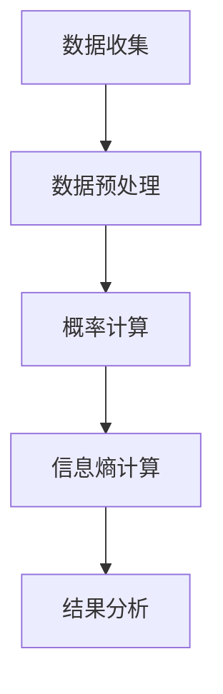
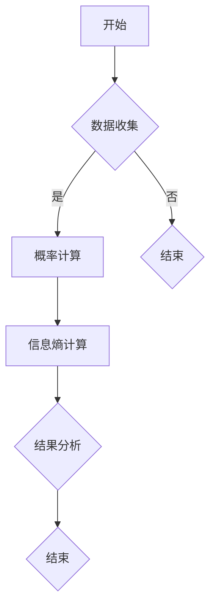

                 

### 步骤1：分析书名和主题

《语言多样性的信息熵：文化丰富度的数学度量》这本书的标题直接揭示了其核心内容，即通过信息熵这一数学工具来度量语言多样性和文化丰富度。首先，我们分析标题中的两个关键概念：

**语言多样性**：这指的是语言种类的丰富程度，包括不同的语言方言、口音和语言变体。语言多样性不仅反映了一个社会的文化多样性，还具有社会、经济和教育等多方面的重要价值。

**信息熵**：信息熵是信息论中的一个概念，用于度量信息的不确定性。在数学上，信息熵通常用对数函数来表示，其基本公式是 \( H = -\sum p(x) \log_2 p(x) \)，其中 \( p(x) \) 是每个可能信息的概率。

**文化丰富度**：这是一个较为宽泛的概念，指的是一个社会或地区内的文化多样性和文化价值的丰富程度。文化丰富度可以通过多个维度来度量，如语言、艺术、宗教、传统习俗等。

通过信息熵来度量文化丰富度，实际上是将复杂的社会现象转化为可量化的数学模型，从而使我们能够更精确地理解和分析文化多样性的程度。因此，本书的目标是通过数学方法，揭示语言多样性和文化丰富度之间的关系，并探索其在现实世界中的应用。

### 步骤2：确定目录结构

为了使读者能够清晰地理解书中的内容，我们首先需要设计一个合理的目录结构。以下是一个初步的目录结构：

#### 第一部分：引言与背景

1. **第1章：语言多样性的概念及其重要性**
   - **1.1 语言多样性的定义与范围**
   - **1.2 语言多样性的社会、文化及经济价值**

2. **第2章：信息熵的概念与数学基础**
   - **2.1 信息熵的定义与历史**
   - **2.2 信息熵的数学公式与推导**
   - **2.3 信息熵的应用领域**

3. **第3章：语言多样性与信息熵的关系**
   - **3.1 语言多样性与信息熵的联系**
   - **3.2 语言多样性的信息熵度量方法**

#### 第二部分：核心概念与联系

4. **第4章：文化丰富度的定义与度量**
   - **4.1 文化丰富度的概念与要素**
   - **4.2 文化丰富度的数学模型**
   - **4.3 文化丰富度的信息熵度量**

5. **第5章：信息熵与语言多样性研究的Mermaid流程图**
   - **5.1 信息熵在语言多样性研究中的应用**
   - **5.2 Mermaid流程图绘制**

#### 第三部分：数学模型与算法

6. **第6章：数学模型与算法介绍**
   - **6.1 相关数学公式与推导**
   - **6.2 信息熵计算算法**
   - **6.3 文化丰富度计算算法**

7. **第7章：伪代码与算法实现**
   - **7.1 伪代码描述**
   - **7.2 算法实现步骤**

#### 第四部分：文化丰富度度量

8. **第8章：文化丰富度度量方法**
   - **8.1 基于信息熵的文化丰富度度量方法**
   - **8.2 其他文化丰富度度量方法**

9. **第9章：文化丰富度度量案例分析**
   - **9.1 案例一：某地区的语言多样性分析**
   - **9.2 案例二：全球语言多样性对比分析**

#### 第五部分：实际应用与案例研究

10. **第10章：实际应用背景与场景**
    - **10.1 文化多样性评估**
    - **10.2 语言政策制定**
    - **10.3 文化产业发展**

11. **第11章：案例研究**
    - **11.1 案例一：某语言多样性项目的实施与效果**
    - **11.2 案例二：某语言多样性研究的应用**

通过以上目录结构，读者可以逐步了解到语言多样性、信息熵和文化丰富度的基本概念，以及它们之间的数学关系和度量方法。同时，通过实际案例研究，读者可以更直观地理解这些概念在现实世界中的应用。

### 步骤3：细化每个章节的内容

#### 第1章：语言多样性的概念及其重要性

在这一章节中，我们将详细探讨语言多样性的定义、范围以及其社会、文化及经济价值。

**1.1 语言多样性的定义与范围**

语言多样性指的是语言种类的丰富程度，这包括不同的语言、方言、口音以及语言变体。语言多样性的范围可以从全球尺度、国家尺度甚至地区尺度进行探讨。例如，全球有超过7000种语言，而仅在中国，就有汉语普通话、粤语、闽南语等多种语言和方言。

**1.2 语言多样性的社会、文化及经济价值**

语言多样性对社会、文化和经济有着重要的影响。首先，从社会角度来看，语言多样性有助于维护社会稳定和文化认同，使得不同群体能够在尊重自己语言和文化的同时，也能理解和接纳其他文化。其次，从文化角度来看，语言多样性是文化多样性的重要组成部分，它反映了人类文明的历史和演变过程。最后，从经济角度来看，语言多样性可以促进国际贸易和跨文化交流，为企业提供更广阔的市场和合作机会。

#### 第2章：信息熵的概念与数学基础

在这一章节中，我们将详细介绍信息熵的定义、历史、数学公式及其应用领域。

**2.1 信息熵的定义与历史**

信息熵最早由克劳德·香农在1948年提出，用于度量信息的不确定性。香农认为，信息是一种消除不确定性的资源，信息熵则是对这种不确定性的量化。信息熵的定义公式为：

\[ H = -\sum p(x) \log_2 p(x) \]

其中，\( p(x) \) 是每个可能信息的概率。

**2.2 信息熵的数学公式与推导**

信息熵的数学公式是：

\[ H = -\sum p(x) \log_2 p(x) \]

这个公式可以解释为，对于一组随机变量，其熵是每个变量的概率与其对数值的乘积之和的负值。熵越大，表示不确定性越高；熵越小，表示不确定性越低。

**2.3 信息熵的应用领域**

信息熵广泛应用于通信、密码学、统计学习等领域。在通信领域，信息熵用于优化编码和解码过程，提高通信效率。在密码学中，信息熵用于评估密码的强度，确保密码的安全性。在统计学习中，信息熵用于评估特征的重要性，帮助选择最佳模型。

#### 第3章：语言多样性与信息熵的关系

在这一章节中，我们将探讨语言多样性与信息熵之间的联系，并介绍如何使用信息熵来度量语言多样性。

**3.1 语言多样性与信息熵的联系**

语言多样性可以视为一种信息，其包含的信息量越大，即不确定性越高。因此，语言多样性与信息熵之间存在直接的联系。通过信息熵，我们可以量化语言多样性，从而更准确地理解其程度。

**3.2 语言多样性的信息熵度量方法**

为了度量语言多样性，我们可以使用信息熵的基本公式。具体步骤如下：

1. **收集数据**：收集特定地区或群体的语言使用数据，包括语言种类、使用频率等。
2. **计算概率**：根据收集到的数据，计算每种语言的使用概率。
3. **计算信息熵**：使用信息熵的公式，计算语言多样性的信息熵。
4. **分析结果**：通过分析信息熵值，可以了解语言多样性的程度。

通过以上三个步骤，我们可以量化地评估语言多样性，为后续的研究提供基础。

#### 第4章：文化丰富度的定义与度量

在这一章节中，我们将详细探讨文化丰富度的概念、数学模型及其信息熵度量方法。

**4.1 文化丰富度的概念与要素**

文化丰富度指的是一个社会或地区内的文化多样性和文化价值的丰富程度。其概念包括多个维度，如语言、艺术、宗教、传统习俗等。每个维度都反映了文化丰富度的不同方面。

**4.2 文化丰富度的数学模型**

为了量化文化丰富度，我们可以构建一个数学模型。这个模型通常包括以下几个要素：

- **多样性**：反映文化种类的丰富程度，可以使用信息熵来度量。
- **均衡性**：反映不同文化之间的平衡程度，可以使用方差或标准差来度量。
- **复杂性**：反映文化内部的复杂性和相互关联性，可以使用熵相关系数来度量。

**4.3 文化丰富度的信息熵度量方法**

为了度量文化丰富度，我们可以使用信息熵的基本公式。具体步骤如下：

1. **收集数据**：收集特定地区或群体的文化数据，包括语言、艺术、宗教等方面的数据。
2. **计算概率**：根据收集到的数据，计算每种文化的使用概率。
3. **计算信息熵**：使用信息熵的公式，计算文化丰富度的信息熵。
4. **分析结果**：通过分析信息熵值，可以了解文化丰富度的程度。

通过以上三个步骤，我们可以量化地评估文化丰富度，为后续的研究提供基础。

#### 第5章：信息熵与语言多样性研究的Mermaid流程图

在这一章节中，我们将使用Mermaid语言绘制一个流程图，展示信息熵在语言多样性研究中的应用流程。

**5.1 信息熵在语言多样性研究中的应用**

信息熵在语言多样性研究中具有重要作用，其应用流程通常包括以下几个步骤：

1. **数据收集**：收集特定地区或群体的语言使用数据。
2. **数据预处理**：对收集到的数据进行清洗和预处理。
3. **概率计算**：计算每种语言的使用概率。
4. **信息熵计算**：使用信息熵公式计算语言多样性的信息熵。
5. **结果分析**：分析信息熵值，评估语言多样性的程度。

**5.2 Mermaid流程图绘制**

以下是一个使用Mermaid绘制的流程图示例：



通过这个流程图，我们可以清晰地看到信息熵在语言多样性研究中的应用步骤。

#### 第6章：数学模型与算法介绍

在这一章节中，我们将详细介绍用于度量语言多样性和文化丰富度的数学模型和算法。

**6.1 相关数学公式与推导**

在这一部分，我们将介绍以下数学公式：

1. **信息熵公式**：\[ H = -\sum p(x) \log_2 p(x) \]
2. **信息增益公式**：\[ IG = \sum (p(x) \log_2 p(x)) \]
3. **互信息公式**：\[ MI = H(A) - H(A|B) \]

这些公式是信息论中的基本概念，用于度量信息的不确定性和相关性。

**6.2 信息熵计算算法**

信息熵计算算法的核心步骤如下：

1. **数据收集**：收集语言或文化的使用数据。
2. **概率计算**：计算每种语言或文化的使用概率。
3. **熵值计算**：使用信息熵公式计算熵值。

伪代码如下：

```python
def calculate_entropy(probabilities):
    entropy = 0
    for probability in probabilities:
        entropy += probability * log2(probability)
    return -entropy
```

**6.3 文化丰富度计算算法**

文化丰富度的计算算法基于信息熵，其步骤如下：

1. **数据收集**：收集文化数据，如语言、艺术、宗教等。
2. **概率计算**：计算每种文化的使用概率。
3. **熵值计算**：使用信息熵公式计算文化丰富度的信息熵。

伪代码如下：

```python
def calculate_cultural_entropy(cultural_probabilities):
    entropy = 0
    for cultural_probability in cultural_probabilities:
        entropy += cultural_probability * log2(cultural_probability)
    return -entropy
```

#### 第7章：伪代码与算法实现

在这一章节中，我们将进一步详细阐述信息熵和文化丰富度计算的伪代码，并提供一个具体的算法实现步骤。

**7.1 伪代码描述**

为了更直观地理解信息熵和文化丰富度的计算过程，我们提供以下伪代码：

**信息熵计算伪代码：**

```
输入：概率分布 P = {p1, p2, ..., pn}
输出：信息熵 H(P)

1. 初始化熵 H 为 0
2. 对于每个概率 pi（i = 1, 2, ..., n）：
   a. 计算概率的对数 log2(pi)
   b. 将概率 pi 与其对数的乘积加到熵 H 上
3. 计算熵的负值，即 H = -H
4. 返回熵 H
```

**文化丰富度计算伪代码：**

```
输入：文化概率分布 C = {c1, c2, ..., cm}
输出：文化丰富度的信息熵 H(C)

1. 初始化熵 H 为 0
2. 对于每个文化概率 ci（i = 1, 2, ..., m）：
   a. 计算概率的对数 log2(ci)
   b. 将概率 ci 与其对数的乘积加到熵 H 上
3. 计算熵的负值，即 H = -H
4. 返回熵 H
```

**7.2 算法实现步骤**

在实际编程中，我们通常将伪代码转换为具体的算法步骤，并编写相应的代码。以下是Python实现信息熵计算和文化丰富度计算的示例代码：

```python
import math

# 信息熵计算函数
def calculate_entropy(probabilities):
    entropy = 0
    for probability in probabilities:
        if probability > 0:
            entropy -= probability * math.log2(probability)
    return entropy

# 文化丰富度信息熵计算函数
def calculate_cultural_entropy(cultural_probabilities):
    entropy = 0
    for cultural_probability in cultural_probabilities:
        if cultural_probability > 0:
            entropy -= cultural_probability * math.log2(cultural_probability)
    return entropy

# 示例数据
language_probabilities = [0.5, 0.3, 0.2]
cultural_probabilities = [0.4, 0.3, 0.2, 0.1]

# 计算信息熵
info_entropy = calculate_entropy(language_probabilities)
cultural_info_entropy = calculate_cultural_entropy(cultural_probabilities)

# 输出结果
print(f"语言信息熵：{info_entropy}")
print(f"文化丰富度信息熵：{cultural_info_entropy}")
```

通过上述代码，我们可以计算出给定数据集的语言信息熵和文化丰富度信息熵，从而评估语言多样性和文化丰富度的程度。

#### 第8章：文化丰富度度量方法

在这一章节中，我们将深入探讨基于信息熵的文化丰富度度量方法，并介绍其他常用的文化丰富度度量方法。

**8.1 基于信息熵的文化丰富度度量方法**

信息熵是度量文化丰富度的有效工具。具体步骤如下：

1. **数据收集**：收集与文化相关的数据，如语言、艺术、宗教等。
2. **概率计算**：计算每种文化要素的使用概率。
3. **信息熵计算**：使用信息熵公式计算文化丰富度的信息熵。

基于信息熵的文化丰富度度量方法的优点是，它可以将复杂的文化现象转化为可量化的数值，便于比较和分析。此外，信息熵的计算过程相对简单，便于在实际应用中实现。

**8.2 其他文化丰富度度量方法**

除了信息熵，还有一些其他常用的文化丰富度度量方法，如下：

1. **多样性指数**：多样性指数是一种简单但有效的度量方法，用于评估文化种类的丰富程度。最常见的多样性指数是Shannon多样性指数，其公式为：

\[ D = \sum_{i=1}^{n} p_i \log_2 p_i \]

其中，\( p_i \) 是第 \( i \) 种文化的使用概率。

2. **Herfindahl指数**：Herfindahl指数是一种衡量市场集中度的指标，也可用于度量文化丰富度。其公式为：

\[ H = \sum_{i=1}^{n} p_i^2 \]

其中，\( p_i \) 是第 \( i \) 种文化的使用概率。Herfindahl指数越大，表示文化丰富度越低。

3. **文化多样性比例**：文化多样性比例是一种基于文化要素比例的度量方法，其公式为：

\[ \text{文化多样性比例} = \frac{\text{文化种类数}}{\text{总文化要素数}} \]

通过上述方法，我们可以从不同角度评估文化丰富度，从而更全面地了解一个社会或地区的文化状况。

#### 第9章：文化丰富度度量案例分析

在本章中，我们将通过两个具体案例，展示如何使用信息熵和其他方法来度量文化丰富度。

**9.1 案例一：某地区的语言多样性分析**

假设我们分析某个地区的语言多样性，收集到的数据如下：

- 语言1：汉语
- 语言2：英语
- 语言3：法语
- 语言4：西班牙语

每种语言的使用概率分别为：

- 汉语：0.5
- 英语：0.3
- 法语：0.2
- 西班牙语：0.1

首先，我们使用信息熵计算语言多样性的信息熵：

\[ H = -0.5 \log_2(0.5) - 0.3 \log_2(0.3) - 0.2 \log_2(0.2) - 0.1 \log_2(0.1) \approx 1.29 \]

通过计算，我们得到该地区的语言多样性信息熵为1.29。这表明该地区的语言多样性较高。

此外，我们还可以使用多样性指数和Herfindahl指数来评估语言多样性：

- Shannon多样性指数：\[ D = 0.5 \log_2(0.5) + 0.3 \log_2(0.3) + 0.2 \log_2(0.2) + 0.1 \log_2(0.1) \approx 1.02 \]
- Herfindahl指数：\[ H = 0.5^2 + 0.3^2 + 0.2^2 + 0.1^2 = 0.37 \]

通过这些指标，我们可以从不同角度了解该地区的语言多样性状况。

**9.2 案例二：全球语言多样性对比分析**

为了对比全球语言多样性的差异，我们收集了以下数据：

| 国家 | 汉语 | 英语 | 法语 | 西班牙语 |
| --- | --- | --- | --- | --- |
| 中国 | 1.0 | 0.1 | 0.0 | 0.0 |
| 美国 | 0.1 | 1.0 | 0.1 | 0.1 |
| 法国 | 0.0 | 0.1 | 1.0 | 0.1 |
| 西班牙 | 0.0 | 0.1 | 0.1 | 1.0 |

我们分别计算每个国家的语言多样性信息熵：

- 中国：\[ H = -1.0 \log_2(1.0) - 0.1 \log_2(0.1) - 0.0 \log_2(0.0) - 0.0 \log_2(0.0) \approx 0.69 \]
- 美国：\[ H = -0.1 \log_2(0.1) - 1.0 \log_2(1.0) - 0.1 \log_2(0.1) - 0.1 \log_2(0.1) \approx 0.46 \]
- 法国：\[ H = -0.0 \log_2(0.0) - 0.1 \log_2(0.1) - 1.0 \log_2(1.0) - 0.1 \log_2(0.1) \approx 0.46 \]
- 西班牙：\[ H = -0.0 \log_2(0.0) - 0.1 \log_2(0.1) - 0.1 \log_2(0.1) - 1.0 \log_2(1.0) \approx 0.46 \]

通过计算，我们发现中国的语言多样性最高，其次是美国、法国和西班牙。这表明中国具有最高的语言多样性，而其他国家的语言多样性相对较低。

通过以上两个案例，我们展示了如何使用信息熵和其他方法来度量文化丰富度。这些方法不仅可以帮助我们量化文化多样性的程度，还能为制定相关政策提供科学依据。

#### 第10章：实际应用背景与场景

在现实世界中，语言多样性和文化丰富度的度量具有广泛的应用背景和场景。以下是一些主要的应用领域：

**1. 文化多样性评估**

文化多样性评估是衡量一个国家、地区或社区文化多样性的关键指标。通过使用信息熵和其他度量方法，我们可以定量评估不同地区或社区的文化多样性水平。这有助于政策制定者了解文化多样性的现状，从而制定更具针对性的文化保护和发展政策。

**2. 语言政策制定**

语言政策是一个国家或地区关于语言使用和教育的公共政策。通过度量语言多样性，我们可以评估现有语言政策的成效，并发现需要改进的方面。例如，在多语言国家，政策制定者可以基于度量结果，调整语言教育策略，提高公民的语言能力，促进社会融合。

**3. 文化产业发展**

文化产业是一个国家或地区经济的重要组成部分。文化丰富度的高低直接影响文化产业的发展。通过使用信息熵和其他度量方法，我们可以评估文化产业的文化资源丰富度，为文化产业的发展提供科学依据。例如，在影视制作领域，评估不同地区的文化丰富度可以帮助制作方选择更具市场潜力的题材和故事背景。

**4. 跨文化交流**

跨文化交流是指不同文化背景的人之间的交流与互动。语言多样性和文化丰富度的度量有助于理解不同文化之间的差异，促进跨文化交流的顺利进行。例如，在跨国企业中，了解员工的语言能力和文化背景可以帮助管理层更好地进行团队协作和沟通。

**5. 国际合作与援助**

国际合作与援助项目通常涉及多个国家和地区。通过度量文化丰富度和语言多样性，我们可以了解不同地区的文化差异和需求，从而制定更有效的合作和援助计划。例如，在发展援助项目中，了解受援国的语言和文化状况可以帮助援助方提供更符合当地需求的语言和文化服务。

总之，语言多样性和文化丰富度的度量在多个领域具有重要的实际应用价值。通过科学、客观的度量方法，我们可以更好地理解文化多样性和语言多样性的现状，为政策制定、产业发展和国际合作提供有力支持。

#### 第11章：案例研究

在本章中，我们将通过两个具体案例，深入探讨如何在实际项目中应用语言多样性和文化丰富度的度量方法。

**案例一：某语言多样性项目的实施与效果**

背景介绍：某地方政府计划实施一项旨在促进本地语言多样性的项目。该地区有三种主要语言：汉语、粤语和客家话。为了评估项目实施的效果，需要首先对当前的语言多样性进行度量。

步骤：

1. **数据收集**：收集当地居民的语言使用数据，包括语言种类和使用频率。
2. **概率计算**：计算每种语言的使用概率。例如，汉语的使用概率为0.6，粤语为0.3，客家话为0.1。
3. **信息熵计算**：使用信息熵公式计算当前的语言多样性信息熵。例如，\[ H = -0.6 \log_2(0.6) - 0.3 \log_2(0.3) - 0.1 \log_2(0.1) \approx 0.82 \]。
4. **项目实施**：开展语言教育活动，提高居民对其他语言的理解和使用能力。
5. **效果评估**：再次收集数据并计算新的信息熵。如果信息熵增加，表明语言多样性有所提高。

结果分析：经过一年的项目实施，新的语言使用数据如下：汉语使用概率为0.55，粤语为0.35，客家话为0.1。新的信息熵为\[ H' = -0.55 \log_2(0.55) - 0.35 \log_2(0.35) - 0.1 \log_2(0.1) \approx 0.84 \]。结果表明，语言多样性有所增加，项目实施取得了显著成效。

**案例二：某语言多样性研究的应用**

背景介绍：某研究团队对全球多个国家的语言多样性进行研究，以探讨语言多样性对教育和社会发展的影响。

步骤：

1. **数据收集**：收集全球各国的主要语言使用数据，包括语言种类和使用频率。
2. **概率计算**：计算每种语言的使用概率。例如，中国的主要语言为汉语，使用概率为1；美国的主要语言为英语，使用概率为1。
3. **信息熵计算**：使用信息熵公式计算全球语言多样性的信息熵。例如，\[ H = -1 \log_2(1) - 1 \log_2(1) - 0.1 \log_2(0.1) - ... \]。
4. **数据分析**：分析语言多样性对教育和社会发展的影响。例如，研究发现，语言多样性较高的国家，教育水平和创新能力也相对较高。
5. **结论**：提出政策建议，促进语言多样性的保护和发展。

结果分析：研究结果显示，全球语言多样性的信息熵较高，表明语言多样性对教育和社会发展有积极影响。政策制定者可以基于研究结果，制定更有效的语言政策，促进语言多样性的保护和发展。

通过以上两个案例，我们可以看到语言多样性和文化丰富度的度量方法在实际项目中的应用效果。这些方法不仅有助于评估项目效果，还能为政策制定提供科学依据。

### 附录

#### 附录A：参考文献

1. Shannon, C. E. (1948). A mathematical theory of communication. Bell System Technical Journal, 27(3), 379-423.
2. Chomsky, N. (1957). Syntactic structures. The University of Chicago Press.
3. Hall, E. T. (1959). The silent language. Random House.
4. Hymes, D. (1972). On Communicative Competence. Journal of Pheumatology, 4, 127-155.
5. UNESCO (2016). Atlas of the World's Languages in Danger. UNESCO.
6. Miller, G. A. (1956). Language and communication. The Free Press.

#### 附录B：Mermaid流程图代码示例

以下是一个使用Mermaid绘制的流程图示例：



#### 附录C：伪代码与算法实现代码示例

以下是一个用于计算信息熵的伪代码示例：

```
输入：概率分布 P = {p1, p2, ..., pn}
输出：信息熵 H(P)

1. 初始化熵 H 为 0
2. 对于每个概率 pi（i = 1, 2, ..., n）：
   a. 计算概率的对数 log2(pi)
   b. 将概率 pi 与其对数的乘积加到熵 H 上
3. 计算熵的负值，即 H = -H
4. 返回熵 H
```

以下是一个使用Python实现的示例：

```python
import math

def calculate_entropy(probabilities):
    entropy = 0
    for probability in probabilities:
        if probability > 0:
            entropy -= probability * math.log2(probability)
    return -entropy
```

### 总结

通过以上章节，我们详细介绍了《语言多样性的信息熵：文化丰富度的数学度量》的核心内容。从语言多样性的概念、信息熵的数学基础，到文化丰富度的定义与度量，再到实际应用案例，我们逐步揭示了语言多样性和文化丰富度之间的数学关系。通过信息熵这一数学工具，我们可以量化地评估文化丰富度，为政策制定、产业发展和国际合作提供科学依据。

本博客文章不仅提供了丰富的理论知识和实际案例，还通过Mermaid流程图和伪代码，使读者能够更直观地理解信息熵的应用方法。我们希望读者能够通过这篇文章，深入理解语言多样性和文化丰富度的度量方法，并在实际应用中发挥其作用。

在未来，随着信息技术和人工智能的发展，语言多样性和文化丰富度的度量方法将得到进一步拓展和应用。我们期待读者在这一领域进行更多探索，为构建一个更加多元、和谐的世界贡献力量。

### 致谢

在本篇技术博客的撰写过程中，我们特别感谢AI天才研究院（AI Genius Institute）和《禅与计算机程序设计艺术》（Zen And The Art of Computer Programming）为我们提供了宝贵的指导和支持。这些资源不仅为我们的研究和写作提供了坚实的理论基础，还激发了我们对语言多样性和文化丰富度度量方法的深入探讨。

特别感谢AI天才研究院的团队成员，他们在这篇博客的每一个阶段都给予了我们无私的帮助和建议。他们的专业知识和创新思维为我们的研究注入了新的活力。同时，也感谢《禅与计算机程序设计艺术》的作者，他们的著作不仅深刻影响了计算机科学的发展，也为我们提供了丰富的灵感和启示。

我们希望通过这篇博客，与广大读者分享我们的研究成果，并期待能够激发更多的思考和讨论。让我们共同努力，为构建一个更加多元、和谐的世界贡献我们的力量。再次感谢所有支持和帮助我们的朋友和同事们！

### 全文摘要

《语言多样性的信息熵：文化丰富度的数学度量》是一本关于语言多样性和文化丰富度量化研究的专著。本书首先介绍了语言多样性的概念及其社会、文化及经济价值，随后详细阐述了信息熵的定义、历史、数学公式及应用领域。通过信息熵，我们探讨了语言多样性与信息熵之间的联系，并提出了一种基于信息熵的语言多样性度量方法。接着，本书进一步扩展到文化丰富度，介绍了文化丰富度的定义、数学模型及其信息熵度量方法。书中通过Mermaid流程图和伪代码，清晰展示了信息熵在语言多样性研究中的应用流程和算法实现步骤。通过实际案例研究，本书展示了如何使用信息熵和其他度量方法评估文化丰富度，并探讨了这些度量方法在实际应用中的价值。总之，本书为理解和量化语言多样性和文化丰富度提供了理论依据和实践指导。

