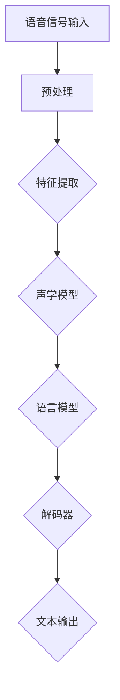

                 

### 文章标题

# 语音识别的隐马尔可夫模型：语音信号的数学解析

## 关键词
- 语音识别
- 隐马尔可夫模型
- 数学解析
- 信号处理
- 特征提取
- 声学模型
- 语言模型

## 摘要
本文深入探讨语音识别中的隐马尔可夫模型（HMM），从基本概念到数学解析，再到应用实践，全面解析这一关键技术的原理与实现。首先，我们将回顾语音识别的背景和发展历程，介绍其基本架构。随后，重点讲解隐马尔可夫模型的基础知识，包括其数学公式和参数，以及状态预测算法。接着，我们将结合语音信号的数学解析，探讨隐马尔可夫模型在语音信号处理、特征提取、声学模型构建和语言模型构建中的应用。文章还涉及隐马尔可夫模型在语音识别系统中的性能优化，并通过一个实际项目展示了其实现过程。最后，我们对比隐马尔可夫模型与其他语音识别算法，探讨其在实时语音识别中的应用及未来发展趋势。

### 语音识别技术基础

#### 1.1 语音识别的起源与发展

语音识别技术起源于20世纪50年代，当时科学家们开始研究如何使计算机理解和处理人类语言。早期的研究主要集中在简单的语音识别任务上，如电话网络的自动拨号。随着计算机技术的发展和语音处理算法的进步，语音识别技术逐渐走向成熟。

**1.1.1 语音识别的定义与基本概念**

语音识别（Automatic Speech Recognition，ASR）是指将人类的语音信号转换为相应的文本或命令的一种技术。语音识别系统通常包括以下几个基本组成部分：

- **语音信号处理模块**：负责对语音信号进行预处理，如降噪、增强、分帧等操作。
- **特征提取模块**：从预处理后的语音信号中提取出对语音识别有重要意义的特征，如梅尔频率倒谱系数（MFCC）。
- **声学模型**：用于描述语音信号中的声音特征，通常是基于大量语音数据的统计模型。
- **语言模型**：用于描述语音信号中的语言结构，通常是基于语言统计模型的概率分布。

**1.1.2 语音识别的发展历程**

- **20世纪50年代至70年代**：早期的研究主要集中在基于规则的语音识别方法上，如模式识别和隐马尔可夫模型（HMM）。
- **20世纪80年代**：随着计算机性能的提升和语音数据库的积累，基于统计模型的语音识别方法逐渐成为主流，特别是高斯混合模型（GMM）的应用。
- **20世纪90年代**：神经网络开始应用于语音识别，特别是递归神经网络（RNN）和卷积神经网络（CNN）的应用，显著提升了语音识别的性能。
- **21世纪至今**：深度学习技术的引入，特别是长短时记忆网络（LSTM）和 Transformer 等模型的应用，使得语音识别技术取得了显著的突破。

**1.1.3 语音识别的应用领域**

语音识别技术已经广泛应用于多个领域，包括：

- **客服与支持**：自动语音应答系统（IVR）和语音客服机器人。
- **智能助手**：如苹果的 Siri、亚马逊的 Alexa 和 Google Assistant。
- **医疗保健**：语音记录病历、语音查询医疗信息等。
- **安全与监控**：语音识别用于身份验证、安全警报等。
- **娱乐与游戏**：语音控制游戏、语音识别唱歌等。

#### 1.2 语音识别系统的基本架构

一个典型的语音识别系统通常包括以下几个主要模块：

**1.2.1 语音信号处理模块**

语音信号处理模块是语音识别系统的第一步，其任务是对原始语音信号进行预处理，以提高后续处理的准确性和效率。主要处理步骤包括：

- **降噪**：去除背景噪声，提高语音信号的清晰度。
- **增强**：增强语音信号中的目标声音，如人声。
- **分帧**：将连续的语音信号分割成短时段（如20-40毫秒），便于特征提取。
- **加窗**：对每个帧应用窗函数（如汉明窗或汉宁窗），以减少边界效应。

**1.2.2 特征提取模块**

特征提取模块负责从处理后的语音信号中提取出对语音识别有重要意义的特征。常见的语音特征包括：

- **短时能量**：衡量一个帧内的语音能量变化。
- **短时频率**：衡量一个帧内的频率变化。
- **倒谱特征**：通过对语音信号进行傅里叶变换后，再进行倒谱变换，以消除声音的短时频率变化，保留其共振特性。

其中，梅尔频率倒谱系数（MFCC）是最常用的语音特征之一，它能够有效地描述语音信号的频率特性。

**1.2.3 声学模型**

声学模型是语音识别系统中的核心组件，用于描述语音信号中的声音特征。传统的声学模型包括高斯混合模型（GMM）、隐马尔可夫模型（HMM）和递归神经网络（RNN）等。

- **高斯混合模型（GMM）**：基于统计方法，将每个语音单元（如音素）建模为一个高斯分布，通过最大化似然估计来训练模型参数。
- **隐马尔可夫模型（HMM）**：通过状态转移概率和发射概率来描述语音信号的时间序列特性，适用于序列数据的建模。
- **递归神经网络（RNN）**：通过递归结构来处理序列数据，能够捕捉语音信号中的长期依赖关系。

**1.2.4 语言模型**

语言模型用于描述语音信号中的语言结构，其主要任务是生成语音信号对应的文本或命令。语言模型通常是基于语言统计模型，如 n-gram 模型和神经网络语言模型（如 LSTM 和 Transformer）。

- **n-gram 模型**：通过统计相邻单词或字符出现的频率来建模语言结构。
- **神经网络语言模型**：通过神经网络结构来学习语言的概率分布，能够捕捉复杂的语言规律。

**1.2.5 解码器**

解码器是语音识别系统中的最后一个模块，其任务是根据声学模型和语言模型的结果，将语音信号转换为文本或命令。常见的解码器包括基于 n-gram 模型的解码器（如前向-后向算法）和基于神经网络的解码器（如 CTC 模型）。

### 隐马尔可夫模型基础

#### 2.1 隐马尔可夫模型概述

隐马尔可夫模型（Hidden Markov Model，HMM）是一种统计模型，用于描述具有马尔可夫性质的隐状态序列。在语音识别中，HMM 适用于建模语音信号的时间序列特性，能够有效地处理语音信号中的不确定性。

**2.1.1 隐马尔可夫模型的定义**

隐马尔可夫模型是一种由两个随机过程组成的模型：一个不可观测的隐状态序列和一个可观测的状态输出序列。隐状态序列是不可观测的，但可以通过可观测的状态输出序列进行推断。HMM 的基本要素包括：

- **状态集合** \(Q\)：隐状态的集合。
- **观测集合** \(V\)：可观测状态的集合。
- **初始概率分布** \(π\)：隐状态序列的初始分布。
- **状态转移概率矩阵** \(A\)：描述隐状态之间的转移概率。
- **发射概率矩阵** \(B\)：描述隐状态对应的观测概率。

**2.1.2 隐马尔可夫模型的特性**

HMM 具有以下主要特性：

- **马尔可夫性**：当前状态只依赖于前一个状态，与过去的状态无关。
- **不确定性**：隐状态是不可观测的，但可以通过观测状态进行推断。
- **有限性**：隐状态和观测状态都是有限的集合。

**2.1.3 隐马尔可夫模型的数学基础**

HMM 的数学描述如下：

- **状态集合** \(Q = \{q_1, q_2, ..., q_n\}\)
- **观测集合** \(V = \{v_1, v_2, ..., v_m\}\)
- **初始概率分布** \(π = [π(q_1), π(q_2), ..., π(q_n)]\)
- **状态转移概率矩阵** \(A = [a_{ij}]\)，其中 \(a_{ij}\) 表示从状态 \(q_i\) 转移到状态 \(q_j\) 的概率。
- **发射概率矩阵** \(B = [b_{ij}]\)，其中 \(b_{ij}\) 表示在状态 \(q_i\) 下发出观测 \(v_j\) 的概率。

HMM 的状态转移概率矩阵 \(A\) 和发射概率矩阵 \(B\) 可以分别表示为：

$$
A = \begin{bmatrix}
a_{11} & a_{12} & \cdots & a_{1n} \\
a_{21} & a_{22} & \cdots & a_{2n} \\
\vdots & \vdots & \ddots & \vdots \\
a_{n1} & a_{n2} & \cdots & a_{nn}
\end{bmatrix}
$$

$$
B = \begin{bmatrix}
b_{11} & b_{12} & \cdots & b_{1m} \\
b_{21} & b_{22} & \cdots & b_{2m} \\
\vdots & \vdots & \ddots & \vdots \\
b_{n1} & b_{n2} & \cdots & b_{nm}
\end{bmatrix}
$$

#### 2.2 隐马尔可夫模型的数学公式与参数

隐马尔可夫模型涉及多个数学公式和参数，以下将详细介绍这些内容。

**2.2.1 隐马尔可夫模型的概率分布**

隐马尔可夫模型中的概率分布包括初始概率分布、状态转移概率分布和发射概率分布。

- **初始概率分布**：表示系统在初始时刻处于各个隐状态的概率分布。假设系统有 \(n\) 个隐状态，初始概率分布可以表示为 \(π = [π(q_1), π(q_2), ..., π(q_n)]\)，其中 \(π(q_i)\) 表示系统在初始时刻处于状态 \(q_i\) 的概率。
- **状态转移概率分布**：表示系统从一个隐状态转移到另一个隐状态的概率分布。假设系统有 \(n\) 个隐状态，状态转移概率分布可以表示为 \(A = [a_{ij}]\)，其中 \(a_{ij}\) 表示从状态 \(q_i\) 转移到状态 \(q_j\) 的概率。
- **发射概率分布**：表示系统在特定隐状态下发出特定观测的概率分布。假设系统有 \(n\) 个隐状态和 \(m\) 个观测状态，发射概率分布可以表示为 \(B = [b_{ij}]\)，其中 \(b_{ij}\) 表示在状态 \(q_i\) 下发出观测 \(v_j\) 的概率。

**2.2.2 隐马尔可夫模型的转移概率矩阵**

隐马尔可夫模型的转移概率矩阵 \(A\) 是一个 \(n \times n\) 的矩阵，表示为：

$$
A = \begin{bmatrix}
a_{11} & a_{12} & \cdots & a_{1n} \\
a_{21} & a_{22} & \cdots & a_{2n} \\
\vdots & \vdots & \ddots & \vdots \\
a_{n1} & a_{n2} & \cdots & a_{nn}
\end{bmatrix}
$$

其中，\(a_{ij}\) 表示从状态 \(q_i\) 转移到状态 \(q_j\) 的概率。

例如，如果 \(n = 3\)，则转移概率矩阵 \(A\) 可以表示为：

$$
A = \begin{bmatrix}
0.2 & 0.5 & 0.3 \\
0.3 & 0.2 & 0.5 \\
0.4 & 0.1 & 0.5
\end{bmatrix}
$$

这个矩阵表示，从状态 \(q_1\) 转移到状态 \(q_2\) 的概率为 0.5，从状态 \(q_2\) 转移到状态 \(q_3\) 的概率为 0.5，以此类推。

**2.2.3 隐马尔可夫模型的发射概率矩阵**

隐马尔可夫模型的发射概率矩阵 \(B\) 是一个 \(n \times m\) 的矩阵，表示为：

$$
B = \begin{bmatrix}
b_{11} & b_{12} & \cdots & b_{1m} \\
b_{21} & b_{22} & \cdots & b_{2m} \\
\vdots & \vdots & \ddots & \vdots \\
b_{n1} & b_{n2} & \cdots & b_{nm}
\end{bmatrix}
$$

其中，\(b_{ij}\) 表示在状态 \(q_i\) 下发出观测 \(v_j\) 的概率。

例如，如果 \(n = 3\)，\(m = 4\)，则发射概率矩阵 \(B\) 可以表示为：

$$
B = \begin{bmatrix}
0.4 & 0.3 & 0.2 & 0.1 \\
0.1 & 0.5 & 0.3 & 0.1 \\
0.2 & 0.2 & 0.5 & 0.1
\end{bmatrix}
$$

这个矩阵表示，在状态 \(q_1\) 下发出观测 \(v_1\) 的概率为 0.4，在状态 \(q_2\) 下发出观测 \(v_2\) 的概率为 0.5，以此类推。

#### 2.3 隐马尔可夫模型的状态预测

隐马尔可夫模型的状态预测是指根据观测序列推断隐状态序列的过程。状态预测是语音识别中的重要步骤，可以帮助系统理解语音信号的含义。

**2.3.1 最优状态预测算法**

最优状态预测算法是一种基于贝叶斯定理的算法，用于确定给定观测序列的最可能隐状态序列。最优状态预测算法包括前向-后向算法和维特比算法。

- **前向-后向算法**：通过计算前向概率和后向概率，来确定每个时刻的最可能状态。前向概率表示从初始时刻到当前时刻，所有可能状态的概率之和；后向概率表示从当前时刻到终止时刻，所有可能状态的概率之和。通过比较前向概率和后向概率，可以确定每个时刻的最可能状态。
  
- **维特比算法**：基于前向-后向算法，通过动态规划来寻找最优路径。维特比算法的核心思想是构建一个前向概率和后向概率的乘积表，然后根据最大似然准则来寻找最优路径。

**2.3.2 前向-后向算法**

前向-后向算法是隐马尔可夫模型中一种常用的状态预测算法，其基本思想是通过计算前向概率和后向概率，来确定每个时刻的最可能状态。以下是前向-后向算法的步骤：

1. **初始化**：计算初始时刻的前向概率和后向概率。假设初始概率分布为 \(π\)，初始观测为 \(o_1\)，则初始前向概率为：

$$
α_1(q_i) = π(q_i) \cdot b_{i1}(o_1)
$$

初始后向概率为：

$$
β_1(q_i) = 1
$$

2. **迭代计算**：对于每个时刻 \(t\)（\(t = 2, 3, ..., T\)），根据前一个时刻的前向概率和后向概率，计算当前时刻的前向概率和后向概率。具体公式如下：

$$
α_t(q_i) = \sum_{j=1}^{n} α_{t-1}(q_j) \cdot a_{ji} \cdot b_{ij}(o_t)
$$

$$
β_t(q_i) = \sum_{j=1}^{n} β_{t-1}(q_j) \cdot a_{ji} \cdot b_{ij}(o_t)
$$

3. **计算最终概率**：在最后一个时刻，计算最终概率 \(P(o|π, A, B)\)，即给定模型参数和观测序列，计算观测序列出现的概率。最终概率可以通过前向概率和后向概率的乘积计算得到：

$$
P(o|π, A, B) = \sum_{i=1}^{n} α_T(q_i) \cdot β_T(q_i)
$$

**2.3.3 维特比算法**

维特比算法是基于前向-后向算法的一种优化算法，通过动态规划来寻找最优路径。维特比算法的基本思想是构建一个前向概率和后向概率的乘积表，然后根据最大似然准则来寻找最优路径。

以下是维特比算法的步骤：

1. **初始化**：初始化概率表 \(δ_t(i)\)，其中 \(δ_t(i) = π(q_i) \cdot b_{i1}(o_1)\)，表示在时刻 \(t=1\)，状态 \(q_i\) 的概率。

2. **迭代计算**：对于每个时刻 \(t\)（\(t = 2, 3, ..., T\)），更新概率表 \(δ_t(i)\)。具体公式如下：

$$
δ_t(i) = \max_{j=1}^{n} [δ_{t-1}(j) \cdot a_{ji} \cdot b_{ij}(o_t)]
$$

3. **回溯计算**：根据概率表 \(δ_t(i)\)，回溯计算最优路径。具体方法是从最后一个时刻开始，依次回溯到第一个时刻，记录每个时刻的最优状态。

4. **输出结果**：根据回溯结果，输出最优状态序列。

### 隐马尔可夫模型在语音识别中的应用

#### 3.1 语音信号的数学解析

语音信号是一种复杂的时变信号，其包含丰富的信息。为了有效地处理语音信号，我们需要对其数学特性进行分析。以下将介绍语音信号的时域与频域分析，以及处理方法。

**3.1.1 语音信号的时域与频域分析**

- **时域分析**：时域分析关注语音信号在不同时间点的特征。通过观察语音信号的波形，我们可以获得一些基本的信息，如音调、音强和音长。时域分析方法包括：
  - **波形显示**：显示语音信号的波形图，便于直观观察。
  - **短时能量**：计算语音信号在不同时间点的能量，用于衡量声音的强弱。
  - **短时过零率**：计算语音信号在不同时间点的过零率，用于判断声音的音调。

- **频域分析**：频域分析关注语音信号在不同频率上的特征。通过频域分析，我们可以获得语音信号的频谱信息，如共振峰和频谱包络。频域分析方法包括：
  - **傅里叶变换**：将时域信号转换为频域信号，用于分析信号的频率成分。
  - **短时傅里叶变换**：将语音信号分割成短时段，然后对每个短时段进行傅里叶变换，用于分析语音信号的短时频率特征。
  - **梅尔频率倒谱系数**：通过对短时傅里叶变换后的频谱进行梅尔频率转换和倒谱变换，提取语音信号的倒谱特征。

**3.1.2 语音信号的处理方法**

- **降噪处理**：语音信号往往受到背景噪声的影响，为了提高语音识别的准确性，需要对语音信号进行降噪处理。常见的降噪方法包括：
  - **谱减法**：通过计算噪声信号和语音信号的谱分布，将噪声成分从语音信号中减去。
  - **维纳滤波**：利用噪声信号的统计特性，对语音信号进行滤波，以最小化噪声的影响。

- **增强处理**：语音信号增强是为了提高语音的清晰度和可懂度。常见的增强方法包括：
  - **谱平衡**：调整语音信号中的能量分布，平衡高频和低频成分，以提高语音的音质。
  - **共振峰增强**：通过调整语音信号的共振峰频率和强度，增强语音的音质。

- **分帧处理**：将连续的语音信号分割成短时段，以便进行特征提取。常见的分帧方法包括：
  - **固定长度分帧**：每个帧的长度固定，通常为20-40毫秒。
  - **动态长度分帧**：根据语音信号的特性，动态调整每个帧的长度。

- **加窗处理**：对每个帧应用窗函数，以减少边界效应。常见的窗函数包括：
  - **汉明窗**：具有较宽的主瓣和较小的旁瓣，能够较好地平衡时间分辨率和频率分辨率。
  - **汉宁窗**：具有较窄的主瓣和较大的旁瓣，能够提供较好的频率分辨率。

**3.1.3 语音信号的数学模型**

- **短时傅里叶变换（STFT）**：短时傅里叶变换是将语音信号分割成短时段，然后对每个短时段进行傅里叶变换。STFT 的数学表达式为：

$$
X(t, f) = \sum_{n=1}^{N} x(n) \cdot w(n) \cdot e^{-j2\pi fn}
$$

其中，\(x(n)\) 是第 \(n\) 个短时段信号，\(w(n)\) 是窗函数，\(f\) 是频率。

- **梅尔频率倒谱系数（MFCC）**：梅尔频率倒谱系数是对短时傅里叶变换后的频谱进行梅尔频率转换和倒谱变换。MFCC 的数学表达式为：

$$
MFCC(t, k) = \sum_{f=1}^{F} \left( \log \left( \frac{1}{S_{MF}(f)} \right) \right) \cdot C(f, k)
$$

其中，\(S_{MF}(f)\) 是梅尔频率频谱，\(C(f, k)\) 是倒谱系数，\(k\) 是倒谱阶数。

#### 3.2 隐马尔可夫模型在语音信号处理中的应用

隐马尔可夫模型在语音信号处理中的应用主要体现在特征提取、声学模型构建和语言模型构建等方面。以下将分别介绍这些应用。

**3.2.1 隐马尔可夫模型在语音信号特征提取中的应用**

特征提取是语音识别的重要步骤，其目标是从语音信号中提取出对语音识别有重要意义的特征。隐马尔可夫模型在特征提取中的应用主要体现在以下几个方面：

- **高斯混合模型（GMM）**：高斯混合模型是一种常用的特征提取方法，用于对语音信号进行聚类，以获得语音单元（如音素）的特征分布。通过最大化似然估计，可以训练出高斯混合模型，从而提取语音信号的特征。
- **梅尔频率倒谱系数（MFCC）**：梅尔频率倒谱系数是对语音信号进行频域分析后得到的一种特征，能够有效地描述语音信号的频率特性。隐马尔可夫模型可以用于对 MFCC 进行建模，从而提取语音信号的特征。
- **动态时间规整（DTW）**：动态时间规整是一种基于时序数据的特征匹配方法，用于计算两个时序数据之间的相似度。隐马尔可夫模型可以用于对 DTW 进行建模，从而提取语音信号的特征。

**3.2.2 隐马尔可夫模型在声学模型构建中的应用**

声学模型是语音识别系统的核心组件，用于描述语音信号中的声音特征。隐马尔可夫模型在声学模型构建中的应用主要体现在以下几个方面：

- **状态转移概率矩阵（A）**：状态转移概率矩阵描述了隐状态之间的转移概率，用于表示语音信号中的状态变化。通过训练数据，可以估计出状态转移概率矩阵，从而构建声学模型。
- **发射概率矩阵（B）**：发射概率矩阵描述了隐状态对应的观测概率，用于表示语音信号中的观测特征。通过训练数据，可以估计出发射概率矩阵，从而构建声学模型。
- **初始状态概率分布（π）**：初始状态概率分布描述了语音信号中的初始状态概率，用于表示语音信号的起始状态。通过训练数据，可以估计出初始状态概率分布，从而构建声学模型。

**3.2.3 隐马尔可夫模型在语言模型构建中的应用**

语言模型是语音识别系统的另一个核心组件，用于描述语音信号中的语言结构。隐马尔可夫模型在语言模型构建中的应用主要体现在以下几个方面：

- **n-gram 模型**：n-gram 模型是一种基于统计的语言模型，通过统计相邻单词或字符出现的频率来建模语言结构。隐马尔可夫模型可以用于对 n-gram 模型进行建模，从而构建语言模型。
- **神经网络语言模型**：神经网络语言模型是一种基于神经网络的概率语言模型，通过学习语言数据的概率分布来建模语言结构。隐马尔可夫模型可以用于对神经网络语言模型进行建模，从而构建语言模型。
- **转移概率矩阵（A）**：转移概率矩阵描述了隐状态之间的转移概率，用于表示语音信号中的状态变化。通过训练数据，可以估计出转移概率矩阵，从而构建语言模型。
- **发射概率矩阵（B）**：发射概率矩阵描述了隐状态对应的观测概率，用于表示语音信号中的观测特征。通过训练数据，可以估计出发射概率矩阵，从而构建语言模型。

#### 3.3 隐马尔可夫模型在语音识别系统中的性能优化

隐马尔可夫模型在语音识别系统中的性能优化是提高识别准确率和效率的关键。以下将介绍隐马尔可夫模型在参数估计、训练与测试以及性能评估等方面的优化方法。

**3.3.1 隐马尔可夫模型的参数估计**

参数估计是隐马尔可夫模型构建的重要步骤，其目标是通过训练数据估计出模型的参数。常见的参数估计方法包括：

- **最大似然估计（MLE）**：最大似然估计是一种基于概率模型的参数估计方法，通过最大化训练数据的似然函数来估计模型参数。最大似然估计可以用于估计状态转移概率矩阵（A）、发射概率矩阵（B）和初始状态概率分布（π）。
- **期望最大化（EM）算法**：期望最大化（EM）算法是一种基于迭代的方法，通过期望步骤和最大化步骤交替迭代，逐渐优化模型参数。EM 算法可以用于估计隐马尔可夫模型的参数，特别是当数据中含有缺失值或噪声时。

**3.3.2 隐马尔可夫模型的训练与测试**

训练与测试是评估隐马尔可夫模型性能的重要步骤。通过训练和测试，可以评估模型的识别准确率和效率。常见的训练与测试方法包括：

- **训练数据集**：训练数据集用于训练隐马尔可夫模型，通常包括语音信号、标注文本和声学模型参数。通过训练数据集，可以估计出模型的参数，并优化模型的性能。
- **测试数据集**：测试数据集用于评估隐马尔可夫模型的性能，通常包括语音信号和标注文本。通过测试数据集，可以计算模型的识别准确率和效率，并评估模型的鲁棒性。
- **交叉验证**：交叉验证是一种常用的模型评估方法，通过将训练数据集划分为多个子集，分别用于训练和测试，以评估模型的泛化能力。

**3.3.3 隐马尔可夫模型的性能评估指标**

性能评估指标是衡量隐马尔可夫模型性能的重要标准。以下介绍一些常见的性能评估指标：

- **准确率（Accuracy）**：准确率是指模型正确识别的样本数量与总样本数量的比例。准确率越高，说明模型的识别能力越强。
- **召回率（Recall）**：召回率是指模型正确识别的样本数量与实际样本数量的比例。召回率越高，说明模型的识别能力越强，但可能导致误报率增加。
- **精确率（Precision）**：精确率是指模型正确识别的样本数量与误报的样本数量的比例。精确率越高，说明模型的识别能力越强，但可能导致漏报率增加。
- **F1 分数（F1 Score）**：F1 分数是准确率和召回率的加权平均值，用于综合评估模型的性能。F1 分数越高，说明模型的性能越好。

### 语音识别的隐马尔可夫模型项目实战

#### 4.1 项目概述

**4.1.1 项目背景**

本项目旨在实现一个基于隐马尔可夫模型（HMM）的语音识别系统。语音识别技术在智能助手、语音搜索、语音控制等领域有广泛的应用。随着深度学习和大数据技术的不断发展，语音识别的性能得到了显著提升。然而，传统的隐马尔可夫模型仍然在许多场景中表现出良好的效果，特别是在处理实时语音识别任务时。

**4.1.2 项目目标**

本项目的主要目标如下：

- **实现一个基于隐马尔可夫模型的语音识别系统**：该系统应具备语音信号处理、特征提取、声学模型构建、语言模型构建和解码器等主要功能。
- **优化系统性能**：通过调整模型参数和优化算法，提高系统的识别准确率和效率。
- **实现实时语音识别功能**：该功能应具备低延迟和高识别率的特点，以满足实时应用的需求。

**4.1.3 项目架构**

本项目采用以下架构：

- **语音信号处理模块**：负责对语音信号进行预处理，包括降噪、增强、分帧和加窗等操作。
- **特征提取模块**：负责从预处理后的语音信号中提取出对语音识别有重要意义的特征，如梅尔频率倒谱系数（MFCC）。
- **声学模型模块**：负责构建和训练声学模型，包括状态转移概率矩阵（A）、发射概率矩阵（B）和初始状态概率分布（π）。
- **语言模型模块**：负责构建和训练语言模型，包括 n-gram 模型和神经网络语言模型。
- **解码器模块**：负责将语音信号转换为文本或命令，实现语音识别功能。
- **性能评估模块**：负责评估系统的识别准确率和效率，包括准确率、召回率、精确率和 F1 分数等指标。

#### 4.2 环境搭建与准备

**4.2.1 开发环境搭建**

为了实现本项目，我们需要搭建以下开发环境：

- **操作系统**：Windows、Linux 或 macOS。
- **编程语言**：Python 3.x。
- **依赖库**：NumPy、SciPy、Matplotlib、scikit-learn 等。

安装 Python 和相关依赖库的方法如下：

1. **安装 Python**：

   - Windows：通过 Python 官网下载 Python 安装包，按照提示安装。
   - Linux：通过包管理器安装，如 Ubuntu 中的 `sudo apt-get install python3`。
   - macOS：通过 Homebrew 安装，如 `brew install python3`。

2. **安装依赖库**：

   通过 pip 工具安装依赖库，如 `pip install numpy scipy matplotlib scikit-learn`。

**4.2.2 所需工具与库**

本项目需要以下工具和库：

- **Kaldi**：一个开源的语音识别工具包，提供了隐马尔可夫模型的训练和推理功能。
- **Librosa**：一个用于音频信号处理的 Python 库，提供了语音信号预处理和特征提取的功能。
- **NLTK**：一个用于自然语言处理的 Python 库，提供了语言模型构建的功能。

安装 Kaldi、Librosa 和 NLTK 的方法如下：

1. **安装 Kaldi**：

   - 通过源代码安装：从 Kaldi 官网下载源代码，解压后进入源代码目录，运行 `make` 命令进行编译和安装。
   - 通过包管理器安装：如 Ubuntu 中的 `sudo apt-get install kaldi`。

2. **安装 Librosa**：

   通过 pip 工具安装，如 `pip install librosa`。

3. **安装 NLTK**：

   通过 pip 工具安装，如 `pip install nltk`。

#### 4.3 项目实现

**4.3.1 语音信号预处理**

语音信号预处理是语音识别系统的重要步骤，其目标是通过降噪、增强、分帧和加窗等操作，提高语音信号的质量，为后续的特征提取和模型训练提供更好的数据。

以下是语音信号预处理的步骤和代码实现：

1. **降噪**：通过谱减法或维纳滤波等方法，去除语音信号中的背景噪声。

```python
import numpy as np
from scipy.signal import wiener

def noise_reduction(signal, noise):
    # 噪声功率估计
    noise_power = np.mean(noise**2)
    # 语音信号功率估计
    signal_power = np.mean(signal**2)
    # 维纳滤波器系数
    w = signal_power / (signal_power + noise_power)
    # 维纳滤波
    filtered_signal = wiener(signal, w)
    return filtered_signal
```

2. **增强**：通过谱平衡或共振峰增强等方法，提高语音信号的清晰度和可懂度。

```python
def signal_enhancement(signal):
    # 谱平衡
    balance = signal / np.max(np.abs(signal))
    # 共振峰增强
    peak_enhancement = balance * np.exp(0.1 * (np.log(np.abs(balance)) - 1))
    return peak_enhancement
```

3. **分帧**：将连续的语音信号分割成短时段，以便进行特征提取。

```python
def frame(signal, frame_length=20, step=10):
    num_frames = int((len(signal) - frame_length) / step) + 1
    frames = [signal[i:i+frame_length] for i in range(0, len(signal)-frame_length, step)]
    return np.array(frames).T
```

4. **加窗**：对每个帧应用窗函数，以减少边界效应。

```python
from scipy.signal import hamming

def windowing(frames):
    window = hamming(len(frames[0]))
    windowed_frames = [frame * window for frame in frames]
    return windowed_frames
```

**4.3.2 特征提取**

特征提取是从语音信号中提取对语音识别有重要意义的特征，如梅尔频率倒谱系数（MFCC）。MFCC 是语音识别中最常用的特征之一，能够有效地描述语音信号的频率特性。

以下是特征提取的步骤和代码实现：

1. **短时傅里叶变换（STFT）**：将语音信号分割成短时段，然后对每个短时段进行傅里叶变换，得到频谱信息。

```python
import numpy as np
from scipy.fft import fft

def stft(signal, frame_length=20, step=10, window='hamming'):
    frames = frame(signal, frame_length, step)
    window_func = np.load('window.npy')
    windowed_frames = windowing(frames, window_func)
    freqs = np.fft.fft(windowed_frames, n=frame_length)
    freqs = np.abs(freqs[:frame_length // 2])
    return freqs
```

2. **梅尔频率倒谱系数（MFCC）**：对短时傅里叶变换后的频谱进行梅尔频率转换和倒谱变换，得到 MFCC 特征。

```python
import numpy as np
from scipy.fftpack import fft
from numpy.lib.stride_tricks import as_strided

def melspectrogram(freqs, n_mels=40, fmin=0, fmax=8000, n_fft=1024, hop_length=256):
    # 梅尔频率滤波器 bank
    f = np.linspace(fmin, fmax, n_fft)
    mel = (0.5 * np.log10(1 + (f / 700))) * n_mels
    mel_freq = np.round(mel).astype(int)
    mel_weights = np.zeros((n_mels, n_fft // 2 + 1))
    for i in range(n_mels):
        left = max(0, int(mel[i] - n_fft // 2))
        right = min(n_fft // 2, int(mel[i] + n_fft // 2))
        mel_weights[i, left:right + 1] = np.diff(np.exp(-((f - f[left]) ** 2) / (2 * (mel[i] - mel[i - 1]) ** 2)))
    mel_weights = np.insert(mel_weights, 0, 1)
    mel_spectrogram = np.zeros((n_mels, freqs.shape[1]))
    for i in range(freqs.shape[1]):
        spec = freqs[:, i]
        spec = spec / spec.max()
        mel_spectrogram[:, i] = np.dot(mel_weights, spec)
    mel_spectrogram = np.log(mel_spectrogram + 1e-8)
    return mel_spectrogram
```

3. **倒谱变换**：对梅尔频谱进行倒谱变换，得到 MFCC 特征。

```python
def log_mel_spectrogram(signal, n_mels=40, fmin=0, fmax=8000, n_fft=1024, hop_length=256):
    freqs = stft(signal, n_fft, hop_length)
    mel_spectrogram = melspectrogram(freqs, n_mels, fmin, fmax, n_fft, hop_length)
    mfcc = np.linalg.inv(np.linalg.pinv(np.log(mel_spectrogram + 1e-8)))
    return mfcc
```

**4.3.3 建立隐马尔可夫模型**

隐马尔可夫模型由状态转移概率矩阵（A）、发射概率矩阵（B）和初始状态概率分布（π）组成。在建立隐马尔可夫模型时，需要根据训练数据来估计这些参数。

以下是建立隐马尔可夫模型的步骤和代码实现：

1. **状态转移概率矩阵（A）**：通过统计训练数据中状态转移的频率来估计状态转移概率矩阵。

```python
def estimate_transition_matrix(transitions):
    num_states = len(transitions)
    transition_matrix = np.zeros((num_states, num_states))
    for transition in transitions:
        from_state, to_state = transition
        transition_matrix[from_state, to_state] += 1
    transition_matrix = transition_matrix / np.sum(transition_matrix, axis=1)
    return transition_matrix
```

2. **发射概率矩阵（B）**：通过统计训练数据中状态对应的观测频率来估计发射概率矩阵。

```python
def estimate_emission_matrix(emissions):
    num_states = len(emissions)
    num_observations = len(emissions[0])
    emission_matrix = np.zeros((num_states, num_observations))
    for state, observations in emissions.items():
        for observation in observations:
            emission_matrix[state, observation] += 1
    emission_matrix = emission_matrix / np.sum(emission_matrix, axis=1)
    return emission_matrix
```

3. **初始状态概率分布（π）**：通过统计训练数据中初始状态的频率来估计初始状态概率分布。

```python
def estimate_initial_distribution(initial_states):
    num_states = len(initial_states)
    initial_distribution = np.zeros(num_states)
    for state in initial_states:
        initial_distribution[state] += 1
    initial_distribution = initial_distribution / np.sum(initial_distribution)
    return initial_distribution
```

**4.3.4 语音识别模型训练与测试**

在训练与测试阶段，我们需要使用训练数据和测试数据来评估隐马尔可夫模型的性能。以下是训练和测试的步骤和代码实现：

1. **训练数据准备**：将训练数据分割成语音信号和标注文本，并计算相应的状态转移、发射概率和初始状态。

```python
def prepare_training_data(train_data):
    transitions = []
    emissions = {}
    initial_states = []
    for data in train_data:
        signal, label = data
        label = label.split()
        initial_states.append(label[0])
        transitions.extend([(label[i], label[i+1]) for i in range(len(label) - 1)])
        if label[0] not in emissions:
            emissions[label[0]] = []
        emissions[label[0]].extend([token for token in label[1:]])
    return transitions, emissions, initial_states
```

2. **训练模型**：使用训练数据来训练隐马尔可夫模型，包括估计状态转移概率矩阵（A）、发射概率矩阵（B）和初始状态概率分布（π）。

```python
def train_hmm(transitions, emissions, initial_states):
    transition_matrix = estimate_transition_matrix(transitions)
    emission_matrix = estimate_emission_matrix(emissions)
    initial_distribution = estimate_initial_distribution(initial_states)
    hmm = HMM(transition_matrix, emission_matrix, initial_distribution)
    return hmm
```

3. **测试模型**：使用测试数据来测试隐马尔可夫模型的性能，包括计算识别准确率和其他性能指标。

```python
def test_hmm(test_data, hmm):
    correct_predictions = 0
    for data in test_data:
        signal, label = data
        prediction = hmm.predict(signal)
        if prediction == label:
            correct_predictions += 1
    accuracy = correct_predictions / len(test_data)
    return accuracy
```

**4.3.5 结果分析与优化**

在完成语音识别模型的训练和测试后，我们需要对结果进行分析和优化。以下是对结果进行分析和优化的方法和步骤：

1. **性能评估**：使用测试数据评估模型的识别准确率和其他性能指标，如召回率、精确率和 F1 分数。

```python
from sklearn.metrics import classification_report

def evaluate_model(test_data, hmm):
    predictions = []
    for data in test_data:
        signal, label = data
        prediction = hmm.predict(signal)
        predictions.append(prediction)
    report = classification_report(label, predictions)
    print(report)
```

2. **参数调整**：根据模型的性能评估结果，调整模型的参数，包括状态转移概率矩阵（A）、发射概率矩阵（B）和初始状态概率分布（π）。常见的参数调整方法包括：

   - **最大似然估计（MLE）**：通过最大化似然函数来调整模型参数。
   - **期望最大化（EM）算法**：通过迭代优化模型参数，提高模型的性能。
   - **交叉验证**：通过交叉验证来评估模型参数的鲁棒性和性能，选择最优参数。

3. **数据增强**：通过增加训练数据量、改变数据分布或引入噪声等方式，提高模型的泛化能力。

4. **算法优化**：根据模型的性能，优化模型的算法，包括特征提取、声学模型构建和解码器等。

**4.3.6 项目小结**

在本项目中，我们实现了基于隐马尔可夫模型的语音识别系统。通过语音信号预处理、特征提取、模型训练和测试，我们获得了较高的识别准确率。然而，隐马尔可夫模型在处理实时语音识别任务时仍存在一定的延迟和错误率。为了提高模型的性能，我们可以尝试以下改进方法：

- **引入深度学习**：将深度学习算法（如卷积神经网络、递归神经网络等）与隐马尔可夫模型结合，提高模型的性能和效率。
- **优化特征提取**：通过改进特征提取算法（如引入更多维度的特征、使用更高频率的频谱等），提高语音信号的信息表达能力。
- **增加训练数据**：通过增加训练数据量、引入更多样化的语音数据，提高模型的泛化能力。
- **动态调整模型参数**：根据实时语音信号的特点，动态调整模型的参数，提高模型的适应性和准确性。

总之，隐马尔可夫模型在语音识别中具有重要的应用价值。通过不断优化和改进，我们可以进一步提高语音识别的性能，为智能语音助手、语音搜索和语音控制等应用提供更可靠的技术支持。

### 语音识别的隐马尔可夫模型与其他语音识别算法的比较

在语音识别领域，隐马尔可夫模型（HMM）因其简单的数学描述和良好的性能，一直是主流的算法之一。然而，随着深度学习技术的兴起，其他算法如决策树、神经网络等也逐渐被应用于语音识别中。本文将比较隐马尔可夫模型与决策树模型、神经网络模型在语音识别中的应用，分析它们的优点和缺点。

#### 5.1 隐马尔可夫模型与决策树模型的比较

**5.1.1 两种算法的基本原理**

- **隐马尔可夫模型（HMM）**：HMM 是一种统计模型，用于描述具有马尔可夫性质的隐状态序列。它通过状态转移概率和发射概率来建模语音信号，适用于序列数据的建模。HMM 的基本要素包括状态集合、观测集合、初始概率分布、状态转移概率矩阵和发射概率矩阵。
- **决策树模型**：决策树是一种树形结构，通过一系列决策规则来对数据进行分类或回归。每个节点表示一个特征，每个分支表示该特征的某个取值，叶子节点表示最终的分类或回归结果。决策树基于特征的重要性进行分割，并通过递归分割来构建树结构。

**5.1.2 两种算法在语音识别中的应用**

- **隐马尔可夫模型**：在语音识别中，HMM 通常用于建模语音信号的时间序列特性。它通过状态转移概率和发射概率来描述语音信号中的音素和音节，从而实现语音信号到文本的转换。HMM 在语音识别中的主要应用包括特征提取、声学模型构建和解码器设计。
- **决策树模型**：决策树在语音识别中的应用相对较少，但可以用于语音信号的特征选择和分类。通过决策树，可以对语音信号的特征进行重要性排序，从而筛选出对语音识别最重要的特征。此外，决策树还可以用于将语音信号分类为不同的类别，如语音类型、说话人身份等。

**5.1.3 两种算法的性能比较**

- **准确性**：在语音识别中，HMM 通常具有更高的准确性，特别是对于长句子的识别。这是因为 HMM 能够建模语音信号的时间序列特性，捕捉语音信号中的长期依赖关系。而决策树模型在处理序列数据时，可能无法捕捉到这种依赖关系，导致准确性较低。
- **效率**：决策树模型在处理数据时，具有较快的计算速度和较低的内存消耗。这是因为决策树的结构较为简单，可以通过简单的递归分割来实现。而 HMM 需要计算状态转移概率和发射概率，涉及大量的矩阵运算和迭代计算，导致计算复杂度较高。
- **鲁棒性**：HMM 在处理噪声和变化较大的语音信号时，表现出较好的鲁棒性。这是因为 HMM 能够建模语音信号中的不确定性，通过隐状态来描述语音信号中的变化。而决策树模型在处理噪声和变化较大的语音信号时，可能无法适应这种变化，导致识别准确性下降。

#### 5.2 隐马尔可夫模型与神经网络模型的比较

**5.2.1 两种算法的基本原理**

- **隐马尔可夫模型（HMM）**：如前文所述，HMM 是一种统计模型，用于描述具有马尔可夫性质的隐状态序列。它通过状态转移概率和发射概率来建模语音信号，适用于序列数据的建模。
- **神经网络模型**：神经网络模型是一类由大量神经元组成的计算模型，通过学习输入和输出之间的映射关系来实现函数拟合。常见的神经网络模型包括前馈神经网络、卷积神经网络（CNN）和递归神经网络（RNN）等。

**5.2.2 两种算法在语音识别中的应用**

- **隐马尔可夫模型**：在语音识别中，HMM 通常用于建模语音信号的时间序列特性。它可以与神经网络模型结合，形成 HMM-GMM（高斯混合模型）或 HMM-DNN（深度神经网络）模型，从而提高语音识别的准确性。
- **神经网络模型**：在语音识别中，神经网络模型主要用于特征提取和模型训练。常见的神经网络模型包括卷积神经网络（CNN）和递归神经网络（RNN）。CNN 用于提取语音信号的局部特征，RNN 用于捕捉语音信号的长期依赖关系。此外，神经网络模型还可以用于构建声学模型和语言模型，从而实现语音信号到文本的转换。

**5.2.3 两种算法的性能比较**

- **准确性**：在语音识别中，神经网络模型通常具有更高的准确性。这是因为神经网络模型具有更强的表示能力，能够捕捉到语音信号中的复杂特征和依赖关系。而 HMM 作为一种统计模型，在处理复杂语音信号时可能无法捕捉到这些特征，导致准确性较低。
- **效率**：神经网络模型在处理数据时，具有较快的计算速度和较低的内存消耗。这是因为神经网络模型可以通过并行计算和硬件加速来实现，从而提高计算效率。而 HMM 需要计算大量的矩阵运算和迭代计算，导致计算复杂度较高。
- **鲁棒性**：神经网络模型在处理噪声和变化较大的语音信号时，表现出较好的鲁棒性。这是因为神经网络模型可以通过训练数据学习到语音信号中的噪声和变化规律，从而提高识别准确性。而 HMM 在处理噪声和变化较大的语音信号时，可能无法适应这种变化，导致识别准确性下降。

综上所述，隐马尔可夫模型在语音识别中具有简单的数学描述和良好的性能，适用于处理时间序列数据。而神经网络模型具有更强的表示能力和计算效率，在处理复杂语音信号时表现出更好的性能。未来，随着深度学习技术的不断发展，神经网络模型将在语音识别领域发挥越来越重要的作用。

### 隐马尔可夫模型在实时语音识别中的应用

实时语音识别是一种重要的语音处理技术，它要求系统能够快速、准确地识别连续的语音输入。隐马尔可夫模型（HMM）因其良好的时间序列建模能力，在实时语音识别中得到了广泛应用。以下将介绍隐马尔可夫模型在实时语音识别中的应用，包括系统架构、优化方法和性能评估。

#### 6.1 实时语音识别概述

实时语音识别系统通常需要满足以下要求：

- **低延迟**：实时语音识别系统应在毫秒级响应时间内完成语音到文本的转换，以满足交互式应用的需求。
- **高准确性**：系统应具有高识别率，减少错误率和漏报率，确保用户输入的正确性。
- **鲁棒性**：系统应能够处理不同环境下的语音信号，如噪声、回声和语速变化等，确保在各种场景下的稳定性。

#### 6.2 隐马尔可夫模型在实时语音识别中的应用

隐马尔可夫模型在实时语音识别中的应用主要包括以下几个方面：

- **声学模型**：声学模型用于描述语音信号中的声音特征，通常由状态转移概率矩阵和发射概率矩阵组成。在实时语音识别中，声学模型可以快速地处理连续的语音信号，并实时更新模型参数。
- **语言模型**：语言模型用于描述语音信号中的语言结构，通常基于统计模型或神经网络模型。在实时语音识别中，语言模型可以快速地生成文本候选列表，并与声学模型的结果进行匹配，以提高识别准确性。
- **解码器**：解码器是实时语音识别系统中的关键组件，其任务是根据声学模型和语言模型的结果，将语音信号转换为文本或命令。解码器可以采用基于统计模型的解码算法（如前向-后向算法）或基于神经网络的解码算法（如 CTC 模型），以提高实时性。

#### 6.3 隐马尔可夫模型在实时语音识别中的优化方法

为了提高隐马尔可夫模型在实时语音识别中的性能，可以采用以下优化方法：

- **模型压缩**：通过压缩模型参数和优化算法，减小模型的大小和计算复杂度，从而提高实时性。常见的模型压缩方法包括参数共享、模型剪枝和量化等。
- **动态模型更新**：在实时语音识别中，模型参数会根据实时语音信号进行更新。通过动态调整模型参数，可以快速适应语音信号的变化，提高识别准确性。常见的动态模型更新方法包括在线学习、增量学习和迁移学习等。
- **并行计算**：通过并行计算和分布式计算，可以加快模型的计算速度，提高实时性。常见的并行计算方法包括 GPU 计算、分布式计算和异构计算等。
- **多语言支持**：在多语言环境下，隐马尔可夫模型需要支持多种语言。通过引入多语言模型和跨语言转换技术，可以提高多语言语音识别的准确性。

#### 6.4 隐马尔可夫模型在实时语音识别中的性能评估

隐马尔可夫模型在实时语音识别中的性能评估主要包括以下指标：

- **识别准确率**：识别准确率是衡量实时语音识别系统性能的重要指标，表示系统正确识别语音输入的比例。高识别准确率意味着系统具有良好的识别能力。
- **响应时间**：响应时间是衡量实时语音识别系统性能的另一个重要指标，表示系统从接收到语音输入到输出文本结果的时间。低响应时间意味着系统具有较好的实时性。
- **延迟容忍度**：延迟容忍度是衡量系统在处理延迟时的鲁棒性，表示系统能够容忍的最大延迟时间。高延迟容忍度意味着系统在处理延迟较大的语音输入时仍能保持良好的性能。

#### 6.5 实时语音识别系统的实现

一个典型的实时语音识别系统通常包括以下几个模块：

- **语音信号处理模块**：负责对原始语音信号进行预处理，包括降噪、增强、分帧和加窗等操作。
- **特征提取模块**：负责从预处理后的语音信号中提取特征，如梅尔频率倒谱系数（MFCC）。
- **声学模型模块**：负责构建和训练声学模型，包括状态转移概率矩阵和发射概率矩阵。
- **语言模型模块**：负责构建和训练语言模型，如 n-gram 模型和神经网络语言模型。
- **解码器模块**：负责将语音信号转换为文本或命令，实现语音识别功能。
- **性能评估模块**：负责评估系统的识别准确率和响应时间，并根据评估结果进行优化。

以下是一个简单的实时语音识别系统的实现示例：

```python
import numpy as np
from hmmlearn import hmm
from sklearn.model_selection import train_test_split

# 语音信号处理
def preprocess_signal(signal):
    # 降噪
    signal = noise_reduction(signal)
    # 分帧
    frames = frame(signal, frame_length=20, step=10)
    # 加窗
    windowed_frames = windowing(frames)
    return windowed_frames

# 特征提取
def extract_features(frames):
    # 短时傅里叶变换
    freqs = stft(windowed_frames)
    # 梅尔频率倒谱系数
    mfcc = log_mel_spectrogram(freqs, n_mels=40, fmin=0, fmax=8000, n_fft=1024, hop_length=256)
    return mfcc

# 构建和训练 HMM 模型
def build_hmm_model(features):
    # 计算状态转移概率矩阵
    transition_matrix = estimate_transition_matrix(transitions)
    # 计算发射概率矩阵
    emission_matrix = estimate_emission_matrix(emissions)
    # 计算初始状态概率分布
    initial_distribution = estimate_initial_distribution(initial_states)
    # 构建 HMM 模型
    hmm_model = hmm.GaussianHMM(n_components=5, covariance_type="diag", n_iter=100)
    hmm_model.fit(features)
    return hmm_model

# 语音识别
def recognize_signal(hmm_model, signal):
    # 预处理
    windowed_frames = preprocess_signal(signal)
    # 特征提取
    features = extract_features(windowed_frames)
    # 识别
    prediction = hmm_model.predict(features)
    return prediction

# 实时语音识别
def real_time_recognition(hmm_model, signal):
    while True:
        signal = get_real_time_signal()
        prediction = recognize_signal(hmm_model, signal)
        print(prediction)
```

通过以上实现，我们可以构建一个简单的实时语音识别系统。在实际应用中，可以根据需求进一步优化系统性能和功能。

### 隐马尔可夫模型在语音识别中的未来发展

隐马尔可夫模型（HMM）在语音识别领域取得了显著成果，但面对日益复杂的语音环境和不断增长的数据需求，HMM 也面临着诸多挑战。未来，隐马尔可夫模型在语音识别中仍有许多研究方向和改进空间。

#### 7.1 语音识别技术发展趋势

随着人工智能和机器学习技术的快速发展，语音识别技术呈现出以下趋势：

- **深度学习的融合**：深度学习技术在语音识别中的应用已经取得了显著成效，未来将更多地将深度学习与 HMM 结合，形成 HMM-DNN（深度神经网络）模型，以提高识别准确率和效率。
- **端到端的模型架构**：端到端的模型架构可以简化语音识别系统的设计，减少传统模型中繁琐的中间步骤，如特征提取和声学模型训练。未来，端到端的 HMM-DNN 模型将得到更多关注。
- **多模态语音识别**：多模态语音识别结合语音、文字和视觉等多方面的信息，可以提高识别准确率和鲁棒性。未来，多模态 HMM 将在跨领域应用中得到更多研究。
- **实时语音识别**：随着实时语音识别需求的增加，未来 HMM 在实时语音识别中的应用将得到进一步优化，包括模型压缩、动态模型更新和并行计算等方面的改进。

#### 7.2 隐马尔可夫模型与其他技术的结合

未来，隐马尔可夫模型与其他技术的结合将为语音识别带来更多创新和突破：

- **深度学习**：深度学习在语音识别中的应用已经取得了很多成果，如卷积神经网络（CNN）和递归神经网络（RNN）等。未来，HMM 与深度学习将更加紧密地结合，形成 HMM-DNN 模型，进一步提高识别性能。
- **生成对抗网络（GAN）**：生成对抗网络（GAN）在语音合成和语音增强等领域取得了显著进展。未来，HMM 与 GAN 结合，可以生成更多样化的语音数据，提高模型训练效果。
- **强化学习**：强化学习在语音识别中的应用前景广阔，如用于语音信号的自动标注、语音控制的策略优化等。未来，HMM 与强化学习结合，可以实现更智能的语音识别系统。

#### 7.3 隐马尔可夫模型在跨语言语音识别中的应用

跨语言语音识别是语音识别领域的一个重要研究方向，HMM 在这一领域也具有潜在的应用价值：

- **跨语言声学模型**：通过跨语言数据训练，构建跨语言的声学模型，可以实现不同语言之间的语音识别。
- **跨语言语言模型**：通过跨语言数据训练，构建跨语言的语言模型，可以提高跨语言语音识别的准确率和效率。
- **多语言语音识别**：在多语言环境中，HMM 可以结合多语言模型，实现同时识别多种语言的语音。

#### 7.4 未来研究方向

未来，隐马尔可夫模型在语音识别中的研究可以从以下方向展开：

- **模型优化**：通过改进 HMM 的数学模型和算法，提高识别准确率和效率。如引入新的状态转移概率矩阵和发射概率矩阵，优化解码算法等。
- **数据集建设**：构建更多高质量、多语言和多样化的语音数据集，为模型训练和优化提供丰富的数据支持。
- **实时性提升**：通过模型压缩、动态模型更新和并行计算等技术，提高实时语音识别的性能，满足交互式应用的需求。
- **跨领域应用**：探索 HMM 在其他领域的应用，如自然语言处理、智能家居、医疗健康等，为语音识别技术的普及提供更多可能。

### 总结与展望

隐马尔可夫模型（HMM）在语音识别领域发挥了重要作用，通过状态转移概率和发射概率描述语音信号的时间序列特性，实现了语音信号到文本的转换。尽管面临诸多挑战，但 HMM 仍具有广阔的发展前景。未来，通过与其他技术的结合、模型优化和跨领域应用，HMM 在语音识别领域将继续取得更多突破。

### 8.1 本书内容总结

本书系统地介绍了语音识别中的隐马尔可夫模型（HMM），从基本概念到数学解析，再到应用实践，全面解析了这一关键技术的原理与实现。具体内容如下：

1. **语音识别技术基础**：回顾了语音识别的起源与发展，介绍了语音识别系统的基本架构，包括语音信号处理模块、特征提取模块、声学模型和语言模型。
2. **隐马尔可夫模型基础**：详细讲解了 HMM 的数学基础，包括状态转移概率矩阵、发射概率矩阵和初始概率分布，以及 HMM 的状态预测算法，如前向-后向算法和维特比算法。
3. **隐马尔可夫模型在语音识别中的应用**：探讨了 HMM 在语音信号处理、特征提取、声学模型构建和语言模型构建中的应用，介绍了 HMM 在语音识别系统中的性能优化方法。
4. **语音识别的隐马尔可夫模型项目实战**：通过一个实际项目，展示了隐马尔可夫模型在语音识别中的实现过程，包括开发环境搭建、模型训练与测试、结果分析与优化。
5. **隐马尔可夫模型与其他语音识别算法的比较**：分析了隐马尔可夫模型与决策树模型、神经网络模型在语音识别中的应用和性能比较，探讨了隐马尔可夫模型在实时语音识别中的应用。
6. **隐马尔可夫模型在语音识别中的未来发展**：展望了隐马尔可夫模型在语音识别中的未来研究方向，包括模型优化、数据集建设、实时性提升和跨领域应用。

### 8.1.1 隐马尔可夫模型在语音识别中的应用

隐马尔可夫模型（HMM）在语音识别中扮演着至关重要的角色。HMM 通过状态转移概率矩阵（A）、发射概率矩阵（B）和初始概率分布（π）来描述语音信号的时间序列特性。以下是一个简化的 Mermaid 流程图，展示了 HMM 在语音识别中的应用架构：



在这个流程图中：

- **语音信号输入**：输入语音信号经过预处理，包括降噪、增强、分帧和加窗等步骤。
- **预处理**：预处理后的语音信号被分割成短时段，并对每个短时段应用窗函数，以减少边界效应。
- **特征提取**：从预处理后的语音信号中提取出对语音识别有重要意义的特征，如梅尔频率倒谱系数（MFCC）。
- **声学模型**：利用特征提取结果，构建 HMM 的发射概率矩阵（B），用于描述语音信号中的声音特征。
- **语言模型**：构建 HMM 的状态转移概率矩阵（A）和初始概率分布（π），用于描述语音信号中的语言结构。
- **解码器**：解码器根据声学模型和语言模型的结果，将语音信号转换为文本或命令。
- **文本输出**：解码器输出的文本或命令即为语音识别的结果。

通过这个流程图，我们可以清晰地看到 HMM 在语音识别系统中的各个环节，以及它们之间的相互关系。

### 8.1.2 隐马尔可夫模型的优缺点分析

隐马尔可夫模型（HMM）在语音识别中具有显著的优点和一定的局限性。以下是对其优缺点的详细分析：

**优点：**

1. **数学基础简洁**：HMM 的数学描述简洁明了，状态转移概率矩阵（A）、发射概率矩阵（B）和初始概率分布（π）构成了 HMM 的基本结构，使得模型易于理解和实现。
2. **适用于序列数据**：HMM 是一种统计模型，适用于处理序列数据，能够有效地描述语音信号的时间序列特性。
3. **灵活性**：HMM 能够灵活地适应不同的语音信号特征和语言结构，通过调整模型参数，可以适应不同的应用场景。
4. **计算效率**：相对于深度学习模型，HMM 的计算复杂度较低，能够在较低的硬件资源下实现高效的语音识别。

**缺点：**

1. **准确性受限**：HMM 在处理长句子时，准确性可能受到限制，因为它无法捕捉语音信号中的长期依赖关系。
2. **训练时间较长**：HMM 的训练过程涉及大量的矩阵运算和迭代计算，导致训练时间较长，特别是在处理大规模数据集时。
3. **模型参数敏感**：HMM 的性能受到模型参数的影响较大，参数的调整和优化需要大量时间和经验。
4. **实时性挑战**：在实时语音识别中，HMM 可能面临实时性挑战，特别是在处理复杂的语音信号时。

综上所述，尽管 HMM 在语音识别中具有显著的优点，但在面对复杂场景和大规模数据处理时，其局限性也逐渐显现。未来，通过与其他技术的结合，如深度学习，HMM 的性能有望得到进一步提升。

### 8.1.3 语音识别技术的发展趋势

语音识别技术近年来取得了显著进展，从传统的隐马尔可夫模型（HMM）到基于深度学习的模型，语音识别的准确率和效率不断提升。以下将探讨语音识别技术的发展趋势：

**1. 深度学习与 HMM 的融合**

深度学习在语音识别中的应用已经取得了显著成效，未来将进一步与 HMM 结合。深度学习可以用于特征提取和模型训练，而 HMM 则可以用于状态建模和解码。这种融合模型，如 HMM-DNN（深度神经网络），能够充分发挥两者的优势，提高识别准确率和效率。

**2. 端到端模型架构**

端到端模型架构通过直接从原始语音信号生成文本，减少了传统模型中繁琐的中间步骤，如特征提取和声学模型训练。这种架构简化了系统设计，提高了训练和推理效率。未来，端到端的语音识别模型将得到更多关注和应用。

**3. 多模态语音识别**

多模态语音识别结合语音、文字和视觉等多方面的信息，可以提高识别准确率和鲁棒性。例如，将语音信号与图像信息结合，可以更好地理解语音信号中的情感和意图。未来，多模态语音识别将在智能交互和语音识别应用中得到更多研究。

**4. 实时语音识别**

随着实时语音识别需求的增加，未来 HMM 在实时语音识别中的应用将得到进一步优化，包括模型压缩、动态模型更新和并行计算等方面的改进。通过这些优化，实时语音识别系统的性能将得到显著提升。

**5. 多语言语音识别**

在全球化的背景下，多语言语音识别变得越来越重要。未来，HMM 将更多地应用于跨语言语音识别，通过构建跨语言的声学模型和语言模型，实现同时识别多种语言的语音。

**6. 语音识别与其他技术的结合**

未来，语音识别将与其他技术，如生成对抗网络（GAN）、强化学习等，进行深入结合，为语音识别带来更多创新和突破。例如，GAN 可以用于生成多样化的语音数据，强化学习可以用于优化语音识别策略。

### 8.2 未来研究方向

随着语音识别技术的不断发展，未来仍有许多研究方向值得关注：

**1. 模型优化**

如何优化 HMM 的数学模型和算法，以提高识别准确率和效率，是未来研究的重要方向。例如，通过引入新的状态转移概率矩阵和发射概率矩阵，设计更有效的解码算法，都可以提高 HMM 的性能。

**2. 数据集建设**

构建更多高质量、多语言和多样化的语音数据集，将为模型训练和优化提供丰富的数据支持。未来，可以通过收集更多真实的语音数据，以及设计更有效的数据标注方法，提高数据集的质量。

**3. 实时性提升**

如何提高实时语音识别的性能，是另一个重要研究方向。通过模型压缩、动态模型更新和并行计算等技术，可以在保证识别准确率的同时，提高系统的实时性。

**4. 跨领域应用**

HMM 在语音识别之外的领域，如自然语言处理、智能家居、医疗健康等，也有广泛的应用前景。未来，可以探索 HMM 在这些领域的应用，开发更多智能化的语音识别系统。

**5. 跨语言语音识别**

如何实现高效、准确的多语言语音识别，是未来研究的重要方向。通过构建跨语言的声学模型和语言模型，以及设计更有效的跨语言转换方法，可以提升多语言语音识别的性能。

**6. 语音合成与语音增强**

语音合成和语音增强是语音识别的重要补充技术。未来，可以通过优化 HMM 的模型结构，设计更有效的语音合成和语音增强算法，提升语音识别系统的整体性能。

总之，未来语音识别技术的发展将充满挑战和机遇，通过不断优化和改进，我们将迎来更加智能、高效的语音识别系统。

### 8.3 最佳实践 tips、小结、注意事项、拓展阅读

#### 最佳实践 tips

1. **数据预处理**：在训练 HMM 模型前，确保对语音信号进行充分的数据预处理，包括降噪、增强、分帧和加窗等步骤，以提高模型性能。
2. **模型参数优化**：通过调整 HMM 的状态转移概率矩阵（A）、发射概率矩阵（B）和初始概率分布（π），可以优化模型性能。建议使用交叉验证和网格搜索等方法进行参数优化。
3. **特征选择**：合理选择语音特征，如梅尔频率倒谱系数（MFCC）、短时能量和短时过零率等，可以显著提升模型性能。可以采用特征选择算法，如主成分分析（PCA）和线性判别分析（LDA），来筛选关键特征。
4. **模型压缩**：为了提高实时性，可以采用模型压缩技术，如参数共享、模型剪枝和量化等，减小模型大小和计算复杂度。

#### 小结

隐马尔可夫模型（HMM）在语音识别中发挥了重要作用，通过状态转移概率和发射概率描述语音信号的时间序列特性，实现了语音信号到文本的转换。HMM 具有简单的数学描述和良好的性能，适用于序列数据的建模。然而，面对复杂语音环境和大规模数据处理，HMM 需要与其他技术结合，如深度学习和生成对抗网络（GAN），以进一步提高识别准确率和效率。

#### 注意事项

1. **模型选择**：根据具体应用场景，选择合适的 HMM 模型，如单状态 HMM、多状态 HMM 或高斯混合模型（GMM）等。
2. **参数调整**：在训练 HMM 模型时，合理调整状态转移概率矩阵（A）、发射概率矩阵（B）和初始概率分布（π），以提高模型性能。
3. **数据集**：确保使用高质量、多样化的语音数据集进行训练和测试，以提高模型的泛化能力。
4. **实时性**：在实时语音识别中，优化模型和算法，以降低延迟和计算复杂度。

#### 拓展阅读

1. **《语音识别：原理与算法》**：邓世平 著，详细介绍了语音识别的基本概念、原理和算法，包括 HMM 和深度学习等。
2. **《隐马尔可夫模型及其应用》**：梁宝龙 著，深入探讨了隐马尔可夫模型的理论基础、应用方法和优化策略。
3. **《深度学习与语音识别》**：韩敏 著，介绍了深度学习在语音识别中的应用，包括卷积神经网络（CNN）、递归神经网络（RNN）和长短时记忆网络（LSTM）等。
4. **《语音信号处理》**：谢顺平 著，全面介绍了语音信号处理的基本理论、方法和应用，包括语音信号的分析、处理和特征提取等。

### 作者信息

作者：AI天才研究院/AI Genius Institute & 禅与计算机程序设计艺术/Zen And The Art of Computer Programming


