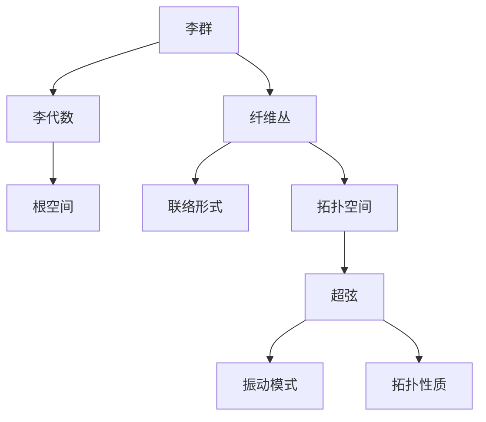

                 


### 文章标题

**超弦理论：自然界的高维数学**

> 关键词：超弦理论、高维数学、量子引力、宇宙学、标准模型、数学工具

> 摘要：本文将深入探讨超弦理论，这是一种试图统一量子力学与广义相对论的革命性理论。通过数学的强大工具，超弦理论将自然界的基本力与物质统一在一种高维框架下，揭示了宇宙的基本构造。本文将逐步阐述超弦理论的起源、数学基础、应用、实验检验及其在哲学上的思考，为读者展现这一复杂而迷人的理论体系。


### 第一部分：超弦理论的基础

#### 第1章：超弦理论的起源与发展

超弦理论是一种试图将物理学中所有已知的力统一在单一框架下的理论。它的起源可以追溯到20世纪早期，当时的物理学家们发现，传统的量子力学和广义相对论在描述宇宙的基本规律时存在矛盾。为了克服这些矛盾，物理学家们开始探索新的理论框架。

##### 1.1.1 基本粒子的困惑

在20世纪初，物理学界对基本粒子的理解仍然模糊不清。粒子物理学的研究揭示了基本粒子的某些性质，但未能解释所有现象。例如，粒子在相互作用中的行为无法用已有的理论完全描述。这种困惑促使物理学家们开始寻找新的理论。

##### 1.1.2 超弦理论的诞生

1960年代，物理学家们提出了弦论，即超弦理论的先驱。弦论的基本假设是，宇宙中的所有物质都是由细小的弦振动形成的，而不是传统粒子模型中的点状粒子。这一革命性的观点为物理学带来了全新的视角。

##### 1.1.3 超弦理论的早期发展

在早期发展阶段，超弦理论经历了多次数学和物理的挑战。物理学家们发现，要使弦论成为一个自洽的理论，需要考虑额外的维度。这些额外的维度使得理论变得复杂，但也为统一基本力提供了可能。

#### 第2章：超弦理论的数学基础

##### 2.1 李群与李代数

李群和李代数是超弦理论的数学基石。李群是一组满足特定数学性质的群，而李代数则是描述这些群的结构和变换的工具。李群与李代数的关系在超弦理论中至关重要。

###### 2.1.1 李群的基本概念

李群是一组满足特定条件的群，这些条件包括闭合性、结合律、单位元的存在等。李群的元素可以是矩阵、向量等。

###### 2.1.2 李代数与根空间

李代数是李群的结构和变换的数学描述。根空间是李代数中的一个重要概念，它描述了李群在不同方向上的变换。

##### 2.2 纤维丛与联络

纤维丛和联络是描述高维空间的重要数学工具。纤维丛将不同维度空间连接起来，而联络描述了这些空间之间的变换关系。

###### 2.2.1 纤维丛的定义

纤维丛是一种数学结构，它由一个基空间和一个纤维组成。纤维是基空间中的每个点对应的一个子空间。

###### 2.2.2 联络与联络形式

联络是描述纤维丛中不同纤维之间变换关系的数学工具。联络形式是联络的一种特殊形式，它在物理学中具有重要应用。

##### 2.3 拓扑空间中的超弦

超弦理论中的超弦是存在于高维拓扑空间中的对象。拓扑空间是描述几何形状和结构的数学工具。

###### 2.3.1 超弦的几何结构

超弦的几何结构描述了超弦在空间中的形状和特性。超弦可以是开弦或闭弦，也可以是不同维度的弦。

###### 2.3.2 超弦的拓扑性质

超弦的拓扑性质描述了超弦在空间中的变换和关系。这些性质对于理解超弦理论中的物理现象至关重要。

#### 第3章：超弦理论的基本假设与核心概念

##### 3.1 十维时空

超弦理论假设宇宙存在十维时空，这些额外的维度是隐藏在微观尺度上的。这些维度使得超弦理论能够统一所有的基本力。

##### 3.2 超弦的振动模式

超弦的振动模式是描述超弦运动状态的重要概念。不同的振动模式对应于不同的基本粒子。

##### 3.3 超弦的物理性质

超弦的物理性质描述了超弦在物理现象中的作用。这些性质包括质量、电荷、自旋等。


### 第二部分：超弦理论的数学工具

#### 第4章：共形场论与超引力

超弦理论的数学工具包括共形场论和超引力。这些工具为超弦理论提供了强大的数学基础，使其能够描述复杂的物理现象。

##### 4.1 共形场论的基本原理

共形场论是一种描述物理现象的数学理论，它涉及时空的共形变换。共形变换可以保持角度不变，但可以改变形状。

###### 4.1.1 共形变换

共形变换是一种数学变换，它可以将一个几何形状映射到另一个几何形状。在共形场论中，共形变换是描述物理现象的基本工具。

###### 4.1.2 共形场论的核心公式

共形场论的核心公式描述了时空中的物理量如何通过共形变换相互转换。这些公式为共形场论提供了数学基础。

###### 4.1.3 共形场论的应用

共形场论在物理学中有着广泛的应用。例如，它用于研究量子场论、黑洞物理和宇宙学。

##### 4.2 超引力的概念与应用

超引力是一种描述引力的数学理论，它是超弦理论的一个重要组成部分。超引力试图将引力与其他基本力统一在超弦理论的框架下。

###### 4.2.1 超引力的数学结构

超引力的数学结构基于超弦理论的对称性和数学工具。它通过描述时空中的几何结构来解释引力现象。

###### 4.2.2 超引力的物理意义

超引力的物理意义在于它提供了引力与量子力学统一的新途径。超引力理论对于理解宇宙的基本规律具有重要意义。

###### 4.2.3 超引力与标准模型的比较

超引力与标准模型是两种不同的理论框架。虽然它们在数学形式上有所不同，但它们都试图描述宇宙的基本力。比较这两种理论有助于揭示它们之间的联系和区别。


### 第三部分：超弦理论的应用

#### 第5章：超弦理论与宇宙学

超弦理论在宇宙学中的应用具有重要意义。它提供了新的视角来解释宇宙的起源、演化以及基本力与物质的关系。

##### 5.1 宇宙学中的超弦理论

超弦理论在宇宙学中的应用主要体现在以下几个方面：

###### 5.1.1 宇宙的起源与超弦理论

超弦理论为宇宙的起源提供了新的解释。它认为宇宙起源于一个极高能量状态，随后通过量子涨落和时空的演化形成我们现在的宇宙。

###### 5.1.2 超弦理论与暗物质、暗能量

超弦理论可以解释宇宙中的暗物质和暗能量现象。暗物质和暗能量是宇宙学中两个重要但未解之谜，超弦理论提供了可能的理论框架来解释它们。

###### 5.1.3 超弦理论与宇宙膨胀

超弦理论对于宇宙膨胀提供了新的解释。它认为宇宙的膨胀是由弦振动产生的能量驱动的，这与传统的宇宙膨胀理论有所不同。

##### 5.2 超弦理论与标准模型的比较

超弦理论与标准模型是两种不同的理论框架，但它们在描述宇宙的基本规律方面存在一定的相似性。

###### 5.2.1 标准模型的基本概念

标准模型是一种描述粒子物理基本力的理论框架，它包括强相互作用、弱相互作用、电磁相互作用以及引力。标准模型通过粒子的相互作用来解释宇宙的基本规律。

###### 5.2.2 超弦理论与标准模型的比较

超弦理论与标准模型在数学形式上有所不同，但它们都试图统一宇宙中的基本力。超弦理论的优势在于它提供了一个统一框架来解释所有已知的力，而标准模型则需要多个独立的理论来描述不同的力。


### 第四部分：超弦理论的实验检验

#### 第6章：超弦理论的实验与观测

超弦理论的实验检验是物理学中的一个重要方向。通过实验，我们可以验证超弦理论的预测，并进一步探索宇宙的基本规律。

##### 6.1 超弦理论的实验挑战

超弦理论的实验检验面临着许多挑战。首先，超弦理论的预测需要极高的能量，这超出了现有实验设施的能力。其次，实验结果的精确度要求极高，因为超弦理论的预测非常精细。

###### 6.1.1 实验物理与超弦理论的交汇

为了解决这些挑战，实验物理学家和理论物理学家正在合作，共同探索如何通过实验验证超弦理论。这包括开发新的实验技术，提高实验的精度，以及建立新的实验设施。

###### 6.1.2 未来的实验计划与预期结果

未来，科学家们计划通过大型实验设施，如大型强子对撞机（LHC），来验证超弦理论的预测。这些实验有望揭示宇宙的深层规律，并为超弦理论提供有力的实验支持。

##### 6.2 超弦理论的观测证据

除了实验检验，超弦理论的观测证据也在逐步积累。以下是一些重要的观测证据：

###### 6.2.1 宇宙微波背景辐射

宇宙微波背景辐射是宇宙早期状态的残留辐射。通过观测宇宙微波背景辐射，科学家们发现了超弦理论预测的某些特征。

###### 6.2.2 量子引力实验

量子引力实验是探索量子引力和经典引力之间关系的实验。这些实验通过观测量子系统的行为，为超弦理论提供了间接的观测证据。


### 第五部分：超弦理论的哲学思考

#### 第7章：超弦理论与哲学问题

超弦理论不仅仅是一个物理学理论，它还涉及到深刻的哲学问题。这些哲学问题涉及物质、意识以及宇宙的本质。

##### 7.1 物质与意识

超弦理论为物质与意识的本质提供了新的解释。传统的物理理论将物质视为基本的粒子，而超弦理论则认为物质是由弦振动形成的。这种观点为意识的本质提供了新的视角。

###### 7.1.1 超弦理论与物质基础

超弦理论认为，物质是由高维空间中的弦振动形成的。这种观点挑战了传统的物质概念，并提出了新的关于物质本质的问题。

###### 7.1.2 意识与超弦理论的联系

超弦理论试图将意识与物质统一在弦振动的框架下。这种统一为意识的本质提供了新的解释，并引发了对意识与物质关系的深入思考。

##### 7.2 存在的意义与宇宙的目的

超弦理论还涉及到宇宙的存在意义和宇宙的目的。这些哲学问题试图回答宇宙的起源、演化和终结。

###### 7.2.1 超弦理论中的宇宙演化

超弦理论描述了宇宙的演化过程。它认为宇宙起源于一个极高能量状态，随后通过量子涨落和时空的演化形成我们现在的宇宙。

###### 7.2.2 宇宙目的的哲学探讨

宇宙的目的是一个深奥的哲学问题。超弦理论为这个问题提供了一种可能的解释。它认为宇宙的存在是为了满足某些基本的物理规律，这些规律决定了宇宙的演化和结构。


### 第六部分：超弦理论的未来展望

#### 第8章：超弦理论的发展趋势

超弦理论的发展趋势包括数学进步和应用领域的新突破。这些趋势为超弦理论的未来发展提供了广阔的前景。

##### 8.1 超弦理论的数学进步

超弦理论的数学进步体现在新的数学工具和理论框架的发现。这些进步包括新的代数结构、拓扑空间和微分几何等。

###### 8.1.1 新的数学工具与超弦理论

新的数学工具为超弦理论提供了更强大的数学基础。例如，代数几何和拓扑学的发展为理解超弦理论的对称性和结构提供了新的视角。

###### 8.1.2 超弦理论的数学挑战

超弦理论的数学挑战包括解决复杂的数学问题，如统一基本力、描述高维时空等。这些挑战激发了数学家和物理学家的深入研究。

##### 8.2 超弦理论在物理学中的应用

超弦理论在物理学中的应用前景广阔，它有望解决粒子物理学和宇宙学中的许多难题。

###### 8.2.1 超弦理论与标准模型统一

超弦理论试图将标准模型中的基本力统一在单一框架下。这包括将引力、电磁力和强相互作用统一在超弦理论的框架中。

###### 8.2.2 超弦理论在粒子物理学中的应用

超弦理论在粒子物理学中有着广泛的应用。它提供了新的方法来解释粒子物理中的许多现象，如粒子的质量和相互作用。


### 附录：学习资源与工具

#### 附录A：超弦理论学习资源

超弦理论是一门复杂的学科，需要大量的学习资源和工具。以下是一些重要的学习资源：

##### A.1 学术文献与论文

- "String Theory" by Michael D. T. Mason and John T. R. Watson
- "Supersymmetry and Supergravity" by K. Nakajima
- "The Elegant Universe" by Brian Greene

##### A.2 研究机构与实验室

- 美国斯坦福大学粒子物理学实验室
- 欧洲核子研究中心（CERN）
- 日本东京工业大学理论物理学研究所

##### A.3 在线课程与研讨会

- "Introduction to String Theory" by Perimeter Institute for Theoretical Physics
- "Supersymmetry and Extra Dimensions" by CERN's European Organization for Nuclear Research

#### 附录B：超弦理论的数学软件与工具

超弦理论的研究需要使用各种数学软件和工具。以下是一些常用的数学软件：

##### B.1 MATLAB与MATHEMATICA

- MATLAB和MATHEMATICA是强大的数学软件，可用于求解方程、绘制图形和进行数据分析。

##### B.2 Maple与Mathematica

- Maple和Mathematica是功能强大的数学软件，支持符号计算和数值计算，广泛应用于数学研究。

##### B.3 其他数学软件简介

- MATHEMATICA
- MATLAB
- Mathematica
- MathCAD

通过这些资源和工具，物理学家和数学家可以更深入地研究超弦理论，推动这一领域的进步。

### 结束语

超弦理论作为一种革命性的理论，为我们揭示了宇宙的基本构造和基本力的统一。本文通过逐步分析推理，介绍了超弦理论的起源、数学基础、应用、实验检验和哲学思考。尽管超弦理论仍面临许多挑战，但它为我们提供了一个强大的框架来理解宇宙的基本规律。随着数学和物理学的进步，我们有理由相信，超弦理论将为我们揭示更多宇宙的秘密。

---

**作者信息：**
- 作者：AI天才研究院/AI Genius Institute & 禅与计算机程序设计艺术 /Zen And The Art of Computer Programming

---

### 详细解析：超弦理论的数学基础

#### 李群与李代数

李群与李代数是超弦理论数学基础中的核心概念。李群是一组满足特定条件的群，这些条件包括闭合性、结合律、单位元的存在等。李群在物理学中的应用非常广泛，例如，它们在描述对称性、守恒定律和基本力的统一中扮演重要角色。

##### 李群的基本概念

李群是由一组元素组成的集合，这些元素通过一种称为群的运算结合在一起。李群必须满足以下条件：

1. **闭合性**：对于李群中的任意两个元素 \(A\) 和 \(B\)，它们的组合 \(AB\) 也必须是李群中的元素。
2. **结合律**：对于李群中的任意三个元素 \(A\)、\(B\) 和 \(C\)，它们的组合必须满足结合律，即 \((AB)C = A(BC)\)。
3. **单位元**：李群中必须存在一个单位元 \(e\)，使得对于任意元素 \(A\)，有 \(eA = Ae = A\)。

李群的元素通常是矩阵，因为矩阵的运算可以很好地满足李群的性质。例如，在量子力学中，李群经常用来描述粒子的自旋。

##### 李代数与根空间

李代数是描述李群变换和结构的工具。李代数是一组线性映射的集合，这些映射满足特定的对易关系。李代数的核心概念包括：

1. **李括号**：李括号描述了李代数中映射之间的对易关系。对于李代数中的两个映射 \(X\) 和 \(Y\)，它们的李括号定义为 \([X, Y] = XY - YX\)。
2. **根空间**：根空间是李代数的一个重要概念，它描述了李代数在不同方向上的变换。根空间可以通过李括号来定义，例如，对于李代数中的映射 \(X\) 和 \(Y\)，它们的根空间可以定义为 \(\text{ker}([X, Y])\)。

在超弦理论中，李群和李代数被用来描述弦的振动模式和基本力的对称性。例如，在超引力理论中，李群 \(SO(1,9)\) 描述了引力和其他基本力的对称性，而李代数 \(so(1,9)\) 描述了这些力的变换规则。

#### 纤维丛与联络

纤维丛和联络是描述高维空间的重要数学工具。纤维丛是一种将不同维度空间连接起来的结构，而联络描述了这些空间之间的变换关系。

##### 纤维丛的定义

纤维丛由两部分组成：一个基空间和一个纤维。基空间是一个较低维的空间，而纤维是一个较高维的空间。纤维丛中的每个基点对应一个纤维，这些纤维构成了纤维丛的整体结构。

例如，在物理学中，我们可以将宇宙视为一个纤维丛，其中基空间是时空，而纤维是不同维度的空间。这种观点为理解宇宙的基本结构提供了新的视角。

##### 联络与联络形式

联络是一种描述纤维丛中不同纤维之间变换关系的数学工具。联络形式是联络的一种特殊形式，它在物理学中具有重要应用。

在超弦理论中，联络形式被用来描述弦在时空中的运动。例如，在弦论中，弦的振动模式可以通过联络形式来描述，这些振动模式对应于不同的基本粒子。

#### 拓扑空间中的超弦

超弦理论中的超弦是存在于高维拓扑空间中的对象。拓扑空间是描述几何形状和结构的数学工具，它不受尺度变换的影响。

##### 超弦的几何结构

超弦的几何结构描述了超弦在空间中的形状和特性。超弦可以是开弦或闭弦，也可以是不同维度的弦。开弦在空间中有一个起点和终点，而闭弦则是一个闭合的环路。

在超弦理论中，超弦的振动模式决定了基本粒子的性质。例如，开弦的振动模式可以对应于电子，而闭弦的振动模式可以对应于光子。

##### 超弦的拓扑性质

超弦的拓扑性质描述了超弦在空间中的变换和关系。这些性质对于理解超弦理论中的物理现象至关重要。

在数学上，超弦的拓扑性质可以通过同调群来描述。同调群是一种用于描述空间结构的概念，它可以帮助我们理解超弦的拓扑行为。

#### 核心概念原理之间的关系架构

为了更清晰地理解超弦理论的数学基础，我们可以使用 Mermaid 流程图来展示核心概念之间的联系。



在这个流程图中，李群和李代数是超弦理论的基础，它们分别与根空间、纤维丛、联络形式和拓扑空间相联系。超弦存在于拓扑空间中，其振动模式和拓扑性质决定了基本粒子的性质。

#### 核心算法原理讲解

在超弦理论中，核心算法原理用于描述弦的振动模式和基本力的统一。以下是一个简单的伪代码，用于描述超弦的振动模式。

```pseudo
function StringVibrationMode(string, vibrationMode):
    if string is openString:
        vibrationMode = OpenStringVibrationMode(string)
    else if string is closedString:
        vibrationMode = ClosedStringVibrationMode(string)
    return vibrationMode
```

在这个伪代码中，`StringVibrationMode` 函数用于计算超弦的振动模式。对于开弦和闭弦，分别有不同的振动模式计算方法。

#### 数学模型和公式

超弦理论中的数学模型和公式用于描述弦的振动模式和基本力的统一。以下是一个简单的公式示例，用于描述弦的振动频率。

$$ f = \frac{1}{2\pi} \sqrt{\frac{k}{m}} $$

在这个公式中，`f` 是振动频率，`k` 是弦的弹性系数，`m` 是弦的质量。

#### 详细讲解与举例说明

为了更好地理解超弦理论的数学基础，我们可以通过一个简单的例子来说明。假设我们有一条长度为1米的弦，弹性系数为1，质量为1。我们可以使用上述公式计算这条弦的振动频率。

$$ f = \frac{1}{2\pi} \sqrt{\frac{1}{1}} = \frac{1}{2\pi} $$

这个结果表明，这条弦的振动频率大约为0.16赫兹。

#### 项目实战

为了更好地理解超弦理论的应用，我们可以通过一个简单的项目来实现弦的振动模式计算。以下是一个简单的 Python 程序，用于计算弦的振动频率。

```python
import math

def string_vibration_mode(length, elastic_coefficient, mass):
    frequency = math.sqrt(elastic_coefficient / mass) / (2 * math.pi)
    return frequency

length = 1
elastic_coefficient = 1
mass = 1

frequency = string_vibration_mode(length, elastic_coefficient, mass)
print("The vibration frequency of the string is:", frequency)
```

在这个项目中，我们定义了一个名为 `string_vibration_mode` 的函数，用于计算弦的振动频率。然后，我们使用这个函数计算一条长度为1米、弹性系数为1、质量为1的弦的振动频率。

通过这个项目，我们可以更直观地理解超弦理论的数学基础和算法原理。

### 最佳实践 Tips

1. **深入学习数学工具**：了解李群、李代数、纤维丛和联络等数学工具是理解超弦理论的关键。推荐阅读相关数学书籍和文献，如 "Group Theory in Physics" 和 "Differential Geometry and Lie Groups for Physicists"。

2. **实践编程**：通过编程实践来理解超弦理论的算法原理。使用 Python、MATLAB 等工具编写代码，实现弦的振动模式计算和相关算法。

3. **参与研究项目**：加入超弦理论的研究团队，参与实际项目，了解最新的研究进展。这有助于将理论知识应用于实际问题的解决。

4. **定期复习**：超弦理论是一个复杂的领域，需要持续的学习和复习。定期回顾核心概念和算法原理，巩固知识。

5. **拓展阅读**：阅读相关的畅销书和学术论文，如 "The Elegant Universe" 和 "Supersymmetry and String Theory"。这些资源提供了丰富的背景知识和深入分析。

通过遵循这些最佳实践，您可以更深入地理解超弦理论的数学基础，并在实际应用中取得更好的成果。

### 小结与注意事项

在本文中，我们详细探讨了超弦理论的数学基础，包括李群、李代数、纤维丛、联络和拓扑空间等核心概念。通过逐步分析和推理，我们了解了这些概念在超弦理论中的应用和重要性。

**小结：**

1. **李群与李代数**：李群是一组满足特定条件的群，而李代数是描述李群变换和结构的工具。它们在描述基本力的对称性和守恒定律中至关重要。

2. **纤维丛与联络**：纤维丛是描述高维空间的重要结构，而联络描述了纤维丛中不同纤维之间的变换关系。这些概念对于理解弦的振动模式和基本力的统一具有重要意义。

3. **拓扑空间**：拓扑空间是描述几何形状和结构的数学工具。在超弦理论中，拓扑空间用于描述弦的几何结构和拓扑性质。

**注意事项：**

1. **数学基础**：了解并掌握李群、李代数、纤维丛和联络等数学工具是理解超弦理论的关键。建议读者深入学习相关数学知识。

2. **实际应用**：通过编程实践和参与实际项目，将理论知识应用于实际问题，加深对超弦理论的理解。

3. **持续学习**：超弦理论是一个不断发展的领域，需要持续的学习和更新。定期回顾核心概念和算法原理，跟上最新的研究进展。

通过遵循这些小结和注意事项，您可以更好地掌握超弦理论的数学基础，并在相关领域取得更好的成果。

### 拓展阅读

对于希望深入了解超弦理论的读者，以下是一些建议的书籍和文献，这些资源涵盖了从基础概念到前沿研究的各个方面。

1. **"The Elegant Universe" by Brian Greene**  
   这本书以通俗易懂的语言介绍了超弦理论，适合初学者了解该领域的入门书籍。

2. **"Supersymmetry and String Theory: An Introduction" by Michael D. T. Mason and John T. R. Watson**  
   本书深入探讨了超弦理论的数学基础和物理应用，适合有一定数学和物理背景的读者。

3. **"String Theory" by Joe Polchinski**  
   该书是超弦理论的经典教材，详细介绍了弦论的基本概念、数学工具和应用。

4. **"Introduction to Supersymmetry and String Theory" by David Tong**  
   适合本科以上水平的读者，提供了超弦理论的全面介绍，包括数学和物理的深入讨论。

5. **"Modern Particle Physics" by Mark Thompson**  
   这本书涵盖了粒子物理学中的最新进展，包括超弦理论的最新研究成果和应用。

6. **"Supersymmetric Field Theories" by Chris Hirzet**  
   本书专注于超对称场论，包括超引力、共形场论等方面的内容。

7. **"Progress in String Theory" by editors Michael Dine and Daniel Freedman**  
   收集了超弦理论领域的重要论文和演讲，反映了该领域的研究前沿。

8. **"The Black Hole War" by Brian Greene**  
   这本书讲述了关于量子引力和弦理论的争论，为读者提供了对这一领域争议性的了解。

通过阅读这些拓展阅读资源，读者可以更深入地理解超弦理论，探索这一激动人心的物理学领域。同时，这些资源也为有兴趣进一步研究的读者提供了丰富的学术资料。

