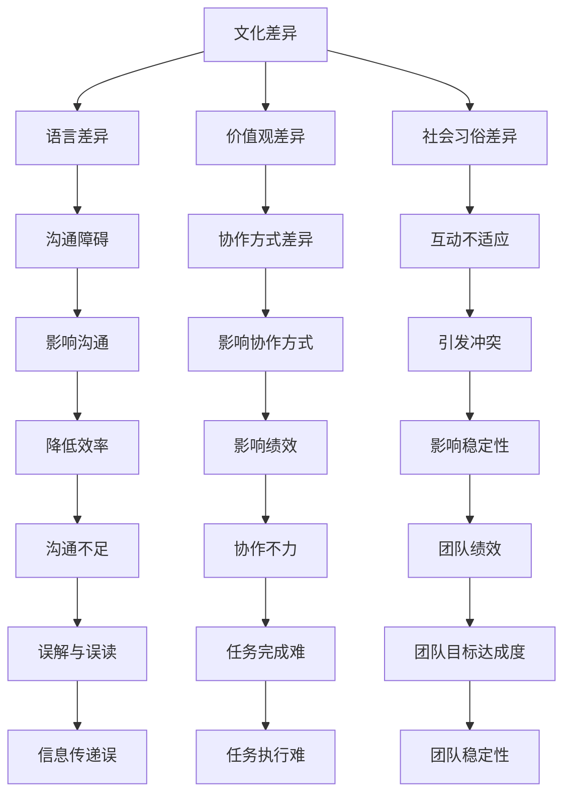

                 

### 跨文化团队协作的背景介绍

在现代全球化的背景下，跨文化团队协作已经成为许多企业发展的关键因素。随着全球化进程的不断推进，企业越来越倾向于在全球范围内招募和组建团队，以利用不同文化的优势和资源，提升企业的竞争力。这种跨文化团队协作不仅限于跨国公司，还包括多元文化背景下的本地团队协作。因此，理解并有效地管理文化差异，消除文化障碍，成为团队成功协作的必备条件。

#### 全球化趋势与跨文化团队协作的重要性

全球化趋势使得世界各国的经济、文化和科技紧密相连。跨国公司通过全球运营，能够迅速响应市场变化，开发新产品，优化供应链，降低成本。而跨文化团队协作在这种全球化背景下显得尤为重要。以下是一些跨文化团队协作的重要性体现：

1. **多元化的思维方式**：跨文化团队由不同文化背景的成员组成，能够带来多样化的思维方式和解决问题的方法。这种多样性有助于创新和创造力的提升，有助于企业在面对复杂问题时找到更全面的解决方案。

2. **丰富的技能与知识**：跨文化团队中的成员往往拥有不同的专业背景和实践经验，这使得团队能够涵盖更广泛的技能和知识领域。这种多样性有助于企业充分利用全球资源，提升整体竞争力。

3. **适应全球市场**：跨文化团队协作有助于企业更好地理解和适应不同市场的需求和文化特点。团队成员对本地市场的深入了解可以为企业制定更有效的市场策略提供支持。

#### 文化差异与协作障碍

在跨文化团队协作中，文化差异是不可避免的。文化差异可以体现在语言、价值观、社会习俗、工作风格等多个方面。以下是一些常见的文化差异及其对团队协作的影响：

1. **语言差异**：不同语言的使用不仅带来沟通上的障碍，还可能导致误解和冲突。语言差异使得团队成员难以准确传达信息和理解指令，进而影响协作效率。

2. **价值观差异**：不同的文化背景塑造了不同的价值观，这些价值观在团队成员的行为和决策中起着重要作用。价值观的差异可能导致团队成员对某些问题的看法和解决方案存在分歧，影响团队的共识形成。

3. **社会习俗差异**：不同的社会习俗反映了不同的文化规范和行为模式。在跨文化团队中，这些差异可能导致团队成员在礼仪、行为规范等方面的不适应，甚至引发冲突。

4. **工作风格差异**：不同文化背景下的团队成员可能有不同的工作风格和偏好，如时间管理、工作流程、团队协作方式等。这些差异可能影响团队成员之间的沟通和协作，降低团队的整体效率。

#### 文化障碍对团队协作的影响

文化障碍不仅影响团队成员之间的沟通和协作，还可能对团队的绩效和稳定性产生负面影响。以下是一些文化障碍对团队协作的影响：

1. **沟通障碍**：文化差异导致的语言障碍和沟通风格差异，使得团队成员在沟通过程中容易出现误解和误读，降低信息传递的准确性和及时性。

2. **协作障碍**：文化差异可能使得团队成员在协作过程中对任务的理解和完成方式存在差异，影响团队的整体协同性和工作效率。

3. **冲突管理**：文化差异引发的误解和分歧，可能增加团队内部的冲突和紧张气氛，影响团队的凝聚力和稳定性。

4. **决策困难**：文化差异可能使得团队成员在决策过程中难以达成共识，影响决策的及时性和有效性。

综上所述，跨文化团队协作面临着诸多文化差异和障碍，这些障碍不仅影响团队内部的沟通和协作，还可能对团队的绩效和稳定性产生负面影响。因此，理解文化差异，消除文化障碍，成为跨文化团队成功协作的关键。

### 核心概念与联系：文化差异与团队协作

在探讨跨文化团队协作时，理解核心概念及其相互关系至关重要。以下将介绍文化差异、团队协作及其之间的内在联系，并通过Mermaid流程图展现这些关系。

#### 1. 文化差异

文化差异是指不同文化群体在价值观、行为模式、沟通风格等方面的差异。主要类型包括：

- **语言差异**：不同语言的使用导致沟通障碍，影响信息的准确传递。
- **价值观差异**：不同文化背景下形成的价值观，如权力距离、个体主义与集体主义等，影响团队成员的行为和决策。
- **社会习俗差异**：不同文化的社会礼仪和规范，如餐饮习惯、商务礼仪等，影响团队成员之间的互动。

#### 2. 团队协作

团队协作是指团队成员为实现共同目标，通过沟通、协调、分工合作等方式共同完成任务的过程。关键要素包括：

- **沟通**：团队成员之间通过有效沟通，共享信息，减少误解，提高协作效率。
- **协调**：团队成员在任务分工、资源分配和时间安排上的协调，确保团队目标的实现。
- **分工合作**：根据团队成员的专长和优势，合理分配任务，提高整体效能。

#### 3. 文化差异与团队协作的关系

文化差异与团队协作之间存在密切的关系。具体表现如下：

- **文化差异影响沟通**：文化差异可能导致沟通障碍，使得团队成员难以理解对方的意图和需求，从而影响协作的顺利进行。
- **文化差异影响协作方式**：不同文化背景下形成的协作方式有所不同，可能需要团队成员调整自己的行为模式以适应新的环境。
- **文化差异影响团队绩效**：文化差异的管理和适应能力直接影响团队的整体绩效和稳定性。

#### Mermaid流程图

以下是通过Mermaid绘制的流程图，展示了文化差异、团队协作及其之间的关系：

通过该流程图，我们可以清晰地看到文化差异对团队协作的各个方面产生影响，从而理解文化差异在跨文化团队协作中的关键作用。在接下来的章节中，我们将深入探讨这些文化差异如何在团队协作中体现，并提出消除这些障碍的策略。

### 文化障碍在团队协作中的体现

在跨文化团队中，文化障碍是团队协作过程中不可避免的问题。这些障碍主要表现在沟通障碍、理解障碍和协作障碍三个方面。以下是这些障碍的具体表现和影响。

#### 1. 沟通障碍

沟通障碍是跨文化团队协作中最常见的问题之一。具体表现在：

- **语言障碍**：团队成员可能使用不同的语言，导致语言沟通的困难和误解。例如，一个英文为第二语言的成员可能难以理解母语为西班牙语的项目经理的指示。
- **沟通风格差异**：不同文化背景下的沟通风格存在差异，可能导致沟通不畅。例如，一些文化更倾向于直接和明确的沟通，而另一些文化则更注重委婉和间接的表达。
- **非语言沟通差异**：非语言沟通包括肢体语言、面部表情、手势等，不同文化对这些非语言沟通的解读可能存在差异，导致误解。例如，一些文化中点头表示肯定，而在其他文化中可能表示不确定。

沟通障碍对团队协作的影响主要体现在：

- **降低沟通效率**：沟通障碍导致信息传递不畅，团队成员无法及时获取关键信息，影响工作效率。
- **增加误解与冲突**：沟通不畅容易导致误解和误读，增加团队内部的冲突和不和谐因素。

#### 2. 理解障碍

理解障碍体现在团队成员对文化差异的理解不足，导致在协作过程中产生困惑和困难。具体表现在：

- **文化理解不足**：团队成员可能不了解对方的文化背景、价值观和习惯，导致对行为和决策的不理解。例如，一个来自西方的成员可能无法理解亚洲文化中强调的集体主义和和谐。
- **知识和信息差异**：团队成员可能拥有不同的知识和信息背景，导致对任务的理解和解决方案的分歧。例如，一个拥有丰富行业经验的团队成员可能无法理解一个新手成员的建议。

理解障碍对团队协作的影响主要体现在：

- **影响任务理解**：团队成员对任务的理解不一致，可能导致任务执行中的偏差和错误。
- **降低决策效率**：在理解障碍存在的情况下，团队成员难以达成共识，影响决策的速度和质量。

#### 3. 协作障碍

协作障碍体现在团队成员在协作过程中由于文化差异导致的协作不畅。具体表现在：

- **协作方式差异**：不同文化背景下的协作方式存在差异，可能导致团队成员在协作过程中出现摩擦。例如，一些文化中更注重个人贡献，而另一些文化则更强调团队合作。
- **冲突管理与解决**：文化差异可能导致冲突管理的困难和解决方法的差异。例如，在一些文化中，冲突可能通过公开辩论来解决，而在另一些文化中，可能更倾向于私下解决。

协作障碍对团队协作的影响主要体现在：

- **降低协作效率**：协作障碍导致团队成员在任务执行过程中出现分歧，影响整体工作效率。
- **影响团队凝聚力**：持续的协作障碍可能导致团队成员之间的信任和凝聚力下降，影响团队的长期稳定。

综上所述，跨文化团队协作中存在的文化障碍主要体现在沟通障碍、理解障碍和协作障碍三个方面。这些障碍不仅影响团队的沟通效率，还可能降低团队的整体绩效和稳定性。因此，理解和解决这些文化障碍是提升跨文化团队协作效率的关键。

#### 3.1 文化适应策略

为了有效地克服跨文化团队协作中的文化障碍，文化适应策略至关重要。以下是一些个人和团队层面的文化适应策略：

##### 个人文化适应

1. **自我认知与文化反思**：首先，个人需要认识到文化差异的存在，并对自己的文化背景进行深入反思。通过自我认知，个人可以更好地理解自己的行为模式和思维习惯，从而在跨文化环境中进行自我调整。

2. **学习与理解文化**：个人应主动学习其他文化的基本知识和特点，包括价值观、行为规范和沟通风格等。通过深入了解其他文化，个人可以减少误解和冲突，提高跨文化沟通的能力。

3. **调整行为和沟通方式**：个人需要根据其他文化的特点，调整自己的行为和沟通方式。例如，在与来自强调直接沟通文化的团队成员交流时，可以尝试更直接和明确地表达自己的想法；在与来自强调间接沟通文化的团队成员交流时，可以尝试使用更委婉和含蓄的表达方式。

4. **寻求反馈与改进**：个人应积极寻求来自团队成员的反馈，了解自己的行为和沟通方式在跨文化环境中的效果。通过反馈，个人可以及时调整自己的行为，提高跨文化协作的适应性。

##### 团队文化适应

1. **建立共同的文化价值观**：团队应共同建立一套适应跨文化团队的文化价值观，这些价值观应涵盖尊重、包容、诚信和合作等基本原则。通过共同的文化价值观，团队成员可以在协作过程中遵循相同的行为准则，减少文化冲突。

2. **组织文化培训**：团队可以通过组织定期的文化培训，提高成员对文化差异的理解和适应能力。这些培训可以包括文化知识讲座、文化体验活动和文化案例分析等，帮助团队成员更好地了解和适应不同文化。

3. **建立跨文化沟通机制**：团队应建立有效的跨文化沟通机制，确保信息在不同文化背景下的准确传递。例如，可以设立专门的跨文化沟通协调员，负责在不同文化背景的成员之间进行桥梁作用，促进有效沟通。

4. **鼓励文化多样性**：团队应积极鼓励文化多样性，尊重和欣赏每个成员的文化背景和贡献。通过建立包容性的团队文化，团队成员可以在相互尊重的基础上，充分发挥各自的特长和优势，共同实现团队目标。

5. **建立冲突管理机制**：团队应建立有效的冲突管理机制，及时解决文化差异引发的冲突。通过制定明确的冲突处理流程和规则，团队成员可以在遇到冲突时，通过合理的途径进行解决，维护团队的稳定和协作。

综上所述，文化适应策略在跨文化团队协作中起着关键作用。通过个人和团队层面的文化适应，团队成员可以更好地理解、尊重和适应不同文化，消除文化障碍，提高跨文化团队协作的效率和质量。

#### 3.2 增强跨文化团队协作能力的策略

在跨文化团队中，增强协作能力是克服文化障碍、提高团队绩效的关键。以下是一些具体的策略，可以帮助团队提升协作能力：

##### 培训与教育

1. **文化知识培训**：组织针对团队成员的文化知识培训，帮助他们了解不同文化的基本特点、价值观和行为规范。这些培训可以通过讲座、工作坊和在线课程等形式进行，帮助团队成员建立起对文化差异的基本认知。

2. **沟通技能培训**：提供沟通技能培训，教授团队成员如何在不同文化背景下进行有效沟通。这些培训可以包括非语言沟通技巧、有效倾听技巧和跨文化沟通策略等。

3. **领导力培训**：为团队领导提供跨文化领导力培训，使他们能够更好地理解和引导跨文化团队。培训内容可以涵盖领导风格的选择、团队冲突管理以及如何激发团队成员的潜力等。

##### 文化敏感性训练

1. **情景模拟**：通过情景模拟，让团队成员在模拟的跨文化环境中练习应对不同文化差异的情景。这种训练可以帮助团队成员在真实情况下更加从容地处理文化冲突。

2. **角色扮演**：组织角色扮演活动，让团队成员扮演不同文化背景的角色，体验和理解其他文化的思维方式和行为模式。这种训练有助于增强团队成员的文化敏感性和同理心。

3. **案例分析**：通过分析真实的跨文化团队协作案例，团队成员可以学习如何应对不同文化差异，并从中吸取经验教训。案例分析可以帮助团队成员更好地理解文化差异的影响以及有效的解决方案。

##### 建立有效的沟通机制

1. **明确沟通目标**：在团队协作初期，明确每个阶段的沟通目标，确保团队成员了解需要传达的信息和期望的沟通效果。

2. **多样化沟通渠道**：提供多样化的沟通渠道，如视频会议、即时通讯工具、电子邮件等，以便团队成员在不同时间、地点和情境下进行有效沟通。

3. **定期反馈机制**：建立定期反馈机制，让团队成员有机会表达对协作过程和沟通方式的看法和建议。通过反馈，团队可以不断改进沟通策略，提高沟通效率。

##### 强化团队合作

1. **共同目标与愿景**：明确团队的共同目标和愿景，让每个成员都认识到自己在团队中的角色和责任，从而增强团队的凝聚力和合作意愿。

2. **分工协作**：根据团队成员的专长和兴趣，合理分配任务，确保每个人都能发挥自己的优势。通过明确的分工和协作，提高团队的整体效能。

3. **建立信任机制**：通过相互信任和尊重，建立良好的团队关系。团队成员应相互信任，分享知识和资源，共同应对挑战。

##### 领导者的作用

1. **文化桥梁**：领导者应扮演文化桥梁的角色，帮助团队成员理解不同文化之间的差异，并促进文化的交流和融合。

2. **冲突调解者**：在团队冲突中，领导者应发挥调解者的作用，帮助团队成员通过合理的途径解决问题，维护团队的稳定和协作。

3. **激励与支持**：领导者应激励和支持团队成员，鼓励他们在跨文化团队中发挥潜力，为团队的共同目标努力。

综上所述，通过培训与教育、文化敏感性训练、建立有效的沟通机制和强化团队合作等多种策略，跨文化团队可以显著提升协作能力，克服文化障碍，实现团队绩效的最大化。

#### 3.3 领导者在跨文化团队中的作用

在跨文化团队中，领导者的作用至关重要。一个成功的跨文化团队离不开具备跨文化领导力的领导者。以下是领导者如何在不同方面发挥关键作用，促进跨文化团队协作。

##### 文化桥梁

领导者作为文化桥梁，需在团队中架起沟通和理解的不同文化之间的桥梁。他们需要：

- **文化敏感**：领导者应具备对文化差异的敏感性，能够理解和尊重团队成员的不同文化背景。
- **文化知识**：领导者应掌握多元文化的知识，包括不同文化的价值观、行为模式和沟通风格，以便在需要时提供指导和支持。
- **文化促进**：领导者应主动推动跨文化交流，鼓励团队成员分享各自的文化经验和见解，促进文化融合。

##### 冲突调解者

跨文化团队中，文化差异可能导致冲突。领导者需作为冲突调解者，帮助团队处理冲突：

- **识别冲突**：领导者需敏锐地识别潜在的冲突点，包括沟通障碍、任务分配不公和价值观差异等。
- **公正调解**：在处理冲突时，领导者应保持公正，避免偏袒任何一方，确保公平的解决方案。
- **冲突预防**：领导者应提前制定冲突预防策略，如明确沟通规范、制定团队守则等，减少冲突的发生。

##### 团队建设者

领导者需在跨文化团队中建设一个高效、和谐的团队：

- **共同愿景**：领导者应明确团队的共同愿景和目标，确保所有成员都朝着同一方向努力。
- **团队信任**：领导者应通过建立信任机制，促进团队成员之间的相互信任和尊重。
- **角色明确**：领导者应明确每个团队成员的角色和责任，确保团队成员清楚自己的工作职责和期望。

##### 文化适应与敏感性培养

领导者还需推动团队在文化适应和敏感性方面的提升：

- **文化适应培训**：领导者应组织文化适应培训，帮助团队成员更好地理解和适应不同文化。
- **文化敏感性培养**：领导者应鼓励团队成员提升文化敏感性，通过角色扮演和情景模拟等活动，增强对文化差异的敏感性和理解能力。

##### 激励与支持

领导者应激励和支持团队成员，确保他们在跨文化团队中能够发挥最佳水平：

- **激励机制**：领导者应建立有效的激励机制，如认可和奖励，激励团队成员为团队目标努力。
- **心理支持**：领导者应提供心理支持，帮助团队成员在适应新文化和应对挑战时保持积极心态。
- **资源支持**：领导者应确保团队成员获得必要的资源和工具，支持他们在跨文化环境中高效工作。

综上所述，领导者在跨文化团队中的作用至关重要。他们不仅需要作为文化桥梁和冲突调解者，还需要在团队建设、文化适应和激励支持等方面发挥关键作用，以促进跨文化团队的协作和成功。

### 案例分析一：跨国公司的成功经验

#### 案例背景

XYZ公司是一家全球性的科技公司，业务覆盖多个国家和地区。为了提高全球运营效率，XYZ公司组建了一个由不同文化背景的员工组成的跨国团队。这个团队包括来自美国、欧洲、亚洲和南美洲的成员，他们在语言、价值观、行为习惯和工作方式上存在显著差异。

#### 成功策略

1. **文化培训与教育**：XYZ公司为所有新加入的跨国团队成员提供了系统的文化培训。这些培训包括不同文化的价值观、行为规范、沟通技巧和文化敏感性等方面的内容。通过这些培训，团队成员对彼此的文化有了更深入的理解，为协作奠定了基础。

2. **建立共同价值观**：XYZ公司强调建立共同的企业文化价值观，如创新、诚信、尊重和团队合作。这些价值观不仅被传达给所有团队成员，而且被融入到日常工作和决策过程中。通过共同价值观的引导，团队成员在协作过程中能够更好地协调和合作。

3. **沟通机制建设**：XYZ公司建立了多样化的沟通渠道，包括电子邮件、即时通讯工具、视频会议和面对面会议等。为了确保沟通的效率和效果，公司制定了详细的沟通规范，明确不同沟通渠道的适用场景和沟通要求。此外，公司还设立了跨文化沟通协调员，负责在不同文化背景的团队成员之间进行沟通协调。

4. **文化适应性安排**：XYZ公司根据团队成员的文化背景和工作需求，进行个性化的安排。例如，对于来自高权力距离文化的成员，公司提供更多的自主权和决策机会，而对于来自低权力距离文化的成员，公司则更加注重集体决策和团队合作。

5. **激励机制**：XYZ公司建立了一套跨文化激励机制，以奖励那些在跨国团队协作中表现突出的成员。这些激励机制包括奖金、晋升机会和国际交流项目等，以激励团队成员积极参与跨文化协作，提升团队的整体绩效。

#### 成功原因分析

XYZ公司的成功在于多个方面的策略综合运用。首先，文化培训和教育的实施，使团队成员对彼此的文化差异有了深刻的理解，减少了误解和冲突。其次，建立共同价值观和有效的沟通机制，为团队协作提供了坚实的基础。最后，文化适应性安排和激励机制，不仅提升了团队成员的工作积极性，也增强了团队的凝聚力和协作效率。

总之，XYZ公司的成功经验表明，通过系统的文化培训、建立共同价值观、多样化的沟通机制、个性化的文化适应性安排和有效的激励机制，跨文化团队可以克服文化障碍，实现高效协作，提升整体绩效。

### 案例分析二：跨国项目中的文化挑战

#### 案例背景

ABC公司是一家总部位于美国的跨国技术公司，在全球范围内拥有多个研发中心。为了开发一款针对国际市场的关键产品，ABC公司组建了一支由不同国家和地区成员组成的跨国项目团队。团队成员分别来自美国、欧洲、亚洲和澳大利亚，他们在文化、价值观、工作习惯和沟通方式上存在显著差异。

#### 面临的挑战

1. **沟通障碍**：由于团队成员来自不同的文化背景，他们在语言表达和沟通风格上存在差异，导致信息传递不畅和误解。例如，美国成员可能更倾向于直接表达意见，而亚洲成员可能更倾向于委婉地表达，这导致沟通中的误解和冲突。

2. **价值观差异**：不同文化背景下形成的价值观差异，使得团队成员在任务优先级、决策过程和责任分担等方面存在分歧。例如，一些欧洲成员可能更注重工作与生活的平衡，而美国成员可能更倾向于加班工作。

3. **协作方式差异**：团队成员在协作方式上存在差异，导致协作效率降低。例如，一些亚洲成员可能更倾向于集体决策和团队合作，而美国成员可能更倾向于独立思考和自主决策。

4. **冲突管理**：文化差异引发的冲突，如果得不到有效管理，可能影响团队的凝聚力和工作效率。团队成员在处理冲突时，可能因文化差异而采取不同的策略，导致冲突加剧。

#### 应对策略

1. **建立明确的沟通规范**：ABC公司为团队制定了详细的沟通规范，明确不同沟通渠道的使用场景和沟通要求。例如，对于重要决策和关键信息，要求使用视频会议进行沟通，以确保信息传递的准确性和及时性。

2. **文化敏感性培训**：公司为团队成员提供了文化敏感性培训，帮助他们了解不同文化的价值观、行为规范和沟通风格。通过这些培训，团队成员能够更好地理解和适应不同文化，减少误解和冲突。

3. **设立跨文化协调员**：公司设立了一名跨文化协调员，负责在不同文化背景的团队成员之间进行沟通协调，确保信息传递的畅通。跨文化协调员还协助解决团队内部的冲突，提供中立的意见和解决方案。

4. **个性化任务分配**：根据团队成员的文化背景和工作习惯，公司进行了个性化的任务分配。例如，对于一些需要独立思考和自主决策的任务，分配给来自美国和澳大利亚的成员；对于一些需要团队合作和集体决策的任务，分配给来自亚洲和欧洲的成员。

5. **建立冲突管理机制**：公司建立了有效的冲突管理机制，包括定期冲突评估、公开冲突讨论和解决方案制定。团队成员在遇到冲突时，可以通过这些机制进行沟通和解决，避免冲突的进一步升级。

#### 解决策略的效果

通过上述策略的实施，ABC公司成功应对了跨国项目中的文化挑战。团队成员之间的沟通更加顺畅，信息传递的准确性和及时性得到显著提升。文化敏感性培训和文化适应性安排，使得团队成员能够更好地理解和适应不同文化，减少了误解和冲突。个性化任务分配和有效的冲突管理机制，提高了团队的协作效率和整体绩效。

总之，ABC公司的成功经验表明，通过建立明确的沟通规范、文化敏感性培训、设立跨文化协调员、个性化任务分配和建立冲突管理机制，跨国项目团队可以有效应对文化挑战，实现高效协作，提升整体绩效。

### 跨文化团队协作的未来趋势

在全球化不断推进的背景下，跨文化团队协作正面临着一系列新的挑战和机遇。未来，跨文化团队协作将受到科技进步、人工智能和数字化的深刻影响，展现出以下发展趋势：

#### 1. 科技对跨文化团队协作的影响

- **人工智能与自动化**：人工智能和自动化技术的发展，将显著提升跨文化团队的协作效率。例如，智能翻译工具可以帮助解决语言障碍，自动化工具可以处理重复性和标准化程度高的任务，减少人工干预。
- **虚拟现实（VR）与增强现实（AR）**：VR和AR技术将提供沉浸式的沟通和协作体验，使得跨文化团队即使在不同地理位置也能感受到如同面对面的互动，增强团队凝聚力和协作效率。
- **云计算与协作平台**：云计算技术使得数据共享和协同工作变得更加便捷，跨文化团队可以通过云协作平台实时共享文件、讨论项目和跟踪进度，提高协作的透明度和效率。

#### 2. 未来协作模式的变化

- **分布式协作**：随着远程工作和远程团队的普及，分布式协作将成为跨文化团队协作的主要模式。团队成员不再局限于同一地理位置，通过虚拟团队办公室和远程协作工具，实现全球范围内的协作。
- **敏捷团队协作**：敏捷开发方法逐渐成为跨文化团队协作的主流，通过快速迭代和频繁的沟通反馈，团队可以更灵活地应对文化差异和变化需求，提高项目交付的效率和成功率。
- **混合团队模式**：未来，跨文化团队将更加注重混合团队模式，结合本地团队和国际化团队的优点，形成更具灵活性和适应性的团队结构。

#### 3. 文化多样性的价值与挑战

- **文化多样性的价值**：文化多样性被视为跨文化团队协作的重要资产，它能够带来多元化的视角和解决方案，激发创新和创造力。通过有效管理文化多样性，团队可以更好地适应全球市场和客户需求，提升竞争力。
- **文化多样性的管理挑战**：文化多样性的增加也带来了一系列管理挑战，如文化冲突、沟通障碍和团队成员之间的不信任。未来，企业需要更加注重文化敏感性和包容性的培养，通过培训和激励机制，促进文化多样性的融合和团队协同。

#### 4. 持续学习与发展

- **文化知识与技能培训**：为了应对未来跨文化团队协作的需求，企业需要持续提供文化知识与技能培训，帮助团队成员不断更新和提升跨文化协作能力。
- **领导力发展**：领导者在跨文化团队中的作用至关重要。未来，企业需要培养具备跨文化领导力的领导者，他们能够理解、引导和激励多元文化背景的团队成员，促进团队的协作和成长。

总之，未来跨文化团队协作将在科技进步、数字化和全球化趋势的推动下，展现出更多创新和变革。通过利用科技手段、优化协作模式、管理文化多样性和持续学习，跨文化团队可以更好地应对挑战，实现高效协作和卓越绩效。

### 跨文化沟通技巧

在跨文化团队协作中，沟通技巧是消除文化障碍、实现有效协作的关键。以下是一些关键的跨文化沟通技巧，帮助团队成员在不同文化背景下实现有效沟通：

#### 1. 有效沟通的原则

- **倾听与表达**：在跨文化沟通中，倾听是理解对方的重要手段。团队成员应学会倾听对方的观点和需求，同时清晰、简洁地表达自己的想法。为了确保信息传递的准确性，可以使用“复述确认”技巧，即在听完对方发言后，用自己的话复述对方的主要观点，确认是否理解无误。
- **尊重与包容**：尊重和包容是跨文化沟通的基础。团队成员应尊重彼此的文化背景和沟通风格，避免做出评判或偏见。在面对不同观点时，应以开放的心态进行讨论，寻找共识。
- **明确与简洁**：在跨文化沟通中，明确和简洁的沟通方式尤为重要。团队成员应尽量使用简单、具体的语言，避免使用复杂的术语和难以理解的表达方式。在传达信息时，应确保信息的完整性和准确性，避免产生误解。

#### 2. 非语言沟通技巧

- **肢体语言**：肢体语言在不同文化中具有不同的含义。团队成员应了解不同文化背景下的肢体语言，如眼神接触、手势、面部表情等。例如，在一些文化中，直视对方表示尊重和自信，而在其他文化中，可能被视为不礼貌或挑衅。
- **面部表情**：面部表情也是非语言沟通的重要组成部分。团队成员应学会识别和理解不同文化背景下的面部表情，确保信息传递的准确性。例如，在某些文化中，微笑可能表示友好，而在其他文化中，可能表示尴尬或不知所措。
- **空间距离**：不同文化背景下的空间距离偏好也存在差异。团队成员应了解彼此的文化背景，调整自己的空间距离以适应对方的期望。例如，在一些文化中，较近的空间距离表示亲密和信任，而在其他文化中，可能被视为侵犯个人空间。

#### 3. 跨文化沟通障碍的克服

- **语言障碍**：语言障碍是跨文化沟通中最常见的障碍。团队成员可以借助翻译工具、共同的语言（如英语）或使用简单的手势和图表进行沟通，以减少语言差异带来的障碍。
- **沟通风格差异**：不同文化背景下的沟通风格差异可能导致误解和冲突。团队成员应相互了解和尊重对方的沟通风格，通过调整自己的沟通方式来适应对方。例如，在与来自高权力距离文化的团队成员沟通时，可以采取更直接和明确的表达方式；与来自低权力距离文化的团队成员沟通时，可以采取更委婉和间接的表达方式。
- **文化敏感性与同理心**：文化敏感性和同理心是跨文化沟通中至关重要的素质。团队成员应培养文化敏感性，了解不同文化的价值观和行为规范，避免因文化差异而产生的误解和冲突。同时，团队成员应培养同理心，设身处地地理解对方的立场和感受，以建立信任和有效的沟通。

#### 4. 跨文化沟通的具体技巧

- **明确沟通目标**：在跨文化沟通中，明确沟通目标是确保有效沟通的关键。团队成员应在沟通前明确沟通的目标和期望结果，确保双方对沟通内容有清晰的认识。
- **积极反馈与确认**：在沟通过程中，团队成员应积极给予反馈，确认对方的理解。这可以通过复述对方的主要观点、提问和总结等方式实现。通过积极反馈，可以及时发现和纠正误解，确保沟通的准确性。
- **使用多种沟通渠道**：跨文化沟通中，应使用多种沟通渠道，如面对面会议、电话会议、电子邮件和即时通讯工具等。通过多样化的沟通渠道，可以增强信息传递的效率和效果。

总之，跨文化沟通技巧在跨文化团队协作中起着至关重要的作用。通过倾听与表达、尊重与包容、明确与简洁等原则，以及非语言沟通技巧和克服沟通障碍的方法，团队成员可以更好地理解和适应不同文化背景，实现有效沟通，促进团队的协作和成功。

### 跨文化团队协作工具与技术

在现代科技迅猛发展的背景下，跨文化团队协作工具和技术的应用显著提升了团队协作的效率和质量。以下将介绍几种关键的跨文化团队协作工具和技术，并探讨其适用场景和优势。

#### 1. 通用协作工具

**Slack**：Slack是一款流行的即时通讯工具，适用于团队内部沟通和协作。它支持多种沟通渠道，包括文本聊天、语音通话和视频会议，同时还可以集成其他应用程序和服务，如Google Drive、Trello和GitHub等。Slack的全球化特性使其成为跨国团队协作的理想选择，特别是在处理跨时区工作方面表现出色。

**Microsoft Teams**：Microsoft Teams是微软公司推出的集成通信和协作平台，提供文本聊天、语音通话、视频会议、文档共享等功能。它还与Office 365集成，便于团队进行文件编辑和协作。Microsoft Teams特别适合跨国团队，因为它具有强大的国际化支持和多种语言选项。

**Trello**：Trello是一款基于看板的项目管理工具，适用于任务分配、进度跟踪和团队协作。它通过直观的卡片和列表界面，帮助团队清晰地规划和追踪项目进展。Trello支持多种语言，适合多元文化背景的团队使用。

#### 2. 定制化协作工具

**Confluence**：Confluence是Atlassian公司推出的团队协作平台，主要用于知识共享和文档协作。它支持丰富的文档编辑功能，并允许团队成员共同编辑和评论文档。Confluence特别适合需要集中管理项目文档、策略和流程的跨文化团队。

**JIRA**：JIRA是一款流行的敏捷项目管理工具，用于跟踪任务、问题和项目进展。它支持灵活的定制，可以适应不同类型的项目需求，特别适合软件开发和IT支持团队。JIRA还支持多种语言，有助于跨国团队的协作。

**Zoom**：Zoom是一款视频会议和远程协作工具，提供高质量的视频和音频通讯功能。它支持大型会议和小组讨论，适用于跨国团队进行实时沟通和协作。Zoom还提供屏幕共享、录制会议等功能，便于团队成员分享和回顾会议内容。

#### 3. 跨文化协作技术的适用场景和优势

**云协作技术**：云协作技术，如Slack、Microsoft Teams和Confluence，特别适用于需要跨地域、跨时区协作的团队。云平台提供了实时的数据共享和协作环境，使团队成员能够随时随地访问和编辑项目文件，无需受地理位置限制。此外，云协作工具通常具有强大的安全性和数据保护措施，确保敏感信息的安全。

**实时沟通技术**：实时沟通工具，如Slack、Zoom和Microsoft Teams，有助于团队成员快速交流、解决问题和做出决策。实时沟通技术缩短了信息传递的时间，提高了团队的响应速度和协作效率。对于跨国团队，这些工具尤为重要，因为它们可以克服时区差异，确保团队在全球范围内的有效沟通。

**自动化工具**：自动化工具，如JIRA和Trello，可以帮助团队自动化任务分配、进度跟踪和问题报告等流程。这些工具通过预设的规则和流程，减少手动操作和人为错误，提高协作的准确性和效率。对于跨国团队，自动化工具有助于标准化工作流程，确保不同文化背景的团队成员遵循一致的操作规范。

总之，跨文化团队协作工具和技术的应用，为跨国团队的协作提供了高效、便捷和灵活的解决方案。通过使用这些工具和技术，团队可以更好地克服文化差异，实现高效协作，提升整体绩效。

### 跨文化团队协作工具与技术的评估与优化

在跨文化团队协作中，评估和优化所使用的工具与技术至关重要。以下是一些关键步骤和策略，以帮助团队评估现有工具和技术的有效性，并采取优化措施。

#### 1. 评估工具和技术

**用户体验**：评估团队成员对协作工具的满意度，了解他们在实际使用过程中遇到的困难和挑战。可以通过问卷调查、访谈和用户反馈来收集信息。

**功能性与兼容性**：检查工具的功能是否满足团队的需求，以及工具与其他系统或应用的兼容性。例如，确保协作工具可以与团队现有的项目管理工具、文档管理系统和通信工具无缝集成。

**性能与稳定性**：评估工具的性能和稳定性，包括响应时间、数据传输速度和系统可靠性。特别是在处理跨国团队协作时，需要确保工具能够稳定运行，避免因为技术故障导致协作中断。

**安全性**：评估工具的数据保护措施是否充分，包括用户身份验证、数据加密和访问控制等。对于跨文化团队，安全性尤为重要，因为涉及不同国家和地区的数据隐私和合规要求。

#### 2. 优化策略

**定制化配置**：根据团队的具体需求和流程，对协作工具进行定制化配置。例如，为不同类型的任务设置不同的工作流程和通知机制，以便团队成员能够更高效地完成任务。

**培训与支持**：为团队成员提供定期的培训和支持，确保他们能够熟练掌握工具的使用方法。培训内容可以包括工具的基本功能、最佳实践和常见问题解答。

**技术支持**：确保团队有可靠的技术支持渠道，以便在遇到问题时能够及时获得帮助。技术支持可以包括在线支持、电话支持和现场支持等。

**定期更新与迭代**：随着技术和团队需求的不断变化，定期更新和迭代协作工具是必要的。通过不断优化工具的功能和性能，确保团队始终拥有最先进和最适用的协作工具。

#### 3. 实施步骤

**步骤1：制定评估计划**：明确评估的目标和标准，制定详细的评估计划。评估计划应包括评估的内容、评估的方法和评估的时间表。

**步骤2：收集反馈与数据**：通过问卷调查、用户访谈和工具使用日志等方式，收集团队成员的反馈和工具使用数据。

**步骤3：分析评估结果**：对收集到的反馈和数据进行分析，识别存在的问题和改进的机会。

**步骤4：制定优化方案**：根据评估结果，制定具体的优化方案，包括工具的更新、功能的定制和培训计划的制定等。

**步骤5：实施优化措施**：按照优化方案，逐步实施改进措施，并持续跟踪优化效果。

**步骤6：反馈与改进**：在实施优化措施后，收集团队成员的反馈，了解优化措施的实际效果，并根据反馈进行进一步改进。

通过上述步骤和策略，团队可以有效地评估和优化跨文化协作工具和技术，确保工具能够满足团队的需求，提高协作效率，减少文化障碍，实现跨文化团队的卓越协作。

### 文化敏感性与领导力

在跨文化团队中，文化敏感性和领导力是确保团队成功协作的关键因素。领导者不仅需要具备卓越的管理技能，还要具备文化敏感性，能够理解、引导和激励来自不同文化背景的团队成员。以下将探讨文化敏感性的培养、领导风格的选择以及文化冲突的解决与预防。

#### 1. 文化敏感性的培养

**自我认知与文化反思**：首先，领导者需要对自己的文化背景进行深入反思，了解自己的行为模式、沟通风格和价值观。通过自我认知，领导者可以识别出可能影响跨文化团队协作的文化偏见和盲点。

**学习与了解文化**：领导者应积极学习其他文化的知识和特点，包括价值观、社会习俗、沟通风格和商业礼仪等。这可以通过参加文化培训课程、阅读相关书籍和参与文化交流活动来实现。

**实践与文化适应**：理论学习之外，领导者应通过实际工作场景中的文化适应练习，提升自己的文化敏感性。例如，模拟不同文化背景的团队会议，观察和体验文化差异如何影响团队协作。

**文化反馈机制**：建立反馈机制，鼓励团队成员对领导者的文化敏感性和领导风格提出反馈和建议。通过这种方式，领导者可以不断改进自己的行为，提高跨文化领导能力。

#### 2. 领导风格的选择

**民主型领导风格**：在跨文化团队中，民主型领导风格能够促进团队成员的参与和积极性。领导者应鼓励团队成员发表意见，尊重不同文化的表达方式，并充分考虑各方面的建议。

**参与型领导风格**：参与型领导风格强调团队合作和共同决策。领导者应与团队成员共同讨论并制定团队目标和行动计划，确保团队成员在决策过程中有参与感和归属感。

**支持型领导风格**：支持型领导风格关注团队成员的个人成长和发展。领导者应提供必要的资源和支持，帮助团队成员克服文化差异带来的挑战，提升他们的跨文化协作能力。

**变革型领导风格**：变革型领导风格能够激发团队成员的创造力和创新精神。领导者应鼓励团队成员探索新的想法和解决方案，推动团队在跨文化环境中持续改进和进步。

#### 3. 文化冲突的解决与预防

**冲突识别与分类**：领导者需要敏锐地识别文化冲突的征兆，并对其进行分类。例如，一些冲突可能源于沟通障碍，而另一些则可能源于价值观差异。通过分类，领导者可以更有效地解决问题。

**冲突沟通技巧**：领导者应具备有效的冲突沟通技巧，包括倾听、同理心和清晰表达。通过积极的沟通，领导者可以帮助团队成员理解冲突的根源，并找到共同的解决方案。

**文化敏感性培训**：定期组织文化敏感性培训，帮助团队成员提高对文化差异的理解和适应能力。通过培训，团队成员可以学会如何处理文化冲突，减少误解和冲突的发生。

**建立冲突解决机制**：领导者应建立有效的冲突解决机制，确保团队成员在遇到冲突时能够及时、公正地解决。例如，可以设立专门的调解员或冲突管理小组，帮助团队成员通过合理途径解决问题。

**预防措施**：通过建立共同的文化价值观、明确沟通规范和个性化任务分配等措施，领导者可以预防文化冲突的发生。例如，通过制定跨文化沟通指南和协作流程，减少误解和冲突。

总之，文化敏感性和领导力在跨文化团队协作中起着至关重要的作用。通过培养文化敏感性、选择合适的领导风格和建立有效的冲突解决机制，领导者可以促进团队的和谐与合作，实现跨文化团队的高效协作和卓越绩效。

### 跨文化团队协作的实际应用案例

#### 案例一：跨国并购中的团队协作

**背景**：ABC公司是一家全球领先的科技公司，计划收购一家位于欧洲的中小企业XYZ。为了确保并购顺利进行，ABC公司组建了一个由多国成员组成的跨国并购团队，团队成员分别来自美国、欧洲、亚洲和澳大利亚。

**团队协作策略**：

1. **明确沟通机制**：ABC公司为并购团队设立了专门的沟通机制，包括定期的视频会议和即时通讯工具，确保团队成员能够实时交流。同时，公司制定了详细的沟通规范，明确不同沟通渠道的适用场景和沟通要求。

2. **文化培训与教育**：并购团队参加了为期两周的文化培训，学习欧洲企业的价值观、行为规范和沟通风格。此外，ABC公司还邀请了欧洲的文化顾问，为团队成员提供个性化的文化指导。

3. **任务分配与角色明确**：根据团队成员的专业背景和文化适应性，ABC公司进行了个性化的任务分配。例如，美国成员负责财务分析和谈判，欧洲成员负责业务整合和文化融合。

4. **激励机制**：为了激励团队成员积极参与并购项目，ABC公司设立了奖励机制，包括绩效奖金和晋升机会。这些激励机制提高了团队成员的工作积极性和责任感。

**实施效果**：通过上述策略，ABC公司成功完成了对XYZ公司的并购。团队成员在跨文化协作中表现出了高度的适应性和协作能力，确保了并购过程的顺利进行。并购后的业务整合也取得了显著成效，实现了公司全球业务的协同发展。

#### 案例二：国际项目团队的管理

**背景**：XYZ公司是一家国际工程公司，承接了一项涉及多个国家和地区的国际项目。该项目需要协调来自不同国家的工程团队，包括中国、印度、俄罗斯和德国。

**团队协作策略**：

1. **建立共同目标与愿景**：项目启动初期，XYZ公司明确了项目的共同目标和愿景，确保所有团队成员都清楚项目的目标和预期成果。这有助于增强团队的凝聚力和合作意愿。

2. **定制化培训**：XYZ公司为团队成员提供了定制化的培训，内容包括项目目标、技术要求和文化敏感性。通过培训，团队成员提高了对项目目标的理解和认同，同时也提升了跨文化协作能力。

3. **采用敏捷开发方法**：项目团队采用了敏捷开发方法，通过快速迭代和频繁的沟通反馈，提高了项目的灵活性和响应速度。团队成员在迭代过程中积极分享经验和反馈，确保项目按时交付。

4. **有效的冲突管理**：XYZ公司建立了冲突管理机制，包括定期冲突评估和公开讨论。团队成员在遇到冲突时，可以通过这些机制进行沟通和解决，避免冲突的进一步升级。

**实施效果**：通过定制化培训、敏捷开发和有效的冲突管理，XYZ公司成功完成了国际项目。团队成员在跨文化协作中展现了出色的协作能力和解决问题的能力，确保了项目的成功交付。项目的成功不仅提高了公司的国际竞争力，也积累了宝贵的跨文化项目管理经验。

总之，通过有效的跨文化团队协作策略，ABC公司和XYZ公司都在跨国并购和国际项目中取得了显著成效。这些案例表明，跨文化团队协作不仅是全球业务拓展的必要手段，也是实现项目成功的关键因素。

### 跨文化团队协作的长期影响

跨文化团队协作不仅对当前的项目和业务有直接影响，还能够在长期内产生深远的影响。以下将从团队绩效、组织文化融合和人才培养三个方面探讨跨文化团队协作的长期影响。

#### 1. 提高团队绩效

跨文化团队协作有助于提高团队的整体绩效。首先，文化多样性的引入带来了多元化的思维方式和解决问题的方法，使得团队在面对复杂问题时能够提出更多创新的解决方案。其次，跨文化团队通过有效沟通和协作，能够更全面地理解项目的需求和客户的需求，从而提高项目的成功率和客户满意度。最后，跨文化团队中的成员通过协作和互助，能够更好地发挥各自的专业优势，提高工作效率和产出质量。

#### 2. 组织文化融合

跨文化团队协作有助于组织文化的融合。在长期的跨文化协作过程中，团队成员之间通过沟通、交流和共同工作，逐渐理解和尊重彼此的文化背景和价值观。这种相互理解和尊重不仅促进了团队成员之间的信任和合作，也推动了组织文化的多元化和包容性发展。组织文化融合有助于营造一个开放、包容和创新的工作环境，吸引和留住多元化人才，提升组织的整体竞争力。

#### 3. 人才培养

跨文化团队协作为团队成员提供了宝贵的学习和发展机会。通过参与跨文化项目，团队成员能够接触到不同的工作方法和思维方式，提升自己的跨文化协作能力和全球视野。这种多元化的经历不仅有助于个人职业成长，也为组织培养了具有国际视野和跨文化能力的人才。此外，跨文化团队协作中的挑战和解决过程，能够激发团队成员的创新精神和解决问题的能力，培养他们在不同环境下的适应能力和应变能力。

#### 4. 长期优化与改进

跨文化团队协作的长期影响还体现在对协作过程的不断优化和改进上。通过持续的跨文化协作，组织可以不断总结经验，发现并解决协作中的问题和障碍，优化协作流程和管理模式。这种持续的优化和改进不仅有助于提高团队的协作效率，也为组织文化的不断进步提供了动力。

综上所述，跨文化团队协作的长期影响是全方位的，它不仅能够提高团队绩效，促进组织文化的融合，还能够为团队成员提供宝贵的学习和发展机会，推动组织的持续优化和改进。通过有效地管理跨文化团队，组织可以在全球化的竞争中保持领先地位，实现长期的发展和成功。

### 跨文化团队协作的持续优化

为了确保跨文化团队协作的长期成功，持续的优化和改进是必不可少的。以下是一些关键策略，以帮助组织不断优化跨文化团队协作：

#### 1. 反思与改进

**定期回顾**：组织应定期回顾跨文化团队协作的过程和结果，通过定期的团队会议、评估和反馈机制，识别协作中的问题和障碍。团队成员应分享他们的经验和反馈，共同探讨改进方案。

**经验总结**：通过总结成功经验和失败的教训，组织可以不断优化协作策略和方法。这些经验总结可以作为未来协作的参考，帮助团队避免重复犯同样的错误，提升协作效率。

#### 2. 持续学习与发展

**培训与教育**：组织应提供持续的跨文化培训和教育活动，帮助团队成员不断更新和提升跨文化协作能力。这些培训可以包括文化知识讲座、领导力发展课程和跨文化沟通技巧培训等。

**技能提升**：组织可以鼓励团队成员参加相关课程和认证，以提升他们的专业技能和跨文化能力。通过技能提升，团队成员能够更好地应对跨文化协作中的挑战。

#### 3. 文化敏感性培养

**文化交流**：组织应促进团队成员之间的文化交流，鼓励他们分享各自的文化经验和见解。通过定期的文化交流活动，如文化之夜、国际美食节和主题讲座，团队成员可以加深对彼此文化的理解，增强团队的凝聚力。

**文化敏感性评估**：组织可以定期进行文化敏感性评估，识别团队成员的文化适应能力和文化敏感性水平。根据评估结果，组织可以制定针对性的培养计划，提升团队成员的文化敏感性和协作能力。

#### 4. 协作流程优化

**标准化流程**：组织应建立标准化、简化的协作流程，减少不必要的复杂性和冗余。通过标准化流程，团队成员可以更快地适应新的协作环境，提高工作效率。

**流程改进**：组织应不断收集团队成员对协作流程的反馈，识别流程中的瓶颈和改进点。通过持续的流程改进，组织可以优化协作流程，提高协作效率。

#### 5. 持续沟通与反馈

**开放沟通**：组织应鼓励团队成员在跨文化协作中保持开放沟通，鼓励他们表达意见和提出建议。通过开放沟通，组织可以及时发现和解决协作中的问题。

**反馈机制**：组织应建立有效的反馈机制，确保团队成员的反馈和建议能够得到及时的回应和处理。通过反馈机制，组织可以不断改进协作方式，提高团队成员的满意度和参与度。

#### 6. 跨文化领导力培养

**领导力培训**：组织应提供跨文化领导力培训，培养具备跨文化领导力的领导者。这些领导者应具备文化敏感性、沟通能力和冲突管理技巧，能够有效地引导和管理跨文化团队。

**领导力支持**：组织应为跨文化团队的领导者提供必要的支持和资源，包括培训、指导和心理支持。通过领导力支持，领导者可以更好地应对跨文化协作中的挑战，提高团队的整体绩效。

总之，跨文化团队协作的持续优化需要组织在反思与改进、持续学习与发展、文化敏感性培养、协作流程优化、持续沟通与反馈以及跨文化领导力培养等方面进行全面的工作。通过这些策略，组织可以不断提升跨文化团队协作的效率和质量，实现长期的协作成功。

### 拓展阅读与最佳实践

在跨文化团队协作领域，有许多优秀的资源和实践值得参考。以下是一些拓展阅读推荐和最佳实践，帮助读者深入了解跨文化团队协作的理论和实际应用。

#### 拓展阅读

1. **《跨文化沟通技巧》（Intercultural Communication Competence）** - 作者：J. Phillip Campbell
   这本书详细介绍了跨文化沟通的技巧和策略，对于希望提升跨文化沟通能力的读者来说，是一本实用的指南。

2. **《文化冲突与跨文化管理》（Cultural Conflict and Multicultural Management）** - 作者：Paul R. Templin
   本书探讨了文化冲突的根源和解决方法，以及如何通过跨文化管理提高团队协作效率。

3. **《全球团队领导力》（Global Leadership：The Next Generation）** - 作者：Deborah Ancona, Mark J. Sweeney
   该书提供了关于全球团队领导力的深入见解，涵盖了跨文化团队如何高效协作的案例研究和策略。

#### 最佳实践

1. **建立跨文化团队手册**：制定一份详细的跨文化团队手册，包含团队成员的文化背景、价值观、沟通风格和协作指南。这有助于新成员快速融入团队，提高协作效率。

2. **定期举办跨文化研讨会**：组织定期的跨文化研讨会，邀请团队成员分享自己的文化经验和挑战，促进相互理解和尊重。这有助于建立团队成员之间的信任和合作关系。

3. **提供个性化的文化适应培训**：根据团队成员的文化背景和需求，提供个性化的文化适应培训。这可以包括文化敏感性培训、语言课程和文化体验活动，帮助团队成员更好地适应新环境。

4. **设置跨文化团队目标**：确保跨文化团队有一个明确、共同的目标，并制定具体的行动计划。这有助于团队成员团结一致，共同为团队目标努力。

5. **培养跨文化领导力**：为团队成员提供跨文化领导力培训，提升他们的文化敏感性和沟通能力。领导者应具备理解、引导和激励来自不同文化背景的团队成员的能力。

通过拓展阅读和最佳实践的结合，读者可以更深入地理解跨文化团队协作的复杂性，并掌握实际操作中的有效策略，从而在全球化环境中实现高效的跨文化团队协作。

### 文章小结

本文从多个角度探讨了跨文化团队协作的重要性、文化障碍的识别与克服策略、文化适应与领导力提升、成功案例分析以及未来趋势。通过系统的分析，我们明确了跨文化团队协作的关键性，理解了文化差异在团队协作中的影响，并提出了有效的文化适应策略和沟通技巧。同时，通过实际应用案例和最佳实践的分享，我们展示了如何在实际操作中实现跨文化团队的卓越协作。在全球化日益加深的今天，跨文化团队协作不仅是企业竞争力的体现，也是团队创新的源泉。通过持续的学习和优化，我们相信跨文化团队能够在全球化的浪潮中发挥更大的作用，实现组织的长期成功。

### 注意事项与最佳实践

在跨文化团队协作中，以下几个注意事项和最佳实践可以帮助团队更有效地应对挑战，提高协作效率：

1. **尊重文化差异**：尊重是跨文化团队协作的基础。团队成员应尊重彼此的文化背景、价值观和沟通风格，避免对他人进行歧视或偏见。

2. **建立共同目标**：确保团队有一个明确、共同的目标和愿景，有助于团队成员团结一致，共同努力。

3. **定期培训与交流**：定期组织文化敏感性培训和交流，帮助团队成员不断更新和提升跨文化协作能力。

4. **清晰沟通**：使用清晰、简洁的语言进行沟通，避免使用专业术语或模糊的表达，确保信息的准确传递。

5. **建立反馈机制**：建立有效的反馈机制，鼓励团队成员分享经验和意见，及时解决问题。

6. **个性化任务分配**：根据团队成员的专业背景和文化适应性，进行个性化的任务分配，确保每个人都能发挥自己的优势。

7. **文化桥梁角色**：领导者应扮演文化桥梁角色，促进团队成员之间的理解与沟通，协调不同文化背景的团队成员。

通过遵循这些注意事项和最佳实践，团队可以在跨文化协作中减少误解和冲突，提高整体协作效率，实现团队的长期成功。

### 拓展阅读

为了进一步深入理解和掌握跨文化团队协作的相关知识和实践，以下是几本推荐的拓展阅读：

1. **《文化冲击与跨文化管理》** - 作者：Hofstede, Geert
   本书是跨文化研究领域的经典之作，通过Hofstede的六个维度模型，深入分析了不同文化之间的差异及其对管理实践的影响。

2. **《跨文化团队管理》** - 作者：Hammer, Michael & Graen, Gary B.
   本书详细探讨了跨文化团队的管理挑战，提供了实用的策略和工具，帮助领导者有效管理多元文化团队。

3. **《全球化的团队》** - 作者：Torres, Reyes & Muller, Carl E.
   本书通过丰富的案例研究，展示了全球化的团队如何在不同文化背景下实现高效协作，提供了跨文化团队管理的实战经验。

4. **《跨文化沟通艺术》** - 作者：Ting-Toomey, Stella
   本书深入分析了跨文化沟通的复杂性，提供了实用的沟通策略，帮助团队成员在不同文化环境中进行有效沟通。

5. **《全球化时代的领导力》** - 作者：Ward, Charles
   本书探讨了全球化时代领导者的角色和挑战，提供了关于如何培养和运用跨文化领导力的见解和建议。

通过阅读这些书籍，读者可以进一步拓展对跨文化团队协作的理解，掌握更多实战技巧，为实际工作提供有力支持。

