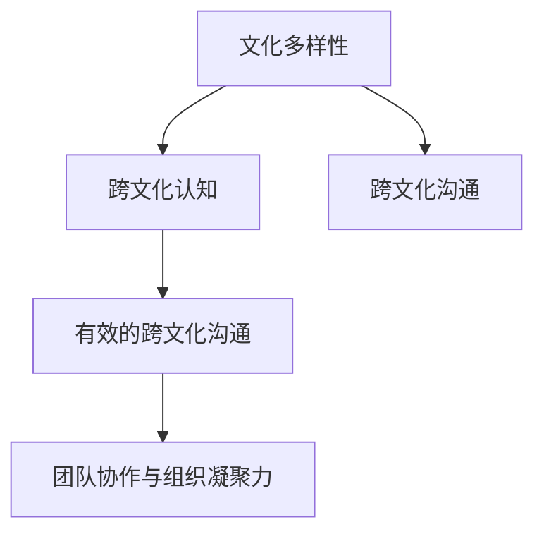
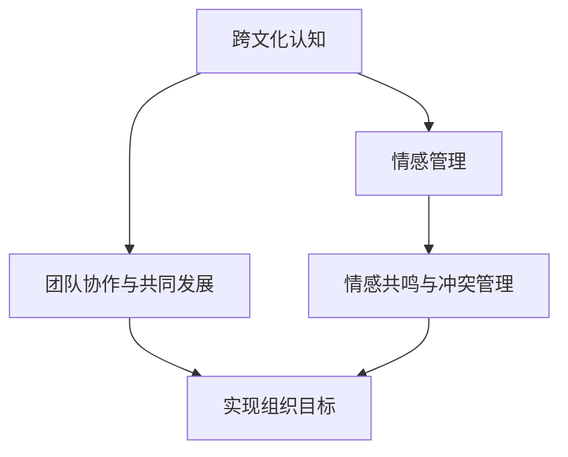

                 

### 背景介绍

在当今全球化迅猛发展的时代，跨文化领导力已成为企业、组织和国家发展不可或缺的核心能力。全球化不仅促进了经济、技术和信息的交流，也带来了文化、价值观和思维方式的碰撞与融合。在这一背景下，如何有效地进行跨文化领导，成为企业和领导者面临的重大挑战和机遇。

首先，全球化进程使得企业越来越需要在全球范围内运作，这意味着领导者需要处理来自不同文化背景的团队成员、合作伙伴和客户。这不仅要求领导者具备跨文化的认知和情感管理能力，还需要在沟通、团队合作和冲突解决方面展现出卓越的技能。例如，不同文化对于沟通风格、决策过程和领导方式的期望各不相同，领导者必须具备灵活应变的能力，以适应多元化的工作环境。

其次，随着跨国公司和国际合作的日益增多，企业面临着日益复杂的市场环境和竞争压力。在这种环境中，跨文化领导力能够帮助企业更好地理解和适应不同市场和文化，从而制定更有效的战略和决策。例如，谷歌、苹果和宝洁等全球知名企业，通过建立跨文化领导团队，不仅提升了内部管理效率，还成功开拓了国际市场，实现了全球业务的快速增长。

此外，全球化也带来了多样性和包容性的机遇。不同文化背景的员工能够为企业带来多元化的视角和创新思维，从而推动企业的持续发展。跨文化领导力能够促进团队成员之间的相互理解和尊重，建立高效的跨文化团队，激发每个人的潜能，实现团队的目标。

综上所述，跨文化领导力不仅是应对全球化挑战的必要手段，更是企业在全球竞争中立于不败之地的关键因素。因此，理解和掌握跨文化领导力的核心概念、理论和实践方法，对于现代领导者而言至关重要。本文将从理论基础、实践指南、案例分析以及能力提升等方面，系统性地探讨跨文化领导力的各个方面，旨在为读者提供全面而深入的洞察和实用指南。

### 核心概念与联系

在探讨跨文化领导力的核心概念之前，我们需要首先理解几个关键术语，包括文化、文化多样性、跨文化认知和跨文化沟通。

#### 文化

文化是指一个社会或群体的价值观、信念、行为模式、传统和规范的总和。文化不仅仅是一种外在的表现形式，更是深藏在人们内心的行为准则和价值取向。不同文化之间的差异主要体现在以下几个方面：

1. **价值观**：不同的文化有着不同的价值观，如个人主义与集体主义、权力距离、时间观念等。例如，西方文化强调个人主义和自主性，而东方文化则更强调集体利益和家庭责任。
2. **社会结构**：不同的文化有着不同的社会结构，如家庭、社区、国家和宗教等。这些结构对个体的行为和角色有着深远的影响。
3. **行为规范**：不同的文化有不同的行为规范，如礼仪、礼貌、交流和决策方式等。这些规范影响着人们在各种情境下的行为方式。

#### 文化多样性

文化多样性是指一个群体或组织中存在的多种文化背景。在全球化背景下，文化多样性已经成为现代组织的一个显著特征。文化多样性不仅体现在种族、国籍和语言上，还包括信仰、价值观和生活方式等方面。文化多样性带来了一系列的挑战和机遇：

1. **挑战**：
   - **沟通障碍**：由于语言、行为规范和价值观的差异，跨文化沟通可能存在误解和障碍。
   - **冲突**：文化差异可能导致价值观和行为规范的冲突，进而影响团队合作和决策。
   - **文化适应**：员工需要适应新的文化环境，这可能需要时间和努力。

2. **机遇**：
   - **多元化视角**：不同的文化背景可以带来多元化的视角和创新思维，有助于问题的解决和战略的制定。
   - **市场拓展**：了解和利用不同文化的特点，可以帮助企业更好地进入和适应国际市场。
   - **人才优势**：拥有多元文化背景的团队能够更好地理解和满足不同客户的需求，提高企业的竞争力。

#### 跨文化认知

跨文化认知是指领导者对不同文化背景的理解和认识。有效的跨文化认知要求领导者具备以下几个方面的能力：

1. **文化敏感性**：领导者需要具备对文化差异的敏感度，能够识别和尊重不同的文化价值观和行为规范。
2. **文化洞察力**：领导者需要深入了解不同文化的特点、传统和习俗，以便在跨文化环境中做出合适的决策。
3. **文化适应能力**：领导者需要能够灵活适应不同的文化环境，调整自己的行为和沟通方式，以适应多元化的团队和客户。

#### 跨文化沟通

跨文化沟通是指在跨文化背景下进行的交流和信息传递。有效的跨文化沟通需要领导者具备以下几个方面的技能：

1. **语言技能**：虽然语言不是跨文化沟通的唯一因素，但良好的语言技能对于理解对方意图、减少误解至关重要。
2. **非语言沟通**：包括肢体语言、面部表情和语调等。不同的文化对这些非语言信号的解读可能存在差异，领导者需要了解和适应这些差异。
3. **文化适应**：领导者需要能够根据不同文化的特点和价值观，调整自己的沟通策略，以确保信息的准确传递和有效理解。

#### 文化多样性、跨文化认知与跨文化沟通之间的关系

文化多样性、跨文化认知和跨文化沟通之间存在着密切的联系和相互作用：

1. **文化多样性是基础**：没有文化多样性，跨文化认知和跨文化沟通就没有必要和意义。
2. **跨文化认知是桥梁**：只有通过深入了解和认识不同文化，领导者才能进行有效的跨文化沟通。
3. **跨文化沟通是目标**：有效的跨文化沟通可以促进团队协作、增强组织凝聚力，实现组织目标。

为了更好地理解这三者之间的关系，我们可以通过以下Mermaid流程图来展示：

综上所述，文化多样性、跨文化认知和跨文化沟通是跨文化领导力的核心概念，它们共同构成了一个动态的、相互作用的系统。领导者需要在这三个方面不断提升自己，才能在全球化背景下取得成功。

### 跨文化领导理论发展

跨文化领导理论的发展历程可以追溯到20世纪中期，当时全球化的趋势开始显现，企业需要面对不同文化背景的员工和客户。在这一背景下，学者们开始研究如何有效地领导具有文化多样性的团队，并逐渐形成了一系列跨文化领导理论。以下将详细探讨跨文化领导理论的历史演进，包括初创期、发展期和现代期的理论框架。

#### 初创期：文化适应理论

在跨文化领导理论的初创期，学者们主要关注如何帮助领导者适应不同文化背景的环境。这一阶段的理论重点在于文化适应，即领导者如何从自己的文化背景中走出来，适应新的文化环境。

1. **文化冲击理论**：文化冲击理论（Culture Shock Theory）是这一阶段的重要理论之一。由 anthropologist Ruth Benedict 在其著作《文化模式》（Patterns of Culture，1934）中提出。该理论认为，当个体从一个熟悉的文化环境迁移到一个新的文化环境时，会经历一系列的心理反应，包括困惑、沮丧、焦虑和适应。文化冲击理论强调了文化差异对个体行为和心理健康的影响，为后续的跨文化领导研究奠定了基础。

2. **文化敏感性培训**：为了帮助领导者更好地适应跨文化环境，学者们提出了文化敏感性培训（Cultural Sensitivity Training）的概念。文化敏感性培训的目标是提高领导者的跨文化认知和情感管理能力，使其能够更有效地处理跨文化团队中的冲突和挑战。文化敏感性培训通常包括文化知识传授、模拟实践和反思讨论等环节。

#### 发展期：跨文化领导框架

随着跨文化领导研究的深入，学者们逐渐从文化适应转向跨文化领导的具体实践和策略。这一阶段形成了多个跨文化领导框架，为领导者提供了更系统的理论指导和实践方法。

1. **Stewart 和 Bennett 的跨文化领导模型**：1991年，Stewart 和 Bennett 提出了跨文化领导模型（Cultural Intelligence Model）。该模型认为，跨文化领导能力包括四个维度：认知维度（Cultural Knowledge）、情感维度（Cultural Drive）、技能维度（Cultural metacognition）和经验维度（Cultural Communication）。这一模型强调了领导者需要在不同文化背景下具备全面的能力，以实现有效的跨文化领导。

2. **Hofstede 的文化维度理论**：Geert Hofstede 的文化维度理论（Hofstede's Cultural Dimensions Theory）是这一阶段的重要理论之一。Hofstede 通过对63个国家的调查，提出了六个文化维度：权力距离、个体主义与集体主义、不确定性规避、长期取向与短期取向、刚性与柔性、男性化与女性化。这些维度为领导者提供了分析不同文化差异的工具，有助于制定跨文化战略。

#### 现代期：动态跨文化领导理论

现代跨文化领导理论更加注重领导者的动态适应能力和创新思维，强调在快速变化的全球环境中，领导者如何灵活应对各种挑战。

1. **布拉曼南-哈克曼的动态跨文化领导模型**：布拉曼南-哈克曼（Braman and Hocker）的动态跨文化领导模型提出了三个关键要素：文化认知、文化适应和文化创新。该模型认为，领导者需要不断更新自己的文化知识，灵活适应不同的文化环境，并鼓励团队成员进行文化创新，以保持组织的活力和竞争力。

2. **科的动态跨文化领导模型**：科（Cole）的动态跨文化领导模型强调领导者需要具备全球视野和本土化策略。该模型提出了“全球思维，本地行动”的原则，即领导者需要在全球化背景下，保持对全球趋势的敏锐洞察，同时根据本地市场的特点，制定合适的领导策略。

#### 跨文化领导理论的发展趋势

当前，跨文化领导理论的发展呈现出以下几个趋势：

1. **综合性**：现代跨文化领导理论不再局限于单一的理论框架，而是整合了多个学科的理论和方法，如心理学、管理学、社会学等，形成了更为综合的跨文化领导理论体系。

2. **实践性**：随着跨文化领导实践的不断积累，学者们更加注重理论的实际应用，通过实证研究验证理论的有效性，为领导者提供更具操作性的指导。

3. **动态性**：在全球化背景下，领导者需要具备动态适应能力，能够快速应对不断变化的文化环境。现代跨文化领导理论更加注重领导者的创新能力，鼓励领导者探索新的领导模式和策略。

4. **多元性**：随着全球化和数字化的发展，跨文化领导面临的挑战和机遇更加多元。现代跨文化领导理论强调领导者需要具备多元化的视角和技能，以应对复杂多变的国际环境。

总之，跨文化领导理论的发展是一个不断演进的过程，随着全球化进程的加速，领导者需要不断更新自己的知识和技能，以适应不断变化的跨文化环境。通过理解不同阶段的跨文化领导理论，领导者可以更好地应对全球化带来的挑战和机遇，实现组织的可持续发展。

### 跨文化认知与情感管理

在跨文化领导中，认知与情感管理是两大核心要素。领导者不仅需要具备对多元文化的认知能力，还需要有效地管理自己的情感，以便在跨文化环境中实现有效的领导。

#### 认知多样性的理解

认知多样性的理解是跨文化认知的核心。它涉及到领导者如何识别、理解和尊重不同文化之间的差异。以下是几个关键点：

1. **文化相对论**：文化相对论认为，不同的文化有其独特的逻辑和价值观，没有绝对的“对”或“错”。领导者需要摒弃文化偏见，以开放的心态去理解和尊重不同的文化。

2. **文化敏感性**：文化敏感性是指领导者对文化差异的感知和反应能力。这包括对语言、习俗、礼仪、价值观等方面的敏感度。领导者需要通过文化敏感性培训，提升自己对不同文化的认知能力。

3. **文化比较分析**：通过文化比较分析，领导者可以更深入地了解不同文化的特点，包括其价值观、行为规范和社会结构。这种方法有助于领导者制定更有效的跨文化战略。

#### 情感管理

情感管理是跨文化领导中的另一大挑战。领导者需要具备良好的情感管理能力，以应对跨文化环境中的各种情感波动。以下是几个关键点：

1. **情感智商**：情感智商（Emotional Intelligence，EQ）是指个体识别、理解和管理自己和他人的情感能力。高情感智商的领导者能够更好地应对跨文化领导中的情感挑战，包括处理文化冲突、建立信任关系和激励团队成员。

2. **文化情感共鸣**：文化情感共鸣是指领导者能够理解和感受团队成员的情感状态，并与他们产生共鸣。这需要领导者具备较高的文化认知能力和情感智商，能够站在团队成员的角度思考问题。

3. **冲突管理**：跨文化冲突是不可避免的，领导者需要具备有效的冲突管理能力，以和平解决冲突，避免进一步的矛盾升级。这包括倾听、沟通、妥协和寻求共识等策略。

#### 跨文化认知与情感管理之间的关系

跨文化认知与情感管理之间存在密切的关系，两者相辅相成，共同构成了有效的跨文化领导力。

1. **相互促进**：有效的跨文化认知有助于领导者更好地理解团队成员的情感状态，从而进行有效的情感管理。同时，良好的情感管理能力也有助于领导者提升对多元文化的认知，促进跨文化团队的协作。

2. **共同目标**：跨文化认知与情感管理的最终目标是实现跨文化团队的协作和共同发展。通过提升认知和情感管理能力，领导者可以更好地协调团队成员的关系，激发团队的潜力，实现组织目标。

3. **动态平衡**：跨文化认知与情感管理需要动态平衡。领导者需要在不同的情境下，根据具体的文化差异和情感需求，灵活调整自己的认知和情感管理策略，以实现最佳效果。

为了更好地理解跨文化认知与情感管理之间的关系，我们可以通过以下Mermaid流程图来展示：

综上所述，跨文化认知与情感管理是跨文化领导力的核心要素，领导者需要在这两个方面不断提升自己，才能在全球化背景下实现有效的领导。

### 跨文化沟通技巧

在跨文化领导中，沟通技巧是确保团队协作和目标实现的关键。不同的文化背景对沟通方式有着显著的影响，领导者需要具备跨文化沟通技巧，以在多元化的团队中有效传达信息和达成共识。

#### 语言与非语言沟通

语言沟通是跨文化沟通的基础，但非语言沟通同样重要。以下是一些关键点：

1. **语言沟通**：
   - **语言障碍**：不同语言的语法、词汇和表达方式可能存在差异，这可能导致误解和信息传递不畅。领导者需要学习必要的第二语言，并了解不同语言的文化背景。
   - **翻译技巧**：在跨文化沟通中，翻译是必不可少的。领导者需要选择合适的翻译人员，确保信息的准确传达。同时，领导者应关注翻译的语境和文化差异，避免产生误解。

2. **非语言沟通**：
   - **肢体语言**：肢体语言在不同文化中可能具有不同的含义。例如，握手在不同文化中可能代表着不同的含义，如尊重、友好或商业合作。领导者需要了解和尊重这些差异。
   - **面部表情**：面部表情在不同文化中也可能存在差异。例如，微笑在某些文化中可能表示友好，而在另一些文化中可能表示尴尬或无奈。领导者需要通过观察和了解，准确解读面部表情。

#### 文化差异对沟通的影响

文化差异对沟通的影响主要体现在以下几个方面：

1. **沟通风格**：
   - **直接与间接沟通**：不同文化对于沟通的直接性和间接性有不同的偏好。例如，西方文化倾向于直接沟通，而东方文化则更偏好间接沟通。领导者需要根据不同文化的特点，调整沟通方式，以实现有效沟通。

2. **时间观念**：
   - **时间敏感性**：不同文化对时间的敏感度不同。一些文化非常重视时间，认为守时是基本的职业素养，而另一些文化则相对宽松。领导者需要了解和尊重不同文化的时间观念，以避免沟通中的误解和冲突。

3. **决策过程**：
   - **个体决策与集体决策**：不同文化在决策过程中可能表现出不同的风格。一些文化倾向于个体决策，而另一些文化则更注重集体决策。领导者需要了解这些差异，并在决策过程中进行适当的调整。

#### 提高跨文化沟通技巧的方法

为了提高跨文化沟通技巧，领导者可以采取以下方法：

1. **文化培训**：领导者可以参加跨文化沟通培训，了解不同文化的沟通特点，学习有效的沟通策略。

2. **交流实践**：通过实际交流实践，领导者可以提升跨文化沟通能力。这包括与来自不同文化背景的团队成员进行交流，参与跨文化团队项目等。

3. **反思与总结**：在跨文化沟通后，领导者应进行反思和总结，识别沟通中的不足，并制定改进措施。

4. **借助工具**：利用跨文化沟通工具，如翻译软件、在线沟通平台等，可以帮助领导者更有效地进行跨文化沟通。

#### 实例分析

以下是一个实例，说明如何通过跨文化沟通技巧解决沟通障碍：

**情境**：一家中国公司（C公司）与一家美国公司（A公司）进行业务合作。C公司的沟通风格相对直接，而A公司的沟通风格则相对间接。

**解决方案**：
1. **明确沟通目标**：在合作初期，双方明确了合作目标和期望，并通过邮件等方式进行了详细的沟通，确保信息传递的准确性。
2. **文化培训**：双方公司的领导层参加了跨文化沟通培训，了解了对方的沟通风格和习惯。
3. **调整沟通方式**：在具体沟通过程中，C公司的领导层尽量使用更间接的表达方式，而A公司的领导层则尽量明确表达意图，以减少误解。
4. **定期会议**：双方定期举行线上和线下会议，确保沟通的持续和有效。

通过上述措施，C公司和A公司成功解决了跨文化沟通中的障碍，实现了高效的合作。

总之，跨文化沟通技巧是跨文化领导力的重要组成部分。领导者需要不断提升自己的语言和非语言沟通能力，了解和尊重不同文化的差异，采取有效的沟通策略，以实现跨文化团队的协作和目标实现。

### 跨文化团队建设

在全球化背景下，跨文化团队建设成为企业成功的关键因素之一。一个高效的跨文化团队不仅能够发挥多元化优势，提高创新能力和决策质量，还能增强组织的适应能力和竞争力。然而，跨文化团队建设也面临着诸多挑战，如文化冲突、沟通障碍和团队凝聚力不足等。以下将探讨跨文化团队的挑战、建立有效的跨文化团队策略以及跨文化团队领导者的角色。

#### 跨文化团队的挑战

1. **文化冲突**：文化冲突是跨文化团队建设中最常见的挑战之一。不同文化在价值观、行为规范和工作方式上可能存在显著差异，导致团队成员在沟通、协作和决策过程中出现摩擦和误解。例如，在一些文化中，决策过程可能更注重集体讨论和共识，而在另一些文化中，决策可能更倾向于迅速执行和自主行动。

2. **沟通障碍**：跨文化团队中，由于语言障碍、沟通风格差异以及文化习惯的不同，沟通效率和质量可能受到影响。团队成员可能难以理解对方的意图和需求，导致沟通不畅和信息误传，进而影响团队协作和项目进度。

3. **信任与认同**：在跨文化团队中，建立信任和认同感是一个重要挑战。不同文化背景的团队成员可能在价值观、行为习惯和工作期望上存在差异，这可能导致团队成员之间的不信任和误解。例如，一些文化中可能更重视等级和权威，而另一些文化中则更注重平等和自主。

4. **时间管理**：不同文化对时间的管理观念可能存在差异。例如，一些文化可能更重视按时完成任务，而另一些文化则可能更注重灵活安排工作时间和处理紧急事务。这种差异可能导致团队在项目管理和时间安排上出现冲突和困惑。

#### 建立有效的跨文化团队策略

1. **文化敏感性培训**：为了帮助团队成员更好地理解和适应不同文化，企业可以提供文化敏感性培训。这种培训可以包括文化差异的知识传授、文化沟通技巧的培训以及文化冲突解决的策略等。通过培训，团队成员可以提升跨文化认知和情感管理能力，减少误解和冲突。

2. **明确团队目标和角色**：建立明确的团队目标和角色定义对于跨文化团队的成功至关重要。团队目标应该具体、可衡量，并确保所有团队成员都清晰了解。同时，团队成员的角色和责任应该明确划分，以确保每个成员都能发挥自己的优势，并为团队的成功做出贡献。

3. **促进有效沟通**：为了提高跨文化团队的沟通效率，企业可以采取以下措施：
   - **语言支持**：提供多语言支持和翻译服务，确保所有团队成员都能顺畅沟通。
   - **开放沟通**：鼓励团队成员开放表达意见，建立信任和开放的沟通氛围。
   - **定期的沟通会议**：定期举行沟通会议，确保团队成员能够及时了解项目进展和团队成员的需求。

4. **建立团队文化**：通过共同的价值观和行为规范，企业可以建立一种团队文化，促进团队成员之间的相互理解和尊重。这种文化应该强调合作、包容和创新，以增强团队的凝聚力和协作精神。

5. **灵活的管理风格**：领导者应该根据不同团队成员的文化背景和需求，灵活调整管理风格。例如，对一些文化背景的团队成员，领导者可能需要更注重沟通和支持，而对另一些文化背景的团队成员，领导者可能需要更强调目标和结果。

#### 跨文化团队领导者的角色

跨文化团队领导者扮演着至关重要的角色，他们需要具备以下几方面的能力：

1. **文化认知与敏感性**：领导者需要具备对多元文化的认知和敏感性，能够理解并尊重不同文化背景的团队成员。

2. **冲突管理**：领导者需要具备有效的冲突管理能力，能够识别和解决跨文化团队中的冲突，以维护团队的和谐和高效运作。

3. **沟通协调**：领导者需要具备出色的沟通协调能力，能够促进团队成员之间的有效沟通，确保信息的准确传递和团队的协作。

4. **激励与支持**：领导者需要能够激励和支持团队成员，了解他们的需求和心理状态，提供必要的帮助和支持。

5. **决策与领导**：领导者需要在跨文化团队中做出明智的决策，并展现出卓越的领导能力，以引导团队朝着共同的目标前进。

通过上述策略和领导者的努力，跨文化团队可以克服挑战，发挥多元化优势，实现高效运作和持续发展。

### 跨文化领导架构

跨文化领导架构是确保跨文化领导实践有效性的关键。一个良好的跨文化领导架构包括领导力模型、跨文化领导力的层次和维度、以及领导者的个人特质和组织文化的支持。以下将详细探讨这些方面，并介绍常用的跨文化领导模型。

#### 跨文化领导力模型

1. **布拉曼南-哈克曼的动态跨文化领导模型**：布拉曼南-哈克曼提出的动态跨文化领导模型强调跨文化领导力的三个关键要素：文化认知、文化适应和文化创新。该模型认为，领导者需要具备对多元文化的深刻认知，能够灵活适应不同的文化环境，并鼓励团队成员进行文化创新，以应对快速变化的全球环境。

2. **科的动态跨文化领导模型**：科提出的动态跨文化领导模型强调领导者需要具备全球视野和本土化策略。该模型提出了“全球思维，本地行动”的原则，即领导者需要在全球化背景下，保持对全球趋势的敏锐洞察，同时根据本地市场的特点，制定合适的领导策略。

3. **布拉曼南的全球领导模型**：布拉曼南的全球领导模型包括四个关键维度：文化认知、全球竞争力、战略思维和创新领导。该模型认为，领导者需要具备全面的能力，以在全球环境中实现有效的领导。

#### 跨文化领导力的层次与维度

1. **个人层次**：在个人层次，跨文化领导力包括领导者的文化认知、情感管理、沟通能力和自我反思能力。领导者需要具备对多元文化的深刻理解，能够识别和尊重不同的文化价值观和行为规范，并具备有效的情感管理和沟通技巧，以在跨文化环境中建立信任和合作关系。

2. **团队层次**：在团队层次，跨文化领导力涉及团队建设、冲突管理和团队激励。领导者需要能够建立多元化的团队，促进团队成员之间的有效沟通和合作，解决文化冲突，并激励团队成员发挥最大潜力。

3. **组织层次**：在组织层次，跨文化领导力包括组织文化、战略规划和全球运营。领导者需要营造一个包容和多元化的组织文化，制定全球化的战略规划，并确保组织在全球范围内的有效运营。

#### 领导者的个人特质

1. **开放心态**：领导者需要具备开放的心态，能够接受和尊重不同的文化价值观和行为规范，并对多元文化保持好奇心和探索精神。

2. **自我反思**：领导者需要具备自我反思的能力，能够不断审视自己的行为和决策，识别和纠正跨文化领导中的不足。

3. **灵活性**：领导者需要具备灵活性，能够根据不同的文化环境和工作需求，调整自己的领导风格和策略。

4. **同理心**：领导者需要具备同理心，能够理解和感受团队成员的情感状态，并与他们建立情感联系。

#### 组织文化的支持

1. **包容文化**：组织文化需要强调包容和尊重，鼓励团队成员分享不同的观点和经验，建立相互尊重和信任的团队氛围。

2. **多元化政策**：组织应制定多元化政策，包括招聘、培训和发展等方面，以确保组织能够吸引和留住来自不同文化背景的优秀人才。

3. **领导力培养**：组织应提供跨文化领导力培训和发展机会，帮助领导者提升跨文化认知和沟通能力，以应对全球化挑战。

通过建立有效的跨文化领导架构，领导者可以在全球化背景下实现高效的跨文化领导，促进组织的可持续发展。跨文化领导力模型、领导者的个人特质和组织的支持共同构成了一个动态的、相互作用的系统，为跨文化领导提供了坚实的基础。

### 跨文化领导力在组织中的应用

在全球化背景下，组织需要具备跨文化领导力，以应对多元化团队和市场的挑战。跨文化领导力在组织中的应用涵盖了战略制定、团队管理和领导力发展等多个方面，以下是具体的应用策略和方法。

#### 制定跨文化战略

1. **文化敏感性评估**：组织应首先进行文化敏感性评估，了解不同文化背景的员工和客户的特点和需求。这可以通过问卷调查、焦点小组讨论和员工访谈等方式进行。通过评估，组织可以识别出需要重点关注的文化差异，为后续的战略制定提供依据。

2. **跨文化战略规划**：基于文化敏感性评估的结果，组织应制定跨文化战略规划。这包括明确跨文化领导的目标、制定跨文化政策、分配资源和制定实施计划等。跨文化战略应与组织的整体战略相结合，以确保跨文化领导力能够支持组织的长期发展。

3. **跨文化培训计划**：组织应制定跨文化培训计划，提高员工的跨文化认知和沟通能力。培训内容可以包括文化差异、跨文化沟通技巧、文化冲突管理以及跨文化团队建设等。通过培训，员工可以更好地适应跨文化环境，提高工作效率和团队协作能力。

#### 跨文化团队管理

1. **多元化团队组建**：组织应组建多元化的团队，确保团队成员具有不同的文化背景和专业知识。多元化团队能够带来多元化的视角和创新思维，有助于解决复杂问题和制定创新的解决方案。

2. **团队建设与沟通**：组织应加强团队建设，促进团队成员之间的相互了解和信任。这可以通过定期的团队活动、团队建设培训和跨文化沟通工作坊等方式实现。有效的沟通是跨文化团队成功的关键，组织应提供多语言支持和翻译服务，确保团队成员能够顺畅沟通。

3. **文化冲突管理**：组织应建立有效的文化冲突管理机制，及时识别和解决文化冲突。这可以通过建立冲突解决委员会、开展冲突管理培训和制定冲突解决流程等方式实现。领导者应积极参与冲突解决过程，确保冲突得到妥善处理，避免对团队绩效和员工士气产生负面影响。

#### 领导力发展

1. **跨文化领导力培养**：组织应提供跨文化领导力培训和发展机会，帮助领导者提升跨文化认知和沟通能力。这可以通过领导力发展项目、国际交换计划和跨文化领导力工作坊等方式实现。通过培养跨文化领导力，组织可以提升领导者的全球视野和适应能力，确保他们在多元化团队中有效领导。

2. **领导力评估与反馈**：组织应定期对领导者的跨文化领导力进行评估和反馈，识别领导者的优势和不足，并制定个性化的领导力发展计划。评估和反馈可以通过员工调查、360度评估和领导力发展研讨会等方式进行。

3. **领导力传承**：组织应建立领导力传承机制，确保跨文化领导力能够持续传承和提升。这可以通过领导力导师计划、领导力继任计划和领导力发展社区等方式实现。通过传承领导力，组织可以确保跨文化领导力的持续发展和组织文化的传承。

#### 跨文化战略实施案例分析

以下是一个跨文化战略实施的案例分析：

**案例：跨国公司A公司的跨文化战略**

**背景**：跨国公司A公司是一家全球运营的科技公司，其员工和客户来自不同的文化背景。为了提升跨文化领导力，A公司制定了详细的跨文化战略。

**策略**：
1. **文化敏感性评估**：A公司通过问卷调查和员工访谈，了解不同文化背景的员工和客户的特点和需求。
2. **跨文化战略规划**：基于评估结果，A公司制定了跨文化战略规划，包括多元化团队组建、跨文化培训计划和文化冲突管理机制。
3. **跨文化团队建设**：A公司组建了多元化的团队，并定期组织团队建设活动和跨文化沟通工作坊，提高团队成员之间的相互了解和信任。
4. **跨文化领导力培养**：A公司提供了跨文化领导力培训和发展机会，帮助领导者提升跨文化认知和沟通能力。

**效果**：通过实施跨文化战略，A公司成功提升了团队的协作效率和创新力，增强了在全球市场的竞争力。员工和客户的满意度也显著提高，公司业绩实现了持续增长。

综上所述，跨文化领导力在组织中的应用是一个系统性的过程，涉及战略制定、团队管理和领导力发展等多个方面。通过有效的跨文化战略实施，组织可以应对全球化挑战，实现可持续发展。

### 全球知名企业的跨文化领导实践

在全球化的背景下，许多知名企业通过跨文化领导实践，成功实现了业务的全球化扩展和持续增长。以下将分析谷歌和宝洁这两家公司的跨文化领导实践，探讨它们在全球市场中取得成功的关键因素。

#### 谷歌的跨文化领导实践

谷歌（Google）作为全球科技巨头，其跨文化领导实践在全球范围内广受赞誉。谷歌在跨文化领导方面的成功主要得益于其多元化的企业文化、全球人才战略以及跨文化团队管理。

1. **多元化的企业文化**：谷歌一直强调多元化和包容性，这一理念贯穿于公司的核心价值观和行为准则中。谷歌鼓励员工分享不同的观点和经验，认为多样性是创新和发展的关键。谷歌的工作环境非常开放，员工可以自由表达自己的意见，这种文化氛围促进了跨文化团队的协作和创新。

2. **全球人才战略**：谷歌通过全球人才战略，吸引和保留来自不同文化背景的顶尖人才。谷歌在全球范围内设立了多个研发中心和办事处，通过本地化的招聘策略，吸纳了不同文化背景的员工。这些员工不仅为谷歌带来了多元化的视角，还帮助谷歌更好地理解和服务全球客户。

3. **跨文化团队管理**：谷歌注重跨文化团队的建设和管理，通过定期的团队培训和跨文化沟通工作坊，提升员工的跨文化认知和沟通能力。谷歌的领导团队也积极参与跨文化培训，确保他们在全球化背景下能够有效领导多元化的团队。

#### 宝洁的跨文化领导实践

宝洁（Procter & Gamble，简称P&G）作为全球最大的消费品公司之一，其跨文化领导实践为其在全球市场中的成功发挥了重要作用。

1. **国际化运营模式**：宝洁采用了一种国际化的运营模式，通过在全球范围内设立分支机构，与当地市场紧密合作，制定适合当地市场的产品策略和营销策略。这种模式使得宝洁能够更好地理解不同市场的需求和文化特点，从而实现全球业务的快速增长。

2. **跨文化领导团队**：宝洁重视跨文化领导团队的建设，通过选拔和培养具有跨文化领导能力的领导者，确保他们能够在全球化背景下有效领导多元化的团队。宝洁的领导团队由来自不同文化背景的成员组成，他们不仅具备丰富的行业经验，还具备深厚的跨文化领导能力。

3. **文化适应性培训**：宝洁为员工提供文化适应性培训，帮助他们更好地适应不同文化环境。这种培训包括文化差异的认知、跨文化沟通技巧以及文化冲突的解决策略等。通过培训，员工可以提升跨文化认知和沟通能力，更好地适应全球化工作环境。

#### 案例总结

谷歌和宝洁的跨文化领导实践为我们提供了宝贵的经验：

1. **多元化的企业文化**：企业应重视多元化和包容性，营造开放和包容的工作环境，鼓励员工分享不同的观点和经验。

2. **全球人才战略**：企业应通过全球人才战略，吸引和保留多元化的人才，为全球化业务提供有力支持。

3. **跨文化团队管理**：企业应注重跨文化团队的建设和管理，通过培训和沟通工作坊提升员工的跨文化认知和沟通能力。

4. **国际化运营模式**：企业应采用国际化的运营模式，与全球市场紧密合作，制定适合当地市场的产品策略和营销策略。

总之，谷歌和宝洁的跨文化领导实践证明了在全球化背景下，企业通过有效的跨文化领导，可以实现全球业务的快速增长和持续发展。

### 跨文化领导力的自我提升

在全球化背景下，跨文化领导力的自我提升变得尤为重要。领导者需要不断学习、实践和反思，以提高跨文化认知、情感管理能力和沟通技巧。以下将从自我评估、学习策略和实践方法等方面，探讨如何提升跨文化领导力。

#### 自我评估

自我评估是提升跨文化领导力的第一步。领导者可以通过以下工具和方法进行自我评估：

1. **跨文化领导能力自我评估表**：这是一种结构化的工具，可以帮助领导者识别自己在跨文化领导方面的优势和不足。评估表可以涵盖以下方面：
   - 文化认知：对多元文化的理解程度和敏感性。
   - 情感管理：管理自身和团队成员情感的能力。
   - 沟通技巧：跨文化沟通的技巧和有效性。
   - 冲突管理：解决跨文化冲突的策略和技能。

2. **360度反馈**：通过收集来自同事、下属和上级的反馈，领导者可以全面了解自己在跨文化领导方面的表现和改进方向。360度反馈可以提供多角度的视角，有助于领导者发现自己的盲点和提升空间。

3. **反思日记**：领导者可以定期记录自己的跨文化领导经历，反思成功和失败的原因，从中吸取经验和教训。反思日记可以帮助领导者持续提升自己的跨文化领导力。

#### 学习策略

提升跨文化领导力需要系统的学习和策略。以下是一些有效的方法：

1. **跨文化领导力课程**：参加专业的跨文化领导力课程，可以系统地学习跨文化理论、实践方法和案例分析。这些课程通常包括讲座、研讨、模拟练习和案例研究等，有助于提高领导者的跨文化认知和技能。

2. **在线学习资源**：利用在线学习平台，如Coursera、edX等，可以学习到全球顶尖大学的跨文化领导课程。这些平台提供了丰富的在线课程和资料，方便领导者随时随地学习。

3. **阅读相关书籍**：阅读关于跨文化领导、国际管理、多元文化团队等方面的书籍，可以深入了解跨文化领导的理论和实践。一些经典书籍，如《跨文化沟通》（Communicating Across Cultures）、《全球领导力》（Global Leadership: The Next Challenge）等，都是值得推荐的学习资源。

#### 实践方法

理论学习是基础，但实践才是提升跨文化领导力的关键。以下是一些实践方法：

1. **参与跨文化团队**：主动参与跨文化团队项目，可以在实际工作中提升跨文化沟通和协作能力。通过实践，领导者可以学会如何在多元化的团队中建立信任、协调资源和解决冲突。

2. **国际交流与实习**：利用国际交流项目或实习机会，到国外工作和生活，可以直接体验不同的文化环境，提升跨文化认知和适应性。这种实际经验对于培养跨文化领导力至关重要。

3. **文化适应性训练**：参加文化适应性训练，如语言课程、跨文化沟通工作坊和文化沉浸项目等，可以帮助领导者更好地理解和适应不同文化。通过这些训练，领导者可以提升跨文化沟通技巧和文化敏感性。

4. **反思与总结**：在实践中，领导者应不断反思和总结自己的跨文化领导经历，识别成功和失败的原因，并制定改进措施。通过持续的反思和总结，领导者可以不断提升自己的跨文化领导力。

#### 从文化适应到文化融合

提升跨文化领导力是一个逐步的过程，从文化适应到文化融合。以下是一个具体的案例，展示如何实现这一过程：

**案例：某跨国公司的项目经理**

- **文化适应阶段**：项目经理John最初在跨国项目中遇到了文化冲突和沟通障碍。他通过参加文化适应性培训，了解到了不同文化的工作风格和沟通习惯。他开始调整自己的沟通方式，以适应团队的文化差异。

- **文化融合阶段**：随着项目的推进，John开始积极参与团队的讨论和决策过程，分享自己的经验和观点。他逐渐学会了如何在不同文化背景下，调动团队成员的积极性，激发创新思维。最终，John成功带领团队完成了项目，并获得了团队成员的认可和信任。

通过这个案例，我们可以看到，从文化适应到文化融合是一个逐步的过程，需要领导者在实践中不断学习和调整。通过自我评估、学习策略和实践方法，领导者可以不断提升自己的跨文化领导力，实现全球化背景下的成功领导。

### 跨文化领导力的最佳实践、小结与注意事项

#### 最佳实践

在跨文化领导力的实践中，一些最佳方法已被证明是有效的。以下是一些关键的最佳实践：

1. **文化敏感性培训**：定期为员工提供文化敏感性培训，帮助团队成员了解不同文化的特点，提升跨文化认知和沟通能力。

2. **建立多元化的团队**：组建具有多元化背景的团队，可以带来多样化的视角和思维方式，促进创新和团队协作。

3. **开放沟通与反馈**：鼓励团队成员开放地沟通和分享意见，建立反馈机制，及时解决跨文化冲突。

4. **全球领导力发展计划**：为领导者提供全球领导力发展机会，如国际交换项目、跨文化工作坊和领导力培训等，提升其跨文化领导能力。

5. **文化适应性演练**：通过模拟不同文化环境下的工作场景，让领导者体验和练习跨文化沟通和协作，提高实际操作能力。

#### 小结

跨文化领导力是全球化时代领导者必备的技能。通过文化敏感性培训、多元化团队建设、开放沟通和全球领导力发展计划，领导者可以在跨文化环境中有效领导团队，实现组织目标。理解和尊重文化差异，提升跨文化认知和情感管理能力，是成功跨文化领导的关键。

#### 注意事项

在提升跨文化领导力时，领导者应注意以下几点：

1. **避免文化偏见**：摒弃文化偏见，以客观、公正的态度对待不同文化。

2. **灵活应对**：根据不同文化环境的特点，灵活调整领导策略，以适应不同文化背景的团队和客户。

3. **持续学习**：跨文化领导力是一个不断发展的过程，领导者需要持续学习和实践，以不断提升自己的能力。

4. **尊重多样性**：尊重团队成员的多样性，鼓励他们发挥各自的优势，共同为组织目标努力。

通过遵循这些最佳实践和注意事项，领导者可以在全球化背景下，有效提升跨文化领导力，实现组织在全球市场的成功。

### 附录

#### 相关资源与拓展阅读

1. **《跨文化管理》** - 作者：霍夫斯塔德（Geert Hofstede）
   - 简介：本书是跨文化管理领域的经典之作，详细介绍了文化差异对组织行为和沟通的影响。

2. **《全球领导力》** - 作者：科勒（R. E. Cole）
   - 简介：本书从理论和实践角度探讨了全球领导力的各个方面，为领导者提供了有效的指导。

3. **《文化多样性与企业》** - 作者：斯图尔特（Michael H. Stewart）和本内特（Michael J. Bennett）
   - 简介：本书深入探讨了文化多样性对企业的影响，以及如何通过有效的领导策略来管理多元化团队。

4. **《跨文化沟通》** - 作者：特鲁贝克（Judith T. Trubeck）
   - 简介：本书介绍了跨文化沟通的基本原则和技巧，帮助领导者提高跨文化沟通的有效性。

5. **《全球化时代的领导力》** - 作者：布拉曼南（T. R. Braman）
   - 简介：本书从全球化背景出发，探讨了领导者在全球化环境中面临的挑战和机遇。

#### 推荐阅读书目

1. **《跨国公司文化与管理》** - 作者：安德森（John H. Anderson）
   - 简介：本书详细分析了跨国公司的文化和管理模式，为领导者提供了实用的策略和案例。

2. **《文化冲突与跨文化管理》** - 作者：克里斯汀森（Ingrid Dauber-Kitsikis）
   - 简介：本书探讨了文化冲突的原因和解决方法，以及如何通过有效的跨文化管理策略来减少冲突。

3. **《全球化与领导力》** - 作者：米尔斯（John Miles）
   - 简介：本书从全球化视角出发，探讨了领导者的角色和职责，以及如何在全球化背景下实现有效领导。

#### 跨文化领导力实践工具

1. **文化地图工具**：用于帮助领导者识别和描述不同文化的特点，以便在跨文化环境中进行有效的领导。

2. **跨文化沟通模拟器**：通过模拟不同文化背景下的沟通场景，帮助领导者练习和提升跨文化沟通技巧。

3. **文化敏感性量表**：用于评估领导者的跨文化认知和敏感性，为领导力的提升提供数据支持。

通过以上资源和拓展阅读，读者可以进一步深入了解跨文化领导力的理论和实践，提升自身的跨文化领导能力。附录部分提供了丰富的参考资料和实践工具，旨在为读者提供全面的指导和支持。

