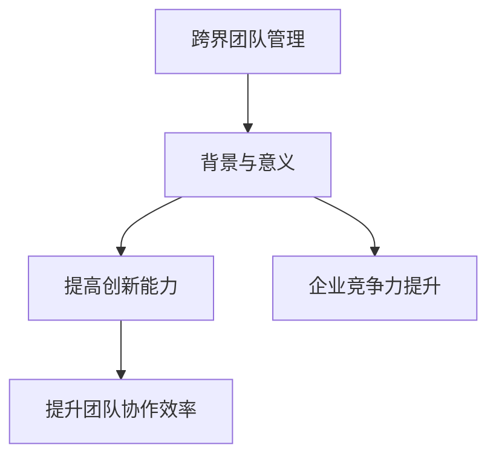
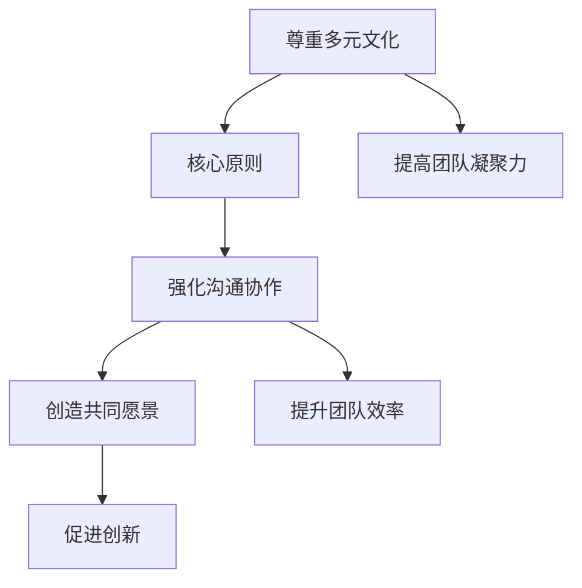

                 

为了撰写这篇《跨界团队管理：整合多领域专家的艺术》的文章，我们将逐步分解每一个章节的内容，确保文章的逻辑性、深度和完整性。以下是详细的思考和写作步骤：

### 标题、关键词和摘要

**标题：《跨界团队管理：整合多领域专家的艺术》**

**关键词：跨界团队管理，多领域专家，整合，团队协作，创新，沟通，领导力**

**摘要：本文探讨了跨界团队管理的背景、原则、实践以及未来展望。通过分析跨界团队的特点和挑战，本文提出了一系列管理策略和实践案例，旨在帮助管理者有效地整合多领域专家，提高团队效率和创新能力。**

### 第一部分：跨界团队管理基础

**第1章：跨界团队管理的背景与意义**

**思考步骤：**

1. **背景介绍**：介绍跨界团队的兴起原因，如全球化、技术创新、行业竞争等。
2. **意义阐述**：阐述跨界团队管理的重要性，如提高创新能力、提升团队协作效率等。
3. **核心概念与联系**：使用Mermaid流程图展示跨界团队管理中的核心概念及其相互关系。

**内容撰写：**

- **背景介绍**：随着科技的快速发展，企业面临着跨界整合的需求。跨界团队成为企业应对复杂问题、提高竞争力的重要手段。
- **意义阐述**：跨界团队能够汇聚不同领域的专业知识，促进知识的交叉融合，从而提高团队的创新能力。
- **Mermaid流程图**：

**第2章：跨界团队管理的基本原则**

**思考步骤：**

1. **核心原则概述**：总结跨界团队管理的基本原则。
2. **原则详细解释**：分别阐述每个原则的具体内容。
3. **原则联系与架构**：使用Mermaid流程图展示各个原则之间的联系。

**内容撰写：**

- **核心原则概述**：跨界团队管理应遵循尊重多元文化、强化沟通协作、创造共同愿景等原则。
- **原则详细解释**：
  - **尊重多元文化**：鼓励团队成员发挥各自的专长，尊重不同文化和专业背景。
  - **强化沟通协作**：建立有效的沟通机制，确保团队成员能够充分交流，共享信息。
  - **创造共同愿景**：明确团队的目标和愿景，确保所有成员为之努力。
- **Mermaid流程图**：

**第3章：跨界团队的构建与优化**

**思考步骤：**

1. **构建流程**：详细描述跨界团队的构建步骤。
2. **成员选拔与培养**：讨论如何选拔和培养跨界团队成员。
3. **团队优化策略**：提出优化跨界团队的策略和方法。

**内容撰写：**

- **构建流程**：包括明确团队目标、招募多领域专家、制定团队章程和开展团队建设活动。
- **成员选拔与培养**：选拔标准应包括专业技能、跨学科背景和团队合作能力。培养策略包括跨学科培训、实践锻炼和导师指导。
- **团队优化策略**：优化组织结构、完善激励机制和培育团队文化。

**第4章：跨界团队的沟通与协作**

**思考步骤：**

1. **沟通挑战**：分析跨界团队沟通中可能遇到的挑战。
2. **协作机制**：探讨如何建立有效的协作机制。
3. **工具与方法**：介绍适用于跨界团队的沟通协作工具和方法。

**内容撰写：**

- **沟通挑战**：文化差异、专业术语障碍和信息不对称。
- **协作机制**：明确沟通目标、建立有效沟通渠道、定期召开团队会议。
- **工具与方法**：项目管理工具、沟通协作平台和跨学科知识图谱。

**第5章：跨界团队的创新与成长**

**思考步骤：**

1. **创新思维**：探讨跨界团队的创新思维方式。
2. **学习与发展**：讨论如何促进跨界团队的学习与发展。
3. **成长路径**：分析跨界团队的成长路径。

**内容撰写：**

- **创新思维**：横向思维、混合思维和创新方法论。
- **学习与发展**：建立学习型组织、开展跨学科培训和鼓励知识共享。
- **成长路径**：团队成员个人成长、团队整体能力的提升和团队文化的培育。

### 第二部分：跨界团队管理实践

**第6章：跨界团队管理案例解析**

**思考步骤：**

1. **案例选择**：挑选具有代表性的跨界团队管理案例。
2. **案例解析**：分析案例中的管理策略和实践效果。
3. **效果评估**：评估案例中的成功经验和不足之处。

**内容撰写：**

- **案例一**：某高科技企业的跨界团队管理实践，分析其成功原因和管理策略。
- **案例二**：某金融行业的跨界团队管理案例，探讨其面临的问题和解决方案。
- **案例三**：某文化创意产业的跨界团队管理经验，介绍其独特的管理模式和效果。

**第7章：跨界团队管理未来展望**

**思考步骤：**

1. **发展趋势**：预测跨界团队管理的未来发展趋势。
2. **技术支撑**：探讨新技术在跨界团队管理中的应用。
3. **未来挑战与机遇**：分析跨界团队管理未来可能面临的挑战和机遇。

**内容撰写：**

- **发展趋势**：跨学科融合、数字化管理和自组织团队。
- **技术支撑**：大数据分析、人工智能和区块链等技术在跨界团队管理中的应用。
- **未来挑战与机遇**：如何有效整合多领域专家、提高团队效率和创新能力。

### 总结与拓展

**思考步骤：**

1. **总结核心观点**：总结文章中的核心观点和策略。
2. **提供最佳实践**：给出跨界团队管理的最佳实践建议。
3. **拓展阅读**：推荐相关书籍和资源，供读者进一步学习。

**内容撰写：**

- **总结核心观点**：跨界团队管理需要尊重多元文化、强化沟通协作、创造共同愿景，并通过有效的构建和优化策略，提高团队效率和创新能力。
- **提供最佳实践**：建议建立跨学科培训机制、完善沟通协作平台、鼓励知识共享和实践锻炼。
- **拓展阅读**：推荐《团队的智慧：管理多元文化团队的艺术》、《跨界思维：如何从不同角度看问题》等书籍。

### 作者信息

**作者：AI天才研究院/AI Genius Institute & 禅与计算机程序设计艺术 /Zen And The Art of Computer Programming**

### 最后检查

在完成所有章节的内容撰写后，进行最后的检查：

1. **内容完整性**：确保每个章节的内容都完整、具体、详细。
2. **逻辑性**：检查文章的整体逻辑结构，确保文章读起来连贯、条理清晰。
3. **准确性**：核对所有的公式、算法和案例，确保其准确性。
4. **格式**：检查文章的markdown格式，确保格式正确无误。

完成这些步骤后，我们就可以得到一篇结构紧凑、逻辑清晰、内容丰富的《跨界团队管理：整合多领域专家的艺术》技术博客文章。接下来，我们将将这些内容转换为markdown格式的文本，并按照要求的字数进行适当的调整和补充，以确保最终的文章字数在8000～12000字左右。

