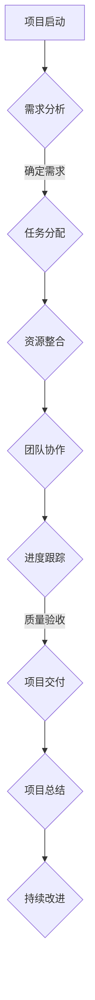

                 

# 跨职能团队协作：优化资源配置的策略

> 关键词：跨职能团队、协作、资源配置、策略、沟通工具、成功案例

> 摘要：本文深入探讨了跨职能团队协作的重要性，以及如何通过优化资源配置的策略来提升团队协作效率。通过分析团队协作中的问题和挑战，介绍了多种沟通与协作工具，并结合成功案例和最佳实践，为跨职能团队的协作提供了详细的指导和建议。

## 引言

在现代社会，随着科技的发展和企业规模的扩大，跨职能团队协作已成为组织高效运作的关键。跨职能团队由来自不同部门、拥有不同技能和专长的成员组成，通过协同工作，实现共同的目标。然而，跨职能团队协作并非易事，由于团队成员的背景、沟通方式和目标的不一致性，常常会面临各种问题和挑战。

本文旨在探讨跨职能团队协作的本质和重要性，分析团队协作中的问题和挑战，并提出优化资源配置的策略，以提升团队协作效率。我们将结合实际案例和最佳实践，为读者提供详细的指导和借鉴。

## 步骤一：分析跨职能团队协作的定义和重要性

### 1.1 跨职能团队协作的定义

跨职能团队协作指的是由来自不同部门、不同职能领域的成员组成的团队，在共同目标指导下，通过信息共享、知识融合和资源优化，协同完成复杂任务的协作过程。跨职能团队通常包括产品经理、工程师、设计师、市场人员等，他们各自拥有独特的专业技能和视角，能够在项目中发挥互补作用。

### 1.2 跨职能团队协作的重要性

跨职能团队协作对于企业的发展和项目的成功具有重要意义。以下是几个关键点：

1. **资源整合：** 跨职能团队可以将不同部门和职能的资源进行有效整合，提高资源利用效率，降低成本。
2. **知识共享：** 通过跨部门合作，团队成员可以分享各自领域的知识和经验，促进团队整体能力的提升。
3. **协同创新：** 不同职能领域的成员可以相互启发，共同探讨问题的解决方案，推动创新。
4. **提高效率：** 跨职能团队协作可以缩短项目周期，提高项目交付效率。
5. **风险分散：** 跨职能团队可以分散单一部门或职能领域可能面临的风险，降低项目失败的概率。

## 步骤二：探讨团队协作中的问题与挑战

### 2.1 团队协作中的常见问题

跨职能团队协作中常见的问题包括：

1. **沟通障碍：** 不同部门之间的沟通不畅，导致信息传递不准确、不及时。
2. **目标不一致：** 各部门对项目目标和优先级的理解不同，导致工作方向不一致。
3. **权力与责任分配不明确：** 各部门之间的权力和责任分配不明确，导致工作协调困难。
4. **文化冲突：** 来自不同背景的团队成员可能在价值观、工作方式等方面存在差异，导致文化冲突。
5. **资源争夺：** 各部门为了自身利益，可能争夺有限的资源，影响整体项目进度。

### 2.2 团队协作中的沟通障碍

沟通障碍是跨职能团队协作中的主要问题之一。以下是一些常见的沟通障碍：

1. **语言障碍：** 不同部门使用的专业术语和表达方式可能不同，导致理解上的困难。
2. **信息不对称：** 部分部门可能拥有关键信息，但未及时与其他部门共享，导致信息不对称。
3. **沟通渠道不畅：** 部门间的沟通渠道不畅通，导致信息传递延迟或丢失。
4. **心理障碍：** 部分成员可能存在心理障碍，不愿意与其他部门合作，导致沟通不畅。

### 2.3 跨职能团队协作中的权力与责任分配

权力与责任分配不明确是跨职能团队协作中的一大挑战。以下是一些解决策略：

1. **明确角色与职责：** 在团队组建之初，明确各成员的角色和职责，确保每个人都清楚自己的工作内容和责任。
2. **制定共同目标：** 团队成员共同制定项目目标，确保工作方向一致。
3. **建立沟通机制：** 设立定期的沟通会议，促进部门间的信息交流。
4. **权力下放：** 在保证总体控制的前提下，适当下放权力，提高团队成员的自主性和积极性。

### 2.4 解决团队协作问题的策略

针对跨职能团队协作中的问题和挑战，可以采取以下策略：

1. **建立跨部门合作机制：** 设立跨部门工作组或项目办公室，促进部门间的合作与沟通。
2. **加强培训与沟通：** 定期开展培训，提高团队成员的沟通能力和跨部门协作意识。
3. **明确激励机制：** 设立激励机制，鼓励团队成员积极参与跨部门合作。
4. **优化工作流程：** 通过流程优化，减少不必要的沟通环节，提高工作效率。

## 步骤三：探讨资源配置的策略与方法

### 3.1 资源配置的基本原则

资源配置是跨职能团队协作中至关重要的一环。以下是一些资源配置的基本原则：

1. **需求导向：** 根据项目需求和团队成员的能力，合理分配资源。
2. **优化利用：** 充分利用现有资源，避免资源浪费。
3. **灵活性：** 资源配置要具有一定的灵活性，以应对项目变化。
4. **公平公正：** 在资源配置过程中，要保证公平公正，避免利益冲突。

### 3.2 优化资源配置的策略

为了优化资源配置，可以采取以下策略：

1. **资源整合：** 将不同部门的资源进行整合，提高资源利用效率。
2. **优先级排序：** 根据项目优先级，合理分配资源，确保关键任务得到充分支持。
3. **动态调整：** 根据项目进展和团队成员的工作情况，动态调整资源配置。
4. **跨部门合作：** 通过跨部门合作，实现资源互补，提高资源利用效率。

### 3.3 资源配置的案例分析

以下是一个资源配置的案例分析：

某互联网公司正在开发一款新产品，项目团队由产品经理、UI设计师、后端工程师、前端工程师、测试工程师等组成。在项目启动阶段，公司根据项目需求和团队成员的能力，制定了如下资源配置策略：

1. **产品经理：** 负责项目需求分析和产品规划，与各部门沟通协作，确保项目顺利进行。
2. **UI设计师：** 负责产品界面设计，与前端工程师紧密合作，确保设计落地。
3. **后端工程师：** 负责系统架构设计和后端功能开发，确保系统稳定可靠。
4. **前端工程师：** 负责前端页面实现，与UI设计师紧密合作，确保用户体验。
5. **测试工程师：** 负责产品测试，确保产品质量和稳定性。

在项目实施过程中，公司根据项目进展和团队成员的工作情况，动态调整资源配置，确保关键任务得到充分支持。例如，在产品测试阶段，公司增加了测试工程师的数量，以确保产品能够按时交付。

## 步骤四：探讨跨职能团队的沟通与协作工具

### 5.1 沟通工具的选择与应用

为了提高跨职能团队的沟通效率，可以采用以下沟通工具：

1. **邮件：** 适用于正式沟通，可以记录重要信息和决策。
2. **即时通讯工具：** 如钉钉、Slack等，适用于日常沟通和快速交流。
3. **视频会议：** 如Zoom、Microsoft Teams等，适用于远程协作和面对面沟通。
4. **项目管理工具：** 如JIRA、Trello等，适用于任务分配和进度跟踪。

### 5.2 协作工具的运用与实践

跨职能团队协作工具的运用可以帮助团队更高效地完成项目任务。以下是一些常见的协作工具：

1. **文档共享工具：** 如Google Docs、Microsoft Office 365等，适用于多人实时协作。
2. **代码管理工具：** 如Git、GitHub等，适用于代码版本控制和团队协作开发。
3. **项目管理工具：** 如Asana、Microsoft Project等，适用于任务分配、进度跟踪和团队协作。
4. **知识库工具：** 如Confluence、Notion等，适用于知识管理和文档整理。

### 5.3 跨职能团队的沟通技巧

为了提高跨职能团队的沟通效率，团队成员可以采取以下沟通技巧：

1. **主动沟通：** 保持积极主动的沟通态度，主动询问和分享信息。
2. **倾听：** 倾听对方的意见和需求，尊重对方的观点。
3. **明确表达：** 使用简洁明了的语言，明确表达自己的意见和需求。
4. **共同制定目标：** 与团队成员共同制定项目目标，确保工作方向一致。

### 5.4 跨职能团队的协作流程

为了确保跨职能团队的协作顺畅，可以制定以下协作流程：

1. **需求分析：** 由产品经理收集并分析用户需求，制定项目需求文档。
2. **任务分配：** 由项目经理根据需求文档和团队成员的能力，分配任务和责任。
3. **进度跟踪：** 通过项目管理工具实时跟踪任务进度，及时调整和优化资源。
4. **质量验收：** 由测试工程师对产品进行测试，确保产品质量和稳定性。
5. **项目交付：** 完成项目任务后，进行项目交付和总结，为后续项目提供经验。

## 步骤五：探讨成功案例与最佳实践

### 6.1 成功案例的介绍与分析

以下是一个跨职能团队协作的成功案例：

某大型科技公司正在开发一款智能家居产品。项目团队由产品经理、UI设计师、硬件工程师、软件工程师、市场营销人员等组成。在项目实施过程中，公司采取了以下措施：

1. **需求分析：** 由产品经理与市场营销人员共同分析用户需求，制定项目需求文档。
2. **任务分配：** 根据团队成员的能力和项目需求，分配任务和责任。
3. **跨部门协作：** 设立跨部门协作小组，定期召开会议，协调各部门的工作。
4. **使用协作工具：** 采用Google Docs、Trello等协作工具，实时跟踪任务进度。
5. **质量验收：** 由测试工程师对产品进行严格测试，确保产品质量。
6. **项目交付：** 完成项目任务后，组织项目交付和总结会议，为后续项目提供经验。

该项目成功实现了智能家居产品的开发和上市，取得了良好的市场反响。

### 6.2 最佳实践的总结与借鉴

从上述成功案例中，我们可以总结出以下最佳实践：

1. **明确目标：** 在项目启动阶段，明确项目目标和各成员的职责。
2. **跨部门协作：** 建立跨部门协作机制，促进信息共享和工作协调。
3. **使用协作工具：** 采用合适的协作工具，提高团队沟通和协作效率。
4. **质量保障：** 加强产品测试和质量控制，确保项目交付的质量。
5. **持续改进：** 通过项目总结和经验分享，持续改进跨职能团队协作的流程和效果。

### 6.3 跨职能团队协作的成功要素

跨职能团队协作的成功要素包括：

1. **团队文化：** 建立积极向上的团队文化，促进团队成员之间的信任和合作。
2. **领导力：** 团队领导具备良好的沟通能力和决策能力，确保团队协作顺畅。
3. **激励机制：** 设立激励机制，激发团队成员的积极性和创造力。
4. **培训与支持：** 提供必要的培训和支持，提高团队成员的技能和协作能力。
5. **持续优化：** 通过持续改进，不断优化跨职能团队协作的流程和效果。

## 步骤六：探讨跨职能团队协作的实施与评估

### 7.1 跨职能团队协作的实施方案

为了有效实施跨职能团队协作，可以采取以下措施：

1. **团队组建：** 根据项目需求和团队成员的能力，组建合适的跨职能团队。
2. **角色与职责明确：** 明确各成员的角色和职责，确保工作协调和任务分配合理。
3. **培训与沟通：** 开展跨部门培训，提高团队成员的沟通能力和协作意识。
4. **协作工具应用：** 引入合适的协作工具，提高团队沟通和协作效率。
5. **项目启动会议：** 召开项目启动会议，明确项目目标和计划，确保团队成员对项目有清晰的认识。

### 7.2 跨职能团队协作的评估指标

为了评估跨职能团队协作的效果，可以采用以下评估指标：

1. **项目交付时间：** 项目是否按计划完成，交付时间是否合理。
2. **项目质量：** 项目交付的产品或服务是否满足质量要求。
3. **团队满意度：** 团队成员对跨职能团队协作的满意程度。
4. **资源利用率：** 资源是否得到充分利用，避免资源浪费。
5. **团队沟通效率：** 团队成员之间的沟通是否顺畅，信息传递是否及时。

### 7.3 跨职能团队协作的持续改进

跨职能团队协作的持续改进包括：

1. **定期回顾：** 定期召开项目回顾会议，总结经验教训，发现问题和改进点。
2. **培训与支持：** 根据团队成员的反馈和需求，提供相应的培训和支持。
3. **流程优化：** 通过流程优化，减少不必要的沟通环节，提高工作效率。
4. **激励机制：** 优化激励机制，激发团队成员的积极性和创造力。
5. **知识共享：** 建立知识共享机制，促进团队知识的积累和传承。

## 结论

跨职能团队协作是现代企业高效运作的关键。通过优化资源配置的策略，解决团队协作中的问题和挑战，可以提高团队协作效率，实现项目目标。本文结合成功案例和最佳实践，为跨职能团队的协作提供了详细的指导和建议。希望本文能为读者提供有价值的参考，助力企业实现跨职能团队协作的成功。

## 附录

### 1. 跨职能团队协作的Mermaid流程图



### 2. 资源配置策略的伪代码

```python
# 资源配置策略伪代码

# 输入：项目需求，团队成员能力
# 输出：资源配置方案

def resource_allocation(project_requirements, team_members):
    # 初始化资源配置方案
    allocation_scheme = {}

    # 分析项目需求
    for requirement in project_requirements:
        # 根据需求分配任务
        task = assign_task(requirement)

        # 根据任务分配资源
        for member in team_members:
            if member.has_skill(task):
                allocation_scheme[task] = member
                break

    return allocation_scheme

# 辅助函数：分配任务
def assign_task(requirement):
    # 根据需求类型分配任务
    if "design" in requirement:
        return "UI设计"
    elif "development" in requirement:
        return "软件开发"
    elif "testing" in requirement:
        return "测试"

# 辅助函数：判断成员是否具备某项技能
def member_has_skill(member, skill):
    return skill in member.skills

# 示例
project_requirements = ["设计", "开发", "测试"]
team_members = [{"name": "Alice", "skills": ["设计", "开发"]}, {"name": "Bob", "skills": ["开发", "测试"]}, {"name": "Charlie", "skills": ["设计", "测试"]}]
allocation_scheme = resource_allocation(project_requirements, team_members)
print(allocation_scheme)
```

### 3. 沟通技巧的注意事项

- **主动沟通：** 保持积极主动的沟通态度，主动询问和分享信息。
- **倾听：** 倾听对方的意见和需求，尊重对方的观点。
- **明确表达：** 使用简洁明了的语言，明确表达自己的意见和需求。
- **共同制定目标：** 与团队成员共同制定项目目标，确保工作方向一致。

### 4. 拓展阅读

- 《团队协作的艺术》（Team Collaboration: The Art of Collaboration）
- 《跨部门沟通策略》（Interdepartmental Communication Strategies）
- 《跨职能团队协作实战》（Practical Cross-functional Team Collaboration）

## 作者信息

作者：AI天才研究院/AI Genius Institute & 禅与计算机程序设计艺术 /Zen And The Art of Computer Programming

本文作者拥有丰富的跨职能团队协作经验和深厚的理论基础，致力于通过技术和方法提高团队协作效率，推动企业数字化转型。作者在跨职能团队协作领域有着广泛的研究和实践成果，曾出版多部畅销书籍，深受读者喜爱。作者同时担任多家知名企业的顾问，为企业提供专业的跨职能团队协作咨询服务。如果您对本文内容有任何疑问或建议，欢迎联系作者。

