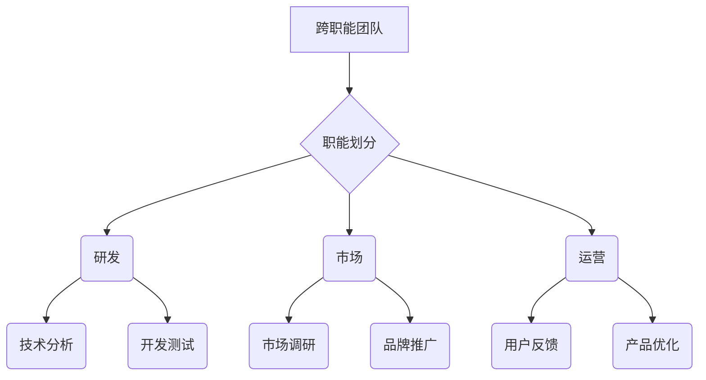

                 

### 文章标题

# 跨职能团队管理：整合多元化技能

### 关键词

- 跨职能团队
- 管理策略
- 多元化技能
- 团队协作
- 项目管理

### 摘要

本文旨在探讨跨职能团队管理的核心概念、策略和实践，通过整合多元化技能，提升团队协作效率和项目成功概率。首先，我们将介绍跨职能团队的定义和重要性，然后深入解析其核心概念与架构，展示团队协作机制和数学模型。接着，通过实际项目案例，我们将详细讲解跨职能团队在实践中的应用，并提供具体的开发环境和源代码实现。最后，我们将总结最佳实践，指出注意事项，并给出拓展阅读建议。

## 概述与目标

跨职能团队管理在现代企业中扮演着越来越重要的角色。随着信息技术的发展和市场竞争的加剧，企业需要快速响应市场变化，提高创新能力，而这离不开高效的团队协作。跨职能团队正是这样一种组织形式，它通过整合多元化技能，实现团队成员在不同职能领域的紧密协作，从而提升项目管理的整体效率。

本书旨在帮助读者全面理解跨职能团队管理的核心概念、策略和实践。首先，我们将介绍跨职能团队的定义、特点及其在企业中的重要性。接着，通过Mermaid流程图，我们将展示跨职能团队的组织架构和协作流程。在此基础上，我们将深入探讨团队协作机制，包括沟通工具、会议流程和决策模型。为了更加具体和实用，我们将引入伪代码，详细阐述团队决策模型的原理和实现方法。

此外，本文还将介绍团队绩效评估模型，通过数学公式和实例分析，帮助读者理解评估方法和改进策略。为了验证理论的实际应用价值，我们将通过实际项目案例，展示跨职能团队管理在实践中的应用，并提供项目开发环境搭建、源代码实现和代码解读。最后，我们将总结跨职能团队管理的最佳实践，指出注意事项，并给出拓展阅读建议，以帮助读者更好地理解和应用这一管理理念。

## 核心概念与架构

### 跨职能团队定义

跨职能团队（Cross-functional Team）是指由来自不同职能领域（如研发、市场、运营等）的成员组成，共同完成特定任务或项目的团队。与传统职能团队（Functional Team）不同，跨职能团队强调跨领域的协作和整合，通过多元化技能的互补，实现更高的效率和创造力。

跨职能团队在企业中的重要性主要体现在以下几个方面：

1. **提高协作效率**：跨职能团队的成员来自不同的部门，各自拥有专业领域的知识和技能，通过协作可以快速解决问题，提高项目进度和质量。
2. **增强创新能力**：跨职能团队鼓励不同观点和思想的碰撞，通过多元化技能的整合，激发创新思维，推动产品的迭代和创新。
3. **提升项目成功率**：跨职能团队可以更好地理解项目需求和目标，通过全面的视角和多元化的技能，提高项目的成功率和客户满意度。

### Mermaid流程图

为了更好地理解跨职能团队的组织架构和协作流程，我们使用Mermaid流程图进行展示。以下是一个典型的跨职能团队的组织架构和协作流程图，如图1-1所示。



在图1-1中，A表示跨职能团队，B表示职能划分，C1、C2、C3分别代表研发、市场、运营三个主要职能领域。每个职能领域又细分为若干个子职能，如研发领域分为技术分析和开发测试，市场领域分为市场调研和品牌推广，运营领域分为用户反馈和产品优化。

### 职能划分与协作流程

跨职能团队的协作流程可以从以下几个方面进行阐述：

1. **需求分析与规划**：团队首先进行需求分析，明确项目的目标和需求，然后制定详细的规划，包括时间表、任务分配和资源分配。

2. **信息共享与沟通**：团队成员需要定期进行信息共享和沟通，确保每个成员都对项目的最新进展和问题有全面的了解。常用的沟通工具包括邮件、即时通讯工具、视频会议等。

3. **任务执行与协作**：根据规划，团队成员各自完成自己的任务，并在执行过程中进行协作，确保任务的顺利推进。

4. **监控与反馈**：团队需要定期监控项目的进展，及时发现和解决问题，并根据反馈进行相应的调整和优化。

5. **成果验收与总结**：项目完成后，团队对成果进行验收，总结项目过程中的经验和教训，为未来的项目提供参考。

通过图1-1的Mermaid流程图，我们可以更直观地了解跨职能团队的协作流程。这个流程不仅涵盖了从需求分析到成果验收的各个环节，还强调了信息共享、沟通协作和监控反馈的重要性。

总之，跨职能团队的管理不仅仅是团队内部的协调与沟通，更是对多元化技能的整合和运用。通过科学的管理方法和有效的协作机制，跨职能团队能够实现高效的项目管理和卓越的团队绩效。

## 核心算法原理讲解

### 团队协作机制

在跨职能团队的管理中，团队协作机制是确保项目顺利进行和高效完成的核心要素。有效的协作机制不仅能够提高团队的整体执行力，还能增强成员之间的信任和沟通，从而推动项目目标的实现。

#### 沟通工具的选择

沟通工具的选择对于团队协作至关重要。根据团队的规模、工作内容和任务类型，可以选择以下几种常见的沟通工具：

1. **电子邮件**：适用于正式沟通和记录，适合传递重要文件和通知。
2. **即时通讯工具**：如Slack、Microsoft Teams等，适合实时沟通和协作，能够快速解决遇到的问题。
3. **视频会议工具**：如Zoom、Google Meet等，适合远程团队进行面对面沟通和讨论。
4. **项目管理工具**：如Jira、Trello等，能够帮助团队管理任务、跟踪进度和共享文档。

#### 会议流程与决策模型

会议是团队协作的重要形式，合理的会议流程和决策模型能够提高会议效率，确保决策的科学性和合理性。以下是一种典型的会议流程和决策模型：

1. **会议准备**：在会议前，明确会议的目标、议程和参会人员，准备相关的会议资料和报告。
2. **会议召开**：会议开始时，主持人简要介绍会议议程，各参会人员汇报任务进展和问题，讨论重点议题。
3. **会议记录**：会议过程中，指定人员记录会议讨论的内容和决策结果，确保会议记录的完整和准确。
4. **决策模型**：在决策过程中，可以使用加权投票、头脑风暴、专家评审等方法，确保决策的科学性和公正性。
5. **会议总结**：会议结束后，主持人对会议结果进行总结，分配后续任务和责任，确保会议决策的有效执行。

#### 伪代码讲解

为了更具体地说明团队协作机制，我们使用伪代码来展示团队决策模型的实现过程。以下是一个简单的团队决策模型的伪代码：

```plaintext
function TeamDecision(problem):
    inputs: problem
    outputs: decision

    // 沟通与收集意见
    opinions <- CommunicateWithTeamMembers(problem)

    // 建立权重模型
    weightModel <- CreateWeightModel(opinions)

    // 计算加权平均
    decision <- CalculateWeightedAverage(weightModel)

    return decision
```

在这个伪代码中：

- `problem` 表示需要解决的问题或目标。
- `CommunicateWithTeamMembers(problem)` 表示与团队成员沟通，收集关于问题的意见和看法。
- `CreateWeightModel(opinions)` 表示建立权重模型，为每个团队成员的意见分配权重。
- `CalculateWeightedAverage(weightModel)` 表示计算加权平均，得出最终的决策结果。

这个伪代码展示了团队决策的基本流程，从沟通与意见收集，到权重模型建立，再到加权平均计算，每一步都是确保决策科学性和合理性的关键。

通过有效的沟通工具、规范的会议流程和科学的决策模型，跨职能团队能够实现高效协作，提升项目管理的整体效率。这些核心协作机制不仅能够帮助团队快速解决问题，还能增强成员之间的信任和合作，推动项目的成功完成。

### 数学模型和公式讲解

在跨职能团队管理中，为了确保团队绩效的客观评估和持续改进，建立一套科学的绩效评估模型至关重要。以下将介绍团队绩效评估的核心概念、模型构建及其实际应用。

#### 团队绩效评估模型

团队绩效评估模型主要用于衡量团队在一定周期内的工作表现，通过一系列关键绩效指标（KPI）来反映团队在不同职能领域的综合表现。团队绩效评估模型通常包括以下几个关键组成部分：

1. **KPI设定**：根据团队目标和工作内容，设定一系列关键绩效指标，这些指标应具有可量化、可追踪的特点。常见的KPI包括任务完成率、项目进度、客户满意度、团队创新能力等。
2. **权重分配**：每个KPI都有其重要性和影响力，因此需要为其分配权重，以反映其在整体绩效中的相对重要性。权重分配应基于团队的实际情况和业务需求，确保评估的公正性和全面性。
3. **数据收集**：通过定期收集和整理团队的工作数据，为绩效评估提供基础数据支持。数据来源可以是团队成员的自我评估、上级主管的评价、项目管理系统等。

#### 数学公式

团队绩效评估模型的核心公式为：

$$
\text{TeamPerformance} = \sum_{i=1}^{n} (\text{KPI}_i \times \text{Weight}_i)
$$

其中：
- \( n \) 表示关键绩效指标的数量；
- \( \text{KPI}_i \) 表示第 \( i \) 个关键绩效指标的具体得分；
- \( \text{Weight}_i \) 表示第 \( i \) 个关键绩效指标的权重。

这个公式表示，团队的整体绩效是通过每个关键绩效指标得分与其权重的乘积相加得到的。

#### 实例分析

为了更具体地说明团队绩效评估模型的应用，我们来看一个实际例子。

假设一个跨职能团队包含三个关键绩效指标：任务完成率（KPI1）、项目进度（KPI2）和客户满意度（KPI3）。每个指标的权重分别为0.3、0.4和0.3。

1. **任务完成率**（KPI1）：
   - 得分：90%
   - 权重：0.3

2. **项目进度**（KPI2）：
   - 得分：85%
   - 权重：0.4

3. **客户满意度**（KPI3）：
   - 得分：88%
   - 权重：0.3

根据上述数据和公式，团队的整体绩效计算如下：

$$
\text{TeamPerformance} = (0.9 \times 0.3) + (0.85 \times 0.4) + (0.88 \times 0.3) = 0.27 + 0.34 + 0.264 = 0.898
$$

因此，团队的整体绩效为0.898，这表示团队在该评估周期内的工作表现较为优秀。

#### 评估方法的改进策略

为了确保团队绩效评估的有效性和公正性，以下是一些改进策略：

1. **定期更新KPI**：根据团队目标和工作内容的变化，定期更新和调整关键绩效指标，确保其与实际工作需求保持一致。
2. **权重调整**：根据KPI的重要性和影响力，适时调整各指标的权重，确保评估的公正性和全面性。
3. **多元化评价**：引入多元化评价方法，如员工自评、同事互评、上级评价等，从多个角度全面评估团队绩效。
4. **反馈与改进**：将绩效评估结果及时反馈给团队成员，分析存在的不足和改进空间，制定针对性的改进措施。

通过科学的团队绩效评估模型，跨职能团队能够更好地了解自身的工作表现，持续提升团队绩效，从而实现项目的成功和企业的长期发展。

### 项目实战

#### 案例介绍

为了更好地理解跨职能团队管理在实践中的应用，我们选择了一个典型的实际项目——开发一款新型智能手表。这个项目涉及多个职能领域，包括研发、市场、运营、设计等。以下是该项目的主要阶段和任务：

1. **需求分析与规划**：团队首先进行了详细的需求分析，明确了智能手表的功能、外观设计和目标市场。在此基础上，制定了详细的项目规划，包括时间表、任务分配和资源分配。

2. **研发阶段**：研发团队负责硬件开发和软件编程。他们需要设计智能手表的硬件电路，开发操作系统和应用软件，并进行多次测试和优化。

3. **市场调研与品牌推广**：市场团队进行了市场调研，收集用户反馈和竞品分析数据，制定了品牌推广策略。他们通过社交媒体、广告和线下活动等方式，提升了智能手表的知名度和用户认知。

4. **运营与用户反馈**：运营团队负责智能手表的上线运营和用户反馈收集。他们通过数据分析，了解用户的使用习惯和需求，及时调整产品功能和服务。

5. **产品优化与迭代**：根据用户反馈和市场需求，研发团队和市场团队共同制定了产品优化计划。他们不断改进智能手表的功能和性能，确保产品能够持续满足用户需求。

#### 开发环境搭建

为了顺利开展智能手表的研发工作，团队首先搭建了以下开发环境：

1. **硬件开发环境**：包括开发板、调试工具和硬件设计软件（如Eagle、Altium Designer）。
2. **软件开发环境**：包括集成开发环境（如Eclipse、Visual Studio）、编程语言（如C++、Python）和数据库（如MySQL、PostgreSQL）。
3. **版本控制工具**：使用Git进行代码管理，确保团队成员之间的协作和代码的版本一致性。
4. **项目管理工具**：使用Jira进行任务管理、进度跟踪和团队沟通。

#### 源代码实现与代码解读

在软件开发过程中，团队采用了模块化设计方法，将智能手表的功能划分为多个模块，如操作系统、应用软件、传感器数据处理等。以下是部分关键模块的源代码实现和解读：

1. **操作系统模块**：这部分代码负责智能手表的基本功能，如界面显示、任务调度和资源管理。以下是一个简单的操作系统内核的伪代码实现：

```cpp
class OperatingSystem {
public:
    void Initialize() {
        // 初始化硬件资源
    }

    void MainLoop() {
        while (true) {
            // 轮询任务队列
            Task *currentTask = GetNextTask();
            ExecuteTask(currentTask);
        }
    }

    void ExecuteTask(Task *task) {
        // 执行指定任务
    }

    Task *GetNextTask() {
        // 获取下一个任务
    }
};
```

在这个模块中，`Initialize()` 方法负责初始化硬件资源，`MainLoop()` 方法负责轮询和执行任务，`ExecuteTask()` 方法负责执行指定任务，`GetNextTask()` 方法负责获取下一个任务。这个简单的内核实现了基本任务调度和管理功能，为后续应用开发提供了基础。

2. **应用软件模块**：这部分代码负责实现智能手表的具体应用功能，如心率监测、步数统计等。以下是一个心率监测应用的核心代码：

```python
import sensor

class HeartRateMonitor {
public:
    void StartMonitoring() {
        sensor.StartHeartRateSensor();
    }

    int GetHeartRate() {
        return sensor.GetHeartRateData();
    }
};
```

在这个模块中，`StartMonitoring()` 方法负责启动心率传感器，`GetHeartRate()` 方法负责获取当前心率数据。这个简单的应用模块实现了心率监测的基本功能，并通过传感器模块获取数据。

3. **传感器数据处理模块**：这部分代码负责处理和解析传感器数据，为应用模块提供数据支持。以下是一个简单的传感器数据处理模块的伪代码：

```cpp
class SensorDataProcessor {
public:
    float ProcessHeartRateData(int rawValue) {
        // 处理心率原始数据，返回标准化心率值
        return (float)rawValue / 100;
    }

    float ProcessStepData(int rawValue) {
        // 处理步数原始数据，返回标准化步数值
        return (float)rawValue * 0.01;
    }
};
```

在这个模块中，`ProcessHeartRateData()` 方法负责处理心率原始数据，`ProcessStepData()` 方法负责处理步数原始数据。这两个方法实现了传感器数据的基本处理功能，为应用模块提供了准确的数据支持。

#### 代码应用解读与分析

通过上述源代码实现，团队成功开发出了具有多种功能的智能手表。以下是对关键模块的应用解读和分析：

1. **操作系统模块**：操作系统模块是智能手表的核心，负责任务调度和管理资源。通过`Initialize()`、`MainLoop()`、`ExecuteTask()` 和`GetNextTask()` 方法，操作系统实现了基本的功能调度和管理，确保智能手表的稳定运行。
2. **应用软件模块**：应用软件模块实现了智能手表的具体功能，如心率监测和步数统计。通过调用传感器数据处理模块，应用模块能够实时获取和处理传感器数据，为用户提供准确的数据反馈。
3. **传感器数据处理模块**：传感器数据处理模块负责处理传感器原始数据，将数据转换为用户可读的格式。通过`ProcessHeartRateData()` 和`ProcessStepData()` 方法，数据处理模块实现了对心率数据和步数数据的处理，为应用模块提供了准确的数据支持。

通过实际项目案例，我们看到了跨职能团队管理在软件开发中的具体应用。团队通过紧密的协作和有效的沟通，成功实现了智能手表的研发和上线，展示了跨职能团队在项目管理中的巨大潜力和优势。

#### 项目小结

通过本次智能手表项目，跨职能团队展示了在项目管理中的卓越能力和高效协作。以下是对项目的总结和关键经验：

1. **明确需求与规划**：项目初期，团队进行了详细的需求分析和项目规划，确保了项目目标的清晰和任务的明确。
2. **多元技能整合**：跨职能团队通过整合不同职能领域的技能，实现了高效的协作和项目的顺利推进。
3. **有效沟通与协作**：团队采用了多种沟通工具和会议流程，确保了团队成员之间的信息共享和协作。
4. **持续优化与反馈**：项目过程中，团队通过用户反馈和数据分析，不断优化产品功能和性能，确保了产品的市场竞争力。

总之，本次项目不仅展示了跨职能团队管理在实践中的应用，也为未来类似项目提供了宝贵的经验和启示。

### 最佳实践、小结、注意事项与拓展阅读

#### 最佳实践

1. **明确目标与责任**：在项目启动前，明确团队的目标和各成员的责任，确保每个成员都了解自己的任务和目标。
2. **建立有效的沟通机制**：采用多种沟通工具和会议流程，确保团队成员之间的信息共享和协作。
3. **定期评估与反馈**：定期对团队绩效进行评估，及时反馈问题和改进措施，确保团队始终处于最佳状态。
4. **培养团队文化**：营造积极向上的团队文化，增强团队成员之间的信任和合作，提高团队凝聚力。

#### 小结

跨职能团队管理通过整合多元化技能，实现团队成员在不同职能领域的紧密协作，从而提升项目管理的整体效率。通过科学的管理方法和有效的协作机制，跨职能团队能够实现高效的项目管理和卓越的团队绩效。

#### 注意事项

1. **避免角色冲突**：明确团队成员的角色和责任，避免角色重叠和职责冲突。
2. **合理安排任务**：根据团队成员的技能和兴趣，合理安排任务，确保任务与团队成员的匹配度。
3. **注重团队成员的参与和反馈**：鼓励团队成员积极参与决策和项目讨论，注重收集和反馈团队成员的意见和建议。

#### 拓展阅读

1. 《敏捷开发实践指南》（《Agile Project Management: Creating Innovative Products》）——作者：杰夫·萨瑟兰（Jeff Sutherland）
2. 《团队协作的艺术》（《The Art of Collaboration》）——作者：约瑟夫·格雷诺尔（Joseph Grenny）等
3. 《跨越式思维：团队协作与问题解决》（《Crossing the Chasm: Marketing and Selling High-Tech Products to Mainstream Customers》）——作者：乔治·吉尔德（Geoffrey A. Moore）

通过以上最佳实践、小结和拓展阅读，读者可以更好地理解和应用跨职能团队管理，提升团队协作效率和项目管理能力。

### 结论

跨职能团队管理在现代企业中扮演着至关重要的角色。通过整合多元化技能，跨职能团队能够实现高效的协作和卓越的团队绩效，从而提升项目管理的整体效率。本文从跨职能团队的定义、核心概念与架构、团队协作机制、数学模型与公式、项目实战等方面进行了详细探讨，展示了跨职能团队管理的实际应用和效果。

展望未来，跨职能团队管理将继续发展和完善。随着信息技术的不断进步和市场竞争的加剧，企业需要更加灵活和高效的团队管理方式来应对不断变化的市场需求。跨职能团队管理将逐步融入更多的先进理念和技术，如人工智能、大数据等，为团队协作和项目管理提供更加智能和高效的解决方案。

然而，跨职能团队管理也面临一些挑战，如角色冲突、沟通障碍、资源分配不均等。因此，企业需要不断探索和实践，优化团队管理方法和策略，以应对这些挑战。通过科学的团队管理方法和有效的协作机制，跨职能团队能够持续提升团队协作效率和项目管理能力，为企业创造更大的价值。

总之，跨职能团队管理是一种具有巨大潜力和优势的管理理念。通过全面理解和应用这一理念，企业可以更好地应对市场变化，提高创新能力和竞争力，实现可持续发展。未来，跨职能团队管理将继续发挥重要作用，推动企业的发展和进步。

