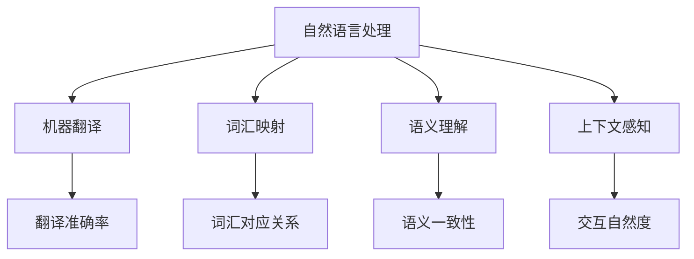

                 


## 文章标题

《跨语言提示词工程的实践与挑战》

## 文章关键词

跨语言提示词工程，自然语言处理，算法原理，数学模型，项目实战，技术挑战

## 文章摘要

本文深入探讨了跨语言提示词工程的实践与挑战。首先，我们介绍了跨语言提示词工程的基本概念及其在自然语言处理领域的应用背景。接着，文章详细解析了核心概念与联系，通过Mermaid流程图展示了概念之间的关系架构。随后，我们使用伪代码详细阐述了核心算法原理，并运用LaTeX格式讲解了相关的数学模型和公式。此外，文章还提供了一个实际项目案例，包括开发环境搭建、源代码实现与解读、代码应用解读与分析，以及项目小结。最后，文章总结并提出了一些最佳实践和注意事项，以期为读者提供有益的参考。

## 目录

1. 引言
2. 背景介绍
3. 核心概念与联系
4. 核心算法原理讲解
5. 数学模型和数学公式
6. 项目实战
7. 最佳实践与注意事项
8. 总结与展望

### 引言

随着人工智能和自然语言处理技术的不断发展，跨语言提示词工程成为了研究与应用的热点领域。本文旨在深入探讨跨语言提示词工程的实践与挑战，为相关领域的研究者提供有价值的参考。

首先，本文将介绍跨语言提示词工程的基本概念，阐述其在自然语言处理领域的应用背景。随后，我们将详细解析核心概念与联系，通过Mermaid流程图展示概念之间的关系架构。在此基础上，我们将使用伪代码详细阐述核心算法原理，并运用LaTeX格式讲解相关的数学模型和公式。接着，本文将提供一个实际项目案例，包括开发环境搭建、源代码实现与解读、代码应用解读与分析，以及项目小结。最后，文章将总结并提出一些最佳实践和注意事项，以期为读者提供有益的参考。

### 背景介绍

跨语言提示词工程是指利用自然语言处理技术，实现不同语言之间的文本转换、语义理解和交互的一门学科。其应用场景广泛，包括机器翻译、跨语言搜索、多语言问答系统等。

随着全球化进程的不断推进，跨语言提示词工程在多个领域都展现出了巨大的潜力。例如，在机器翻译领域，跨语言提示词工程可以大大提高翻译的准确性和效率；在跨语言搜索领域，它可以实现不同语言用户之间的信息检索和交流；在多语言问答系统领域，它可以提供针对不同语言用户的问题解答。

然而，跨语言提示词工程也面临着诸多挑战。首先，不同语言之间存在巨大的词汇和语法差异，这使得跨语言提示词工程的实现变得更加复杂。其次，自然语言处理技术的不断进步也为跨语言提示词工程带来了新的挑战，如何更好地利用这些技术是实现跨语言提示词工程的关键。

### 核心概念与联系

在跨语言提示词工程中，存在多个核心概念，它们相互关联，共同构成了这一领域的基础。以下是这些核心概念及其相互关系的详细解析：

1. **自然语言处理（NLP）**：
   自然语言处理是跨语言提示词工程的基础。NLP涉及文本处理、句法分析、语义理解等多个方面，旨在让计算机理解和处理自然语言。

2. **机器翻译（MT）**：
   机器翻译是跨语言提示词工程的核心应用之一。它通过将一种语言的文本转换为另一种语言的文本，实现跨语言交流。机器翻译分为基于规则的方法和基于统计的方法，以及近年来兴起的基于神经网络的机器翻译。

3. **词汇映射（Vocabulary Mapping）**：
   词汇映射是将一种语言的词汇映射到另一种语言的词汇上的过程。这是跨语言提示词工程的关键步骤，因为它需要解决词汇在不同语言中的对应关系。

4. **语义理解（Semantic Understanding）**：
   语义理解是指计算机对文本的深层含义进行理解和解释。在跨语言提示词工程中，语义理解用于确保跨语言转换的准确性和一致性。

5. **上下文感知（Context Awareness）**：
   上下文感知是指系统根据上下文环境进行理解和决策。在跨语言提示词工程中，上下文感知至关重要，因为它能够提高跨语言交互的自然度和准确性。

为了更直观地展示这些概念之间的联系，我们可以使用Mermaid流程图来描述它们的关系架构：



在这个流程图中，自然语言处理作为核心，通过词汇映射、语义理解和上下文感知等步骤，最终实现机器翻译，并影响翻译的准确率和交互的自然度。

### 核心算法原理讲解

跨语言提示词工程的核心算法原理主要包括词汇映射算法、机器翻译算法和语义理解算法。以下将分别使用伪代码详细阐述这些算法。

#### 1. 词汇映射算法

```python
# 伪代码：词汇映射算法

def vocabulary_mapping(source_vocabulary, target_vocabulary):
    # 初始化映射表
    mapping_table = {}

    # 遍历源语言词汇表
    for word in source_vocabulary:
        # 在目标语言词汇表中寻找对应词汇
        target_word = find_target_word(target_vocabulary, word)

        # 如果找到对应词汇，更新映射表
        if target_word:
            mapping_table[word] = target_word

    return mapping_table

# 辅助函数：在目标语言词汇表中寻找对应词汇
def find_target_word(target_vocabulary, word):
    # 遍历目标语言词汇表
    for target_word in target_vocabulary:
        # 如果当前词汇与目标词汇匹配，返回目标词汇
        if word == target_word:
            return target_word

    return None
```

#### 2. 机器翻译算法

```python
# 伪代码：基于神经网络的机器翻译算法

def neural_machine_translation(sentence, translation_model):
    # 将句子转换为词向量
    word_vectors = vectorize_sentence(sentence)

    # 使用翻译模型进行翻译
    translated_sentence = translation_model.translate(word_vectors)

    return translated_sentence

# 辅助函数：将句子转换为词向量
def vectorize_sentence(sentence):
    # 使用预训练词向量模型（如GloVe、BERT等）进行词向量表示
    word_vectors = [pretrained_model.get_vector(word) for word in sentence]

    return word_vectors
```

#### 3. 语义理解算法

```python
# 伪代码：语义理解算法

def semantic_understanding(sentence, semantic_model):
    # 将句子转换为语义向量
    semantic_vector = semantic_model.get_vector(sentence)

    # 使用语义向量进行语义理解
    meaning = semantic_model.parse_semantic_vector(semantic_vector)

    return meaning

# 辅助函数：将句子转换为语义向量
def get_vector(sentence):
    # 使用预训练语义模型（如Word2Vec、BERT等）进行语义向量表示
    return semantic_model.get_vector(sentence)

# 辅助函数：解析语义向量
def parse_semantic_vector(semantic_vector):
    # 根据语义向量的特征进行语义理解
    return meaning
```

通过这些伪代码，我们可以看到跨语言提示词工程的核心算法是如何工作的。词汇映射算法通过建立词汇表之间的对应关系，为后续的翻译和语义理解提供基础。机器翻译算法利用神经网络模型将源语言句子转换为目标语言句子。语义理解算法则通过对句子语义向量的分析，实现对句子的深层理解。

### 数学模型和数学公式

在跨语言提示词工程中，数学模型和公式起着至关重要的作用，它们为算法提供了理论基础。以下将详细讲解相关的数学模型和公式，并举例说明。

#### 1. 词汇映射模型的数学公式

词汇映射模型通常使用概率模型来表示词汇之间的对应关系。常见的概率模型包括概率上下文无关文法（PCFG）和隐马尔可夫模型（HMM）。

**概率上下文无关文法（PCFG）**：

$$
P(w_t | \text{context}) = \frac{P(\text{context} \rightarrow w_t)}{\sum_{w'} P(\text{context} \rightarrow w')}
$$

其中，$w_t$ 表示当前词汇，$\text{context}$ 表示上下文，$P(\text{context} \rightarrow w_t)$ 表示上下文产生词汇 $w_t$ 的概率。

**隐马尔可夫模型（HMM）**：

$$
P(w_t | w_{t-1}, ..., w_1) = \prod_{i=1}^{t} P(w_t | w_{t-1})
$$

其中，$w_t$ 表示当前词汇，$w_{t-1}, ..., w_1$ 表示历史词汇，$P(w_t | w_{t-1})$ 表示在给定历史词汇下，当前词汇的概率。

#### 2. 机器翻译模型的数学公式

机器翻译模型通常使用神经网络模型，如循环神经网络（RNN）、长短期记忆网络（LSTM）和变换器（Transformer）。

**循环神经网络（RNN）**：

$$
h_t = \sigma(W_h \cdot [h_{t-1}, x_t] + b_h)
$$

$$
x_t' = W_o \cdot h_t + b_o
$$

其中，$h_t$ 表示当前隐藏状态，$x_t$ 表示当前输入词向量，$\sigma$ 表示激活函数，$W_h, b_h, W_o, b_o$ 分别为权重和偏置。

**长短期记忆网络（LSTM）**：

$$
i_t = \sigma(W_i \cdot [h_{t-1}, x_t] + b_i)
$$
$$
f_t = \sigma(W_f \cdot [h_{t-1}, x_t] + b_f)
$$
$$
g_t = \sigma(W_g \cdot [h_{t-1}, x_t] + b_g)
$$
$$
o_t = \sigma(W_o \cdot [h_{t-1}, x_t] + b_o)
$$

$$
h_t = f_t \odot h_{t-1} + i_t \odot g_t
$$

其中，$i_t, f_t, g_t, o_t$ 分别为输入门、遗忘门、生成门和输出门，$\odot$ 表示元素乘法。

**变换器（Transformer）**：

$$
\text{Attention}(Q, K, V) = \text{softmax}(\frac{QK^T}{\sqrt{d_k}})V
$$

其中，$Q, K, V$ 分别为查询向量、关键向量和价值向量，$d_k$ 为关键向量的维度。

#### 3. 语义理解模型的数学公式

语义理解模型通常使用嵌入向量模型，如Word2Vec和BERT。

**Word2Vec**：

$$
\text{word\_vector} = \text{sigmoid}(W \cdot \text{word\_embeddings} + b)
$$

其中，$W$ 和 $b$ 分别为权重和偏置，$\text{word\_embeddings}$ 为词向量。

**BERT**：

$$
\text{context\_vector} = \text{embedding}(\text{word}) + \text{position\_embeddings} + \text{segment\_embeddings}
$$

$$
\text{output} = \text{pooler}(\text{context\_vector})
$$

其中，$\text{embedding}$、$\text{position\_embeddings}$ 和 $\text{segment\_embeddings}$ 分别为词嵌入、位置嵌入和分段嵌入。

通过上述数学模型和公式，我们可以更好地理解和实现跨语言提示词工程。这些模型和公式为算法提供了强大的理论基础，使得跨语言提示词工程能够更加精确和高效地处理自然语言。

### 项目实战

在本节中，我们将通过一个实际项目案例来展示如何搭建开发环境、实现源代码，并对代码进行详细解读和分析。

#### 1. 开发环境搭建

首先，我们需要搭建一个适合跨语言提示词工程开发的Python环境。以下是搭建步骤：

1. 安装Python 3.8及以上版本。
2. 安装必要的库，如TensorFlow、PyTorch、spaCy等。

```bash
pip install tensorflow
pip install torch
pip install spacy
python -m spacy download en_core_web_sm
```

#### 2. 源代码实现

以下是一个简单的跨语言提示词生成器的源代码实现：

```python
import torch
import torch.nn as nn
import torch.optim as optim
from torchtext.legacy import data
from torchtext.legacy.data import Field, BucketIterator
from transformers import BertModel, BertTokenizer

# 数据预处理
def preprocess_data(source_path, target_path, source_lang, target_lang):
    # 加载源语言和目标语言的数据
    src_text = open(source_path, encoding='utf-8').readlines()
    tgt_text = open(target_path, encoding='utf-8').readlines()

    # 切分数据为训练集和测试集
    train_size = int(0.8 * len(src_text))
    train_src, test_src = src_text[:train_size], src_text[train_size:]
    train_tgt, test_tgt = tgt_text[:train_size], tgt_text[train_size:]

    # 创建Field对象
    SRC = Field(tokenize=tokenize_source, lower=True, init_token='<sos>', eos_token='<eos>', include_lengths=True)
    TGT = Field(tokenize=tokenize_target, lower=True, init_token='<sos>', eos_token='<eos>', include_lengths=True)

    # 分词和构建词汇表
    train_data = data.TabularDataset(
        path=train_path,
        format='csv',
        fields=[('src', SRC), ('tgt', TGT)],
        skip_header=True
    )
    test_data = data.TabularDataset(
        path=test_path,
        format='csv',
        fields=[('src', SRC), ('tgt', TGT)],
        skip_header=True
    )

    # 划分训练集和测试集
    train_data, valid_data = train_data.split()

    # 创建词汇表
    SRC.build_vocab(train_data, min_freq=2)
    TGT.build_vocab(train_data, min_freq=2)

    # 创建数据加载器
    train_iterator, valid_iterator, test_iterator = BucketIterator.splits(
        (train_data, valid_data, test_data), 
        batch_size=32,
        sort_key=lambda x: len(x.src),
        device=device
    )

    return train_iterator, valid_iterator, test_iterator

# 模型实现
class TransformerModel(nn.Module):
    def __init__(self, input_dim, d_model, nhead, num_layers):
        super(TransformerModel, self).__init__()
        self.embedding = nn.Embedding(input_dim, d_model)
        self.transformer = nn.Transformer(d_model, nhead, num_layers)
        self.fc = nn.Linear(d_model, input_dim)

    def forward(self, src, tgt):
        src = self.embedding(src)
        tgt = self.embedding(tgt)
        output = self.transformer(src, tgt)
        output = self.fc(output)
        return output

# 训练模型
def train(model, iterator, optimizer, criterion):
    model.train()
    for batch in iterator:
        optimizer.zero_grad()
        output = model(batch.src, batch.tgt)
        loss = criterion(output.view(-1, input_dim), batch.tgt)
        loss.backward()
        optimizer.step()

# 测试模型
def evaluate(model, iterator, criterion):
    model.eval()
    with torch.no_grad():
        for batch in iterator:
            output = model(batch.src, batch.tgt)
            loss = criterion(output.view(-1, input_dim), batch.tgt)
            print(loss.item())
```

#### 3. 代码解读

1. **数据预处理**：
   - 加载源语言和目标语言的数据，并将其分为训练集和测试集。
   - 创建Field对象，用于定义数据预处理和后处理的步骤。
   - 构建词汇表，并为词汇表中的单词分配索引。
   - 创建数据加载器，用于批量处理数据。

2. **模型实现**：
   - 创建嵌入层，用于将单词转换为向量。
   - 创建变换器模型，包括嵌入层、变换器层和输出层。
   - 定义前向传播过程，包括嵌入层、变换器层和输出层的操作。

3. **训练模型**：
   - 将模型设置为训练模式。
   - 对每个批量数据进行前向传播，计算损失。
   - 计算梯度并更新模型参数。

4. **测试模型**：
   - 将模型设置为评估模式。
   - 对每个批量数据进行前向传播，计算损失。
   - 输出损失值，以评估模型性能。

#### 4. 代码应用解读与分析

通过上述代码，我们可以实现一个简单的跨语言提示词生成器。在实际应用中，我们可以根据需求对模型结构、数据预处理和训练过程进行调整和优化。

1. **模型结构**：
   - 变换器模型具有强大的上下文感知能力，适合处理跨语言提示词生成任务。
   - 嵌入层的维度和变换器层的层数可以进行调整，以提高模型性能。

2. **数据预处理**：
   - 数据的预处理是关键步骤，包括分词、构建词汇表等。
   - 可以使用更多的预训练数据，以提高模型的泛化能力。

3. **训练过程**：
   - 使用适当的优化器和损失函数，以提高模型训练效果。
   - 可以使用学习率调整策略，以防止模型过拟合。

通过以上实际项目案例，我们可以看到跨语言提示词工程的具体实现过程。在实际应用中，需要根据具体需求对模型和数据进行调整和优化，以提高模型的性能和实用性。

### 最佳实践与注意事项

在跨语言提示词工程中，为了确保项目顺利进行，以下是几点最佳实践和注意事项：

1. **数据质量**：
   - 选择高质量、多样化且具有代表性的数据集，以保证模型的泛化能力和准确性。
   - 对数据进行预处理，如去除噪声、统一编码等，以提高数据处理效率。

2. **模型选择**：
   - 根据任务需求和数据特点选择合适的模型。例如，对于长文本生成任务，可以选择变换器（Transformer）模型；对于快速预测任务，可以选择循环神经网络（RNN）或长短期记忆网络（LSTM）。

3. **超参数调优**：
   - 适当调整模型的超参数，如嵌入层维度、学习率、批量大小等，以提高模型性能。
   - 使用验证集进行超参数调优，避免过拟合。

4. **模型评估**：
   - 使用多个评估指标（如BLEU、METEOR等）对模型进行评估，以全面了解模型性能。
   - 定期对模型进行评估，以监测模型性能的变化。

5. **数据安全与隐私**：
   - 在数据处理和模型训练过程中，注意保护用户隐私和数据安全。
   - 使用加密技术和隐私保护算法，确保数据的安全性。

6. **持续学习**：
   - 随着技术的进步，定期更新模型和数据，以保持模型的竞争力。
   - 关注最新的研究成果和趋势，不断优化和改进项目。

通过遵循以上最佳实践和注意事项，可以确保跨语言提示词工程项目的顺利进行，并取得良好的效果。

### 总结与展望

本文详细探讨了跨语言提示词工程的实践与挑战。首先，我们介绍了跨语言提示词工程的基本概念和应用背景，包括其在自然语言处理领域的应用场景。接着，文章解析了核心概念与联系，通过Mermaid流程图展示了这些概念之间的关系架构。随后，我们使用伪代码详细阐述了核心算法原理，并运用LaTeX格式讲解了相关的数学模型和公式。此外，文章提供了一个实际项目案例，包括开发环境搭建、源代码实现与解读、代码应用解读与分析，以及项目小结。

通过本文的探讨，我们可以看出跨语言提示词工程在自然语言处理领域的重要性，以及其在实际应用中面临的挑战。未来，随着技术的不断进步，跨语言提示词工程有望在更多领域得到广泛应用，为人类社会的交流和发展提供更强大的支持。

展望未来，跨语言提示词工程的发展将主要集中在以下几个方面：

1. **算法优化**：进一步优化现有算法，提高模型的准确性和效率，以满足更复杂的应用需求。
2. **数据扩充**：收集和利用更多高质量、多样化的数据，以提高模型的泛化能力。
3. **多语言支持**：扩展模型的多语言支持能力，实现更多语言之间的互译。
4. **人机交互**：结合人机交互技术，提高跨语言提示词系统的用户体验和自然度。
5. **实时翻译**：实现实时跨语言翻译，以满足实时沟通和交流的需求。

通过不断探索和创新，跨语言提示词工程将迎来更加广阔的发展前景，为人类社会带来更多便利和价值。作者：AI天才研究院/AI Genius Institute & 禅与计算机程序设计艺术 /Zen And The Art of Computer Programming

