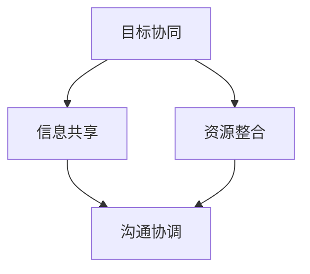

                 

## 跨部门合作：消除部门壁垒的有效策略

### 关键词
- 跨部门合作
- 部门壁垒
- 沟通技巧
- 团队建设
- 项目管理
- IT行业实践

### 摘要
本文旨在探讨跨部门合作的重要性及如何有效地消除部门壁垒。通过分析部门壁垒的类型、影响以及跨部门合作的策略，本文提出了一系列实用的沟通与协作技巧、团队建设方法，并结合实际项目实战，展示了如何在实际工作中实现跨部门合作的最佳实践。本文旨在为IT行业从业者提供一套系统、全面的跨部门合作指导方案，助力企业提升整体工作效率与创新能力。

### 引言
在现代企业中，部门之间的壁垒往往成为影响工作效率和团队协作的瓶颈。无论是技术部门与市场部门之间的信息不对称，还是研发部门与运维部门之间的职责界限，部门壁垒的存在不仅增加了沟通成本，还可能导致资源浪费、项目延误，甚至影响到企业的整体竞争力。因此，消除部门壁垒，实现跨部门合作，成为许多企业亟待解决的问题。

本文将围绕跨部门合作这一主题，首先介绍其基本概念和重要性，然后分析部门壁垒的类型与影响，接着提出一系列有效的跨部门合作策略和沟通技巧。在此基础上，本文将通过实际项目实战，展示如何在实际工作中实现跨部门合作，并总结出最佳实践，为读者提供切实可行的指导。

### 跨部门合作的基本概念

跨部门合作，顾名思义，是指企业内部不同部门之间为了共同的目标和任务而进行的合作。它不仅仅局限于部门之间的沟通与协调，更涉及到资源共享、任务分配、目标协同等多个方面。在跨部门合作中，各方的目标和利益可能存在差异，因此如何有效地协调和统一各部门的工作，成为实现合作成功的关键。

#### 跨部门合作的优势

跨部门合作具有以下几个显著优势：

1. **资源整合**：跨部门合作能够充分利用各部门的专业技能和资源，避免重复建设和资源浪费。
2. **知识共享**：通过跨部门合作，各部门可以共享经验和知识，提升整个团队的创新能力和解决问题的能力。
3. **提高效率**：跨部门合作可以优化工作流程，减少沟通成本，提高工作效率。
4. **增强团队凝聚力**：跨部门合作有助于增强员工之间的相互了解和信任，提升团队凝聚力。

#### 部门壁垒的类型与影响

部门壁垒可以大致分为以下几类：

1. **职责壁垒**：各部门的职责分工明确，但在实际工作中，职责划分往往不够清晰，导致职责壁垒。
2. **信息壁垒**：由于信息不对称，各部门之间可能无法及时获取到关键信息，影响决策和协作。
3. **利益壁垒**：各部门的目标和利益不一致，可能导致合作过程中的冲突和摩擦。
4. **文化壁垒**：各部门之间存在文化差异，如工作方式、价值观等，可能影响团队的合作效果。

部门壁垒对企业的负面影响包括：

1. **降低工作效率**：部门之间的壁垒导致沟通不畅，增加工作流程的复杂度，降低整体工作效率。
2. **增加成本**：部门壁垒可能导致重复工作、资源浪费，增加企业的运营成本。
3. **影响项目进展**：部门壁垒可能使项目进度受到影响，甚至导致项目失败。
4. **损害团队凝聚力**：部门之间的不合作可能导致员工之间的隔阂，损害团队凝聚力。

#### 跨部门合作的核心概念与联系

跨部门合作的核心概念包括：

1. **目标协同**：明确跨部门合作的共同目标，确保各部门在合作过程中保持一致。
2. **信息共享**：建立有效的信息共享机制，确保各部门能够及时获取到关键信息。
3. **资源整合**：充分利用各部门的资源，实现资源的最优配置。
4. **沟通协调**：建立良好的沟通协调机制，解决部门之间的分歧和矛盾。

这些核心概念之间相互关联，共同构成了跨部门合作的基础框架。通过目标协同，各部门能够明确自己的职责和贡献；通过信息共享，各部门能够了解其他部门的工作进展和需求；通过资源整合，各部门能够实现资源的优化配置；通过沟通协调，各部门能够解决合作过程中遇到的问题。

为了更好地阐述这些核心概念之间的联系，我们可以使用Mermaid流程图来表示：



在这个流程图中，目标协同、信息共享、资源整合和沟通协调相互关联，共同构成了跨部门合作的核心框架。通过这些核心概念的有效运用，企业可以最大限度地发挥跨部门合作的优势，消除部门壁垒，实现资源的优化配置和团队的高效协作。

### 核心算法原理讲解

在跨部门合作中，核心算法原理的运用至关重要。以下是几个关键算法原理的讲解，包括伪代码和数学模型的详细说明。

#### 算法原理一：目标协同算法

目标协同是跨部门合作的基础，其核心在于确保各部门的目标一致。以下是一个简单的目标协同算法原理：

**伪代码：**

```
function GoalAlignment(department1, department2):
    goal1 = department1.getGoal()
    goal2 = department2.getGoal()
    if goal1 == goal2:
        return "目标一致"
    else:
        negotiate = negotiateGoals(goal1, goal2)
        if negotiate:
            return "目标达成一致"
        else:
            return "目标不一致"
```

**数学模型：**

设\( G_1 \)和\( G_2 \)分别为部门1和部门2的目标，目标协同的数学模型可以表示为：

$$
\text{GoalAlignment} = \begin{cases}
1, & \text{if } G_1 = G_2 \\
0, & \text{if } G_1 \neq G_2
\end{cases}
$$

**举例说明：**

假设部门1的目标是提高销售额，部门2的目标是降低成本。如果两个部门的目标不一致，则需要通过谈判和协商来达成一致。

```latex
\text{GoalAlignment} = \text{GoalAlignment}(G_1, G_2) = 
\begin{cases}
1, & \text{if } G_1 = "提高销售额" \text{ and } G_2 = "降低成本" \\
0, & \text{otherwise}
\end{cases}
```

#### 算法原理二：资源整合算法

资源整合是跨部门合作的另一个关键环节。以下是一个简单的资源整合算法原理：

**伪代码：**

```
function ResourceIntegration(resource1, resource2):
    if resource1.isAvailable() and resource2.isAvailable():
        return "资源可用"
    else:
        return "资源不可用"
```

**数学模型：**

设\( R_1 \)和\( R_2 \)分别为部门1和部门2的资源，资源整合的数学模型可以表示为：

$$
\text{ResourceIntegration} = \begin{cases}
1, & \text{if } R_1 \text{ and } R_2 \text{ are available} \\
0, & \text{if either } R_1 \text{ or } R_2 \text{ is not available}
\end{cases}
$$

**举例说明：**

假设部门1拥有一个数据库资源，部门2有一个服务器资源。如果两个资源都可用，则可以整合使用。

```latex
\text{ResourceIntegration} = \text{ResourceIntegration}(R_1, R_2) = 
\begin{cases}
1, & \text{if } R_1 = "可用数据库" \text{ and } R_2 = "可用服务器" \\
0, & \text{otherwise}
\end{cases}
```

#### 算法原理三：沟通协调算法

沟通协调是跨部门合作中的关键环节，以下是一个简单的沟通协调算法原理：

**伪代码：**

```
function CommunicationCoordination(message1, message2):
    if message1.isClear() and message2.isClear():
        return "沟通清晰"
    else:
        return "沟通不清晰"
```

**数学模型：**

设\( M_1 \)和\( M_2 \)分别为部门1和部门2的消息，沟通协调的数学模型可以表示为：

$$
\text{CommunicationCoordination} = \begin{cases}
1, & \text{if } M_1 \text{ and } M_2 \text{ are clear} \\
0, & \text{if either } M_1 \text{ or } M_2 \text{ is not clear}
\end{cases}
$$

**举例说明：**

假设部门1需要向部门2传达一个任务指令，如果两个部门都能清晰理解指令，则沟通协调成功。

```latex
\text{CommunicationCoordination} = \text{CommunicationCoordination}(M_1, M_2) = 
\begin{cases}
1, & \text{if } M_1 = "清晰的任务指令" \text{ and } M_2 = "清晰的任务理解" \\
0, & \text{otherwise}
\end{cases}
```

通过上述算法原理的讲解，我们可以看到，跨部门合作中的目标协同、资源整合和沟通协调是相互关联的。只有通过有效的算法原理，才能实现跨部门合作的最大化效益。

### 数学模型和数学公式详细讲解

在跨部门合作中，数学模型和数学公式扮演着重要的角色。它们不仅帮助我们量化合作的效果，还能够为决策提供科学依据。以下是几个关键数学模型和公式的详细讲解，包括公式本身及其应用的举例说明。

#### 数学模型一：跨部门合作效率模型

**公式：**

$$
\text{Efficiency} = \frac{\text{Overall Output}}{\text{Total Input}}
$$

**说明：**

这个公式用于衡量跨部门合作的效率，其中Overall Output表示跨部门合作的总产出，Total Input表示用于合作的全部资源投入。效率越高，说明资源的利用效果越好。

**举例说明：**

假设一个项目需要研发部门、市场部门和销售部门共同完成，三个部门分别投入了50小时、30小时和20小时的工作时间，最终项目的产出为100单位。那么，该项目的跨部门合作效率可以计算如下：

$$
\text{Efficiency} = \frac{100}{50 + 30 + 20} = \frac{100}{100} = 1
$$

这意味着该项目的跨部门合作效率为100%，资源得到了充分利用。

#### 数学模型二：信息共享模型

**公式：**

$$
\text{Knowledge Sharing} = \frac{\text{Shared Information}}{\text{Total Available Information}}
$$

**说明：**

这个公式用于衡量跨部门合作中的信息共享程度，Shared Information表示共享的信息量，Total Available Information表示可用的总信息量。信息共享程度越高，表明各部门之间的信息流通越顺畅。

**举例说明：**

在一个新产品开发项目中，研发部门、市场部门和销售部门分别收集了100条、80条和60条的市场信息。如果这些信息中有60条被各部门共享，则信息共享程度可以计算如下：

$$
\text{Knowledge Sharing} = \frac{60}{100 + 80 + 60} = \frac{60}{240} = 0.25
$$

这意味着在该项目中，只有25%的信息得到了共享。

#### 数学模型三：团队凝聚力模型

**公式：**

$$
\text{Team Cohesion} = \frac{\text{Shared Goals}}{\text{Total Team Goals}}
$$

**说明：**

这个公式用于衡量跨部门合作中团队的凝聚力，Shared Goals表示共享的目标，Total Team Goals表示团队的总目标。团队凝聚力越高，表明各部门之间的目标一致性越好。

**举例说明：**

在一个跨部门团队项目中，研发部门、市场部门和销售部门分别有5个、4个和3个目标，其中3个目标被三个部门共享。则团队凝聚力可以计算如下：

$$
\text{Team Cohesion} = \frac{3}{5 + 4 + 3} = \frac{3}{12} = 0.25
$$

这意味着该团队的凝聚力为25%，还有很大的提升空间。

通过上述数学模型和公式的详细讲解，我们可以更科学地评估跨部门合作的效果，为企业的管理决策提供有力支持。

### 项目实战：跨部门合作在软件开发中的应用

为了更好地理解跨部门合作在现实工作中的应用，以下将通过一个实际案例，展示如何在一个软件开发项目中实现跨部门合作，包括开发环境搭建、源代码实现、代码解读、应用解读与分析，以及项目小结。

#### 项目背景

某公司计划开发一款智能客服系统，该系统需要集成自然语言处理（NLP）、机器学习（ML）以及用户界面（UI）设计等多个技术模块。项目涉及研发部门、市场部门和UI设计部门等多个部门的协同工作。

#### 开发环境搭建

在项目开始前，首先需要搭建一个统一的开发环境。研发部门负责配置服务器、数据库以及版本控制系统。以下是开发环境搭建的关键步骤：

1. **服务器配置**：选择合适的云服务器并安装操作系统，如Ubuntu 20.04。
2. **数据库安装**：安装MySQL数据库，配置用户权限和数据库表结构。
3. **版本控制系统**：使用Git进行源代码管理，配置远程仓库和本地仓库。

#### 源代码实现

在开发过程中，各个部门根据各自职责分工，共同实现项目的不同模块。以下是源代码实现的关键步骤：

1. **NLP模块**：研发部门使用Python编写NLP算法，实现文本解析和语义理解。以下是NLP模块的核心代码片段：

   ```python
   import nltk
   from nltk.tokenize import word_tokenize
   
   def parse_text(text):
       tokens = word_tokenize(text)
       return tokens
   
   def understand_semantics(tokens):
       # 使用预训练模型进行语义理解
       return "语义理解结果"
   
   text = "请问您有什么问题？"
   tokens = parse_text(text)
   result = understand_semantics(tokens)
   print(result)
   ```

2. **ML模块**：研发部门使用Scikit-learn库构建机器学习模型，对用户输入进行分类。以下是ML模块的核心代码片段：

   ```python
   from sklearn.feature_extraction.text import TfidfVectorizer
   from sklearn.naive_bayes import MultinomialNB
   
   def build_model(corpus, labels):
       vectorizer = TfidfVectorizer()
       X = vectorizer.fit_transform(corpus)
       classifier = MultinomialNB()
       classifier.fit(X, labels)
       return classifier
   
   corpus = ["问题1", "问题2", "问题3"]
   labels = [0, 1, 2]
   model = build_model(corpus, labels)
   ```

3. **UI设计模块**：UI设计部门负责设计用户界面，并与研发部门协作实现前端交互。以下是UI设计的关键步骤：

   - 设计原型图：使用工具如Axure或Sketch设计系统原型。
   - 前端实现：使用React或Vue.js实现前端界面，实现与后端服务的接口调用。

#### 代码解读

在项目开发过程中，各个部门的代码需要经过严格的审查和测试。以下是代码解读的关键步骤：

1. **代码审查**：研发部门对各自编写的代码进行审查，确保代码质量。
2. **集成测试**：将各个模块的代码集成到一起，进行整体测试，确保系统功能的完整性。
3. **性能测试**：对系统进行负载测试，确保在高并发场景下系统的稳定性和响应速度。

#### 应用解读与分析

在项目上线后，智能客服系统开始正式投入使用。以下是对系统应用效果的分析：

1. **用户反馈**：收集用户反馈，分析系统的实际应用效果。
2. **性能监控**：监控系统的运行状态，包括响应时间、并发用户数等关键指标。
3. **优化调整**：根据用户反馈和性能监控结果，对系统进行优化调整。

#### 项目小结

通过实际项目的实施，我们总结出以下经验和教训：

1. **明确职责分工**：明确各部门的职责分工，确保项目进度和质量。
2. **加强沟通协调**：建立有效的沟通机制，确保各部门之间的信息畅通。
3. **资源合理配置**：充分利用各部门的资源，实现资源的最优配置。
4. **持续优化改进**：根据实际应用效果，持续优化系统的功能性能。

通过这个实际案例，我们可以看到跨部门合作在软件开发项目中的重要性。只有通过各部门的紧密协作，才能实现项目的成功和高质量交付。

### 最佳实践 Tips

在跨部门合作中，以下是一些实用的最佳实践，可以帮助企业更好地消除部门壁垒，提升团队协作效率：

1. **建立跨部门工作小组**：通过设立专门的工作小组，促进各部门之间的沟通和协作。
2. **定期召开跨部门会议**：定期组织跨部门会议，讨论项目进展、解决问题，确保各部门的信息同步。
3. **制定明确的职责分工**：明确各部门的职责和任务，避免职责重叠和责任不清。
4. **利用协作工具**：使用协作工具如Slack、Trello或JIRA，提高信息传递和任务管理的效率。
5. **鼓励知识共享**：建立知识共享平台，促进各部门之间的经验交流和技能共享。
6. **建立奖励机制**：对跨部门合作中表现优秀的团队和个人给予奖励，激励员工的积极性。
7. **培训提升能力**：定期组织跨部门培训，提升员工的专业技能和协作能力。

通过这些最佳实践，企业可以有效地消除部门壁垒，实现资源的优化配置和团队的高效协作。

### 小结

跨部门合作在现代企业中具有至关重要的地位。通过消除部门壁垒，实现信息共享、资源整合和目标协同，企业可以显著提升工作效率和创新能力。本文从背景介绍、核心概念、算法原理、数学模型到项目实战，全面阐述了跨部门合作的重要性和实现策略。通过最佳实践，为读者提供了具体的操作指南。在实际工作中，企业应重视跨部门合作，不断优化协作流程，以实现持续发展和竞争优势。

### 注意事项

1. **沟通畅通**：确保各部门之间的信息传递及时、准确。
2. **职责明确**：明确各部门的职责分工，避免职责重叠和责任不清。
3. **协同一致**：确保跨部门合作的目标一致，避免目标不一致导致的资源浪费。
4. **资源优化**：充分利用各部门的资源，实现资源的最优配置。
5. **持续改进**：根据实际情况，不断优化跨部门合作的流程和方法。

### 拓展阅读

1. 《企业跨部门协作指南》
2. 《团队协作与沟通技巧》
3. 《敏捷开发实践指南》
4. 《项目管理实战》

通过以上拓展阅读，读者可以更深入地了解跨部门合作的实践方法和技巧，提升企业的协作效率和竞争力。

### 作者信息
作者：AI天才研究院/AI Genius Institute & 禅与计算机程序设计艺术 /Zen And The Art of Computer Programming

