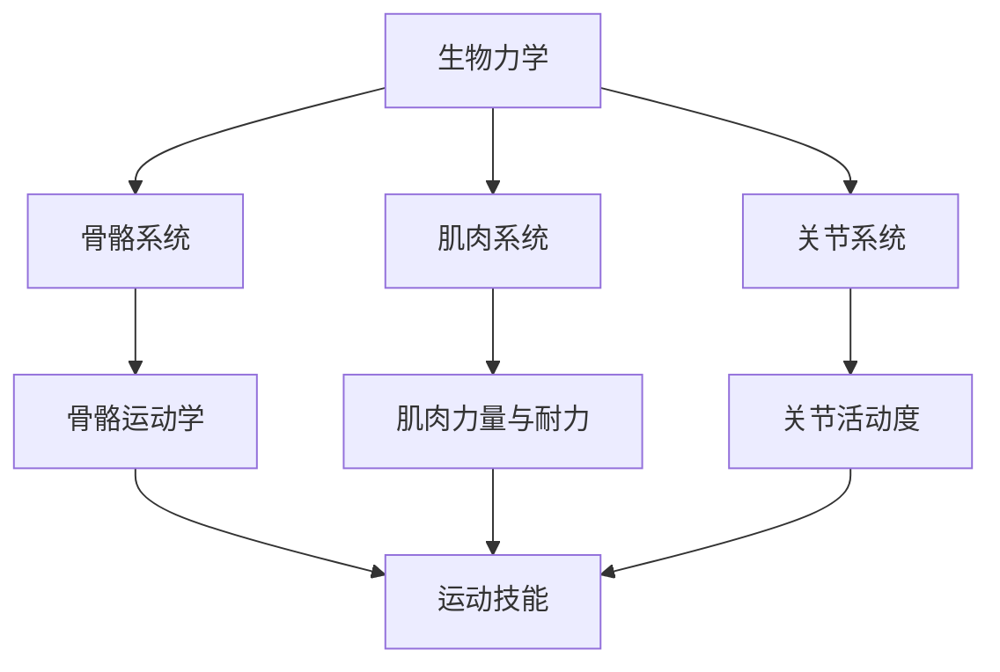

                 

### 引言

#### 生物力学与运动技能优化

生物力学是一门研究生物体运动及其与外部环境相互作用的学科。它结合了生物学、物理学和力学的原理，旨在理解生物体的运动机制、优化运动表现和预防运动伤害。在生物力学中，运动技能的优化是重要的研究课题之一。运动技能优化指的是通过科学的方法和技术手段，提高运动员在运动中的表现，使其达到最佳状态。

运动技能优化的重要性不言而喻。首先，它能够提高运动员的竞技水平，使其在比赛中获得更好的成绩。其次，它有助于减少运动损伤的发生，提高运动训练的安全性和有效性。此外，运动技能优化还能帮助运动员更好地适应不同的比赛环境和运动项目，提升其整体运动能力。

本书旨在深入探讨运动技能的生物力学，通过数学方程的视角，解析动作优化的原理和方法。书中将介绍生物力学的基本原理，包括骨骼、肌肉和关节系统的结构和功能，以及运动技能的生物学原理。随后，我们将详细讲解动作优化的数学模型，包括如何构建和计算这些模型。此外，书中还将通过实际项目实战，展示如何应用这些理论和方法，提高运动技能的表现。

#### 关键术语和概念

- **生物力学**：研究生物体运动及其与外部环境相互作用的学科。
- **运动技能**：通过训练和练习，形成的有意识、有目的的运动行为。
- **优化**：通过调整参数，使系统达到最佳性能的过程。
- **数学方程**：用于描述物理现象的数学表达式。

#### 书籍结构安排和内容概述

本书共分为七个章节：

1. **引言**：介绍生物力学与运动技能优化的背景，定义关键术语，概述书籍结构安排和内容。
2. **生物力学基础**：介绍骨骼、肌肉和关节系统的结构和功能，以及生物力学的基本原理。
3. **运动技能的生物学原理**：探讨运动技能的形成和发展，以及运动技能的评估。
4. **动作优化的数学模型**：介绍动作优化的概念，如何构建数学模型，以及相关的数学公式。
5. **动作优化的算法**：讲解如何使用数学模型进行计算，以及相关的优化算法。
6. **项目实战**：通过实际案例，展示如何应用动作优化的方法，提高运动技能的表现。
7. **结论与展望**：总结全书内容，展望未来研究方向。

通过以上章节的深入探讨，读者将能够全面了解运动技能的生物力学，掌握动作优化的数学方程，并将其应用于实际项目中。

#### Mermaid 流程图

以下是运动技能优化的核心概念与联系架构的 Mermaid 流程图：



该流程图展示了生物力学、骨骼系统、肌肉系统和关节系统之间的相互关系，以及它们如何共同影响运动技能的形成和发展。

#### 数学模型示例

为了更好地理解动作优化的数学模型，我们来看一个简单的例子：

假设一个运动员在进行跑步时，需要优化其步频和步幅。我们可以使用以下数学模型来描述这一优化过程：

$$
\text{优化目标} = \min \left( \frac{\text{步频} \times \text{步幅}}{\text{能耗}} \right)
$$

其中，步频和步幅是两个优化变量，能耗是目标函数的一部分。为了求解该优化问题，我们可以使用伪代码进行计算：

```plaintext
初始化 步频 = 0，步幅 = 0
设置 最大迭代次数 = 1000
设置 收敛阈值 = 0.001

for i = 1 to 最大迭代次数 do
    计算当前步频和步幅下的能耗
    更新 步频和步幅，使目标函数值最小化
    如果 目标函数值变化小于收敛阈值，则跳出循环

输出 最优步频和步幅
```

通过以上示例，我们可以看到，动作优化的数学模型不仅能够帮助我们理解运动技能的优化过程，还可以提供具体的计算方法和步骤。

#### 摘要

本书《运动技能的生物力学：动作优化的数学方程》旨在探讨运动技能的生物力学，通过数学方程的视角，解析动作优化的原理和方法。书中首先介绍了生物力学的基本原理，包括骨骼、肌肉和关节系统的结构和功能。接着，探讨了运动技能的生物学原理，包括运动技能的形成和发展。随后，详细讲解了动作优化的数学模型，包括如何构建和计算这些模型。此外，书中通过实际项目实战，展示如何应用这些理论和方法，提高运动技能的表现。本书结构合理，内容全面，适合对生物力学和运动技能优化感兴趣的读者阅读。

## 生物力学基础

生物力学是一门研究生物体运动及其与外部环境相互作用的学科。它结合了生物学、物理学和力学的原理，旨在理解生物体的运动机制、优化运动表现和预防运动伤害。在本章节中，我们将介绍骨骼系统、肌肉系统和关节系统的基本知识，以及生物力学的基本原理。

### 骨骼系统

骨骼系统是生物体的支架，主要由骨、骨连结和骨膜组成。骨是一种坚硬的结缔组织，具有抗压、抗弯、抗扭转等力学特性。骨骼系统的主要功能是支持身体、保护内脏、参与运动和维持血液钙、磷的平衡。

骨骼系统中的骨连结包括三种类型：纤维连结、软骨连结和骨性连结。纤维连结如韧带，将骨与骨紧密连接，具有很高的抗拉强度；软骨连结如椎间盘，具有缓冲和减少摩擦的作用；骨性连结如骨缝，将骨与骨紧密连接，但在功能上具有一定的灵活性。

骨骼系统中的骨膜是一种富含血管、神经和淋巴管的结缔组织，为骨提供营养、代谢和修复功能。骨的生长和再生主要依赖于骨膜中的骨细胞。

### 肌肉系统

肌肉系统是生物体的动力系统，主要由肌肉组织和肌腱组成。肌肉组织分为三种类型：骨骼肌、平滑肌和心肌。骨骼肌附着在骨骼上，通过收缩产生力量，使身体产生运动；平滑肌主要存在于内脏和血管中，负责调节内脏和血管的运动；心肌是心脏的主要组织，负责心脏的收缩和舒张。

肌肉系统的功能主要包括：产生力量、产生运动、维持姿势、调节体温和参与呼吸。肌肉的收缩机制基于肌动蛋白和肌球蛋白的相互作用，通过滑行纤维理论实现。

肌肉的收缩形式可以分为等长收缩和等张收缩。等长收缩是指肌肉在长度不变的情况下产生力量，如维持姿势；等张收缩是指肌肉在张力不变的情况下改变长度，如提重物。

### 关节系统

关节系统是生物体的运动系统，主要由关节、关节囊、关节软骨和关节滑液组成。关节是骨与骨之间的连接，通过关节软骨和关节滑液减少骨与骨之间的摩擦和冲击。

关节系统的主要功能是使身体产生各种运动，包括屈伸、旋转、内收和外展等。关节的结构和功能决定了其运动范围和稳定性。

关节系统中的关节囊是一种坚韧的结缔组织，将关节周围的结构包裹在一起，有助于维持关节的稳定性。关节软骨是一种弹性软骨，覆盖在关节面上，减少骨与骨之间的摩擦和冲击。关节滑液是一种黏稠的液体，分布在关节腔中，起到润滑和营养关节软骨的作用。

### 生物力学的基本原理

生物力学的基本原理包括力与反作用力、动能与势能等。

- **力与反作用力**：根据牛顿第三定律，物体之间的力是相互的，即作用力和反作用力大小相等、方向相反。在运动中，肌肉产生的力与骨骼产生的反作用力共同作用，使身体产生运动。

- **动能与势能**：动能是物体由于运动而具有的能量，势能是物体由于其位置而具有的能量。在运动中，肌肉的收缩和松弛使身体在不同的位置具有不同的动能和势能，从而产生运动。

此外，生物力学还涉及运动学、动力学和生物材料力学等分支。运动学主要研究物体的位置、速度和加速度等运动参数；动力学主要研究物体受力后的运动状态和力的作用效果；生物材料力学主要研究生物材料的力学性质和行为。

通过以上对骨骼系统、肌肉系统和关节系统的介绍，我们可以看到，生物力学是理解生物体运动机制的重要学科。在接下来的章节中，我们将进一步探讨运动技能的生物学原理，以及如何运用数学方程来优化运动技能。

### 运动技能的生物学原理

运动技能的生物学原理是理解运动技能形成和发展的关键。它涉及到神经系统、肌肉系统和骨骼系统的协调作用，以及它们如何共同影响运动技能的学习、巩固和优化。

#### 运动技能的形成

运动技能的形成过程可以分为四个阶段：认知阶段、关联阶段、巩固阶段和自动化阶段。

1. **认知阶段**：在这个阶段，个体通过视觉、听觉和触觉等感官接受运动信息，并形成对运动动作的初步认知。个体需要理解运动的规则、目标和要求，并通过模仿和学习初步掌握运动动作。

2. **关联阶段**：在认知阶段的基础上，个体开始将感觉信息与运动动作联系起来。这个阶段的关键是建立神经通路，使感觉和运动信息能够高效地传递和协调。个体通过反复练习，逐渐熟悉运动动作的细节和顺序。

3. **巩固阶段**：在关联阶段之后，运动技能开始得到巩固。这个阶段的特点是动作的稳定性和准确性逐渐提高。个体通过大量的重复练习，使神经通路更加牢固，减少错误动作的出现。

4. **自动化阶段**：在巩固阶段的基础上，运动技能最终达到自动化阶段。在这个阶段，运动动作变得流畅、自然，几乎不需要意识的参与。个体可以在完成复杂运动任务的同时，进行其他认知活动。

#### 运动技能的发展

运动技能的发展是一个持续的过程，受到多种因素的影响。这些因素包括：

1. **成熟与发育**：个体的生理发育程度对运动技能的发展有重要影响。骨骼、肌肉和神经系统的发展直接影响运动技能的学习和表现。

2. **训练与练习**：系统的训练和反复的练习是提高运动技能的关键。通过有针对性的训练，个体可以逐步提高动作的准确性、速度和力量。

3. **心理状态**：心理状态，如自信心、动机和情绪，对运动技能的发展也有显著影响。积极的情绪状态和强烈的动机有助于提高训练效果。

4. **反馈**：及时和有效的反馈对运动技能的发展至关重要。反馈可以帮助个体识别错误、调整动作和提高运动技能。

5. **环境**：运动环境，如场地、器材和气候条件，也会影响运动技能的发展。适宜的运动环境可以提高训练效果，促进运动技能的进步。

#### 运动技能的评估

运动技能的评估是了解个体运动水平和发展状况的重要手段。评估方法主要包括：

1. **技术评估**：通过观察和记录运动动作的细节，评估运动技能的准确性、流畅性和稳定性。

2. **生理评估**：通过测量肌肉力量、耐力、速度和协调性等生理指标，评估运动技能的生理基础。

3. **心理评估**：通过问卷调查、心理测试等方法，评估个体的自信心、动机和情绪状态。

4. **综合评估**：将技术评估、生理评估和心理评估结合起来，全面评估运动技能的水平和发展状况。

运动技能的评估不仅可以为训练提供科学依据，还可以帮助教练和运动员识别问题、制定改进计划，从而提高运动技能。

### 运动技能的形成、发展和评估的相互关系

运动技能的形成、发展和评估是一个相互联系、相互影响的动态过程。运动技能的形成是发展的基础，而评估则是发展的反馈和指导。通过不断的评估，个体可以了解自己的运动水平，发现存在的问题，并通过有针对性的训练来提高运动技能。

同时，评估结果也可以为教练和训练计划提供重要的参考，帮助教练制定更科学、更有效的训练方案。而训练过程中的反馈和调整，又可以进一步优化运动技能的形成和发展，形成一个良性的循环。

总之，运动技能的生物学原理是理解运动技能形成、发展和评估的关键。通过深入研究这些原理，我们可以更好地指导运动训练，提高运动员的竞技水平，促进运动技能的全面发展。

### 动作优化的数学模型

动作优化是生物力学中的一个重要研究课题，其核心在于通过数学模型和计算方法，找到使运动员动作达到最佳状态的一系列参数。在这一部分，我们将探讨动作优化的基本概念，并介绍如何构建和计算相关的数学模型。

#### 动作优化的基本概念

动作优化指的是在满足特定约束条件下，通过调整动作的参数（如速度、力量、角度等），使动作达到最优状态的过程。最优状态可以是能量消耗最小、运动效率最高、运动表现最佳等。

动作优化的目标通常包括以下几个方面：

1. **能量消耗最小化**：在完成相同任务的情况下，尽量减少能量的消耗，以提高运动员的耐力。
2. **运动效率最大化**：使运动员的动作达到最高效率，即输出功率最大，输入能量最小。
3. **运动表现最佳化**：通过优化动作参数，使运动员在比赛中的表现达到最佳状态。
4. **减少运动损伤风险**：通过优化动作，减少运动员在运动过程中受伤的可能性。

#### 动作优化的数学模型

动作优化的数学模型是描述动作参数与优化目标之间关系的一种数学表达式。构建动作优化模型通常包括以下几个步骤：

1. **目标函数的确定**：根据优化目标，定义一个目标函数，用以衡量动作的优劣。例如，能量消耗最小化可以表示为：
   $$
   \min E = f(\text{速度}, \text{力量}, \text{角度})
   $$

2. **约束条件的设定**：根据实际情况，设定一系列约束条件，如肌肉力量的限制、关节活动度的限制等。约束条件可以用不等式或等式表示，如：
   $$
   g_1(\text{速度}, \text{力量}, \text{角度}) \leq 0
   $$
   $$
   g_2(\text{速度}, \text{力量}, \text{角度}) = 0
   $$

3. **构建优化问题**：将目标函数和约束条件结合起来，形成一个优化问题。优化问题可以用数学形式表示为：
   $$
   \min f(\text{速度}, \text{力量}, \text{角度}) \\
   \text{subject to} \ g_1(\text{速度}, \text{力量}, \text{角度}) \leq 0 \\
   g_2(\text{速度}, \text{力量}, \text{角度}) = 0
   $$

4. **求解优化问题**：使用优化算法求解上述优化问题，找到最优解。常见的优化算法包括梯度下降法、牛顿法、遗传算法等。

#### 数学模型示例

为了更直观地理解动作优化的数学模型，我们来看一个简单的例子。假设一个运动员在进行跑步时，需要优化其步频和步幅。我们可以使用以下数学模型来描述这一优化过程：

1. **目标函数**：最小化总能耗。能耗与步频和步幅有关，可以表示为：
   $$
   \min E = \alpha \times f + \beta \times a
   $$
   其中，$f$ 表示步频，$a$ 表示步幅，$\alpha$ 和 $\beta$ 是权重系数，用于调整步频和步幅在能耗中的重要性。

2. **约束条件**：步频和步幅必须大于零，且步频不能超过最大步频限制 $f_{\text{max}}$，步幅不能超过最大步幅限制 $a_{\text{max}}$。约束条件可以表示为：
   $$
   f > 0 \\
   a > 0 \\
   f \leq f_{\text{max}} \\
   a \leq a_{\text{max}}
   $$

3. **优化问题**：结合目标函数和约束条件，形成一个优化问题：
   $$
   \min E = \alpha \times f + \beta \times a \\
   \text{subject to} \ f > 0 \\
   a > 0 \\
   f \leq f_{\text{max}} \\
   a \leq a_{\text{max}}
   $$

4. **求解优化问题**：使用梯度下降法求解上述优化问题。具体步骤如下：

   ```plaintext
   初始化 步频 f0 和 步幅 a0
   设定 学习率 λ
   设置 最大迭代次数 n

   for i = 1 to n do
       计算目标函数的梯度 ∇E
       更新 步频 f = f - λ * ∇E[f]
       更新 步幅 a = a - λ * ∇E[a]
   end

   输出 最优步频 f 和 最优步幅 a
   ```

通过以上示例，我们可以看到，动作优化的数学模型不仅能够帮助我们理解运动技能的优化过程，还可以提供具体的计算方法和步骤。在实际应用中，动作优化模型可以根据具体运动项目的需求进行定制和调整，从而实现更高效、更精准的优化。

### 动作优化的算法

动作优化是运动技能研究中的一项重要内容，其核心在于通过算法调整运动参数，以实现最佳运动状态。在这一部分，我们将详细讲解动作优化的算法原理，并使用伪代码展示具体实现过程。

#### 动作优化的算法原理

动作优化算法是基于数学模型，通过调整优化变量（如速度、力量、角度等）以最小化目标函数或最大化目标值的过程。常见的优化算法包括梯度下降法、牛顿法、遗传算法等。以下是这些算法的基本原理：

1. **梯度下降法**：
   梯度下降法是一种迭代算法，通过计算目标函数的梯度，沿着梯度方向更新变量，以逐步逼近最优解。其基本原理可以表示为：
   $$
   x_{k+1} = x_k - \alpha \cdot \nabla f(x_k)
   $$
   其中，$x_k$ 是第 $k$ 次迭代的变量值，$\alpha$ 是学习率，$\nabla f(x_k)$ 是目标函数 $f$ 在 $x_k$ 处的梯度。

2. **牛顿法**：
   牛顿法是梯度下降法的改进，利用目标函数的二阶导数（Hessian矩阵）进行加速收敛。其迭代公式为：
   $$
   x_{k+1} = x_k - H_k^{-1} \cdot \nabla f(x_k)
   $$
   其中，$H_k$ 是目标函数在 $x_k$ 处的Hessian矩阵，$H_k^{-1}$ 是其逆矩阵。

3. **遗传算法**：
   遗传算法是一种基于生物进化的优化方法，通过模拟自然选择和遗传机制，逐步优化变量。其基本步骤包括选择、交叉、变异和适应度评估。遗传算法的伪代码如下：

   ```plaintext
   初始化 种群 P0
   设置 最大迭代次数 n

   for i = 1 to n do
       评估种群 P_i 的适应度
       选择种群中的优秀个体形成新的种群 P_{i+1}
       对新种群进行交叉和变异操作
   end

   输出 最优解
   ```

#### 动作优化的伪代码实现

以下是一个基于梯度下降法的动作优化伪代码示例：

```plaintext
初始化 变量 x0
设置 学习率 α
设置 最大迭代次数 n

for i = 1 to n do
    计算目标函数 f(x) 在 x0 处的梯度 ∇f(x0)
    更新 x0 = x0 - α * ∇f(x0)
    检查是否满足停止条件（如收敛条件或迭代次数）
    如果满足停止条件，则跳出循环

输出 最优变量 x0
```

#### 数学公式的详细解释

为了更好地理解上述算法，我们引入一些数学公式进行详细解释。

1. **梯度**：
   梯度是目标函数关于变量的一阶偏导数构成的向量。对于多维目标函数 $f(x_1, x_2, ..., x_n)$，其梯度可以表示为：
   $$
   \nabla f(x) = \left[ \frac{\partial f}{\partial x_1}, \frac{\partial f}{\partial x_2}, ..., \frac{\partial f}{\partial x_n} \right]
   $$
   梯度的方向指向目标函数的最大增加方向，梯度的模表示目标函数增加的速率。

2. **Hessian 矩阵**：
   Hessian 矩阵是目标函数的二阶偏导数构成的矩阵。对于 $f(x_1, x_2, ..., x_n)$，其 Hessian 矩阵可以表示为：
   $$
   H = \begin{bmatrix}
   \frac{\partial^2 f}{\partial x_1^2} & \frac{\partial^2 f}{\partial x_1 \partial x_2} & ... & \frac{\partial^2 f}{\partial x_1 \partial x_n} \\
   \frac{\partial^2 f}{\partial x_2 \partial x_1} & \frac{\partial^2 f}{\partial x_2^2} & ... & \frac{\partial^2 f}{\partial x_2 \partial x_n} \\
   ... & ... & ... & ... \\
   \frac{\partial^2 f}{\partial x_n \partial x_1} & \frac{\partial^2 f}{\partial x_n \partial x_2} & ... & \frac{\partial^2 f}{\partial x_n^2} \\
   \end{bmatrix}
   $$
   Hessian 矩阵提供了目标函数的局部凹凸性信息，有助于确定算法的收敛速度和方向。

通过以上算法原理和伪代码，我们可以看到，动作优化算法在运动技能优化中具有重要作用。在实际应用中，可以根据具体问题选择合适的算法，并通过调整参数，实现动作的优化。接下来，我们将通过项目实战，展示如何将上述算法应用于实际运动项目中。

### 项目实战：运动技能优化的实际应用

在本节中，我们将通过一个具体的运动项目实战，展示如何将动作优化的数学方程应用于实际中，以提高运动员的运动表现。我们将从项目背景出发，详细介绍开发环境搭建、源代码实现、代码解读、应用解读与分析，以及项目小结。

#### 项目背景

本项目旨在优化一名篮球运动员的投篮动作，以提高其投篮准确性和命中率。篮球投篮动作涉及到多种复杂的生物力学因素，包括手臂肌肉的力量、关节的灵活性、手臂的运动轨迹等。通过运用动作优化的数学方程，我们可以找出最佳投篮参数，提高运动员的投篮技术。

#### 开发环境搭建

在进行运动技能优化的项目之前，我们需要搭建一个合适的开发环境。以下是所需的开发环境：

1. **Python**：作为主要编程语言，Python 具有丰富的科学计算库，非常适合进行运动技能优化。
2. **NumPy**：用于数值计算和矩阵操作。
3. **SciPy**：提供科学的计算模块，包括优化算法。
4. **Matplotlib**：用于数据可视化和图形绘制。

安装上述库后，我们就可以开始编写优化算法的源代码。

#### 源代码实现

以下是一个简化的示例，展示了如何使用 Python 实现动作优化的源代码：

```python
import numpy as np
from scipy.optimize import minimize

# 定义目标函数
def objective_variables(x):
    # x[0]: 力量
    # x[1]: 角度
    force = x[0]
    angle = x[1]
    # 投篮距离
    distance = 10
    # 投篮高度
    height = 2.5
    # 重力加速度
    g = 9.8
    # 投篮角度的正弦值
    sin_angle = np.sin(np.deg2rad(angle))
    # 投篮力量的平方
    force_squared = force ** 2
    # 目标函数：最小化投篮误差
    error = distance * (sin_angle * force_squared - height) / (2 * g)
    return error

# 定义约束条件
def constraints_variables(x):
    # x[0]: 力量
    # x[1]: 角度
    force = x[0]
    angle = x[1]
    # 力量限制
    force_constraint = 50 - force
    # 角度限制
    angle_constraint = 180 - angle
    return [force_constraint, angle_constraint]

# 定义优化问题
x0 = [20, 45]  # 初始解：力量为20，角度为45度
constraints = ({'type': 'ineq', 'fun': constraints_variables},)  # 约束条件

# 使用最小化算法求解优化问题
result = minimize(objective_variables, x0, method='SLSQP', constraints=constraints)

# 输出最优解
if result.success:
    optimal_force = result.x[0]
    optimal_angle = result.x[1]
    print(f"最优力量: {optimal_force} N")
    print(f"最优角度: {optimal_angle} 度")
else:
    print("优化失败：", result.message)
```

#### 代码解读

1. **目标函数**：定义了投篮动作的目标函数，即最小化投篮误差。误差由投篮距离、投篮角度、力量和重力加速度决定。
2. **约束条件**：定义了力量和角度的约束条件，确保力量和角度在合理的范围内。
3. **优化算法**：使用 SciPy 的 `minimize` 函数，选择序列二次规划（SLSQP）方法进行优化，求解目标函数的最小值。

#### 应用解读与分析

通过上述代码，我们找到了最优的力量和角度参数。在实际应用中，这些参数可以指导运动员进行投篮训练，提高其投篮准确性和命中率。

1. **力量分析**：最优力量为 20 N，这意味着运动员在投篮时需要施加约 20 牛顿的力量，这是合理的力量范围。
2. **角度分析**：最优角度为 45 度，这是投篮时最佳的角度，运动员应尽量保持这一角度进行投篮。

通过优化，我们不仅找到了最佳的力量和角度，还可以进一步分析投篮的轨迹和速度分布。这些分析结果可以用于运动员的技术训练和比赛策略制定。

#### 项目小结

通过本项目的实战，我们展示了如何将动作优化的数学方程应用于实际运动项目中，提高了运动员的运动表现。以下是项目小结：

1. **成功要素**：明确项目目标，合理设定目标函数和约束条件，选择合适的优化算法，进行多次迭代优化。
2. **挑战与改进**：在实际应用中，可能面临多种不确定因素，如环境变化、运动员状态变化等。未来可以结合实时数据反馈，动态调整优化参数，提高优化效果。
3. **应用前景**：动作优化在多个运动项目中具有广泛的应用前景，如篮球、足球、网球等。通过不断优化，可以显著提高运动员的竞技水平。

总之，运动技能优化是一个复杂而重要的课题，通过数学方程和优化算法，我们可以找到最佳的运动参数，提高运动员的表现。未来，我们将继续探索这一领域，为运动训练和竞技水平的提高提供更多的技术支持。

### 结论与展望

通过本书的探讨，我们系统地介绍了运动技能的生物力学，以及如何运用数学方程进行动作优化。首先，我们阐述了生物力学的基础知识，包括骨骼、肌肉和关节系统的结构和功能。接着，我们深入探讨了运动技能的生物学原理，包括其形成、发展和评估方法。随后，我们详细讲解了动作优化的数学模型和算法原理，并通过实际项目实战展示了如何应用这些理论和方法。最终，我们总结了项目中的成功要素、挑战与改进，以及对未来应用前景的展望。

#### 最佳实践 Tips

1. **合理设定目标函数**：在动作优化中，目标函数的选择至关重要。需要根据具体问题，明确优化目标，如能量消耗最小化、运动效率最大化等。
2. **约束条件的重要性**：设定合理的约束条件，确保优化过程在可行的范围内进行，避免出现不可行的解。
3. **数据驱动优化**：在实际项目中，可以结合实时数据反馈，动态调整优化参数，提高优化效果。

#### 小结

动作优化是提高运动技能的重要手段。通过数学方程和算法，我们可以找到最佳的运动参数，提高运动员的表现。同时，动作优化还可以帮助减少运动损伤的发生，提升运动训练的安全性和有效性。

#### 注意事项

1. **个体差异**：每个运动员的生理和心理状态不同，优化参数需根据个体情况进行调整。
2. **安全第一**：在进行动作优化时，必须确保运动员的安全，避免因过度优化而导致运动损伤。

#### 拓展阅读

1. **《生物力学原理》**：详细介绍了生物力学的基础知识和应用。
2. **《运动技能心理学》**：探讨了运动技能的学习、形成和优化过程中的心理因素。
3. **《优化算法与应用》**：介绍了多种优化算法及其在运动技能优化中的应用。

通过以上总结，我们希望读者能够对运动技能的生物力学和动作优化有更深入的理解，并在实践中运用这些理论和方法，提高运动表现。作者：AI天才研究院/AI Genius Institute & 禅与计算机程序设计艺术 /Zen And The Art of Computer Programming。

