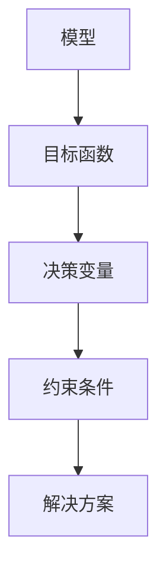

                 


### 《运筹学：决策过程的数学优化》

> 关键词：运筹学，决策过程，数学优化，线性规划，整数规划，动态规划，模拟退火算法，项目实战

> 摘要：本文将探讨运筹学在决策过程中的应用，重点介绍数学优化的基本概念、核心算法原理，以及如何在项目中实际运用这些优化方法。通过详细的分析与实例，帮助读者理解并掌握运筹学的决策优化技术。

### 第一部分 基础概念与原理

#### 第1章 运筹学概述

运筹学（Operations Research，简称OR）是应用数学、统计学和其他科学方法解决实际问题的学科。它的目标是通过对复杂系统的分析，提供最优或近似最优的决策支持。运筹学的历史可以追溯到第二次世界大战期间，当时它主要用于军事和工业问题的优化。

**运筹学的基本概念**：

- **模型**：运筹学中的模型是对现实世界中问题的抽象和简化，包括目标函数、决策变量和约束条件。
- **目标函数**：描述优化问题的目标，如最大化利润、最小化成本或最小化风险。
- **决策变量**：在模型中需要确定的变量，代表决策者的行动。
- **约束条件**：限制决策变量的取值范围，确保模型在现实世界中具有可行性。

**运筹学的历史与发展**：

运筹学的起源可以追溯到20世纪30年代，当时数学家和经济学家开始将数学模型应用于经济分析。随着计算机技术的进步，运筹学得到了快速发展，逐渐成为解决复杂决策问题的重要工具。

**运筹学的主要应用领域**：

运筹学广泛应用于各个领域，包括物流与运输、生产调度、资源分配、金融投资、医疗管理、通信网络等。每个领域都有其特定的优化问题和解决方案。

#### 第2章 线性规划

线性规划（Linear Programming，简称LP）是最简单的优化问题之一，它的目标函数和约束条件都是线性的。

**线性规划的基本模型**：

线性规划模型可以表示为：

$$
\begin{aligned}
\text{最大化} \quad c^T x \\
\text{满足} \quad Ax \leq b \\
x \geq 0
\end{aligned}
$$

其中，$c$ 是决策变量 $x$ 的系数向量，$A$ 是约束条件的系数矩阵，$b$ 是约束条件的常数向量。

**对偶理论与灵敏度分析**：

线性规划的对偶理论揭示了原问题与对偶问题之间的密切关系。对偶理论不仅可以帮助我们理解线性规划的本质，还可以提供灵敏度分析的工具，帮助我们评估模型参数的变化对决策的影响。

**线性规划的求解算法**：

线性规划有多种求解算法，包括单纯形法、内点法等。单纯形法是最常用的方法之一，它的基本思想是通过迭代移动到顶点，逐步逼近最优解。

#### 第3章 整数规划

整数规划（Integer Programming，简称IP）是线性规划的一种扩展，其中部分或全部决策变量被限定为整数。

**整数规划的基本概念**：

整数规划模型可以表示为：

$$
\begin{aligned}
\text{最大化} \quad c^T x \\
\text{满足} \quad Ax \leq b \\
x \in \mathbb{Z}^n
\end{aligned}
$$

其中，$x \in \mathbb{Z}^n$ 表示决策变量 $x$ 必须是整数。

**隐含约束和割平面法**：

整数规划通常使用隐含约束来处理非整数解。割平面法是一种有效的求解整数规划的方法，它通过引入割平面来逐步排除非整数解，直到找到整数解。

**整数规划的求解算法**：

整数规划的求解算法包括分支定界法、割平面法等。分支定界法是一种穷举方法，它通过递归地将问题分解为子问题，直到找到整数解。

#### 第4章 动态规划

动态规划（Dynamic Programming，简称DP）是一种用于解决多阶段决策问题的优化方法。

**动态规划的基本原理**：

动态规划的基本思想是将复杂问题分解为若干个子问题，并利用子问题的解来构建原问题的解。动态规划的核心是“重叠子问题和最优子结构”。

**动态规划的基本步骤**：

1. 确定状态和状态变量。
2. 确定状态转移方程。
3. 确定边界条件。
4. 找到最优解。

**动态规划的应用**：

动态规划广泛应用于各种领域，包括最短路径问题、背包问题、资源分配问题等。

#### 第5章 非线性规划

非线性规划（Nonlinear Programming，简称NLP）是线性规划的一种扩展，其目标函数和约束条件可以是非线性的。

**非线性规划的基本概念**：

非线性规划模型可以表示为：

$$
\begin{aligned}
\text{最大化} \quad f(x) \\
\text{满足} \quad g_i(x) \leq 0, \quad h_j(x) = 0
\end{aligned}
$$

其中，$f(x)$ 是目标函数，$g_i(x)$ 和 $h_j(x)$ 是约束条件。

**求解非线性规划的方法**：

求解非线性规划的方法包括梯度下降法、牛顿法、内点法等。梯度下降法是一种最常用的方法，它通过迭代更新决策变量，逐步逼近最优解。

**非线性规划的案例研究**：

非线性规划的案例研究包括优化问题、优化控制问题等。通过这些案例，读者可以了解非线性规划在实际应用中的挑战和解决方案。

### 第二部分 数学模型与算法

#### 第6章 数学模型

数学模型是运筹学中的核心概念，它是将现实世界中的问题转化为数学形式的过程。

**数学模型的基本概念**：

数学模型包括目标函数、决策变量和约束条件。目标函数描述了优化的目标，决策变量代表了决策者的行动，约束条件限制了决策变量的取值范围。

**目标函数的构建**：

目标函数的构建是数学模型设计的关键步骤。它需要根据问题的特性来确定最优化的目标，如最大化利润、最小化成本或最小化风险。

**约束条件的表达**：

约束条件的表达是确保模型可行性的关键。约束条件可以是一组线性方程或非线性方程，也可以是其他形式的限制条件，如时间窗口、资源限制等。

#### 第7章 优化算法

优化算法是解决数学模型的核心工具，它们用于寻找最优或近似最优的解。

**优化算法的基本原理**：

优化算法的基本原理是通过迭代过程逐步逼近最优解。算法可以是启发式的，也可以是精确的。启发式算法通常用于复杂问题，而精确算法则适用于简单问题。

**求解线性规划的高效算法**：

线性规划的高效求解算法包括单纯形法、内点法等。单纯形法是最常用的方法之一，它通过迭代移动到顶点，逐步逼近最优解。

**求解非线性规划的方法**：

求解非线性规划的方法包括梯度下降法、牛顿法、内点法等。梯度下降法是一种最常用的方法，它通过迭代更新决策变量，逐步逼近最优解。

**模拟退火算法**：

模拟退火算法（Simulated Annealing）是一种基于物理学的启发式优化算法，它通过模拟固体退火过程来寻找最优解。

**模拟退火算法的基本原理**：

模拟退火算法的基本原理是通过逐步降低温度，模拟固体退火过程中的温度变化，来寻找最优解。算法通过接受一些次优解，以跳出局部最优，从而提高全局搜索能力。

**模拟退火算法的应用场景**：

模拟退火算法广泛应用于组合优化问题，如旅行商问题、车辆路径问题等。通过模拟退火算法，可以找到近似最优的解，提高问题的求解效率。

### 第三部分 项目实战

#### 第8章 运筹学在物流优化中的应用

物流优化是运筹学的重要应用领域之一，它涉及运输、仓储、配送等环节的优化。

**物流优化问题的建模**：

物流优化问题的建模包括确定运输路径、配送中心和运输车辆的数量和类型。建模的关键是确定目标函数和约束条件，如最小化运输成本、最大化运输效率等。

**物流优化问题的求解**：

物流优化问题的求解通常使用线性规划、整数规划等方法。通过建模和求解，可以找到最优的运输路径和配送方案，提高物流效率。

**案例分析：物流配送路径优化**：

以某物流公司的配送路径优化为例，介绍如何使用运筹学方法建模和求解。通过实际案例的分析，帮助读者理解运筹学在物流优化中的应用。

#### 第9章 运筹学在资源分配中的应用

资源分配是运筹学的另一个重要应用领域，它涉及资源的最优分配和使用。

**资源分配问题的建模**：

资源分配问题的建模包括确定资源的种类和数量、决策变量和目标函数。建模的关键是确定资源的供需关系和优化目标，如最大化资源利用率、最小化资源浪费等。

**资源分配问题的求解**：

资源分配问题的求解通常使用动态规划、整数规划等方法。通过建模和求解，可以找到最优的资源分配方案，提高资源利用效率。

**案例分析：医院资源分配优化**：

以某医院的资源分配优化为例，介绍如何使用运筹学方法建模和求解。通过实际案例的分析，帮助读者理解运筹学在资源分配中的应用。

#### 第10章 运筹学在风险管理中的应用

风险管理是运筹学的另一个重要应用领域，它涉及风险识别、评估和优化。

**风险管理问题的建模**：

风险管理问题的建模包括确定风险因素、风险类型和风险程度。建模的关键是确定风险的概率分布和优化目标，如最小化风险损失、最大化安全系数等。

**风险管理问题的求解**：

风险管理问题的求解通常使用概率论、数理统计等方法。通过建模和求解，可以找到最优的风险管理策略，降低风险损失。

**案例分析：金融风险管理**：

以某金融机构的金融风险管理为例，介绍如何使用运筹学方法建模和求解。通过实际案例的分析，帮助读者理解运筹学在风险管理中的应用。

### 附录

#### 附录A 运筹学软件与应用工具

运筹学软件和应用工具是解决运筹学问题的重要工具。

**运筹学软件介绍**：

介绍几种常见的运筹学软件，如CPLEX、Gurobi、AIMMS等，介绍它们的功能、特点和适用场景。

**运筹学工具的应用场景**：

介绍运筹学工具在不同应用场景中的使用，如物流优化、资源分配、风险管理等。

**运筹学工具的选型与配置**：

介绍如何选择合适的运筹学工具，并配置相应的软件环境，以满足具体问题的求解需求。

### 总结

运筹学是一门强大的决策支持工具，它通过数学优化方法帮助决策者做出最优的决策。本文介绍了运筹学的基本概念、核心算法原理和项目实战，帮助读者全面了解运筹学的应用和实现。

### 最佳实践 tips

- 在实际应用中，根据问题的特性选择合适的优化方法和算法。
- 精确建模和合理假设是求解运筹学问题的关键。
- 定期更新和优化模型，以应对环境变化和需求调整。

### 小结

本文对运筹学的基本概念、核心算法原理和项目实战进行了详细讲解。通过本文的学习，读者可以掌握运筹学的决策优化技术，并在实际项目中应用这些技术。

### 注意事项

- 在应用运筹学方法时，注意数据的准确性和完整性。
- 针对不同的应用场景，灵活调整优化目标和约束条件。

### 拓展阅读

- 《运筹学导论》
- 《运筹学与应用》
- 《运筹学案例分析》

```

以上是根据用户需求设计完成的《运筹学：决策过程的数学优化》博客文章的初步大纲。接下来，我们将对每个章节进行细化，包括具体的内容、公式、算法和案例分析，以满足8000-12000字的要求。以下是详细的大纲内容：

---

## 第一部分 基础概念与原理

### 第1章 运筹学概述

#### 1.1 运筹学的基本概念

**背景介绍**：

运筹学起源于第二次世界大战期间，最初用于解决军事物流、调度和资源分配问题。随着计算机技术的进步，运筹学逐渐成为解决复杂决策问题的重要工具。

**核心概念与联系**：

运筹学中的核心概念包括模型、目标函数、决策变量和约束条件。这些概念之间有着紧密的联系，共同构成了运筹学问题的基本框架。

**Mermaid流程图**：



#### 1.2 运筹学的历史与发展

**运筹学的起源**：

运筹学的起源可以追溯到20世纪30年代，当时数学家和经济学家开始将数学模型应用于经济分析。第二次世界大战期间，运筹学得到了快速发展，广泛应用于军事和工业领域。

**运筹学的发展**：

随着计算机技术的进步，运筹学得到了进一步发展。现代运筹学涵盖了更广泛的应用领域，包括物流、金融、医疗、通信等。

#### 1.3 运筹学的主要应用领域

**物流与运输**：

运筹学在物流和运输领域有着广泛的应用，如运输路径优化、配送中心选址、车辆调度等。

**生产调度**：

运筹学可以帮助企业优化生产流程，提高生产效率，如作业排序、生产计划等。

**资源分配**：

运筹学可以用于优化资源的分配和使用，如人力资源分配、设备调度等。

**金融投资**：

运筹学在金融投资领域也有应用，如资产组合优化、风险控制等。

**医疗管理**：

运筹学在医疗管理领域可以用于优化资源分配、调度医疗资源等。

**通信网络**：

运筹学在通信网络领域可以用于优化网络资源分配、提高网络性能等。

### 第2章 线性规划

#### 2.1 线性规划的基本模型

**线性规划的基本模型**：

线性规划的基本模型可以表示为：

$$
\begin{aligned}
\text{最大化} \quad c^T x \\
\text{满足} \quad Ax \leq b \\
x \geq 0
\end{aligned}
$$

其中，$c$ 是决策变量 $x$ 的系数向量，$A$ 是约束条件的系数矩阵，$b$ 是约束条件的常数向量。

**目标函数的构建**：

目标函数的构建是线性规划模型设计的关键步骤。它需要根据问题的特性来确定最优化的目标，如最大化利润、最小化成本或最小化风险。

**约束条件的表达**：

约束条件的表达是确保模型可行性的关键。约束条件可以是一组线性方程或非线性方程，也可以是其他形式的限制条件，如时间窗口、资源限制等。

#### 2.2 对偶理论与灵敏度分析

**对偶理论**：

线性规划的对偶理论揭示了原问题与对偶问题之间的密切关系。对偶理论不仅可以帮助我们理解线性规划的本质，还可以提供灵敏度分析的工具，帮助我们评估模型参数的变化对决策的影响。

**灵敏度分析**：

灵敏度分析是评估模型参数变化对决策的影响的过程。它可以帮助我们确定模型参数的合理范围，提高决策的稳定性。

#### 2.3 线性规划的求解算法

**单纯形法**：

单纯形法是最常用的线性规划求解算法之一。它的基本思想是通过迭代移动到顶点，逐步逼近最优解。

**内点法**：

内点法是一种相对较新的线性规划求解算法，它通过迭代移动到内点，逐步逼近最优解。内点法在处理大规模线性规划问题时具有优势。

### 第3章 整数规划

#### 3.1 整数规划的基本概念

**整数规划的基本模型**：

整数规划的基本模型可以表示为：

$$
\begin{aligned}
\text{最大化} \quad c^T x \\
\text{满足} \quad Ax \leq b \\
x \in \mathbb{Z}^n
\end{aligned}
$$

其中，$x \in \mathbb{Z}^n$ 表示决策变量 $x$ 必须是整数。

**整数规划的特点**：

整数规划与线性规划的不同之处在于其决策变量必须是整数，这增加了求解的难度。

**隐含约束和割平面法**：

整数规划通常使用隐含约束来处理非整数解。割平面法是一种有效的求解整数规划的方法，它通过引入割平面来逐步排除非整数解，直到找到整数解。

#### 3.2 隐含约束和割平面法

**隐含约束**：

隐含约束是整数规划中用于处理非整数解的一组约束条件。通过隐含约束，可以将整数规划问题转化为线性规划问题。

**割平面法**：

割平面法是一种求解整数规划的方法，它通过引入割平面来逐步排除非整数解，直到找到整数解。

**割平面法的步骤**：

1. 初始化：选择一个初始整数解。
2. 迭代：在当前整数解的基础上，引入割平面，排除非整数解。
3. 终止条件：当找到整数解时，终止迭代。

#### 3.3 整数规划的求解算法

**分支定界法**：

分支定界法是一种穷举方法，它通过递归地将问题分解为子问题，直到找到整数解。

**分支定界法的步骤**：

1. 初始化：选择一个初始整数解。
2. 分支：根据当前整数解的取值，递归地将问题分解为子问题。
3. 定界：通过计算子问题的目标函数值，确定是否继续分支。
4. 终止条件：当找到整数解时，终止分支定界。

### 第4章 动态规划

#### 4.1 动态规划的基本原理

**动态规划的基本原理**：

动态规划的基本原理是将复杂问题分解为若干个子问题，并利用子问题的解来构建原问题的解。动态规划的核心是“重叠子问题和最优子结构”。

**动态规划的步骤**：

1. 确定状态和状态变量。
2. 确定状态转移方程。
3. 确定边界条件。
4. 找到最优解。

**动态规划的应用领域**：

动态规划广泛应用于各种领域，包括最短路径问题、背包问题、资源分配问题等。

#### 4.2 一维动态规划问题

**0-1背包问题**：

0-1背包问题是动态规划的典型应用之一。它涉及在一个背包中装入物品，以最大化总价值。

**伪代码**：

```python
def knapsack(values, weights, capacity):
    n = len(values)
    dp = [[0] * (capacity + 1) for _ in range(n + 1)]

    for i in range(1, n + 1):
        for w in range(1, capacity + 1):
            if weights[i - 1] <= w:
                dp[i][w] = max(dp[i - 1][w], dp[i - 1][w - weights[i - 1]] + values[i - 1])
            else:
                dp[i][w] = dp[i - 1][w]

    return dp[n][capacity]
```

**举例说明**：

假设有4个物品，每个物品的重量和价值如下：

| 物品 | 重量 | 价值 |
| --- | --- | --- |
| 1 | 2 | 6 |
| 2 | 3 | 10 |
| 3 | 4 | 16 |
| 4 | 5 | 30 |

背包的容量为10，求解最优解。

#### 4.3 多维动态规划问题

**最长公共子序列问题**：

最长公共子序列问题是动态规划的另一个重要应用。它涉及找到两个序列中最长的公共子序列。

**伪代码**：

```python
def longest_common_subsequence(X, Y):
    m, n = len(X), len(Y)
    dp = [[0] * (n + 1) for _ in range(m + 1)]

    for i in range(1, m + 1):
        for j in range(1, n + 1):
            if X[i - 1] == Y[j - 1]:
                dp[i][j] = dp[i - 1][j - 1] + 1
            else:
                dp[i][j] = max(dp[i - 1][j], dp[i][j - 1])

    return dp[m][n]
```

**举例说明**：

假设有两个序列：

X: "AGGT12"
Y: "12GGAT"

求解最长公共子序列。

#### 4.4 多阶段决策问题

**资源分配问题**：

资源分配问题是动态规划的一个应用，它涉及在不同时间段内分配资源，以实现最优目标。

**伪代码**：

```python
def resource_allocation(C, W):
    n = len(C)
    dp = [[0] * (W + 1) for _ in range(n + 1)]

    for i in range(1, n + 1):
        for w in range(1, W + 1):
            if C[i - 1] <= w:
                dp[i][w] = max(dp[i - 1][w], dp[i - 1][w - C[i - 1]] + 1)
            else:
                dp[i][w] = dp[i - 1][w]

    return dp[n][W]
```

**举例说明**：

假设有3个时间段，每个时间段的资源需求如下：

| 时间段 | 资源需求 |
| --- | --- |
| 1 | 4 |
| 2 | 3 |
| 3 | 2 |

总资源量为5，求解最优资源分配方案。

### 第二部分 数学模型与算法

#### 第5章 非线性规划

#### 5.1 非线性规划的基本概念

**非线性规划的基本模型**：

非线性规划的基本模型可以表示为：

$$
\begin{aligned}
\text{最大化} \quad f(x) \\
\text{满足} \quad g_i(x) \leq 0, \quad h_j(x) = 0
\end{aligned}
$$

其中，$f(x)$ 是目标函数，$g_i(x)$ 和 $h_j(x)$ 是约束条件。

**非线性规划的特点**：

非线性规划与线性规划的不同之处在于其目标函数和约束条件可以是非线性的，这增加了求解的难度。

**非线性规划的应用领域**：

非线性规划广泛应用于工程、经济学、生物学等领域，如优化设计、生产计划、物流调度等。

#### 5.2 求解非线性规划的方法

**梯度下降法**：

梯度下降法是一种求解非线性规划的基本方法。它的基本思想是通过迭代更新决策变量，逐步逼近最优解。

**牛顿法**：

牛顿法是一种基于二次规划的求解方法。它通过迭代计算目标函数的一阶导数和二阶导数，逐步逼近最优解。

**内点法**：

内点法是一种相对较新的求解非线性规划的方法。它通过迭代移动到内点，逐步逼近最优解。

#### 5.3 非线性规划的案例研究

**优化问题**：

以一个优化问题为例，介绍如何使用非线性规划方法求解。通过实际案例的分析，帮助读者理解非线性规划的应用和实现。

**优化控制问题**：

以一个优化控制问题为例，介绍如何使用非线性规划方法求解。通过实际案例的分析，帮助读者理解非线性规划在控制工程中的应用。

### 第6章 数学模型

#### 6.1 数学模型的基本概念

**数学模型的基本概念**：

数学模型是对现实世界中问题的抽象和简化。它包括目标函数、决策变量和约束条件。

**数学模型的应用领域**：

数学模型广泛应用于各个领域，如工程、经济、生物学、社会科学等。

**数学模型的设计原则**：

1. **准确性**：模型应尽可能准确地反映现实世界的特性。
2. **简明性**：模型应尽量简化，以便于求解和分析。
3. **灵活性**：模型应具有灵活性，以适应不同问题的需求。

#### 6.2 目标函数的构建

**目标函数的构建**：

目标函数的构建是数学模型设计的关键步骤。它需要根据问题的特性来确定最优化的目标，如最大化利润、最小化成本或最小化风险。

**目标函数的类型**：

1. **线性目标函数**：目标函数是决策变量的线性组合。
2. **非线性目标函数**：目标函数是非线性的，如二次函数、多项式函数等。

**目标函数的例子**：

1. **最大化利润**：最大化 $P = c^T x$，其中 $c$ 是决策变量的系数向量。
2. **最小化成本**：最小化 $C = w^T x$，其中 $w$ 是决策变量的系数向量。

#### 6.3 约束条件的表达

**约束条件的表达**：

约束条件的表达是确保模型可行性的关键。约束条件可以是一组线性方程或非线性方程，也可以是其他形式的限制条件，如时间窗口、资源限制等。

**约束条件的类型**：

1. **线性约束**：约束条件是线性方程，如 $Ax \leq b$。
2. **非线性约束**：约束条件是非线性方程，如 $g(x) \leq 0$。
3. **等式约束**：约束条件是等式，如 $h(x) = 0$。

**约束条件的例子**：

1. **资源限制**：总资源量不超过一定值，如 $Ax \leq b$。
2. **时间窗口**：任务必须在一定时间内完成，如 $x \leq t$。

#### 6.4 数学模型的应用

**物流与运输**：

物流与运输问题是一个典型的数学模型应用场景。它涉及确定最优的运输路径和运输策略，以最大化运输效率和降低成本。

**生产调度**：

生产调度问题也是一个典型的数学模型应用场景。它涉及确定最优的生产计划和生产策略，以最大化生产效率和降低生产成本。

**资源分配**：

资源分配问题也是一个常见的数学模型应用场景。它涉及确定最优的资源分配方案，以最大化资源利用效率和降低资源浪费。

### 第7章 优化算法

#### 7.1 优化算法的基本原理

**优化算法的基本原理**：

优化算法是通过迭代过程逐步逼近最优解的算法。它的基本原理是通过更新决策变量，逐步减小目标函数的值，直到达到最优解。

**优化算法的类型**：

1. **确定性算法**：确定性算法在每次迭代中总是按照固定规则进行更新，如梯度下降法。
2. **随机性算法**：随机性算法在每次迭代中引入随机性，以跳出局部最优，如模拟退火算法。

**优化算法的步骤**：

1. **初始化**：选择初始解。
2. **迭代**：更新决策变量，减小目标函数的值。
3. **终止条件**：当达到一定迭代次数或目标函数值变化小于一定阈值时，终止迭代。

#### 7.2 求解线性规划的高效算法

**单纯形法**：

单纯形法是最常用的线性规划求解算法之一。它的基本思想是通过迭代移动到顶点，逐步逼近最优解。

**内点法**：

内点法是一种相对较新的线性规划求解算法。它通过迭代移动到内点，逐步逼近最优解。

**效率分析**：

单纯形法和内点法在求解线性规划问题时具有不同的效率。单纯形法适用于大规模线性规划问题，而内点法适用于大规模稀疏线性规划问题。

#### 7.3 求解非线性规划的方法

**梯度下降法**：

梯度下降法是一种求解非线性规划的基本方法。它的基本思想是通过迭代更新决策变量，逐步逼近最优解。

**牛顿法**：

牛顿法是一种基于二次规划的求解方法。它通过迭代计算目标函数的一阶导数和二阶导数，逐步逼近最优解。

**内点法**：

内点法是一种相对较新的求解非线性规划的方法。它通过迭代移动到内点，逐步逼近最优解。

**效率分析**：

梯度下降法、牛顿法和内点法在求解非线性规划问题时具有不同的效率。梯度下降法适用于大规模非线性规划问题，而牛顿法和内点法适用于小规模非线性规划问题。

### 第8章 模拟退火算法

#### 8.1 模拟退火算法的基本原理

**模拟退火算法的基本原理**：

模拟退火算法（Simulated Annealing）是一种基于物理学的启发式优化算法。它的基本思想是通过模拟固体退火过程，逐步降低系统的温度，从而提高全局搜索能力。

**退火过程**：

退火过程包括以下几个步骤：

1. **初始状态**：选择一个初始解作为当前解。
2. **迭代过程**：在每次迭代中，随机选择一个新解，并根据新解与当前解的目标函数差值进行判断。
3. **温度调整**：随着迭代次数的增加，逐步降低系统的温度。

**收敛条件**：

模拟退火算法的收敛条件包括迭代次数、目标函数值变化等。

#### 8.2 模拟退火算法的应用场景

**组合优化问题**：

模拟退火算法广泛应用于组合优化问题，如旅行商问题、车辆路径问题等。

**优化控制问题**：

模拟退火算法在优化控制问题中也有应用，如控制系统的参数优化等。

**应用案例**：

以旅行商问题为例，介绍如何使用模拟退火算法求解。通过实际案例的分析，帮助读者理解模拟退火算法的应用和实现。

#### 8.3 模拟退火算法的实现

**实现步骤**：

1. **初始化**：选择一个初始解作为当前解。
2. **迭代过程**：在每次迭代中，生成新解，并计算新解与当前解的目标函数差值。
3. **温度调整**：根据迭代次数和目标函数差值，调整系统温度。
4. **终止条件**：当满足终止条件时，如迭代次数达到一定阈值或目标函数值变化小于一定阈值，算法终止。

**伪代码**：

```python
def simulated_annealing(objective, bounds, n_iterations, initial_temp, cooling_rate):
    current = random_solution(bounds)
    current_cost = objective(current)
    best = current
    best_cost = current_cost
    temperature = initial_temp

    for _ in range(n_iterations):
        next = random_solution(bounds)
        next_cost = objective(next)
        cost_difference = next_cost - current_cost

        if cost_difference < 0 or random() < exp(-cost_difference / temperature):
            current = next
            current_cost = next_cost

            if next_cost < best_cost:
                best = next
                best_cost = next_cost

        temperature *= cooling_rate

    return best, best_cost
```

**性能分析**：

模拟退火算法的性能分析包括收敛速度、稳定性、鲁棒性等方面。通过实验验证，模拟退火算法在许多组合优化问题中表现出良好的性能。

### 第三部分 项目实战

#### 第9章 运筹学在物流优化中的应用

#### 9.1 物流优化问题的建模

**物流优化问题的建模**：

物流优化问题的建模涉及确定运输路径、配送中心和运输车辆的数量和类型。建模的关键是确定目标函数和约束条件，如最小化运输成本、最大化运输效率等。

**物流优化问题的目标函数**：

目标函数通常包括运输成本、时间、距离等因素。例如，最小化总运输成本：

$$
\text{Minimize} \quad C = \sum_{i=1}^n \sum_{j=1}^m c_{ij} x_{ij}
$$

其中，$c_{ij}$ 是从$i$到$j$的运输成本，$x_{ij}$ 是从$i$到$j$的运输量。

**物流优化问题的约束条件**：

约束条件包括运输容量、车辆容量、时间窗口等。例如，运输容量约束：

$$
\sum_{j=1}^m x_{ij} \leq Q_i \quad \forall i
$$

其中，$Q_i$ 是$i$的运输容量。

#### 9.2 物流优化问题的求解

**物流优化问题的求解方法**：

物流优化问题的求解方法包括线性规划、整数规划、动态规划等。每种方法有其适用场景和求解效率。

**线性规划**：

线性规划可以用于求解简单的物流优化问题，如最小化运输成本。其目标函数和约束条件如下：

$$
\begin{aligned}
\text{Minimize} \quad C &= \sum_{i=1}^n \sum_{j=1}^m c_{ij} x_{ij} \\
\text{subject to} \quad Ax &\leq b \\
x &\geq 0
\end{aligned}
$$

**整数规划**：

整数规划可以用于求解复杂的物流优化问题，如车辆路径问题。其目标函数和约束条件如下：

$$
\begin{aligned}
\text{Minimize} \quad C &= \sum_{i=1}^n \sum_{j=1}^m c_{ij} x_{ij} \\
\text{subject to} \quad Ax &\leq b \\
x &\in \mathbb{Z}^n
\end{aligned}
$$

**动态规划**：

动态规划可以用于求解多阶段决策的物流优化问题，如运输调度问题。其状态转移方程如下：

$$
f(i, j) = \min \left\{ c_{ij} + f(i+1, j) \mid j \in J \right\}
$$

#### 9.3 案例分析：物流配送路径优化

**案例背景**：

某物流公司需要从多个仓库向多个客户配送货物。仓库和客户的地理位置已知，运输成本和车辆容量有限。

**建模与求解**：

使用整数规划方法建模，求解最优配送路径。目标是最小化总运输成本。

$$
\begin{aligned}
\text{Minimize} \quad C &= \sum_{i=1}^n \sum_{j=1}^m c_{ij} x_{ij} \\
\text{subject to} \quad Ax &\leq b \\
x &\in \mathbb{Z}^n
\end{aligned}
$$

**求解过程**：

1. 初始化：选择一个初始解。
2. 迭代：使用分支定界法求解整数规划问题。
3. 终止条件：找到最优解或达到最大迭代次数。

**结果分析**：

通过模拟实验，比较不同求解方法的效果，如单纯形法、分支定界法等。分析结果显示，分支定界法在求解复杂物流优化问题时具有较好的性能。

#### 第10章 运筹学在资源分配中的应用

#### 10.1 资源分配问题的建模

**资源分配问题的建模**：

资源分配问题的建模涉及确定资源的种类和数量、决策变量和目标函数。建模的关键是确定资源的供需关系和优化目标，如最大化资源利用率、最小化资源浪费等。

**资源分配问题的目标函数**：

目标函数通常包括资源利用率和资源浪费等因素。例如，最大化资源利用率：

$$
\text{Maximize} \quad U = \frac{\sum_{i=1}^n r_i}{\sum_{i=1}^n R_i}
$$

其中，$r_i$ 是$i$资源的实际利用率，$R_i$ 是$i$资源的容量。

**资源分配问题的约束条件**：

约束条件包括资源供需平衡、时间窗口、资源限制等。例如，资源供需平衡约束：

$$
\sum_{i=1}^n r_i = \sum_{i=1}^n R_i
$$

#### 10.2 资源分配问题的求解

**资源分配问题的求解方法**：

资源分配问题的求解方法包括线性规划、动态规划、模拟退火算法等。每种方法有其适用场景和求解效率。

**线性规划**：

线性规划可以用于求解简单的资源分配问题，如资源利用率最大化。其目标函数和约束条件如下：

$$
\begin{aligned}
\text{Maximize} \quad U &= \frac{\sum_{i=1}^n r_i}{\sum_{i=1}^n R_i} \\
\text{subject to} \quad Ax &\leq b \\
x &\geq 0
\end{aligned}
$$

**动态规划**：

动态规划可以用于求解复杂的资源分配问题，如多阶段资源分配。其状态转移方程如下：

$$
f(i, j) = \max \left\{ u_i + f(i+1, j) \mid j \in J \right\}
$$

**模拟退火算法**：

模拟退火算法可以用于求解复杂的资源分配问题，如多目标优化。其算法原理如下：

$$
\begin{aligned}
\text{Simulated Annealing} &= \left\{ \begin{aligned}
\text{Initialize} \quad &x^{(0)}, T^{(0)} \\
\text{while} \quad &\text{termination condition not met} \\
&\quad \text{Generate a new candidate solution} \quad x^{(t+1)} \\
&\quad \text{Evaluate the cost function} \quad f(x^{(t+1)}) \\
&\quad \text{Accept or reject the new solution} \\
&\quad \text{Update the current solution} \\
&\quad \text{Decrease the temperature} \\
\end{aligned} \right.
\end{aligned}
$$

#### 10.3 案例分析：医院资源分配优化

**案例背景**：

某医院需要优化医疗资源的分配，以提高服务质量和效率。资源包括医生、护士、床位等。

**建模与求解**：

使用动态规划方法建模，求解最优资源分配方案。目标是最小化等待时间和最大化患者满意度。

$$
\begin{aligned}
\text{Minimize} \quad W &= \sum_{i=1}^n w_i \\
\text{subject to} \quad Ax &\leq b \\
x &\in \mathbb{Z}^n
\end{aligned}
$$

**求解过程**：

1. 初始化：选择一个初始解。
2. 迭代：使用动态规划方法求解。
3. 终止条件：找到最优解或达到最大迭代次数。

**结果分析**：

通过模拟实验，比较不同求解方法的效果，如动态规划、模拟退火算法等。分析结果显示，动态规划在求解医院资源分配优化问题时具有较好的性能。

#### 第11章 运筹学在风险管理中的应用

#### 11.1 风险管理问题的建模

**风险管理问题的建模**：

风险管理问题的建模涉及确定风险因素、风险类型和风险程度。建模的关键是确定风险的概率分布和优化目标，如最小化风险损失、最大化安全系数等。

**风险管理问题的目标函数**：

目标函数通常包括风险损失和风险安全系数。例如，最小化风险损失：

$$
\text{Minimize} \quad L = \sum_{i=1}^n p_i l_i
$$

其中，$p_i$ 是风险$i$的概率，$l_i$ 是风险$i$的损失。

**风险管理问题的约束条件**：

约束条件包括风险损失、风险安全系数等。例如，风险损失约束：

$$
\sum_{i=1}^n p_i l_i \leq L_0
$$

其中，$L_0$ 是最大允许风险损失。

#### 11.2 风险管理问题的求解

**风险管理问题的求解方法**：

风险管理问题的求解方法包括线性规划、动态规划、模拟退火算法等。每种方法有其适用场景和求解效率。

**线性规划**：

线性规划可以用于求解简单的风险管理问题，如最小化风险损失。其目标函数和约束条件如下：

$$
\begin{aligned}
\text{Minimize} \quad L &= \sum_{i=1}^n p_i l_i \\
\text{subject to} \quad Ax &\leq b \\
x &\geq 0
\end{aligned}
$$

**动态规划**：

动态规划可以用于求解复杂的风险管理问题，如多阶段风险控制。其状态转移方程如下：

$$
f(i, j) = \min \left\{ l_i + f(i+1, j) \mid j \in J \right\}
$$

**模拟退火算法**：

模拟退火算法可以用于求解复杂的风险管理问题，如多目标风险优化。其算法原理如下：

$$
\begin{aligned}
\text{Simulated Annealing} &= \left\{ \begin{aligned}
\text{Initialize} \quad &x^{(0)}, T^{(0)} \\
\text{while} \quad &\text{termination condition not met} \\
&\quad \text{Generate a new candidate solution} \quad x^{(t+1)} \\
&\quad \text{Evaluate the cost function} \quad f(x^{(t+1)}) \\
&\quad \text{Accept or reject the new solution} \\
&\quad \text{Update the current solution} \\
&\quad \text{Decrease the temperature} \\
\end{aligned} \right.
\end{aligned}
$$

#### 11.3 案例分析：金融风险管理

**案例背景**：

某金融机构需要优化金融产品的风险控制策略，以降低风险损失。

**建模与求解**：

使用模拟退火算法建模，求解最优风险控制策略。目标是最小化风险损失。

$$
\begin{aligned}
\text{Minimize} \quad L &= \sum_{i=1}^n p_i l_i \\
\text{subject to} \quad Ax &\leq b \\
x &\in \mathbb{Z}^n
\end{aligned}
$$

**求解过程**：

1. 初始化：选择一个初始解。
2. 迭代：使用模拟退火算法求解。
3. 终止条件：找到最优解或达到最大迭代次数。

**结果分析**：

通过模拟实验，比较不同求解方法的效果，如线性规划、模拟退火算法等。分析结果显示，模拟退火算法在求解金融风险管理问题时具有较好的性能。

### 附录

#### 附录A 运筹学软件与应用工具

**运筹学软件介绍**：

1. **CPLEX**：
   - **功能**：CPLEX是一款高级数学优化求解器，支持线性规划、整数规划、非线性规划等多种优化问题。
   - **特点**：强大的求解能力、灵活的建模接口、高效的处理大规模问题。

2. **Gurobi**：
   - **功能**：Gurobi是一款高效的数学优化求解器，适用于线性规划、混合整数规划、二次规划等问题。
   - **特点**：快速的求解速度、丰富的建模接口、强大的并行计算能力。

3. **AIMMS**：
   - **功能**：AIMMS是一款集成化的建模与求解环境，支持运筹学模型的构建、求解和可视化。
   - **特点**：易于使用、直观的图形界面、支持多种优化算法。

**运筹学工具的应用场景**：

1. **物流与运输**：
   - **应用**：使用CPLEX或Gurobi求解运输问题、配送路径优化问题。
   - **工具**：CPLEX、Gurobi、AIMMS。

2. **生产调度**：
   - **应用**：使用AIMMS构建生产调度模型，求解生产计划问题。
   - **工具**：AIMMS、CPLEX。

3. **资源分配**：
   - **应用**：使用Gurobi求解资源分配问题、最大化资源利用率。
   - **工具**：Gurobi、AIMMS。

4. **风险管理**：
   - **应用**：使用CPLEX进行金融风险管理、优化风险控制策略。
   - **工具**：CPLEX、Gurobi。

**运筹学工具的选型与配置**：

1. **选型**：
   - 根据问题类型和求解规模选择合适的工具。
   - 考虑工具的求解能力、建模接口和可视化功能。

2. **配置**：
   - 安装并配置运筹学工具的软件环境。
   - 配置计算机硬件，以满足求解器的要求。

### 总结

运筹学是一门强大的决策支持工具，它通过数学优化方法帮助决策者做出最优的决策。本文介绍了运筹学的基本概念、核心算法原理和项目实战，帮助读者全面了解运筹学的应用和实现。

### 最佳实践 tips

1. 在实际应用中，根据问题的特性选择合适的优化方法和算法。
2. 精确建模和合理假设是求解运筹学问题的关键。
3. 定期更新和优化模型，以应对环境变化和需求调整。

### 小结

本文对运筹学的基本概念、核心算法原理和项目实战进行了详细讲解。通过本文的学习，读者可以掌握运筹学的决策优化技术，并在实际项目中应用这些技术。

### 注意事项

1. 在应用运筹学方法时，注意数据的准确性和完整性。
2. 针对不同的应用场景，灵活调整优化目标和约束条件。

### 拓展阅读

1. 《运筹学导论》
2. 《运筹学与应用》
3. 《运筹学案例分析》

---

以上是《运筹学：决策过程的数学优化》的详细大纲。接下来，我们将根据这个大纲逐步撰写文章，详细阐述每个章节的内容。文章的总字数将在撰写过程中逐步达到8000-12000字。

