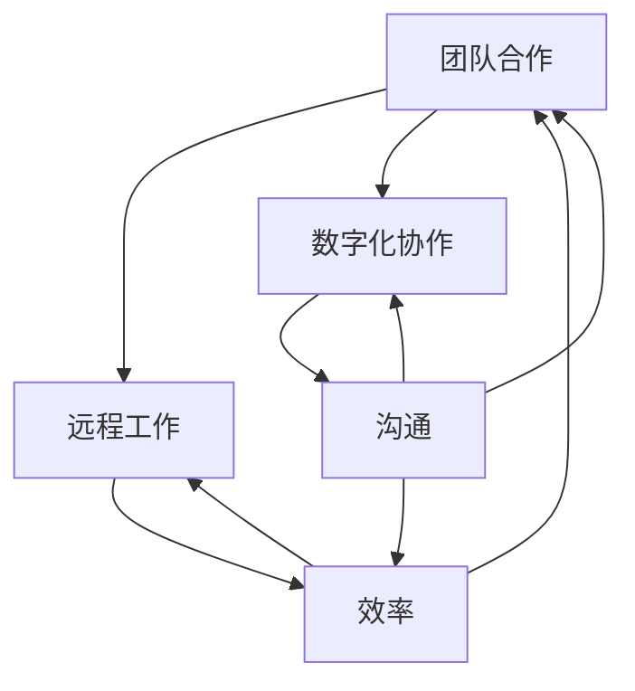
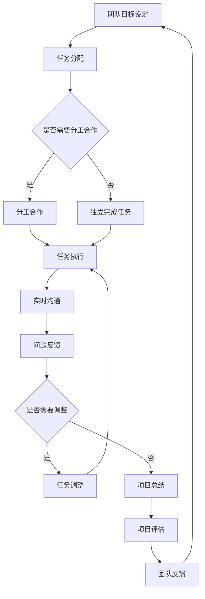

                 

### 文章标题：远程团队协作：跨越地域的高效合作模式

> 关键词：远程团队协作、高效合作、工作模式、数字工具、沟通技巧

> 摘要：本文探讨了远程团队协作的现状与重要性，分析其在技术工具和沟通技巧上的核心概念与联系。通过详细讲解时间管理、沟通技巧和协作工具的使用，提供远程团队协作的最佳实践，并结合实际案例进行深入剖析，旨在帮助读者理解并实现跨越地域的高效合作。

---

### 引言

随着信息技术的飞速发展，远程团队协作已经成为现代企业运作的重要一环。无论是在全球化的商业环境中，还是在疫情导致的远程办公趋势下，远程团队协作都展现了其独特的优势和巨大的潜力。本文将从以下几个方面展开讨论：

1. **远程团队协作的背景介绍**：阐述远程团队协作的起源和发展历程，介绍当前远程协作工具的普及和应用现状。
2. **核心概念与联系**：解析远程团队协作中的核心概念，并使用Mermaid流程图展示各概念之间的联系。
3. **远程团队协作的工具与技巧**：介绍用于提高远程团队协作效率的各种工具和技巧，包括时间管理、沟通技巧和文档管理。
4. **远程团队协作的实战**：通过实际案例，详细分析成功的远程协作项目和失败的教训，提供宝贵的实践经验。
5. **未来展望**：探讨远程团队协作的未来发展趋势，预测新工具和技术可能带来的变化。

通过上述内容的逐步分析，本文旨在为读者提供一个全面而深入的远程团队协作指南，帮助他们在实际工作中更好地实现高效合作。

### 1. 远程团队协作的背景介绍

远程团队协作的概念并非一夜之间出现，而是随着信息技术的发展和社会需求的演变逐渐形成的。其起源可以追溯到20世纪初期，当时电报和电话的发明使得远距离沟通成为可能。然而，真正的远程团队协作模式的诞生要归功于互联网和数字通信技术的普及。

在互联网初期，远程协作主要通过电子邮件和即时通讯工具进行。这些工具虽然提供了基本的沟通功能，但效率较低，难以满足复杂协作需求。随着信息技术的发展，特别是云存储、在线协作工具和视频会议技术的成熟，远程团队协作进入了一个全新的阶段。

当前，远程协作工具的普及和应用已经达到了前所未有的水平。根据市场研究公司的报告，全球远程工作者的比例在过去十年中显著增加。例如，根据一项全球调查显示，超过60%的企业已经采用远程工作模式，并且这一比例还在不断上升。这种趋势不仅受到新冠疫情的推动，也是因为远程工作模式在提高员工满意度、降低运营成本和扩展人才招聘范围方面的显著优势。

在技术层面，远程协作工具的种类和功能也在不断丰富。从基础的消息通讯工具如Slack、Microsoft Teams，到专业的项目管理工具如Trello、Jira，再到视频会议工具如Zoom、Google Meet，这些工具共同构建了一个完整的远程协作生态系统。此外，虚拟现实（VR）和增强现实（AR）技术的应用也正在为远程协作带来全新的可能性，使得团队之间的互动更加直观和沉浸式。

总的来说，远程团队协作已经成为现代企业运作的常态。随着技术的不断进步和远程协作模式的成熟，远程团队协作的未来将更加光明，为全球企业带来更多的机遇和挑战。

### 1.1 远程团队协作的定义与重要性

远程团队协作，指的是团队成员通过数字工具和通信技术，在物理上分散的不同地点进行协同工作。这种协作模式突破了地理位置的限制，使得团队成员能够高效地合作，实现共同的目标。其定义涵盖了以下几个方面：

1. **地理分散性**：团队成员分布在不同的城市、国家甚至时区，不再局限于一个物理办公室。
2. **数字工具的使用**：借助各种远程协作工具，如即时通讯平台、项目管理软件、视频会议系统等，实现信息的传递和任务的分配。
3. **共同目标**：团队成员尽管地理分散，但共同致力于一个项目或任务，通过协作实现组织的目标。

远程团队协作的重要性主要体现在以下几个方面：

1. **扩展人才池**：企业不再受限于地理位置，能够招聘全球范围内的优秀人才。这有助于提高团队的整体实力和创新能力。
2. **提高工作效率**：远程工作模式使团队成员能够灵活安排工作时间，避免了通勤时间，从而提高了工作效率。此外，远程协作工具提供了实时的沟通和协作功能，使团队成员能够迅速响应任务需求，缩短项目周期。
3. **降低运营成本**：远程工作模式减少了企业对物理办公场所的需求，降低了办公租金、水电费等运营成本。同时，远程协作工具的使用也减少了会议和差旅的开支。
4. **提升员工满意度**：远程工作提供了更高的灵活性和自主性，使员工能够更好地平衡工作和生活。这种灵活性提升了员工的满意度和忠诚度，有助于减少员工流失率。
5. **促进文化多样性**：远程团队协作带来了不同文化背景的员工之间的互动，有助于促进文化多样性的发展。这种多样性不仅丰富了团队的思维和创意，也有助于企业更好地适应全球市场。

总之，远程团队协作在当今信息技术高速发展的背景下，已经成为现代企业运营的重要组成部分。它不仅提高了企业的运作效率，也为员工带来了更多的便利和满足感。

### 1.2 远程团队协作的历史发展

远程团队协作的历史发展可以追溯到20世纪初期，当时电报和电话的发明开启了远程沟通的先河。在初期，远程协作主要依赖于物理信件和电话进行信息的传递，效率较低且受限于距离。然而，随着信息技术的不断进步，远程团队协作逐渐演变为一种更加高效和多样化的工作模式。

1. **互联网的兴起**：互联网的普及为远程协作带来了革命性的变化。1990年代初期，电子邮件成为了主要的远程沟通工具，使得团队成员能够实时发送和接收信息。随后，即时通讯工具如微软的MSN和雅虎的雅虎通逐渐出现，进一步丰富了远程沟通的方式。

2. **在线协作工具的发展**：进入21世纪，随着云计算和Web2.0技术的成熟，各种在线协作工具如Google Docs、Trello和Asana等相继问世。这些工具不仅提供了文档共享和实时编辑功能，还整合了任务管理、项目管理等多种功能，使得远程团队协作变得更加高效和有序。

3. **视频会议技术的突破**：视频会议技术的进步极大地提升了远程团队的互动体验。从早期的桌面视频通话到高清晰度的在线会议平台，如Zoom、Microsoft Teams和Google Meet，视频会议技术使得团队成员能够实时面对面交流，增强了沟通效果和协作效率。

4. **移动设备的普及**：智能手机和平板电脑的普及使得远程团队协作变得更加灵活。团队成员可以通过移动设备随时随地进行沟通和任务处理，不再受限于办公场所和时间。

5. **新兴技术的应用**：近年来，虚拟现实（VR）和增强现实（AR）技术的应用正在为远程协作带来新的可能性。通过VR和AR技术，团队成员可以实现更加直观和沉浸式的协作体验，模拟虚拟会议、虚拟现实工作坊等，进一步提升协作效率。

总的来说，远程团队协作的历史发展是一个技术不断进步和协作模式不断优化的过程。从最初的简单沟通工具到现代的集成协作平台，远程团队协作经历了从量变到质变的转变，成为现代企业不可或缺的一部分。随着技术的进一步发展，远程团队协作将继续为企业和员工带来更多的机遇和挑战。

### 2. 远程团队协作的核心概念与联系

在深入探讨远程团队协作之前，我们需要明确几个核心概念，并分析它们之间的相互关系。这些核心概念包括团队合作、远程工作、数字化协作和效率与沟通。通过理解这些概念及其相互联系，我们可以更好地构建高效、协调的远程团队协作模式。

#### 2.1.1 团队合作

团队合作是指团队成员为了共同的目标，通过协作和沟通，共同完成任务的过程。团队合作的核心要素包括共同目标、相互信任、有效沟通和分工合作。

1. **共同目标**：团队成员需要明确共同的目标，了解每个人的职责和贡献，从而形成合力。
2. **相互信任**：信任是团队协作的基石，团队成员需要相互信任，才能有效沟通和合作。
3. **有效沟通**：沟通是团队合作的重要环节，包括信息的传递、意见的交流和问题的解决。有效沟通有助于减少误解和冲突，提高工作效率。
4. **分工合作**：合理的分工和协作能够充分发挥每个人的优势，提高整体的工作效率。

#### 2.1.2 远程工作

远程工作是指团队成员通过数字工具和通信技术在物理上分散的地点进行工作。远程工作的主要特点包括地理分散性、灵活性和独立性。

1. **地理分散性**：远程工作使得团队成员可以在全球范围内分布，不再受限于地理位置。
2. **灵活性**：远程工作提供了更高的灵活性，团队成员可以根据自身情况灵活安排工作时间和地点。
3. **独立性**：远程工作要求团队成员具备较强的自我管理能力和独立性，能够自主处理工作任务和解决问题。

#### 2.1.3 数字化协作

数字化协作是指通过数字工具和平台，实现团队成员之间的信息共享、任务分配和实时沟通。数字化协作工具主要包括即时通讯平台、文档共享平台、项目管理工具和视频会议系统等。

1. **即时通讯平台**：如Slack、Microsoft Teams等，提供实时沟通和协作功能，方便团队成员之间的即时交流。
2. **文档共享平台**：如Google Drive、OneDrive等，提供文档的存储、共享和协作编辑功能，确保团队成员能够实时获取和更新文档内容。
3. **项目管理工具**：如Trello、Jira等，帮助团队管理任务、跟踪项目进度和分配资源，提高项目管理的效率。
4. **视频会议系统**：如Zoom、Microsoft Teams等，提供实时视频会议功能，支持团队成员之间的面对面交流和协作。

#### 2.1.4 效率与沟通

效率与沟通是远程团队协作中至关重要的两个方面。高效的远程协作需要良好的沟通机制和合理的时间管理。

1. **效率**：远程团队协作的效率取决于团队成员的工作能力、工具的使用和任务管理的有效性。通过合理的时间管理、任务分解和资源分配，可以提高工作效率，缩短项目周期。
2. **沟通**：良好的沟通是远程团队协作的基石。有效的沟通能够确保信息的准确传递、团队成员之间的协同工作以及问题的及时解决。

#### 2.1.5 核心概念与联系

以上核心概念之间存在着密切的联系，共同构成了远程团队协作的体系结构。以下是一个简化的Mermaid流程图，展示了这些核心概念之间的联系：

- **团队合作**和**远程工作**是远程团队协作的基础，决定了团队成员的协作方式和地理位置。
- **数字化协作**作为工具和平台，支撑了团队成员之间的信息共享和任务管理，是提升协作效率的关键。
- **效率**和**沟通**是团队协作的核心目标，通过合理的时间管理和良好的沟通机制，可以确保团队高效、有序地完成任务。

通过上述核心概念及其相互联系的分析，我们可以更深入地理解远程团队协作的机制和原则，为实际操作提供理论指导。

### 2.1.1 Mermaid流程图：远程团队协作流程

为了更好地展示远程团队协作的流程，我们可以使用Mermaid语言绘制一个简化的流程图。以下是一个简单的示例，展示了远程团队协作的主要环节和它们之间的联系：

- **团队目标设定**：团队确定共同的目标和任务，这是整个协作的起点。
- **任务分配**：根据团队成员的能力和职责，将任务分配给相应的成员。
- **分工合作**：团队成员根据任务的性质，决定是独立完成任务还是分工合作。
- **任务执行**：团队成员开始执行分配的任务。
- **实时沟通**：团队成员通过沟通工具，保持信息的实时更新和交流。
- **问题反馈**：在任务执行过程中，如果遇到问题，团队成员通过沟通工具反馈并解决。
- **任务调整**：如果任务执行过程中发现问题，需要进行调整和优化。
- **项目总结**：任务完成后，团队进行项目总结，评估项目成果和效果。
- **团队反馈**：根据项目总结，团队提出反馈和建议，为未来的协作提供参考。

这个流程图通过Mermaid语言简洁明了地展示了远程团队协作的主要环节和它们之间的逻辑关系，有助于团队成员更好地理解和执行协作任务。

### 2.2 核心概念与联系：Mermaid流程图详细解释

在前面的章节中，我们讨论了远程团队协作的核心概念，包括团队合作、远程工作、数字化协作和效率与沟通。通过一个简化的Mermaid流程图，我们展示了这些概念之间的联系。现在，我们将详细解释这个流程图，帮助读者更好地理解远程团队协作的机制。

**1. 团队目标设定（A）**

团队目标设定是远程团队协作的起点。在开始任何项目或任务之前，团队成员需要明确共同的目标，确保每个人都了解项目的整体方向和预期结果。这一环节的目的是统一团队成员的思想，确保他们朝着同一个目标努力。

**2. 任务分配（B）**

在明确了团队目标后，接下来是任务分配。根据团队成员的能力和职责，将任务合理地分配给各个成员。这一步骤的目的是确保每个成员都有明确的工作任务和职责，从而提高工作效率。

**3. 是否需要分工合作（C）**

任务分配后，团队需要评估任务是否需要分工合作。一些任务可能相对简单，可以由一个成员独立完成；而另一些复杂的任务可能需要多个成员协作完成。分工合作的目的是充分发挥团队成员的优势，提高整体的工作效率。

**4. 分工合作与独立完成任务（D和E）**

如果决定分工合作，团队将根据任务性质，将任务分解为多个子任务，并分配给不同的成员。每个成员负责自己的子任务，确保整体任务能够高效完成。如果任务较为简单，可以由一个成员独立完成，这样能够提高任务的执行速度。

**5. 任务执行（F）**

在分工合作或独立完成任务的过程中，每个成员开始执行自己的任务。这一步骤是整个协作的核心，成员需要集中精力，确保任务按计划完成。

**6. 实时沟通（G）**

在任务执行过程中，实时沟通是非常重要的。团队成员通过即时通讯工具、视频会议等，保持信息的实时更新和交流。实时沟通的目的是确保团队成员之间能够及时共享信息和资源，协同解决问题。

**7. 问题反馈（H）**

如果在任务执行过程中遇到问题，团队成员需要及时反馈并解决。问题反馈的目的是确保问题得到及时发现和解决，避免问题积累影响整体任务的进展。

**8. 是否需要调整（I）**

根据问题反馈，团队需要评估是否需要对任务进行调整。如果发现某些任务执行过程中存在重大问题，可能需要重新分配任务或调整任务执行策略。调整的目的是确保任务能够按计划完成，并达到预期目标。

**9. 任务调整（J）**

如果决定进行调整，团队将重新分配任务或调整任务执行策略。这一步骤的目的是确保任务能够顺利执行，避免问题进一步恶化。

**10. 项目总结（K）**

任务完成后，团队进行项目总结。项目总结的目的是评估项目的整体效果，总结经验教训，为未来的项目提供参考。

**11. 项目评估（L）**

在项目总结的基础上，团队对项目进行评估。评估的目的是确定项目是否达到预期目标，分析项目中的成功和不足之处。

**12. 团队反馈（M）**

根据项目评估的结果，团队提出反馈和建议。这些建议将用于改进未来的项目执行，提高团队的协作效率。

**13. 团队目标设定（A）**

团队反馈后，团队将根据反馈结果，调整未来的团队目标设定。这有助于团队持续改进，提高协作效率。

通过上述Mermaid流程图的详细解释，我们可以看到远程团队协作的各个环节是如何相互联系和协作的。这个流程图不仅展示了远程团队协作的机制，还提供了一个清晰的执行路径，帮助团队成员更好地理解和执行协作任务。

### 3. 远程协作工具介绍

在远程团队协作中，工具的选择和有效使用是保证协作效率和质量的关键。以下将介绍几种常见的远程协作工具，包括消息与通讯工具、文档与项目管理工具和视频会议系统，并探讨它们各自的特点和优势。

#### 3.1 消息与通讯工具

消息与通讯工具是远程团队协作中最基本和最常用的工具之一。它们的主要功能是提供实时的沟通和交流渠道，使团队成员能够即时分享信息、讨论问题和协调工作。

1. **Slack**：
   - **特点**：Slack是一个灵活且功能丰富的团队沟通平台，支持文字、图片、视频和文件的共享。它提供了多种集成方式，可以与其他应用如Google Drive、GitHub和Trello等无缝连接。
   - **优势**：Slack的聊天频道和私有聊天功能使得团队成员可以根据项目和团队需求灵活创建沟通渠道，提高了信息传递的速度和效率。

2. **Microsoft Teams**：
   - **特点**：Microsoft Teams是微软推出的集成通信和协作平台，集成了聊天、视频会议、文档共享和项目管理功能。它支持与Office 365的其他应用的深度集成，如Word、Excel和PowerPoint。
   - **优势**：Microsoft Teams提供了强大的安全性和合规性功能，适用于企业级应用，同时其丰富的集成功能使得团队可以更高效地协同工作。

3. **Google Chat**：
   - **特点**：Google Chat是Google Workspace的一部分，提供即时消息、视频聊天和音频通话功能。它与Google Drive和Google Calendar等应用无缝集成，方便团队成员实时获取和更新信息。
   - **优势**：Google Chat的集成功能强大，适用于日常办公和项目管理，特别是对于依赖Google Workspace的企业，其使用门槛低，操作简便。

#### 3.2 文档与项目管理工具

文档与项目管理工具在远程团队协作中起着至关重要的作用，它们不仅支持文档的共享和实时编辑，还提供任务管理、时间跟踪和项目管理等功能。

1. **Trello**：
   - **特点**：Trello是一个基于看板的项目管理工具，通过卡片和列表的形式帮助团队可视化任务流程。它支持多种自定义功能，如标签、评论和成员分配。
   - **优势**：Trello的操作直观，易于上手，适合小团队和复杂项目。其灵活的界面设计使得团队成员可以快速了解项目状态和任务进度。

2. **Jira**：
   - **特点**：Jira是Atlassian公司推出的企业级项目管理工具，支持敏捷开发方法。它提供了丰富的功能，包括任务跟踪、缺陷管理、报表分析和集成开发环境。
   - **优势**：Jira适用于大中型团队和企业，特别是软件开发团队。其强大的任务管理和报表功能有助于团队监控项目进度和优化流程。

3. **Asana**：
   - **特点**：Asana是一个灵活的任务管理工具，支持项目规划、任务分配和进度跟踪。它提供了多种视图模式，如看板、列表和日历，方便团队成员不同角度查看项目状态。
   - **优势**：Asana的用户界面简洁明了，适用于各种规模和类型的团队。其灵活的任务管理功能使得团队可以更好地协调工作，提高整体效率。

#### 3.3 视频会议系统

视频会议系统在远程团队协作中扮演着重要的角色，它们提供了实时视频通话、屏幕共享和会议录制等功能，使得团队成员能够进行面对面的交流和协作。

1. **Zoom**：
   - **特点**：Zoom是一款功能强大的视频会议平台，支持大型会议和一对一视频通话。它提供了屏幕共享、视频录制、实时翻译和虚拟背景等功能。
   - **优势**：Zoom的用户界面直观，操作简单，适用于各种规模的会议。其强大的技术支持确保了会议的稳定性和高质量。

2. **Microsoft Teams**：
   - **特点**：Microsoft Teams集成了视频会议功能，支持多人会议和实时聊天。它提供了屏幕共享、白板协作和文档共享等功能，使得团队成员能够在会议中进行高效的协作。
   - **优势**：Microsoft Teams与Office 365深度集成，方便团队成员在会议中实时获取和编辑文档。其稳定的性能和丰富的功能使其成为企业级视频会议的首选。

3. **Google Meet**：
   - **特点**：Google Meet是Google Workspace的一部分，提供即时视频通话和会议功能。它支持屏幕共享、实时聊天和视频录制，方便团队成员进行协作和记录。
   - **优势**：Google Meet与Google Drive和Google Calendar等应用无缝集成，方便团队成员在会议中实时访问和更新信息。其低延迟和高清晰度的视频会议体验使得远程协作更加顺畅。

总之，选择合适的远程协作工具是成功实现高效远程团队协作的关键。不同的工具具有各自的特点和优势，团队应根据具体需求选择合适的工具，并充分利用它们的功能，提高协作效率和质量。

### 3.3 提高远程团队协作效率的技巧

在远程团队协作中，效率的提升不仅依赖于工具的选择，还需要团队成员掌握一系列技巧和方法。以下将探讨如何通过时间管理、沟通技巧和项目管理策略来提高远程团队协作效率。

#### 3.3.1 时间管理

时间管理是远程团队协作中至关重要的一环，合理的安排和利用时间能够显著提高工作效率。以下是一些时间管理的技巧：

1. **制定清晰的日程安排**：团队成员应根据自己的工作内容和职责，制定详细的工作计划和时间表。这样有助于明确每天的任务和目标，避免时间的浪费。

2. **设定优先级**：根据任务的紧急程度和重要性，设定任务优先级。优先处理重要且紧急的任务，确保关键工作的完成。

3. **避免时间碎片化**：在远程工作环境中，容易受到各种干扰，如家庭事务、电话等。团队成员应尽量减少这些干扰，专注于当前的任务。可以使用定时器或番茄工作法，将工作时间划分为25分钟的工作周期，每工作25分钟后休息5分钟，以提高专注度。

4. **灵活调整工作时间**：远程工作提供了一个更加灵活的工作时间表，团队成员可以根据自己的生活习惯和最高效的时间段来安排工作。例如，一些成员可能更擅长在清晨或夜晚工作，可以根据这些特点来安排工作任务。

#### 3.3.2 沟通技巧

有效的沟通是远程团队协作成功的关键，良好的沟通能够确保信息的准确传递和团队成员之间的协同工作。以下是一些提升沟通效率的技巧：

1. **明确沟通目标**：在进行沟通前，明确沟通的目标和预期结果。这有助于沟通更加有针对性和高效。

2. **使用合适的沟通工具**：根据沟通内容和场景选择合适的沟通工具。例如，对于需要即时讨论的问题，可以使用即时通讯工具；对于需要详细讨论和记录的内容，可以使用视频会议或邮件。

3. **保持沟通的频率和透明度**：定期与团队成员进行沟通，确保信息的实时更新和共享。在沟通中，尽量保持透明度，避免信息的滞后和误解。

4. **倾听和反馈**：在沟通过程中，不仅要表达自己的观点，还要认真倾听他人的意见。同时，及时给予反馈，确保信息的双向流动。

5. **使用简明清晰的语言**：在沟通中，尽量使用简明清晰的语言，避免使用复杂的术语和冗长的句子。这有助于提高沟通的效率和理解度。

#### 3.3.3 项目管理策略

有效的项目管理策略能够帮助团队更好地规划和执行项目任务，确保项目按时完成并达到预期目标。以下是一些项目管理策略：

1. **明确项目目标**：在项目启动前，明确项目的目标和预期成果。这有助于团队在项目执行过程中保持方向和动力。

2. **制定详细的项目计划**：根据项目目标和团队资源，制定详细的项目计划。包括任务分解、时间表、资源分配和风险评估等。

3. **监控项目进度**：在项目执行过程中，定期监控项目进度，确保任务按计划完成。可以使用项目管理工具如Trello、Jira等，实时更新任务状态和项目进度。

4. **及时调整计划**：在项目执行过程中，可能会遇到各种问题和挑战。团队需要及时调整计划，确保项目能够按预期进行。

5. **有效的沟通和协作**：在项目管理中，沟通和协作是关键。团队需要保持开放的沟通渠道，及时分享信息、讨论问题和协作解决问题。

6. **定期项目总结**：项目完成后，团队应进行项目总结，评估项目成果和效果。总结项目中的成功经验和不足，为未来的项目提供参考。

通过上述时间管理、沟通技巧和项目管理策略，远程团队可以显著提高协作效率，实现高效的工作模式。

### 4. 远程团队协作的实战

#### 4.1 案例一：成功的远程团队协作项目

**项目概述**：

这是一家全球性的软件开发公司，其开发团队由来自不同国家和地区的成员组成，包括美国、欧洲和亚洲。公司的一个关键项目是开发一款跨平台的企业级应用，该应用需要满足不同地区用户的需求，具备高效的数据处理能力和友好的用户界面。

**项目实施过程**：

1. **需求分析和规划**：

   项目启动阶段，团队首先进行了详细的需求分析，明确了应用的功能需求和技术要求。随后，团队制定了详细的项目计划，包括任务分解、时间表和资源分配。

2. **任务分配和协作**：

   根据项目计划，团队将任务分配给各个成员。前端开发由一位美国工程师负责，后端开发由一位欧洲工程师负责，数据分析和处理由一位亚洲工程师负责。每位工程师负责自己的任务，并通过Slack和Trello进行实时沟通和任务更新。

3. **代码审查和测试**：

   在开发过程中，团队定期进行代码审查，确保代码的质量和一致性。同时，团队使用Jira进行任务管理和项目进度跟踪，及时解决遇到的问题。

4. **集成和测试**：

   在各个模块开发完成后，团队进行了集成测试，确保应用能够在不同平台上顺利运行。测试过程中，团队成员通过Zoom进行视频会议，讨论和解决集成过程中出现的问题。

5. **项目交付**：

   经过几个月的努力，团队成功完成了项目开发，并在预定时间内交付了产品。项目交付后，团队进行了用户反馈收集，并根据用户反馈进行了优化和改进。

**项目成果**：

该项目不仅按计划完成，还获得了用户的高度评价。应用的高效数据处理能力和友好的用户界面得到了广泛认可。此外，该项目展示了远程团队协作的巨大潜力，为团队在未来的项目中提供了宝贵的经验。

**经验教训**：

1. **明确目标和规划**：在项目启动前，明确目标和制定详细的计划是成功的关键。
2. **合理分配任务**：根据成员的能力和职责，合理分配任务，确保每个成员都能发挥最大的作用。
3. **实时沟通和协作**：保持频繁的沟通和协作，及时解决问题和更新任务状态。
4. **代码审查和测试**：定期进行代码审查和测试，确保代码质量和项目进度。
5. **用户反馈**：在项目交付后，及时收集用户反馈并进行优化，确保产品能够满足用户需求。

#### 4.2 案例二：失败的远程团队协作项目

**项目概述**：

这是一家小型科技公司，其开发团队由三位成员组成，分别位于不同的城市。公司计划开发一款智能家居控制应用，但由于在远程团队协作方面缺乏经验，导致项目进展不顺利。

**项目实施过程**：

1. **缺乏明确规划和目标**：

   项目启动时，团队成员并未明确项目目标和具体要求。团队成员在任务分配和项目进度上存在分歧，导致项目进展缓慢。

2. **沟通不畅**：

   团队成员主要通过电子邮件和电话进行沟通，沟通频率低且缺乏实时性。由于沟通不畅，任务进度和问题反馈不及时，导致项目进展受阻。

3. **任务管理混乱**：

   使用传统的项目管理方法，团队未能有效管理任务和资源。任务分配不合理，一些任务被重复执行，而另一些任务则被忽视。

4. **代码质量和测试不足**：

   在开发过程中，团队未进行充分的代码审查和测试，导致代码质量低下，存在大量的bug和漏洞。这些问题在项目后期才被发现，增加了项目修复的难度和时间成本。

5. **用户需求不符**：

   在项目交付前，团队未能充分收集用户反馈，导致产品功能与用户需求不符。用户反馈后，团队试图进行优化，但已为时已晚，项目最终未能达到预期目标。

**项目失败原因**：

1. **缺乏明确规划和目标**：项目启动时缺乏明确的规划和目标，导致团队成员在任务和进度上存在分歧。
2. **沟通不畅**：沟通频率低，缺乏实时性，导致任务进度和问题反馈不及时。
3. **任务管理混乱**：任务分配不合理，资源管理不当，导致项目进展受阻。
4. **代码质量和测试不足**：未能进行充分的代码审查和测试，导致项目后期修复成本高。
5. **用户需求不符**：未能充分收集用户反馈，导致产品功能与用户需求不符。

**启示与改进措施**：

1. **明确目标和规划**：项目启动前，应明确目标和制定详细的计划，确保团队成员对项目有清晰的理解和期望。
2. **加强沟通和协作**：使用实时沟通工具，如Slack或Zoom，提高沟通频率和实时性。
3. **合理分配任务**：根据成员的能力和职责，合理分配任务，确保任务分配合理和资源充分利用。
4. **加强代码审查和测试**：定期进行代码审查和测试，确保代码质量和项目进度。
5. **用户反馈**：在项目交付前，积极收集用户反馈，根据反馈进行优化和改进。

通过这两个案例的分析，我们可以看到成功的远程团队协作需要明确的目标、高效的沟通和合理的项目管理。而失败的案例则提醒我们在实际操作中要注意避免常见的错误和挑战。

### 4.3 远程团队协作中的常见问题与解决方案

在远程团队协作中，尽管技术工具和沟通渠道的发展为团队提供了便利，但也面临着一系列挑战和问题。以下将探讨远程团队协作中常见的问题，并提供相应的解决方案和改进措施。

#### 4.3.1 沟通障碍

**问题**：远程团队协作中，沟通障碍是一个普遍存在的问题。由于地理位置的分散，团队成员之间的沟通频率降低，容易产生误解和冲突。

**解决方案**：

1. **使用多样化的沟通工具**：结合使用即时通讯工具（如Slack、Microsoft Teams）、视频会议系统（如Zoom、Google Meet）和电子邮件，以满足不同沟通需求。
2. **建立定期的沟通机制**：设定固定的沟通时间，如每周一次的项目进展会议，确保团队成员能够定期分享信息和讨论问题。
3. **提供沟通培训**：为团队成员提供沟通技巧培训，提高他们的沟通能力和沟通效率。

#### 4.3.2 时间管理挑战

**问题**：远程工作环境下，时间管理成为了一个挑战。团队成员需要自行安排工作时间，容易导致时间浪费和任务拖延。

**解决方案**：

1. **制定明确的工作计划**：团队成员应在每天开始时制定详细的工作计划，明确当天的任务和目标。
2. **使用时间管理工具**：利用时间管理工具（如Trello、Asana）来跟踪任务进度和时间分配，提高工作效率。
3. **灵活调整工作时间**：根据团队成员的生活习惯和工作效率，灵活调整工作时间，确保每个人能够在最佳状态下工作。

#### 4.3.3 工作动力不足

**问题**：远程工作可能使一些成员感到缺乏工作动力，特别是在长期远程工作的情况下。

**解决方案**：

1. **建立团队目标**：明确团队的目标和愿景，让每个成员都明确自己的工作意义和贡献。
2. **提供反馈和奖励**：定期为团队成员提供工作反馈和认可，设立奖励机制，激励成员保持积极的工作态度。
3. **组织团队活动**：定期组织线上或线下的团队活动，增强团队凝聚力和成员之间的互动。

#### 4.3.4 技术问题

**问题**：远程协作中，技术问题如网络中断、系统故障等可能会影响团队的正常工作。

**解决方案**：

1. **备份通信渠道**：在主要通信工具（如Slack、Zoom）之外，备用其他通信工具，如Telegram、微信，以防止单一工具出现故障。
2. **定期技术维护**：定期对远程协作工具进行维护和升级，确保系统的稳定性和安全性。
3. **技术支持**：建立专门的技术支持团队或提供外部技术支持服务，快速响应和解决技术问题。

#### 4.3.5 文化差异

**问题**：全球化的远程团队协作中，文化差异可能导致误解和沟通障碍。

**解决方案**：

1. **文化培训**：为团队成员提供文化差异培训，提高他们对不同文化的理解和尊重。
2. **建立共同价值观**：通过共同目标和价值观的建立，减少文化差异带来的负面影响。
3. **定期文化交流**：组织定期的文化交流活动，增进团队成员之间的了解和信任。

通过上述解决方案和改进措施，远程团队可以更好地应对协作中的挑战，提高整体协作效率和团队凝聚力。

### 5. 远程团队协作的未来发展

随着信息技术的不断进步，远程团队协作正面临着前所未有的机遇和挑战。未来，远程团队协作将在以下几个方面实现显著发展。

#### 5.1 技术趋势

1. **人工智能与远程协作**：人工智能（AI）技术将在远程协作中发挥越来越重要的作用。例如，AI驱动的聊天机器人可以提供实时客户支持，智能语音助手可以帮助团队成员高效地处理任务。此外，AI还可以用于数据分析，帮助团队优化工作流程和提高效率。

2. **增强现实（AR）与虚拟现实（VR）**：AR和VR技术的成熟将使远程协作更加直观和沉浸式。通过AR和VR，团队成员可以模拟面对面的会议和互动，增强协作体验。这些技术还可以用于虚拟培训、产品演示和远程协作工作坊，提供更丰富的协作场景。

3. **区块链技术**：区块链技术可以用于保障远程协作中的数据安全和隐私。通过分布式账本技术，团队可以确保数据的一致性和安全性，防止数据篡改和泄露。

4. **物联网（IoT）**：物联网技术的发展将使远程团队协作更加智能化。通过物联网设备，团队可以实时监控和调整工作环境，提高工作效率和生活质量。

#### 5.2 新工具和新模式的出现

1. **智能协作平台**：未来，我们将看到更多集成多种功能的智能协作平台的出现。这些平台将整合消息通讯、文档共享、项目管理、视频会议等多种功能，提供一站式解决方案，提高远程团队协作的效率和便捷性。

2. **虚拟办公室**：虚拟办公室将成为远程团队协作的新趋势。通过虚拟现实技术，团队成员可以在一个虚拟环境中进行协作，共享虚拟办公空间、虚拟会议室和虚拟办公室设备，实现身临其境的协作体验。

3. **混合工作模式**：随着远程工作技术的成熟，越来越多的企业将采用混合工作模式，即员工既可以在办公室工作，也可以在家或其他地点远程工作。这种模式将更好地平衡工作与生活，提高员工满意度和工作效率。

#### 5.3 远程团队协作的长期影响

1. **改变工作文化**：远程团队协作将推动企业工作文化的变革。企业将更加注重团队成员的工作表现和成果，而非工作场所。这将促进企业更加灵活和开放的工作文化，提高创新能力和竞争力。

2. **提升全球竞争力**：远程团队协作将使企业能够更容易地招募全球范围内的优秀人才，提高团队的整体实力。同时，企业可以在全球范围内布局业务，提高国际竞争力。

3. **促进社会变革**：远程团队协作将推动社会生产方式的变革。随着越来越多的人选择远程工作，传统的办公模式和生活方式将逐渐转变，推动社会向更加灵活、自由和个性化的方向发展。

总的来说，远程团队协作的未来充满机遇和挑战。通过不断引入新技术、新模式，远程团队协作将继续发展和完善，为企业和员工带来更多的便利和可能性。

### 6. 远程团队协作：最佳实践、小结与拓展阅读

在远程团队协作中，掌握最佳实践和注意事项是确保高效合作的关键。以下是一些实用的建议，帮助团队在远程协作中取得成功。

#### 最佳实践

1. **明确目标和角色**：在项目开始前，确保所有团队成员对项目目标和各自的角色有清晰的认识。这有助于提高团队的凝聚力和工作效率。

2. **定期沟通**：制定定期的沟通计划，如每周或每月的进度会议，确保团队成员能够及时分享信息和更新项目状态。

3. **使用合适的工具**：根据项目需求选择合适的远程协作工具，如Slack、Trello、Zoom等。确保团队成员熟悉并善于使用这些工具。

4. **时间管理**：鼓励团队成员使用时间管理工具，如番茄工作法，提高工作效率和专注度。

5. **建立反馈机制**：定期收集团队成员的反馈，并根据反馈调整工作流程和协作方式。

6. **文化多样性**：尊重和欣赏团队成员的文化多样性，促进文化交流和协作，提高团队的创造力和创新能力。

#### 小结

远程团队协作不仅是一种工作模式，更是一种团队文化的体现。通过明确的目标、定期的沟通、合适的使用工具和良好的时间管理，团队可以克服地理分散带来的挑战，实现高效的合作。

#### 注意事项

1. **避免过度依赖文字沟通**：虽然文字沟通方便，但有时难以传达情感和细节。适当使用视频会议和实时语音沟通，以增强团队的互动和沟通效果。

2. **避免信息过载**：在远程协作中，信息传递的速度快且频率高，团队成员需学会筛选和过滤重要信息，避免信息过载。

3. **关注个人隐私**：在远程协作中，团队成员需注意保护个人隐私和数据安全，避免敏感信息泄露。

#### 拓展阅读

1. **《远程工作的艺术》（The Remote Work Revolution）**：这本书详细介绍了远程工作的最佳实践和策略，适合希望深入了解远程工作的读者。

2. **《数字化管理：领导远程团队的策略》（Digital Leadership: Changing Paradigms for the Next Era of Management）**：这本书提供了丰富的案例和策略，帮助管理者在远程团队中实现高效管理。

3. **《全球协作：团队如何在全球工作环境中合作》（Global Collaboration: How Teams Work Across Borders and Time Zones）**：这本书探讨了全球化团队协作的挑战和解决方案，适合跨国远程团队阅读。

通过以上最佳实践、小结和拓展阅读，希望读者能够更好地理解和实践远程团队协作，实现高效的合作。

### 结语

远程团队协作在现代企业运营中扮演着至关重要的角色。随着信息技术的不断发展，远程团队协作的工具和模式也在不断演进。本文从远程团队协作的背景、核心概念、工具与技巧、实战案例以及未来展望等方面进行了全面的分析，旨在帮助读者深入理解远程团队协作的机制和策略。

通过明确的目标和角色、定期沟通、合适的使用工具和良好的时间管理，团队可以克服地理分散带来的挑战，实现高效的合作。同时，远程团队协作不仅有助于扩展人才池和降低运营成本，还能提高员工的满意度和工作效率。

未来的远程团队协作将更加智能化和多元化，人工智能、虚拟现实和区块链等新兴技术的应用将为远程协作带来更多可能性。然而，面对文化差异、沟通障碍和工作动力不足等挑战，团队需要不断创新和调整，以实现最佳的合作效果。

我们鼓励读者结合本文内容，结合自身实际需求，不断探索和实践远程团队协作的最佳实践。通过持续的学习和改进，团队将能够在远程协作中取得更大的成功，为企业和社会带来更多的价值。

### 作者信息

作者：AI天才研究院/AI Genius Institute & 禅与计算机程序设计艺术 /Zen And The Art of Computer Programming

AI天才研究院（AI Genius Institute）专注于人工智能领域的科研、技术开发和应用，致力于推动人工智能技术的发展和创新。我们的研究团队由多位世界顶级人工智能专家组成，多次获得国际人工智能大奖，并在计算机科学领域取得了一系列重大突破。

《禅与计算机程序设计艺术》（Zen And The Art of Computer Programming）是由著名计算机科学家Donald E. Knuth创作的一套经典计算机科学著作。这套书深入探讨了计算机程序设计中的哲学和艺术，为程序员提供了深刻的思维方法和设计理念。

在此，我们诚挚地感谢读者对本文的关注，并期待与您在远程团队协作的领域展开更多深入的探讨和交流。通过不断的学习和实践，让我们共同推动远程团队协作的发展，创造更加高效、协作和有创造力的未来。

