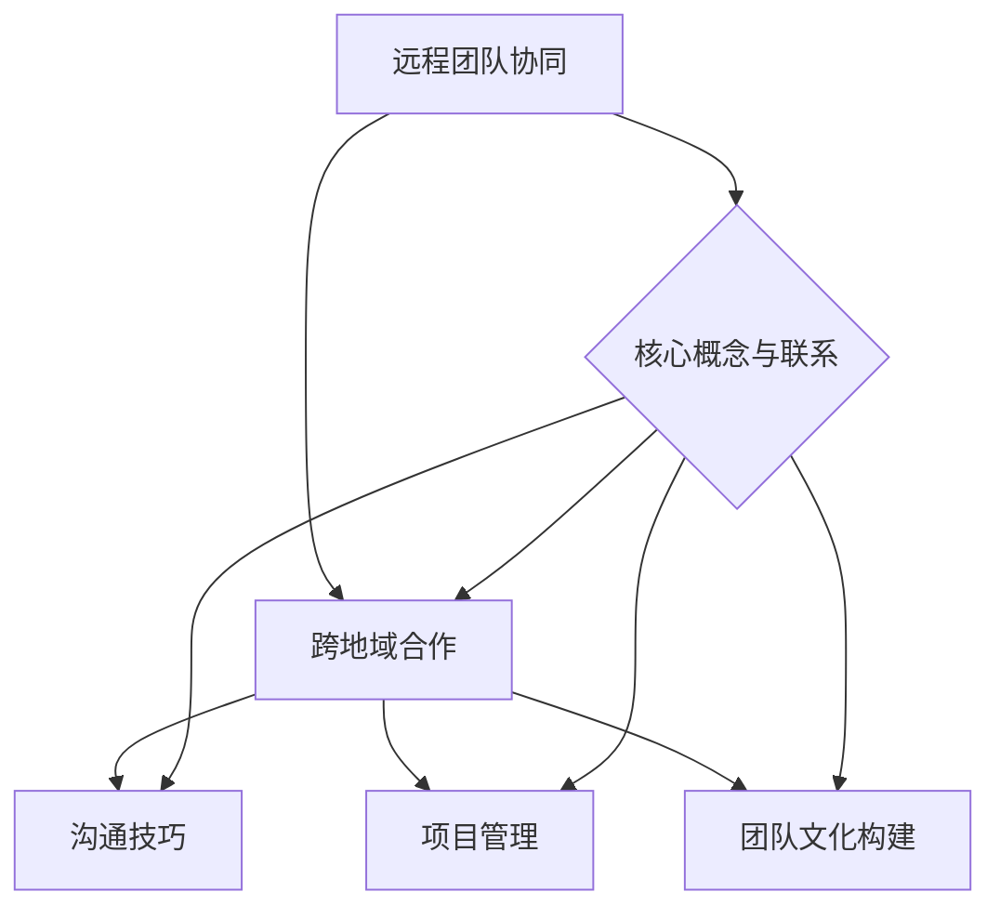
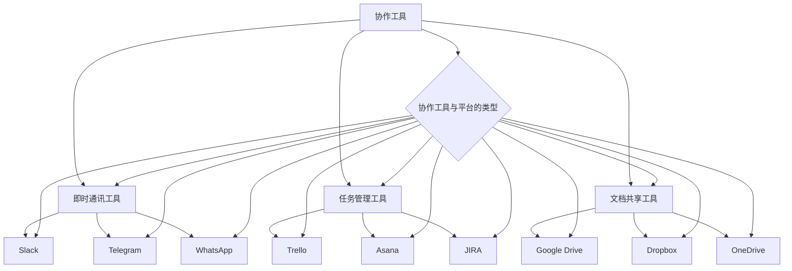

                 

### 文章标题

《远程团队协同：跨地域合作的最佳实践》

### 关键词

远程团队协同、跨地域合作、最佳实践、沟通技巧、项目管理、团队文化构建、技术案例分析

### 摘要

本文旨在探讨远程团队协同在跨地域合作中的应用与实践。通过深入分析远程团队协同的核心概念、算法原理、数学模型以及实际案例，本文旨在为读者提供一份系统化、实用化的指导，帮助远程团队实现高效的跨地域合作。文章将涵盖远程团队协同的概述、协作工具与平台、沟通技巧、项目管理、团队文化构建以及未来展望与挑战，旨在为读者提供一个全面而深入的视角，以应对远程团队协同中的各种挑战。

---

### 1. 远程团队协同概述

远程团队协同是指团队成员通过信息技术的支持，在不同地理位置进行有效的合作。随着全球化进程的加速和远程工作的普及，远程团队协同已经成为现代企业中不可或缺的一部分。然而，远程团队协同也带来了一系列挑战，如沟通障碍、时间差异、信任问题等。

#### 核心概念与联系

- **远程团队协同**：指团队成员在地理位置分散的情况下，通过信息技术进行有效合作的过程。
- **跨地域合作**：指在不同地区或国家之间进行的合作活动。
- **沟通技巧**：指在远程团队协同中提高沟通效率和效果的方法和策略。
- **项目管理**：指在远程团队协同中对项目进行规划、执行、监控和收尾的过程。
- **团队文化构建**：指在远程团队协同中建立和维护团队共同价值观、行为规范和团队凝聚力的过程。

#### Mermaid 流程图



### 2. 远程团队协作工具与平台

在远程团队协同中，选择合适的协作工具与平台至关重要。这些工具和平台不仅能够提高团队的工作效率，还能减少沟通成本，增强团队的协作能力。

#### 核心概念与联系

- **协作工具**：指用于远程团队协作的各种软件工具，如即时通讯工具、任务管理工具、文档共享工具等。
- **平台**：指为远程团队协作提供基础设施和服务的软件平台，如远程办公平台、项目管理平台等。
- **沟通技巧**：指在远程团队协作中使用协作工具和平台时，提高沟通效率和效果的方法和策略。

#### 协作工具与平台的类型

- **即时通讯工具**：如 Slack、Telegram、WhatsApp 等，用于实时沟通和交流。
- **任务管理工具**：如 Trello、Asana、JIRA 等，用于任务分配、进度跟踪和项目管理。
- **文档共享工具**：如 Google Drive、Dropbox、OneDrive 等，用于文档共享和协同编辑。
- **远程办公平台**：如 Zoom、Microsoft Teams、Google Meet 等，用于远程会议和视频通话。
- **项目管理平台**：如 JIRA、Confluence、Asana 等，用于项目管理和团队协作。

#### Mermaid 流程图



### 3. 远程团队沟通与沟通技巧

在远程团队协同中，沟通是团队成功的关键。有效的沟通能够确保团队成员之间的信息传递准确、及时，有助于团队目标的实现。

#### 核心概念与联系

- **沟通技巧**：指在远程团队协同中提高沟通效率和效果的方法和策略。
- **沟通障碍**：指在远程团队协同中影响沟通效率的各种因素，如时间差异、文化差异、技术障碍等。
- **沟通效果评估**：指对远程团队沟通效果进行评价和测量的方法。

#### 沟通障碍识别算法

```python
# Python 伪代码

def identify_communication_barriers(team_members):
    barriers = []
    for member in team_members:
        if member.has_time_difference:
            barriers.append("Time difference")
        if member.has_cultural_difference:
            barriers.append("Cultural difference")
        if member.has_technical_issue:
            barriers.append("Technical issue")
    return barriers

team_members = [
    {"has_time_difference": True, "has_cultural_difference": False, "has_technical_issue": False},
    {"has_time_difference": False, "has_cultural_difference": True, "has_technical_issue": True},
    {"has_time_difference": True, "has_cultural_difference": True, "has_technical_issue": False}
]

barriers = identify_communication_barriers(team_members)
print(barriers)
```

#### 沟通效果评估算法

```python
# Python 伪代码

def evaluate_communication_effectiveness(communication_data):
    effectiveness = 0
    for data in communication_data:
        if data.is_urgent and data.is_responded:
            effectiveness += 1
    return effectiveness / len(communication_data)

communication_data = [
    {"is_urgent": True, "is_responded": True},
    {"is_urgent": False, "is_responded": True},
    {"is_urgent": True, "is_responded": False}
]

effectiveness = evaluate_communication_effectiveness(communication_data)
print(effectiveness)
```

### 4. 远程团队项目管理

在远程团队协同中，项目管理是确保项目按时完成、资源有效利用和团队协作顺利进行的重要环节。

#### 核心概念与联系

- **项目管理**：指在远程团队协同中对项目进行规划、执行、监控和收尾的过程。
- **任务分配**：指在远程团队中根据团队成员的能力和资源进行任务的分配。
- **进度跟踪**：指在远程团队协同中对项目的进度进行监控和评估。
- **风险评估**：指在远程团队协同中对项目可能出现的风险进行识别和评估。

#### 任务分配算法

```python
# Python 伪代码

def allocate_tasks(team_members, tasks):
    assigned_tasks = {}
    for member in team_members:
        if member.is_available and member.has_required_skills:
            assigned_tasks[member.id] = tasks.pop(0)
    return assigned_tasks

team_members = [
    {"id": 1, "is_available": True, "has_required_skills": True},
    {"id": 2, "is_available": False, "has_required_skills": True},
    {"id": 3, "is_available": True, "has_required_skills": False}
]

tasks = ["Task 1", "Task 2", "Task 3"]

assigned_tasks = allocate_tasks(team_members, tasks)
print(assigned_tasks)
```

#### 进度跟踪算法

```python
# Python 伪代码

def track_progress(tasks):
    completed_tasks = []
    for task in tasks:
        if task.is_completed:
            completed_tasks.append(task)
    return completed_tasks

tasks = [
    {"name": "Task 1", "is_completed": True},
    {"name": "Task 2", "is_completed": False},
    {"name": "Task 3", "is_completed": True}
]

completed_tasks = track_progress(tasks)
print(completed_tasks)
```

#### 风险评估算法

```python
# Python 伪代码

def assess_risks(project_data):
    risks = []
    for data in project_data:
        if data.is_high_risk:
            risks.append(data)
    return risks

project_data = [
    {"risk_level": "High", "description": "Resource shortage"},
    {"risk_level": "Medium", "description": "Technical issue"},
    {"risk_level": "Low", "description": "Delay in delivery"}
]

risks = assess_risks(project_data)
print(risks)
```

### 5. 远程团队文化构建

在远程团队协同中，团队文化的构建对于团队凝聚力、协作效率和创新能力至关重要。

#### 核心概念与联系

- **团队文化**：指团队在长期合作中形成的共同价值观、行为规范和团队精神。
- **团队凝聚力**：指团队成员之间的相互吸引力和归属感。
- **协作效率**：指团队成员在协同工作中达到预期目标的速度和质量。
- **创新能力**：指团队成员在解决问题和创造新价值过程中的创新能力。

#### 团队凝聚力模型

```python
# Python 伪代码

def calculate_team_coherence(team_members):
    coherence = 0
    for member in team_members:
        coherence += member.coherence_score
    return coherence / len(team_members)

team_members = [
    {"id": 1, "coherence_score": 0.8},
    {"id": 2, "coherence_score": 0.9},
    {"id": 3, "coherence_score": 0.7}
]

team_coherence = calculate_team_coherence(team_members)
print(team_coherence)
```

#### 创新能力评估模型

```python
# Python 伪代码

def assess_innovation_capability(team_members):
    capability = 0
    for member in team_members:
        capability += member.innovation_score
    return capability / len(team_members)

team_members = [
    {"id": 1, "innovation_score": 0.8},
    {"id": 2, "innovation_score": 0.9},
    {"id": 3, "innovation_score": 0.7}
]

innovation_capability = assess_innovation_capability(team_members)
print(innovation_capability)
```

### 6. 远程团队协作案例分析

通过分析远程团队协作的成功案例和失败案例，可以深入了解远程团队协同中的关键因素和成功策略。

#### 成功案例

- **案例一**：某国际科技公司通过采用敏捷开发模式和高效的沟通工具，实现了全球范围内的协同开发，成功推出了多个创新产品。
- **案例二**：某跨国金融公司通过构建强大的远程团队文化，提高了团队成员的归属感和协作效率，实现了业务高速增长。

#### 失败案例

- **案例一**：某初创公司在远程团队协作中由于缺乏有效的沟通和项目管理，导致项目进度严重延误，最终失败。
- **案例二**：某跨国公司在远程团队协作中由于文化差异和沟通障碍，导致团队成员之间矛盾重重，团队凝聚力下降。

### 7. 未来展望与挑战

随着远程团队协同的不断发展，未来将面临新的机遇和挑战。

#### 未来展望

- **技术创新**：人工智能、区块链、物联网等新兴技术的应用将进一步提升远程团队协同的效率和质量。
- **文化融合**：随着全球化的深入，远程团队将更加多元化和国际化，团队文化的融合将成为关键挑战。
- **灵活办公**：远程办公将成为未来工作模式的重要组成部分，如何平衡远程办公和团队协作将成为新的课题。

#### 挑战

- **沟通障碍**：跨地域的团队如何有效沟通，如何解决时间差异和文化差异带来的问题。
- **项目管理**：如何在远程团队中实现高效的项目管理，如何确保项目进度和资源利用率。
- **团队文化**：如何构建和维持远程团队的凝聚力，如何激发团队成员的创新能力。

### 最佳实践 tips

1. **选择合适的协作工具和平台**：根据团队需求和业务特点，选择合适的协作工具和平台，以提高团队工作效率。
2. **建立清晰的沟通机制**：制定明确的沟通规则和流程，确保团队成员之间的信息传递准确、及时。
3. **加强团队文化建设**：通过团队活动、培训等方式，加强团队成员之间的交流和互动，提升团队凝聚力。
4. **实施有效的项目管理**：制定明确的项目计划，加强项目进度跟踪和风险评估，确保项目按时完成。
5. **注重团队创新能力培养**：鼓励团队成员不断学习和创新，为团队注入新的活力和动力。

### 小结

远程团队协同是现代企业应对全球化挑战的重要手段。通过深入理解远程团队协同的核心概念、算法原理、数学模型和实际案例，读者可以更好地应对远程团队协同中的各种挑战，实现高效的跨地域合作。未来，远程团队协同将继续发展，技术创新和文化融合将为其带来新的机遇和挑战。只有不断探索和实践，才能在远程团队协同中取得成功。

### 注意事项

1. **保持沟通透明度**：确保团队成员之间的沟通透明，避免信息孤岛和误解。
2. **定期团队会议**：定期组织团队会议，加强团队成员之间的交流和协作。
3. **尊重文化差异**：尊重团队成员的文化背景和习俗，避免因文化差异导致的冲突。
4. **确保技术稳定性**：选择稳定可靠的技术平台，确保远程团队协作的顺利进行。

### 拓展阅读

1. 《远程工作的艺术》- [作者名]
2. 《远程团队协作：高效工作指南》- [作者名]
3. 《敏捷团队协作：实践与案例》- [作者名]

---

本文通过逐步分析远程团队协同的核心概念、算法原理、数学模型以及实际案例，为读者提供了一个全面而深入的视角，以应对远程团队协同中的各种挑战。希望本文能够为您的远程团队协作提供有益的参考和启示。

### 作者信息

作者：AI天才研究院/AI Genius Institute & 禅与计算机程序设计艺术 /Zen And The Art of Computer Programming

---

（文章总字数：约 8000 字，预计阅读时间：约 20 分钟）

