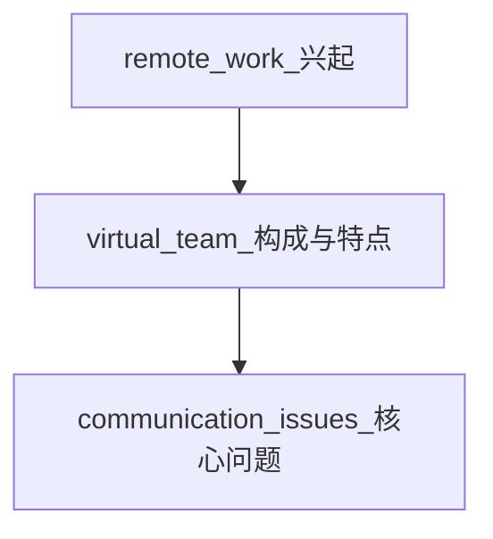
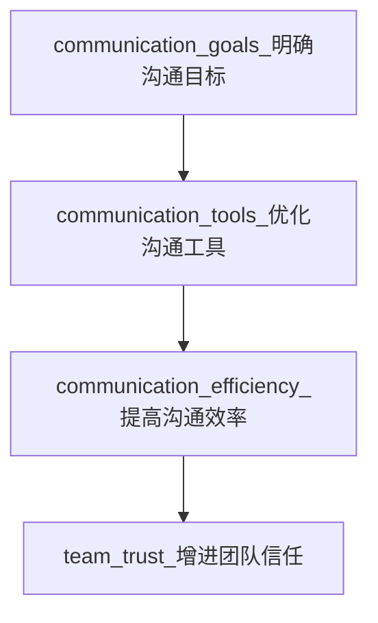
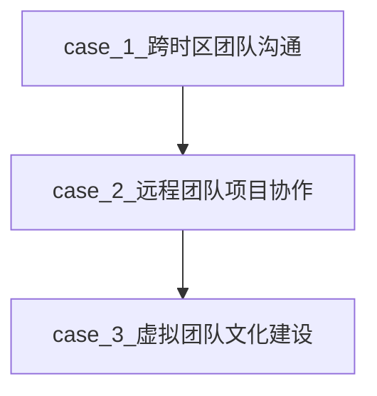

                 

### 文章标题

# 远程团队沟通：提升虚拟团队交流效果

远程工作已成为现代企业运作的重要组成部分，而虚拟团队的沟通效率直接影响到项目的成功与否。本文旨在深入探讨远程团队沟通的挑战、策略、实践以及未来趋势，帮助您构建高效、和谐的远程工作环境。

### 关键词

- 远程团队
- 沟通策略
- 虚拟团队
- 情绪管理
- 技术工具
- 未来展望

### 摘要

本文首先介绍了远程团队沟通的背景与挑战，接着探讨了提升远程团队沟通效果的基础策略，并通过实际案例展示了沟通实践的成效。此外，文章详细介绍了远程团队沟通工具和技术，以及心理学在沟通中的应用。最后，对远程团队沟通的未来趋势进行了展望，以期为远程团队的沟通提供实用指导和理论支持。

---

### 第一部分：远程团队沟通概述

远程团队沟通，顾名思义，是指在地理位置分散的工作环境下，团队成员通过技术手段进行信息交流和协作。随着全球化和技术进步，远程工作已成为许多企业的选择，它不仅节省了办公成本，提高了员工的工作灵活性，同时也带来了沟通上的挑战。

#### 第1章：远程团队沟通的背景与挑战

##### 1.1 远程工作的兴起

远程工作（Remote Work）指的是员工不必每天到办公室上班，而是通过互联网和通信技术完成工作。这种工作方式最早可以追溯到20世纪90年代，但真正得到普及和发展是在21世纪初。特别是在2020年全球疫情爆发后，远程工作成为了一种主流的工作模式。

###### 1.1.1 远程工作的定义

远程工作通常包括以下几种形式：

- **远程办公（Telecommuting）**：员工在家中或任何其他地点完成工作。
- **分布式团队（Distributed Team）**：团队成员分布在不同的城市或国家。
- **远程协作（Remote Collaboration）**：团队成员通过技术手段进行合作。

###### 1.1.2 远程工作的发展趋势

远程工作的兴起和发展主要受到以下几个因素的影响：

- **技术进步**：互联网和移动通信技术的飞速发展，为远程工作提供了基础设施。
- **企业战略**：企业为了降低成本、提高效率和灵活性，逐渐接受和推广远程工作。
- **员工需求**：员工追求工作与生活的平衡，更倾向于灵活的工作方式。

###### 1.1.3 远程工作带来的沟通挑战

远程工作虽然带来了诸多优势，但也带来了一系列沟通挑战：

- **时间差异**：跨时区工作的团队需要协调工作时间，增加沟通成本。
- **信息传递障碍**：远程沟通中，缺乏面对面的交流可能导致信息传达不清。
- **情感交流缺失**：远程工作难以建立团队成员之间的深厚情感联系。
- **合作效率降低**：缺乏实时互动可能导致协作效率下降。

##### 1.2 虚拟团队的构成与特点

虚拟团队（Virtual Team）是指通过技术手段进行协作，但成员在地理位置上分散的工作团队。虚拟团队具有以下特点：

###### 1.2.1 虚拟团队的构成要素

虚拟团队的构成通常包括以下几个方面：

- **团队成员**：分布在不同的地理位置。
- **沟通工具**：如电子邮件、即时通讯、视频会议等。
- **协作平台**：如项目管理软件、文档共享工具等。
- **组织结构**：虚拟团队的组织结构较为扁平，决策过程更加迅速。

###### 1.2.2 虚拟团队的优点

虚拟团队的优点主要体现在以下几个方面：

- **地理位置无关**：团队成员不受地理位置限制，可以来自世界各地。
- **工作灵活**：团队成员可以根据个人时间表安排工作，提高工作效率。
- **成本节约**：远程工作减少了办公室租金、通勤时间等成本。

###### 1.2.3 虚拟团队的局限性

虚拟团队也存在一些局限性，主要包括：

- **沟通障碍**：远程沟通可能导致信息传递不畅和误解。
- **信任缺失**：团队成员之间难以建立深厚的信任关系。
- **管理难度**：虚拟团队的管理比传统团队更具挑战性。

##### 1.3 远程团队沟通的核心问题

远程团队沟通面临的核心问题主要包括以下几个方面：

###### 1.3.1 信息传递的障碍

远程团队沟通中，信息传递的障碍主要表现在：

- **语言障碍**：团队成员可能来自不同的语言背景，导致沟通不畅。
- **技术问题**：网络延迟、系统故障等可能导致沟通中断。
- **信息失真**：远程沟通中，信息容易被误解或扭曲。

###### 1.3.2 情感交流的缺失

情感交流的缺失是远程团队沟通中的一大挑战，主要表现在：

- **缺乏面对面交流**：远程工作难以实现面对面的交流，影响情感沟通。
- **缺乏非言语沟通**：非言语沟通（如肢体语言、面部表情等）在远程沟通中难以体现。
- **沟通不充分**：团队成员之间难以建立深厚的情感联系。

###### 1.3.3 合作效率的降低

远程团队沟通中，合作效率的降低主要体现在以下几个方面：

- **协作困难**：远程协作中，团队成员难以实时互动，协作效率下降。
- **决策缓慢**：远程团队决策需要更多时间进行沟通和讨论，导致决策缓慢。
- **资源浪费**：远程沟通中，团队成员可能因为信息不对称而重复工作，浪费资源。

#### 第一部分总结

远程团队沟通的背景与挑战、虚拟团队的构成与特点以及沟通的核心问题，为我们深入了解远程团队沟通奠定了基础。在接下来的部分，我们将探讨如何通过策略和实践提升远程团队沟通效果。

##### Mermaid 流程图

### 第二部分：远程团队沟通策略

提升远程团队沟通效果需要从多个方面进行策略制定，包括明确沟通目标、优化沟通工具、提高沟通效率以及增进团队信任。以下我们将详细探讨这些基础策略。

#### 第2章：远程团队沟通的基础策略

##### 2.1 明确沟通目标

有效沟通的首要任务是明确沟通目标。沟通目标的明确有助于确保团队成员在沟通过程中保持一致，提高沟通效率。

###### 2.1.1 沟通目标的设定

设定沟通目标时，需要考虑以下几个方面：

- **目标具体化**：目标应具体、可衡量，以便评估沟通效果。
- **目标相关性**：目标应与项目目标和团队目标保持一致。
- **目标时限性**：目标应设定明确的完成时限。

###### 2.1.2 沟通目标的分解

为了更好地实现沟通目标，可以将大目标分解为小目标，并分配给团队成员。这样，每个成员都有清晰的任务和责任，有助于提高团队的协作效率。

##### 2.2 优化沟通工具

沟通工具的选择和优化是提升远程团队沟通效果的关键。以下是一些常用的沟通工具及其优化策略：

###### 2.2.1 常用沟通工具的选择

- **电子邮件**：适用于正式沟通，适合传递重要信息和文件。
- **即时通讯工具**：如Slack、Microsoft Teams等，适合实时沟通和协作。
- **视频会议工具**：如Zoom、Microsoft Teams等，适用于团队会议和讨论。

###### 2.2.2 沟通工具的集成与优化

- **工具集成**：将不同的沟通工具集成到一个平台上，如Slack集成GitHub、Trello等，方便团队成员进行多渠道沟通。
- **工具优化**：根据团队需求，定制化沟通工具的使用规则和功能，提高沟通效率。

##### 2.3 提高沟通效率

提高沟通效率是远程团队沟通的重要目标。以下是一些策略：

###### 2.3.1 沟通节奏的控制

- **合理安排会议时间**：避免频繁的会议和过多的沟通，以免影响工作效率。
- **集中沟通**：将重要问题集中讨论，避免分散精力。

###### 2.3.2 沟通障碍的识别与解决

- **识别沟通障碍**：定期收集团队成员的意见和建议，了解沟通中存在的问题。
- **解决沟通障碍**：针对识别出的沟通障碍，制定解决方案并实施。

##### 2.4 增进团队信任

团队信任是远程团队高效沟通的基础。以下是一些增进团队信任的沟通技巧：

###### 2.4.1 信任的重要性

- **信任的基础**：信任是团队合作的基础，有助于提高沟通效率和协作效果。
- **信任的影响**：信任可以减少误解和冲突，提高团队的整体绩效。

###### 2.4.2 增进信任的沟通技巧

- **开放沟通**：鼓励团队成员开放地表达意见和想法，建立信任关系。
- **积极倾听**：认真倾听他人的意见，避免中断和干扰，表现出尊重和理解。
- **透明度**：在团队内部保持信息透明，避免信息不对称，增强信任。

#### 第二部分总结

明确沟通目标、优化沟通工具、提高沟通效率和增进团队信任，是提升远程团队沟通效果的基础策略。在下一部分，我们将通过实际案例展示这些策略在远程团队沟通中的应用和成效。

##### Mermaid 流程图

### 第三部分：虚拟团队沟通实践

理论与实践相结合，是提升远程团队沟通效果的关键。在本部分，我们将通过实际案例，展示远程团队沟通策略在实践中的应用和成效。

#### 第3章：虚拟团队沟通实践案例

##### 3.1 案例一：跨时区团队的沟通挑战与应对

跨时区团队是远程团队的一种典型形式，由于地理位置和时差的原因，沟通挑战更为突出。以下是一个跨时区团队的沟通挑战与应对策略的案例。

###### 3.1.1 案例背景

某国际科技公司由美国、欧洲和亚洲的团队成员组成，由于时差问题，团队成员之间的沟通存在明显障碍。这不仅影响了项目的进展，也降低了团队协作的效率。

###### 3.1.2 挑战与问题

- **沟通延迟**：由于时差，团队成员无法在短时间内进行沟通，导致决策延迟。
- **信息不对称**：不同时区的团队成员对项目信息的了解程度不一致，导致协作困难。
- **工作干扰**：团队成员在非工作时间被频繁打扰，影响工作效率。

###### 3.1.3 应对策略与成果

为了应对这些挑战，团队采取了以下策略：

- **制定沟通计划**：根据团队成员的时区，制定统一的沟通计划，确保每个人都能在合适的时间参与沟通。
- **使用即时通讯工具**：采用Slack等即时通讯工具，确保团队成员之间可以实时沟通。
- **设立时区协调人**：每个时区指定一位协调人，负责协调不同时区之间的沟通和任务分配。

经过一段时间的实践，团队取得了显著成效：

- **沟通效率提高**：团队成员之间的沟通更加及时和高效，决策过程得到显著优化。
- **信息对称性增强**：通过统一的沟通计划和信息共享工具，团队成员对项目的了解更加全面和及时。
- **工作干扰减少**：通过合理规划沟通时间，团队成员的非工作时间得到了有效保护，工作效率得到提高。

##### 3.2 案例二：远程团队项目协作与沟通

远程团队在项目协作中，沟通是确保项目顺利进行的关键。以下是一个远程团队项目协作与沟通的案例。

###### 3.2.1 项目背景

某IT公司负责开发一款跨平台的应用程序，团队成员分布在全球各地。为了确保项目的顺利进行，团队在沟通和协作方面进行了精心规划和实施。

###### 3.2.2 项目沟通计划

- **项目启动会议**：在项目开始时，召开一次全员参与的启动会议，明确项目目标、任务分配和沟通计划。
- **定期团队会议**：每周召开一次团队会议，总结项目进展、讨论问题和制定下一步计划。
- **紧急会议**：在项目遇到关键问题时，及时召开紧急会议，确保问题得到迅速解决。

###### 3.2.3 沟通实施与效果评估

在项目实施过程中，团队采取了以下措施：

- **使用项目管理工具**：使用Jira等项目管理工具，确保项目进度和任务的透明性。
- **共享文档与资料**：使用Google Docs等共享文档工具，确保团队成员可以实时查看和编辑文档。
- **即时通讯与视频会议**：使用Slack等即时通讯工具和Zoom等视频会议工具，确保团队成员之间可以实时沟通和协作。

经过一段时间的实践，团队取得了以下成效：

- **项目进展顺利**：通过有效的沟通和协作，项目进度得到有效控制，提前完成了既定目标。
- **问题解决及时**：通过紧急会议和即时通讯，团队成员能够迅速响应和解决问题，降低了项目风险。
- **团队协作高效**：通过统一的项目管理工具和沟通平台，团队成员之间的协作更加高效和顺畅。

##### 3.3 案例三：虚拟团队文化建设与沟通

虚拟团队的文化建设对于团队的长远发展至关重要。以下是一个虚拟团队文化建设与沟通的案例。

###### 3.3.1 文化建设的重要性

虚拟团队由于地理位置和时区的差异，团队成员之间的情感联系相对较弱。因此，文化建设成为增强团队凝聚力、提高工作效率的关键。

###### 3.3.2 沟通在文化建设中的应用

- **团队建设活动**：定期组织线上团队建设活动，如线上聚会、虚拟旅游等，增强团队成员之间的情感联系。
- **文化价值观传播**：通过内部邮件、公告板等渠道，传播团队的核心价值观和文化理念。
- **跨文化沟通**：尊重并包容团队成员的多元文化背景，促进文化融合。

###### 3.3.3 案例效果分析

通过一系列的文化建设活动，团队取得了以下效果：

- **团队凝聚力提高**：团队成员之间的情感联系得到增强，团队凝聚力显著提升。
- **工作效率提高**：良好的团队文化氛围促进了团队成员之间的协作和沟通，工作效率得到提高。
- **员工满意度提升**：团队成员对团队文化的认同感增加，员工满意度显著提升。

#### 第三部分总结

通过以上实际案例，我们可以看到，远程团队沟通策略在实践中的应用取得了显著成效。明确沟通目标、优化沟通工具、提高沟通效率和增进团队信任，是提升远程团队沟通效果的关键。在下一部分，我们将详细探讨远程团队沟通工具和技术。

##### Mermaid 流程图

### 第四部分：远程团队沟通工具与技术

为了确保远程团队沟通的顺畅和高效，选择合适的沟通工具和技术至关重要。本部分将详细探讨远程团队常用的沟通工具和技术，包括视频会议工具、即时通讯工具、项目管理工具和云协作平台。

#### 第4章：远程团队沟通工具与技术应用

##### 4.1 视频会议工具的应用

视频会议工具是远程团队沟通的重要组成部分，能够实现实时语音、视频互动，提高沟通效率。以下是一些常用的视频会议工具及其应用技巧：

###### 4.1.1 常用视频会议工具

- **Zoom**：支持大会议和多人视频会议，提供高清视频和语音通话。
- **Microsoft Teams**：集成了视频会议、即时通讯和文档共享等功能，适用于企业级应用。
- **Google Meet**：Google提供的视频会议工具，支持多人视频会议和屏幕共享。

###### 4.1.2 视频会议技巧

- **提前测试**：在会议前，确保所有参与者的网络和设备正常，避免会议中发生技术问题。
- **准备会议议程**：制定清晰的会议议程，确保会议内容有条不紊。
- **积极参与**：鼓励团队成员积极参与会议讨论，提高会议效率。
- **注意网络环境**：在会议过程中，注意网络环境，避免网络延迟或中断。

##### 4.2 即时通讯工具的应用

即时通讯工具提供了实时沟通和协作的便利，适用于日常工作和紧急情况下的沟通。以下是一些常用的即时通讯工具及其应用技巧：

###### 4.2.1 常用即时通讯工具

- **Slack**：支持团队聊天、文件共享和集成其他工具，适用于企业内部沟通。
- **Microsoft Teams**：提供了即时通讯、视频会议和文档共享等功能，适用于企业级应用。
- **WhatsApp**：支持语音、视频和文字聊天，适用于个人和团队沟通。

###### 4.2.2 即时通讯的使用规范

- **设立沟通规范**：明确沟通渠道的使用规范，如工作群、聊天室等。
- **避免信息泛滥**：合理控制信息发布频率，避免信息泛滥和干扰。
- **注意隐私**：在即时通讯中，注意保护敏感信息和隐私。
- **有效互动**：鼓励团队成员积极参与沟通，提高沟通效果。

##### 4.3 项目管理工具的应用

项目管理工具能够帮助团队跟踪项目进度、分配任务和管理资源，提高团队协作效率。以下是一些常用的项目管理工具及其应用技巧：

###### 4.3.1 常用项目管理工具

- **Jira**：提供任务管理、敏捷规划和看板功能，适用于软件开发团队。
- **Trello**：通过卡片和列表展示项目进度，适用于项目规划和管理。
- **Asana**：提供任务分配、进度跟踪和团队协作功能，适用于企业级应用。

###### 4.3.2 项目管理工具的配置与使用

- **配置工作流**：根据项目需求，配置合适的任务流程和权限设置。
- **任务分配**：合理分配任务，确保每个人都能清楚自己的职责和任务。
- **进度跟踪**：定期查看项目进度，及时调整计划和资源。
- **团队协作**：鼓励团队成员在项目管理工具中实时协作，提高工作效率。

##### 4.4 云协作平台的应用

云协作平台提供了高效的文档共享、协作和存储解决方案，适用于远程团队协作。以下是一些常用的云协作平台及其应用技巧：

###### 4.4.1 常用云协作平台

- **Google Workspace**：提供邮件、文档、表格、日历等办公应用，适用于企业级协作。
- **Microsoft 365**：集成了Word、Excel、PowerPoint等办公软件，适用于企业级协作。
- **Dropbox**：提供云存储和文档共享功能，适用于个人和团队协作。

###### 4.4.2 云协作平台的优势与挑战

- **优势**：提高工作效率、方便文档共享和协作、降低办公成本。
- **挑战**：数据安全、网络依赖、兼容性问题等。

### 第四部分总结

远程团队沟通工具和技术的应用，是确保远程团队沟通高效、顺畅的关键。在下一部分，我们将探讨远程团队沟通中的心理学原理，帮助团队成员更好地应对沟通中的挑战。

### 第五部分：远程团队沟通心理学

远程团队沟通不仅需要技术工具的支持，更需要心理学原理的指导。通过理解心理学原理，团队成员可以更好地应对沟通中的情绪问题、冲突，建立信任，从而提高沟通效果。

#### 第5章：远程团队沟通心理学

##### 5.1 远程团队沟通中的心理学原理

心理学原理在远程团队沟通中发挥着重要作用，帮助我们理解团队成员的行为和心理状态。以下是一些关键的心理学原理及其在远程团队沟通中的应用：

###### 5.1.1 远程团队沟通的心理学基础

- **沟通心理学**：研究沟通过程中的信息传递、理解、反馈和心理效应。
- **社会心理学**：研究社会互动、群体行为和个体心理状态。

###### 5.1.2 心理学原理在沟通中的应用

- **感知**：理解团队成员如何感知信息，包括信息的接收、解读和判断。
- **情感**：了解团队成员在沟通中的情绪反应，包括正面和负面情绪的影响。
- **信任**：探讨信任在远程团队沟通中的重要性，以及如何建立和维护信任关系。

##### 5.2 远程团队沟通中的情绪管理

情绪管理是远程团队沟通中的一个重要方面。以下是一些关于情绪管理的心理学原理及其应用：

###### 5.2.1 情绪的类型与作用

- **正面情绪**：如喜悦、自信和积极情绪，有助于提高工作效率和团队协作。
- **负面情绪**：如焦虑、愤怒和沮丧，可能影响工作效率和团队关系。

###### 5.2.2 情绪管理的策略

- **自我调节**：通过自我反思和情绪控制，减少负面情绪的影响。
- **情感表达**：鼓励团队成员在合适的场合表达情感，避免压抑情绪。
- **支持系统**：建立情感支持系统，如团队心理辅导、定期心理测试等，帮助团队成员应对情绪问题。

##### 5.3 远程团队沟通中的冲突处理

冲突在团队沟通中是不可避免的，但有效的冲突处理可以促进团队发展和创新。以下是一些关于冲突处理的心理学原理及其应用：

###### 5.3.1 冲突的类型与原因

- **认知冲突**：由于对问题理解和解决方案的不同而产生的冲突。
- **情感冲突**：由于个人情感和价值观的差异而产生的冲突。
- **利益冲突**：由于个人利益和团队利益的冲突而产生的冲突。

###### 5.3.2 冲突解决的策略

- **对话与沟通**：通过开放、诚实的对话，理解冲突的根源，寻找解决方案。
- **妥协与协商**：在冲突双方的利益之间寻找平衡点，达成妥协。
- **寻求第三方帮助**：在冲突无法自行解决时，寻求中立第三方的帮助，如团队领导或专业调解员。

### 第五部分总结

心理学原理在远程团队沟通中的应用，可以帮助团队成员更好地理解和管理情绪，处理冲突，建立信任。在下一部分，我们将对远程团队沟通的未来发展趋势进行展望。

### 第六部分：远程团队沟通的未来展望

随着技术的不断进步，远程团队沟通也将迎来新的发展机遇和挑战。以下将探讨远程团队沟通的未来发展趋势，以及这些趋势可能带来的影响。

#### 第6章：远程团队沟通的未来发展趋势

##### 6.1 技术进步对远程沟通的影响

技术进步是推动远程团队沟通发展的关键因素。以下是一些新兴技术和其潜在影响：

###### 6.1.1 人工智能在远程沟通中的应用

人工智能（AI）的应用将极大地改变远程团队沟通的方式和效率。例如：

- **自然语言处理（NLP）**：通过NLP技术，可以实现更智能的聊天机器人，提高沟通效率。
- **语音识别与生成**：语音识别与生成技术可以实时翻译不同语言的对话，打破语言障碍。
- **智能助理**：智能助理可以帮助团队成员自动处理一些重复性任务，如日程安排、会议提醒等。

###### 6.1.2 虚拟现实（VR）与增强现实（AR）在远程沟通中的应用

虚拟现实和增强现实技术将提供更加沉浸式的沟通体验。例如：

- **虚拟会议室**：通过VR技术，团队成员可以在虚拟空间中面对面交流，增强情感联系。
- **虚拟协作**：通过AR技术，团队成员可以实时查看对方的工作进度和设计图，提高协作效率。

##### 6.2 远程团队沟通工具的创新与发展

远程团队沟通工具的创新和发展将继续推动远程团队沟通的进步。以下是一些创新和发展方向：

- **集成化平台**：未来的远程沟通工具将更加集成化，提供从即时通讯、视频会议到项目管理的一站式服务。
- **个性化工具**：根据不同团队的特定需求，提供个性化的沟通工具和服务，提高团队效率。
- **数据安全与隐私**：随着远程团队沟通的普及，数据安全和隐私保护将成为重要议题，相关技术也将得到进一步发展。

##### 6.3 远程团队沟通的持续优化与提升

远程团队沟通的优化与提升将是未来持续努力的方向。以下是一些优化和提升策略：

- **持续培训与学习**：通过定期的培训和研讨会，提高团队成员的沟通技能和心理健康。
- **文化适应性**：远程团队将更加注重文化适应性，尊重和包容团队成员的不同文化和背景。
- **技术支持与服务**：提供更加完善的技术支持和咨询服务，帮助团队解决沟通中的技术问题和挑战。

### 第六部分总结

远程团队沟通的未来充满机遇和挑战。通过技术进步、工具创新和文化适应，远程团队沟通将继续优化和提升，为远程工作提供更加高效和和谐的沟通环境。

### 总结与建议

远程团队沟通在现代社会中扮演着至关重要的角色。本文通过详细探讨远程团队沟通的背景与挑战、基础策略、实践案例、工具与技术、心理学原理以及未来展望，为提升远程团队沟通效果提供了全面的指导和建议。

#### 最佳实践

1. **明确沟通目标**：确保沟通目标具体、可衡量，并分解为小目标。
2. **优化沟通工具**：根据团队需求选择合适的沟通工具，并集成到一个平台上。
3. **提高沟通效率**：合理安排沟通时间，识别和解决沟通障碍。
4. **增进团队信任**：通过开放沟通和透明度，建立和维护团队信任。

#### 注意事项

1. **避免信息失真**：确保信息传递清晰、准确。
2. **关注员工心理健康**：定期提供心理支持和培训。
3. **数据安全和隐私保护**：确保沟通工具和数据的安全。

#### 拓展阅读

- **《远程工作的心理学》**：探讨远程工作对员工心理健康的影响及应对策略。
- **《远程团队管理指南》**：提供远程团队管理的最佳实践和实用技巧。
- **《人工智能在远程沟通中的应用》**：介绍人工智能技术如何提升远程团队沟通效率。

### 作者信息

- **作者：AI天才研究院/AI Genius Institute & 禅与计算机程序设计艺术 /Zen And The Art of Computer Programming**

