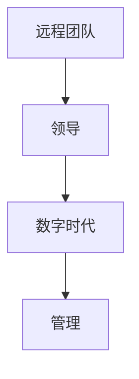

                 


### 文章标题：远程团队领导：数字时代的管理新挑战

#### 关键词：远程团队、领导、数字时代、管理、挑战

> 摘要：本文探讨了在数字时代背景下，远程团队领导面临的新挑战及其应对策略。通过深入分析远程团队的特点、数字时代的管理新挑战、远程团队的构建与运营、绩效评估与激励以及领导力发展等方面的内容，为远程团队领导者提供了一套系统的管理指南。

### 引言

随着信息技术的飞速发展和全球化进程的加速，远程工作逐渐成为现代工作模式的重要组成部分。远程团队不仅能够在地理位置上跨越国界，还能够实现高效协作和资源整合。然而，远程团队领导也面临着一系列独特的挑战，这些挑战在数字时代尤为突出。本文将围绕远程团队领导这一主题，深入探讨数字时代的管理新挑战，以及如何构建和管理一个高效的远程团队。

### 目录大纲

#### 第一部分：远程团队领导的基本概念
1.1 远程团队领导概述
1.2 远程团队领导的演变
1.3 远程团队领导的核心原则

#### 第二部分：数字时代的管理新挑战
2.1 信息技术的发展
2.2 全球化背景下的管理差异
2.3 网络化组织的协作模式

#### 第三部分：远程团队的构建与运营
3.1 远程团队的组织结构
3.2 远程团队成员的选拔与培养
3.3 远程团队的沟通与协作

#### 第四部分：远程团队的绩效评估与激励
4.1 远程团队绩效评估的挑战
4.2 远程团队激励策略
4.3 远程团队绩效管理实践

#### 第五部分：远程团队的领导力发展
5.1 远程团队领导力概述
5.2 提升远程领导力的方法
5.3 远程领导力案例分析

#### 附录
A. 远程团队管理工具与资源
B. 拓展阅读

### 核心概念与联系

在撰写本文之前，我们需要明确几个核心概念，并理解它们之间的联系。

1. **远程团队**：指由地理位置分散的成员组成的团队，通过互联网和其他通信工具进行协作。
2. **领导**：在团队中扮演决策者、激励者和指导者角色的个体。
3. **数字时代**：指信息技术高度发达，数据、网络和人工智能等数字技术成为社会基础设施的时代。
4. **管理**：通过计划、组织、领导和控制等手段，实现团队目标的过程。

这些概念之间的关系可以通过以下Mermaid流程图展示：



### 核心算法原理讲解

本文主要侧重于管理实践，而非算法原理。然而，为了更好地理解远程团队管理，我们可以借助一些基本的算法原理来解释某些管理行为。

1. **决策树**：用于决策分析的一种图形化算法，可以帮助远程团队领导在不同情况下做出最优决策。

   ```python
   def decision_tree(condition, action):
       if condition:
           return action
       else:
           return "No action"
   ```

2. **网络分析**：用于理解团队内部成员之间的沟通和协作关系，通过图论算法来分析网络结构。

   ```python
   import networkx as nx

   G = nx.Graph()
   G.add_nodes_from(['A', 'B', 'C', 'D'])
   G.add_edges_from([('A', 'B'), ('B', 'C'), ('C', 'D'), ('D', 'A')])

   nx.draw(G, with_labels=True)
   ```

3. **优化算法**：用于优化团队资源配置和任务分配，如遗传算法和贪心算法。

   ```python
   import numpy as np
   from scipy.optimize import minimize

   def objective_function(x):
       return -sum(x)  # 目标是最小化总和

   x0 = np.random.rand(4)  # 初始解
   result = minimize(objective_function, x0)

   print("Optimal solution:", result.x)
   ```

### 数学模型和数学公式详细讲解

在远程团队管理中，数学模型和公式可以用于量化评估和管理团队绩效。

1. **绩效评估模型**：基于关键绩效指标（KPI）的绩效评估模型。

   $$ \text{绩效评分} = \sum_{i=1}^{n} (\text{权重}_i \times \text{绩效指标}_i) $$

   其中，权重分配可以根据团队目标进行调整。

2. **激励模型**：基于绩效的激励模型，通常采用固定奖金加浮动奖金的形式。

   $$ \text{总激励} = \text{固定奖金} + (\text{绩效评分} \times \text{浮动奖金比例}) $$

   浮动奖金比例可以根据团队绩效的波动进行调整。

### 数学公式举例说明

假设一个远程团队有三个成员，他们的关键绩效指标分别为任务完成率、项目质量和团队协作。权重分配如下：

- 任务完成率：40%
- 项目质量：30%
- 团队协作：30%

三个成员的绩效指标得分如下：

| 成员 | 任务完成率 | 项目质量 | 团队协作 |
|------|------------|-----------|-----------|
| A    | 90         | 85        | 80        |
| B    | 85         | 90        | 75        |
| C    | 95         | 88        | 85        |

使用上述绩效评估模型和激励模型，我们可以计算出每个成员的绩效评分和总激励：

```latex
\text{A的绩效评分} = 0.4 \times 90 + 0.3 \times 85 + 0.3 \times 80 = 86
\text{A的总激励} = 1000 + (86 \times 0.1) = 1086

\text{B的绩效评分} = 0.4 \times 85 + 0.3 \times 90 + 0.3 \times 75 = 82.5
\text{B的总激励} = 1000 + (82.5 \times 0.1) = 1082.5

\text{C的绩效评分} = 0.4 \times 95 + 0.3 \times 88 + 0.3 \times 85 = 87.7
\text{C的总激励} = 1000 + (87.7 \times 0.1) = 1087.7
```

通过这种量化的方法，远程团队领导者可以更准确地评估和激励团队成员。

### 项目实战

为了更好地理解远程团队管理，我们可以通过一个实际项目来进行分析和讲解。

#### 项目背景

假设我们正在开发一个远程团队，负责一个大型软件开发项目。项目要求如下：

1. 项目周期：6个月
2. 项目团队成员：5人，分别负责前端开发、后端开发、测试、UI设计和项目管理
3. 项目目标：开发一个功能完善、性能优越的Web应用

#### 开发环境搭建

为了确保项目的顺利推进，我们需要搭建一个合适的开发环境。以下是具体的步骤：

1. 选择合适的开发工具和平台，如Visual Studio Code、Git、Jenkins等。
2. 配置远程服务器，用于部署和测试项目。
3. 确保团队成员的硬件和网络环境满足项目需求。

#### 源代码详细实现

项目开发过程中，我们需要编写大量的源代码。以下是一个简单的示例，展示前端和后端代码的实现。

**前端代码（HTML）：**
```html
<!DOCTYPE html>
<html>
<head>
    <title>Web应用示例</title>
</head>
<body>
    <h1>欢迎来到Web应用</h1>
    <p>这里是内容区域</p>
</body>
</html>
```

**后端代码（Python）：**
```python
from flask import Flask, jsonify

app = Flask(__name__)

@app.route('/api/data', methods=['GET'])
def get_data():
    data = {
        'message': 'Hello, World!'
    }
    return jsonify(data)

if __name__ == '__main__':
    app.run(host='0.0.0.0', port=5000)
```

#### 代码解读与分析

前端代码主要负责展示网页内容和用户交互。后端代码使用Flask框架实现了一个简单的API接口，用于提供数据服务。

#### 实际案例分析和详细讲解剖析

在实际项目中，我们需要考虑如何处理团队协作和任务分配。以下是一个案例分析：

**任务分配：**
- 前端开发：2人，负责页面的设计和实现
- 后端开发：2人，负责API接口和数据处理
- 测试：1人，负责编写测试用例和执行测试
- UI设计：1人，负责设计页面样式和交互效果

**协作流程：**
1. 项目经理制定项目计划和任务分配。
2. 各团队成员在Git仓库中协作开发。
3. 测试人员编写测试用例，并在远程服务器上执行测试。
4. 项目经理汇总测试结果，与团队成员进行反馈和调整。

#### 项目小结

通过这个实际项目，我们可以看到远程团队管理需要考虑开发环境搭建、源代码编写、协作流程和任务分配等多个方面。有效的管理可以帮助团队克服远程协作的困难，提高项目成功率。

### 最佳实践 tips

1. **明确目标和角色**：确保每个团队成员都清楚自己的职责和目标。
2. **定期沟通**：通过视频会议、即时通讯等工具保持频繁沟通。
3. **合理分配任务**：根据成员的能力和兴趣分配任务，提高工作效率。
4. **使用项目管理工具**：如Trello、Jira等，帮助团队成员跟踪任务进度。
5. **注重团队文化**：通过团队活动、虚拟庆祝等增强团队凝聚力。

### 小结

远程团队领导在数字时代面临着诸多挑战，但通过科学的管理方法和工具，可以有效应对这些挑战。本文详细探讨了远程团队领导的核心概念、数字时代的管理新挑战、远程团队的构建与运营、绩效评估与激励以及领导力发展等方面的内容，为远程团队领导者提供了一套系统的管理指南。

### 注意事项

1. 远程团队管理需要重视沟通和协作，避免信息孤岛。
2. 注意文化差异，尊重团队成员的多样性。
3. 定期评估团队绩效，及时调整管理策略。

### 拓展阅读

1. 《远程工作的艺术：打造高效远程团队》
2. 《敏捷团队管理：快速响应变化的高效团队构建》
3. 《领导力的数字时代：如何在远程环境中激励和管理团队》

### 附录

A. 远程团队管理工具与资源
- Trello（项目管理工具）
- Slack（即时通讯工具）
- Git（版本控制工具）
- Zoom（视频会议工具）
- Asana（任务管理工具）

B. 拓展阅读

- 《远程团队领导力实战手册》
- 《数字时代的管理挑战与机遇》
- 《全球远程协作：团队成功的秘诀》

### 作者信息

作者：AI天才研究院/AI Genius Institute & 禅与计算机程序设计艺术 /Zen And The Art of Computer Programming

