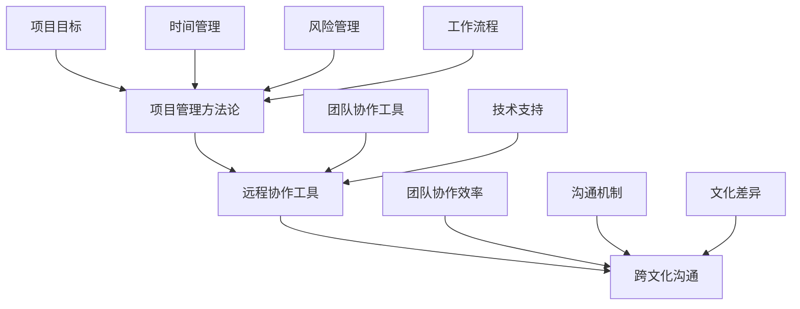

                 

基于您的详细需求，我将逐步构建《远程项目管理：跨地域团队协作策略》的技术博客文章，确保满足所有条件和要求。以下是文章的开头部分，包含文章标题、关键词、摘要以及markdown格式的基本结构。

```markdown
# 《远程项目管理：跨地域团队协作策略》

> 关键词：远程项目管理，跨地域团队协作，项目规划，沟通机制，效率提升

> 摘要：本文将深入探讨远程项目管理的关键挑战和解决方案，详细介绍跨地域团队协作的策略和方法，并通过实际案例进行分析，帮助读者理解如何在全球化背景下高效进行远程项目管理。

---

## 引言

在全球化进程加速和信息技术飞速发展的今天，远程项目管理已成为企业运营的重要组成部分。然而，如何确保跨地域团队的高效协作，如何应对沟通障碍和文化差异，是远程项目管理面临的重大挑战。本文将围绕这些问题，提供系统的远程项目管理策略和实用的团队协作技巧。

## 第1章 远程项目管理概述

### 1.1 背景介绍

远程项目管理是指团队成员分布在不同的地理位置，通过现代通信技术协同完成项目的过程。随着远程工作的普及，远程项目管理的重要性日益凸显。

### 1.2 核心概念与联系

在远程项目管理中，核心概念包括项目管理方法论、远程协作工具、跨文化沟通等。以下是这些概念之间的关系架构Mermaid流程图：



### 1.3 远程项目管理的挑战

远程项目管理面临的主要挑战包括沟通障碍、时间管理困难、文化差异等。以下是对这些挑战的简要介绍。

## 第2章 跨地域团队协作的核心概念

### 2.1 远程协作工具与技术

远程协作工具是远程项目管理的重要支撑。本文将介绍几种常用的远程协作工具，如视频会议软件、即时通讯工具、项目管理平台等。

### 2.2 跨文化沟通与协作

跨文化沟通是远程项目管理中的关键环节。本文将探讨跨文化沟通的要点，以及如何通过培训和文化交流来促进跨文化协作。

### 2.3 跨地域团队协作的模式

跨地域团队协作有多种模式，包括分布式团队、集中式团队和混合式团队。本文将分析不同协作模式的优缺点。

## 第3章 项目管理方法论在远程环境中的应用

### 3.1 远程项目规划

远程项目规划是远程项目管理的基础。本文将介绍如何制定远程项目计划，包括项目目标、任务分配、进度安排等。

### 3.2 远程项目执行

远程项目执行涉及任务执行、团队协作、进度监控等。本文将探讨如何确保远程项目按计划进行。

### 3.3 远程项目监控与控制

远程项目监控与控制是确保项目成功的关键。本文将介绍如何进行远程项目监控，以及如何应对项目中的变化和风险。

## 第4章 跨地域团队协作的沟通机制

### 4.1 远程沟通的有效性

远程沟通的有效性对项目成功至关重要。本文将分析远程沟通的有效性，并提出提升沟通效果的策略。

### 4.2 跨地域团队的沟通策略

跨地域团队的沟通策略应考虑到文化差异和时区差异。本文将介绍如何制定有效的沟通策略。

### 4.3 远程团队沟通工具的选用

选择合适的远程沟通工具对于团队协作至关重要。本文将分析几种常用的远程沟通工具，并给出选用建议。

## 第5章 远程项目的时间管理与效率提升

### 5.1 远程项目的时间管理

远程项目的时间管理是确保项目按时完成的关键。本文将介绍如何进行远程项目的时间管理。

### 5.2 提升远程团队效率的策略

提升远程团队效率是远程项目管理的重要目标。本文将探讨如何通过策略和方法提升远程团队的工作效率。

### 5.3 远程工作的心理健康

远程工作对心理健康带来一定挑战。本文将介绍如何维护远程工作的心理健康。

## 第6章 远程项目实战：启动与规划

### 6.1 远程项目启动流程

远程项目启动是项目成功的开端。本文将介绍如何启动远程项目，包括团队组建、项目规划等。

### 6.2 远程项目规划策略

远程项目规划策略应考虑团队成员的地理位置和时区差异。本文将介绍如何制定远程项目规划策略。

## 第7章 跨地域团队协作的执行与监控

### 7.1 远程团队协作执行策略

远程团队协作执行策略应确保团队成员协同工作。本文将介绍如何制定远程团队协作执行策略。

### 7.2 远程项目监控与反馈机制

远程项目监控与反馈机制是确保项目进度和质量的重要手段。本文将介绍如何进行远程项目监控和建立反馈机制。

## 第8章 远程项目的收尾与评估

### 8.1 远程项目收尾工作

远程项目收尾工作包括项目交付、团队解散等。本文将介绍如何完成远程项目收尾工作。

### 8.2 跨地域团队协作的评估与改进

对跨地域团队协作的评估和改进有助于持续优化团队协作过程。本文将介绍如何评估和改进跨地域团队协作。

## 第9章 附录

### 9.1 远程项目管理工具与应用

附录部分将列出常用的远程项目管理工具，并提供简要应用说明。

### 9.2 跨地域团队协作最佳实践

附录部分还将总结跨地域团队协作的最佳实践，为读者提供参考。

---

作者：AI天才研究院/AI Genius Institute & 禅与计算机程序设计艺术 /Zen And The Art of Computer Programming
```

以上是文章的开头部分，包括引言、章节概述以及markdown格式的结构。接下来，我将逐步完善每个章节的内容，确保满足完整性和详细性要求，并最终达到8000-12000字的文章长度。在构建每个章节时，我将遵循以下步骤：

1. **背景介绍**：介绍章节的主题和相关背景。
2. **核心概念与联系**：使用Mermaid流程图展示概念关系。
3. **核心算法原理讲解**：使用伪代码和详细解释阐述算法原理。
4. **数学模型和公式讲解**：使用latex格式嵌入数学公式并举例说明。
5. **项目实战案例**：提供实际案例并进行分析。
6. **最佳实践 tips**、**小结**、**注意事项**、**拓展阅读**等内容。

请注意，由于文章字数要求较高，我会分段撰写和整合内容，以确保每章内容的丰富性和详尽性。在完成所有章节后，我会进行全文的审查和调整，确保文章的逻辑性和连贯性。在撰写过程中，我会密切关注字数，确保最终文章的长度在8000-12000字之间。如果您对某个部分有特别的要求或者需要补充的内容，请随时告知，我将根据您的需求进行调整。

