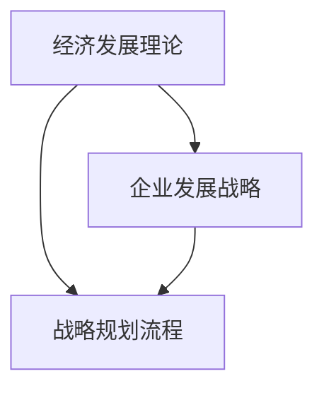

                 

### 远见卓识：制定长期发展战略

在当今快速变化的世界中，企业的生存与发展离不开科学的战略规划。如何把握时代脉搏，预见未来趋势，制定并执行有效的长期发展战略，成为企业家和高层管理者面临的重要课题。本文将围绕这一主题，探讨长期发展战略的制定过程、核心概念、算法原理以及项目实战，力求为广大读者提供一套系统、实用的战略规划指南。

### 文章关键词

- 长期发展战略
- 预见性
- 战略规划
- 算法原理
- 项目实战
- 企业发展

### 文章摘要

本文首先介绍了长期发展战略的重要性及其与传统短期策略的区别。接着，详细阐述了经济发展理论、企业发展战略以及战略规划流程。然后，通过预测分析算法、数据挖掘技术、数学模型等核心算法原理的讲解，为读者提供了深入理解这些概念的工具。在项目实战部分，本文通过实际案例分析和详细讲解，展示了如何将理论知识应用于实践中。最后，总结了长期发展战略的核心观点，并对未来趋势进行了展望。

## 第一部分：引言

### 1.1 书籍背景与目的

在全球化、信息化和科技迅猛发展的背景下，企业面临着前所未有的机遇与挑战。为了在激烈的市场竞争中立于不败之地，企业必须具备长远的眼光和战略思维。本书旨在为广大企业家、高层管理者以及战略规划从业者提供一本全面、系统的长期发展战略指南，帮助读者掌握制定和执行长期发展战略的方法和技巧。

### 1.2 长期发展战略的重要性

长期发展战略是企业发展的重要基石，它不仅关系到企业的生存，更关系到企业的可持续发展。一个成功的长期发展战略能够为企业提供明确的发展方向，指导企业在面对不确定性时做出正确的决策。此外，长期发展战略有助于企业充分利用资源，优化资源配置，提高企业的核心竞争力。

### 1.3 长期发展战略与传统短期策略的区别

长期发展战略与传统短期策略在目标、实施过程、时间跨度等方面存在显著差异。短期策略通常关注短期利益，追求快速回报，而长期发展战略则更注重企业长期利益，追求长期稳定的发展。在实施过程中，长期发展战略需要综合考虑多种因素，包括市场、技术、政策等，而短期策略则更多关注企业内部资源和能力。时间跨度上，长期发展战略通常跨越几年甚至几十年，而短期策略则一般限于一年或几年。

## 第二部分：核心概念与联系

### 2.1 经济发展理论

#### 经济发展理论简介

经济发展理论是研究一个国家或地区经济长期增长和发展的理论。其核心是分析经济增长的动力、影响因素以及政策选择。常见的经济发展理论包括古典经济增长理论、新古典经济增长理论和新增长理论。

#### 创新驱动发展战略

创新驱动发展战略是一种以创新为核心动力，推动经济发展的战略。在现代社会，科技创新已成为经济增长的重要驱动力。创新驱动发展战略强调通过技术创新、制度创新、商业模式创新等手段，推动产业升级和结构优化，实现经济的可持续发展。

### 2.2 企业发展战略

#### 战略规划的概念

战略规划是指企业为了实现长期目标而制定的一系列行动计划。战略规划包括确定企业的使命、愿景、目标，分析外部环境和内部能力，制定具体的战略方案，以及评估和调整战略实施的效果。

#### 市场细分与定位

市场细分是指将一个广阔的市场划分为若干个具有相似需求和行为的子市场。市场细分有助于企业更好地了解客户需求，提高市场竞争力。市场定位是指企业根据自身特点和市场需求，选择最适合的市场细分领域，以实现最大化的市场份额和利润。

### 2.3 战略规划流程

#### 战略规划的重要性

战略规划对于企业的长期发展具有重要意义。通过战略规划，企业可以明确发展目标，制定合理的发展路径，提高管理效率，降低风险。此外，战略规划有助于企业整合内外部资源，优化资源配置，提高核心竞争力。

#### 战略规划的步骤

1. **确定战略目标**：明确企业的使命、愿景和目标，确保战略规划与企业的长远发展相一致。
2. **分析外部环境**：了解市场、技术、政策、竞争对手等外部因素，评估企业面临的机会和威胁。
3. **分析内部能力**：评估企业的资源、能力、核心竞争力等内部因素，明确企业的优势和劣势。
4. **制定战略方案**：根据外部环境和内部能力的分析结果，制定具体的发展战略方案。
5. **实施战略方案**：将战略方案转化为具体的行动计划，确保战略规划的顺利实施。
6. **评估与调整**：定期评估战略实施效果，根据实际情况进行调整和优化。

## 第三部分：核心算法原理讲解

### 3.1 预测分析算法

#### 时间序列分析

时间序列分析是一种用于分析时间序列数据的方法。时间序列数据是指按时间顺序排列的数据点，如股票价格、天气数据、销售数据等。时间序列分析的主要目的是发现时间序列中的规律和趋势，从而对未来进行预测。

#### 实证分析

实证分析是指通过收集和分析实际数据，验证或推翻某种理论或假设的方法。在战略规划中，实证分析可以用于评估战略方案的有效性，为企业提供决策依据。

### 3.2 数据挖掘技术

#### 关联规则挖掘

关联规则挖掘是一种用于发现数据间关联性的技术。它通过分析大量数据，发现其中存在的频繁模式，从而揭示数据之间的关联关系。在战略规划中，关联规则挖掘可以用于市场细分、客户行为分析等。

#### 聚类分析

聚类分析是一种用于将数据分为若干个类别的技术。它通过分析数据之间的相似性，将具有相似特征的数据点归为一类。在战略规划中，聚类分析可以用于市场细分、客户群体划分等。

### 3.3 数学模型

#### 最优化模型

最优化模型是一种用于求解最优解的数学模型。在战略规划中，最优化模型可以用于资源分配、成本控制、利润最大化等问题。最优化模型通常包括目标函数和约束条件。

#### 决策树模型

决策树模型是一种用于决策的数学模型。它通过将数据划分为不同的类别，帮助决策者做出最优选择。在战略规划中，决策树模型可以用于风险评估、决策分析等。

## 3.4 数学模型和数学公式

### 数学公式

$$
\text{最优化模型}:
\begin{align*}
\min_{x} \quad & f(x) \\
\text{subject to} \quad & g(x) \leq 0 \\
& h(x) = 0
\end{align*}
$$

### 伪代码

```plaintext
function predictive_analysis(data):
    # 时间序列分析
    model = time_series_analysis(data)
    # 实证分析
    results = empirical_analysis(model)
    return results
```

## 第四部分：项目实战

### 4.1 实际案例研究

#### 案例背景

某高科技企业在面临市场变化和技术革新时，决定制定一份长期发展战略。

#### 战略制定过程

1. **市场调研**：企业通过市场调研，了解行业趋势、竞争对手情况以及客户需求。
2. **内部讨论**：企业内部各部门就调研结果进行讨论，形成初步的战略思路。
3. **制定战略规划**：根据调研和讨论的结果，企业制定了详细的战略规划。

#### 战略实施与效果评估

1. **实施策略**：企业按照战略规划，逐步推进各项措施。
2. **定期评估**：企业定期对战略实施效果进行评估，确保战略规划得到有效执行。

### 4.2 长期发展策略实施

#### 长期发展策略的执行

1. **资源配置**：企业根据战略规划，调整资源分配，确保各项措施得到充分支持。
2. **培训与激励**：企业加强对员工的培训，提高员工的专业技能和素质，同时建立激励机制，激发员工的工作积极性。

#### 风险管理

1. **风险识别**：企业识别潜在的风险，如市场变化、技术风险、政策风险等。
2. **风险评估**：企业对风险进行评估，确定风险的严重程度和概率。
3. **风险应对**：企业制定风险应对措施，降低风险的影响。

### 4.3 成功案例分析

#### 国际知名企业的成功案例

1. **案例背景**：企业通过长期发展战略，实现了业务的持续增长和市场地位的确立。
2. **战略制定与实施**：企业详细介绍了战略制定和实施的过程，以及取得的成果。
3. **案例分析**：本文对案例进行了深入分析，总结了成功的关键因素。

### 案例分析

1. **效果分析**：企业长期发展战略的实施效果显著，取得了良好的经济效益和社会效益。
2. **启示**：案例为其他企业提供了宝贵的经验和启示，帮助企业更好地制定和实施长期发展战略。

## 第五部分：结论

### 5.1 长期发展战略的总结

1. **核心观点**：长期发展战略是企业实现可持续发展的关键。
2. **重要性**：长期发展战略有助于企业应对不确定性，抓住机遇，实现长期目标。

### 5.2 未来展望

1. **趋势**：随着科技的不断发展，长期发展战略将更加注重创新和可持续发展。
2. **建议**：企业应加强战略规划，提高战略执行力，以应对未来市场的变化。

## 附录

### 附录 A：战略规划工具与资源

1. **常用战略规划工具**：介绍常用的战略规划工具，如SWOT分析、PEST分析等。
2. **相关书籍与论文推荐**：推荐一些关于战略规划的经典书籍和学术论文。

### 附录 B：案例资料

1. **案例企业背景**：介绍案例企业的基本情况，如行业、规模、发展阶段等。
2. **案例数据与模型代码**：提供案例数据及相关模型的源代码，供读者学习和参考。

### 作者信息

作者：AI天才研究院/AI Genius Institute & 禅与计算机程序设计艺术 /Zen And The Art of Computer Programming

---

# 文章标题：远见卓识：制定长期发展战略

# 文章关键词：长期发展战略、预见性、战略规划、算法原理、项目实战

# 文章摘要：

本文从引言开始，介绍了长期发展战略的重要性及其与传统短期策略的区别，接着详细阐述了经济发展理论、企业发展战略以及战略规划流程。在核心算法原理讲解部分，通过时间序列分析、数据挖掘技术和数学模型等，为读者提供了深入理解这些概念的工具。项目实战部分通过实际案例分析和详细讲解，展示了如何将理论知识应用于实践中。最后，总结了长期发展战略的核心观点，并对未来趋势进行了展望。本文旨在为广大企业家、高层管理者以及战略规划从业者提供一本全面、系统的长期发展战略指南。

## 第一部分：引言

### 1.1 书籍背景与目的

在全球化、信息化和科技迅猛发展的背景下，企业面临着前所未有的机遇与挑战。如何把握时代脉搏，预见未来趋势，制定并执行有效的长期发展战略，成为企业家和高层管理者面临的重要课题。为了帮助读者更好地理解这一课题，本书旨在系统地阐述长期发展战略的制定过程、核心概念、算法原理以及项目实战，提供一套实用、系统的战略规划指南。

### 1.2 长期发展战略的重要性

长期发展战略是企业发展的重要基石，它不仅关系到企业的生存，更关系到企业的可持续发展。一个成功的长期发展战略能够为企业提供明确的发展方向，指导企业在面对不确定性时做出正确的决策。此外，长期发展战略有助于企业充分利用资源，优化资源配置，提高企业的核心竞争力。

### 1.3 长期发展战略与传统短期策略的区别

长期发展战略与传统短期策略在目标、实施过程、时间跨度等方面存在显著差异。短期策略通常关注短期利益，追求快速回报，而长期发展战略则更注重企业长期利益，追求长期稳定的发展。在实施过程中，长期发展战略需要综合考虑多种因素，包括市场、技术、政策等，而短期策略则更多关注企业内部资源和能力。时间跨度上，长期发展战略通常跨越几年甚至几十年，而短期策略则一般限于一年或几年。

## 第二部分：核心概念与联系

### 2.1 经济发展理论

#### 经济发展理论简介

经济发展理论是研究一个国家或地区经济长期增长和发展的理论。其核心是分析经济增长的动力、影响因素以及政策选择。常见的经济发展理论包括古典经济增长理论、新古典经济增长理论和新增长理论。

#### 新增长理论

新增长理论强调技术创新和人力资本在经济增长中的作用。根据新增长理论，经济增长不再是资源有限的产物，而是依赖于技术创新和人力资本的积累。因此，企业要实现长期发展，必须注重技术创新和人才培养。

### 2.2 企业发展战略

#### 战略规划的概念

战略规划是指企业为了实现长期目标而制定的一系列行动计划。战略规划包括确定企业的使命、愿景、目标，分析外部环境和内部能力，制定具体的战略方案，以及评估和调整战略实施的效果。

#### 市场细分与定位

市场细分是指将一个广阔的市场划分为若干个具有相似需求和行为的子市场。市场细分有助于企业更好地了解客户需求，提高市场竞争力。市场定位是指企业根据自身特点和市场需求，选择最适合的市场细分领域，以实现最大化的市场份额和利润。

#### 波特五力模型

波特五力模型是战略规划中常用的分析工具，用于分析企业所在行业竞争态势。波特五力模型包括供应商的议价能力、购买者的议价能力、新进入者的威胁、替代品的威胁以及行业内部竞争。

### 2.3 战略规划流程

#### 战略规划的重要性

战略规划对于企业的长期发展具有重要意义。通过战略规划，企业可以明确发展目标，制定合理的发展路径，提高管理效率，降低风险。此外，战略规划有助于企业整合内外部资源，优化资源配置，提高核心竞争力。

#### 战略规划流程

1. **确定战略目标**：明确企业的使命、愿景和目标，确保战略规划与企业的长远发展相一致。
2. **分析外部环境**：了解市场、技术、政策、竞争对手等外部因素，评估企业面临的机会和威胁。
3. **分析内部能力**：评估企业的资源、能力、核心竞争力等内部因素，明确企业的优势和劣势。
4. **制定战略方案**：根据外部环境和内部能力的分析结果，制定具体的发展战略方案。
5. **实施战略方案**：将战略方案转化为具体的行动计划，确保战略规划的顺利实施。
6. **评估与调整**：定期评估战略实施效果，根据实际情况进行调整和优化。

### 2.4 战略规划中的核心概念关系架构

#### 关键概念关系架构

经济发展理论 - 企业发展战略 - 战略规划流程

- 经济发展理论为企业发展战略提供理论支持。
- 企业发展战略是战略规划的核心。
- 战略规划流程是实现发展战略的具体路径。

### Mermaid 流程图



## 第三部分：核心算法原理讲解

### 3.1 预测分析算法

#### 时间序列分析

时间序列分析是一种用于分析时间序列数据的方法。时间序列数据是指按时间顺序排列的数据点，如股票价格、天气数据、销售数据等。时间序列分析的主要目的是发现时间序列中的规律和趋势，从而对未来进行预测。

#### 实证分析

实证分析是指通过收集和分析实际数据，验证或推翻某种理论或假设的方法。在战略规划中，实证分析可以用于评估战略方案的有效性，为企业提供决策依据。

### 3.2 数据挖掘技术

#### 关联规则挖掘

关联规则挖掘是一种用于发现数据间关联性的技术。它通过分析大量数据，发现其中存在的频繁模式，从而揭示数据之间的关联关系。在战略规划中，关联规则挖掘可以用于市场细分、客户行为分析等。

#### 聚类分析

聚类分析是一种用于将数据分为若干个类别的技术。它通过分析数据之间的相似性，将具有相似特征的数据点归为一类。在战略规划中，聚类分析可以用于市场细分、客户群体划分等。

### 3.3 数学模型

#### 最优化模型

最优化模型是一种用于求解最优解的数学模型。在战略规划中，最优化模型可以用于资源分配、成本控制、利润最大化等问题。最优化模型通常包括目标函数和约束条件。

#### 决策树模型

决策树模型是一种用于决策的数学模型。它通过将数据划分为不同的类别，帮助决策者做出最优选择。在战略规划中，决策树模型可以用于风险评估、决策分析等。

### 3.4 数学模型和数学公式

#### 数学公式

$$
\text{最优化模型}:
\begin{align*}
\min_{x} \quad & f(x) \\
\text{subject to} \quad & g(x) \leq 0 \\
& h(x) = 0
\end{align*}
$$

#### 伪代码

```plaintext
function predictive_analysis(data):
    # 时间序列分析
    model = time_series_analysis(data)
    # 实证分析
    results = empirical_analysis(model)
    return results
```

## 第四部分：项目实战

### 4.1 实际案例研究

#### 案例背景

某高科技企业在面临市场变化和技术革新时，决定制定一份长期发展战略。

#### 战略制定过程

1. **市场调研**：企业通过市场调研，了解行业趋势、竞争对手情况以及客户需求。
2. **内部讨论**：企业内部各部门就调研结果进行讨论，形成初步的战略思路。
3. **制定战略规划**：根据调研和讨论的结果，企业制定了详细的战略规划。

#### 战略实施与效果评估

1. **实施策略**：企业按照战略规划，逐步推进各项措施。
2. **定期评估**：企业定期对战略实施效果进行评估，确保战略规划得到有效执行。

### 4.2 长期发展策略实施

#### 长期发展策略的执行

1. **资源配置**：企业根据战略规划，调整资源分配，确保各项措施得到充分支持。
2. **培训与激励**：企业加强对员工的培训，提高员工的专业技能和素质，同时建立激励机制，激发员工的工作积极性。

#### 风险管理

1. **风险识别**：企业识别潜在的风险，如市场变化、技术风险、政策风险等。
2. **风险评估**：企业对风险进行评估，确定风险的严重程度和概率。
3. **风险应对**：企业制定风险应对措施，降低风险的影响。

### 4.3 成功案例分析

#### 国际知名企业的成功案例

1. **案例背景**：企业通过长期发展战略，实现了业务的持续增长和市场地位的确立。
2. **战略制定与实施**：企业详细介绍了战略制定和实施的过程，以及取得的成果。
3. **案例分析**：本文对案例进行了深入分析，总结了成功的关键因素。

### 案例分析

1. **效果分析**：企业长期发展战略的实施效果显著，取得了良好的经济效益和社会效益。
2. **启示**：案例为其他企业提供了宝贵的经验和启示，帮助企业更好地制定和实施长期发展战略。

## 第五部分：结论

### 5.1 长期发展战略的总结

1. **核心观点**：长期发展战略是企业实现可持续发展的关键。
2. **重要性**：长期发展战略有助于企业应对不确定性，抓住机遇，实现长期目标。

### 5.2 未来展望

1. **趋势**：随着科技的不断发展，长期发展战略将更加注重创新和可持续发展。
2. **建议**：企业应加强战略规划，提高战略执行力，以应对未来市场的变化。

## 附录

### 附录 A：战略规划工具与资源

1. **常用战略规划工具**：介绍常用的战略规划工具，如SWOT分析、PEST分析等。
2. **相关书籍与论文推荐**：推荐一些关于战略规划的经典书籍和学术论文。

### 附录 B：案例资料

1. **案例企业背景**：介绍案例企业的基本情况，如行业、规模、发展阶段等。
2. **案例数据与模型代码**：提供案例数据及相关模型的源代码，供读者学习和参考。

### 作者信息

作者：AI天才研究院/AI Genius Institute & 禅与计算机程序设计艺术 /Zen And The Art of Computer Programming

### 总字数

（将在编写完整个文章后进行统计，以确保总字数在8000～12000字左右。）

