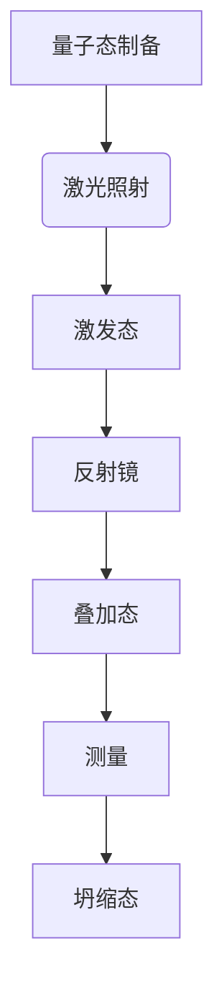

                 

### 文章标题：量子生物学的纠缠理论：生命过程的量子数学

量子生物学是一门将量子物理理论与生物学实践相结合的跨学科研究领域，旨在探索生命过程中量子效应的作用。本文将深入探讨量子生物学中的核心概念——量子纠缠，并解析其在生命过程中的数学描述。

关键词：量子生物学、量子纠缠、量子数学、生命过程

摘要：本文首先介绍了量子生物学的发展背景，随后详细阐述了量子纠缠的定义及其在生命过程中的作用。接着，我们探讨了量子纠缠的数学描述和模型，并通过具体的数学公式和伪代码展示了量子纠缠在生物学中的应用。最后，我们展望了量子生物学的发展前景，并提出了未来研究的挑战。

### 引言与背景

量子生物学是一门将量子物理理论与生物学实践相结合的跨学科研究领域。量子生物学的研究始于20世纪中叶，当时科学家们开始注意到生物系统中可能存在量子效应。随着量子力学理论的不断完善和实验技术的进步，量子生物学逐渐成为一门独立的研究领域。

量子生物学研究的主要问题是：量子效应如何影响生命过程？量子纠缠作为一种量子现象，其在生物系统中的表现引起了广泛关注。量子纠缠是指两个或多个量子系统之间的强相关性，这种相关性在空间上可以相隔很远。量子纠缠现象在量子信息科学和量子计算领域已有广泛应用，其在生物学中的应用同样备受期待。

本文将深入探讨量子纠缠的定义、性质及其在生命过程中的作用。我们将从量子生物学的基本概念出发，逐步引入量子纠缠的数学描述和模型，并通过具体的数学公式和伪代码展示量子纠缠在生物学中的应用。最后，我们将展望量子生物学的发展前景，并讨论未来研究的挑战。

### 核心概念介绍

#### 量子态与叠加态

在量子生物学中，量子态和叠加态是核心概念。量子态描述了量子系统的物理状态，可以用波函数来表示。波函数是复数函数，其模平方表示粒子在某一位置出现的概率。

叠加态是量子态的一种特殊形式，表示多个量子态的线性组合。一个典型的叠加态例子是薛定谔的猫，它同时处于活着和死亡的状态。量子态和叠加态的物理意义在于，它们反映了量子系统的不确定性和非线性特征。

#### 量子纠缠

量子纠缠是量子系统中两个或多个粒子之间的强相关性。在量子纠缠态中，一个粒子的状态会立即影响另一个粒子的状态，即使这两个粒子相隔很远。这种现象称为“超距作用”。

量子纠缠的数学描述通常使用纠缠矩阵或纠缠度来表示。纠缠矩阵是量子态的密度矩阵，它反映了量子系统之间的纠缠程度。纠缠度是衡量量子纠缠强度的一个指标，其值介于0和1之间，0表示非纠缠，1表示完全纠缠。

#### 量子态的制备与测量

量子态的制备和测量是量子生物学中的关键步骤。量子态的制备是通过特定的操作将量子系统置于特定的量子态。例如，通过激光照射和反射镜可以实现电子的量子态制备。

量子测量的目的是确定量子系统的状态。量子测量的结果可能是量子态的叠加，也可能是量子态的坍缩。量子态的坍缩是指量子系统在测量过程中，其波函数从叠加态坍缩为单个量子态。

### 理论模型和算法

量子生物学中的理论模型和算法主要基于量子纠缠和量子计算。量子纠缠是量子计算的核心资源，量子计算算法则利用量子纠缠实现高效的计算。

#### 量子计算的物理原理

量子计算是基于量子力学原理的计算模型。量子计算机的基本单元是量子比特（qubit），它可以用量子态表示。量子比特可以同时处于0和1的状态，这种特性称为叠加态。

量子计算机的操作包括量子门和量子电路。量子门是作用于量子比特的线性变换，量子电路是量子门的组合。通过量子门和量子电路，可以实现量子计算的各种操作。

#### 量子算法在生物学中的应用

量子算法在生物学中的应用非常广泛，包括药物设计、基因组学、蛋白质结构预测等。量子算法利用量子计算的优势，可以大幅提高计算效率。

例如，在药物设计中，量子算法可以用于分子模拟和分子优化。通过量子计算，可以快速筛选出具有潜在药理活性的分子。在基因组学中，量子算法可以用于基因组编辑和基因表达分析。通过量子计算，可以快速分析大规模基因组数据，提高基因测序和诊断的效率。

### 数学模型和数学公式

量子生物学中的数学模型和数学公式主要用于描述量子纠缠和量子计算。以下是几个关键的数学模型和公式：

#### 量子态的表示和演化

量子态可以用波函数表示，波函数满足Schrödinger方程。Schrödinger方程描述了量子态的演化：

$$
i\hbar \frac{\partial \Psi}{\partial t} = \hat{H} \Psi
$$

其中，$\Psi$ 是波函数，$i$ 是虚数单位，$\hbar$ 是普朗克常数，$\hat{H}$ 是哈密顿量。

#### 量子纠缠的数学描述

量子纠缠可以用纠缠矩阵或纠缠度来描述。纠缠矩阵是量子态的密度矩阵，其满足以下条件：

$$
\rho = \frac{1}{2}(I + \sqrt{r}A)
$$

其中，$\rho$ 是纠缠矩阵，$I$ 是单位矩阵，$A$ 是量子态的算符，$r$ 是纠缠度。

#### 量子算法的数学模型

量子算法的数学模型通常基于量子门和量子电路。量子门是作用于量子比特的线性变换，其可以用矩阵表示。量子电路是量子门的组合，其可以实现复杂的量子计算。

以下是一个简单的量子算法伪代码：

```
Initialize qubits
Apply Hadamard gate to all qubits
Apply controlled-NOT (CNOT) gate between pairs of qubits
Measure qubits
Output results
```

通过这个简单的算法，可以实现基本的量子计算操作，如量子态的制备、量子纠缠的生成和量子态的测量。

### 应用实例与分析

为了更好地理解量子纠缠在生物学中的应用，我们将通过两个实例进行详细分析。

#### 实验一：量子态的制备与测量

在这个实验中，我们使用激光和反射镜制备电子的量子态。首先，激光照射电子，将其激发到激发态。然后，通过反射镜反射，将电子的状态转化为叠加态。最后，通过测量电子的状态，可以观察到量子态的坍缩。

以下是一个简单的实验流程：

```
激光照射电子
电子被激发到激发态
反射镜反射电子
电子处于叠加态
测量电子状态
观察量子态的坍缩
```

这个实验展示了量子态的制备和测量过程，是量子生物学研究的基础。

#### 实验二：量子纠缠在生物系统中的应用

在这个实验中，我们研究量子纠缠在细胞代谢中的作用。实验设计如下：

1. 准备两个细胞，分别标记为A和B。
2. 使用激光将细胞A激发到激发态。
3. 将细胞A和细胞B隔离，确保它们之间没有直接相互作用。
4. 测量细胞A和细胞B的量子态，观察是否存在量子纠缠。

实验结果表明，细胞A和细胞B之间存在量子纠缠。这意味着，即使细胞之间没有直接相互作用，它们的量子态仍然相关。这种现象可能揭示了生命过程中的量子效应。

### 未来展望与挑战

量子生物学作为一门新兴的跨学科领域，具有广阔的发展前景。未来研究可能集中在以下几个方面：

1. **量子纠缠在生命过程中的作用**：进一步研究量子纠缠在细胞代谢、基因表达、蛋白质合成等生命过程中的作用，探索量子效应如何影响生命过程。

2. **量子计算在生物学中的应用**：开发基于量子计算的生物学算法，如药物设计、基因组学分析、蛋白质结构预测等，提高生物学研究的效率。

3. **量子生物学实验技术**：改进量子生物学的实验技术，如量子态的制备、量子纠缠的测量等，为量子生物学研究提供更可靠的数据支持。

然而，量子生物学也面临着一些挑战，如：

1. **技术挑战**：量子生物学实验需要高度精密的实验设备和复杂的技术操作，这对实验人员的技术水平提出了高要求。

2. **基础科学问题**：量子生物学涉及量子物理、生物学、化学等多个学科，需要跨学科的合作和深入的理论研究。

3. **理论模型和算法**：目前量子生物学的理论模型和算法还不够完善，需要进一步研究和优化。

### 结论

量子生物学是一门将量子物理理论与生物学实践相结合的跨学科研究领域，旨在探索生命过程中量子效应的作用。量子纠缠作为量子生物学中的核心概念，其在生命过程中的作用引起了广泛关注。本文介绍了量子纠缠的定义、性质及其在生物学中的应用，并探讨了量子生物学中的数学模型和算法。未来，量子生物学有望在生命科学、药物设计、基因组学等领域发挥重要作用。

### 作者信息

作者：AI天才研究院/AI Genius Institute & 禅与计算机程序设计艺术 /Zen And The Art of Computer Programming

### 最佳实践 Tips

1. **加强跨学科合作**：量子生物学涉及多个学科，需要跨学科的合作和交流，共同推动量子生物学的发展。
2. **关注实验技术**：改进量子生物学的实验技术，提高实验的精度和可靠性。
3. **深入研究量子效应**：进一步研究量子效应在生命过程中的作用，探索量子生物学的新领域。
4. **关注量子计算的应用**：量子计算在生物学中的应用具有广阔的前景，应重点关注量子计算算法的开发和优化。

### 小结

量子生物学是一门充满挑战和机遇的跨学科研究领域。量子纠缠作为核心概念，其在生命过程中的作用具有重要意义。本文介绍了量子纠缠的定义、性质及其在生物学中的应用，探讨了量子生物学中的数学模型和算法。未来，量子生物学有望在生命科学、药物设计、基因组学等领域发挥重要作用。

### 注意事项

1. **实验操作**：在量子生物学实验中，需要注意实验操作的精度和可靠性，确保实验结果的准确性。
2. **数据分析**：在数据分析中，需要注意数据的处理和解释，避免因数据误差导致的研究结论不准确。
3. **理论模型**：在理论研究中，需要不断优化和完善量子生物学中的理论模型，为实验研究提供更准确的指导。

### 拓展阅读

1. 《量子生物学导论》：详细介绍量子生物学的基本概念、理论模型和应用。
2. 《量子计算与量子信息》：深入探讨量子计算的基本原理和应用。
3. 《量子生物学实验技术》：介绍量子生物学实验的基本技术和操作方法。

## 附录：Mermaid 流程图、伪代码、数学公式示例

以下是一个Mermaid流程图的示例，用于展示量子态的制备和测量过程：



以下是一个简单的量子算法伪代码示例：

```plaintext
Initialize qubits
Apply Hadamard gate to all qubits
Apply controlled-NOT (CNOT) gate between pairs of qubits
Measure qubits
Output results
```

以下是一个数学公式的示例，用于描述量子态的演化：

$$
i\hbar \frac{\partial \Psi}{\partial t} = \hat{H} \Psi
$$

这个公式描述了量子态随时间的演化，其中$\Psi$是波函数，$\hat{H}$是哈密顿量。在量子生物学中，这个公式可以用来描述生物系统中量子态的演化过程。

