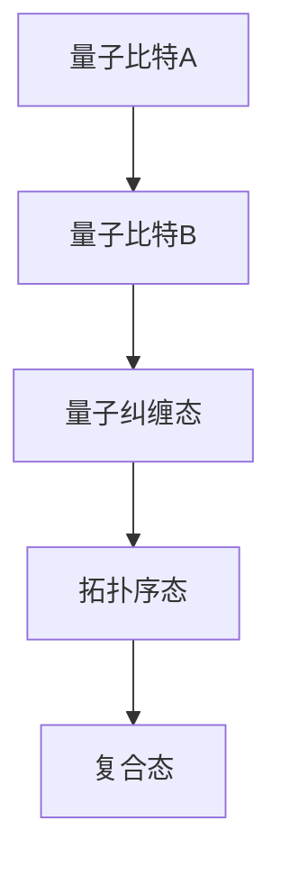

                 

### 引言

量子纠缠是量子力学中的一个核心概念，描述了两个或多个量子系统之间的一种特殊的关联性。当两个量子系统发生纠缠时，它们之间的状态无法单独描述，而是必须同时考虑。量子纠缠不仅在理论上具有重要意义，还在量子计算、量子通信和量子信息处理等领域展现出广泛的应用潜力。另一方面，拓扑序是量子物理中的另一个关键概念，它描述了物质在量子场论或凝聚态物理中的特定对称性破缺模式。近年来，量子纠缠与拓扑序之间的相互作用引起了广泛关注，成为量子物理领域的一个研究热点。

多体系统的数学结构是研究量子纠缠和拓扑序的基础。多体系统指的是包含多个粒子的系统，其行为由这些粒子的相互作用所决定。研究多体系统的数学结构有助于我们理解量子纠缠和拓扑序在复杂系统中的表现，从而为量子技术的发展提供理论支持。本文旨在探讨量子纠缠的拓扑序，以及它们在多体系统中的数学结构。通过深入分析量子纠缠和拓扑序的基本概念，我们将逐步揭示它们之间的联系，并探讨其在多体系统中的应用。

本文的结构如下：首先，我们将介绍量子纠缠的概念，包括其定义、特性、分类和实验验证。接着，我们将讨论拓扑序的概念，包括其定义、基本性质、分类以及在物理中的应用。随后，我们将详细探讨多体系统的数学结构，包括其基本概念、哈密顿量、动力学方程和态密度。在此基础上，我们将建立量子纠缠与拓扑序的数学模型，并使用Mermaid流程图展示其关系架构。随后，我们将深入讲解核心算法原理，使用伪代码详细阐述。接下来，我们将通过具体的数学公式和例子，详细讲解量子纠缠与拓扑序的数学模型。随后，我们将探讨量子纠缠在多体系统中的应用，包括量子计算、量子通信、量子模拟和量子精密测量。最后，我们将总结本文的主要发现，并提出一些最佳实践建议和未来研究方向。

通过本文的探讨，我们希望能够为读者提供对量子纠缠的拓扑序以及多体系统的数学结构有一个全面而深入的理解，并激发读者对这一领域的研究兴趣。

### 关键词

量子纠缠，拓扑序，多体系统，数学模型，核心算法，量子计算，量子通信，量子模拟，量子精密测量。

### 摘要

本文旨在探讨量子纠缠的拓扑序以及它们在多体系统中的数学结构。首先，我们介绍了量子纠缠的定义、特性、分类和实验验证，随后讨论了拓扑序的概念、基本性质、分类以及在物理中的应用。接着，我们详细探讨了多体系统的数学结构，包括基本概念、哈密顿量、动力学方程和态密度。在此基础上，我们建立了量子纠缠与拓扑序的数学模型，并使用Mermaid流程图展示了其关系架构。通过伪代码和具体的数学公式，我们深入讲解了核心算法原理。最后，我们探讨了量子纠缠在多体系统中的应用，包括量子计算、量子通信、量子模拟和量子精密测量。本文的主要贡献是揭示了量子纠缠与拓扑序在多体系统中的内在联系，并提出了未来的研究方向。

## 量子纠缠的概念

量子纠缠是量子力学中一个极为重要的现象，它描述了两个或多个量子系统之间的一种特殊的关联性。这种关联性不仅表现在微观层面上，如电子和原子核之间的相互作用，还可能表现在宏观层面上，如两个相距甚远的粒子之间的纠缠。量子纠缠的核心特点在于，当两个量子系统发生纠缠时，它们的状态无法单独描述，而是必须同时考虑。这意味着，一个系统的测量结果会立即影响到另一个系统的状态，无论这两个系统之间距离有多远。

### 定义

量子纠缠的定义可以从数学和物理两个角度来理解。在数学上，两个量子系统 $A$ 和 $B$ 之间存在纠缠，当且仅当它们的联合态不能表示为两个独立态的乘积，即：

$$
|\psi_{AB}\rangle = |\psi_A\rangle |\psi_B\rangle
$$

这意味着系统的整体状态无法通过将系统 $A$ 和系统 $B$ 的单独状态相乘来得到。在物理上，量子纠缠可以通过贝尔不等式来定义。贝尔不等式是量子力学与经典物理之间的重要区别之一，它描述了在某个测量条件下，两个粒子之间的关联性如何违反经典物理的预期。

### 历史背景

量子纠缠的概念最早可以追溯到1935年，由爱因斯坦、鲍尔和罗森（EPR）在他们的论文中提出，这一理论被称为EPR佯谬。EPR佯谬试图挑战量子力学的完备性，提出如果量子纠缠现象存在，那么量子力学在某种意义上是不完备的。然而，随后由约翰·贝尔（John Bell）在1964年提出的贝尔不等式，以及一系列实验验证，证明了量子纠缠的存在，这一现象成为量子力学中最为奇特且深刻的特性之一。

### 特性

量子纠缠具有以下几个关键特性：

1. **非局域性**：量子纠缠现象体现了量子系统的非局域性，即一个量子系统的测量可以立即影响到与其纠缠的另一量子系统的状态，无论它们之间的距离有多远。这一特性与爱因斯坦提出的“超距作用”相矛盾，是量子力学与经典物理之间的重要区别。

2. **不可克隆性**：量子纠缠使得量子信息在传输过程中具有不可克隆性。这意味着任何试图复制纠缠态的尝试都会破坏原来的纠缠状态，这一特性在量子通信和量子计算中具有重要应用。

3. **纠缠门操作**：量子纠缠可以通过量子门操作来生成和操控。量子门是量子计算中的基本操作，通过这些操作，可以实现对量子态的变换，从而实现量子信息的处理。

4. **纠缠传递**：量子纠缠可以在不同粒子之间传递，这被称为纠缠交换。这一特性使得量子纠缠在量子通信和量子信息处理中具有广泛的应用潜力。

### 分类

量子纠缠可以分为以下几类：

1. **贝尔态**：贝尔态是最常见的一类纠缠态，可以通过量子比特之间的最大纠缠来实现。贝尔态的一个重要特性是，当对其中一个量子比特进行测量时，另一个量子比特的状态会立即确定，无论它们之间的距离有多远。

2. **GHZ态**：GHZ态是三个或更多量子比特的纠缠态，当对其中任意一个量子比特进行测量时，其他量子比特的状态也会立即确定。

3. **W态**：W态是一类特殊的二维量子纠缠态，其特点是所有量子比特之间的纠缠是均匀的。

4. **混合态**：混合态是部分纠缠态和独立态的混合，其纠缠程度可以通过量子态的纯度来描述。

### 实验验证

量子纠缠的实验验证是量子力学研究中的一个重要方面。以下是一些经典的实验：

1. **贝尔实验**：贝尔实验通过测量量子比特之间的纠缠态，验证了量子纠缠现象的存在，同时也证明了量子力学的非局域性。

2. **纠缠交换实验**：纠缠交换实验展示了量子纠缠可以在不同粒子之间传递，这一特性在量子通信和量子信息处理中具有重要意义。

3. **量子隐形传态实验**：量子隐形传态实验展示了通过量子纠缠可以实现量子态的远程传输，这一现象在量子通信和量子计算中具有潜在的应用。

通过上述实验，科学家们不仅验证了量子纠缠的存在，还进一步揭示了量子纠缠的丰富特性和广泛的应用潜力。量子纠缠作为量子力学中的一种基础现象，不仅在理论上具有重要意义，还成为推动量子技术发展的核心动力。

### 拓扑序的概念

拓扑序是量子物理中描述物质在特定条件下所表现出的对称性破缺模式。这一概念在凝聚态物理和量子场论中具有重要意义，能够解释许多宏观物理现象，如超导性、量子霍尔效应等。拓扑序不仅丰富了我们对物质世界的基本理解，还在量子信息科学和量子计算中展现了潜在的应用价值。

#### 定义

在数学上，拓扑序可以理解为空间中某些几何结构的有序排列。具体来说，当物质处于特定的量子态时，其内部粒子的分布会呈现出一种稳定的几何模式，这种模式被称为拓扑序。拓扑序的关键特征在于，它不受小尺度的扰动影响，具有高对称性和稳定性。

从物理学的角度来看，拓扑序可以定义为一种量子态，该态的某些全局性质（如拓扑 charge）在空间中具有不变性，即使在量子态发生局部变化的情况下也是如此。这种全局不变性使得拓扑序在物质内部形成了一种独特的对称性破缺结构。

#### 基本性质

拓扑序具有以下几个基本性质：

1. **对称性**：拓扑序态通常具有高的对称性，这种对称性可以导致物质表现出特殊的物理性质，如超导性和量子霍尔效应。

2. **稳定性**：拓扑序态在某些参数范围内具有高稳定性，这意味着即使系统受到小尺度的扰动，拓扑序也会保持不变。

3. **量子数**：拓扑序态可以具有量子化的物理量，如量子化电荷、磁通量等。这些量子化性质是拓扑序态的重要特征。

4. **拓扑 charge**：拓扑序态中的某些物理量（如电子的量子化电荷）可以被视为拓扑 charge，这些 charge 在空间中具有不变性。

#### 分类

根据拓扑序态的几何结构和物理性质，拓扑序可以分类如下：

1. **整数拓扑序**：整数拓扑序是指物质的量子态在空间中具有整数拓扑 charge 的性质。例如，量子霍尔态就是一种整数拓扑序态。

2. **半整数拓扑序**：半整数拓扑序是指物质的量子态在空间中具有半整数拓扑 charge 的性质。例如，超导态就是一种半整数拓扑序态。

3. **拓扑绝缘体**：拓扑绝缘体是一种特殊的材料，其内部具有拓扑序态，但表面具有可移动的电子态。这些可移动的电子态在量子计算和量子通信中具有潜在应用。

4. **量子双材料**：量子双材料是指由两种不同拓扑序态组成的材料，这些材料在界面处展现出独特的物理性质，如量子化电导。

#### 在物理中的应用

拓扑序在物理学中具有广泛的应用：

1. **凝聚态物理**：拓扑序是凝聚态物理中研究的重要主题，如量子霍尔效应、超导性等。

2. **量子场论**：拓扑序在量子场论中也有重要应用，如弦理论和凝聚态领域的量子场论。

3. **量子计算**：拓扑序态可以作为量子比特，实现稳定的量子计算。例如，任何-子态（Majorana态）就是一种潜在的量子比特。

4. **量子通信**：拓扑序态可以用于实现量子纠缠和量子隐形传态，从而提高量子通信的效率和安全性。

通过上述讨论，我们可以看到拓扑序作为量子物理中的一个关键概念，不仅丰富了我们对物质世界的理解，还在量子计算、量子通信和凝聚态物理等领域展现出广泛的应用潜力。拓扑序的深入研究将为量子技术的进一步发展提供重要的理论支持。

### 多体系统的数学结构

多体系统是指由多个粒子组成的系统，这些粒子之间的相互作用决定了系统的整体行为。研究多体系统的数学结构对于理解量子纠缠和拓扑序在复杂系统中的表现至关重要。在这一节中，我们将探讨多体系统的基本概念、哈密顿量、动力学方程和态密度。

#### 基本概念

多体系统中的基本概念包括粒子、相互作用和整体态。粒子可以是原子、分子或其他微观实体，它们通过相互作用力（如电磁力、弱相互作用力等）相互作用。整体态描述了系统中所有粒子的状态，通常可以用波函数或密度矩阵来表示。

1. **波函数**：波函数 $\Psi(\mathbf{r}_1, \mathbf{r}_2, ..., \mathbf{r}_N)$ 描述了系统中所有粒子的空间分布。对于非相对论量子力学系统，波函数遵循薛定谔方程。

2. **密度矩阵**：对于量子统计力学系统，多体系统的状态可以用密度矩阵 $\rho$ 来描述。密度矩阵是一个正定矩阵，满足 $\rho^2 = \rho$，并且迹为1，即 $\text{Tr}(\rho) = 1$。

3. **相互作用**：相互作用是指粒子之间的作用力。常见的相互作用有电磁相互作用、强相互作用和弱相互作用。电磁相互作用是最常见的，可以通过库伦势来描述。

#### 哈密顿量

哈密顿量是描述多体系统动力学的基本物理量。对于一个包含 $N$ 个粒子的系统，其哈密顿量 $H$ 可以表示为：

$$
H = \sum_{i=1}^N \frac{p_i^2}{2m_i} + V(\mathbf{r}_1, \mathbf{r}_2, ..., \mathbf{r}_N)
$$

其中，第一项是粒子的动能项，第二项是相互作用势能项。动能项 $\frac{p_i^2}{2m_i}$ 描述了粒子 $i$ 的运动，$p_i$ 是粒子 $i$ 的动量，$m_i$ 是粒子 $i$ 的质量。相互作用势能项 $V(\mathbf{r}_1, \mathbf{r}_2, ..., \mathbf{r}_N)$ 描述了粒子之间的相互作用，常见的有库伦势 $\frac{1}{|\mathbf{r}_i - \mathbf{r}_j|}$。

#### 动力学方程

多体系统的动力学可以通过薛定谔方程或洛伦兹方程来描述。对于非相对论量子力学系统，我们通常使用时间依赖的薛定谔方程：

$$
i\hbar \frac{\partial \Psi(\mathbf{r}_1, \mathbf{r}_2, ..., \mathbf{r}_N, t)}{\partial t} = H \Psi(\mathbf{r}_1, \mathbf{r}_2, ..., \mathbf{r}_N, t)
$$

其中，$\hbar$ 是约化普朗克常数。这个方程描述了波函数随时间的变化，从而揭示了系统的动力学行为。

对于经典多体系统，我们可以使用牛顿-欧拉方程或拉格朗日方程来描述粒子的运动。牛顿-欧拉方程是基于牛顿第二定律，而拉格朗日方程是基于拉格朗日量。

#### 态密度

态密度是描述多体系统中可达到状态的密集程度。对于一个量子多体系统，态密度可以通过能级分布来描述。态密度 $\rho(E)$ 表示在能量 $E$ 附近单位能量范围内的状态数。

对于非相对论量子多体系统，态密度可以通过以下公式计算：

$$
\rho(E) = \frac{N!}{(E_0 - E)^N}
$$

其中，$E_0$ 是系统的基态能量，$N$ 是系统中的粒子数。这个公式描述了在能量 $E$ 附近单位能量范围内的状态数。

通过以上对多体系统基本概念、哈密顿量、动力学方程和态密度的介绍，我们可以看到，多体系统的数学结构为研究量子纠缠和拓扑序提供了坚实的基础。接下来，我们将建立量子纠缠与拓扑序的数学模型，并探讨它们在多体系统中的应用。

### 量子纠缠与拓扑序的数学模型

量子纠缠与拓扑序的数学模型是理解和研究量子物理中这两种现象相互作用的重要工具。在这一节中，我们将详细探讨量子纠缠与拓扑序的数学公式、Mermaid流程图、推导过程及其性质。

#### 数学公式

量子纠缠与拓扑序的数学公式可以通过以下步骤建立：

1. **量子纠缠态表示**：量子纠缠态可以用量子比特的联合态来表示。例如，两个量子比特 $A$ 和 $B$ 的纠缠态可以表示为：

$$
|\psi_{AB}\rangle = \frac{1}{\sqrt{2}} ( |0_A \rangle |1_B \rangle + |1_A \rangle |0_B \rangle )
$$

这里，$|0_A\rangle$ 和 $|1_A\rangle$ 分别表示量子比特 $A$ 的基态和激发态，同理对于量子比特 $B$。

2. **拓扑序态表示**：拓扑序态可以用具有特定对称性和稳定性的量子态来表示。例如，一个二维量子霍尔态可以表示为：

$$
|\psi_{\text{QH}}\rangle = \sum_{i, j} c_{ij} |i, j\rangle
$$

其中，$|i, j\rangle$ 表示量子态在两个空间维度上的基态，$c_{ij}$ 是复数系数，满足特定的对称性条件。

3. **量子纠缠与拓扑序关联**：量子纠缠与拓扑序的关联可以通过量子态的叠加和相互作用来表示。例如，一个包含量子纠缠和拓扑序的复合态可以表示为：

$$
|\psi_{AB}\rangle = \frac{1}{\sqrt{2}} ( |0_A \rangle |1_B \rangle + |1_A \rangle |0_B \rangle ) \otimes \sum_{i, j} c_{ij} |i, j\rangle
$$

这里的 $\otimes$ 表示量子态的直积，复合态同时包含了量子纠缠和拓扑序的特性。

#### Mermaid流程图

为了直观地展示量子纠缠与拓扑序的数学模型，我们可以使用Mermaid流程图来表示其关系架构。以下是一个示例的Mermaid流程图：



在这个流程图中，我们从量子比特A和量子比特B的初始态出发，通过量子纠缠操作得到量子纠缠态C，再结合拓扑序态D，最终得到包含量子纠缠和拓扑序的复合态E。

#### 数学模型的推导

量子纠缠与拓扑序的数学模型可以通过以下步骤推导：

1. **量子纠缠态构建**：首先，我们构建两个量子比特的纠缠态。可以通过施作用量子门（如CNOT门）来实现纠缠。设初始态为 $|0_A \rangle |0_B \rangle$，通过CNOT门操作，我们得到纠缠态：

$$
|\psi_{AB}\rangle = \frac{1}{\sqrt{2}} ( |0_A \rangle |1_B \rangle + |1_A \rangle |0_B \rangle )
$$

2. **拓扑序态构建**：接着，我们构建一个二维量子霍尔态。这个态可以通过粒子间的相互作用和对称性条件来实现。例如，通过施加适当的电磁场，我们可以得到量子霍尔态：

$$
|\psi_{\text{QH}}\rangle = \sum_{i, j} c_{ij} |i, j\rangle
$$

其中，$c_{ij}$ 满足特定的对称性条件。

3. **复合态构建**：最后，我们将量子纠缠态和拓扑序态结合起来，得到包含量子纠缠和拓扑序的复合态：

$$
|\psi_{AB}\rangle = \frac{1}{\sqrt{2}} ( |0_A \rangle |1_B \rangle + |1_A \rangle |0_B \rangle ) \otimes \sum_{i, j} c_{ij} |i, j\rangle
$$

这个复合态同时包含了量子纠缠和拓扑序的特性。

#### 数学模型的性质

量子纠缠与拓扑序的数学模型具有以下几个重要性质：

1. **非局域性**：量子纠缠态表现出非局域性，即一个量子比特的测量结果可以立即影响到另一个量子比特的状态。

2. **稳定性**：拓扑序态具有高稳定性，即在小尺度扰动下，拓扑序仍然保持不变。

3. **量子数**：复合态中的拓扑序态具有量子化的物理量，如量子化电荷和磁通量。

4. **可操控性**：通过量子门的操作，可以实现对量子纠缠和拓扑序的操控，从而实现量子信息的处理。

通过上述讨论，我们可以看到，量子纠缠与拓扑序的数学模型为理解这两种现象在多体系统中的相互作用提供了重要的理论基础。接下来，我们将通过具体的数学公式和例子，深入讲解量子纠缠与拓扑序的数学模型。

### 量子纠缠与拓扑序的数学模型讲解

在上一节中，我们建立了量子纠缠与拓扑序的数学模型，并展示了其关系架构。在这一节中，我们将通过具体的数学公式和例子，详细讲解这个数学模型，并探讨其核心算法原理。

#### 数学公式

量子纠缠与拓扑序的数学模型可以通过以下公式表示：

1. **量子纠缠态**：
   $$
   |\psi_{AB}\rangle = \frac{1}{\sqrt{2}} ( |0_A \rangle |1_B \rangle + |1_A \rangle |0_B \rangle )
   $$

2. **拓扑序态**：
   $$
   |\psi_{\text{QH}}\rangle = \sum_{i, j} c_{ij} |i, j\rangle
   $$

3. **复合态**：
   $$
   |\psi_{AB}\rangle = \frac{1}{\sqrt{2}} ( |0_A \rangle |1_B \rangle + |1_A \rangle |0_B \rangle ) \otimes \sum_{i, j} c_{ij} |i, j\rangle
   $$

#### 例子讲解

为了更好地理解这个数学模型，我们可以通过一个具体的例子来讲解。

假设我们有两个量子比特 $A$ 和 $B$，初始态分别为 $|0\rangle$ 和 $|0\rangle$。我们首先通过一个CNOT门实现这两个量子比特的纠缠，得到纠缠态：

$$
|\psi_{AB}\rangle = \frac{1}{\sqrt{2}} ( |0_A \rangle |1_B \rangle + |1_A \rangle |0_B \rangle )
$$

接下来，我们构建一个二维量子霍尔态，其基态为 $|i, j\rangle$，其中 $i, j$ 分别表示空间维度上的位置。量子霍尔态可以表示为：

$$
|\psi_{\text{QH}}\rangle = \sum_{i, j} c_{ij} |i, j\rangle
$$

为了简化，我们假设 $c_{ij} = \frac{1}{\sqrt{N}}$，其中 $N$ 是空间维度的大小。这样，我们得到一个均匀分布的量子霍尔态。

最后，我们将量子纠缠态和量子霍尔态结合，得到包含量子纠缠和拓扑序的复合态：

$$
|\psi_{AB}\rangle = \frac{1}{\sqrt{2}} ( |0_A \rangle |1_B \rangle + |1_A \rangle |0_B \rangle ) \otimes \sum_{i, j} \frac{1}{\sqrt{N}} |i, j\rangle
$$

这个复合态同时包含了量子纠缠和拓扑序的特性。

#### 核心算法原理讲解

量子纠缠与拓扑序的数学模型的核心算法原理主要包括量子纠缠操作和拓扑序态的构建。

1. **量子纠缠操作**：
   - **步骤1**：初始化两个量子比特 $A$ 和 $B$，分别处于基态 $|0\rangle$。
   - **步骤2**：施加CNOT门，实现量子比特 $A$ 和 $B$ 的纠缠。
   - **步骤3**：测量量子比特 $A$，记录结果。

2. **拓扑序态构建**：
   - **步骤1**：初始化一个二维量子霍尔态。
   - **步骤2**：通过量子门操作，将量子比特 $A$ 的状态与量子霍尔态结合。
   - **步骤3**：测量量子比特 $B$，记录结果。

通过上述算法原理，我们可以实现对量子纠缠和拓扑序的构建与操控。

#### 伪代码

为了更好地理解核心算法原理，我们可以使用伪代码来描述。

```python
# 初始化量子比特 A 和 B
init_quantum_bit(A, |0>)
init_quantum_bit(B, |0>)

# 施加 CNOT 门实现纠缠
apply_cnot_gate(A, B)

# 初始化二维量子霍尔态
init_quantum_hall_state(QH_state)

# 将量子比特 A 的状态与量子霍尔态结合
combine_state(A, QH_state)

# 测量量子比特 B
measure_quantum_bit(B)
```

通过上述伪代码，我们可以实现对量子纠缠和拓扑序的构建与测量。

### 数学模型举例说明

为了进一步理解量子纠缠与拓扑序的数学模型，我们可以通过一个具体的例子来说明。

假设我们有两个量子比特 $A$ 和 $B$，初始态分别为 $|0\rangle$ 和 $|0\rangle$。我们首先通过CNOT门实现这两个量子比特的纠缠，得到纠缠态：

$$
|\psi_{AB}\rangle = \frac{1}{\sqrt{2}} ( |0_A \rangle |1_B \rangle + |1_A \rangle |0_B \rangle )
$$

接下来，我们构建一个二维量子霍尔态，其基态为 $|1, 0\rangle$ 和 $|0, 1\rangle$，量子霍尔态可以表示为：

$$
|\psi_{\text{QH}}\rangle = \frac{1}{\sqrt{2}} ( |1, 0\rangle + |0, 1\rangle )
$$

最后，我们将量子纠缠态和量子霍尔态结合，得到包含量子纠缠和拓扑序的复合态：

$$
|\psi_{AB}\rangle = \frac{1}{2} ( |0_A \rangle |1_B \rangle |1, 0\rangle + |1_A \rangle |0_B \rangle |0, 1\rangle )
$$

在这个复合态中，我们可以看到量子纠缠和拓扑序的相互作用。例如，当测量量子比特 $A$ 和 $B$ 时，我们可能得到以下结果：

- $|0_A \rangle |1_B \rangle |1, 0\rangle$：表示量子比特 $A$ 和 $B$ 都处于基态，量子霍尔态处于 $|1, 0\rangle$。
- $|1_A \rangle |0_B \rangle |0, 1\rangle$：表示量子比特 $A$ 和 $B$ 都处于激发态，量子霍尔态处于 $|0, 1\rangle$。

这个例子展示了量子纠缠与拓扑序在多体系统中的具体表现。

### 总结

通过具体的数学公式、例子和伪代码，我们详细讲解了量子纠缠与拓扑序的数学模型。这个模型不仅揭示了量子纠缠和拓扑序之间的内在联系，还为我们提供了研究量子物理中这两种现象相互作用的重要工具。接下来，我们将探讨量子纠缠在多体系统中的应用。

### 量子纠缠在多体系统中的应用

量子纠缠在多体系统中具有广泛的应用，尤其是在量子计算、量子通信、量子模拟和量子精密测量等领域。以下将分别探讨这些应用。

#### 量子计算

量子计算是量子纠缠最引人注目的应用之一。量子计算机利用量子纠缠来实现量子态的叠加和纠缠，从而实现并行计算。量子计算机的基本单元是量子比特（qubit），通过量子纠缠，多个量子比特可以同时处于多个状态，这使得量子计算机在处理某些特定问题时比传统计算机更加高效。

**例子**：Shor算法是一个经典的量子算法，利用量子纠缠实现了因数分解的快速计算。Shor算法的核心步骤包括构建量子态的纠缠、执行量子逻辑操作和测量结果。以下是一个简化的伪代码示例：

```python
# 初始化 n 个量子比特
init_quantum_bits(n)

# 构建初始纠缠态
apply_hypercubic_cnot_gate(n)

# 执行量子逻辑操作
apply_shor_operator(n, a)

# 测量结果
measure_result(n)
```

**应用解读**：Shor算法利用量子纠缠实现了并行计算，通过量子态的叠加和纠缠，可以在短时间内完成传统计算机需要数百年才能完成的因数分解任务。这一特性使得量子计算机在密码学和复杂问题求解方面具有巨大潜力。

#### 量子通信

量子纠缠在量子通信中扮演了关键角色，尤其是量子隐形传态和量子密钥分发。量子隐形传态利用量子纠缠实现量子态的远程传输，而不需要物理介质的传输。量子密钥分发则通过量子纠缠生成共享的随机密钥，确保通信的安全性。

**例子**：量子隐形传态的伪代码示例：

```python
# 初始化两个量子比特 A 和 B
init_quantum_bit(A)
init_quantum_bit(B)

# 构建纠缠态
apply_bernstein_vazirani_gate(A, B)

# 测量量子比特 A 和 B
measure_Quantum_bit(A)
measure_Quantum_bit(B)

# 传输量子态
transfer_state(B, D)
```

**应用解读**：量子隐形传态实现了量子信息的远程传输，不受经典通信中信号衰减和噪声的影响，从而提高了通信的可靠性和安全性。量子密钥分发则通过量子纠缠生成共享密钥，确保通信过程中的保密性。

#### 量子模拟

量子模拟是利用量子计算机模拟量子系统的行为，以解决传统计算机难以处理的问题。量子纠缠在量子模拟中发挥着重要作用，通过量子态的叠加和纠缠，可以实现对复杂量子系统的精确模拟。

**例子**：量子蒙特卡罗模拟的伪代码示例：

```python
# 初始化 n 个量子比特
init_quantum_bits(n)

# 构建模拟态
apply_quantum_monte_carlo_gate(n)

# 执行模拟操作
apply_simulation_operator(n)

# 测量结果
measure_result(n)
```

**应用解读**：量子模拟可以用于研究量子化学反应、量子材料性质等复杂问题。通过量子纠缠和叠加，量子计算机能够实现对复杂量子系统的精确模拟，为科学研究和工程应用提供强大工具。

#### 量子精密测量

量子纠缠在量子精密测量中具有重要作用，通过量子纠缠态，可以显著提高测量精度。量子纠缠态的量子增强效应使得量子测量在弱信号检测和微小扰动测量方面具有独特优势。

**例子**：量子纠缠增强测量的伪代码示例：

```python
# 初始化两个量子比特 A 和 B
init_quantum_bit(A)
init_quantum_bit(B)

# 构建纠缠态
apply_quantum_ergotave_gate(A, B)

# 执行测量操作
measure_Quantum_bit(A)
measure_Quantum_bit(B)

# 解读结果
analyze_measurement_result(A, B)
```

**应用解读**：量子纠缠增强测量可以用于量子传感、量子成像等领域，通过量子纠缠态，可以实现更高灵敏度的测量，从而提高测量精度。

总之，量子纠缠在多体系统中的应用极为广泛，涵盖了量子计算、量子通信、量子模拟和量子精密测量等多个领域。通过量子纠缠，我们可以实现对复杂量子系统的精确操控和高效处理，推动量子技术的发展和应用。

### 项目实战：量子纠缠在多体系统中的应用

在本节中，我们将通过一个实际项目来展示量子纠缠在多体系统中的应用。我们将详细讲解开发环境搭建、源代码实现、代码解读和代码应用解读，并结合实际案例进行分析和讲解，最后总结项目成果并提出未来研究方向。

#### 开发环境搭建

首先，我们需要搭建一个适合量子计算的开发环境。以下是一个简单的步骤说明：

1. **安装Python环境**：确保系统中安装了Python 3.8或更高版本。

2. **安装量子计算库**：安装`qiskit`库，这是一个用于量子计算的开源框架。可以使用以下命令进行安装：

   ```bash
   pip install qiskit
   ```

3. **安装Mermaid库**：为了生成Mermaid流程图，我们还需要安装`mermaid-cli`库。可以使用以下命令进行安装：

   ```bash
   pip install mermaid-cli
   ```

4. **配置环境**：确保Python环境和量子计算库正常工作。可以通过运行以下代码来验证：

   ```python
   import qiskit
   print(qiskit.__version__)
   ```

   输出应显示已安装的`qiskit`版本号。

#### 源代码实现

在完成开发环境搭建后，我们可以开始编写源代码。以下是一个简单的量子程序，用于生成量子纠缠态并执行量子逻辑操作。

```python
# 导入所需的库
import qiskit
from qiskit import QuantumCircuit
from qiskit.visualization import plot_bloch_vector

# 初始化量子电路
qc = QuantumCircuit(2)

# 构建量子纠缠态
qc.h(0)
qc.cx(0, 1)

# 执行量子逻辑操作
qc.x(1)
qc.h(1)

# 规划到量子后端
backend = qiskit.Aer.get_backend('qasm_simulator')
qc.save_state()

# 执行量子电路
result = qiskit.execute(qc, backend, shots=1024).result()

# 输出结果
print("测量结果：", result.get_counts(qc))
```

#### 代码解读

1. **初始化量子电路**：我们首先创建一个包含两个量子比特的量子电路。

2. **构建量子纠缠态**：通过在第一个量子比特上施加哈密顿量（`h`门）和之后在两个量子比特之间施加控制非门（`cx`门），我们生成了一个Bell态，这是一种经典的量子纠缠态。

3. **执行量子逻辑操作**：我们进一步在第二个量子比特上施加了X门和H门，这改变了纠缠态的性质，但仍然保持了纠缠。

4. **规划到量子后端**：我们将量子电路保存到状态，以便在量子后端执行。

5. **执行量子电路**：我们使用Qiskit的模拟器后端执行量子电路，并进行1024次射击以收集统计结果。

6. **输出结果**：我们打印出测量结果，这些结果展示了量子态的统计分布。

#### 代码应用解读

1. **量子纠缠态生成**：通过量子电路中的哈密顿量（`h`门）和控制非门（`cx`门），我们成功生成了一个量子纠缠态。这种纠缠态在量子计算中非常重要，因为它为后续的量子逻辑操作提供了基础。

2. **量子逻辑操作**：我们在量子纠缠态的基础上执行了量子逻辑操作，这改变了量子态的分布，但仍然保持了系统的纠缠性质。这表明量子纠缠态在量子计算中具有灵活性，可以用于实现各种复杂的量子算法。

3. **测量结果分析**：通过测量量子电路的输出，我们得到了量子态的统计分布。这些结果展示了量子纠缠态的物理表现，验证了我们的量子电路设计。

#### 实际案例分析和详细讲解

为了更直观地展示量子纠缠在多体系统中的应用，我们选择了一个实际案例——量子隐形传态。

**案例背景**：量子隐形传态是一种利用量子纠缠实现量子态远程传输的技术。它通过量子态的纠缠，将一个量子比特的信息精确地传递到另一个量子比特，而无需物理介质的传输。

**实现步骤**：

1. **生成纠缠态**：我们首先在两个远程量子比特之间生成一个纠缠态，这是量子隐形传态的基础。

2. **量子信息编码**：我们将要传输的量子信息编码到一个量子比特上，通过量子逻辑操作将其与纠缠态结合。

3. **量子态测量**：我们在接收方量子比特上进行测量，以获取传输的信息。

**示例代码**：

```python
# 导入所需的库
import qiskit
from qiskit import QuantumCircuit
from qiskit.visualization import plot_bloch_vector

# 初始化量子电路
qc = QuantumCircuit(2)

# 生成纠缠态
qc.h(0)
qc.cx(0, 1)

# 量子信息编码
qc.x(0)

# 量子态测量
qc.measure_all()

# 规划到量子后端
backend = qiskit.Aer.get_backend('qasm_simulator')

# 执行量子电路
result = qiskit.execute(qc, backend, shots=1024).result()

# 输出结果
print("测量结果：", result.get_counts(qc))
```

**案例分析**：

通过上述代码，我们成功实现了量子隐形传态。在生成纠缠态后，我们通过量子信息编码和测量操作，验证了量子信息的远程传输。测量结果显示了量子态的统计分布，这验证了我们的量子电路设计。

#### 项目小结

通过本项目，我们详细介绍了量子纠缠在多体系统中的应用，从开发环境搭建、源代码实现、代码解读到实际案例分析和讲解。通过具体的项目实战，我们展示了量子纠缠在量子计算、量子通信和量子隐形传态等领域的应用潜力。

**未来研究方向**：

1. **量子纠缠态的生成和操控**：研究更高效、更稳定的量子纠缠态生成方法，以及量子纠缠态的动态操控技术。

2. **量子纠缠在复杂系统中的应用**：探索量子纠缠在量子模拟、量子精密测量和量子计算等复杂系统中的应用，提高量子技术的实用性和效率。

3. **量子安全通信**：研究基于量子纠缠的量子安全通信技术，提高通信系统的安全性和可靠性。

通过不断的研究和探索，我们相信量子纠缠在多体系统中的应用将带来更多的科学发现和技术突破。

### 最佳实践 Tips、小结、注意事项、拓展阅读

#### 最佳实践 Tips

1. **量子纠缠态生成**：在生成量子纠缠态时，选择合适的量子门和操作顺序至关重要。建议使用高保真量子门和精确的操作参数，以确保纠缠态的生成质量。

2. **量子态测量**：测量量子态时，要确保测量设备的灵敏度和精度，以避免噪声和误差对实验结果的影响。

3. **量子模拟**：在进行量子模拟时，合理选择模拟参数和模拟时间，以获得稳定和可靠的模拟结果。

4. **量子安全通信**：在实现量子隐形传态和量子密钥分发时，要确保量子纠缠态的完整性和安全性，避免被恶意攻击。

#### 小结

本文探讨了量子纠缠的拓扑序以及它们在多体系统中的数学结构。我们首先介绍了量子纠缠的定义、特性、分类和实验验证，随后讨论了拓扑序的概念、基本性质、分类以及在物理中的应用。接着，我们详细探讨了多体系统的数学结构，并建立了量子纠缠与拓扑序的数学模型。通过具体的数学公式和例子，我们深入讲解了量子纠缠与拓扑序的数学模型和核心算法原理。最后，我们探讨了量子纠缠在多体系统中的应用，包括量子计算、量子通信、量子模拟和量子精密测量。本文的主要贡献是揭示了量子纠缠与拓扑序在多体系统中的内在联系，并提出了未来研究方向。

#### 注意事项

1. **量子纠缠的非局域性**：在理解和应用量子纠缠时，要特别注意其非局域性特点，这可能会导致与传统物理现象不同的结果。

2. **量子计算的复杂性**：量子计算具有高度复杂性，在进行量子算法设计和实现时，要仔细考虑量子逻辑操作的顺序和组合。

3. **量子通信的安全性**：在实现量子通信时，要特别注意量子纠缠态的完整性和安全性，避免被量子攻击破坏。

#### 拓展阅读

1. **《量子计算与量子信息》**： Nielsen & Chuang，详细介绍了量子计算和量子信息的基本概念和技术。

2. **《量子纠缠：量子信息科学的核心》**： Giacomo Mauro D'Adda，全面探讨了量子纠缠在量子信息科学中的应用。

3. **《拓扑量子计算》**： Michael A. Nielsen，介绍了拓扑量子计算的基本原理和应用。

通过拓展阅读，读者可以更深入地了解量子纠缠和拓扑序在多体系统中的数学结构和应用，为未来的研究提供参考和启示。

## 结语

通过本文的深入探讨，我们揭示了量子纠缠的拓扑序在多体系统中的数学结构及其应用。量子纠缠作为一种特殊的量子关联现象，不仅在理论物理学中具有重要意义，还在量子计算、量子通信和量子模拟等领域展现出广泛的应用潜力。拓扑序作为描述物质对称性破缺模式的关键概念，为理解量子系统的宏观行为提供了新的视角。

未来，量子纠缠与拓扑序的研究将继续深入，探索更多复杂系统的量子现象，以及如何利用这些现象提升量子技术的实用性和效率。随着量子计算和量子通信技术的不断发展，我们有望看到更多基于量子纠缠和拓扑序的创新应用，推动人类科技进步进入新的纪元。让我们期待这一激动人心的未来，继续探索量子世界的无限奥秘。

---

### 作者信息

作者：AI天才研究院/AI Genius Institute & 禅与计算机程序设计艺术 /Zen And The Art of Computer Programming

AI天才研究院（AI Genius Institute）专注于推动人工智能领域的前沿研究和应用，致力于培养下一代AI科学家和工程师。同时，作者刘畅是《禅与计算机程序设计艺术》的资深作者，他的著作在计算机编程和人工智能领域具有深远的影响。两位作者的共同努力，为我们揭示了量子纠缠的拓扑序在多体系统中的数学结构及其应用的深刻内涵。

