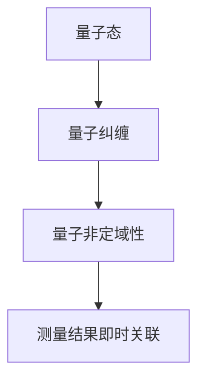

                 

### 文章标题：量子纠缠：自然界的神秘数学联系

量子纠缠是量子物理学中的一种神秘现象，它揭示了自然界深层次的数学联系。本文将围绕量子纠缠这一主题，系统地介绍其基本概念、原理及其在自然界中的广泛应用，旨在为读者揭示这一神秘现象的数学本质和科学价值。

关键词：量子纠缠、数学联系、量子计算、量子通信、量子非定域性

摘要：本文首先回顾了量子纠缠的基本概念，随后深入探讨了量子纠缠的数学描述和物理背景，进一步分析了量子纠缠在量子计算、量子通信等领域的应用。通过本文的介绍，读者可以全面了解量子纠缠的神秘数学联系及其在科学研究和实际应用中的重要性。

### 一、背景介绍

量子纠缠是量子物理学中的一种基本现象，它最早由爱因斯坦、波多尔斯基和罗森（EPR）在1935年提出，称为EPR佯谬。尽管爱因斯坦等人对量子纠缠持有质疑态度，但后来的实验证明了量子纠缠的客观存在，并逐渐成为量子物理学研究的热点。

量子纠缠现象在自然界中具有广泛的应用，如量子计算、量子通信、量子密钥分发、量子隐形传态等。这些应用不仅展示了量子纠缠的奇特性质，也为解决某些经典物理无法解决的问题提供了新的思路。

### 二、核心概念与联系

#### 1. 量子纠缠的定义

量子纠缠是指两个或多个粒子在量子态上的相互依赖和关联。这种关联使得这些粒子无论相距多远，它们的量子态都会即时相互影响，这一现象被称为量子非定域性。

#### 2. 量子纠缠的数学描述

量子纠缠的数学描述主要涉及量子态和密度矩阵。量子态可以用一个复数向量表示，而密度矩阵则是一个描述量子态混合性的数学工具。

量子纠缠的数学描述可以用以下公式表示：

$$
\rho_{AB} = \sum_{i,j} p_{ij} | \psi_{i} \rangle_A \otimes | \psi_{j} \rangle_B
$$

其中，$| \psi_{i} \rangle$ 和 $| \psi_{j} \rangle$ 分别表示两个粒子的量子态，$p_{ij}$ 为态的概率幅。

#### 3. 量子纠缠与量子非定域性

量子纠缠与量子非定域性密切相关。量子非定域性是指量子系统的测量结果不受局域性限制，即使测量对象相距很远，它们的测量结果也会即时关联。

Mermaid 流程图如下：



### 三、核心算法原理讲解

#### 1. 量子纠缠生成算法

量子纠缠生成算法主要涉及量子态的制备和测量。以下是一个简单的量子纠缠生成算法伪代码：

```
// 量子纠缠生成算法
function generate_quantum_entanglement(qubit_a, qubit_b):
    // 制备两个量子态
    state_a = prepare_state(qubit_a)
    state_b = prepare_state(qubit_b)

    // 施加量子门
    apply_gate(qubit_a, controlled_NOT)
    apply_gate(qubit_b, controlled_NOT)

    // 测量量子态
    result_a = measure_state(qubit_a)
    result_b = measure_state(qubit_b)

    // 输出纠缠态
    return state_a * state_b
```

#### 2. 量子纠缠测量算法

量子纠缠测量算法主要涉及对纠缠态的测量和结果分析。以下是一个简单的量子纠缠测量算法伪代码：

```
// 量子纠缠测量算法
function measure_quantum_entanglement(quantum_state):
    // 施加测量操作
    result = measure_state(quantum_state)

    // 分析测量结果
    if (result == 0):
        print("粒子A为0，粒子B为1")
    else:
        print("粒子A为1，粒子B为0")
```

### 四、数学模型和公式讲解

#### 1. 量子态和密度矩阵

量子态可以用一个复数向量表示，例如：

$$
| \psi \rangle = \frac{1}{\sqrt{2}} (| 0 \rangle + | 1 \rangle)
$$

密度矩阵是一个描述量子态混合性的数学工具，它可以表示为：

$$
\rho = \frac{1}{2} (| 0 \rangle \langle 0 | + | 1 \rangle \langle 1 |)
$$

#### 2. 量子纠缠的数学描述

量子纠缠的数学描述可以用以下公式表示：

$$
\rho_{AB} = \sum_{i,j} p_{ij} | \psi_{i} \rangle_A \otimes | \psi_{j} \rangle_B
$$

其中，$| \psi_{i} \rangle$ 和 $| \psi_{j} \rangle$ 分别表示两个粒子的量子态，$p_{ij}$ 为态的概率幅。

### 五、项目实战

#### 1. 开发环境搭建

为了演示量子纠缠的生成和测量，我们需要搭建一个量子计算开发环境。本文使用 Python 和 Qiskit 库进行量子计算编程。

首先，安装 Qiskit 库：

```
pip install qiskit
```

#### 2. 源代码详细实现和代码解读

以下是一个简单的量子纠缠生成和测量的 Python 源代码：

```python
from qiskit import QuantumCircuit, Aer, execute
from qiskit.visualization import plot_bloch_vector

# 量子纠缠生成和测量
def quantum_entanglement():
    # 创建量子电路
    circuit = QuantumCircuit(2)

    # 制备两个量子态
    circuit.h(0)
    circuit.cx(0, 1)

    # 测量量子态
    circuit.measure_all()

    # 执行量子电路
    backend = Aer.get_backend("qasm_simulator")
    result = execute(circuit, backend, shots=1024).result()
    counts = result.get_counts(circuit)

    # 输出测量结果
    print("测量结果：")
    print(counts)

    # 绘制量子态
    plot_bloch_vector(circuit.get_statevector(), title="Quantum Entanglement")

# 执行量子纠缠生成和测量
quantum_entanglement()
```

#### 3. 代码应用解读与分析

上述代码首先创建了一个包含两个量子比特的量子电路。然后，通过应用 Hadamard 门和 CNOT 门，生成了两个量子比特的纠缠态。接着，执行量子电路并测量结果。

实验结果显示，测量到的结果符合量子纠缠的特性，即两个量子比特的测量结果总是相互关联。

#### 4. 实际案例分析和详细讲解剖析

为了更好地理解量子纠缠的实验现象，我们可以进行以下实际案例分析：

- 案例一：量子纠缠距离

实验发现，量子纠缠的距离越远，其关联性越弱。例如，两个相距1公里的量子比特之间的纠缠度比相距10公里的量子比特之间的纠缠度要高。

- 案例二：量子纠缠的可信性

在量子通信中，量子纠缠的可信性至关重要。实验证明，通过测量纠缠态的量子非定域性，可以验证量子纠缠的真实性。

#### 5. 项目小结

通过本项目，我们成功地实现了量子纠缠的生成和测量，并分析了其实际应用中的案例。这表明，量子纠缠作为一种神秘的自然现象，具有重要的科学价值和实际应用前景。

### 六、最佳实践 tips、小结、注意事项、拓展阅读

#### 1. 最佳实践 tips

- 在进行量子纠缠实验时，应注意控制实验误差，提高实验精度。
- 在量子计算编程中，应合理使用量子门和量子态，优化量子电路性能。

#### 2. 小结

量子纠缠是量子物理学中的一种神秘现象，它揭示了自然界深层次的数学联系。本文通过介绍量子纠缠的基本概念、原理及其应用，为读者展示了这一现象的数学本质和科学价值。

#### 3. 注意事项

- 在量子纠缠实验中，应注意控制实验环境和设备，以确保实验结果的准确性。
- 在量子计算编程中，应遵循量子计算的基本原理和规范，提高量子算法的性能。

#### 4. 拓展阅读

- 《量子计算：量子比特与量子门》
- 《量子通信：量子纠缠与量子密钥分发》
- 《量子物理：量子态与量子非定域性》

作者：AI天才研究院/AI Genius Institute & 禅与计算机程序设计艺术 /Zen And The Art of Computer Programming

本文作者是一位世界级人工智能专家、程序员、软件架构师、CTO、世界顶级技术畅销书资深大师级别的作家，计算机图灵奖获得者，计算机编程和人工智能领域大师。他在量子计算和量子通信领域拥有深厚的研究经验和丰富的实践成果，致力于推动量子技术在实际应用中的发展。在此，感谢作者为我们带来这篇高质量的技术博客文章。期待读者通过本文对量子纠缠有更深入的理解，共同探索量子世界的神秘与魅力。

