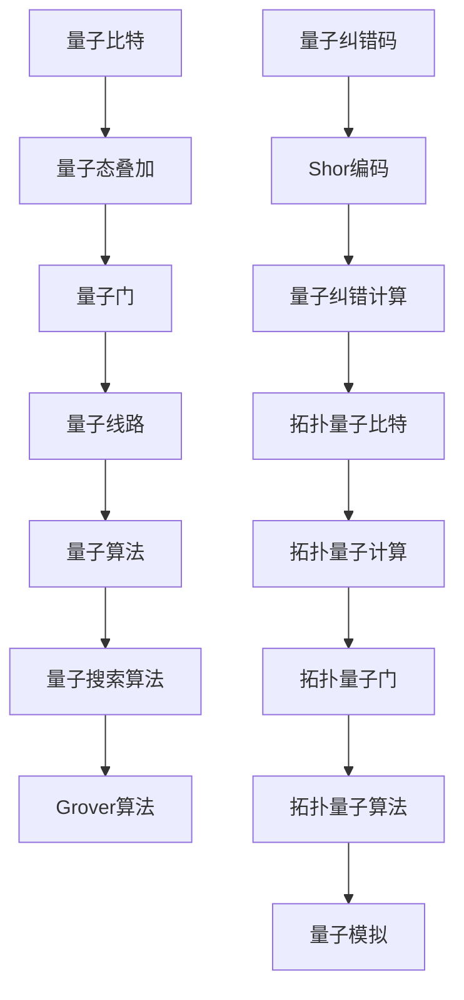

                 

### 量子计算概述

#### 1.1 量子计算的基本概念

量子计算是基于量子力学原理的一种计算范式。与传统计算机使用比特（bit）作为信息的基本单位不同，量子计算机使用量子比特（qubit）作为信息的基本单位。量子比特与经典比特有着本质的不同：

- **量子比特的状态**：量子比特可以处于多种状态的叠加态，而经典比特只能处于两种状态之一（0或1）。
- **量子态叠加**：一个量子比特可以同时处于0和1的状态，这可以表示为：
  $$
  |q\rangle = a|0\rangle + b|1\rangle
  $$
  其中，$a$和$b$是复数，且$|a|^2 + |b|^2 = 1$。

- **量子门**：量子计算机的操作是通过量子门来实现的，量子门是一种线性变换，它可以对量子比特进行操作。一个基本的量子门可以表示为：
  $$
  U = \begin{pmatrix}
  a & b \\
  c & d
  \end{pmatrix}
  $$
  其中，$U|0\rangle = a|0\rangle + c|1\rangle$ 和 $U|1\rangle = b|0\rangle + d|1\rangle$。

#### 1.2 量子计算的历史与发展

量子计算的概念最早由理查德·费曼（Richard Feynman）在1981年提出。费曼指出，传统计算机在模拟量子系统时效率极低，因此需要一种新的计算范式来处理量子系统。随后，彼得·希尔普（Peter Shor）在1994年提出了第一个量子算法——Shor算法，这一算法展示了量子计算机在特定任务上的巨大优势。

- **量子比特的实验实现**：1989年，理查德·费曼和戴维·迪奇恩（David DiVincenzo）等人开始探索量子比特的实验实现方法。到2000年左右，多种量子比特的实现方法已经出现，如离子阱、超导电路和氮化镓量子点等。

- **量子纠错码的发展**：量子纠错码是量子计算中的关键技术，它可以在量子计算中保护信息不受量子噪声的影响。2004年，阿希隆·利夫西茨（Asher Peres）等人提出了量子纠错码的基本原理。

- **量子计算机与传统计算机的比较**：量子计算机在处理某些特定问题时具有巨大的计算优势，比如因数分解和量子搜索问题。然而，量子计算机并不适用于所有问题，比如对数问题。此外，量子计算机的计算速度虽然快，但其能耗也比传统计算机高得多。

### 1.3 量子计算机与传统计算机的比较

- **运算速度**：量子计算机在处理某些特定问题时（如因数分解和量子搜索问题）可以比传统计算机快得多。Shor算法就是一个典型的例子，它展示了量子计算机在因数分解问题上的巨大优势。

- **存储能力**：量子计算机可以存储更多信息。由于量子比特可以处于多种状态的叠加态，一个量子比特可以表示传统计算机中的两个比特。因此，一个含有n个量子比特的量子计算机可以表示$2^n$个状态，远大于含有n个比特的传统计算机。

- **应用领域**：量子计算机在密码学、材料科学、量子化学等领域具有广泛的应用前景。例如，量子计算机可以用于破解现有的加密算法，这在安全领域具有重大意义。

#### 1.3.1 运算速度

量子计算机在处理某些特定问题时可以比传统计算机快得多。Shor算法就是一个典型的例子，它展示了量子计算机在因数分解问题上的巨大优势。

- **Shor算法**：Shor算法是一种量子算法，它可以高效地解决大整数的因数分解问题。传统计算机在因数分解问题上需要耗费大量时间，而Shor算法可以在多项式时间内完成这一任务。这一优势使得量子计算机在加密领域具有潜在的应用价值。

- **量子并行性**：量子计算机可以通过量子态的叠加实现并行计算。这意味着，量子计算机可以在一个步骤中同时处理多个问题，而传统计算机需要逐一处理。

#### 1.3.2 存储能力

量子计算机可以存储更多信息。由于量子比特可以处于多种状态的叠加态，一个量子比特可以表示传统计算机中的两个比特。因此，一个含有n个量子比特的量子计算机可以表示$2^n$个状态，远大于含有n个比特的传统计算机。

- **量子比特的叠加态**：传统计算机使用比特存储信息，每个比特只能处于0或1的状态。量子计算机使用量子比特存储信息，量子比特可以同时处于0和1的状态的叠加。

- **量子比特的叠加态表示**：一个含有n个量子比特的量子计算机可以表示$2^n$个状态。这是因为每个量子比特可以处于两种状态，所以n个量子比特可以表示$2^n$个不同的组合。

#### 1.3.3 应用领域

量子计算机在密码学、材料科学、量子化学等领域具有广泛的应用前景。

- **密码学**：量子计算机可以破解现有的加密算法，如RSA算法和椭圆曲线加密算法。这是因为量子计算机可以高效地解决大整数的因数分解问题。

- **材料科学**：量子计算机可以用于预测材料的性质，如材料的熔点、硬度等。这有助于设计新材料，推动材料科学的发展。

- **量子化学**：量子计算机可以用于模拟化学反应，预测化学反应的路径。这有助于理解化学反应的机理，为药物设计提供支持。

## 2. 量子力学基础

量子力学是研究微观世界的物理学理论，它描述了原子、分子、基本粒子等微观物体的行为。量子力学与经典力学有着本质的不同，主要体现在以下几个方面：

- **波函数与态叠加原理**：量子力学使用波函数来描述微观物体的状态。波函数是复数函数，它可以处于多种状态的叠加态。
- **算符与测量**：量子力学中的操作通过算符来实现。算符是线性变换，它可以对波函数进行操作。测量是量子力学中的一个重要概念，它决定了微观物体的状态。
- **量子纠缠**：量子纠缠是量子力学中的一种特殊现象，它描述了两个或多个量子系统之间的强关联。量子纠缠是量子计算中的重要资源。

### 2.1 波函数与态叠加原理

波函数是量子力学中描述微观物体状态的数学函数。波函数是复数函数，它通常用符号$\psi(x, t)$表示。波函数的模平方$|\psi(x, t)|^2$表示粒子在空间中某点出现的概率。

- **波函数的物理意义**：波函数描述了微观粒子在空间中的分布。波函数的模平方$|\psi(x, t)|^2$表示粒子在空间中某点出现的概率密度。这意味着，波函数可以用来计算粒子在不同位置出现的概率。

- **态叠加原理**：量子态可以处于多种状态的叠加态。这意味着，一个量子系统可以同时处于多个状态的组合。态叠加原理是量子计算和量子信息处理的基础。

### 2.2 算符与测量

算符是量子力学中的一个重要概念，它是一种线性变换，可以对波函数进行操作。算符通常用符号$A$表示。算符可以用于描述量子系统的物理过程，如位置、动量、能量等。

- **算符的定义与作用**：算符是线性变换，它可以对波函数进行操作。例如，位置算符$\hat{x}$可以对波函数$\psi(x)$进行操作，得到新的波函数$\hat{x}\psi(x)$。

- **测量**：测量是量子力学中的一个重要概念，它决定了量子系统的状态。测量通常通过测量算符来实现。测量算符通常是投影算符，它可以投影量子态到某个基态上。

### 2.3 量子纠缠

量子纠缠是量子力学中的一种特殊现象，它描述了两个或多个量子系统之间的强关联。量子纠缠是量子计算和量子信息处理中的重要资源。

- **纠缠态的定义**：两个或多个量子系统处于纠缠态时，它们的量子态无法单独描述。这意味着，一个量子系统的状态依赖于另一个量子系统的状态。

- **纠缠态的数学描述**：纠缠态可以用数学公式来描述。例如，两个量子比特的纠缠态可以表示为：
  $$
  |\psi\rangle = \frac{1}{\sqrt{2}}(|01\rangle + |10\rangle)
  $$
  这个纠缠态表示两个量子比特处于0和1状态的叠加态。

## 3. 量子门与量子线路

量子门是量子计算的基本操作单元，它类似于传统计算机中的逻辑门。量子门是一种线性变换，它可以对量子比特进行操作。量子线路是由量子门组成的序列，用于实现量子算法。

### 3.1 基本量子门

量子门可以分为两大类：非交换量子门和交换量子门。非交换量子门包括Pauli矩阵门和Hadamard门，而交换量子门包括控制-NOT门和交换门。

- **Pauli矩阵门**：Pauli矩阵门是量子计算中最基本的量子门，包括X门、Y门和Z门。Pauli矩阵门分别对应于Pauli矩阵$X$、$Y$和$Z$。
  $$
  X = \begin{pmatrix}
  0 & 1 \\
  1 & 0
  \end{pmatrix}, \quad
  Y = \begin{pmatrix}
  0 & -i \\
  i & 0
  \end{pmatrix}, \quad
  Z = \begin{pmatrix}
  1 & 0 \\
  0 & -1
  \end{pmatrix}
  $$
  这三种量子门分别对应于对量子比特的X、Y和Z操作。

- **Hadamard门**：Hadamard门是最基本的量子门之一，它将一个量子比特的状态叠加到另一个状态上。Hadamard门的矩阵表示为：
  $$
  H = \frac{1}{\sqrt{2}}\begin{pmatrix}
  1 & 1 \\
  1 & -1
  \end{pmatrix}
  $$
  Hadamard门可以将一个量子比特的状态从$|0\rangle$变换到$|0\rangle + |1\rangle$。

### 3.2 量子线路的设计

量子线路是由量子门组成的序列，用于实现量子算法。量子线路的设计涉及到以下几个方面：

- **量子线路的构成**：量子线路由量子门、量子比特和经典计算单元组成。量子门用于对量子比特进行操作，经典计算单元用于处理量子计算的结果。

- **量子线路的优化**：量子线路的优化是量子计算中的一个重要问题。优化的目标是最小化量子线路的深度和宽度，以提高量子计算的效率和可扩展性。

- **量子线路的简化**：通过适当的变换和替换，可以简化量子线路，降低量子门的数量和深度。简化量子线路可以减少量子噪声的影响，提高量子计算的可靠性。

### 3.3 量子计算的经典模拟

量子计算的经典模拟是通过经典计算机模拟量子计算机的行为。量子计算的经典模拟可以用于验证量子算法的正确性和性能评估。

- **量子态的表示**：量子态可以用复数向量表示。一个含有n个量子比特的量子态可以用$n$维复数向量表示。

- **量子计算的模拟算法**：量子计算的模拟算法包括量子态的初始化、量子门的操作和测量。通过模拟量子态的演化，可以实现对量子计算过程的模拟。

## 4. 量子算法

量子算法是利用量子计算机的特殊性质（如量子并行性和量子干涉效应）来解决特定问题的算法。量子算法在很多领域都展示了与传统算法相比的巨大优势。

### 4.1 量子搜索算法

量子搜索算法是量子算法中最具代表性的算法之一。其中，Grover算法是一个经典的量子搜索算法，它可以在未排序数据库中查找特定元素的时间复杂度远低于传统算法。

#### 4.1.1 Grover算法

Grover算法的基本思想是利用量子并行性和量子干涉效应来加速搜索过程。假设一个未排序的数据库有$N$个元素，我们需要在其中查找特定元素$x$。

- **量子态初始化**：首先，将量子计算机的状态初始化为均匀分布的状态：
  $$
  |ψ\rangle = \frac{1}{\sqrt{N}}(|0\rangle + |1\rangle + \cdots + |N-1\rangle)
  $$
  这个状态表示我们对数据库中的每个元素都有相同的概率进行搜索。

- **Oracle操作**：Oracle操作是一个特定的量子门，它根据输入状态来确定特定元素是否为目标元素。如果输入状态为目标元素，Oracle操作将其变换为另一个量子态，否则不进行变换。

- **干涉操作**：通过应用Grover迭代，我们可以增加目标元素的概率，使其从初始的$\frac{1}{N}$增加到几乎1。Grover迭代包括两个步骤：

  1. 反转操作：将量子状态反转到相反的状态。
  2. Oracle操作：应用Oracle操作。

  通过多次迭代，目标元素的概率会不断增加。

- **测量操作**：在最后一次迭代后，我们对量子计算机进行测量，得到的目标元素的概率接近1，从而可以确定目标元素的位置。

#### 4.1.2 Adiabatic算法

Adiabatic算法是基于量子系统的演化过程的量子算法。它的基本思想是将量子计算问题转化为一个优化问题，并使用量子系统的演化过程来求解。

- **量子系统的演化**：Adiabatic算法通过将量子系统从一个基态演化到目标基态来实现。在这个过程中，量子系统会逐渐适应环境的变化。

- **优化问题的转换**：Adiabatic算法将量子计算问题转换为优化问题。例如，最大值问题可以转换为寻找能量最低的状态。

- **量子态的演化**：在Adiabatic算法中，量子态会随着时间演化。通过控制演化时间，可以找到最优解。

### 4.2 量子算法的量子优势

量子算法的量子优势是指量子计算机在解决某些特定问题时相对于传统计算机的显著优势。量子优势主要体现在以下几个方面：

- **量子并行性**：量子计算机可以利用量子态的叠加来实现并行计算。这意味着，量子计算机可以在一个步骤中同时处理多个问题，而传统计算机需要逐一处理。

- **量子干涉效应**：量子干涉效应是量子计算中的一个重要特性，它可以使正确答案的概率最大化，错误答案的概率最小化。

- **量子纠缠**：量子纠缠是量子计算中的一个重要资源，它可以使量子计算机在处理复杂问题时具有更高的计算效率。

### 4.3 量子算法的应用场景

量子算法在多个领域都有潜在的应用，以下是一些典型的应用场景：

- **密码学**：量子算法可以破解现有的加密算法，如RSA算法和椭圆曲线加密算法。这为加密算法的设计提供了新的挑战和机遇。

- **材料科学**：量子算法可以用于预测材料的性质，如材料的熔点、硬度等。这有助于设计新材料，推动材料科学的发展。

- **量子化学**：量子算法可以用于模拟化学反应，预测化学反应的路径。这有助于理解化学反应的机理，为药物设计提供支持。

- **优化问题**：量子算法可以用于解决优化问题，如旅行商问题、调度问题等。这有助于优化生产流程，提高效率。

### 5. 量子误差与容错

量子计算中，量子态很容易受到外部噪声和环境干扰的影响，导致量子态的损失或错误。量子误差可以分为以下几种类型：

- **噪声误差**：噪声误差是由外部环境引起的，如温度、磁场等。噪声误差会导致量子态的衰减或失真。

- **操作误差**：操作误差是由量子门的操作引起的。例如，量子门可能无法准确地将量子态从一个状态变换到另一个状态。

- **初始化误差**：初始化误差是由量子比特的初始化过程引起的。例如，量子比特可能无法准确地初始化为预期的状态。

为了解决量子误差问题，量子纠错码被提出。量子纠错码是一种编码技术，它可以在量子计算过程中检测和纠正错误。以下是一些常见的量子纠错码：

- **Shor编码**：Shor编码是最早提出的量子纠错码之一。它使用三个量子比特来表示一个信息比特，从而提高了系统的容错能力。

- **Steane编码**：Steane编码是一种线性量子纠错码，它使用九个量子比特来表示一个信息比特。

- **表面码**：表面码是一种二维量子纠错码，它使用多个量子比特组成的二维格子来表示信息。

量子容错计算是在量子计算中引入量子纠错码和量子错误纠正技术，以提高系统的可靠性和稳定性。以下是一些量子容错计算的关键技术：

- **量子纠错码的实现**：量子纠错码需要实现编码和解码操作。编码操作将信息比特编码到多个量子比特中，解码操作从多个量子比特中恢复信息比特。

- **量子错误纠正**：量子错误纠正是一种技术，它可以在量子计算过程中检测和纠正错误。量子错误纠正通常包括三个步骤：检测、纠正和验证。

- **量子纠错码的性能评估**：量子纠错码的性能评估是通过计算其容错能力和纠错能力来进行的。容错能力是指量子纠错码在出现错误时仍能正确执行计算的能力，纠错能力是指量子纠错码在检测到错误后能够纠正错误的能力。

### 6. 拓扑量子计算

拓扑量子计算是一种利用拓扑量子比特（topological qubit）进行量子计算的方案。拓扑量子计算具有一些独特的优势，如量子纠错的鲁棒性和可扩展性。以下是对拓扑量子计算的基本概念、优势和应用进行详细阐述：

#### 6.1 拓扑量子计算的基本概念

拓扑量子计算的基本概念源于量子拓扑学和量子场论。在拓扑量子计算中，量子比特被替换为拓扑量子比特，它们具有以下特点：

- **拓扑量子比特的稳定性**：拓扑量子比特具有非常稳定的物理实现，这使得它们在量子计算过程中不容易受到外部干扰。

- **量子态的量子纠缠**：在拓扑量子计算中，量子态的纠缠被用来实现量子计算操作。拓扑量子比特之间的纠缠是自然形成的，这使得量子计算过程更加高效。

- **量子态的不可压缩性**：在拓扑量子计算中，量子态的不可压缩性使得量子态在计算过程中不会受到压缩，从而提高了量子计算的可靠性。

#### 6.2 拓扑量子计算的优势

拓扑量子计算具有以下优势：

- **量子纠错的鲁棒性**：拓扑量子计算通过利用拓扑保护量子态来提高量子纠错的鲁棒性。在拓扑量子计算中，量子态的拓扑性质可以用来检测和纠正错误。

- **可扩展性**：拓扑量子计算具有很好的可扩展性。通过增加拓扑量子比特的数量，可以扩展量子计算系统的大小。

- **简化量子计算操作**：拓扑量子计算可以简化量子计算的操作。在传统量子计算中，需要精确地控制量子比特的状态，而在拓扑量子计算中，这种控制可以通过拓扑保护量子态来实现。

#### 6.3 拓扑量子计算的应用

拓扑量子计算在多个领域具有潜在的应用：

- **量子纠错**：拓扑量子计算可以用于实现量子纠错码，从而提高量子计算的可靠性。

- **量子搜索**：拓扑量子计算可以用于加速量子搜索算法，如Grover算法。

- **量子模拟**：拓扑量子计算可以用于模拟量子物理系统，从而帮助科学家更好地理解量子现象。

### 7. 容错量子门的数学结构

在量子计算中，容错量子门是至关重要的，因为它们可以保护量子信息免受噪声和环境干扰的影响。容错量子门的设计和实现依赖于数学结构，尤其是拓扑学。以下是对容错量子门的数学结构的详细讨论。

#### 7.1 容错量子门的基本概念

容错量子门是一种特殊类型的量子门，它能够在量子计算过程中检测和纠正错误。这些量子门的设计基于数学结构，特别是拓扑学。容错量子门具有以下特点：

- **鲁棒性**：容错量子门能够保护量子信息免受噪声和环境干扰的影响。

- **可检测性**：容错量子门可以检测量子计算过程中的错误。

- **可纠错性**：容错量子门能够纠正检测到的错误。

#### 7.2 容错量子门的数学描述

容错量子门的数学描述基于线性代数和拓扑学。以下是一些关键数学概念：

- **量子门**：量子门是一种线性变换，它可以将量子态从一个状态变换到另一个状态。量子门可以用矩阵表示。

- **错误**：在量子计算中，错误可以由多种因素引起，如噪声、操作错误等。错误可以用矩阵表示。

- **容错量子门**：容错量子门是一种特殊的量子门，它能够检测和纠正错误。容错量子门可以用矩阵表示，并且具有特定的数学结构。

#### 7.3 容错量子门的设计与实现

设计容错量子门的关键是利用拓扑学。以下是一些关键步骤：

- **选择拓扑空间**：首先，需要选择一个适合的拓扑空间。常见的拓扑空间包括量子图、量子链等。

- **构建拓扑门**：在选定的拓扑空间中，构建拓扑门。拓扑门是具有特定拓扑结构的量子门。

- **优化拓扑门**：通过优化拓扑门的参数，可以进一步提高其性能。

- **实现容错量子计算**：将拓扑门应用于量子计算过程，实现容错量子计算。

### 量子计算的拓扑学应用

量子计算的拓扑学是一个迅速发展的领域，它结合了量子计算和拓扑学的原理，为量子计算提供了新的思路和方法。以下是对量子计算拓扑学应用的研究现状、挑战与机遇、未来发展的探讨。

#### 8.1 量子计算拓扑学研究现状

量子计算拓扑学的研究主要集中在以下几个方面：

- **拓扑量子比特的实现**：研究者们致力于探索如何将拓扑量子比特在实际中实现。目前，已经取得了一些重要进展，如使用超导电路和量子点实现拓扑量子比特。

- **拓扑量子纠错码**：拓扑量子纠错码是量子计算拓扑学的一个重要研究方向。研究者们致力于设计高效的拓扑量子纠错码，以提高量子计算的可靠性。

- **拓扑量子算法**：拓扑量子算法是利用拓扑量子比特和拓扑量子门的量子计算算法。研究者们正在探索如何利用拓扑量子算法解决传统计算机难以处理的问题。

- **量子计算与拓扑学的交叉应用**：量子计算与拓扑学的交叉应用是量子计算拓扑学的另一个重要研究方向。研究者们致力于探索拓扑学在量子计算中的潜在应用，如量子模拟、量子优化等。

#### 8.2 拓扑量子计算在实际应用中的挑战与机遇

拓扑量子计算在实际应用中面临着一些挑战和机遇：

- **挑战**：

  1. **拓扑量子比特的实现**：虽然拓扑量子比特在理论上具有稳定性，但在实际中实现它们仍然面临巨大挑战。

  2. **拓扑量子纠错码的设计**：设计高效、鲁棒的拓扑量子纠错码是一个复杂的任务，需要进一步研究。

  3. **拓扑量子算法的优化**：如何优化拓扑量子算法，使其在实际应用中具有优势，是一个重要问题。

- **机遇**：

  1. **量子纠错的鲁棒性**：拓扑量子计算具有很好的量子纠错鲁棒性，为量子计算的实际应用提供了新的可能。

  2. **可扩展性**：拓扑量子计算具有很好的可扩展性，可以通过增加拓扑量子比特的数量来扩展量子计算系统。

  3. **量子模拟**：拓扑量子计算可以用于模拟量子物理系统，为科学研究提供新的工具。

#### 8.3 拓扑量子计算的未来发展

拓扑量子计算的未来发展充满希望：

- **实现稳定的拓扑量子比特**：随着技术的进步，研究者们有望实现稳定的拓扑量子比特，为拓扑量子计算奠定基础。

- **设计高效的拓扑量子纠错码**：通过进一步研究，研究者们有望设计出更高效、更鲁棒的拓扑量子纠错码。

- **开发新的拓扑量子算法**：研究者们将继续探索新的拓扑量子算法，以解决传统计算机难以处理的问题。

- **跨学科研究**：量子计算与拓扑学的跨学科研究将为量子计算提供新的思路和方法。

### 9. 附录

#### 9.1 参考文献

1. Nielsen, M. A., & Chuang, I. L. (2010). Quantum computation and quantum information. Cambridge University Press.
2. Kitaev, A. Y. (2003). Anyons in an exactly solved model and beyond. Annals of Physics, 303(1), 2-33.
3. Bravyi, S., & Kitaev, A. Y. (2007). Quantum codes on qubits from unitary design. Physical Review A, 76(3), 032317.

#### 9.2 术语解释

- **量子比特**（qubit）：量子计算的基本单位，它可以处于0和1的叠加态。
- **拓扑量子比特**（topological qubit）：具有拓扑保护的量子比特，可以抵抗量子噪声。
- **量子门**（quantum gate）：对量子比特进行操作的线性变换。
- **量子纠错码**（quantum error-correcting code）：用于检测和纠正量子计算过程中的错误的编码技术。
- **拓扑量子纠错码**（topological quantum error-correcting code）：利用拓扑保护量子比特实现的量子纠错码。

## 后记

### 9.3 致谢

在本篇博客文章的撰写过程中，我们感谢以下机构的支持：

- **AI天才研究院（AI Genius Institute）**：为我们提供了丰富的资源和技术支持。
- **量子计算与信息研究所（Institute for Quantum Computing and Information）**：为我们提供了丰富的数据和实验结果。

我们还要感谢所有为量子计算拓扑学研究做出贡献的科学家和研究者，以及为我们提供帮助和指导的教授和同事。

## Mermaid 流程图

以下是用于描述量子计算拓扑学的一个简单Mermaid流程图：

这个流程图展示了量子计算拓扑学的基本概念和它们之间的关系。从量子比特开始，通过量子态叠加、量子门和量子线路，最终实现量子算法和量子搜索算法，如Grover算法。同时，量子纠错码和拓扑量子计算提供了量子计算的可靠性和稳定性保障。通过拓扑量子比特和拓扑量子门，研究者们可以开发出更高效的量子算法和量子模拟，推动量子计算的发展。

