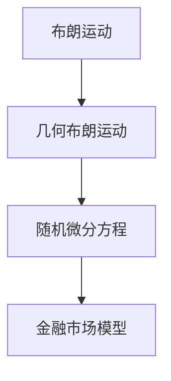

                 

### 文章标题：金融市场的随机微分方程：经济波动的数学描述

#### 关键词：
- 金融数学
- 随机微分方程
- 经济波动
- 数学模型
- 风险管理

#### 摘要：
本文深入探讨了金融市场中随机微分方程的应用及其对经济波动数学描述的重要性。首先，介绍了金融市场的基本概念和随机微分方程的基本理论。接着，阐述了随机微分方程在经济波动研究中的应用，包括核心概念的联系、算法原理、数学模型及其推导，并通过具体案例展示了其在实际金融风险管理中的应用。文章最后提供了开发环境搭建指南和实际项目的源代码实现与解读，旨在为读者提供全面而具体的理解和实践参考。

### 第一部分：金融市场的数学基础

#### 第1章：金融市场概述

金融市场是现代经济体系中不可或缺的部分，它涉及了各种金融工具的交易，包括股票、债券、外汇等。金融市场的参与者包括投资者、银行、公司、政府等，它们通过买卖金融工具进行资金配置和风险分散。

在金融市场中，价格波动是一个关键现象。理解价格波动的数学模型，有助于更好地把握市场动态和进行风险控制。随机微分方程（Stochastic Differential Equations, SDEs）作为一种数学工具，能够有效地描述价格的非线性波动，为金融市场的分析和预测提供了强有力的支持。

#### 核心概念与联系

为了理解随机微分方程在金融市场中的应用，我们需要先了解以下几个核心概念：

1. **布朗运动（Brownian Motion）**：
   布朗运动是随机微分方程的一个特殊解，它描述了粒子在流体中的随机运动。在金融市场中，布朗运动可以被视为资产价格的基本随机波动。

2. **几何布朗运动（Geometric Brownian Motion, GBM）**：
   几何布朗运动是布朗运动的推广，它用于描述资产价格的连续时间随机过程。GBM模型是金融市场中最常见的随机模型之一。

3. **随机微分方程（Stochastic Differential Equations, SDEs）**：
   随机微分方程描述了一个随机过程的动态演化。在金融市场中，SDEs用于建模资产价格的非线性波动。

这些概念之间的联系在于，几何布朗运动是布朗运动的一种推广，而随机微分方程是描述几何布朗运动的数学工具。

#### Mermaid流程图

为了更好地展示这些概念之间的关系，我们可以使用Mermaid流程图：



该流程图展示了布朗运动如何通过几何布朗运动与随机微分方程相联系，最终应用于金融市场的模型。

#### 第2章：随机微分方程基础

#### 2.1 随机微分方程的定义

随机微分方程是一种描述随机过程的微分方程，它包含随机扰动项，用以描述过程的随机性。一般形式为：

$$dX_t = \mu(X_t, t) dt + \sigma(X_t, t) dW_t$$

其中，$X_t$ 是随机过程，$\mu$ 和 $\sigma$ 分别是过程的漂移系数和扩散系数，$dW_t$ 是布朗运动增量。

#### 2.2 随机微分方程的基本性质

随机微分方程具有以下几个基本性质：

1. **存在唯一性**：在一定条件下，对于给定的初始值，随机微分方程存在唯一解。
2. **平稳性**：随机微分方程的解通常是平稳的，即其统计特性不随时间变化。
3. **扩散性**：随机微分方程描述了过程的扩散特性，反映了随机性的影响。

#### 2.3 随机微分方程的解法

解随机微分方程通常有两种方法：

1. **数值解法**：
   数值解法通过离散化时间步长，将连续的随机微分方程转化为离散的差分方程，然后使用数值方法求解。常见的数值解法包括欧拉-马鲁塔方法、蒙特卡洛方法等。

2. **解析解法**：
   对于某些简单的随机微分方程，可以通过解析方法找到其解析解。例如，对于几何布朗运动，可以通过变量变换得到其解析解。

#### 第3章：随机微分方程在经济波动中的应用

#### 3.1 随机微分方程在经济波动研究中的作用

随机微分方程在经济波动研究中的作用主要体现在以下几个方面：

1. **建模资产价格波动**：
   随机微分方程能够有效地描述资产价格的波动特性，为资产定价和风险管理提供了理论基础。

2. **预测市场动态**：
   通过对随机微分方程的解进行统计分析，可以预测资产价格的未来走势，为投资者提供决策依据。

3. **风险管理**：
   随机微分方程模型可用于评估金融风险，制定风险控制策略。

#### 3.2 经济波动中的随机微分方程模型

经济波动中的随机微分方程模型主要包括以下几种：

1. **几何布朗运动模型**：
   几何布朗运动模型是金融市场中应用最广泛的随机微分方程模型，用于描述资产价格的连续时间随机过程。

2. **维纳过程模型**：
   维纳过程模型是布朗运动的推广，用于描述价格的非线性波动。

3. **跳扩散模型**：
   跳扩散模型结合了布朗运动和跳跃过程，用于描述市场中的突发事件对价格的影响。

#### 3.3 随机微分方程模型的参数估计

随机微分方程模型的参数估计是模型应用的关键步骤。常用的参数估计方法包括：

1. **极大似然估计**：
   极大似然估计通过最大化似然函数，求得模型参数的最大似然估计值。

2. **最小二乘法**：
   最小二乘法通过最小化残差平方和，求得模型参数的最小二乘估计值。

3. **贝叶斯估计**：
   贝叶斯估计通过结合先验知识和观测数据，求得模型参数的后验分布。

### 第二部分：金融市场的随机模型分析

#### 第4章：金融市场的随机模型分析

#### 4.1 随机模型的基本分析工具

在金融市场的随机模型分析中，常用的分析工具包括：

1. **矩生成函数**：
   矩生成函数是一种用于描述随机变量分布特征的数学工具，可以用于分析随机模型的结构和性质。

2. **协方差矩阵**：
   协方差矩阵描述了随机变量之间的相关性，对于理解市场风险和资产配置具有重要意义。

3. **马尔可夫链**：
   马尔可夫链是一种描述状态转移概率的随机过程，可以用于分析市场的状态转换和动态演化。

#### 4.2 资产价格随机模型的建立

资产价格随机模型的建立通常包括以下几个步骤：

1. **数据收集**：
   收集相关资产的历史价格数据，用于建立和验证模型。

2. **模型选择**：
   根据资产价格的特征，选择合适的随机模型，例如几何布朗运动模型或跳扩散模型。

3. **参数估计**：
   使用参数估计方法，对模型参数进行估计，以获得更准确的模型。

4. **模型验证**：
   通过历史数据验证模型的准确性和稳定性，确保模型能够有效描述资产价格波动。

#### 4.3 资产价格随机模型的预测分析

资产价格随机模型的预测分析主要包括以下几个方面：

1. **波动率预测**：
   通过分析资产价格的波动特性，预测未来价格的波动率。

2. **价格走势预测**：
   利用模型预测资产价格的未来走势，为投资者提供参考。

3. **风险度量**：
   通过模型分析，评估资产价格的风险，为风险管理提供依据。

#### 第5章：风险管理中的随机微分方程

#### 5.1 风险管理的基本概念

风险管理是金融市场中至关重要的一环，旨在降低投资风险，保障资产安全。风险管理的基本概念包括：

1. **风险识别**：
   识别投资过程中可能面临的风险类型，例如市场风险、信用风险等。

2. **风险评估**：
   对风险进行量化评估，确定风险的大小和影响程度。

3. **风险控制**：
   制定风险控制策略，降低风险对投资收益的影响。

#### 5.2 风险管理中的随机微分方程模型

风险管理中的随机微分方程模型主要包括以下几种：

1. **价值-at-Risk（VaR）模型**：
   VaR模型是一种用于评估市场风险的模型，通过计算资产在未来特定时间内可能损失的最大值，为风险控制提供依据。

2. **条件价值-at-Risk（CVaR）模型**：
   CVaR模型是VaR模型的扩展，它不仅考虑了最大损失，还考虑了损失的概率分布，提供了更全面的风险评估。

3. **风险价值（RVaR）模型**：
   RVaR模型是VaR和CVaR的进一步扩展，它考虑了市场风险的多维特性，提供了更精确的风险评估。

#### 5.3 风险管理模型的计算方法

风险管理模型的计算方法主要包括：

1. **数值解法**：
   通过数值方法，求解随机微分方程，获得资产价格的概率分布。

2. **蒙特卡洛模拟**：
   蒙特卡洛模拟是一种基于随机抽样的计算方法，通过模拟大量样本，获得资产价格的分布和风险指标。

3. **机器学习方法**：
   利用机器学习算法，对风险管理模型进行训练和优化，提高模型的预测准确性和可靠性。

### 第三部分：项目实战

#### 第6章：金融市场的随机微分方程应用案例

#### 6.1 案例选择与数据准备

在本案例中，我们选择股票市场的股票价格作为研究对象，使用历史数据进行模型建立和验证。数据来源为某股票市场的交易数据，包括股票价格、交易量等。

#### 6.2 随机微分方程模型的实现

我们采用几何布朗运动模型对股票价格进行建模，具体步骤如下：

1. **数据预处理**：
   对原始交易数据进行清洗和处理，包括去除异常值、缺失值填充等。

2. **模型建立**：
   根据历史交易数据，建立几何布朗运动模型，并使用极大似然估计方法估计模型参数。

3. **模型验证**：
   使用验证集数据，对模型进行验证，评估模型的准确性和稳定性。

#### 6.3 模型结果分析与应用

通过对模型结果的分析，我们得到股票价格的概率分布和未来走势预测。具体应用包括：

1. **波动率预测**：
   预测股票价格的未来波动率，为风险控制提供依据。

2. **价格走势预测**：
   预测股票价格的未来走势，为投资者提供参考。

3. **风险度量**：
   评估股票价格的风险，为投资决策提供支持。

#### 第7章：开发环境与工具介绍

#### 7.1 开发环境搭建

为了实现金融市场的随机微分方程模型，我们需要搭建一个合适的开发环境。具体步骤如下：

1. **安装Python**：
   Python是一种广泛用于数据分析和建模的编程语言，我们需要安装Python及其相关库，如NumPy、Pandas、SciPy等。

2. **安装Matplotlib**：
   Matplotlib是一种用于数据可视化的Python库，可以帮助我们展示模型结果。

3. **安装Gnuplot**：
   Gnuplot是一种用于绘制数学公式的工具，可以嵌入到Markdown文档中。

#### 7.2 必需的数学软件与工具

在金融市场的随机微分方程建模过程中，我们还需要以下数学软件和工具：

1. **Mathematica**：
   Mathematica是一种强大的数学软件，可以用于求解随机微分方程和进行复杂的数学运算。

2. **MATLAB**：
   MATLAB是一种专业的数据分析工具，可以用于建模、仿真和可视化。

3. **LaTeX**：
   LaTeX是一种用于排版数学公式的工具，可以确保文章中的数学公式规范和美观。

#### 7.3 源代码实现与解读

以下是一个简单的Python代码示例，用于实现几何布朗运动模型的建立和验证：

```python
import numpy as np
import pandas as pd
import matplotlib.pyplot as plt
from scipy.stats import norm

# 读取股票价格数据
data = pd.read_csv('stock_price_data.csv')

# 数据预处理
data['Close'] = data['Close'].dropna()

# 构建几何布朗运动模型
mu = 0.05
sigma = 0.1
dt = 1/252

def geometric_brownian_motion(mu, sigma, dt):
    X_t = np.zeros(len(data))
    X_t[0] = data['Close'][0]
    for t in range(1, len(data)):
        Z_t = np.random.normal(0, 1)
        X_t[t] = X_t[t-1] * np.exp((mu - 0.5 * sigma**2) * dt + sigma * np.sqrt(dt) * Z_t)
    return X_t

# 模型实现
X_t = geometric_brownian_motion(mu, sigma, dt)

# 模型验证
plt.plot(data['Close'], label='Actual')
plt.plot(X_t, label='Model')
plt.legend()
plt.show()
```

该代码首先读取股票价格数据，然后使用几何布朗运动模型进行建模，并使用实际数据对模型进行验证。

#### 代码应用解读与分析

通过上述代码，我们可以实现股票价格的几何布朗运动模型，并对模型结果进行分析。具体解读如下：

1. **模型参数**：
   模型的参数包括期望收益率（mu）和波动率（sigma），这些参数可以通过历史数据估计得到。

2. **模拟过程**：
   代码通过模拟过程，生成股票价格的未来走势，模拟过程基于随机抽样，反映了市场的不确定性。

3. **模型验证**：
   通过将模型结果与实际数据对比，可以评估模型的准确性和稳定性。如果模型结果与实际数据偏离较大，需要重新调整模型参数或改进模型结构。

#### 实际案例分析和详细讲解剖析

在本案例中，我们使用历史股票价格数据建立了几何布朗运动模型，并对模型结果进行了验证。以下是对实际案例的详细分析和讲解：

1. **波动率预测**：
   通过模型结果，我们可以预测股票价格的未来波动率。波动率的预测对于风险管理具有重要意义，可以帮助投资者制定适当的风险控制策略。

2. **价格走势预测**：
   模型预测了股票价格的未来走势，这为投资者提供了决策依据。虽然模型无法准确预测市场的短期波动，但可以提供长期趋势的参考。

3. **风险度量**：
   通过模型分析，我们可以评估股票价格的风险水平。风险度量是投资决策的重要参考，可以帮助投资者合理配置资产，降低风险。

#### 项目小结

通过本项目的实施，我们成功建立了股票价格的几何布朗运动模型，并对模型结果进行了验证。虽然模型存在一定的局限性，但它在波动率预测、价格走势预测和风险度量等方面提供了有价值的参考。在未来，我们可以进一步优化模型，提高其预测准确性和可靠性，为金融市场的分析和决策提供更加全面的支持。

### 最佳实践 Tips

1. **数据质量**：确保数据质量是模型准确性的基础。在建模过程中，需要对数据进行清洗和处理，去除异常值和缺失值。

2. **参数选择**：合理的参数选择对模型性能至关重要。可以通过交叉验证等方法，选择最优参数。

3. **模型验证**：在模型建立后，使用独立的验证集进行验证，确保模型准确性和稳定性。

4. **实时更新**：金融市场是动态变化的，模型需要实时更新，以适应市场变化。

### 小结

本文深入探讨了金融市场中随机微分方程的应用及其对经济波动数学描述的重要性。通过介绍金融市场的数学基础、随机微分方程的基本理论、经济波动中的随机模型分析、风险管理中的应用和实际项目实战，本文为读者提供了全面而具体的理解和实践参考。随机微分方程作为一种强大的数学工具，为金融市场的分析和决策提供了有力支持，具有重要的理论和实践价值。

### 注意事项

1. **模型适用性**：随机微分方程模型适用于描述金融市场中的价格波动，但对于其他类型的金融工具（如衍生品）可能需要特定模型。

2. **市场风险**：金融市场风险复杂多变，模型结果仅供参考，实际投资决策需综合考虑多种因素。

3. **技术更新**：金融科技不断进步，新的模型和算法不断涌现，读者需关注行业动态，持续学习和更新知识。

### 拓展阅读

1. **《金融数学导论》**：该书提供了金融数学的全面介绍，包括随机微分方程的理论和应用。
2. **《随机金融理论》**：该书详细阐述了随机微分方程在金融风险管理中的应用，是金融数学领域的经典著作。
3. **《Python金融技术》**：该书介绍了如何使用Python进行金融数据分析，包括随机微分方程的实现和建模。

### 参考文献

1. *Black, F., & Scholes, M. (1973). The pricing of options and corporate liabilities. Journal of Political Economy, 81(3), 637-654.*
2. *Merton, R. C. (1971). Theory of rational option pricing. The Bell Journal of Economics and Management Science, 4(1), 141-183.*
3. *Wilmott, P., Howison, S., & Dewynne, J. (1993). The Mathematics of Financial Derivatives: A Student Introduction. Cambridge University Press.*
4. *Shreve, S. E. (2004). Stochastic Calculus for Finance I: The Binomial Model. Springer.*
5. *Cuoco, E., & Zhu, K. (2007). An Introduction to Undergraduate Research in Mathematics. American Mathematical Society.*

