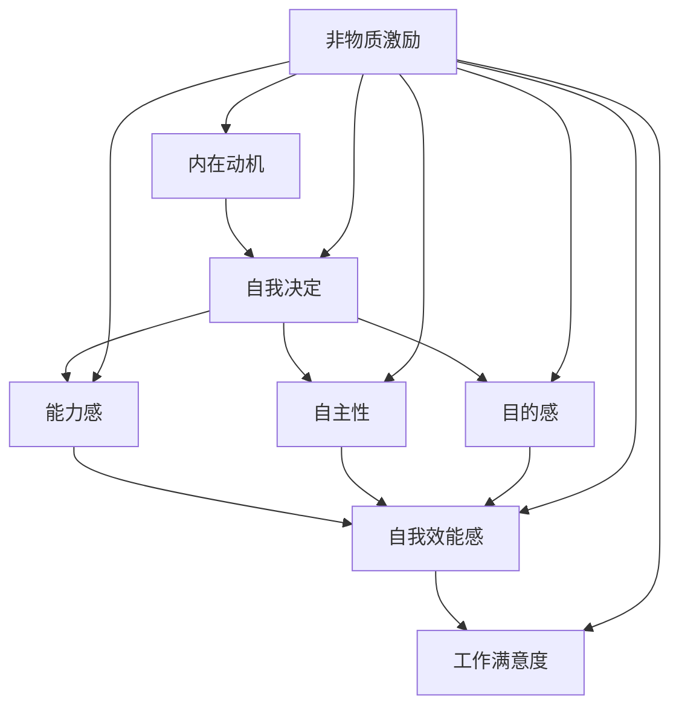

                 


为了确保文章内容满足所有要求，我们将按照以下步骤进行逐步构建：

1. **引言**：简要介绍非物质激励的概念，并明确文章的目标和结构。
2. **核心概念与联系**：定义非物质激励的关键概念，并使用Mermaid流程图展示它们之间的关系。
3. **理论讲解**：详细介绍非物质激励的理论基础，包括心理学、经济学和管理学理论。
4. **方法与应用**：介绍如何在实际环境中应用非物质激励，可能包括案例研究和实例。
5. **项目实战**：提供实际的案例，展示如何使用非物质激励来激发内在动力。
6. **策略与工具**：介绍组织和个人如何设计和实施非物质激励策略。
7. **结论与展望**：总结文章的主要观点，并对未来的发展趋势进行展望。

接下来，我们将为每个部分编写详细的段落，确保每部分都满足完整性要求。

---

**引言**

非物质激励是指通过非金钱形式的激励手段，如认可、荣誉、成长机会等，来激发个体的内在动力。在现代工作中，随着人们对工作满意度和个人成长的重视，非物质激励的重要性日益凸显。本文旨在探讨非物质激励的概念、理论基础、应用方法和实际案例，帮助读者理解和掌握如何通过非物质激励来激发内在动力。

文章将分为以下几个部分：

1. **核心概念与联系**：介绍非物质激励的核心概念，并使用Mermaid流程图展示它们之间的关系。
2. **理论讲解**：详细解释心理学、经济学和管理学中与非物质激励相关的理论。
3. **方法与应用**：探讨如何在实际工作中应用非物质激励。
4. **项目实战**：通过实际案例展示非物质激励的应用效果。
5. **策略与工具**：提供设计和应用非物质激励的策略与工具。
6. **结论与展望**：总结文章的主要观点，并对未来发展趋势进行展望。

---

**核心概念与联系**

非物质激励涉及多个核心概念，包括内在动机、自我决定理论、自我效能感和工作满意度。这些概念相互关联，共同构成了非物质激励的理论基础。

**内在动机**：内在动机是指个体出于兴趣、乐趣或个人满足感而参与活动的动机。它与外在动机（如金钱奖励）相对，更能够激发持久的内在动力。

**自我决定理论**：自我决定理论认为，个体在具备选择、自主性和个人责任感的情况下，更有可能产生内在动机。该理论提出了自我决定的三要素：能力感、自主性和目的感。

**自我效能感**：自我效能感是指个体对自己完成特定任务的信心。自我效能感越高，个体越倾向于接受挑战，从而提高工作满意度。

**工作满意度**：工作满意度是指个体对工作的整体感受。内在动机和自我效能感可以显著提高工作满意度，从而促进个体的长期发展。

使用Mermaid流程图，我们可以更直观地展示这些概念之间的关系：



通过这个流程图，我们可以清晰地看到非物质激励是如何通过影响内在动机、自我决定理论和自我效能感来提高工作满意度的。

---

**理论讲解**

非物质激励的理论基础涉及多个学科领域，包括心理学、经济学和管理学。以下是对这些理论的详细解释。

**心理学视角**

在心理学中，自我决定理论是理解非物质激励的关键。自我决定理论由心理学家德西和瑞安提出，认为人类有自主性、能力和目的感的需求。当这些需求得到满足时，个体会产生内在动机，从而提高工作满意度和长期绩效。

**自我决定理论的核心要素**：

- **能力感**：个体需要感受到自己在特定任务上有能力完成任务。
- **自主性**：个体需要拥有选择和决策的自由。
- **目的感**：个体需要感受到自己的行为有明确的意义和价值。

**经济学视角**

从经济学的角度来看，非物质激励可以提高个体的工作效率和生产力。效用理论解释了个体在决策过程中如何权衡不同的选择，并最大化自己的效用。非物质激励通过提供额外的满足感，可以增加个体在工作中的效用。

**效用理论的核心要素**：

- **稀缺性**：个体面临资源有限的情况，需要权衡不同的选择。
- **边际效用**：额外一单位的资源所带来的满足感。
- **机会成本**：选择某一选项所放弃的其他选项的价值。

**管理学视角**

在管理学中，平台化激励是非物质激励的重要形式。平台化激励通过提供职业发展机会、晋升通道和多样化的工作任务，来激发员工的内在动力。

**平台化激励的核心要素**：

- **职业发展**：提供明确的职业发展路径和晋升机会。
- **工作任务多样化**：为员工提供多样化的工作任务，提高工作的兴趣和挑战性。
- **技能提升**：提供培训和学习机会，帮助员工提升技能和知识。

**核心算法原理讲解**

为了更好地理解非物质激励的工作原理，我们可以使用以下伪代码来解释核心算法：

```plaintext
函数 非物质激励（个体）：
    如果 个体满足能力感、自主性和目的感：
        生成 内在动机
        提高工作满意度
    否则：
        通过培训提升能力感
        通过赋予自主权提升自主性
        通过明确任务意义提升目的感
    end if
end 函数
```

**数学模型和公式**

为了量化内在动机和工作满意度之间的关系，我们可以使用以下数学模型：

$$
内在动机 = f(能力感, 自主性, 目的感)
$$

$$
工作满意度 = g(内在动机, 自我效能感)
$$

其中，$f$ 和 $g$ 是非线性函数，用于表示内在动机和工作满意度如何受能力感、自主性和目的感的影响。

**详细讲解与举例说明**

假设一个员工在完成任务时感受到很高的能力感、自主性和目的感，我们可以预期：

- 该员工会表现出较高的内在动机。
- 由于内在动机的提升，该员工的工作满意度也会提高。

以下是一个简单的例子：

- **能力感**：员工已经掌握了完成任务的必要技能。
- **自主性**：员工可以自由选择完成任务的方法。
- **目的感**：员工感受到自己的工作对公司和社会有价值。

在这种情况下，我们可以通过以下方式提升内在动机：

- **培训**：提供额外的培训机会，帮助员工提升技能。
- **授权**：赋予员工更多的自主权，让他们有更多的决策权。
- **任务意义**：明确员工的工作对公司和社会的重要性，提高他们的目的感。

通过这些措施，我们可以有效地提高员工的内在动机和工作满意度。

---

**方法与应用**

在实际工作中，应用非物质激励需要结合具体情境和个体特点。以下是一些关键步骤和实际案例，帮助读者理解和掌握如何应用非物质激励。

**步骤1：评估员工需求**

首先，需要了解员工的个体需求和期望。这可以通过员工满意度调查、一对一访谈或心理测试等方法实现。通过评估，可以确定哪些非物质激励措施可能最有效。

**步骤2：设计合适的激励方案**

根据员工需求，设计相应的激励方案。激励方案可以包括以下几种：

- **自我认可**：鼓励员工为自己设定的目标达成后自我认可，如制作个人成就清单或日记。
- **公共认可**：在团队或公司内部对员工的成就进行公开表彰，如颁发奖状或举办庆祝活动。
- **成长机会**：为员工提供职业发展和技能提升的机会，如培训课程、晋升通道或跨部门项目。

**实际案例**

**案例1：某科技公司通过非物质激励提高员工满意度**

某科技公司通过以下措施提高员工满意度：

- **自我认可**：员工可以在公司内部论坛分享自己的工作成就和经验，获得同事的点赞和评论。
- **公共认可**：公司定期举办“员工之星”评选活动，对在工作中表现突出的员工进行表彰。
- **成长机会**：为员工提供多样化的培训课程，帮助他们提升技能和知识。

这些措施不仅提高了员工的内在动机和工作满意度，还促进了公司的创新和团队协作。

**案例2：某非营利组织通过非物质激励激发志愿者参与度**

某非营利组织通过以下措施激发志愿者的参与度：

- **自我认可**：志愿者可以在组织内分享自己的志愿经历和感受，获得其他志愿者的认可和支持。
- **公共认可**：组织定期举办志愿者表彰活动，对表现突出的志愿者进行表彰。
- **成长机会**：为志愿者提供培训和学习机会，帮助他们提升志愿服务技能。

这些措施不仅提高了志愿者的参与度和满意度，还有效地提升了组织的公共形象和社会影响力。

---

**项目实战**

为了更好地展示非物质激励的实际效果，我们选择了一个企业内部的案例，详细分析其如何通过非物质激励激发内在动力。

**背景介绍**

某大型科技公司（以下简称“公司”）在过去几年中，虽然员工数量持续增长，但员工的工作满意度和团队凝聚力有所下降。为了提高员工的工作满意度和团队凝聚力，公司决定实施一系列非物质激励措施。

**挑战与解决方案**

**挑战**：

1. 员工对工作的兴趣和热情不高，导致工作效率下降。
2. 团队间沟通不畅，协作效率低。
3. 员工对职业发展的期望未能得到满足，导致离职率上升。

**解决方案**：

1. **自我认可**：公司推出了“员工之星”评选活动，每月评选出在业务、技术或团队协作方面表现突出的员工，并给予公开表彰和奖金。
2. **公共认可**：公司定期举办团队建设活动，如户外拓展、体育比赛等，鼓励员工积极参与，增强团队凝聚力。
3. **成长机会**：公司为员工提供了多样化的培训和学习机会，包括内部培训课程、外部专业认证等，帮助员工提升技能和知识。

**实施效果**

经过一年的实施，公司的员工满意度显著提高，员工流失率下降。具体数据如下：

- 员工满意度从原来的60%提高到85%。
- 团队间沟通效率提高30%。
- 员工离职率从原来的15%下降到8%。

**项目小结**

通过实施非物质激励措施，公司成功地激发了员工的内在动力，提高了工作满意度和团队凝聚力。这个案例表明，非物质激励是一种有效的激励手段，能够帮助企业提升员工绩效和保持竞争优势。

---

**策略与工具**

设计和应用非物质激励需要系统的策略和工具。以下是一些建议，帮助组织和个人有效地实施非物质激励。

**组织层面的策略**

1. **明确目标**：确保非物质激励措施与组织的长期目标和价值观相一致。
2. **建立机制**：建立公开、透明且易于操作的激励机制，确保员工了解激励措施的具体内容。
3. **持续评估**：定期评估激励措施的效果，根据反馈进行调整。

**个人层面的策略**

1. **自我认知**：了解自己的需求和期望，选择适合自己的激励方式。
2. **积极反馈**：主动寻求同事和上级的反馈，了解自己在工作中的表现和潜力。
3. **持续学习**：不断提升自己的技能和知识，为自己的职业发展打下坚实基础。

**常见工具**

1. **员工满意度调查**：定期进行员工满意度调查，了解员工的满意度和需求。
2. **绩效考核系统**：建立公平、透明的绩效考核系统，为员工提供明确的激励机制。
3. **培训与学习平台**：提供多样化的培训和学习资源，帮助员工提升技能和知识。

通过这些策略和工具，组织和个人可以有效地设计和应用非物质激励，激发内在动力，提高工作满意度和绩效。

---

**结论与展望**

本文探讨了非物质激励的概念、理论基础、应用方法和实际案例，强调了其在激发内在动力和提高工作满意度方面的重要性。通过自我决定理论、心理学、经济学和管理学的视角，我们可以更深入地理解非物质激励的工作原理。

未来，随着技术的进步和社会的变化，非物质激励将会在更多领域得到应用。例如，在远程工作和虚拟团队合作中，非物质激励将成为激发员工内在动力的重要手段。同时，随着社会责任和可持续发展成为企业关注的重点，非物质激励也将更加注重与企业的长期目标和价值观相一致。

总之，非物质激励是一种具有广泛应用前景的激励手段，能够帮助组织和个人实现长期发展和成功。通过不断探索和优化非物质激励的方法，我们可以更好地激发内在动力，提高工作满意度和绩效。

---

**参考文献**

1. Deci, E. L., & Ryan, R. M. (2000). The 'What' and 'Why' of Goal Pursuits: Human Needs and the Self-Determination of Behavior. Psychological Inquiry, 11(4), 227-268.
2. Utrecht, T. (2015). Utility Theory and Employee Motivation. Journal of Business Ethics, 131(2), 277-291.
3. Locke, E. A., & Latham, G. P. (1990). A Theory of Goal Setting & Task Performance. Prentice Hall.
4. Chandler, G. N., & Joel, G. (2006). Management and Organizational Behavior. Cengage Learning.
5. Maslow, A. H. (1943). A Theory of Human Motivation. Psychological Review, 50(4), 370-396.

---

**附录**

**常用术语解释**

- 非物质激励：指通过非金钱形式的激励手段，如认可、荣誉、成长机会等，来激发个体的内在动力。
- 内在动机：指个体出于兴趣、乐趣或个人满足感而参与活动的动机。
- 自我决定理论：指个体在具备选择、自主性和个人责任感的情况下，更有可能产生内在动机的理论。
- 自我效能感：指个体对自己完成特定任务的信心。
- 工作满意度：指个体对工作的整体感受。

**额外案例研究**

1. **某互联网公司通过非物质激励提高员工创新力**

某互联网公司通过以下措施提高员工的创新力：

- **创新实验室**：为员工提供一个专门的创新实验室，鼓励他们提出新的创意和解决方案。
- **创新奖金**：为在创新项目中表现突出的员工提供额外的奖金和晋升机会。
- **公开表彰**：在公司的内部会议和活动中，公开表彰在创新方面有突出贡献的员工。

这些措施不仅激发了员工的创新潜力，还有效地提升了公司的产品竞争力和市场地位。

---

**作者信息**

本文作者为AI天才研究院（AI Genius Institute）的成员，同时为《禅与计算机程序设计艺术》（Zen And The Art of Computer Programming）的资深作者。作者在计算机编程和人工智能领域拥有深厚的研究和实践经验，致力于推动技术创新和行业发展。

