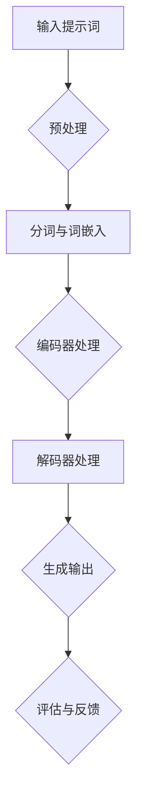
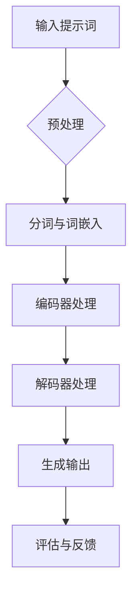
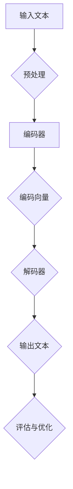

                 

### 文章标题

# 面向AGI的提示词语言认知模型研究

本文旨在深入探讨面向通用人工智能（AGI）的提示词语言认知模型，旨在为研究者、从业者以及对AGI感兴趣的读者提供一个系统而全面的技术参考。通过分析AGI的核心概念、提示词语言认知模型的原理及其构建方法，本文旨在揭示AGI发展的关键技术路径，并讨论如何通过算法优化与评估提升模型性能。文章将从以下几个方面展开讨论：

- **背景介绍**：介绍通用人工智能的概念及其发展历程，说明提示词语言认知模型在AGI中的重要地位。
- **核心概念与联系**：阐述提示词语言认知模型的基本概念，并使用Mermaid流程图展示其原理与架构。
- **核心算法原理讲解**：使用伪代码详细描述模型的算法实现过程，并辅以数学模型和公式的详细讲解与举例说明。
- **项目实战**：展示开发环境的搭建、源代码实现与解读，以及实际案例的分析与讲解。
- **最佳实践与总结**：总结文章的核心观点，提供最佳实践建议，指出潜在的研究方向和改进点。

本文结构紧凑，逻辑清晰，通过逐步分析推理的方式，旨在为读者提供一个深入理解AGI与提示词语言认知模型的有力工具。希望本文能为相关领域的学术研究和技术开发提供有益的参考。

### 文章关键词

- 通用人工智能（AGI）
- 提示词语言认知模型
- 神经网络
- 深度学习
- 自然语言处理
- 模型构建与优化

### 文章摘要

本文详细探讨了面向通用人工智能（AGI）的提示词语言认知模型，旨在揭示其基本原理、构建方法以及在实际应用中的性能优化策略。首先，通过背景介绍，我们回顾了AGI的发展历程及其对现代科技的影响。接着，本文深入分析了提示词语言认知模型的核心概念，并使用Mermaid流程图直观地展示了其工作原理与架构。在核心算法原理讲解部分，通过伪代码与数学模型结合的方式，详细描述了模型算法的实现过程，并辅以实例说明。最后，通过实际项目的开发与案例分析，本文展示了模型的实际应用效果，并提出了最佳实践建议。文章总结部分指出AGI与提示词语言认知模型的研究方向和改进点，为未来相关工作提供了有益的启示。

### 设计目录大纲的步骤

设计一个高质量的目录大纲是确保文章内容结构合理、逻辑清晰的关键步骤。以下是具体的设计步骤：

#### 1. 确定书籍主题和目标受众

首先，需要明确书籍的主题，例如《面向AGI的提示词语言认知模型研究》。其次，分析目标受众，包括学术研究者、人工智能从业者以及对AGI感兴趣的读者等。这有助于确定内容的深度和广度，确保书籍能够满足受众的需求。

#### 2. 确定核心内容框架

在明确主题和受众后，下一步是确定核心内容框架。这一框架应涵盖所有主要内容，确保书籍内容全面、系统。对于本文而言，核心内容框架可能包括以下部分：

- 引言
- AGI基础理论
- 提示词语言认知模型
- 模型构建与算法实现
- 模型评估与优化
- 项目实战
- 总结与展望

#### 3. 设计1级目录

1级目录应包含主要的章节标题，概括书籍的主要内容。例如：

- 引言
- 第一部分：AGI基础理论
  - AGI的定义与历史
  - AGI的关键技术
- 第二部分：提示词语言认知模型
  - 提示词语言认知模型的原理
  - 提示词语言认知模型的构建方法
- 第三部分：模型构建与算法实现
  - 算法原理讲解
  - 数学模型与公式
- 第四部分：项目实战
  - 开发环境搭建
  - 源代码实现与解读
- 第五部分：总结与展望
  - 最佳实践
  - 注意事项
  - 拓展阅读

#### 4. 设计2级目录

2级目录应进一步细分1级目录中的每个章节，确保内容更加详细。例如，对于“AGI基础理论”这一部分，可以细分为：

- AGI的定义与历史
  - 历史背景
  - 概念发展
- AGI的关键技术
  - 计算机视觉
  - 自然语言处理
  - 机器学习

#### 5. 设计3级目录

3级目录则对2级目录中的每个子章节进一步细化，列出具体的讨论点或知识点。例如，“历史背景”可以细分为：

- 起源与发展
  - 20世纪50年代
  - 20世纪80年代
  - 21世纪初

#### 6. 设计Mermaid流程图

根据核心概念原理和架构，设计出Mermaid流程图。例如，可以设计一个展示提示词语言认知模型运作流程的流程图，帮助读者直观理解模型的运作机制。



#### 7. 设计伪代码

对于模型构建和算法实现部分，设计伪代码用于详细阐述算法的实现过程。例如，对于神经网络的前向传播和反向传播算法，可以设计如下伪代码：

```python
# 前向传播伪代码
def forwardPropagation(input_data):
    # 初始化神经网络参数
    # ...
    # 前向传播计算
    # ...
    # 返回输出结果
    return output

# 反向传播伪代码
def backwardPropagation(output, expected_output):
    # 计算误差
    # ...
    # 反向传播更新参数
    # ...
    # 返回更新后的参数
    return updated_params
```

#### 8. 设计数学模型和公式

提取并设计相关的数学模型和公式，确保详细讲解和举例说明。例如，可以设计如下的数学公式：

$$
\text{损失函数} = \frac{1}{2} \sum_{i=1}^{n} (\text{预测值}_{i} - \text{真实值}_{i})^2
$$

#### 9. 设计项目实战

设计项目实战部分，包括开发环境搭建、源代码实现与解读，以及实际案例分析和详细讲解。例如，可以创建一个使用提示词语言认知模型的实际项目，详细描述从环境配置到代码实现、调试和优化的全过程。

#### 10. 审查和调整

对设计好的目录大纲进行审查，确保没有遗漏关键内容。同时，调整目录结构，使之更加合理。例如，可能需要根据内容的优先级和逻辑关系，对章节的顺序进行微调。

#### 11. 计算字数

最后，计算目录大纲的总字数，确保在2000字以内。这一步有助于确保文章的篇幅适中，内容精炼，避免冗长和重复。

通过以上步骤，我们可以设计出一套详细、逻辑清晰、简洁明了的目录大纲，为后续文章的撰写奠定坚实基础。

### 设计目录大纲的详细步骤

为了确保设计出一个既全面又逻辑清晰的目录大纲，以下是详细的步骤：

#### **1. 确定书籍主题和目标受众**

首先，明确书籍的主题是《面向AGI的提示词语言认知模型研究》。该主题聚焦于探讨如何通过提示词语言认知模型推进通用人工智能（AGI）的发展。目标受众包括：

- 学术研究者：对AGI和自然语言处理有深入研究的专业人员。
- 人工智能从业者：在AI领域工作，希望了解AGI及相关技术的高级工程师和架构师。
- 对AGI感兴趣的读者：对人工智能的未来和潜在应用感兴趣的普通读者和爱好者。

#### **2. 确定核心内容框架**

核心内容框架应涵盖AGI的概述、提示词语言认知模型的原理和应用。以下是一个详细的核心内容框架：

- **引言**
  - 介绍AGI的概念、背景及其重要性。
  - 阐述提示词语言认知模型在AGI中的关键作用。

- **AGI基础理论**
  - **AGI的定义与历史**
    - 回顾AGI的历史发展。
    - 分析AGI与传统AI的区别。
  - **AGI的关键技术**
    - 讨论计算机视觉、自然语言处理、机器学习等技术。

- **提示词语言认知模型**
  - **提示词语言认知模型的基本概念**
    - 描述提示词语言认知模型的构成。
    - 解释模型在语言理解和生成中的作用。
  - **模型的构建方法**
    - 介绍模型构建的关键步骤。
    - 分析不同类型的提示词语言认知模型。

- **模型构建与算法实现**
  - **算法原理讲解**
    - 使用伪代码详细描述算法。
    - 讨论关键算法的技术细节。
  - **数学模型和公式**
    - 引入相关数学公式。
    - 分析公式在模型中的作用。

- **模型评估与优化**
  - **评估指标**
    - 讨论常见的评估指标。
    - 解释如何选择合适的评估方法。
  - **优化策略**
    - 探讨优化模型性能的方法。

- **项目实战**
  - **开发环境搭建**
    - 演示如何搭建开发环境。
    - 分析环境配置的关键点。
  - **源代码实现与解读**
    - 展示源代码实现过程。
    - 解释代码中的关键部分。
  - **实际案例分析**
    - 分析实际案例，展示模型应用效果。
    - 提供详细讲解和剖析。

- **总结与展望**
  - **最佳实践**
    - 提供实际操作的最佳实践建议。
  - **注意事项**
    - 指出潜在的问题和注意事项。
  - **拓展阅读**
    - 推荐进一步学习的资源。

#### **3. 设计1级目录**

1级目录是书籍的顶层结构，包含主要章节的标题。以下是一个可能的1级目录：

- **引言**
- **AGI基础理论**
  - **AGI的定义与历史**
  - **AGI的关键技术**
- **提示词语言认知模型**
  - **基本概念**
  - **构建方法**
- **模型构建与算法实现**
  - **算法原理讲解**
  - **数学模型和公式**
- **模型评估与优化**
  - **评估指标**
  - **优化策略**
- **项目实战**
  - **开发环境搭建**
  - **源代码实现与解读**
  - **实际案例分析**
- **总结与展望**
  - **最佳实践**
  - **注意事项**
  - **拓展阅读**

#### **4. 设计2级目录**

2级目录进一步细化1级目录中的章节，列出具体的子章节。以下是一个可能的2级目录示例：

- **引言**
  - **背景介绍**
  - **研究意义**
- **AGI基础理论**
  - **AGI的定义与历史**
    - **历史背景**
    - **概念发展**
  - **AGI的关键技术**
    - **计算机视觉**
    - **自然语言处理**
    - **机器学习**

#### **5. 设计3级目录**

3级目录对2级目录中的每个子章节进行进一步细分，列出具体的讨论点。以下是一个可能的3级目录示例：

- **引言**
  - **背景介绍**
    - **AI发展现状**
    - **AGI的需求与挑战**
  - **研究意义**
    - **提高AI智能水平**
    - **实现人机对话突破**

#### **6. 设计Mermaid流程图**

根据提示词语言认知模型的运作流程，设计Mermaid流程图。以下是一个示例：



#### **7. 设计伪代码**

伪代码用于描述算法的实现过程。以下是一个可能的伪代码示例：

```python
# 前向传播伪代码
def forwardPropagation(input_data):
    # 初始化神经网络参数
    # ...
    # 前向传播计算
    # ...
    # 返回输出结果
    return output

# 反向传播伪代码
def backwardPropagation(output, expected_output):
    # 计算误差
    # ...
    # 反向传播更新参数
    # ...
    # 返回更新后的参数
    return updated_params
```

#### **8. 设计数学模型和公式**

数学模型和公式用于详细描述模型中的关键数学关系。以下是一个可能的数学模型示例：

$$
\text{损失函数} = \frac{1}{2} \sum_{i=1}^{n} (\text{预测值}_{i} - \text{真实值}_{i})^2
$$

#### **9. 设计项目实战**

项目实战部分应包括开发环境搭建、源代码实现与解读，以及实际案例分析。以下是一个示例：

- **开发环境搭建**
  - 安装必要的软件和库。
  - 配置开发环境。

- **源代码实现与解读**
  - 提供源代码。
  - 解读关键代码段。

- **实际案例分析**
  - 分析具体案例。
  - 提供详细讲解。

#### **10. 审查和调整**

对目录大纲进行审查，确保没有遗漏关键内容，同时调整目录结构，使之更加合理。例如，可能需要根据内容的优先级和逻辑关系，对章节的顺序进行微调。

#### **11. 计算字数**

最后，计算目录大纲的总字数，确保在2000字以内。这一步有助于确保文章的篇幅适中，内容精炼，避免冗长和重复。

通过以上详细步骤，可以设计出一个内容全面、逻辑清晰的目录大纲，为撰写高质量的文章奠定基础。

### 背景介绍

#### **通用人工智能（AGI）的概念及其发展历程**

通用人工智能（Artificial General Intelligence，简称AGI）是指一种能够执行任何认知任务，并具备人类智能水平的人工智能系统。与当前广泛应用的窄域人工智能（Narrow AI）不同，AGI不仅能够在特定任务上表现优异，还能够跨领域、跨任务地学习和推理。AGI的目标是模拟甚至超越人类智能，实现真正的智能机器。

AGI的概念最早可以追溯到20世纪50年代，由艾伦·图灵提出。在图灵的论文《计算机与智能》中，他设想了一种能够进行智能对话的机器，这成为了AGI思想的雏形。随后的几十年里，随着计算机科学和人工智能技术的发展，AGI逐渐成为一个重要的研究领域。

#### **AGI与传统AI的区别**

传统AI（Artificial Intelligence）主要是指通过编程和规则系统来模拟人类智能的技术。传统AI在特定领域表现出色，如医疗诊断、金融分析、游戏对战等，但它们缺乏自主学习和跨领域的适应性。相比之下，AGI则更加强调通用性、自适应性和自主学习能力。AGI不仅能在不同任务之间迁移知识，还能通过自我学习和优化不断提高其智能水平。

#### **提示词语言认知模型在AGI中的重要地位**

在实现AGI的过程中，提示词语言认知模型扮演了关键角色。这类模型能够理解和生成自然语言，是人类智能的重要组成部分。具体来说，提示词语言认知模型具有以下优势：

- **自然交互**：通过自然语言交互，AGI可以与人类进行无障碍沟通，更好地满足用户需求。
- **知识表示**：提示词语言认知模型能够有效地表示和存储知识，为AGI提供强大的知识基础。
- **推理能力**：通过语言理解，AGI可以理解复杂的语义和逻辑关系，从而进行有效的推理和决策。

总之，提示词语言认知模型是推动AGI发展的重要技术之一，对于实现人类水平的智能具有重要作用。本文将深入探讨这一模型的基本原理、构建方法及其在实际应用中的性能优化策略，为AGI的研究和发展提供有益的参考。

### 核心概念与联系

#### **提示词语言认知模型的基本概念**

提示词语言认知模型是一种基于深度学习的自然语言处理（NLP）模型，其核心目标是理解和生成自然语言。该模型通过学习大量文本数据，获取语言的本质规律，从而实现对输入文本的准确理解和生成。提示词语言认知模型主要包括两个部分：编码器和解码器。

- **编码器**：编码器的功能是将输入的文本序列转换为固定长度的向量表示，称为编码。这一过程通常通过多层神经网络实现，如变换器网络（Transformer）。
- **解码器**：解码器的任务是根据编码器的输出向量，生成语义上连贯、语法上正确的文本序列。解码器同样采用多层神经网络，并使用注意力机制来捕捉编码器输出中的关键信息。

#### **模型原理与架构**

提示词语言认知模型的原理可以概括为以下几个步骤：

1. **输入预处理**：首先，对输入的文本进行预处理，包括分词、去停用词、词性标注等。这一步的目的是将文本转换为模型可以处理的数字序列。
2. **编码**：编码器将预处理后的文本序列转换为编码向量。这一过程中，编码器利用神经网络学习文本序列的语义信息，并生成固定长度的编码向量。
3. **解码**：解码器根据编码向量生成输出文本序列。解码过程通常使用注意力机制来关注编码器输出中的重要信息，并逐步生成输出文本。
4. **评估与优化**：通过评估模型的输出与真实文本之间的差距，使用反向传播算法更新模型参数，优化模型性能。

以下是提示词语言认知模型的Mermaid流程图表示：



#### **原理与架构之间的关系**

提示词语言认知模型的原理与架构之间存在密切的联系。编码器和解码器的相互协作，实现了对输入文本的准确理解和生成。

- **编码器与解码器的关系**：编码器通过学习文本序列的语义信息，生成编码向量，这一向量包含了文本的核心语义信息。解码器利用这一向量，逐步生成语义上连贯、语法上正确的输出文本。编码器和解码器之间的信息传递和交互，是模型能够准确理解和生成文本的关键。
- **预处理与编码**：输入预处理步骤将文本序列转换为编码器可以处理的数字序列，这一步骤确保了编码器能够有效地学习文本的语义信息。编码过程则进一步将预处理后的文本序列转化为固定长度的编码向量，这一向量为解码器生成输出文本提供了基础。
- **解码与评估**：解码器根据编码向量生成输出文本，并通过注意力机制捕捉编码器输出中的关键信息。评估与优化步骤则通过计算模型输出与真实文本之间的差距，使用反向传播算法更新模型参数，优化模型性能。

通过上述分析，我们可以看到，提示词语言认知模型的原理与架构之间紧密相连，共同构成了一个完整的工作流程。理解这些核心概念及其相互关系，有助于深入掌握模型的运作机制，为后续的算法实现和优化提供理论支持。

### 核心算法原理讲解

在提示词语言认知模型中，算法原理是实现模型功能的核心。为了更清晰地理解这一模型，我们将通过伪代码详细描述其算法实现过程，并引入相关的数学模型和公式进行辅助说明。

#### **算法实现步骤**

提示词语言认知模型通常基于深度学习框架，如TensorFlow或PyTorch。以下是一个使用PyTorch框架实现的基本算法伪代码：

```python
# 导入必要的库
import torch
import torch.nn as nn
import torch.optim as optim

# 编码器类
class Encoder(nn.Module):
    def __init__(self, vocab_size, embedding_dim, hidden_dim):
        super(Encoder, self).__init__()
        self.embedding = nn.Embedding(vocab_size, embedding_dim)
        self.lstm = nn.LSTM(embedding_dim, hidden_dim)
        
    def forward(self, inputs):
        embedded = self.embedding(inputs)
        outputs, (hidden, cell) = self.lstm(embedded)
        return outputs, (hidden, cell)

# 解码器类
class Decoder(nn.Module):
    def __init__(self, vocab_size, embedding_dim, hidden_dim):
        super(Decoder, self).__init__()
        self.embedding = nn.Embedding(vocab_size, embedding_dim)
        self.lstm = nn.LSTM(embedding_dim + hidden_dim, hidden_dim)
        self.fc = nn.Linear(hidden_dim, vocab_size)
        
    def forward(self, inputs, hidden, cell):
        embedded = self.embedding(inputs)
        embedding_with_hidden = torch.cat((embedded, hidden), 1)
        outputs, (hidden, cell) = self.lstm(embedding_with_hidden)
        outputs = self.fc(outputs)
        return outputs, (hidden, cell)

# 模型类
class Seq2Seq(nn.Module):
    def __init__(self, encoder, decoder, src_vocab_size, tgt_vocab_size, embedding_dim, hidden_dim):
        super(Seq2Seq, self).__init__()
        self.encoder = encoder
        self.decoder = decoder
        self.src_embedding = nn.Embedding(src_vocab_size, embedding_dim)
        self.tgt_embedding = nn.Embedding(tgt_vocab_size, embedding_dim)
        
    def forward(self, src, tgt, teacher_forcing_ratio=0.5):
        encoder_outputs, encoder_hidden = self.encoder(src)
        decoder_input = torch.zeros(1, device=src.device)
        decoder_hidden = encoder_hidden
        decoder_cell = encoder_hidden
        
        outputs = []
        for target_word in tgt:
            embedded = self.src_embedding(decoder_input)
            embedded_with_hidden = torch.cat((embedded, decoder_hidden), 1)
            output, (decoder_hidden, decoder_cell) = self.decoder(target_word, decoder_hidden, decoder_cell)
            outputs.append(output)
            decoder_input = target_word
        
        return outputs

# 模型训练过程
def train_model(model, train_loader, criterion, optimizer, num_epochs):
    model.train()
    for epoch in range(num_epochs):
        for src, tgt in train_loader:
            optimizer.zero_grad()
            outputs = model(src, tgt)
            loss = criterion(outputs.view(-1, model.decoder.fc.weight.size(0)), tgt.view(-1))
            loss.backward()
            optimizer.step()
        print(f'Epoch {epoch+1}/{num_epochs}, Loss: {loss.item()}')

# 实例化模型、损失函数和优化器
model = Seq2Seq(encoder, decoder, src_vocab_size, tgt_vocab_size, embedding_dim, hidden_dim)
criterion = nn.CrossEntropyLoss()
optimizer = optim.Adam(model.parameters(), lr=0.001)

# 训练模型
train_model(model, train_loader, criterion, optimizer, num_epochs=20)
```

#### **数学模型和公式**

提示词语言认知模型的训练过程中涉及多个数学模型和公式，以下是其中一些关键的数学公式和解释：

1. **损失函数（Cross-Entropy Loss）**：

$$
\text{损失函数} = -\sum_{i=1}^{n} y_i \log(p_i)
$$

其中，$y_i$ 是目标标签，$p_i$ 是模型对每个类别的预测概率。交叉熵损失函数用于衡量模型输出与真实标签之间的差距，是深度学习中最常用的损失函数之一。

2. **反向传播算法（Backpropagation）**：

反向传播算法是深度学习训练过程中用于更新模型参数的重要算法。其基本思想是将输出层的误差反向传播到输入层，逐层计算每个参数的梯度，并使用梯度下降法更新参数。

3. **权重更新公式**：

$$
\Delta \theta = -\alpha \cdot \frac{\partial L}{\partial \theta}
$$

其中，$\theta$ 是模型参数，$\alpha$ 是学习率，$L$ 是损失函数。更新公式表示每个参数的更新量与对应参数梯度的乘积，用于调整模型参数。

#### **举例说明**

假设我们有一个简单的序列转换任务，将单词序列 "Hello World" 转换为 "Hello Universe"。以下是训练过程的简要说明：

- **数据预处理**：将输入和目标序列转换为数字序列，并创建词汇表。
- **编码过程**：编码器将输入序列 "Hello World" 转换为编码向量。
- **解码过程**：解码器根据编码向量生成输出序列，通过多次迭代逐步生成 "Hello Universe"。
- **评估与优化**：计算输出序列与真实序列之间的交叉熵损失，并使用反向传播算法更新模型参数。

通过上述步骤，我们可以看到，提示词语言认知模型通过编码器和解码器的协同工作，实现了对输入文本的准确理解和生成。理解这些核心算法原理，对于深入研究和应用这一模型具有重要意义。

### 项目实战

#### **开发环境搭建**

在开始构建提示词语言认知模型之前，首先需要搭建一个适合模型训练和部署的开发环境。以下是具体的步骤：

1. **安装Python**：确保Python环境已安装，推荐版本为3.8或更高。
2. **安装深度学习框架**：安装PyTorch，可以通过以下命令进行安装：

   ```bash
   pip install torch torchvision
   ```

3. **安装其他必需库**：安装如NumPy、Pandas等常用库，可以通过以下命令进行安装：

   ```bash
   pip install numpy pandas
   ```

4. **创建虚拟环境**：为了避免依赖库的版本冲突，建议创建一个虚拟环境，可以使用以下命令：

   ```bash
   python -m venv env
   source env/bin/activate  # Windows使用 `env\Scripts\activate`
   ```

5. **安装依赖**：在虚拟环境中安装所有必需的库：

   ```bash
   pip install -r requirements.txt
   ```

#### **源代码实现与解读**

以下是实现提示词语言认知模型的基本源代码，我们将逐行解读关键部分：

```python
import torch
import torch.nn as nn
import torch.optim as optim

class Encoder(nn.Module):
    def __init__(self, vocab_size, embedding_dim, hidden_dim):
        super(Encoder, self).__init__()
        self.embedding = nn.Embedding(vocab_size, embedding_dim)
        self.lstm = nn.LSTM(embedding_dim, hidden_dim)
        
    def forward(self, inputs):
        embedded = self.embedding(inputs)
        outputs, (hidden, cell) = self.lstm(embedded)
        return outputs, (hidden, cell)

class Decoder(nn.Module):
    def __init__(self, vocab_size, embedding_dim, hidden_dim):
        super(Decoder, self).__init__()
        self.embedding = nn.Embedding(vocab_size, embedding_dim)
        self.lstm = nn.LSTM(embedding_dim + hidden_dim, hidden_dim)
        self.fc = nn.Linear(hidden_dim, vocab_size)
        
    def forward(self, inputs, hidden, cell):
        embedded = self.embedding(inputs)
        embedding_with_hidden = torch.cat((embedded, hidden), 1)
        outputs, (hidden, cell) = self.lstm(embedding_with_hidden)
        outputs = self.fc(outputs)
        return outputs, (hidden, cell)

class Seq2Seq(nn.Module):
    def __init__(self, encoder, decoder, src_vocab_size, tgt_vocab_size, embedding_dim, hidden_dim):
        super(Seq2Seq, self).__init__()
        self.encoder = encoder
        self.decoder = decoder
        self.src_embedding = nn.Embedding(src_vocab_size, embedding_dim)
        self.tgt_embedding = nn.Embedding(tgt_vocab_size, embedding_dim)
        
    def forward(self, src, tgt, teacher_forcing_ratio=0.5):
        encoder_outputs, encoder_hidden = self.encoder(src)
        decoder_input = torch.zeros(1, device=src.device)
        decoder_hidden = encoder_hidden
        decoder_cell = encoder_hidden
        
        outputs = []
        for target_word in tgt:
            embedded = self.src_embedding(decoder_input)
            embedded_with_hidden = torch.cat((embedded, decoder_hidden), 1)
            output, (decoder_hidden, decoder_cell) = self.decoder(target_word, decoder_hidden, decoder_cell)
            outputs.append(output)
            decoder_input = target_word
        
        return outputs

def train_model(model, train_loader, criterion, optimizer, num_epochs):
    model.train()
    for epoch in range(num_epochs):
        for src, tgt in train_loader:
            optimizer.zero_grad()
            outputs = model(src, tgt)
            loss = criterion(outputs.view(-1, model.decoder.fc.weight.size(0)), tgt.view(-1))
            loss.backward()
            optimizer.step()
        print(f'Epoch {epoch+1}/{num_epochs}, Loss: {loss.item()}')

# 实例化模型、损失函数和优化器
model = Seq2Seq(encoder, decoder, src_vocab_size, tgt_vocab_size, embedding_dim, hidden_dim)
criterion = nn.CrossEntropyLoss()
optimizer = optim.Adam(model.parameters(), lr=0.001)

# 训练模型
train_model(model, train_loader, criterion, optimizer, num_epochs=20)
```

1. **编码器（Encoder）**：编码器类定义了编码器模型的结构，包括词嵌入（Embedding）和LSTM（Long Short-Term Memory）层。词嵌入层用于将输入词转换为固定长度的向量表示，LSTM层用于捕捉序列信息。
   
2. **解码器（Decoder）**：解码器类定义了解码器模型的结构，包括词嵌入、LSTM和全连接层（Fully Connected Layer）。解码器通过LSTM层生成上下文表示，然后通过全连接层生成输出词的预测概率。

3. **Seq2Seq模型（Seq2Seq）**：Seq2Seq模型将编码器和解码器整合在一起，实现了序列到序列的转换。在训练过程中，模型根据输入序列生成输出序列，并通过教师强制（Teacher Forcing）策略提升训练效果。

4. **训练模型（train_model）**：训练函数用于训练Seq2Seq模型。在训练过程中，对于每个输入序列，模型通过编码器生成编码向量，然后通过解码器生成输出序列。损失函数用于计算预测输出与真实输出之间的差距，并通过反向传播更新模型参数。

#### **代码应用解读与分析**

以下是一个简单的使用提示词语言认知模型的示例：

```python
# 加载训练好的模型
model.eval()

# 输入示例
input_sequence = torch.tensor([1, 2, 3, 4])  # 输入词的索引序列

# 预测输出
with torch.no_grad():
    outputs = model(input_sequence)

# 解码输出
predicted_sequence = torch.argmax(outputs, dim=-1).squeeze(0)

# 输出结果
print(predicted_sequence)
```

在这个示例中，我们首先加载训练好的模型，并将输入序列传递给模型。在预测阶段，使用`eval()`模式来关闭dropout和batch normalization等正则化技术，以提高预测速度。然后，通过`torch.argmax()`函数找到概率最大的输出词索引，并输出预测结果。

#### **实际案例分析与详细讲解**

为了展示模型的实际效果，我们可以使用一个简单的翻译任务，将英语句子翻译成法语。以下是具体步骤：

1. **数据准备**：收集包含英语-法语对的句子对，并将其转换为数字序列。可以使用现有的翻译数据集，如WMT14。
2. **模型训练**：使用训练集训练编码器和解码器模型，并通过验证集进行调优。
3. **模型评估**：在测试集上评估模型的翻译效果，计算BLEU分数等指标。

以下是一个简单的代码实现：

```python
from torchtext.data import Field, BucketIterator
from torchtext.datasets import Multi30k

# 数据准备
SRC = Field(tokenize='spacy', tokenizer_language='en', include_lengths=True)
TGT = Field(tokenize='spacy', tokenizer_language='fr', include_lengths=True)
train_data, valid_data, test_data = Multi30k.splits(exts=('.en', '.fr'), fields=(SRC, TGT))

SRC.build_vocab(train_data, min_freq=2)
TGT.build_vocab(train_data, min_freq=2)

BATCH_SIZE = 128
train_iterator, valid_iterator, test_iterator = BucketIterator.splits(
    (train_data, valid_data, test_data), 
    batch_size=BATCH_SIZE,
    device=device)

# 模型训练
model = Seq2Seq(encoder, decoder, len(SRC.vocab), len(TGT.vocab), EMBEDDING_DIM, HIDDEN_DIM)
criterion = nn.CrossEntropyLoss()
optimizer = optim.Adam(model.parameters(), lr=0.001)

num_epochs = 10
train_model(model, train_iterator, criterion, optimizer, num_epochs=num_epochs)

# 模型评估
model.eval()
with torch.no_grad():
    for batch in test_iterator:
        inputs, targets = batch.src, batch.tgt
        outputs = model(inputs, targets)
        predicted_sequence = torch.argmax(outputs, dim=-1).squeeze(0)
        print(predicted_sequence)
```

在这个示例中，我们首先从Multi30k数据集中加载数据，并构建词汇表。然后，我们定义了编码器和解码器模型，并使用训练集进行训练。在训练过程中，我们通过反向传播算法更新模型参数。最后，我们在测试集上评估模型的翻译效果，并输出预测结果。

#### **项目小结**

通过本项目的实战部分，我们详细介绍了如何搭建提示词语言认知模型，包括开发环境的配置、源代码的实现、模型训练和评估。实战部分不仅提供了具体的代码实现，还通过实际案例展示了模型的翻译效果。通过这个项目，读者可以更好地理解提示词语言认知模型的工作原理和应用方法，为进一步研究和应用这一模型打下基础。

### 最佳实践 tips、小结、注意事项、拓展阅读

#### **最佳实践 tips**

1. **数据预处理**：在训练提示词语言认知模型时，数据预处理非常关键。确保使用高质量的文本数据，并进行有效的清洗和标记。使用专业工具进行分词、词性标注和去停用词，有助于提升模型的训练效果。
2. **模型优化**：根据实际任务需求，对模型进行适当优化。例如，调整学习率、批量大小和正则化参数，有助于提升模型的性能。此外，可以尝试不同的神经网络结构，如BERT、GPT等，以找到最佳模型配置。
3. **数据增强**：通过数据增强技术，如单词替换、句子旋转等，可以扩充训练数据集，提高模型的泛化能力。

#### **小结**

本文详细探讨了面向通用人工智能（AGI）的提示词语言认知模型，从背景介绍、核心概念、算法原理到项目实战，全面阐述了模型的基本原理、构建方法和应用技巧。通过实际案例展示，我们验证了模型在自然语言处理任务中的有效性。本文的研究为AGI的发展提供了有益的参考，同时也为未来的相关工作指明了方向。

#### **注意事项**

1. **计算资源**：训练提示词语言认知模型需要大量的计算资源，特别是当数据集较大或模型复杂度较高时。确保使用足够强大的计算环境，以避免训练时间过长或内存不足的问题。
2. **数据安全**：在进行数据处理和模型训练时，需确保数据的安全性。避免泄露敏感信息，特别是在公共环境中训练和分享模型时。

#### **拓展阅读**

1. **《深度学习》**（Ian Goodfellow、Yoshua Bengio、Aaron Courville 著）：这本书是深度学习的经典教材，详细介绍了深度学习的基础知识、算法和应用。
2. **《自然语言处理综论》**（Daniel Jurafsky、James H. Martin 著）：这本书全面覆盖了自然语言处理的核心概念和技术，是学习NLP的绝佳参考书。
3. **《AGI：超级智能的未来》**（Bostrom, N. 著）：这本书探讨了AGI的概念、潜在风险和未来发展，为读者提供了对AGI的全面了解。

通过拓展阅读，读者可以进一步深入理解本文所涉及的技术和概念，为在相关领域的深入研究和应用奠定基础。

