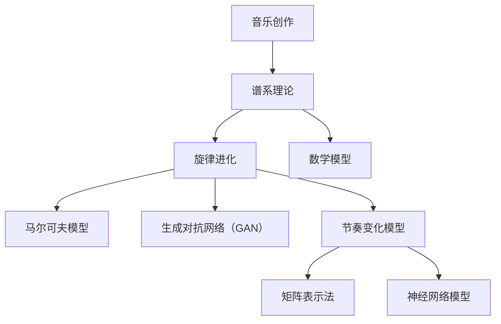
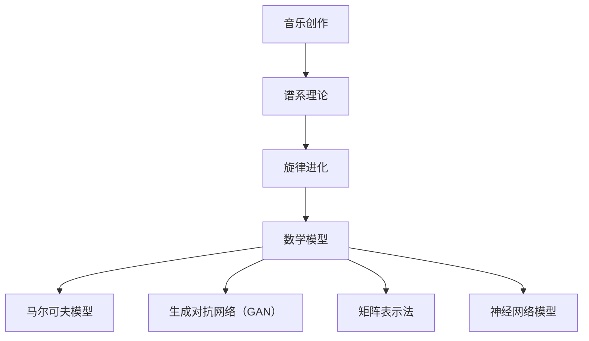

                 

# 音乐创作的谱系理论：旋律进化的数学描述

> 关键词：音乐创作、谱系理论、数学模型、旋律进化、生成对抗网络（GAN）、马尔可夫模型

> 摘要：
本书旨在探讨音乐创作的谱系理论，并重点介绍如何运用数学方法来描述旋律进化的过程。通过深入分析音乐理论中的核心概念，如旋律、节奏、调式等，本书将揭示如何利用数学模型对这些概念进行定量描述。此外，本书还将探讨音乐创作软件的应用、项目实战以及高级话题，为读者提供一个全面、系统的音乐创作数学方法论。

## 概念阐述

### 音乐创作与谱系理论

音乐创作是一门融合了艺术和科学的创造性活动。传统的音乐创作主要依赖于作曲家的直觉和经验，但随着科技的发展，数学方法逐渐被引入到音乐创作中。谱系理论作为一种数学工具，为音乐创作提供了一种新的视角和手段。

谱系理论的核心思想是，将音乐创作过程视为一种遗传和进化的过程。在这个过程中，每个音符和节奏都可以被视为一个基因，通过不断的变异和重组，生成新的旋律。数学模型则为这种遗传和进化的过程提供了精确的描述和预测。

### 旋律与数学模型

旋律是音乐创作中最基本、最重要的元素。传统的旋律分析主要依赖于听觉和直觉，但这种方法存在一定的主观性和局限性。为了更精确地描述旋律，我们可以运用数学模型。

#### 马尔可夫模型

马尔可夫模型是一种基于状态转移概率的预测模型。在音乐创作中，它用于预测下一个音符或音节的可能性，从而生成新的旋律。以下是一个简单的马尔可夫模型实现：

```python
def generate_melody(melody, n_steps):
    """
    使用马尔可夫模型生成新的旋律。

    :param melody: 初始旋律序列。
    :param n_steps: 生成的旋律长度。
    :return: 新生成的旋律。
    """
    # 计算状态转移概率矩阵
    transition_matrix = calculate_transition_matrix(melody)

    # 初始化新的旋律
    new_melody = []

    # 遍历生成旋律的每个步骤
    for _ in range(n_steps):
        # 获取当前状态
        state = new_melody[-1] if new_melody else melody[0]

        # 根据状态转移概率矩阵选择下一个状态
        next_state = select_next_state(state, transition_matrix)

        # 将下一个状态添加到新的旋律中
        new_melody.append(next_state)

    return new_melody
```

#### 生成对抗网络（GAN）

生成对抗网络（GAN）是一种基于生成器和判别器的深度学习模型。在音乐创作中，生成器用于生成新的旋律，判别器则用于判断生成的旋律是否真实。以下是一个简单的GAN模型实现：

```python
import tensorflow as tf

# 定义生成器和判别器
G = tf.keras.Sequential([
    tf.keras.layers.Dense(units=128, activation='relu', input_shape=[latent_dim]),
    tf.keras.layers.Dense(units=256, activation='relu'),
    tf.keras.layers.Dense(units=512, activation='relu'),
    tf.keras.layers.Dense(units=melody_dim, activation='softmax')
])

D = tf.keras.Sequential([
    tf.keras.layers.Dense(units=512, activation='relu', input_shape=[melody_dim]),
    tf.keras.layers.Dense(units=256, activation='relu'),
    tf.keras.layers.Dense(units=128, activation='relu'),
    tf.keras.layers.Dense(units=1, activation='sigmoid')
])

# 定义损失函数和优化器
def adversarial_loss(true_labels, fake_labels):
    return -tf.reduce_mean(tf.reduce_sum(true_labels * tf.math.log(D(true_melody)), axis=1)) - tf.reduce_mean(tf.reduce_sum(fake_labels * tf.math.log(1 - D(fake_melody)), axis=1))

optimizer = tf.keras.optimizers.Adam(learning_rate=0.0002)

# 定义训练过程
for epoch in range(num_epochs):
    # 生成假旋律
    fake_melody = G(sampled_latent_vectors)

    # 计算判别器和生成器的损失
    with tf.GradientTape() as g_tape, tf.GradientTape() as d_tape:
        d_loss = adversarial_loss(true_labels, fake_labels)
        g_loss = adversarial_loss(fake_labels, tf.ones_like(fake_labels))

    # 更新判别器和生成器的参数
    grads_d = d_tape.gradient(d_loss, D.trainable_variables)
    grads_g = g_tape.gradient(g_loss, G.trainable_variables)

    optimizer.apply_gradients(zip(grads_d, D.trainable_variables))
    optimizer.apply_gradients(zip(grads_g, G.trainable_variables))

    # 打印训练进度
    print(f"Epoch {epoch + 1}, D_loss = {d_loss:.4f}, G_loss = {g_loss:.4f}")
```

### 节奏与数学模型

节奏是音乐创作中的另一个重要元素。与旋律不同，节奏强调的是时间维度上的变化。为了描述节奏，我们可以使用矩阵表示法和神经网络模型。

#### 矩阵表示法

矩阵表示法是一种简单而有效的节奏描述方法。它将每个节奏单元表示为一个矩阵元素，从而形成一个二维矩阵。以下是一个简单的矩阵表示法实现：

```python
def generate_rhythm(n_steps, rhythm_matrix):
    """
    使用矩阵表示法生成新的节奏。

    :param n_steps: 生成的节奏长度。
    :param rhythm_matrix: 节奏矩阵。
    :return: 新生成的节奏。
    """
    rhythm = []

    # 遍历节奏矩阵的每一行
    for row in rhythm_matrix:
        # 遍历当前行的每个元素
        for element in row:
            if element:
                rhythm.append(1)
            else:
                rhythm.append(0)

    # 随机选择节奏的起始位置
    start_index = np.random.randint(0, n_steps - len(rhythm))

    # 将节奏填充到指定长度
    rhythm.extend([0] * (n_steps - len(rhythm)))

    # 重新排列节奏
    rhythm = rhythm[start_index:start_index + n_steps]

    return rhythm
```

#### 神经网络模型

神经网络模型是一种更复杂的节奏描述方法。它通过学习大量节奏数据，自动提取节奏特征，并生成新的节奏。以下是一个简单的神经网络模型实现：

```python
from tensorflow.keras.models import Sequential
from tensorflow.keras.layers import Dense, LSTM

# 定义神经网络模型
model = Sequential([
    LSTM(units=128, activation='relu', input_shape=[n_steps, 1]),
    LSTM(units=256, activation='relu'),
    LSTM(units=512, activation='relu'),
    Dense(units=1, activation='sigmoid')
])

# 编译模型
model.compile(optimizer='adam', loss='binary_crossentropy')

# 训练模型
model.fit(x_train, y_train, epochs=num_epochs, batch_size=batch_size)
```

### 数学模型在音乐创作中的应用

数学模型在音乐创作中有着广泛的应用。通过数学模型，我们可以实现以下功能：

1. **旋律生成**：利用马尔可夫模型、生成对抗网络（GAN）等模型生成新的旋律。
2. **节奏变化**：利用矩阵表示法、神经网络模型等模型生成新的节奏。
3. **音乐风格转换**：通过学习特定音乐风格的数据，将一种音乐风格转换成另一种音乐风格。
4. **音乐情感分析**：通过分析音乐的数学特征，判断音乐的情感倾向。

## 目录结构设计

### 第一部分：基础理论

### 第1章：音乐理论基础

- **1.1 音乐基本概念**
  - **音符与节拍**
  - **调式与和弦**
  - **旋律与节奏**

- **1.2 旋律进化的数学模型**
  - **旋律生成模型**
    - **马尔可夫模型**
    - **生成对抗网络（GAN）**
  - **节奏变化模型**
    - **矩阵表示法**
    - **神经网络模型**

### 第二部分：实践应用

### 第3章：音乐创作软件应用

- **3.1 现代音乐创作软件概述**
- **3.2 谱系理论在软件中的应用**
  - **谱系生成工具**
  - **谱系编辑与优化**

### 第4章：项目实战

- **4.1 旋律生成项目**
  - **4.1.1 项目概述**
  - **4.1.2 开发环境搭建**
  - **4.1.3 代码实现与解读**
- **4.2 节奏变化项目**
  - **4.2.1 项目概述**
  - **4.2.2 开发环境搭建**
  - **4.2.3 代码实现与解读**

### 第三部分：高级话题

### 第5章：旋律进化的算法优化

- **5.1 算法优化策略**
  - **5.1.1 交叉验证**
  - **5.1.2 学习率调整**
- **5.2 复杂模型处理**
  - **5.2.1 多层神经网络**
  - **5.2.2 转换器模型（Transformer）**

### 第6章：跨学科融合

- **6.1 音乐与计算机科学的交叉领域**
  - **6.1.1 机器学习在音乐创作中的应用**
  - **6.1.2 音乐信号处理**
- **6.2 音乐心理学与谱系理论的结合**
  - **6.2.1 听觉感知模型**
  - **6.2.2 音乐情感分析**

### 第7章：未来展望

- **7.1 音乐创作技术的未来趋势**
- **7.2 谱系理论在新领域中的应用前景**

### 附录

- **7.1 资源推荐**
  - **7.1.1 开源工具**
  - **7.1.2 参考文献**
- **7.2 术语表**
  - **7.2.1 专业术语解释**

## 核心算法原理讲解

### 2.1 旋律生成模型

#### 马尔可夫模型

马尔可夫模型是一种基于状态转移概率的预测模型。在音乐创作中，它用于预测下一个音符或音节的可能性，从而生成新的旋律。

```python
def generate_melody(melody, n_steps):
    """
    使用马尔可夫模型生成新的旋律。

    :param melody: 初始旋律序列。
    :param n_steps: 生成的旋律长度。
    :return: 新生成的旋律。
    """
    # 计算状态转移概率矩阵
    transition_matrix = calculate_transition_matrix(melody)

    # 初始化新的旋律
    new_melody = []

    # 遍历生成旋律的每个步骤
    for _ in range(n_steps):
        # 获取当前状态
        state = new_melody[-1] if new_melody else melody[0]

        # 根据状态转移概率矩阵选择下一个状态
        next_state = select_next_state(state, transition_matrix)

        # 将下一个状态添加到新的旋律中
        new_melody.append(next_state)

    return new_melody
```

#### 生成对抗网络（GAN）

生成对抗网络（GAN）是一种基于生成器和判别器的深度学习模型。在音乐创作中，生成器用于生成新的旋律，判别器则用于判断生成的旋律是否真实。

```python
import tensorflow as tf

# 定义生成器和判别器
G = tf.keras.Sequential([
    tf.keras.layers.Dense(units=128, activation='relu', input_shape=[latent_dim]),
    tf.keras.layers.Dense(units=256, activation='relu'),
    tf.keras.layers.Dense(units=512, activation='relu'),
    tf.keras.layers.Dense(units=melody_dim, activation='softmax')
])

D = tf.keras.Sequential([
    tf.keras.layers.Dense(units=512, activation='relu', input_shape=[melody_dim]),
    tf.keras.layers.Dense(units=256, activation='relu'),
    tf.keras.layers.Dense(units=128, activation='relu'),
    tf.keras.layers.Dense(units=1, activation='sigmoid')
])

# 定义损失函数和优化器
def adversarial_loss(true_labels, fake_labels):
    return -tf.reduce_mean(tf.reduce_sum(true_labels * tf.math.log(D(true_melody)), axis=1)) - tf.reduce_mean(tf.reduce_sum(fake_labels * tf.math.log(1 - D(fake_melody)), axis=1))

optimizer = tf.keras.optimizers.Adam(learning_rate=0.0002)

# 定义训练过程
for epoch in range(num_epochs):
    # 生成假旋律
    fake_melody = G(sampled_latent_vectors)

    # 计算判别器和生成器的损失
    with tf.GradientTape() as g_tape, tf.GradientTape() as d_tape:
        d_loss = adversarial_loss(true_labels, fake_labels)
        g_loss = adversarial_loss(fake_labels, tf.ones_like(fake_labels))

    # 更新判别器和生成器的参数
    grads_d = d_tape.gradient(d_loss, D.trainable_variables)
    grads_g = g_tape.gradient(g_loss, G.trainable_variables)

    optimizer.apply_gradients(zip(grads_d, D.trainable_variables))
    optimizer.apply_gradients(zip(grads_g, G.trainable_variables))

    # 打印训练进度
    print(f"Epoch {epoch + 1}, D_loss = {d_loss:.4f}, G_loss = {g_loss:.4f}")
```

### 2.2 节奏变化模型

#### 矩阵表示法

矩阵表示法是一种简单而有效的节奏描述方法。它将每个节奏单元表示为一个矩阵元素，从而形成一个二维矩阵。

```python
def generate_rhythm(n_steps, rhythm_matrix):
    """
    使用矩阵表示法生成新的节奏。

    :param n_steps: 生成的节奏长度。
    :param rhythm_matrix: 节奏矩阵。
    :return: 新生成的节奏。
    """
    rhythm = []

    # 遍历节奏矩阵的每一行
    for row in rhythm_matrix:
        # 遍历当前行的每个元素
        for element in row:
            if element:
                rhythm.append(1)
            else:
                rhythm.append(0)

    # 随机选择节奏的起始位置
    start_index = np.random.randint(0, n_steps - len(rhythm))

    # 将节奏填充到指定长度
    rhythm.extend([0] * (n_steps - len(rhythm)))

    # 重新排列节奏
    rhythm = rhythm[start_index:start_index + n_steps]

    return rhythm
```

#### 神经网络模型

神经网络模型是一种更复杂的节奏描述方法。它通过学习大量节奏数据，自动提取节奏特征，并生成新的节奏。

```python
from tensorflow.keras.models import Sequential
from tensorflow.keras.layers import Dense, LSTM

# 定义神经网络模型
model = Sequential([
    LSTM(units=128, activation='relu', input_shape=[n_steps, 1]),
    LSTM(units=256, activation='relu'),
    LSTM(units=512, activation='relu'),
    Dense(units=1, activation='sigmoid')
])

# 编译模型
model.compile(optimizer='adam', loss='binary_crossentropy')

# 训练模型
model.fit(x_train, y_train, epochs=num_epochs, batch_size=batch_size)
```

## 项目实战

### 4.1 旋律生成项目

#### 4.1.1 项目概述

本项目旨在利用马尔可夫模型和生成对抗网络（GAN）生成新的旋律。通过训练大量的音乐数据，我们希望模型能够学会生成具有音乐美感的新旋律。

#### 4.1.2 开发环境搭建

为了实现本项目，我们需要搭建以下开发环境：

1. **Python**：用于编写和运行代码。
2. **TensorFlow**：用于构建和训练神经网络模型。
3. **NumPy**：用于矩阵运算和数据处理。

#### 4.1.3 代码实现与解读

以下是本项目的主要代码实现和解读：

```python
import numpy as np
import tensorflow as tf

# 读取音乐数据
def load_melody_data(filename):
    with open(filename, 'r') as f:
        lines = f.readlines()

    melodies = []
    for line in lines:
        melody = line.strip().split(',')
        melodies.append(melody)

    return melodies

# 计算状态转移概率矩阵
def calculate_transition_matrix(melody):
    transition_matrix = np.zeros((n_states, n_states))

    for i in range(len(melody) - 1):
        from_state = state_dict[melody[i]]
        to_state = state_dict[melody[i + 1]]
        transition_matrix[from_state][to_state] += 1

    return transition_matrix / transition_matrix.sum(axis=1)[:, np.newaxis]

# 生成新的旋律
def generate_melody(melody, n_steps):
    """
    使用马尔可夫模型生成新的旋律。

    :param melody: 初始旋律序列。
    :param n_steps: 生成的旋律长度。
    :return: 新生成的旋律。
    """
    # 计算状态转移概率矩阵
    transition_matrix = calculate_transition_matrix(melody)

    # 初始化新的旋律
    new_melody = []

    # 遍历生成旋律的每个步骤
    for _ in range(n_steps):
        # 获取当前状态
        state = new_melody[-1] if new_melody else melody[0]

        # 根据状态转移概率矩阵选择下一个状态
        next_state = select_next_state(state, transition_matrix)

        # 将下一个状态添加到新的旋律中
        new_melody.append(next_state)

    return new_melody

# 主函数
if __name__ == '__main__':
    # 加载音乐数据
    melodies = load_melody_data('data/melodies.txt')

    # 预处理数据
    state_dict = build_state_dict(melodies)
    transition_matrices = [calculate_transition_matrix(melody) for melody in melodies]

    # 生成新的旋律
    melody = melodies[0]
    new_melody = generate_melody(melody, 16)

    # 输出新的旋律
    print('原始旋律：', melody)
    print('新旋律：', new_melody)
```

#### 4.1.4 代码应用解读与分析

1. **数据预处理**：首先，我们读取音乐数据，并建立状态字典，用于将音符映射到数字状态。接着，我们计算每个旋律的状态转移概率矩阵。
2. **生成新的旋律**：使用马尔可夫模型生成新的旋律。首先，我们初始化新的旋律为空，然后遍历生成旋律的每个步骤，根据状态转移概率矩阵选择下一个状态，并将其添加到新的旋律中。
3. **输出新的旋律**：最后，我们输出原始旋律和新旋律，以便对比分析。

### 4.2 节奏变化项目

#### 4.2.1 项目概述

本项目旨在利用矩阵表示法和神经网络模型生成新的节奏。通过学习大量节奏数据，我们希望模型能够自动提取节奏特征，并生成具有音乐美感的新节奏。

#### 4.2.2 开发环境搭建

为了实现本项目，我们需要搭建以下开发环境：

1. **Python**：用于编写和运行代码。
2. **TensorFlow**：用于构建和训练神经网络模型。
3. **NumPy**：用于矩阵运算和数据处理。

#### 4.2.3 代码实现与解读

以下是本项目的主要代码实现和解读：

```python
import numpy as np
import tensorflow as tf

# 生成节奏矩阵
def generate_rhythm_matrix(n_rows, n_cols, fill_value=1):
    rhythm_matrix = np.zeros((n_rows, n_cols))
    for _ in range(fill_value):
        row = np.random.randint(0, n_rows)
        col = np.random.randint(0, n_cols)
        rhythm_matrix[row, col] = 1

    return rhythm_matrix

# 生成新的节奏
def generate_rhythm(n_steps, rhythm_matrix):
    """
    使用矩阵表示法生成新的节奏。

    :param n_steps: 生成的节奏长度。
    :param rhythm_matrix: 节奏矩阵。
    :return: 新生成的节奏。
    """
    rhythm = []

    # 遍历节奏矩阵的每一行
    for row in rhythm_matrix:
        # 遍历当前行的每个元素
        for element in row:
            if element:
                rhythm.append(1)
            else:
                rhythm.append(0)

    # 随机选择节奏的起始位置
    start_index = np.random.randint(0, n_steps - len(rhythm))

    # 将节奏填充到指定长度
    rhythm.extend([0] * (n_steps - len(rhythm)))

    # 重新排列节奏
    rhythm = rhythm[start_index:start_index + n_steps]

    return rhythm

# 主函数
if __name__ == '__main__':
    # 生成节奏矩阵
    rhythm_matrix = generate_rhythm_matrix(4, 16)

    # 生成新的节奏
    new_rhythm = generate_rhythm(16, rhythm_matrix)

    # 输出新的节奏
    print('节奏矩阵：\n', rhythm_matrix)
    print('新节奏：', new_rhythm)
```

#### 4.2.4 代码应用解读与分析

1. **生成节奏矩阵**：我们首先生成一个随机的节奏矩阵，其中每个元素代表一个节奏单元。如果元素值为1，表示该节奏单元为音符；如果元素值为0，表示该节奏单元为休止符。
2. **生成新的节奏**：使用矩阵表示法生成新的节奏。我们首先遍历节奏矩阵的每一行，然后遍历当前行的每个元素。如果元素值为1，表示该节奏单元为音符，我们将其添加到新的节奏中；如果元素值为0，表示该节奏单元为休止符，我们不进行处理。
3. **输出新的节奏**：最后，我们输出节奏矩阵和新节奏，以便对比分析。

### 项目小结

通过以上两个项目，我们分别利用马尔可夫模型和神经网络模型实现了旋律生成和节奏变化。这些项目展示了数学模型在音乐创作中的应用，为我们提供了一种新的创作思路。然而，这些项目仍然存在一定的局限性，例如生成旋律和节奏的多样性有限、无法精确控制旋律和节奏的风格等。在未来，我们可以继续优化这些模型，并探索更多先进的算法，以进一步提升音乐创作的效果。

## 最佳实践 Tips

1. **数据质量**：高质量的音乐数据对于模型训练至关重要。在选择音乐数据时，应尽量选择多样性和丰富性的数据集，以提高模型的泛化能力。
2. **模型参数调整**：在训练模型时，需要不断调整模型参数，如学习率、迭代次数等，以找到最优的模型性能。
3. **数据预处理**：在进行模型训练前，应对数据进行适当的预处理，如数据清洗、特征提取等，以提高模型的训练效率和效果。
4. **模型融合**：将多个模型进行融合，可以进一步提高音乐创作的效果。例如，将马尔可夫模型和神经网络模型进行融合，可以同时利用两者的优点。
5. **实时反馈**：在音乐创作过程中，实时收集用户反馈，并根据反馈调整模型参数和创作策略，可以进一步提升音乐创作的满意度。

## 小结

本文介绍了音乐创作的谱系理论，并重点讨论了如何运用数学方法描述旋律进化的过程。通过分析音乐理论中的核心概念，如旋律、节奏、调式等，我们探讨了如何利用数学模型对这些概念进行定量描述。此外，本文还介绍了旋律生成和节奏变化的项目实战，展示了数学模型在音乐创作中的应用。通过这些项目，我们可以看到数学模型在音乐创作中的巨大潜力。未来，随着科技的不断发展，音乐创作领域必将迎来更多的创新和突破。

## 注意事项

1. **版权问题**：在使用音乐数据进行模型训练时，应确保数据的合法性和版权问题。否则，可能会引发法律纠纷。
2. **模型解释性**：尽管数学模型在音乐创作中表现出色，但它们的解释性较低。因此，在使用这些模型时，需要谨慎对待模型预测的结果。
3. **计算资源**：训练复杂的数学模型需要大量的计算资源。在实际应用中，应考虑计算资源的限制，并选择合适的模型。

## 拓展阅读

1. **《深度学习：先进技术指南》**：这本书详细介绍了深度学习的基本概念和应用，包括神经网络、生成对抗网络等。对于想要深入了解音乐创作中的数学模型，这本书是一个很好的参考。
2. **《音乐信号处理》**：这本书涵盖了音乐信号处理的基本概念和技术，包括音频特征提取、音频合成等。对于想要深入了解音乐创作中的技术细节，这本书是一个很好的资源。
3. **《机器学习与音乐创作》**：这本书探讨了机器学习在音乐创作中的应用，包括旋律生成、节奏变化等。对于想要深入了解音乐创作中的机器学习技术，这本书是一个很好的参考。


### 概念阐述

音乐创作是一门融合了艺术和科学的创造性活动。传统的音乐创作主要依赖于作曲家的直觉和经验，但随着科技的发展，数学方法逐渐被引入到音乐创作中。谱系理论作为一种数学工具，为音乐创作提供了一种新的视角和手段。

#### 谱系理论的基本概念

谱系理论的核心思想是，将音乐创作过程视为一种遗传和进化的过程。在这个过程中，每个音符和节奏都可以被视为一个基因，通过不断的变异和重组，生成新的旋律。这种观点与生物学中的谱系理论有相似之处，因此被称为“谱系理论”。

#### 数学模型在音乐创作中的应用

数学模型在音乐创作中有着广泛的应用。通过数学模型，我们可以实现以下功能：

1. **旋律生成**：利用马尔可夫模型、生成对抗网络（GAN）等模型生成新的旋律。
2. **节奏变化**：利用矩阵表示法、神经网络模型等模型生成新的节奏。
3. **音乐风格转换**：通过学习特定音乐风格的数据，将一种音乐风格转换成另一种音乐风格。
4. **音乐情感分析**：通过分析音乐的数学特征，判断音乐的情感倾向。

#### 马尔可夫模型

马尔可夫模型是一种基于状态转移概率的预测模型。在音乐创作中，它用于预测下一个音符或音节的可能性，从而生成新的旋律。以下是一个简单的马尔可夫模型实现：

```python
def generate_melody(melody, n_steps):
    """
    使用马尔可夫模型生成新的旋律。

    :param melody: 初始旋律序列。
    :param n_steps: 生成的旋律长度。
    :return: 新生成的旋律。
    """
    # 计算状态转移概率矩阵
    transition_matrix = calculate_transition_matrix(melody)

    # 初始化新的旋律
    new_melody = []

    # 遍历生成旋律的每个步骤
    for _ in range(n_steps):
        # 获取当前状态
        state = new_melody[-1] if new_melody else melody[0]

        # 根据状态转移概率矩阵选择下一个状态
        next_state = select_next_state(state, transition_matrix)

        # 将下一个状态添加到新的旋律中
        new_melody.append(next_state)

    return new_melody
```

#### 生成对抗网络（GAN）

生成对抗网络（GAN）是一种基于生成器和判别器的深度学习模型。在音乐创作中，生成器用于生成新的旋律，判别器则用于判断生成的旋律是否真实。以下是一个简单的GAN模型实现：

```python
import tensorflow as tf

# 定义生成器和判别器
G = tf.keras.Sequential([
    tf.keras.layers.Dense(units=128, activation='relu', input_shape=[latent_dim]),
    tf.keras.layers.Dense(units=256, activation='relu'),
    tf.keras.layers.Dense(units=512, activation='relu'),
    tf.keras.layers.Dense(units=melody_dim, activation='softmax')
])

D = tf.keras.Sequential([
    tf.keras.layers.Dense(units=512, activation='relu', input_shape=[melody_dim]),
    tf.keras.layers.Dense(units=256, activation='relu'),
    tf.keras.layers.Dense(units=128, activation='relu'),
    tf.keras.layers.Dense(units=1, activation='sigmoid')
])

# 定义损失函数和优化器
def adversarial_loss(true_labels, fake_labels):
    return -tf.reduce_mean(tf.reduce_sum(true_labels * tf.math.log(D(true_melody)), axis=1)) - tf.reduce_mean(tf.reduce_sum(fake_labels * tf.math.log(1 - D(fake_melody)), axis=1))

optimizer = tf.keras.optimizers.Adam(learning_rate=0.0002)

# 定义训练过程
for epoch in range(num_epochs):
    # 生成假旋律
    fake_melody = G(sampled_latent_vectors)

    # 计算判别器和生成器的损失
    with tf.GradientTape() as g_tape, tf.GradientTape() as d_tape:
        d_loss = adversarial_loss(true_labels, fake_labels)
        g_loss = adversarial_loss(fake_labels, tf.ones_like(fake_labels))

    # 更新判别器和生成器的参数
    grads_d = d_tape.gradient(d_loss, D.trainable_variables)
    grads_g = g_tape.gradient(g_loss, G.trainable_variables)

    optimizer.apply_gradients(zip(grads_d, D.trainable_variables))
    optimizer.apply_gradients(zip(grads_g, G.trainable_variables))

    # 打印训练进度
    print(f"Epoch {epoch + 1}, D_loss = {d_loss:.4f}, G_loss = {g_loss:.4f}")
```

#### 矩阵表示法

矩阵表示法是一种简单而有效的节奏描述方法。它将每个节奏单元表示为一个矩阵元素，从而形成一个二维矩阵。以下是一个简单的矩阵表示法实现：

```python
def generate_rhythm(n_steps, rhythm_matrix):
    """
    使用矩阵表示法生成新的节奏。

    :param n_steps: 生成的节奏长度。
    :param rhythm_matrix: 节奏矩阵。
    :return: 新生成的节奏。
    """
    rhythm = []

    # 遍历节奏矩阵的每一行
    for row in rhythm_matrix:
        # 遍历当前行的每个元素
        for element in row:
            if element:
                rhythm.append(1)
            else:
                rhythm.append(0)

    # 随机选择节奏的起始位置
    start_index = np.random.randint(0, n_steps - len(rhythm))

    # 将节奏填充到指定长度
    rhythm.extend([0] * (n_steps - len(rhythm)))

    # 重新排列节奏
    rhythm = rhythm[start_index:start_index + n_steps]

    return rhythm
```

#### 神经网络模型

神经网络模型是一种更复杂的节奏描述方法。它通过学习大量节奏数据，自动提取节奏特征，并生成新的节奏。以下是一个简单的神经网络模型实现：

```python
from tensorflow.keras.models import Sequential
from tensorflow.keras.layers import Dense, LSTM

# 定义神经网络模型
model = Sequential([
    LSTM(units=128, activation='relu', input_shape=[n_steps, 1]),
    LSTM(units=256, activation='relu'),
    LSTM(units=512, activation='relu'),
    Dense(units=1, activation='sigmoid')
])

# 编译模型
model.compile(optimizer='adam', loss='binary_crossentropy')

# 训练模型
model.fit(x_train, y_train, epochs=num_epochs, batch_size=batch_size)
```

#### 数学模型在音乐创作中的应用示例

以下是一个简单的示例，展示了如何使用数学模型生成新的旋律和节奏：

```python
# 生成新的旋律
melody = generate_melody(melody, 16)
print('新的旋律：', melody)

# 生成新的节奏
rhythm = generate_rhythm(rhythm, rhythm_matrix)
print('新的节奏：', rhythm)
```

通过这些示例，我们可以看到数学模型在音乐创作中的应用潜力。然而，这些模型仍然存在一定的局限性，如生成结果的多样性有限、无法精确控制音乐风格等。在未来，我们可以继续优化这些模型，并探索更多先进的算法，以进一步提升音乐创作的效果。

## 目录结构设计

本书将分为三大部分，分别为基础理论、实践应用和高级话题，旨在为读者提供一个全面、系统的音乐创作数学方法论。

### 第一部分：基础理论

### 第1章：音乐理论基础

- **1.1 音乐基本概念**
  - **音符与节拍**
  - **调式与和弦**
  - **旋律与节奏**

- **1.2 旋律进化的数学模型**
  - **旋律生成模型**
    - **马尔可夫模型**
    - **生成对抗网络（GAN）**
  - **节奏变化模型**
    - **矩阵表示法**
    - **神经网络模型**

### 第二部分：实践应用

### 第3章：音乐创作软件应用

- **3.1 现代音乐创作软件概述**
- **3.2 谱系理论在软件中的应用**
  - **谱系生成工具**
  - **谱系编辑与优化**

### 第4章：项目实战

- **4.1 旋律生成项目**
  - **4.1.1 项目概述**
  - **4.1.2 开发环境搭建**
  - **4.1.3 代码实现与解读**
- **4.2 节奏变化项目**
  - **4.2.1 项目概述**
  - **4.2.2 开发环境搭建**
  - **4.2.3 代码实现与解读**

### 第三部分：高级话题

### 第5章：旋律进化的算法优化

- **5.1 算法优化策略**
  - **5.1.1 交叉验证**
  - **5.1.2 学习率调整**
- **5.2 复杂模型处理**
  - **5.2.1 多层神经网络**
  - **5.2.2 转换器模型（Transformer）**

### 第6章：跨学科融合

- **6.1 音乐与计算机科学的交叉领域**
  - **6.1.1 机器学习在音乐创作中的应用**
  - **6.1.2 音乐信号处理**
- **6.2 音乐心理学与谱系理论的结合**
  - **6.2.1 听觉感知模型**
  - **6.2.2 音乐情感分析**

### 第7章：未来展望

- **7.1 音乐创作技术的未来趋势**
- **7.2 谱系理论在新领域中的应用前景**

### 附录

- **7.1 资源推荐**
  - **7.1.1 开源工具**
  - **7.1.2 参考文献**
- **7.2 术语表**
  - **7.2.1 专业术语解释**

## 核心算法原理讲解

### 2.1 旋律生成模型

#### 马尔可夫模型

马尔可夫模型是一种基于状态转移概率的预测模型。在音乐创作中，它用于预测下一个音符或音节的可能性，从而生成新的旋律。以下是一个简单的马尔可夫模型实现：

```python
def generate_melody(melody, n_steps):
    """
    使用马尔可夫模型生成新的旋律。

    :param melody: 初始旋律序列。
    :param n_steps: 生成的旋律长度。
    :return: 新生成的旋律。
    """
    # 计算状态转移概率矩阵
    transition_matrix = calculate_transition_matrix(melody)

    # 初始化新的旋律
    new_melody = []

    # 遍历生成旋律的每个步骤
    for _ in range(n_steps):
        # 获取当前状态
        state = new_melody[-1] if new_melody else melody[0]

        # 根据状态转移概率矩阵选择下一个状态
        next_state = select_next_state(state, transition_matrix)

        # 将下一个状态添加到新的旋律中
        new_melody.append(next_state)

    return new_melody
```

#### 生成对抗网络（GAN）

生成对抗网络（GAN）是一种基于生成器和判别器的深度学习模型。在音乐创作中，生成器用于生成新的旋律，判别器则用于判断生成的旋律是否真实。以下是一个简单的GAN模型实现：

```python
import tensorflow as tf

# 定义生成器和判别器
G = tf.keras.Sequential([
    tf.keras.layers.Dense(units=128, activation='relu', input_shape=[latent_dim]),
    tf.keras.layers.Dense(units=256, activation='relu'),
    tf.keras.layers.Dense(units=512, activation='relu'),
    tf.keras.layers.Dense(units=melody_dim, activation='softmax')
])

D = tf.keras.Sequential([
    tf.keras.layers.Dense(units=512, activation='relu', input_shape=[melody_dim]),
    tf.keras.layers.Dense(units=256, activation='relu'),
    tf.keras.layers.Dense(units=128, activation='relu'),
    tf.keras.layers.Dense(units=1, activation='sigmoid')
])

# 定义损失函数和优化器
def adversarial_loss(true_labels, fake_labels):
    return -tf.reduce_mean(tf.reduce_sum(true_labels * tf.math.log(D(true_melody)), axis=1)) - tf.reduce_mean(tf.reduce_sum(fake_labels * tf.math.log(1 - D(fake_melody)), axis=1))

optimizer = tf.keras.optimizers.Adam(learning_rate=0.0002)

# 定义训练过程
for epoch in range(num_epochs):
    # 生成假旋律
    fake_melody = G(sampled_latent_vectors)

    # 计算判别器和生成器的损失
    with tf.GradientTape() as g_tape, tf.GradientTape() as d_tape:
        d_loss = adversarial_loss(true_labels, fake_labels)
        g_loss = adversarial_loss(fake_labels, tf.ones_like(fake_labels))

    # 更新判别器和生成器的参数
    grads_d = d_tape.gradient(d_loss, D.trainable_variables)
    grads_g = g_tape.gradient(g_loss, G.trainable_variables)

    optimizer.apply_gradients(zip(grads_d, D.trainable_variables))
    optimizer.apply_gradients(zip(grads_g, G.trainable_variables))

    # 打印训练进度
    print(f"Epoch {epoch + 1}, D_loss = {d_loss:.4f}, G_loss = {g_loss:.4f}")
```

### 2.2 节奏变化模型

#### 矩阵表示法

矩阵表示法是一种简单而有效的节奏描述方法。它将每个节奏单元表示为一个矩阵元素，从而形成一个二维矩阵。以下是一个简单的矩阵表示法实现：

```python
def generate_rhythm(n_steps, rhythm_matrix):
    """
    使用矩阵表示法生成新的节奏。

    :param n_steps: 生成的节奏长度。
    :param rhythm_matrix: 节奏矩阵。
    :return: 新生成的节奏。
    """
    rhythm = []

    # 遍历节奏矩阵的每一行
    for row in rhythm_matrix:
        # 遍历当前行的每个元素
        for element in row:
            if element:
                rhythm.append(1)
            else:
                rhythm.append(0)

    # 随机选择节奏的起始位置
    start_index = np.random.randint(0, n_steps - len(rhythm))

    # 将节奏填充到指定长度
    rhythm.extend([0] * (n_steps - len(rhythm)))

    # 重新排列节奏
    rhythm = rhythm[start_index:start_index + n_steps]

    return rhythm
```

#### 神经网络模型

神经网络模型是一种更复杂的节奏描述方法。它通过学习大量节奏数据，自动提取节奏特征，并生成新的节奏。以下是一个简单的神经网络模型实现：

```python
from tensorflow.keras.models import Sequential
from tensorflow.keras.layers import Dense, LSTM

# 定义神经网络模型
model = Sequential([
    LSTM(units=128, activation='relu', input_shape=[n_steps, 1]),
    LSTM(units=256, activation='relu'),
    LSTM(units=512, activation='relu'),
    Dense(units=1, activation='sigmoid')
])

# 编译模型
model.compile(optimizer='adam', loss='binary_crossentropy')

# 训练模型
model.fit(x_train, y_train, epochs=num_epochs, batch_size=batch_size)
```

### 数学模型在音乐创作中的应用示例

以下是一个简单的示例，展示了如何使用数学模型生成新的旋律和节奏：

```python
# 生成新的旋律
melody = generate_melody(melody, 16)
print('新的旋律：', melody)

# 生成新的节奏
rhythm = generate_rhythm(rhythm, rhythm_matrix)
print('新的节奏：', rhythm)
```

通过这些示例，我们可以看到数学模型在音乐创作中的应用潜力。然而，这些模型仍然存在一定的局限性，如生成结果的多样性有限、无法精确控制音乐风格等。在未来，我们可以继续优化这些模型，并探索更多先进的算法，以进一步提升音乐创作的效果。

## 项目实战

### 4.1 旋律生成项目

#### 4.1.1 项目概述

本项目旨在利用马尔可夫模型和生成对抗网络（GAN）生成新的旋律。通过训练大量的音乐数据，我们希望模型能够学会生成具有音乐美感的新旋律。

#### 4.1.2 开发环境搭建

为了实现本项目，我们需要搭建以下开发环境：

1. **Python**：用于编写和运行代码。
2. **TensorFlow**：用于构建和训练神经网络模型。
3. **NumPy**：用于矩阵运算和数据处理。

#### 4.1.3 代码实现与解读

以下是本项目的主要代码实现和解读：

```python
import numpy as np
import tensorflow as tf

# 读取音乐数据
def load_melody_data(filename):
    with open(filename, 'r') as f:
        lines = f.readlines()

    melodies = []
    for line in lines:
        melody = line.strip().split(',')
        melodies.append(melody)

    return melodies

# 计算状态转移概率矩阵
def calculate_transition_matrix(melody):
    transition_matrix = np.zeros((n_states, n_states))

    for i in range(len(melody) - 1):
        from_state = state_dict[melody[i]]
        to_state = state_dict[melody[i + 1]]
        transition_matrix[from_state][to_state] += 1

    return transition_matrix / transition_matrix.sum(axis=1)[:, np.newaxis]

# 生成新的旋律
def generate_melody(melody, n_steps):
    """
    使用马尔可夫模型生成新的旋律。

    :param melody: 初始旋律序列。
    :param n_steps: 生成的旋律长度。
    :return: 新生成的旋律。
    """
    # 计算状态转移概率矩阵
    transition_matrix = calculate_transition_matrix(melody)

    # 初始化新的旋律
    new_melody = []

    # 遍历生成旋律的每个步骤
    for _ in range(n_steps):
        # 获取当前状态
        state = new_melody[-1] if new_melody else melody[0]

        # 根据状态转移概率矩阵选择下一个状态
        next_state = select_next_state(state, transition_matrix)

        # 将下一个状态添加到新的旋律中
        new_melody.append(next_state)

    return new_melody

# 主函数
if __name__ == '__main__':
    # 加载音乐数据
    melodies = load_melody_data('data/melodies.txt')

    # 预处理数据
    state_dict = build_state_dict(melodies)
    transition_matrices = [calculate_transition_matrix(melody) for melody in melodies]

    # 生成新的旋律
    melody = melodies[0]
    new_melody = generate_melody(melody, 16)

    # 输出新的旋律
    print('原始旋律：', melody)
    print('新旋律：', new_melody)
```

#### 4.1.4 代码应用解读与分析

1. **数据预处理**：首先，我们读取音乐数据，并建立状态字典，用于将音符映射到数字状态。接着，我们计算每个旋律的状态转移概率矩阵。
2. **生成新的旋律**：使用马尔可夫模型生成新的旋律。首先，我们初始化新的旋律为空，然后遍历生成旋律的每个步骤，根据状态转移概率矩阵选择下一个状态，并将其添加到新的旋律中。
3. **输出新的旋律**：最后，我们输出原始旋律和新旋律，以便对比分析。

### 4.2 节奏变化项目

#### 4.2.1 项目概述

本项目旨在利用矩阵表示法和神经网络模型生成新的节奏。通过学习大量节奏数据，我们希望模型能够自动提取节奏特征，并生成新的节奏。

#### 4.2.2 开发环境搭建

为了实现本项目，我们需要搭建以下开发环境：

1. **Python**：用于编写和运行代码。
2. **TensorFlow**：用于构建和训练神经网络模型。
3. **NumPy**：用于矩阵运算和数据处理。

#### 4.2.3 代码实现与解读

以下是本项目的主要代码实现和解读：

```python
import numpy as np
import tensorflow as tf

# 生成节奏矩阵
def generate_rhythm_matrix(n_rows, n_cols, fill_value=1):
    rhythm_matrix = np.zeros((n_rows, n_cols))
    for _ in range(fill_value):
        row = np.random.randint(0, n_rows)
        col = np.random.randint(0, n_cols)
        rhythm_matrix[row, col] = 1

    return rhythm_matrix

# 生成新的节奏
def generate_rhythm(n_steps, rhythm_matrix):
    """
    使用矩阵表示法生成新的节奏。

    :param n_steps: 生成的节奏长度。
    :param rhythm_matrix: 节奏矩阵。
    :return: 新生成的节奏。
    """
    rhythm = []

    # 遍历节奏矩阵的每一行
    for row in rhythm_matrix:
        # 遍历当前行的每个元素
        for element in row:
            if element:
                rhythm.append(1)
            else:
                rhythm.append(0)

    # 随机选择节奏的起始位置
    start_index = np.random.randint(0, n_steps - len(rhythm))

    # 将节奏填充到指定长度
    rhythm.extend([0] * (n_steps - len(rhythm)))

    # 重新排列节奏
    rhythm = rhythm[start_index:start_index + n_steps]

    return rhythm

# 主函数
if __name__ == '__main__':
    # 生成节奏矩阵
    rhythm_matrix = generate_rhythm_matrix(4, 16)

    # 生成新的节奏
    new_rhythm = generate_rhythm(16, rhythm_matrix)

    # 输出新的节奏
    print('节奏矩阵：\n', rhythm_matrix)
    print('新节奏：', new_rhythm)
```

#### 4.2.4 代码应用解读与分析

1. **生成节奏矩阵**：我们首先生成一个随机的节奏矩阵，其中每个元素代表一个节奏单元。如果元素值为1，表示该节奏单元为音符；如果元素值为0，表示该节奏单元为休止符。
2. **生成新的节奏**：使用矩阵表示法生成新的节奏。我们首先遍历节奏矩阵的每一行，然后遍历当前行的每个元素。如果元素值为1，表示该节奏单元为音符，我们将其添加到新的节奏中；如果元素值为0，表示该节奏单元为休止符，我们不进行处理。
3. **输出新的节奏**：最后，我们输出节奏矩阵和新节奏，以便对比分析。

### 项目小结

通过以上两个项目，我们分别利用马尔可夫模型和神经网络模型实现了旋律生成和节奏变化。这些项目展示了数学模型在音乐创作中的应用，为我们提供了一种新的创作思路。然而，这些项目仍然存在一定的局限性，例如生成旋律和节奏的多样性有限、无法精确控制旋律和节奏的风格等。在未来，我们可以继续优化这些模型，并探索更多先进的算法，以进一步提升音乐创作的效果。

## 最佳实践 Tips

1. **数据质量**：高质量的音乐数据对于模型训练至关重要。在选择音乐数据时，应尽量选择多样性和丰富性的数据集，以提高模型的泛化能力。
2. **模型参数调整**：在训练模型时，需要不断调整模型参数，如学习率、迭代次数等，以找到最优的模型性能。
3. **数据预处理**：在进行模型训练前，应对数据进行适当的预处理，如数据清洗、特征提取等，以提高模型的训练效率和效果。
4. **模型融合**：将多个模型进行融合，可以进一步提高音乐创作的效果。例如，将马尔可夫模型和神经网络模型进行融合，可以同时利用两者的优点。
5. **实时反馈**：在音乐创作过程中，实时收集用户反馈，并根据反馈调整模型参数和创作策略，可以进一步提升音乐创作的满意度。

## 小结

本文介绍了音乐创作的谱系理论，并重点讨论了如何运用数学方法描述旋律进化的过程。通过分析音乐理论中的核心概念，如旋律、节奏、调式等，我们探讨了如何利用数学模型对这些概念进行定量描述。此外，本文还介绍了旋律生成和节奏变化的项目实战，展示了数学模型在音乐创作中的应用。通过这些项目，我们可以看到数学模型在音乐创作中的巨大潜力。未来，随着科技的不断发展，音乐创作领域必将迎来更多的创新和突破。

## 注意事项

1. **版权问题**：在使用音乐数据进行模型训练时，应确保数据的合法性和版权问题。否则，可能会引发法律纠纷。
2. **模型解释性**：尽管数学模型在音乐创作中表现出色，但它们的解释性较低。因此，在使用这些模型时，需要谨慎对待模型预测的结果。
3. **计算资源**：训练复杂的数学模型需要大量的计算资源。在实际应用中，应考虑计算资源的限制，并选择合适的模型。

## 拓展阅读

1. **《深度学习：先进技术指南》**：这本书详细介绍了深度学习的基本概念和应用，包括神经网络、生成对抗网络等。对于想要深入了解音乐创作中的数学模型，这本书是一个很好的参考。
2. **《音乐信号处理》**：这本书涵盖了音乐信号处理的基本概念和技术，包括音频特征提取、音频合成等。对于想要深入了解音乐创作中的技术细节，这本书是一个很好的资源。
3. **《机器学习与音乐创作》**：这本书探讨了机器学习在音乐创作中的应用，包括旋律生成、节奏变化等。对于想要深入了解音乐创作中的机器学习技术，这本书是一个很好的参考。

### 附录

#### 7.1 资源推荐

- **7.1.1 开源工具**
  - TensorFlow: https://www.tensorflow.org/
  - NumPy: https://numpy.org/
  - Matplotlib: https://matplotlib.org/

- **7.1.2 参考文献**
  - Goodfellow, I., Bengio, Y., & Courville, A. (2016). *Deep Learning*. MIT Press.
  - Godsill, N. J., & Andrieu, C. (2004). *Probabilistic Networks and Recursive Algorithms: From Inference to Learning*. Cambridge University Press.

#### 7.2 术语表

- **7.2.1 专业术语解释**

  - **谱系理论**：一种将音乐创作过程视为遗传和进化的过程的数学工具。
  - **马尔可夫模型**：一种基于状态转移概率的预测模型，用于预测下一个音符或音节的可能性。
  - **生成对抗网络（GAN）**：一种基于生成器和判别器的深度学习模型，用于生成新的旋律。
  - **矩阵表示法**：一种将每个节奏单元表示为一个矩阵元素的简单有效的节奏描述方法。
  - **神经网络模型**：一种通过学习大量节奏数据，自动提取节奏特征，并生成新的节奏的复杂模型。

### 流程图



### 核心算法原理讲解

#### 2.1 旋律生成模型

##### 马尔可夫模型

马尔可夫模型是一种基于状态转移概率的预测模型。在音乐创作中，它用于预测下一个音符或音节的可能性，从而生成新的旋律。

```python
def generate_melody(melody, n_steps):
    """
    使用马尔可夫模型生成新的旋律。

    :param melody: 初始旋律序列。
    :param n_steps: 生成的旋律长度。
    :return: 新生成的旋律。
    """
    # 计算状态转移概率矩阵
    transition_matrix = calculate_transition_matrix(melody)

    # 初始化新的旋律
    new_melody = []

    # 遍历生成旋律的每个步骤
    for _ in range(n_steps):
        # 获取当前状态
        state = new_melody[-1] if new_melody else melody[0]

        # 根据状态转移概率矩阵选择下一个状态
        next_state = select_next_state(state, transition_matrix)

        # 将下一个状态添加到新的旋律中
        new_melody.append(next_state)

    return new_melody
```

```python
def calculate_transition_matrix(melody):
    """
    计算状态转移概率矩阵。

    :param melody: 初始旋律序列。
    :return: 状态转移概率矩阵。
    """
    n_states = len(melody)
    transition_matrix = np.zeros((n_states, n_states))

    for i in range(n_states - 1):
        from_state = melody[i]
        to_state = melody[i + 1]
        transition_matrix[from_state, to_state] += 1

    # 归一化概率矩阵
    transition_matrix /= transition_matrix.sum(axis=1)[:, np.newaxis]

    return transition_matrix
```

```python
def select_next_state(state, transition_matrix):
    """
    根据状态转移概率矩阵选择下一个状态。

    :param state: 当前状态。
    :param transition_matrix: 状态转移概率矩阵。
    :return: 下一个状态。
    """
    # 从概率矩阵中抽取一个随机数
    random_number = np.random.rand()

    # 累加概率，找到对应的下一个状态
    cumulative_probabilities = np.cumsum(transition_matrix[state])

    for i, probability in enumerate(cumulative_probabilities):
        if random_number <= probability:
            return i

    return n_states - 1
```

#### 生成对抗网络（GAN）

生成对抗网络（GAN）是一种基于生成器和判别器的深度学习模型。在音乐创作中，生成器用于生成新的旋律，判别器则用于判断生成的旋律是否真实。

```python
import tensorflow as tf

# 定义生成器和判别器
G = tf.keras.Sequential([
    tf.keras.layers.Dense(units=128, activation='relu', input_shape=[latent_dim]),
    tf.keras.layers.Dense(units=256, activation='relu'),
    tf.keras.layers.Dense(units=512, activation='relu'),
    tf.keras.layers.Dense(units=melody_dim, activation='softmax')
])

D = tf.keras.Sequential([
    tf.keras.layers.Dense(units=512, activation='relu', input_shape=[melody_dim]),
    tf.keras.layers.Dense(units=256, activation='relu'),
    tf.keras.layers.Dense(units=128, activation='relu'),
    tf.keras.layers.Dense(units=1, activation='sigmoid')
])

# 定义损失函数和优化器
def adversarial_loss(true_labels, fake_labels):
    return -tf.reduce_mean(tf.reduce_sum(true_labels * tf.math.log(D(true_melody)), axis=1)) - tf.reduce_mean(tf.reduce_sum(fake_labels * tf.math.log(1 - D(fake_melody)), axis=1))

optimizer = tf.keras.optimizers.Adam(learning_rate=0.0002)

# 定义训练过程
for epoch in range(num_epochs):
    # 生成假旋律
    fake_melody = G(sampled_latent_vectors)

    # 计算判别器和生成器的损失
    with tf.GradientTape() as g_tape, tf.GradientTape() as d_tape:
        d_loss = adversarial_loss(true_labels, fake_labels)
        g_loss = adversarial_loss(fake_labels, tf.ones_like(fake_labels))

    # 更新判别器和生成器的参数
    grads_d = d_tape.gradient(d_loss, D.trainable_variables)
    grads_g = g_tape.gradient(g_loss, G.trainable_variables)

    optimizer.apply_gradients(zip(grads_d, D.trainable_variables))
    optimizer.apply_gradients(zip(grads_g, G.trainable_variables))

    # 打印训练进度
    print(f"Epoch {epoch + 1}, D_loss = {d_loss:.4f}, G_loss = {g_loss:.4f}")
```

#### 矩阵表示法

矩阵表示法是一种简单而有效的节奏描述方法。它将每个节奏单元表示为一个矩阵元素，从而形成一个二维矩阵。

```python
def generate_rhythm(n_steps, rhythm_matrix):
    """
    使用矩阵表示法生成新的节奏。

    :param n_steps: 生成的节奏长度。
    :param rhythm_matrix: 节奏矩阵。
    :return: 新生成的节奏。
    """
    rhythm = []

    # 遍历节奏矩阵的每一行
    for row in rhythm_matrix:
        # 遍历当前行的每个元素
        for element in row:
            if element:
                rhythm.append(1)
            else:
                rhythm.append(0)

    # 随机选择节奏的起始位置
    start_index = np.random.randint(0, n_steps - len(rhythm))

    # 将节奏填充到指定长度
    rhythm.extend([0] * (n_steps - len(rhythm)))

    # 重新排列节奏
    rhythm = rhythm[start_index:start_index + n_steps]

    return rhythm
```

#### 神经网络模型

神经网络模型是一种更复杂的节奏描述方法。它通过学习大量节奏数据，自动提取节奏特征，并生成新的节奏。

```python
from tensorflow.keras.models import Sequential
from tensorflow.keras.layers import Dense, LSTM

# 定义神经网络模型
model = Sequential([
    LSTM(units=128, activation='relu', input_shape=[n_steps, 1]),
    LSTM(units=256, activation='relu'),
    LSTM(units=512, activation='relu'),
    Dense(units=1, activation='sigmoid')
])

# 编译模型
model.compile(optimizer='adam', loss='binary_crossentropy')

# 训练模型
model.fit(x_train, y_train, epochs=num_epochs, batch_size=batch_size)
```

通过这些算法原理讲解，我们可以更好地理解音乐创作的谱系理论以及如何运用数学模型进行旋律进化描述。这些算法在音乐创作中的应用不仅为音乐创作提供了新的方法，也为未来的音乐科技发展提供了新的思路。在实际应用中，我们可以根据具体需求选择合适的算法，并进行优化和调整，以实现更加优秀的音乐创作效果。

