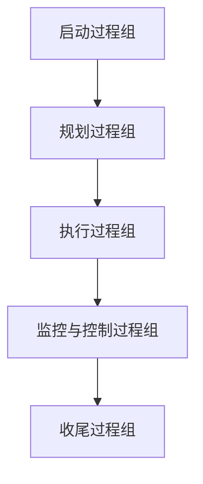

                 

### 文章标题：项目管理：领导者的必备技能

> 关键词：项目管理、领导者技能、项目组织、沟通、团队建设、风险管理

> 摘要：本文深入探讨了项目管理在领导者技能中的重要性，从项目管理的核心概念、组织结构、规划与执行、沟通、团队建设、风险管理等多个方面进行分析，旨在帮助领导者掌握项目管理的核心要领，提升项目成功率。

----------------------------------------------------------------

## 第一部分：项目管理的理论基础

### 第1章：项目管理的核心概念

项目管理是确保项目按计划、按预算和按质量要求完成的一项管理活动。它涉及从项目概念的形成到项目完成的整个生命周期。项目管理不仅仅关注项目的最终交付物，还涉及到项目团队的协作、资源的优化利用以及风险的识别和控制。

### 项目管理五大过程组

项目管理的五大过程组是启动过程组、规划过程组、执行过程组、监控与控制过程组和收尾过程组。

1. **启动过程组**：确定项目的可行性、目标、范围和预期成果。
2. **规划过程组**：制定项目计划，包括时间、成本、资源、风险和沟通策略。
3. **执行过程组**：执行项目计划，确保项目按计划进行。
4. **监控与控制过程组**：监控项目进展，及时调整计划，确保项目按计划完成。
5. **收尾过程组**：完成项目交付，进行项目评估和总结。

### 项目管理的重要性

项目管理的重要性在于它能够确保项目的成功完成，提高资源利用率，减少项目风险，提升组织效率。有效的项目管理能够帮助领导者更好地应对复杂的项目环境，确保项目目标的实现。

## 第二部分：项目管理实践

### 第5章：项目沟通管理

项目沟通管理是项目管理中至关重要的一环。良好的沟通能够确保团队成员理解项目目标、任务和期望，提高项目的执行力。

### 沟通的基本原则

1. **明确沟通目标**：确保所有沟通活动都有明确的目标和预期结果。
2. **选择合适的沟通方式**：根据沟通内容、目标和受众选择最合适的沟通方式。
3. **保持沟通一致性**：确保不同团队成员之间的沟通信息一致。
4. **鼓励反馈**：鼓励团队成员提供反馈，以便及时调整沟通策略。

### 项目沟通工具与技术

1. **会议管理**：定期举行会议，确保团队成员了解项目进展。
2. **情报系统**：建立一个有效的情报系统，确保项目信息流通。
3. **项目报告模板**：使用统一的项目报告模板，提高报告的规范性和可读性。

### 第6章：项目团队建设与管理

项目团队是项目成功的关键。项目团队建设与管理涉及到团队成员的选拔、培养和管理。

### 团队建设的原则与策略

1. **明确团队目标**：确保所有团队成员都清楚项目的目标和自身的职责。
2. **建立信任**：通过共同完成任务建立团队成员之间的信任。
3. **促进沟通**：鼓励团队成员之间的沟通，提高协作效率。
4. **激励团队成员**：通过奖励和认可激励团队成员，提高项目执行力。

### 项目团队管理

1. **团队绩效评估**：定期对团队成员进行绩效评估，识别优势和不足。
2. **团队冲突解决**：及时解决团队冲突，确保项目顺利进行。
3. **团队成员激励**：通过激励措施提高团队成员的积极性和创造力。

## 第三部分：项目管理案例分析

### 第9章：成功项目案例分析

通过成功项目案例分析，我们可以学习到项目管理的有效实践和方法。

### 案例一：大型IT项目实施

- **项目背景**：某大型企业需要进行IT系统的升级和改造。
- **项目管理实践**：
  - 明确项目目标和范围。
  - 制定详细的项目计划，包括时间、成本和资源分配。
  - 建立有效的沟通机制，确保项目进展信息畅通。
  - 定期进行项目评估和调整。
- **项目成果**：项目按计划完成，成功提升了企业的IT服务水平。

### 第10章：项目失败案例分析

项目失败案例可以帮助我们识别项目管理中的问题，避免重复错误。

### 案例一：项目进度失控

- **项目背景**：某IT公司负责开发一款新产品。
- **项目管理问题**：
  - 项目计划制定不详细，缺乏明确的时间节点和里程碑。
  - 缺乏有效的进度监控和调整机制。
- **失败原因分析**：
  - 项目进度失控，导致项目延期。
  - 成本超支，影响企业盈利。

## 附录

### 附录A：项目管理工具与资源

- **项目管理软件介绍**：介绍常用的项目管理软件，如Microsoft Project、JIRA等。
- **项目管理在线资源**：推荐一些在线资源，如PMI（项目管理协会）的网站、项目管理博客等。

## 总结

项目管理是领导者必备的技能之一。通过本文的探讨，我们了解了项目管理的核心概念、实践方法和案例分析。成功的项目管理能够提高项目的成功率，提升组织的竞争力。希望本文能对领导者在项目管理中有所帮助。

### 作者

作者：AI天才研究院/AI Genius Institute & 禅与计算机程序设计艺术 /Zen And The Art of Computer Programming## 项目管理：领导者的必备技能

### 关键词
- 项目管理
- 领导者技能
- 项目组织
- 沟通
- 团队建设
- 风险管理

### 摘要
项目管理是确保项目按计划、按预算和按质量要求完成的关键活动。作为领导者，掌握项目管理技能至关重要。本文将深入探讨项目管理的核心概念、组织结构、规划与执行、沟通、团队建设、风险管理等方面，帮助领导者提升项目管理的实践能力，确保项目成功。

## 第一部分：项目管理的理论基础

### 第1章：项目管理的核心概念

项目管理是关于规划、执行、监控和收尾项目的一系列管理活动。它不仅关注项目的最终交付物，还包括项目团队的协作、资源的优化利用以及风险的识别和控制。

### 项目管理五大过程组

项目管理的五大过程组是：
1. **启动过程组**：确定项目的可行性、目标、范围和预期成果。
2. **规划过程组**：制定项目计划，包括时间、成本、资源、风险和沟通策略。
3. **执行过程组**：执行项目计划，确保项目按计划进行。
4. **监控与控制过程组**：监控项目进展，及时调整计划，确保项目按计划完成。
5. **收尾过程组**：完成项目交付，进行项目评估和总结。

### 项目管理的重要性

项目管理的重要性体现在：
- **提高项目成功率**：通过系统化的管理过程，确保项目按计划、按预算和按质量要求完成。
- **优化资源利用**：合理分配和利用资源，提高项目的经济效益。
- **降低项目风险**：通过风险识别和应对策略，减少项目失败的可能性。
- **提升组织效率**：通过有效的项目管理，提高组织整体运作效率。

## 第二部分：项目管理实践

### 第5章：项目沟通管理

有效的沟通是项目管理成功的关键。良好的沟通能够确保团队成员理解项目目标、任务和期望，提高项目的执行力。

### 沟通的基本原则

1. **明确沟通目标**：确保所有沟通活动都有明确的目标和预期结果。
2. **选择合适的沟通方式**：根据沟通内容、目标和受众选择最合适的沟通方式。
3. **保持沟通一致性**：确保不同团队成员之间的沟通信息一致。
4. **鼓励反馈**：鼓励团队成员提供反馈，以便及时调整沟通策略。

### 项目沟通工具与技术

1. **会议管理**：定期举行会议，确保团队成员了解项目进展。
2. **情报系统**：建立一个有效的情报系统，确保项目信息流通。
3. **项目报告模板**：使用统一的项目报告模板，提高报告的规范性和可读性。

### 第6章：项目团队建设与管理

项目团队是项目成功的关键。项目团队建设与管理涉及到团队成员的选拔、培养和管理。

### 团队建设的原则与策略

1. **明确团队目标**：确保所有团队成员都清楚项目的目标和自身的职责。
2. **建立信任**：通过共同完成任务建立团队成员之间的信任。
3. **促进沟通**：鼓励团队成员之间的沟通，提高协作效率。
4. **激励团队成员**：通过奖励和认可激励团队成员，提高项目执行力。

### 项目团队管理

1. **团队绩效评估**：定期对团队成员进行绩效评估，识别优势和不足。
2. **团队冲突解决**：及时解决团队冲突，确保项目顺利进行。
3. **团队成员激励**：通过激励措施提高团队成员的积极性和创造力。

## 第三部分：项目管理案例分析

### 第9章：成功项目案例分析

通过成功项目案例分析，我们可以学习到项目管理的有效实践和方法。

### 案例一：大型IT项目实施

- **项目背景**：某大型企业需要进行IT系统的升级和改造。
- **项目管理实践**：
  - 明确项目目标和范围。
  - 制定详细的项目计划，包括时间、成本和资源分配。
  - 建立有效的沟通机制，确保项目进展信息畅通。
  - 定期进行项目评估和调整。
- **项目成果**：项目按计划完成，成功提升了企业的IT服务水平。

### 第10章：项目失败案例分析

项目失败案例可以帮助我们识别项目管理中的问题，避免重复错误。

### 案例一：项目进度失控

- **项目背景**：某IT公司负责开发一款新产品。
- **项目管理问题**：
  - 项目计划制定不详细，缺乏明确的时间节点和里程碑。
  - 缺乏有效的进度监控和调整机制。
- **失败原因分析**：
  - 项目进度失控，导致项目延期。
  - 成本超支，影响企业盈利。

## 附录

### 附录A：项目管理工具与资源

- **项目管理软件介绍**：介绍常用的项目管理软件，如Microsoft Project、JIRA等。
- **项目管理在线资源**：推荐一些在线资源，如PMI（项目管理协会）的网站、项目管理博客等。

## 总结

项目管理是领导者必备的技能之一。通过本文的探讨，我们了解了项目管理的核心概念、实践方法和案例分析。成功的项目管理能够提高项目的成功率，提升组织的竞争力。希望本文能对领导者在项目管理中有所帮助。

### 作者

作者：AI天才研究院/AI Genius Institute & 禅与计算机程序设计艺术 /Zen And The Art of Computer Programming## 第一部分：项目管理的理论基础

### 第1章：项目管理的核心概念

项目管理是确保项目按计划、按预算和按质量要求完成的一项复杂而系统的活动。作为领导者，掌握项目管理的核心概念是至关重要的。首先，我们需要明确什么是项目。项目是指一系列独特的、暂时的任务，旨在创造一个特定的输出，例如新产品、新服务或新系统。

### 项目管理五大过程组

项目管理可以分为五大过程组，每个过程组都有其特定的目标和任务：

1. **启动过程组**：在这一阶段，项目正式启动，确定项目的范围、目标和可行性。项目经理需要与利益相关者进行沟通，确保所有人对项目的目标和预期成果有共同的理解。

2. **规划过程组**：在项目启动后，项目团队开始详细规划项目。这一阶段包括制定项目计划、时间表、预算、资源分配和风险应对策略。项目经理需要确保所有细节都被充分考虑。

3. **执行过程组**：在规划完成后，项目进入执行阶段。项目团队开始执行项目计划，实现项目目标。在这一过程中，项目经理需要确保项目按计划进行，并对进度和成本进行监控。

4. **监控与控制过程组**：在项目执行过程中，项目经理需要不断监控项目的进展情况，确保项目按计划进行。如果发现偏差，项目经理需要及时调整计划，确保项目能够回到正轨。

5. **收尾过程组**：在项目完成后，项目团队进行项目总结和评估，确保所有项目目标都得到实现。项目经理需要确保项目文件和知识得到妥善保存，为未来的项目提供参考。

### 项目管理的重要性

项目管理对于领导者来说至关重要，原因如下：

- **确保项目成功**：有效的项目管理能够确保项目按计划、按预算和按质量要求完成，从而提高项目的成功率。
- **优化资源利用**：通过合理规划和管理资源，项目经理能够确保资源的最大化利用，减少浪费。
- **降低风险**：通过识别和应对潜在的风险，项目经理能够减少项目失败的可能性。
- **提升团队协作**：有效的项目管理能够促进团队成员之间的沟通和协作，提高团队的整体效率。
- **增强决策能力**：项目经理在项目中需要做出各种决策，项目管理技能能够增强领导者的决策能力。

### 项目管理核心概念与联系

为了更好地理解项目管理的核心概念，我们可以使用Mermaid流程图来展示这些概念之间的联系：

从流程图中我们可以看到，启动过程组是项目的开始，它为后续的规划、执行、监控和收尾过程提供基础。每个过程组之间都是相互关联的，一个过程组的输出通常是下一个过程的输入。

### 核心概念总结

- **项目**：一系列独特的、暂时的任务，旨在创造一个特定的输出。
- **项目管理**：确保项目按计划、按预算和按质量要求完成的一系列管理活动。
- **过程组**：项目管理分为启动、规划、执行、监控与控制、收尾五大过程组。
- **重要性**：项目管理对于确保项目成功、优化资源利用、降低风险、提升团队协作和增强决策能力至关重要。

通过以上内容，我们深入了解了项目管理的核心概念，为后续章节的深入探讨奠定了基础。在下一章中，我们将进一步探讨项目管理的组织结构和角色分配。

### 第2章：项目组织与管理

项目组织与管理是项目管理的重要组成部分，它涉及到如何将项目任务分配给合适的团队成员，以及如何建立有效的项目团队结构。一个良好的项目组织结构能够提高项目的效率，确保项目目标的实现。

### 项目组织结构

项目组织结构是指项目团队成员之间的关系和角色分配。常见的项目组织结构有职能式组织、项目式组织和矩阵式组织。

1. **职能式组织**：在职能式组织中，团队成员按照其职能（如开发、测试、市场等）进行分组。项目经理在职能式组织中通常不具备完整的决策权，需要与职能经理进行协调。

2. **项目式组织**：在项目式组织中，项目团队是独立运作的，项目经理拥有较大的自主权，可以直接管理项目资源。这种组织结构适用于大型、复杂的项目。

3. **矩阵式组织**：矩阵式组织结合了职能式组织和项目式组织的优点，团队成员既属于职能部门，又属于项目团队。项目经理和职能经理共同负责项目管理和资源分配。

### 项目经理的角色与职责

项目经理是项目成功的关键人物，其角色和职责如下：

1. **项目规划**：项目经理需要制定项目计划，包括项目目标、时间表、资源分配和风险应对策略。

2. **团队领导**：项目经理需要领导项目团队，确保团队成员了解项目目标，协调团队成员之间的工作。

3. **沟通协调**：项目经理需要与项目团队成员、利益相关者和管理层保持良好的沟通，确保项目进展信息畅通。

4. **风险管理**：项目经理需要识别项目风险，制定风险应对策略，并监控风险的发生和变化。

5. **质量保证**：项目经理需要确保项目交付物符合预定的质量标准，通过质量控制和质量保证过程来确保项目质量。

6. **项目收尾**：项目经理需要确保项目按计划完成，并进行项目总结和评估，为未来的项目提供经验教训。

### 项目管理知识体系

项目管理知识体系（Project Management Knowledge Areas）是项目管理的基础框架，它涵盖了项目管理的各个方面。以下是项目管理知识体系的主要组成部分：

1. **整合管理**：确保项目各部分协调一致，实现项目目标。
2. **范围管理**：确保项目团队明确项目的范围和交付物。
3. **时间管理**：制定项目时间表，确保项目按计划完成。
4. **成本管理**：制定项目预算，控制项目成本。
5. **质量管理**：确保项目交付物符合预定的质量标准。
6. **资源管理**：确保项目团队拥有完成项目所需的资源。
7. **沟通管理**：确保项目信息在团队内外有效传递。
8. **风险管理**：识别、评估和应对项目风险。
9. **采购管理**：管理项目采购活动，确保采购的物资和服务满足项目需求。

### 领导力与沟通技巧

领导力是项目经理的关键技能之一。一个有效的项目经理需要具备以下领导力：

- **影响力**：能够影响和激励团队成员，推动项目进展。
- **决策能力**：能够根据项目情况做出明智的决策。
- **沟通能力**：能够清晰、有效地与团队成员、利益相关者和管理层沟通。

沟通技巧也是项目经理必备的技能，包括：

- **主动沟通**：及时与团队成员沟通，确保信息畅通。
- **有效倾听**：倾听团队成员的意见和建议，理解他们的需求和困扰。
- **清晰表达**：用清晰、简洁的语言表达自己的想法和意见。
- **建立信任**：通过透明、诚信的沟通建立团队成员之间的信任。

### 项目风险管理

项目风险管理是项目管理的重要组成部分。以下是项目风险管理的关键步骤：

1. **风险识别**：识别项目可能面临的风险。
2. **风险分析**：分析每个风险的可能性和影响。
3. **风险应对**：制定应对策略，减少风险的影响。
4. **风险监控**：持续监控风险的变化，及时调整应对策略。

### 项目管理实践

在实际项目中，项目经理需要结合项目特点和团队情况，灵活运用项目管理知识和技能。以下是一些项目管理实践：

- **制定详细的计划**：确保项目目标和任务明确，时间安排合理。
- **建立有效的沟通机制**：确保项目进展和问题及时沟通。
- **定期进行项目评估**：监控项目进度，及时发现和解决问题。
- **激励团队成员**：通过奖励和认可提高团队成员的积极性和创造力。

通过以上内容，我们深入了解了项目组织与管理的重要性，以及项目经理的角色、职责和所需技能。在下一章中，我们将进一步探讨项目规划与执行的过程。

### 第3章：项目规划与执行

项目规划与执行是项目管理的核心环节，直接关系到项目的成功与否。项目规划阶段是制定项目计划、时间表和资源分配的过程，而项目执行阶段则是实际开展项目活动、实现项目目标的过程。

### 项目规划的基本原则

项目规划的基本原则包括：

1. **明确项目目标**：确保所有团队成员都清楚项目的目标是什么，以及如何实现这些目标。
2. **制定详细的计划**：项目计划应包括时间表、任务分配、资源需求、风险评估和应对策略。
3. **合理分配资源**：确保项目所需的资源（包括人力、资金、设备等）充足且合理分配。
4. **制定风险管理计划**：识别潜在的风险，并制定相应的应对策略，以减少风险对项目的影响。
5. **建立沟通机制**：确保项目进展、问题和决策能够及时、有效地在团队成员和利益相关者之间传达。

### 项目规划的关键步骤

项目规划的关键步骤包括：

1. **项目范围定义**：明确项目的范围，包括项目要完成的任务和要交付的成果。
2. **工作分解结构（WBS）**：将项目任务分解为更小的、可管理的部分，便于分配和监控。
3. **任务分配**：根据团队成员的技能和经验，将任务分配给合适的成员。
4. **时间表制定**：制定项目的时间表，包括关键里程碑和交付日期。
5. **资源需求分析**：分析项目所需的资源，并制定资源分配计划。
6. **风险评估**：识别项目可能面临的风险，并评估每个风险的可能性和影响。
7. **风险应对策略**：制定风险应对策略，以减少风险对项目的影响。
8. **沟通计划**：制定沟通计划，确保项目信息能够及时、有效地在团队成员和利益相关者之间传达。

### 项目执行与监控

项目执行阶段是按照项目计划开展项目活动的过程。项目监控与控制过程则是确保项目按计划进行的过程。

1. **执行项目计划**：项目团队根据项目计划，开始执行各项任务。
2. **监控项目进展**：项目经理需要定期监控项目的进展情况，确保项目按计划进行。
3. **进度报告**：定期向项目利益相关者报告项目进展，包括项目的完成情况和存在的问题。
4. **变更管理**：在项目执行过程中，可能会出现计划外的变更。项目经理需要及时处理这些变更，确保项目目标的实现。
5. **质量保证**：确保项目交付物符合预定的质量标准，通过质量控制和质量保证过程来确保项目质量。

### 项目执行与监控的关键要素

- **定期会议**：定期举行项目会议，讨论项目进展、问题和决策。
- **进度跟踪**：使用项目管理工具（如Microsoft Project、JIRA等）跟踪项目进度，及时发现和解决问题。
- **资源管理**：确保项目资源（包括人力、资金、设备等）得到有效利用。
- **风险管理**：持续监控风险，确保风险应对策略的有效实施。

### 项目变更管理

项目变更管理是确保项目变更得到有效处理的过程。项目变更可能来自内部或外部因素，如需求变更、技术变更或外部环境变化。

1. **变更请求**：识别和记录项目变更请求。
2. **变更评估**：评估变更请求对项目目标、时间表和成本的影响。
3. **变更审批**：根据评估结果，决定是否接受变更请求。
4. **变更实施**：如果接受变更请求，制定变更实施计划，并实施变更。
5. **变更记录**：记录变更请求、评估和实施情况，以便项目总结和未来项目参考。

### 项目执行与监控的实践技巧

1. **明确责任和任务**：确保每个团队成员都清楚自己的任务和责任。
2. **定期检查进度**：定期检查项目进度，及时发现和解决问题。
3. **灵活调整计划**：根据实际情况，灵活调整项目计划。
4. **及时沟通**：确保项目进展和问题能够及时沟通，避免误解和冲突。
5. **持续改进**：通过项目总结和反馈，不断改进项目管理流程和执行策略。

通过以上内容，我们深入了解了项目规划与执行的关键步骤和实践技巧。在下一章中，我们将探讨项目沟通管理的重要性和方法。

### 第4章：项目风险管理

项目风险管理是确保项目按计划、按预算和按质量要求完成的重要环节。有效的项目风险管理能够降低项目风险对项目目标的影响，提高项目的成功率。

### 风险管理概述

项目风险管理包括以下主要步骤：

1. **风险识别**：识别项目可能面临的风险。
2. **风险分析**：分析每个风险的可能性和影响。
3. **风险应对**：制定风险应对策略，以减少风险的影响。
4. **风险监控**：持续监控风险，确保风险应对策略的有效实施。

### 风险识别

风险识别是项目风险管理的第一步，目的是识别项目可能面临的风险。以下是风险识别的一些方法：

1. **专家访谈**：通过与项目团队成员、利益相关者和专家的访谈，了解项目潜在的风险。
2. **历史数据**：分析过去类似项目的风险记录，识别常见的风险。
3. **检查表**：使用预先定义的检查表，识别项目中可能存在的风险。
4. **头脑风暴**：组织项目团队成员进行头脑风暴，识别潜在的风险。

### 风险分析

风险分析是对识别出的风险进行评估，确定每个风险的可能性和影响。以下是风险分析的一些方法：

1. **概率分析**：评估每个风险发生的可能性。
2. **影响分析**：评估每个风险对项目目标（如时间、成本、质量）的影响。
3. **优先级排序**：根据风险的可能性和影响，对风险进行优先级排序。
4. **风险矩阵**：使用风险矩阵评估每个风险的风险等级。

### 风险应对策略

根据风险分析的结果，项目团队需要制定相应的风险应对策略。以下是常见的风险应对策略：

1. **避免**：消除风险或使其不可能发生。
2. **转移**：将风险转移给其他方，如购买保险。
3. **减轻**：减少风险的可能性和影响。
4. **接受**：接受风险，并准备应对措施。
5. **监控**：持续监控风险，确保风险应对策略的有效实施。

### 风险管理实践

在实际项目中，项目团队需要根据项目特点和风险情况，灵活运用风险管理方法。以下是风险管理实践的一些要点：

1. **制定风险管理计划**：在项目规划阶段，制定风险管理计划，明确风险管理的方法、职责和时间表。
2. **定期进行风险评估**：定期评估项目风险，更新风险清单和风险应对策略。
3. **及时处理风险**：一旦发现新风险或风险发生变化，及时处理和应对。
4. **培训团队成员**：提高团队成员的风险识别和应对能力。
5. **沟通与协作**：确保项目团队成员和利益相关者对风险有共同的理解，并协同应对风险。

### 风险评估方法

以下是几种常见的风险评估方法：

1. **风险矩阵**：使用风险矩阵评估每个风险的风险等级，包括风险的概率和影响。
2. **蒙特卡洛模拟**：使用模拟技术，评估项目在不同风险情况下的可能结果。
3. **敏感性分析**：分析项目目标对关键风险的敏感度，确定哪些风险对项目目标的影响最大。
4. **专家评估**：邀请专家对项目风险进行评估，结合专家意见制定风险应对策略。

### 风险优先级设定

在确定风险应对策略时，项目团队需要根据风险的风险等级和项目的实际情况，设定风险优先级。以下是风险优先级设定的一些方法：

1. **优先级排序**：根据风险的可能性和影响，对风险进行优先级排序。
2. **关键风险分析**：识别项目中关键的风险，优先处理这些风险。
3. **资源分配**：根据风险的风险等级和项目资源情况，合理分配资源应对风险。

### 风险监控与报告

在项目执行过程中，项目团队需要持续监控项目风险，并定期报告风险状况。以下是风险监控与报告的一些要点：

1. **定期风险评审**：定期评审项目风险，更新风险清单和风险应对策略。
2. **风险报告**：编写风险报告，向项目利益相关者报告风险状况和应对措施。
3. **风险预警**：建立风险预警机制，及时发现新风险或风险变化，及时采取应对措施。
4. **风险记录**：记录项目中的风险识别、分析和应对情况，为未来项目提供经验教训。

通过以上内容，我们深入了解了项目风险管理的理论和实践，为项目成功奠定了基础。在下一章中，我们将探讨项目沟通管理的重要性和方法。

### 第5章：项目沟通管理

项目沟通管理是确保项目信息在项目团队内外有效传递和共享的关键环节。良好的沟通能够提高项目效率，减少误解和冲突，确保项目目标的实现。

### 沟通的基本原则

有效的沟通应遵循以下基本原则：

1. **明确沟通目标**：每次沟通前应明确沟通的目标和预期结果，确保信息传递的针对性。
2. **选择合适的方式**：根据沟通内容、受众和目标，选择最合适的沟通方式，如面对面会议、电子邮件、即时通讯等。
3. **保持一致性**：确保不同团队成员和利益相关者之间的沟通信息一致，避免信息传递过程中的偏差。
4. **鼓励反馈**：鼓励沟通双方提供反馈，以确保信息的准确理解和有效传递。

### 项目沟通工具与技术

项目沟通管理中常用的工具和技术包括：

1. **会议管理**：定期举行项目会议，讨论项目进展、问题和决策。会议应保持结构化和高效性，避免冗长和无意义的内容。
2. **情报系统**：建立一个有效的情报系统，确保项目信息在团队内外快速传递。可以使用项目管理软件、内部网站或邮件列表等工具。
3. **项目报告模板**：使用统一的项目报告模板，提高报告的规范性和可读性。报告应包括项目进度、问题和决策等内容。

### 会议管理

会议管理是项目沟通的重要组成部分。以下是会议管理的要点：

1. **明确会议目的**：每次会议前应明确会议的目的和议程，确保会议聚焦于核心议题。
2. **准备会议材料**：提前准备会议所需的材料，如项目报告、进度图表和决策草案等。
3. **控制会议时间**：确保会议时间不超过预定时间，避免会议拖延和影响项目进度。
4. **记录会议内容**：详细记录会议讨论的内容和决策，确保会议结果得到有效执行。

### 情报系统

情报系统是确保项目信息流通的重要工具。以下是情报系统的一些要点：

1. **选择合适的工具**：根据项目需求和团队规模，选择合适的情报系统工具，如Trello、Asana或JIRA等。
2. **制定信息流转规则**：明确项目信息的流转规则，确保信息在团队内外有效传递。
3. **定期更新信息**：确保项目信息实时更新，避免信息滞后和失真。
4. **培训团队成员**：提高团队成员对情报系统的使用能力，确保信息流通顺畅。

### 项目报告模板

使用统一的项目报告模板可以提高报告的规范性和可读性。以下是项目报告模板的要点：

1. **报告结构**：报告应包括项目概述、进展情况、问题和决策、下一步计划等内容。
2. **进度图表**：使用进度图表（如Gantt图、里程碑图等）展示项目进展和关键节点。
3. **数据和分析**：提供详细的数据和分析，支持项目进展和决策。
4. **反馈和建议**：在报告末尾提出团队成员和利益相关者的反馈和建议，为项目改进提供依据。

### 沟通实践技巧

在实际项目沟通中，项目团队应遵循以下实践技巧：

1. **主动沟通**：及时与团队成员和利益相关者沟通，确保信息传递的及时性和准确性。
2. **有效倾听**：倾听团队成员和利益相关者的意见和建议，确保信息的准确理解和有效传递。
3. **清晰表达**：用清晰、简洁的语言表达自己的观点和意见，避免歧义和误解。
4. **建立信任**：通过透明、诚信的沟通建立团队成员和利益相关者之间的信任，提高项目的执行力。

### 沟通障碍与解决方法

在项目沟通中，常见的一些障碍包括：

1. **语言障碍**：团队成员之间的语言差异可能影响沟通效果。解决方法包括使用共同的语言或翻译服务。
2. **文化差异**：不同文化背景的团队成员可能在沟通方式和价值观上存在差异。解决方法包括加强文化敏感性和跨文化培训。
3. **信息传递不畅**：信息在传递过程中可能失真或滞后。解决方法包括使用有效的沟通工具和建立明确的沟通流程。
4. **沟通频率不当**：沟通频率过高或过低都可能影响项目进展。解决方法包括制定合理的沟通频率和议程。

通过以上内容，我们深入了解了项目沟通管理的重要性、基本原则和工具方法。在下一章中，我们将探讨项目团队建设与管理的重要性和实践方法。

### 第6章：项目团队建设与管理

项目团队是项目成功的关键因素，一个高效的团队能够更好地应对项目的挑战，实现项目目标。因此，项目团队建设与管理是项目管理中不可或缺的一部分。本章节将探讨团队建设的原则、策略以及团队管理的方法。

#### 团队建设的原则与策略

团队建设应遵循以下原则：

1. **明确团队目标**：确保所有团队成员都清楚团队的目标是什么，以及如何实现这些目标。这有助于提高团队成员的积极性和执行力。

2. **建立信任**：信任是团队协作的基础。团队成员之间需要建立信任，通过共同完成任务和积极沟通来实现。这有助于减少冲突和误解，提高团队凝聚力。

3. **促进沟通**：有效的沟通是团队协作的关键。团队应该建立一个开放的沟通环境，鼓励成员之间的沟通和意见交换。这有助于提高团队的理解和协作效率。

4. **激励团队成员**：通过奖励和认可激励团队成员，提高他们的工作积极性和创造力。这有助于提高团队的整体绩效和项目成功率。

团队建设策略包括：

1. **团队建设活动**：定期组织团队建设活动，如团队聚餐、户外拓展训练等，以加强团队成员之间的交流和互动。

2. **角色分配**：根据团队成员的技能和经验，合理分配角色和任务，确保每个成员都能发挥自己的优势。

3. **培训与发展**：为团队成员提供培训和发展机会，提高他们的专业技能和团队合作能力。

#### 项目团队管理

项目团队管理包括以下几个方面：

1. **团队绩效评估**：定期对团队成员进行绩效评估，识别他们的优势和不足，并提供反馈和改进建议。这有助于提高团队成员的工作效率和绩效。

2. **团队冲突解决**：团队冲突是不可避免的，但有效的解决方法可以减少冲突对项目的影响。项目经理应积极倾听双方的诉求，找出冲突的根本原因，并提出解决方案。

3. **团队成员激励**：通过奖励和认可激励团队成员，提高他们的工作积极性和创造力。这可以包括奖金、晋升机会、荣誉称号等。

#### 团队绩效评估

团队绩效评估是团队管理的重要环节。以下是一些关键点：

1. **评估标准**：制定明确的评估标准，包括工作质量、工作效率、团队合作等方面。

2. **评估频率**：定期进行绩效评估，如季度评估或年度评估，以确保团队成员的绩效得到持续关注。

3. **反馈与改进**：提供详细的反馈，帮助团队成员了解自己的表现，并提出改进建议。这有助于提高团队成员的工作效率和绩效。

#### 团队冲突解决

团队冲突解决的关键在于：

1. **积极倾听**：倾听双方的诉求，理解冲突的根本原因。

2. **中立立场**：作为项目经理，应保持中立立场，避免偏袒任何一方。

3. **提出解决方案**：根据冲突的原因，提出合理的解决方案，如调整工作任务、改进沟通方式等。

#### 团队成员激励

团队成员激励的方法包括：

1. **奖励与认可**：为表现优秀的团队成员提供奖励和认可，如奖金、晋升机会、荣誉称号等。

2. **培训与发展**：为团队成员提供培训和发展机会，提高他们的专业技能和团队合作能力。

3. **工作环境**：创造一个积极、开放的工作环境，鼓励团队成员的沟通和合作。

通过以上内容，我们深入了解了项目团队建设与管理的重要性、原则和策略。在下一章中，我们将探讨项目质量管理的重要性和实践方法。

### 第7章：项目质量管理

项目质量管理是确保项目交付物满足预定质量标准的关键环节。有效的项目质量管理能够提高客户满意度，降低返工和修复成本，提高项目成功率。本章节将探讨项目质量管理的基本概念、方法和技术，以及如何实施质量保证和质量控制。

#### 质量管理的基本概念

质量管理是指通过规划、实施、监控和改进过程，确保项目交付物符合预定的质量标准和客户需求。以下是项目质量管理的基本概念：

1. **质量规划**：制定项目质量管理计划，确定项目质量目标和标准，规划质量管理活动和资源分配。

2. **质量保证**：通过系统的过程审核和评估，确保项目活动符合预定的质量标准和流程。

3. **质量控制**：在项目执行过程中，通过监控和评估项目交付物的质量，及时识别和纠正质量问题。

4. **质量改进**：通过持续的过程改进，提高项目质量水平和效率。

#### 质量管理方法

以下是几种常见的项目质量管理方法：

1. **质量功能展开（QFD）**：通过分析客户需求，将需求转化为技术要求和设计参数，确保项目交付物满足客户需求。

2. **流程图分析**：使用流程图分析项目流程中的质量问题和瓶颈，优化流程，提高质量。

3. **鱼骨图（因果图）**：通过鱼骨图分析质量问题的根本原因，制定相应的改进措施。

4. **控制图**：使用控制图监控项目质量变化，及时识别和纠正质量问题。

#### 质量保证

质量保证是指确保项目活动符合预定的质量标准和流程。以下是质量保证的关键步骤：

1. **过程审核**：定期对项目过程进行审核，确保项目活动符合质量标准。

2. **标准操作规程（SOP）**：制定标准操作规程，明确项目过程中的质量要求和操作步骤。

3. **内部审计**：进行内部审计，评估项目质量保证活动的有效性。

#### 质量控制

质量控制是指在项目执行过程中，通过监控和评估项目交付物的质量，及时识别和纠正质量问题。以下是质量控制的关键步骤：

1. **质量检查**：定期对项目交付物进行质量检查，确保其符合预定的质量标准。

2. **偏差分析**：分析项目交付物与质量标准的偏差，制定相应的纠正措施。

3. **持续改进**：通过持续改进，提高项目质量水平和效率。

#### 质量管理实践

在实际项目中，项目团队可以采取以下质量管理实践：

1. **制定质量目标**：根据项目特点和客户需求，制定明确的质量目标。

2. **培训团队成员**：提高团队成员的质量意识和技术水平。

3. **建立质量管理体系**：建立质量管理体系，明确质量职责和流程。

4. **持续监控和评估**：持续监控项目质量，及时识别和纠正质量问题。

5. **客户反馈**：收集客户反馈，改进项目质量。

#### 质量管理工具和技术

以下是几种常用的质量管理工具和技术：

1. **检查表**：用于记录和跟踪项目交付物的质量情况。

2. **统计过程控制（SPC）**：使用统计过程控制方法，监控项目质量变化，确保项目质量稳定。

3. **失效模式与影响分析（FMEA）**：用于评估项目过程中潜在的质量问题和风险。

4. **质量功能展开（QFD）**：用于将客户需求转化为技术要求和设计参数。

通过以上内容，我们深入了解了项目质量管理的基本概念、方法和技术，以及如何实施质量保证和质量控制。在下一章中，我们将探讨项目采购管理的重要性和方法。

### 第8章：项目采购管理

项目采购管理是确保项目所需物资和服务按时、按质、按量供应的关键环节。有效的采购管理能够提高项目效率，降低成本，确保项目目标的实现。本章节将探讨项目采购管理的基本概念、流程、采购策略以及供应链管理。

#### 采购管理的基本概念

采购管理是指在整个项目生命周期内，对项目所需物资和服务进行计划、获取、管理和控制的过程。以下是采购管理的基本概念：

1. **采购计划**：在项目启动阶段，根据项目需求和预算，制定采购计划，确定采购物资和服务的种类、数量、时间安排和预算。

2. **供应商选择**：根据采购计划，选择合适的供应商，确保供应商能够提供满足项目需求的物资和服务。

3. **采购谈判**：与供应商进行谈判，确定采购价格、交付时间、质量标准和支付条件等条款。

4. **合同管理**：与供应商签订采购合同，明确双方的权利和义务，确保采购过程的合法性和有效性。

5. **采购执行**：根据采购计划和合同条款，组织物资和服务的采购和交付。

6. **采购监控**：在整个采购过程中，对供应商的交付情况进行监控，确保采购物资和服务的质量、数量和交付时间符合要求。

7. **采购结算**：采购物资和服务交付后，进行采购结算，包括验收、付款和售后服务等。

#### 采购管理的流程

采购管理的流程包括以下几个关键步骤：

1. **需求分析**：根据项目需求，确定项目所需物资和服务的种类、数量和时间安排。

2. **编制采购计划**：根据需求分析结果，编制采购计划，明确采购物资和服务的具体要求、时间表和预算。

3. **供应商选择**：根据采购计划，通过招标、询价或直接采购等方式，选择合适的供应商。

4. **采购谈判**：与选定的供应商进行谈判，确定采购价格、交付时间、质量标准和支付条件等条款。

5. **签订采购合同**：与供应商签订采购合同，明确双方的权利和义务，确保采购过程的合法性和有效性。

6. **采购执行**：根据采购计划和合同条款，组织物资和服务的采购和交付，确保物资和服务的质量、数量和交付时间符合要求。

7. **采购监控**：在整个采购过程中，对供应商的交付情况进行监控，及时处理和解决采购过程中的问题和风险。

8. **采购结算**：采购物资和服务交付后，进行采购结算，包括验收、付款和售后服务等。

#### 采购策略

采购策略是项目采购管理的重要部分，它决定了如何选择供应商、如何谈判价格和条款，以及如何管理采购过程。以下是几种常见的采购策略：

1. **成本领先策略**：通过大量采购和谈判，降低采购成本，以实现项目成本领先。

2. **质量优先策略**：选择高质量供应商，确保项目交付物的质量符合要求，即使采购成本较高。

3. **供应商多样化策略**：与多个供应商建立合作关系，降低单一供应商的风险，确保物资和服务的稳定供应。

4. **长期合同策略**：与供应商签订长期合同，确保物资和服务的长期稳定供应，同时通过长期合作降低采购成本。

5. **合作采购策略**：与其他项目或部门合作，共同采购物资和服务，以实现规模效应和降低采购成本。

#### 供应链管理

供应链管理是确保项目所需物资和服务从供应商到项目现场的有效流动的过程。以下是供应链管理的关键要素：

1. **需求管理**：准确预测项目需求，确保采购计划和实际需求的一致性。

2. **供应商管理**：建立和管理与供应商的关系，确保供应商能够满足项目需求。

3. **库存管理**：合理控制库存水平，避免库存积压和资金占用。

4. **物流管理**：确保物资和服务在供应链中的高效流动，减少物流成本。

5. **质量管理**：确保采购物资和服务的质量符合项目要求。

6. **信息管理**：建立有效的信息管理系统，确保供应链各环节的信息流通和实时更新。

通过以上内容，我们深入了解了项目采购管理的基本概念、流程、采购策略和供应链管理。在下一章中，我们将通过成功和失败的项目案例，进一步探讨项目管理的实际应用和经验教训。

### 第9章：成功项目案例分析

成功项目案例分析是学习项目管理实践和技巧的重要途径。通过分析成功项目，我们可以了解项目管理的最佳实践，学习如何有效地规划和执行项目。以下是两个成功项目的案例分析。

#### 案例一：大型IT项目实施

**项目背景**：
某大型企业需要进行IT系统的升级和改造，以提高业务效率和用户体验。该项目涉及多个系统模块的集成和优化，包括客户关系管理（CRM）、企业资源规划（ERP）和供应链管理（SCM）等。

**项目管理实践**：

1. **明确项目目标**：项目团队与利益相关者共同确定项目目标，包括系统功能提升、性能优化和用户体验改进。

2. **制定详细项目计划**：项目团队制定了详细的项目计划，包括时间表、任务分配、资源需求和风险评估。

3. **有效的沟通机制**：项目团队建立了定期的沟通机制，确保所有团队成员和利益相关者对项目进展有共同的理解。

4. **风险管理**：项目团队识别了潜在的风险，并制定了相应的应对策略，如技术风险、需求变更和资源短缺等。

5. **质量控制**：项目团队实施了严格的质量控制措施，确保系统功能符合预定的质量标准。

6. **项目监控与调整**：项目团队定期监控项目进展，及时发现和解决问题，确保项目按计划进行。

**项目成果**：

项目成功完成，系统功能得到显著提升，用户满意度提高，业务流程更加高效。企业通过该项目的实施，实现了业务的数字化转型和运营效率的提升。

#### 案例二：跨文化项目管理

**项目背景**：
一家跨国公司需要在不同的国家和地区开展一项市场拓展项目，涉及多个国家和地区的团队协作。由于文化差异和时区差异，项目协调和沟通面临巨大挑战。

**项目管理实践**：

1. **文化敏感性培训**：项目团队参加了跨文化敏感性培训，提高了团队成员对不同文化的理解和尊重。

2. **建立统一的沟通平台**：项目团队建立了统一的沟通平台，如即时通讯工具和项目管理软件，确保信息在全球范围内的及时传递。

3. **制定本地化策略**：项目团队根据不同地区的市场需求和文化特点，制定了本地化策略，确保项目方案符合当地的要求。

4. **协调时区差异**：项目团队制定了时区协调计划，确保全球团队能够在合适的时区内进行协作。

5. **灵活调整项目计划**：项目团队根据实际情况，灵活调整项目计划，确保项目进度和目标的实现。

6. **建立反馈机制**：项目团队建立了反馈机制，定期收集团队成员的反馈，及时调整项目策略和执行计划。

**项目成果**：

项目在全球范围内顺利实施，市场拓展目标实现，公司品牌在国际市场上得到提升。跨文化项目的成功实施，为公司未来的国际化发展提供了宝贵经验。

通过以上两个案例，我们可以看到，成功项目的关键在于明确的规划、有效的沟通、风险管理、质量控制以及灵活的项目执行。这些经验教训对项目管理实践具有重要的指导意义。

### 第10章：项目失败案例分析

项目失败案例分析可以帮助我们识别项目管理中的问题和风险，从而避免在未来的项目中重复错误。以下是两个项目失败案例的分析。

#### 案例一：项目进度失控

**项目背景**：
一家软件公司承接了一个软件开发项目，旨在开发一款面向企业客户的管理系统。项目计划中包含了详细的时间表和里程碑。

**项目管理问题**：

1. **项目计划不详细**：项目计划缺乏明确的时间节点和里程碑，导致任务分配和进度跟踪不明确。

2. **进度监控不足**：项目团队没有建立有效的进度监控机制，无法及时发现和解决进度偏差。

3. **沟通不畅**：项目团队和利益相关者之间的沟通不畅，导致信息传递不及时，问题无法得到及时解决。

**失败原因分析**：

1. **计划不明确**：项目计划制定不详细，导致团队成员对任务和进度缺乏明确的认识。

2. **进度失控**：缺乏有效的进度监控和调整机制，导致项目进度不断推迟。

3. **沟通不畅**：沟通不畅导致问题无法得到及时解决，进一步加剧了项目进度失控。

**项目补救措施**：

1. **修订项目计划**：重新制定详细的项目计划，包括明确的时间节点和里程碑。

2. **加强进度监控**：建立有效的进度监控机制，定期检查项目进度，及时调整计划。

3. **改善沟通**：加强项目团队和利益相关者之间的沟通，确保信息畅通，问题得到及时解决。

#### 案例二：项目成本超支

**项目背景**：
一家建筑公司承接了一项商业建筑的建设项目。项目初期，公司预计项目成本在预算范围内。

**项目管理问题**：

1. **预算制定不科学**：项目预算制定不科学，未充分考虑潜在的成本风险。

2. **资源管理不当**：资源管理不当，导致资源浪费和效率低下。

3. **变更管理不足**：项目变更管理不足，未对项目变更的成本和影响进行充分评估。

**失败原因分析**：

1. **预算制定不科学**：项目预算制定不准确，未充分考虑潜在的成本风险。

2. **资源管理不当**：资源管理不当，导致资源浪费和效率低下。

3. **变更管理不足**：未对项目变更的成本和影响进行充分评估，导致成本超支。

**项目补救措施**：

1. **重新评估预算**：重新评估项目预算，充分考虑潜在的成本风险，制定更为科学的预算计划。

2. **优化资源管理**：优化资源管理，提高资源利用效率，减少浪费。

3. **加强变更管理**：建立有效的变更管理流程，对项目变更的成本和影响进行充分评估，确保变更的合理性和可控性。

通过以上两个失败案例的分析，我们可以看到，项目失败的主要原因包括计划不明确、进度监控不足、沟通不畅、预算制定不科学、资源管理不当和变更管理不足等。在未来的项目管理中，我们需要吸取这些教训，加强项目管理的基础工作，提高项目成功的可能性。

### 附录A：项目管理工具与资源

在项目管理过程中，使用合适的工具和资源能够提高项目的效率和质量。以下是一些常用的项目管理工具和资源：

#### 项目管理软件

1. **Microsoft Project**：一款功能强大的项目管理软件，适用于大型和复杂的项目。
2. **JIRA**：一款流行的项目管理工具，适用于敏捷开发和迭代项目。
3. **Trello**：一款简洁的看板式项目管理工具，适用于小项目和团队协作。
4. **Asana**：一款功能全面的任务管理工具，适用于不同规模的项目。

#### 项目管理网站和资源

1. **PMI（项目管理协会）**：提供项目管理知识、资源和专业认证。
2. **Project Management Blog**：分享项目管理知识和案例，提供实践经验和最佳实践。
3. **GitHub**：一个代码托管平台，可以用于项目管理中的代码协作和版本控制。
4. **Stack Overflow**：一个编程社区，提供编程问题和解决方案，适用于项目开发中的技术支持。

#### 项目管理书籍和文献

1. **《项目管理知识体系指南》（PMBOK Guide）**：项目管理协会（PMI）发布的官方指南，涵盖项目管理的基本原则和实践方法。
2. **《敏捷项目管理》（Agile Project Management）**：介绍敏捷方法在项目管理中的应用和实践。
3. **《禅与计算机程序设计艺术》（Zen And The Art of Computer Programming）**：介绍软件开发中的哲学和技巧，适用于项目开发中的团队管理和沟通。
4. **《成功的项目管理》（Successful Project Management）**：提供项目管理实践经验和技巧，适用于各种类型的项目。

通过使用这些工具和资源，项目团队可以更好地进行项目规划、执行和监控，提高项目的成功率。

### 总结

项目管理是领导者必备的技能之一。本文通过深入探讨项目管理的核心概念、实践方法和案例分析，帮助领导者掌握项目管理的核心要领。成功项目管理的关键在于明确的规划、有效的沟通、风险管理、质量控制以及团队建设。在项目管理中，领导者需要具备决策能力、沟通能力和团队管理能力，以确保项目的成功完成。未来的项目管理将更加注重敏捷方法的应用、跨文化团队的管理以及信息化工具的运用。希望本文能对领导者在项目管理中提供有益的参考和启示。

### 作者

作者：AI天才研究院/AI Genius Institute & 禅与计算机程序设计艺术 /Zen And The Art of Computer Programming## 第一部分：项目管理的理论基础

### 第1章：项目管理的核心概念

项目管理是确保项目按计划、按预算和按质量要求完成的一项复杂而系统的活动。项目管理的核心概念包括项目、项目管理过程、项目管理知识体系和项目管理中的关键角色。

#### 什么是项目

项目是指一系列独特的、暂时的任务，旨在创造一个特定的输出，例如新产品、新服务或新系统。项目具有以下特点：

1. **独特性**：每个项目都有其独特的目标和需求，不同于日常运营活动。
2. **临时性**：项目有一个明确的开始和结束时间，一旦项目目标实现，项目即告结束。
3. **目标性**：项目旨在实现特定的目标或成果，如产品开发、系统升级或市场推广。

#### 项目管理过程

项目管理过程是指确保项目按计划、按预算和按质量要求完成的一系列管理活动。项目管理过程包括五大过程组，每个过程组都有其特定的目标和任务：

1. **启动过程组**：确定项目的可行性、目标、范围和预期成果。
2. **规划过程组**：制定项目计划，包括时间、成本、资源、风险和沟通策略。
3. **执行过程组**：执行项目计划，确保项目按计划进行。
4. **监控与控制过程组**：监控项目进展，及时调整计划，确保项目按计划完成。
5. **收尾过程组**：完成项目交付，进行项目评估和总结。

#### 项目管理知识体系

项目管理知识体系（Project Management Knowledge Areas）是项目管理的基础框架，它涵盖了项目管理的各个方面。以下是项目管理知识体系的主要组成部分：

1. **整合管理**：确保项目各部分协调一致，实现项目目标。
2. **范围管理**：确保项目团队明确项目的范围和交付物。
3. **时间管理**：制定项目时间表，确保项目按计划完成。
4. **成本管理**：制定项目预算，控制项目成本。
5. **质量管理**：确保项目交付物符合预定的质量标准。
6. **资源管理**：确保项目团队拥有完成项目所需的资源。
7. **沟通管理**：确保项目信息在团队内外有效传递。
8. **风险管理**：识别、评估和应对项目风险。
9. **采购管理**：管理项目采购活动，确保采购的物资和服务满足项目需求。

#### 项目管理中的关键角色

项目管理中的关键角色包括项目经理、项目团队成员和利益相关者。以下是每个角色的主要职责：

1. **项目经理**：负责项目的整体管理，确保项目按计划、按预算和按质量要求完成。项目经理需要具备领导力、沟通能力和决策能力。
2. **项目团队成员**：负责具体任务的执行和项目的日常管理工作。团队成员通常包括开发人员、测试人员、设计人员和运营人员等。
3. **利益相关者**：对项目有利益或影响的个人或组织，如客户、管理层和供应商等。利益相关者需要参与项目的规划和决策过程，确保项目符合他们的需求和期望。

#### 项目管理核心概念总结

- **项目**：一系列独特的、暂时的任务，旨在创造一个特定的输出。
- **项目管理**：确保项目按计划、按预算和按质量要求完成的一系列管理活动。
- **项目管理过程**：包括启动、规划、执行、监控与控制和收尾五大过程组。
- **项目管理知识体系**：涵盖整合管理、范围管理、时间管理、成本管理、质量管理、资源管理、沟通管理、风险管理和采购管理。
- **关键角色**：项目经理、项目团队成员和利益相关者。

通过以上内容，我们深入了解了项目管理的核心概念，为后续章节的深入探讨奠定了基础。在下一章中，我们将进一步探讨项目管理的组织结构和角色分配。

### 第2章：项目组织与管理

项目组织与管理是项目管理的重要组成部分，它涉及到如何将项目任务分配给合适的团队成员，以及如何建立有效的项目团队结构。一个良好的项目组织结构能够提高项目的效率，确保项目目标的实现。

#### 项目组织结构

项目组织结构是指项目团队成员之间的关系和角色分配。常见的项目组织结构有职能式组织、项目式组织和矩阵式组织。

1. **职能式组织**：在职能式组织中，团队成员按照其职能（如开发、测试、市场等）进行分组。项目经理在职能式组织中通常不具备完整的决策权，需要与职能经理进行协调。

2. **项目式组织**：在项目式组织中，项目团队是独立运作的，项目经理拥有较大的自主权，可以直接管理项目资源。这种组织结构适用于大型、复杂的项目。

3. **矩阵式组织**：矩阵式组织结合了职能式组织和项目式组织的优点，团队成员既属于职能部门，又属于项目团队。项目经理和职能经理共同负责项目管理和资源分配。

#### 项目经理的角色与职责

项目经理是项目成功的关键人物，其角色和职责如下：

1. **项目规划**：项目经理需要制定项目计划，包括项目目标、时间表、资源分配和风险应对策略。

2. **团队领导**：项目经理需要领导项目团队，确保团队成员了解项目目标，协调团队成员之间的工作。

3. **沟通协调**：项目经理需要与项目团队成员、利益相关者和管理层保持良好的沟通，确保项目进展信息畅通。

4. **风险管理**：项目经理需要识别项目风险，制定风险应对策略，并监控风险的发生和变化。

5. **质量保证**：项目经理需要确保项目交付物符合预定的质量标准，通过质量控制和质量保证过程来确保项目质量。

6. **项目收尾**：项目经理需要确保项目按计划完成，并进行项目总结和评估，为未来的项目提供经验教训。

#### 项目管理知识体系

项目管理知识体系（Project Management Knowledge Areas）是项目管理的基础框架，它涵盖了项目管理的各个方面。以下是项目管理知识体系的主要组成部分：

1. **整合管理**：确保项目各部分协调一致，实现项目目标。
2. **范围管理**：确保项目团队明确项目的范围和交付物。
3. **时间管理**：制定项目时间表，确保项目按计划完成。
4. **成本管理**：制定项目预算，控制项目成本。
5. **质量管理**：确保项目交付物符合预定的质量标准。
6. **资源管理**：确保项目团队拥有完成项目所需的资源。
7. **沟通管理**：确保项目信息在团队内外有效传递。
8. **风险管理**：识别、评估和应对项目风险。
9. **采购管理**：管理项目采购活动，确保采购的物资和服务满足项目需求。

#### 领导力与沟通技巧

领导力是项目经理的关键技能之一。一个有效的项目经理需要具备以下领导力：

- **影响力**：能够影响和激励团队成员，推动项目进展。
- **决策能力**：能够根据项目情况做出明智的决策。
- **沟通能力**：能够清晰、有效地与团队成员、利益相关者和管理层沟通。

沟通技巧也是项目经理必备的技能，包括：

- **主动沟通**：及时与团队成员沟通，确保信息畅通。
- **有效倾听**：倾听团队成员的意见和建议，理解他们的需求和困扰。
- **清晰表达**：用清晰、简洁的语言表达自己的想法和意见。
- **建立信任**：通过透明、诚信的沟通建立团队成员之间的信任。

#### 项目风险管理

项目风险管理是项目管理的重要组成部分。以下是项目风险管理的关键步骤：

1. **风险识别**：识别项目可能面临的风险。
2. **风险分析**：分析每个风险的可能性和影响。
3. **风险应对**：制定风险应对策略，以减少风险的影响。
4. **风险监控**：持续监控风险，确保风险应对策略的有效实施。

#### 项目管理实践

在实际项目中，项目经理需要结合项目特点和团队情况，灵活运用项目管理知识和技能。以下是一些项目管理实践：

- **制定详细的计划**：确保项目目标和任务明确，时间安排合理。
- **建立有效的沟通机制**：确保项目进展和问题及时沟通。
- **定期进行项目评估**：监控项目进度，及时发现和解决问题。
- **激励团队成员**：通过奖励和认可提高团队成员的积极性和创造力。

通过以上内容，我们深入了解了项目组织与管理的重要性，以及项目经理的角色、职责和所需技能。在下一章中，我们将进一步探讨项目规划与执行的过程。

### 第3章：项目规划与执行

项目规划与执行是项目管理的核心环节，直接关系到项目的成功与否。项目规划阶段是制定项目计划、时间表和资源分配的过程，而项目执行阶段则是实际开展项目活动、实现项目目标的过程。

#### 项目规划的基本原则

项目规划的基本原则包括：

1. **明确项目目标**：确保所有团队成员都清楚项目的目标是什么，以及如何实现这些目标。
2. **制定详细的计划**：项目计划应包括时间表、任务分配、资源需求、风险评估和应对策略。
3. **合理分配资源**：确保项目所需的资源（包括人力、资金、设备等）充足且合理分配。
4. **制定风险管理计划**：识别潜在的风险，并制定相应的应对策略，以减少风险对项目的影响。
5. **建立沟通机制**：确保项目进展、问题和决策能够及时、有效地在团队成员和利益相关者之间传达。

#### 项目规划的关键步骤

项目规划的关键步骤包括：

1. **项目范围定义**：明确项目的范围，包括项目要完成的任务和要交付的成果。
2. **工作分解结构（WBS）**：将项目任务分解为更小的、可管理的部分，便于分配和监控。
3. **任务分配**：根据团队成员的技能和经验，将任务分配给合适的成员。
4. **时间表制定**：制定项目的时间表，包括关键里程碑和交付日期。
5. **资源需求分析**：分析项目所需的资源，并制定资源分配计划。
6. **风险评估**：识别项目可能面临的风险，并评估每个风险的可能性和影响。
7. **风险应对策略**：制定风险应对策略，以减少风险的影响。
8. **沟通计划**：制定沟通计划，确保项目信息能够及时、有效地在团队成员和利益相关者之间传达。

#### 项目执行与监控

项目执行阶段是按照项目计划开展项目活动的过程。项目监控与控制过程则是确保项目按计划进行的过程。

1. **执行项目计划**：项目团队根据项目计划，开始执行各项任务。
2. **监控项目进展**：项目经理需要定期监控项目的进展情况，确保项目按计划进行。
3. **进度报告**：定期向项目利益相关者报告项目进展，包括项目的完成情况和存在的问题。
4. **变更管理**：在项目执行过程中，可能会出现计划外的变更。项目经理需要及时处理这些变更，确保项目目标的实现。
5. **质量保证**：确保项目交付物符合预定的质量标准，通过质量控制和质量保证过程来确保项目质量。

#### 项目执行与监控的关键要素

- **定期会议**：定期举行项目会议，讨论项目进展、问题和决策。
- **进度跟踪**：使用项目管理工具（如Microsoft Project、JIRA等）跟踪项目进度，及时发现和解决问题。
- **资源管理**：确保项目资源（包括人力、资金、设备等）得到有效利用。
- **风险管理**：持续监控风险，确保风险应对策略的有效实施。

#### 项目变更管理

项目变更管理是确保项目变更得到有效处理的过程。项目变更可能来自内部或外部因素，如需求变更、技术变更或外部环境变化。

1. **变更请求**：识别和记录项目变更请求。
2. **变更评估**：评估变更请求对项目目标、时间表和成本的影响。
3. **变更审批**：根据评估结果，决定是否接受变更请求。
4. **变更实施**：如果接受变更请求，制定变更实施计划，并实施变更。
5. **变更记录**：记录变更请求、评估和实施情况，以便项目总结和未来项目参考。

#### 项目执行与监控的实践技巧

1. **明确责任和任务**：确保每个团队成员都清楚自己的任务和责任。
2. **定期检查进度**：定期检查项目进度，及时发现和解决问题。
3. **灵活调整计划**：根据实际情况，灵活调整项目计划。
4. **及时沟通**：确保项目进展和问题能够及时沟通，避免误解和冲突。
5. **持续改进**：通过项目总结和反馈，不断改进项目管理流程和执行策略。

通过以上内容，我们深入了解了项目规划与执行的关键步骤和实践技巧。在下一章中，我们将探讨项目沟通管理的重要性和方法。

### 第4章：项目风险管理

项目风险管理是确保项目按计划、按预算和按质量要求完成的重要环节。有效的项目风险管理能够降低项目风险对项目目标的影响，提高项目的成功率。

#### 风险管理概述

项目风险管理包括以下主要步骤：

1. **风险识别**：识别项目可能面临的风险。
2. **风险分析**：分析每个风险的可能性和影响。
3. **风险应对**：制定风险应对策略，以减少风险的影响。
4. **风险监控**：持续监控风险，确保风险应对策略的有效实施。

#### 风险识别

风险识别是项目风险管理的第一步，目的是识别项目可能面临的风险。以下是风险识别的一些方法：

1. **专家访谈**：通过与项目团队成员、利益相关者和专家的访谈，了解项目潜在的风险。
2. **历史数据**：分析过去类似项目的风险记录，识别常见的风险。
3. **检查表**：使用预先定义的检查表，识别项目中可能存在的风险。
4. **头脑风暴**：组织项目团队成员进行头脑风暴，识别潜在的风险。

#### 风险分析

风险分析是对识别出的风险进行评估，确定每个风险的可能性和影响。以下是风险分析的一些方法：

1. **概率分析**：评估每个风险发生的可能性。
2. **影响分析**：评估每个风险对项目目标（如时间、成本、质量）的影响。
3. **优先级排序**：根据风险的可能性和影响，对风险进行优先级排序。
4. **风险矩阵**：使用风险矩阵评估每个风险的风险等级，包括风险的概率和影响。

#### 风险应对策略

根据风险分析的结果，项目团队需要制定相应的风险应对策略。以下是常见的风险应对策略：

1. **避免**：消除风险或使其不可能发生。
2. **转移**：将风险转移给其他方，如购买保险。
3. **减轻**：减少风险的可能性和影响。
4. **接受**：接受风险，并准备应对措施。
5. **监控**：持续监控风险，确保风险应对策略的有效实施。

#### 风险管理实践

在实际项目中，项目团队需要根据项目特点和风险情况，灵活运用风险管理方法。以下是风险管理实践的一些要点：

1. **制定风险管理计划**：在项目规划阶段，制定风险管理计划，明确风险管理的方法、职责和时间表。
2. **定期进行风险评估**：定期评估项目风险，更新风险清单和风险应对策略。
3. **及时处理风险**：一旦发现新风险或风险发生变化，及时处理和应对。
4. **培训团队成员**：提高团队成员的风险识别和应对能力。
5. **沟通与协作**：确保项目团队成员和利益相关者对风险有共同的理解，并协同应对风险。

#### 风险评估方法

以下是几种常见的风险评估方法：

1. **风险矩阵**：使用风险矩阵评估每个风险的风险等级，包括风险的概率和影响。
2. **蒙特卡洛模拟**：使用模拟技术，评估项目在不同风险情况下的可能结果。
3. **敏感性分析**：分析项目目标对关键风险的敏感度，确定哪些风险对项目目标的影响最大。
4. **专家评估**：邀请专家对项目风险进行评估，结合专家意见制定风险应对策略。

#### 风险优先级设定

在确定风险应对策略时，项目团队需要根据风险的风险等级和项目的实际情况，设定风险优先级。以下是风险优先级设定的一些方法：

1. **优先级排序**：根据风险的可能性和影响，对风险进行优先级排序。
2. **关键风险分析**：识别项目中关键的风险，优先处理这些风险。
3. **资源分配**：根据风险的风险等级和项目资源情况，合理分配资源应对风险。

#### 风险监控与报告

在项目执行过程中，项目团队需要持续监控项目风险，并定期报告风险状况。以下是风险监控与报告的一些要点：

1. **定期风险评审**：定期评审项目风险，更新风险清单和风险应对策略。
2. **风险报告**：编写风险报告，向项目利益相关者报告风险状况和应对措施。
3. **风险预警**：建立风险预警机制，及时发现新风险或风险变化，及时采取应对措施。
4. **风险记录**：记录项目中的风险识别、分析和应对情况，为未来项目提供经验教训。

通过以上内容，我们深入了解了项目风险管理的理论和实践，为项目成功奠定了基础。在下一章中，我们将探讨项目沟通管理的重要性和方法。

### 第5章：项目沟通管理

项目沟通管理是确保项目信息在项目团队内外有效传递和共享的关键环节。良好的沟通能够提高项目效率，减少误解和冲突，确保项目目标的实现。

#### 沟通的基本原则

有效的沟通应遵循以下基本原则：

1. **明确沟通目标**：每次沟通前应明确沟通的目标和预期结果，确保信息传递的针对性。
2. **选择合适的方式**：根据沟通内容、受众和目标，选择最合适的沟通方式，如面对面会议、电子邮件、即时通讯等。
3. **保持一致性**：确保不同团队成员和利益相关者之间的沟通信息一致，避免信息传递过程中的偏差。
4. **鼓励反馈**：鼓励沟通双方提供反馈，以确保信息的准确理解和有效传递。

#### 项目沟通工具与技术

项目沟通管理中常用的工具和技术包括：

1. **会议管理**：定期举行项目会议，讨论项目进展、问题和决策。会议应保持结构化和高效性，避免冗长和无意义的内容。
2. **情报系统**：建立一个有效的情报系统，确保项目信息在团队内外快速传递。可以使用项目管理软件、内部网站或邮件列表等工具。
3. **项目报告模板**：使用统一的项目报告模板，提高报告的规范性和可读性。报告应包括项目概述、进展情况、问题和决策、下一步计划等内容。

#### 会议管理

会议管理是项目沟通的重要组成部分。以下是会议管理的要点：

1. **明确会议目的**：每次会议前应明确会议的目的和议程，确保会议聚焦于核心议题。
2. **准备会议材料**：提前准备会议所需的材料，如项目报告、进度图表和决策草案等。
3. **控制会议时间**：确保会议时间不超过预定时间，避免会议拖延和影响项目进度。
4. **记录会议内容**：详细记录会议讨论的内容和决策，确保会议结果得到有效执行。

#### 情报系统

情报系统是确保项目信息流通的重要工具。以下是情报系统的一些要点：

1. **选择合适的工具**：根据项目需求和团队规模，选择合适的情报系统工具，如Trello、Asana或JIRA等。
2. **制定信息流转规则**：明确项目信息的流转规则，确保信息在团队内外有效传递。
3. **定期更新信息**：确保项目信息实时更新，避免信息滞后和失真。
4. **培训团队成员**：提高团队成员对情报系统的使用能力，确保信息流通顺畅。

#### 项目报告模板

使用统一的项目报告模板可以提高报告的规范性和可读性。以下是项目报告模板的要点：

1. **报告结构**：报告应包括项目概述、进展情况、问题和决策、下一步计划等内容。
2. **进度图表**：使用进度图表（如Gantt图、里程碑图等）展示项目进展和关键节点。
3. **数据和分析**：提供详细的数据和分析，支持项目进展和决策。
4. **反馈和建议**：在报告末尾提出团队成员和利益相关者的反馈和建议，为项目改进提供依据。

#### 沟通实践技巧

在实际项目沟通中，项目团队应遵循以下实践技巧：

1. **主动沟通**：及时与团队成员和利益相关者沟通，确保信息传递的及时性和准确性。
2. **有效倾听**：倾听团队成员和利益相关者的意见和建议，确保信息的准确理解和有效传递。
3. **清晰表达**：用清晰、简洁的语言表达自己的观点和意见，避免歧义和误解。
4. **建立信任**：通过透明、诚信的沟通建立团队成员和利益相关者之间的信任，提高项目的执行力。

#### 沟通障碍与解决方法

在项目沟通中，常见的一些障碍包括：

1. **语言障碍**：团队成员之间的语言差异可能影响沟通效果。解决方法包括使用共同的语言或翻译服务。
2. **文化差异**：不同文化背景的团队成员可能在沟通方式和价值观上存在差异。解决方法包括加强文化敏感性和跨文化培训。
3. **信息传递不畅**：信息在传递过程中可能失真或滞后。解决方法包括使用有效的沟通工具和建立明确的沟通流程。
4. **沟通频率不当**：沟通频率过高或过低都可能影响项目进展。解决方法包括制定合理的沟通频率和议程。

通过以上内容，我们深入了解了项目沟通管理的重要性、基本原则和工具方法。在下一章中，我们将探讨项目团队建设与管理的重要性和实践方法。

### 第6章：项目团队建设与管理

项目团队是项目成功的关键因素，一个高效的团队能够更好地应对项目的挑战，实现项目目标。因此，项目团队建设与管理是项目管理中不可或缺的一部分。本章节将探讨团队建设的原则、策略以及团队管理的方法。

#### 团队建设的原则与策略

团队建设应遵循以下原则：

1. **明确团队目标**：确保所有团队成员都清楚团队的目标是什么，以及如何实现这些目标。这有助于提高团队成员的积极性和执行力。

2. **建立信任**：信任是团队协作的基础。团队成员之间需要建立信任，通过共同完成任务和积极沟通来实现。这有助于减少冲突和误解，提高团队凝聚力。

3. **促进沟通**：有效的沟通是团队协作的关键。团队应该建立一个开放的沟通环境，鼓励成员之间的沟通和意见交换。这有助于提高团队的理解和协作效率。

4. **激励团队成员**：通过奖励和认可激励团队成员，提高他们的工作积极性和创造力。这有助于提高团队的整体绩效和项目成功率。

团队建设策略包括：

1. **团队建设活动**：定期组织团队建设活动，如团队聚餐、户外拓展训练等，以加强团队成员之间的交流和互动。

2. **角色分配**：根据团队成员的技能和经验，合理分配角色和任务，确保每个成员都能发挥自己的优势。

3. **培训与发展**：为团队成员提供培训和发展机会，提高他们的专业技能和团队合作能力。

#### 项目团队管理

项目团队管理包括以下几个方面：

1. **团队绩效评估**：定期对团队成员进行绩效评估，识别他们的优势和不足，并提供反馈和改进建议。这有助于提高团队成员的工作效率和绩效。

2. **团队冲突解决**：团队冲突是不可避免的，但有效的解决方法可以减少冲突对项目的影响。项目经理应积极倾听双方的诉求，找出冲突的根本原因，并提出解决方案。

3. **团队成员激励**：通过奖励和认可激励团队成员，提高他们的工作积极性和创造力。这可以包括奖金、晋升机会、荣誉称号等。

#### 团队绩效评估

团队绩效评估是团队管理的重要环节。以下是一些关键点：

1. **评估标准**：制定明确的评估标准，包括工作质量、工作效率、团队合作等方面。

2. **评估频率**：定期进行绩效评估，如季度评估或年度评估，以确保团队成员的绩效得到持续关注。

3. **反馈与改进**：提供详细的反馈，帮助团队成员了解自己的表现，并提出改进建议。这有助于提高团队成员的工作效率和绩效。

#### 团队冲突解决

团队冲突解决的关键在于：

1. **积极倾听**：倾听双方的诉求，理解冲突的根本原因。

2. **中立立场**：作为项目经理，应保持中立立场，避免偏袒任何一方。

3. **提出解决方案**：根据冲突的原因，提出合理的解决方案，如调整工作任务、改进沟通方式等。

#### 团队成员激励

团队成员激励的方法包括：

1. **奖励与认可**：为表现优秀的团队成员提供奖励和认可，如奖金、晋升机会、荣誉称号等。

2. **培训与发展**：为团队成员提供培训和发展机会，提高他们的专业技能和团队合作能力。

3. **工作环境**：创造一个积极、开放的工作环境，鼓励团队成员的沟通和合作。

通过以上内容，我们深入了解了项目团队建设与管理的重要性、原则和策略。在下一章中，我们将探讨项目质量管理的重要性和实践方法。

### 第7章：项目质量管理

项目质量管理是确保项目交付物满足预定质量标准的关键环节。有效的项目质量管理能够提高客户满意度，降低返工和修复成本，提高项目成功率。本章节将探讨项目质量管理的基本概念、方法和技术，以及如何实施质量保证和质量控制。

#### 质量管理的基本概念

质量管理是指通过规划、实施、监控和改进过程，确保项目交付物符合预定的质量标准和客户需求。以下是项目质量管理的基本概念：

1. **质量规划**：制定项目质量管理计划，确定项目质量目标和标准，规划质量管理活动和资源分配。

2. **质量保证**：通过系统的过程审核和评估，确保项目活动符合预定的质量标准和流程。

3. **质量控制**：在项目执行过程中，通过监控和评估项目交付物的质量，及时识别和纠正质量问题。

4. **质量改进**：通过持续的过程改进，提高项目质量水平和效率。

#### 质量管理方法

以下是几种常见的项目质量管理方法：

1. **质量功能展开（QFD）**：通过分析客户需求，将需求转化为技术要求和设计参数，确保项目交付物满足客户需求。

2. **流程图分析**：使用流程图分析项目流程中的质量问题和瓶颈，优化流程，提高质量。

3. **鱼骨图（因果图）**：通过鱼骨图分析质量问题的根本原因，制定相应的改进措施。

4. **控制图**：使用控制图监控项目质量变化，及时识别和纠正质量问题。

#### 质量保证

质量保证是指确保项目活动符合预定的质量标准和流程。以下是质量保证的关键步骤：

1. **过程审核**：定期对项目过程进行审核，确保项目活动符合质量标准。

2. **标准操作规程（SOP）**：制定标准操作规程，明确项目过程中的质量要求和操作步骤。

3. **内部审计**：进行内部审计，评估项目质量保证活动的有效性。

#### 质量控制

质量控制是指在项目执行过程中，通过监控和评估项目交付物的质量，及时识别和纠正质量问题。以下是质量控制的关键步骤：

1. **质量检查**：定期对项目交付物进行质量检查，确保其符合预定的质量标准。

2. **偏差分析**：分析项目交付物与质量标准的偏差，制定相应的纠正措施。

3. **持续改进**：通过持续改进，提高项目质量水平和效率。

#### 质量管理实践

在实际项目中，项目团队可以采取以下质量管理实践：

1. **制定质量目标**：根据项目特点和客户需求，制定明确的质量目标。

2. **培训团队成员**：提高团队成员的质量意识和技术水平。

3. **建立质量管理体系**：建立质量管理体系，明确质量职责和流程。

4. **持续监控和评估**：持续监控项目质量，及时识别和纠正质量问题。

5. **客户反馈**：收集客户反馈，改进项目质量。

#### 质量管理工具和技术

以下是几种常用的质量管理工具和技术：

1. **检查表**：用于记录和跟踪项目交付物的质量情况。

2. **统计过程控制（SPC）**：使用统计过程控制方法，监控项目质量变化，确保项目质量稳定。

3. **失效模式与影响分析（FMEA）**：用于评估项目过程中潜在的质量问题和风险。

4. **质量功能展开（QFD）**：用于将客户需求转化为技术要求和设计参数。

通过以上内容，我们深入了解了项目质量管理的基本概念、方法和技术，以及如何实施质量保证和质量控制。在下一章中，我们将探讨项目采购管理的重要性和方法。

### 第8章：项目采购管理

项目采购管理是确保项目所需物资和服务按时、按质、按量供应的关键环节。有效的采购管理能够提高项目效率，降低成本，确保项目目标的实现。本章节将探讨项目采购管理的基本概念、流程、采购策略以及供应链管理。

#### 采购管理的基本概念

采购管理是指在整个项目生命周期内，对项目所需物资和服务进行计划、获取、管理和控制的过程。以下是采购管理的基本概念：

1. **采购计划**：在项目启动阶段，根据项目需求和预算，制定采购计划，确定采购物资和服务的种类、数量、时间安排和预算。

2. **供应商选择**：根据采购计划，选择合适的供应商，确保供应商能够提供满足项目需求的物资和服务。

3. **采购谈判**：与供应商进行谈判，确定采购价格、交付时间、质量标准和支付条件等条款。

4. **合同管理**：与供应商签订采购合同，明确双方的权利和义务，确保采购过程的合法性和有效性。

5. **采购执行**：根据采购计划和合同条款，组织物资和服务的采购和交付。

6. **采购监控**：在整个采购过程中，对供应商的交付情况进行监控，确保采购物资和服务的质量、数量和交付时间符合要求。

7. **采购结算**：采购物资和服务交付后，进行采购结算，包括验收、付款和售后服务等。

#### 采购管理的流程

采购管理的流程包括以下几个关键步骤：

1. **需求分析**：根据项目需求，确定项目所需物资和服务的种类、数量和时间安排。

2. **编制采购计划**：根据需求分析结果，编制采购计划，明确采购物资和服务的具体要求、时间表和预算。

3. **供应商选择**：根据采购计划，通过招标、询价或直接采购等方式，选择合适的供应商。

4. **采购谈判**：与选定的供应商进行谈判，确定采购价格、交付时间、质量标准和支付条件等条款。

5. **签订采购合同**：与供应商签订采购合同，明确双方的权利和义务，确保采购过程的合法性和有效性。

6. **采购执行**：根据采购计划和合同条款，组织物资和服务的采购和交付，确保物资和服务的质量、数量和交付时间符合要求。

7. **采购监控**：在整个采购过程中，对供应商的交付情况进行监控，及时处理和解决采购过程中的问题和风险。

8. **采购结算**：采购物资和服务交付后，进行采购结算，包括验收、付款和售后服务等。

#### 采购策略

采购策略是项目采购管理的重要部分，它决定了如何选择供应商、如何谈判价格和条款，以及如何管理采购过程。以下是几种常见的采购策略：

1. **成本领先策略**：通过大量采购和谈判，降低采购成本，以实现项目成本领先。

2. **质量优先策略**：选择高质量供应商，确保项目交付物的质量符合要求，即使采购成本较高。

3. **供应商多样化策略**：与多个供应商建立合作关系，降低单一供应商的风险，确保物资和服务的稳定供应。

4. **长期合同策略**：与供应商签订长期合同，确保物资和服务的长期稳定供应，同时通过长期合作降低采购成本。

5. **合作采购策略**：与其他项目或部门合作，共同采购物资和服务，以实现规模效应和降低采购成本。

#### 供应链管理

供应链管理是确保项目所需物资和服务从供应商到项目现场的有效流动的过程。以下是供应链管理的关键要素：

1. **需求管理**：准确预测项目需求，确保采购计划和实际需求的一致性。

2. **供应商管理**：建立和管理与供应商的关系，确保供应商能够满足项目需求。

3. **库存管理**：合理控制库存水平，避免库存积压和资金占用。

4. **物流管理**：确保物资和服务在供应链中的高效流动，减少物流成本。

5. **质量管理**：确保采购物资和服务的质量符合项目要求。

6. **信息管理**：建立有效的信息管理系统，确保供应链各环节的信息流通和实时更新。

通过以上内容，我们深入了解了项目采购管理的基本概念、流程、采购策略和供应链管理。在下一章中，我们将通过成功和失败的项目案例，进一步探讨项目管理的实际应用和经验教训。

### 第9章：成功项目案例分析

成功项目案例分析是学习项目管理实践和技巧的重要途径。通过分析成功项目，我们可以了解项目管理的最佳实践，学习如何有效地规划和执行项目。以下是两个成功项目的案例分析。

#### 案例一：大型IT项目实施

**项目背景**：
某大型企业需要进行IT系统的升级和改造，以提高业务效率和用户体验。该项目涉及多个系统模块的集成和优化，包括客户关系管理（CRM）、企业资源规划（ERP）和供应链管理（SCM）等。

**项目管理实践**：

1. **明确项目目标**：项目团队与利益相关者共同确定项目目标，包括系统功能提升、性能优化和用户体验改进。

2. **制定详细项目计划**：项目团队制定了详细的项目计划，包括时间表、任务分配、资源需求和风险评估。

3. **有效的沟通机制**：项目团队建立了定期的沟通机制，确保所有团队成员和利益相关者对项目进展有共同的理解。

4. **风险管理**：项目团队识别了潜在的风险，并制定了相应的应对策略，如技术风险、需求变更和资源短缺等。

5. **质量控制**：项目团队实施了严格的质量控制措施，确保系统功能符合预定的质量标准。

6. **项目监控与调整**：项目团队定期监控项目进展，及时发现和解决问题，确保项目按计划进行。

**项目成果**：

项目成功完成，系统功能得到显著提升，用户满意度提高，业务流程更加高效。企业通过该项目的实施，实现了业务的数字化转型和运营效率的提升。

#### 案例二：跨文化项目管理

**项目背景**：
一家跨国公司需要在不同的国家和地区开展一项市场拓展项目，涉及多个国家和地区的团队协作。由于文化差异和时区差异，项目协调和沟通面临巨大挑战。

**项目管理实践**：

1. **文化敏感性培训**：项目团队参加了跨文化敏感性培训，提高了团队成员对不同文化的理解和尊重。

2. **建立统一的沟通平台**：项目团队建立了统一的沟通平台，如即时通讯工具和项目管理软件，确保信息在全球范围内的及时传递。

3. **制定本地化策略**：项目团队根据不同地区的市场需求和文化特点，制定了本地化策略，确保项目方案符合当地的要求。

4. **协调时区差异**：项目团队制定了时区协调计划，确保全球团队能够在合适的时区内进行协作。

5. **灵活调整项目计划**：项目团队根据实际情况，灵活调整项目计划，确保项目进度和目标的实现。

6. **建立反馈机制**：项目团队建立了反馈机制，定期收集团队成员的反馈，及时调整项目策略和执行计划。

**项目成果**：

项目在全球范围内顺利实施，市场拓展目标实现，公司品牌在国际市场上得到提升。跨文化项目的成功实施，为公司未来的国际化发展提供了宝贵经验。

通过以上两个案例，我们可以看到，成功项目的关键在于明确的规划、有效的沟通、风险管理、质量控制以及灵活的项目执行。这些经验教训对项目管理实践具有重要的指导意义。

### 第10章：项目失败案例分析

项目失败案例分析可以帮助我们识别项目管理中的问题和风险，从而避免在未来的项目中重复错误。以下是两个项目失败案例的分析。

#### 案例一：项目进度失控

**项目背景**：
一家软件公司承接了一个软件开发项目，旨在开发一款面向企业客户的管理系统。项目计划中包含了详细的时间表和里程碑。

**项目管理问题**：

1. **项目计划不详细**：项目计划缺乏明确的时间节点和里程碑，导致任务分配和进度跟踪不明确。

2. **进度监控不足**：项目团队没有建立有效的进度监控机制，无法及时发现和解决进度偏差。

3. **沟通不畅**：项目团队和利益相关者之间的沟通不畅，导致信息传递不及时，问题无法得到及时解决。

**失败原因分析**：

1. **计划不明确**：项目计划制定不详细，导致团队成员对任务和进度缺乏明确的认识。

2. **进度失控**：缺乏有效的进度监控和调整机制，导致项目进度不断推迟。

3. **沟通不畅**：沟通不畅导致问题无法得到及时解决，进一步加剧了项目进度失控。

**项目补救措施**：

1. **修订项目计划**：重新制定详细的项目计划，包括明确的时间节点和里程碑。

2. **加强进度监控**：建立有效的进度监控机制，定期检查项目进度，及时调整计划。

3. **改善沟通**：加强项目团队和利益相关者之间的沟通，确保信息畅通，问题得到及时解决。

#### 案例二：项目成本超支

**项目背景**：
一家建筑公司承接了一项商业建筑的建设项目。项目初期，公司预计项目成本在预算范围内。

**项目管理问题**：

1. **预算制定不科学**：项目预算制定不科学，未充分考虑潜在的成本风险。

2. **资源管理不当**：资源管理不当，导致资源浪费和效率低下。

3. **变更管理不足**：项目变更管理不足，未对项目变更的成本和影响进行充分评估。

**失败原因分析**：

1. **预算制定不科学**：项目预算制定不准确，未充分考虑潜在的成本风险。

2. **资源管理不当**：资源管理不当，导致资源浪费和效率低下。

3. **变更管理不足**：未对项目变更的成本和影响进行充分评估，导致成本超支。

**项目补救措施**：

1. **重新评估预算**：重新评估项目预算，充分考虑潜在的成本风险，制定更为科学的预算计划。

2. **优化资源管理**：优化资源管理，提高资源利用效率，减少浪费。

3. **加强变更管理**：建立有效的变更管理流程，对项目变更的成本和影响进行充分评估，确保变更的合理性和可控性。

通过以上两个失败案例的分析，我们可以看到，项目失败的主要原因包括计划不明确、进度监控不足、沟通不畅、预算制定不科学、资源管理不当和变更管理不足等。在未来的项目管理中，我们需要吸取这些教训，加强项目管理的基础工作，提高项目成功的可能性。

### 附录A：项目管理工具与资源

在项目管理过程中，使用合适的工具和资源能够提高项目的效率和质量。以下是一些常用的项目管理工具和资源：

#### 项目管理软件

1. **Microsoft Project**：一款功能强大的项目管理软件，适用于大型和复杂的项目。
2. **JIRA**：一款流行的项目管理工具，适用于敏捷开发和迭代项目。
3. **Trello**：一款简洁的看板式项目管理工具，适用于小项目和团队协作。
4. **Asana**：一款功能全面的任务管理工具，适用于不同规模的项目。

#### 项目管理网站和资源

1. **PMI（项目管理协会）**：提供项目管理知识、资源和专业认证。
2. **Project Management Blog**：分享项目管理知识和案例，提供实践经验和最佳实践。
3. **GitHub**：一个代码托管平台，可以用于项目管理中的代码协作和版本控制。
4. **Stack Overflow**：一个编程社区，提供编程问题和解决方案，适用于项目开发中的技术支持。

#### 项目管理书籍和文献

1. **《项目管理知识体系指南》（PMBOK Guide）**：项目管理协会（PMI）发布的官方指南，涵盖项目管理的基本原则和实践方法。
2. **《敏捷项目管理》（Agile Project Management）**：介绍敏捷方法在项目管理中的应用和实践。
3. **《禅与计算机程序设计艺术》（Zen And The Art of Computer Programming）**：介绍软件开发中的哲学和技巧，适用于项目开发中的团队管理和沟通。
4. **《成功的项目管理》（Successful Project Management）**：提供项目管理实践经验和技巧，适用于各种类型的项目。

通过使用这些工具和资源，项目团队可以更好地进行项目规划、执行和监控，提高项目的成功率。

### 总结

项目管理是领导者必备的技能之一。本文通过深入探讨项目管理的核心概念、实践方法和案例分析，帮助领导者掌握项目管理的核心要领。成功项目管理的关键在于明确的规划、有效的沟通、风险管理、质量控制以及团队建设。在项目管理中，领导者需要具备决策能力、沟通能力和团队管理能力，以确保项目的成功完成。未来的项目管理将更加注重敏捷方法的应用、跨文化团队的管理以及信息化工具的运用。希望本文能对领导者在项目管理中提供有益的参考和启示。

### 作者

作者：AI天才研究院/AI Genius Institute & 禅与计算机程序设计艺术 /Zen And The Art of Computer Programming## 项目规划与执行

项目规划与执行是项目管理中至关重要的一环。在这一过程中，我们需要制定详细的项目计划，确保项目按计划顺利进行。以下是项目规划与执行的详细步骤。

### 项目规划

项目规划是项目成功的关键，它为项目的执行提供了明确的路线图。以下是项目规划的具体步骤：

1. **项目目标确定**：明确项目的目标和预期成果，确保所有团队成员对项目的目标有共同的理解。

2. **工作分解结构（WBS）**：将项目任务分解为更小的、可管理的部分，以便更好地分配任务和监控进度。

3. **任务分配**：根据团队成员的技能和经验，将任务分配给合适的成员。确保每个成员都有明确的职责和期望。

4. **制定时间表**：制定项目的时间表，包括关键里程碑和交付日期。确保时间表合理，符合项目的目标。

5. **资源需求分析**：分析项目所需的资源，包括人力、资金和设备等，并制定资源分配计划。

6. **风险评估**：识别项目可能面临的风险，并制定相应的风险应对策略。

7. **沟通计划**：制定沟通计划，确保项目信息能够及时、有效地在团队成员和利益相关者之间传达。

8. **质量计划**：制定质量计划，确保项目交付物符合预定的质量标准。

### 项目执行

项目执行是按照项目计划开展项目活动的过程。以下是项目执行的具体步骤：

1. **启动项目**：正式开始项目，确保所有团队成员对项目计划有清晰的理解。

2. **执行任务**：团队成员根据任务分配开始执行任务，确保按照时间表和资源需求计划进行。

3. **进度监控**：定期检查项目进展，确保项目按计划进行。如果出现进度偏差，需要及时调整计划。

4. **质量控制**：监控项目交付物的质量，确保其符合预定的质量标准。如果发现质量问题，需要及时采取措施进行纠正。

5. **沟通与协调**：确保项目信息能够及时、有效地在团队成员和利益相关者之间传达。定期举行会议，讨论项目的进展、问题和决策。

6. **风险管理**：持续监控项目风险，确保风险应对策略的有效实施。如果出现新的风险，需要及时评估和应对。

7. **变更管理**：处理项目执行过程中的变更请求，确保变更的合理性和可控性。

### 项目监控与控制

项目监控与控制是确保项目按计划、按预算和按质量要求完成的关键。以下是项目监控与控制的具体步骤：

1. **进度报告**：定期向项目利益相关者报告项目进展，包括项目的完成情况和存在的问题。

2. **绩效评估**：定期评估项目绩效，包括任务完成情况、资源利用情况和项目质量等。

3. **问题解决**：及时发现和解决问题，确保项目按计划进行。

4. **变更控制**：对项目变更进行控制，确保变更的合理性和可控性。

5. **质量保证**：确保项目交付物符合预定的质量标准，通过质量控制和质量保证过程来确保项目质量。

通过以上详细的步骤，我们可以更好地规划和执行项目，确保项目成功完成。

### 项目风险管理

项目风险管理是项目管理的重要组成部分，它涉及到对项目风险进行识别、评估、应对和监控的过程。有效的项目风险管理能够降低项目风险对项目目标的影响，确保项目的顺利进行。以下是项目风险管理的具体步骤：

#### 风险识别

1. **信息收集**：通过访谈、调查问卷、检查表等方法，收集项目相关的信息和潜在风险。

2. **头脑风暴**：组织项目团队成员进行头脑风暴，识别可能的风险。

3. **专家评审**：邀请相关领域的专家对项目风险进行评审，确保风险识别的全面性。

#### 风险评估

1. **定性分析**：根据风险的严重程度和可能性，对风险进行定性分析。

2. **定量分析**：使用数学模型和统计方法，对风险的概率和影响进行定量分析。

3. **优先级排序**：根据风险的严重程度和影响，对风险进行优先级排序，确定优先处理的风险。

#### 风险应对策略

1. **风险避免**：通过调整项目计划，消除风险或使其不可能发生。

2. **风险转移**：通过购买保险或合同条款，将风险转移给其他方。

3. **风险减轻**：通过改进技术、增加资源投入或改变项目计划，降低风险的可能性和影响。

4. **风险接受**：在无法避免或减轻风险的情况下，制定应对措施，确保项目能够继续进行。

5. **风险监控**：持续监控风险的变化，确保风险应对策略的有效性。

#### 风险监控与报告

1. **定期评审**：定期对项目风险进行评审，更新风险清单和风险应对策略。

2. **风险报告**：编写风险报告，向项目利益相关者报告风险状况和应对措施。

3. **风险预警**：建立风险预警机制，及时发现新风险或风险变化，及时采取应对措施。

4. **风险记录**：记录项目中的风险识别、分析和应对情况，为未来项目提供经验教训。

通过以上步骤，项目团队可以有效地管理项目风险，降低风险对项目目标的影响，确保项目的成功完成。

### 项目变更管理

项目变更管理是确保项目变更得到有效处理的过程。项目变更可能来自内部或外部因素，如需求变更、技术变更或外部环境变化。有效的项目变更管理能够确保项目目标的实现，减少变更对项目的影响。以下是项目变更管理的具体步骤：

#### 变更请求

1. **变更识别**：识别项目变更请求，包括需求变更、技术变更和资源变更等。

2. **变更记录**：记录变更请求，包括变更内容、变更原因和变更请求人等信息。

3. **变更评估**：评估变更请求对项目目标、时间表和成本的影响，确定变更的优先级和可行性。

#### 变更控制

1. **变更审批**：根据变更评估结果，对变更请求进行审批，确保变更的合理性和可控性。

2. **变更实施**：在批准变更后，制定变更实施计划，确保变更的顺利实施。

3. **变更记录**：记录变更实施过程，包括变更实施的时间、人员、步骤和结果等。

#### 变更监控

1. **变更监控**：持续监控变更的实施情况，确保变更按照计划进行，及时发现和解决问题。

2. **变更报告**：定期向项目利益相关者报告变更进展情况，包括变更实施进度、问题和风险等。

3. **变更总结**：在变更完成后，进行变更总结，评估变更的效果和影响，为未来项目提供经验教训。

通过以上步骤，项目团队可以有效地管理项目变更，确保项目变更得到及时处理，减少变更对项目的影响，确保项目的顺利进行。

### 项目沟通管理

项目沟通管理是确保项目信息在项目团队内外有效传递和共享的关键环节。良好的沟通能够提高项目效率，减少误解和冲突，确保项目目标的实现。以下是项目沟通管理的具体步骤：

#### 沟通计划

1. **明确沟通目标**：确定项目沟通的目标和预期成果，确保所有沟通活动都有明确的方向。

2. **确定沟通需求**：根据项目需求和团队特点，确定项目沟通的需求，包括沟通内容、频率、形式和参与者等。

3. **制定沟通计划**：根据沟通需求和目标，制定项目沟通计划，包括沟通方式、时间安排和责任人等。

#### 沟通执行

1. **建立沟通渠道**：根据沟通计划，建立项目沟通渠道，确保信息能够及时、有效地传递。

2. **开展沟通活动**：按照沟通计划，开展项目沟通活动，包括会议、报告、邮件、即时通讯等。

3. **记录沟通内容**：及时记录沟通内容，确保沟通信息的准确性和完整性。

4. **确保沟通一致性**：确保不同团队成员和利益相关者之间的沟通信息一致，避免信息偏差。

#### 沟通监控

1. **监控沟通效果**：定期监控项目沟通效果，确保沟通目标实现，及时调整沟通策略。

2. **收集反馈**：收集项目团队成员和利益相关者的反馈，了解沟通效果和存在的问题。

3. **改进沟通**：根据反馈，改进项目沟通方法，提高沟通效果。

通过以上步骤，项目团队可以确保项目信息在项目团队内外有效传递和共享，提高项目效率，确保项目目标的实现。

### 项目团队建设

项目团队建设是确保项目团队高效协作、提高项目成功率的关键环节。以下是项目团队建设的具体步骤：

#### 确定团队目标

1. **明确项目目标**：明确项目的目标和预期成果，确保所有团队成员对项目的目标有共同的理解。

2. **制定团队目标**：根据项目目标，制定团队目标，确保团队目标与项目目标一致。

3. **沟通团队目标**：与项目团队成员沟通团队目标，确保团队成员了解并认同团队目标。

#### 建立信任

1. **建立开放沟通**：建立开放、诚实的沟通环境，鼓励团队成员之间的沟通和意见交换。

2. **共同完成任务**：通过共同完成任务，建立团队成员之间的信任。

3. **认可团队成员**：认可团队成员的贡献和努力，增强团队成员之间的信任。

#### 促进沟通

1. **定期团队会议**：定期举行团队会议，讨论项目进展、问题和决策。

2. **建立沟通渠道**：建立有效的沟通渠道，确保团队成员之间的信息畅通。

3. **培训沟通技能**：为团队成员提供沟通技能培训，提高他们的沟通能力。

#### 激励团队成员

1. **设定激励机制**：设定激励机制，如奖金、晋升机会等，激励团队成员的工作积极性。

2. **认可团队成员**：认可团队成员的成就和贡献，提高他们的工作动力。

3. **提供发展机会**：为团队成员提供培训和发展机会，提高他们的专业技能和团队合作能力。

通过以上步骤，项目团队可以建立高效协作的团队氛围，提高项目成功率。

### 项目质量管理

项目质量管理是确保项目交付物满足预定质量标准的关键环节。有效的项目质量管理能够提高客户满意度，降低返工和修复成本，提高项目成功率。以下是项目质量管理的具体步骤：

#### 质量规划

1. **确定质量目标**：根据项目特点和客户需求，确定项目质量目标。

2. **制定质量标准**：根据质量目标，制定项目质量标准，确保项目交付物符合预定的质量要求。

3. **制定质量管理计划**：根据质量标准和项目需求，制定项目质量管理计划，包括质量管理活动、职责和资源分配。

#### 质量控制

1. **执行质量控制措施**：按照质量管理计划，执行质量控制措施，确保项目交付物符合质量标准。

2. **质量检查**：定期对项目交付物进行质量检查，确保其符合预定的质量要求。

3. **质量审核**：定期进行质量审核，评估项目质量管理活动的有效性，发现和纠正质量问题。

#### 质量改进

1. **识别质量改进机会**：通过质量检查、审核和客户反馈，识别质量改进的机会。

2. **制定改进计划**：根据质量改进机会，制定改进计划，包括改进措施、责任人和时间表。

3. **实施改进计划**：按照改进计划，实施质量改进措施，提高项目质量水平。

通过以上步骤，项目团队可以确保项目交付物符合预定的质量标准，提高客户满意度，降低返工和修复成本，提高项目成功率。

### 项目采购管理

项目采购管理是确保项目所需物资和服务按时、按质、按量供应的关键环节。有效的项目采购管理能够提高项目效率，降低成本，确保项目目标的实现。以下是项目采购管理的具体步骤：

#### 采购计划

1. **需求分析**：根据项目需求和预算，分析项目所需的物资和服务。

2. **编制采购计划**：根据需求分析结果，编制采购计划，明确采购物资和服务的种类、数量、时间和预算。

3. **审批采购计划**：将采购计划提交给相关管理层审批，确保采购计划的合理性和可行性。

#### 供应商选择

1. **市场调查**：通过市场调查，了解潜在供应商的信息，包括资质、信誉和报价等。

2. **供应商评估**：对潜在供应商进行评估，根据评估结果选择合适的供应商。

3. **签订合同**：与选定的供应商签订采购合同，明确双方的权利和义务。

#### 采购执行

1. **采购订单**：根据采购计划，向供应商发出采购订单，明确采购物资和服务的具体要求和交付时间。

2. **接收物资和服务**：在物资和服务交付后，进行验收，确保其符合合同要求。

3. **付款和结算**：根据采购合同和物资和服务的交付情况，进行付款和结算。

#### 采购监控

1. **采购进度监控**：定期监控采购进度，确保采购物资和服务按时交付。

2. **质量监控**：监控采购物资和服务的质量，确保其符合项目要求。

3. **合同履行监控**：监控供应商的合同履行情况，确保供应商按照合同要求履行义务。

#### 采购评估

1. **采购绩效评估**：对采购活动进行绩效评估，评估采购计划的合理性、采购过程的效率和采购物资和服务质量。

2. **采购改进**：根据采购绩效评估结果，制定采购改进计划，提高采购管理水平。

3. **持续改进**：通过持续改进，提高采购管理的效率和质量，确保项目目标的实现。

通过以上步骤，项目团队可以确保项目所需物资和服务按时、按质、按量供应，提高项目效率，降低成本，确保项目目标的实现。

