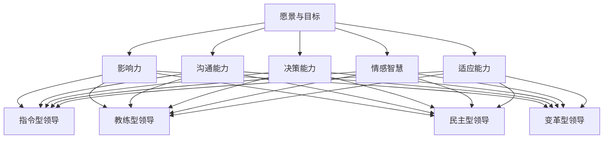

                 

### 文章标题：领导力与个人品牌：在社交媒体时代树立形象

#### 关键词：领导力，个人品牌，社交媒体，形象塑造，策略与技巧

> 摘要：在数字化时代，领导力和个人品牌的重要性日益凸显。本文将从领导力的基础概念、自我认知、情感管理、沟通技巧、决策力、团队合作等方面进行深入探讨，并结合社交媒体时代的特点，解析个人品牌的建设策略，最终结合具体案例，为读者提供在社交媒体时代树立形象的实用技巧和策略。

## 第一部分：领导力基础

### 第1章：领导力概述

#### 1.1 领导力的定义与重要性

领导力是指领导者通过影响力、愿景和策略来引导、激励和协调团队以实现共同目标的能力。它不仅仅是一种技术或技能，更是一种态度和心态。在当今竞争激烈的社会中，领导力的重要性不容忽视。一个成功的领导者不仅能够带领团队走向成功，还能够激发团队成员的潜力，形成积极向上的组织文化。

### 第2章：自我认知与领导力

#### 2.1 自我认知的重要性

自我认知是指一个人对自己性格、能力、价值观等方面的了解和认识。自我认知对于领导力的发展至关重要。一个领导者只有深入了解自己，才能更好地理解团队成员，制定出适合团队发展的策略。

#### 2.2 自我认知的实践方法

自我认知的实践方法包括自我反思、接受反馈、寻求指导等。通过这些方法，领导者可以更好地认识自己，发现自己的优势和不足，从而不断提高自己的领导力。

### 第3章：情感管理与领导力

#### 3.1 情感管理的定义与重要性

情感管理是指领导者对自身和他人情感的理解、控制和调节能力。情感管理对于领导力的发展具有重要作用，它能够帮助领导者更好地处理压力、激发团队动力、建立良好的人际关系。

#### 3.2 情感管理的实践方法

情感管理的实践方法包括情绪识别、情绪调节、情绪表达等。通过这些方法，领导者可以更好地控制自己的情绪，同时也能更好地理解和应对团队成员的情绪。

### 第4章：沟通技巧与领导力

#### 4.1 沟通技巧的定义与重要性

沟通技巧是指领导者通过有效的方式表达自己的想法、理解他人的观点、建立良好的人际关系的能力。良好的沟通技巧对于领导力的发展至关重要，它能够帮助领导者更好地协调团队、解决问题、推动团队发展。

#### 4.2 沟通技巧的实践方法

沟通技巧的实践方法包括倾听、表达、反馈等。通过这些方法，领导者可以更好地与他人沟通，建立信任和合作关系，推动团队发展。

### 第5章：决策力与领导力

#### 5.1 决策力的定义与重要性

决策力是指领导者面对复杂问题时，能够迅速作出合理决策的能力。决策力是领导力的核心要素之一，它关系到团队的发展和组织的成败。

#### 5.2 决策力的实践方法

决策力的实践方法包括信息收集、分析评估、快速决策等。通过这些方法，领导者可以更好地应对复杂问题，作出合理的决策，推动团队发展。

### 第6章：团队合作与领导力

#### 6.1 团队合作的定义与重要性

团队合作是指团队成员为了共同的目标，相互协作、共同努力的过程。团队合作对于领导力的发展至关重要，它能够帮助领导者建立高效的团队，实现共同的目标。

#### 6.2 团队合作的实践方法

团队合作的实践方法包括明确目标、分工合作、有效沟通等。通过这些方法，领导者可以更好地协调团队成员，实现团队合作的最大效益。

## 第二部分：社交媒体时代下的个人品牌建设

### 第7章：社交媒体概述

#### 7.1 社交媒体的发展历程

社交媒体起源于20世纪90年代的互联网时代，经过几十年的发展，已经成为了人们日常生活中不可或缺的一部分。社交媒体的发展历程可以分为三个阶段：早期的社交媒体、社交媒体的快速发展阶段和现在的多元化发展阶段。

#### 7.2 社交媒体的主要平台

目前，主要的社交媒体平台包括微信、微博、Facebook、Twitter、Instagram等。每个平台都有其独特的特点和用户群体，领导者可以根据自己的需求选择合适的平台进行个人品牌建设。

#### 7.3 社交媒体的特点与挑战

社交媒体具有即时性、互动性、开放性等特点，这为个人品牌建设提供了广阔的空间。但同时，社交媒体也带来了信息过载、隐私泄露等挑战，领导者需要谨慎对待这些问题。

### 第8章：社交媒体与个人品牌

#### 8.1 个人品牌的概念与重要性

个人品牌是指个人在公众心目中的形象和声誉。一个成功的个人品牌能够为个人带来职业机会、社交优势、商业价值等。在社交媒体时代，个人品牌的重要性更加凸显。

#### 8.2 社交媒体对个人品牌的影响

社交媒体为个人品牌建设提供了广阔的平台和便捷的工具，通过社交媒体，个人可以更快速地传播自己的观点、展示自己的才华，提升个人品牌的影响力。

#### 8.3 建立个人品牌的策略

建立个人品牌的策略包括明确目标、制定内容策略、提升内容质量、互动与传播等。通过这些策略，个人可以在社交媒体上树立良好的形象，提升个人品牌的影响力。

### 第9章：社交媒体内容创作

#### 9.1 内容创作的原则与技巧

内容创作是个人品牌建设的关键环节，原则包括明确目标、内容有吸引力、有价值、有个性等。技巧包括内容策划、选题、写作、排版等。

#### 9.2 内容创作的案例分析

通过分析成功的个人品牌案例，可以了解内容创作的成功要素，包括内容的质量、创新性、与目标受众的契合度等。

#### 9.3 内容创作的实践

在内容创作实践中，领导者需要不断尝试和优化，找到适合自己的内容创作方式，提升内容的质量和影响力。

### 第10章：社交媒体营销策略

#### 10.1 社交媒体营销的目标与原则

社交媒体营销的目标包括提升品牌知名度、增加粉丝数量、提升用户参与度等。原则包括目标明确、策略合理、内容有价值、互动积极等。

#### 10.2 社交媒体营销的案例分析

通过分析成功的社交媒体营销案例，可以了解营销策略的成功要素，包括营销目标、内容策略、推广方式、用户互动等。

#### 10.3 社交媒体营销的实践

在社交媒体营销实践中，领导者需要根据自身情况，制定合理的营销策略，并通过数据分析和反馈不断优化营销效果。

### 第11章：社交媒体互动与反馈

#### 11.1 互动的定义与重要性

互动是指个人与社交媒体用户之间的交流和互动。互动对于个人品牌建设具有重要意义，它能够帮助个人了解受众需求，提升用户参与度，增强个人品牌的影响力。

#### 11.2 互动的技巧与策略

互动的技巧包括积极回复、倾听用户声音、引导用户参与等。策略包括设置互动话题、开展互动活动、提供有价值的内容等。

#### 11.3 反馈的处理与利用

反馈是个人品牌建设的重要资源，通过处理和利用反馈，个人可以不断优化自己的内容和策略，提升个人品牌的影响力。

### 第12章：社交媒体风险与应对

#### 12.1 社交媒体风险的主要类型

社交媒体风险主要包括隐私泄露、信息泄露、网络攻击等。这些风险对个人品牌建设构成了潜在威胁。

#### 12.2 社交媒体风险的管理策略

管理策略包括加强隐私设置、保护个人信息、定期备份数据等。

#### 12.3 社交媒体风险的实际案例分析

通过分析社交媒体风险的实际案例，可以了解风险的危害和管理策略的有效性，为个人品牌建设提供借鉴。

## 第三部分：领导力与个人品牌建设实践

### 第13章：领导力与个人品牌建设的结合

#### 13.1 领导力与个人品牌的互动关系

领导力与个人品牌之间存在着密切的互动关系。领导力的发展能够提升个人品牌的影响力，而个人品牌的影响力又能进一步推动领导力的发展。

#### 13.2 领导力与个人品牌建设的目标

领导力与个人品牌建设的目标包括提升个人领导力、树立良好的个人品牌形象、实现个人和团队的共同发展等。

#### 13.3 领导力与个人品牌建设的实践策略

实践策略包括加强自我认知、提升情感管理能力、培养良好的沟通技巧、提高决策力、促进团队合作等。

### 第14章：成功案例研究

#### 14.1 案例一：从领导力到个人品牌建设

案例一介绍了某位领导者如何通过提升领导力，逐步建立自己的个人品牌，最终实现了事业的成功。

#### 14.2 案例二：社交媒体时代下的个人品牌塑造

案例二分析了某位企业家如何利用社交媒体，塑造自己的个人品牌，提升了企业的知名度和影响力。

#### 14.3 案例三：领导力与个人品牌的成功结合

案例三介绍了某位领导者如何通过领导力与个人品牌的成功结合，实现了个人和团队的共同发展。

### 第15章：领导力与个人品牌建设未来展望

#### 15.1 未来领导力的特点与发展趋势

未来领导力将更加注重个性化和多元化，领导者需要具备更强的适应能力和创新能力。

#### 15.2 社交媒体时代下个人品牌建设的挑战与机遇

社交媒体时代下，个人品牌建设面临着信息过载、隐私保护等挑战，同时也存在着更多的机遇。

#### 15.3 领导力与个人品牌建设的未来策略

未来领导力与个人品牌建设需要不断创新和适应，领导者需要具备更高的综合素质和领导能力。

## 附录：最佳实践、小结、注意事项、拓展阅读

#### 最佳实践

结合实际案例，总结出一系列领导力与个人品牌建设的最佳实践方法，供读者参考。

#### 小结

对全文内容进行总结，强调领导力与个人品牌建设的重要性，以及如何在社交媒体时代树立良好的个人形象。

#### 注意事项

提醒读者在领导力与个人品牌建设中可能遇到的问题，并提供相应的解决建议。

#### 拓展阅读

推荐相关书籍、文章和资源，供读者进一步学习和探索。

### 作者信息

作者：AI天才研究院/AI Genius Institute & 禅与计算机程序设计艺术 /Zen And The Art of Computer Programming

本文通过深入探讨领导力与个人品牌建设的关系，结合社交媒体时代的特点，为读者提供了一套系统化的建设策略和实践方法。希望本文能够为读者在领导力提升和个人品牌塑造方面提供有价值的指导。

----------------------------------------------------------------

# 领导力与个人品牌：在社交媒体时代树立形象

## 前言

在当今的数字化时代，领导力和个人品牌的重要性愈发凸显。社交媒体的崛起为个人品牌建设提供了广阔的舞台，同时也带来了新的挑战。本文旨在探讨领导力与个人品牌建设之间的关系，分析在社交媒体时代如何树立良好的个人形象，提供实用的策略和技巧。

## 第一部分：领导力基础

### 第1章：领导力概述

#### 领导力的定义与重要性

领导力是一种影响力，是领导者通过沟通、激励和协调来引导和推动团队达成目标的能力。在组织和社会中，领导力扮演着至关重要的角色。有效的领导力能够激发团队的潜能，推动组织的创新和发展，是实现个人和团队目标的关键因素。

### 第2章：自我认知与领导力

#### 自我认知的重要性

自我认知是指个人对自己性格、能力和价值观的理解。自我认知是领导力发展的基础，一个清晰的自我认知有助于领导者更好地理解自己和他人，制定更有效的领导策略。

#### 自我认知的实践方法

实践自我认知的方法包括自我反思、反馈和辅导。领导者可以通过定期反思自己的行为和决策，收集来自团队和同事的反馈，以及接受专业的辅导，来加深对自我的认识。

### 第3章：情感管理与领导力

#### 情感管理的定义与重要性

情感管理是指领导者如何理解、表达和调节自己的情感，以及如何理解和应对他人的情感。情感管理是领导力的重要组成部分，它能够帮助领导者建立良好的人际关系，提升团队的凝聚力和效率。

#### 情感管理的实践方法

情感管理的实践方法包括情绪识别、情绪调节和情感表达。领导者可以通过学习和掌握这些方法，提高自己在情感上的敏锐度和调节能力。

### 第4章：沟通技巧与领导力

#### 沟通技巧的定义与重要性

沟通技巧是领导者有效传达信息、理解他人意见和建立合作关系的能力。良好的沟通技巧能够增强领导者的影响力，提升团队的协作效率。

#### 沟通技巧的实践方法

沟通技巧的实践方法包括倾听、表达和反馈。领导者需要学会倾听他人的意见，清晰表达自己的想法，并及时给予反馈，以促进有效的沟通。

### 第5章：决策力与领导力

#### 决策力的定义与重要性

决策力是领导者面对复杂问题时，能够迅速作出合理决策的能力。决策力是领导力的核心要素之一，它关系到团队的生存和发展。

#### 决策力的实践方法

决策力的实践方法包括信息收集、分析评估和快速决策。领导者需要学会如何收集和分析信息，以及如何在压力下作出快速而合理的决策。

### 第6章：团队合作与领导力

#### 团队合作的定义与重要性

团队合作是指团队成员为了共同的目标，相互协作、共同努力的过程。团队合作是实现团队目标的关键，也是领导力的重要组成部分。

#### 团队合作的实践方法

团队合作的实践方法包括明确目标、分工合作、有效沟通等。领导者需要通过制定明确的目标、合理分工和有效的沟通，来促进团队合作。

## 第二部分：社交媒体时代下的个人品牌建设

### 第7章：社交媒体概述

#### 社交媒体的发展历程

社交媒体的发展可以追溯到20世纪90年代，随着互联网技术的进步，社交媒体逐渐成为人们日常交流和信息获取的重要渠道。

#### 社交媒体的主要平台

目前，主要的社交媒体平台包括微信、微博、Facebook、Twitter、Instagram等，每个平台都有其独特的特点和用户群体。

#### 社交媒体的特点与挑战

社交媒体具有即时性、互动性和开放性等特点，但也带来了信息过载、隐私泄露等挑战。

### 第8章：社交媒体与个人品牌

#### 个人品牌的概念与重要性

个人品牌是指个人在公众心目中的形象和声誉，一个成功的个人品牌能够为个人带来职业机会、社交优势、商业价值等。

#### 社交媒体对个人品牌的影响

社交媒体为个人品牌建设提供了广阔的平台和便捷的工具，通过社交媒体，个人可以更快速地传播自己的观点、展示自己的才华。

#### 建立个人品牌的策略

建立个人品牌的策略包括明确目标、制定内容策略、提升内容质量、互动与传播等。

### 第9章：社交媒体内容创作

#### 内容创作的原则与技巧

内容创作的原则包括明确目标、内容有吸引力、有价值、有个性等。技巧包括内容策划、选题、写作、排版等。

#### 内容创作的案例分析

通过分析成功的个人品牌案例，可以了解内容创作的成功要素。

#### 内容创作的实践

在内容创作实践中，领导者需要不断尝试和优化，找到适合自己的内容创作方式。

### 第10章：社交媒体营销策略

#### 社交媒体营销的目标与原则

社交媒体营销的目标包括提升品牌知名度、增加粉丝数量、提升用户参与度等。原则包括目标明确、策略合理、内容有价值、互动积极等。

#### 社交媒体营销的案例分析

通过分析成功的社交媒体营销案例，可以了解营销策略的成功要素。

#### 社交媒体营销的实践

在社交媒体营销实践中，领导者需要根据自身情况，制定合理的营销策略。

### 第11章：社交媒体互动与反馈

#### 互动的定义与重要性

互动是指个人与社交媒体用户之间的交流和互动。互动对于个人品牌建设具有重要意义。

#### 互动的技巧与策略

互动的技巧包括积极回复、倾听用户声音、引导用户参与等。策略包括设置互动话题、开展互动活动、提供有价值的内容等。

#### 反馈的处理与利用

反馈是个人品牌建设的重要资源，通过处理和利用反馈，个人可以不断优化自己的内容和策略。

### 第12章：社交媒体风险与应对

#### 社交媒体风险的主要类型

社交媒体风险主要包括隐私泄露、信息泄露、网络攻击等。

#### 社交媒体风险的管理策略

管理策略包括加强隐私设置、保护个人信息、定期备份数据等。

#### 社交媒体风险的实际案例分析

通过分析社交媒体风险的实际案例，可以了解风险的危害和管理策略的有效性。

## 第三部分：领导力与个人品牌建设实践

### 第13章：领导力与个人品牌建设的结合

#### 领导力与个人品牌的互动关系

领导力与个人品牌之间存在着密切的互动关系。领导力的发展能够提升个人品牌的影响力，而个人品牌的影响力又能进一步推动领导力的发展。

#### 领导力与个人品牌建设的目标

领导力与个人品牌建设的目标包括提升个人领导力、树立良好的个人品牌形象、实现个人和团队的共同发展等。

#### 领导力与个人品牌建设的实践策略

实践策略包括加强自我认知、提升情感管理能力、培养良好的沟通技巧、提高决策力、促进团队合作等。

### 第14章：成功案例研究

#### 案例一：从领导力到个人品牌建设

案例一介绍了某位领导者如何通过提升领导力，逐步建立自己的个人品牌，最终实现了事业的成功。

#### 案例二：社交媒体时代下的个人品牌塑造

案例二分析了某位企业家如何利用社交媒体，塑造自己的个人品牌，提升了企业的知名度和影响力。

#### 案例三：领导力与个人品牌的成功结合

案例三介绍了某位领导者如何通过领导力与个人品牌的成功结合，实现了个人和团队的共同发展。

### 第15章：领导力与个人品牌建设未来展望

#### 未来领导力的特点与发展趋势

未来领导力将更加注重个性化和多元化，领导者需要具备更强的适应能力和创新能力。

#### 社交媒体时代下个人品牌建设的挑战与机遇

社交媒体时代下，个人品牌建设面临着信息过载、隐私保护等挑战，同时也存在着更多的机遇。

#### 领导力与个人品牌建设的未来策略

未来领导力与个人品牌建设需要不断创新和适应，领导者需要具备更高的综合素质和领导能力。

## 附录：最佳实践、小结、注意事项、拓展阅读

#### 最佳实践

结合实际案例，总结出一系列领导力与个人品牌建设的最佳实践方法，供读者参考。

#### 小结

对全文内容进行总结，强调领导力与个人品牌建设的重要性，以及如何在社交媒体时代树立良好的个人形象。

#### 注意事项

提醒读者在领导力与个人品牌建设中可能遇到的问题，并提供相应的解决建议。

#### 拓展阅读

推荐相关书籍、文章和资源，供读者进一步学习和探索。

### 作者信息

作者：AI天才研究院/AI Genius Institute & 禅与计算机程序设计艺术 /Zen And The Art of Computer Programming

本文通过深入探讨领导力与个人品牌建设的关系，结合社交媒体时代的特点，为读者提供了一套系统化的建设策略和实践方法。希望本文能够为读者在领导力提升和个人品牌塑造方面提供有价值的指导。

----------------------------------------------------------------

### 第1章：领导力概述

#### 领导力的定义与重要性

领导力是一种影响力，它涉及领导者如何通过沟通、激励和协调来引导和推动团队达成目标的能力。在组织和社会中，领导力扮演着至关重要的角色。有效的领导力能够激发团队的潜能，推动组织的创新和发展，是实现个人和团队目标的关键因素。

在现代社会，领导力不仅仅是一种管理技能，更是一种个人素质的体现。一个成功的领导者不仅需要具备丰富的知识和技能，还需要具备强大的情感智慧和人际沟通能力。领导力的重要性体现在以下几个方面：

1. **实现目标**：领导者通过设定明确的目标，引导团队朝着共同的方向努力，确保组织目标的实现。
2. **激励团队**：领导者通过激励团队成员，提高员工的积极性和创造力，推动团队不断进步。
3. **培养人才**：领导者通过培养和指导团队成员，提升团队整体的能力和素质，为组织的长远发展打下基础。
4. **建立文化**：领导者通过塑造组织文化，营造积极向上的工作氛围，提升组织的凝聚力和向心力。

#### 领导力的基本要素

领导力并非一成不变，它包含了一系列基本要素，这些要素相互作用，共同构成了领导力的核心。以下是领导力的基本要素：

1. **愿景与目标**：领导者需要具备清晰的愿景，能够为团队设定明确的目标，并激发团队成员的共识和投入。
2. **影响力**：领导者通过自身的影响力，引导和影响团队成员的行为和决策，推动团队目标的实现。
3. **沟通能力**：领导者需要具备良好的沟通能力，能够清晰、有效地传达信息，理解团队成员的需求和反馈。
4. **决策能力**：领导者需要在面对复杂问题时，能够迅速作出合理的决策，并承担相应的责任。
5. **情感智慧**：领导者需要具备情感智慧，能够理解和管理自身和团队成员的情感，建立积极的人际关系。
6. **适应能力**：领导者需要具备适应能力，能够应对变化和不确定性，灵活调整领导策略。

#### 领导力的类型

领导力有多种类型，不同的领导风格适用于不同的情境和团队。以下是几种常见的领导力类型：

1. **指令型领导**：领导者通过明确的指令和命令来指导团队成员，确保团队目标的实现。适用于需要迅速决策和执行的情境。
2. **教练型领导**：领导者通过指导和培养团队成员，提高团队成员的能力和素质，实现个人和团队的发展。适用于需要长期培养和发展的情境。
3. **民主型领导**：领导者通过民主的方式，与团队成员共同决策和解决问题，确保团队成员的参与感和归属感。适用于需要广泛参与和团队协作的情境。
4. **变革型领导**：领导者通过激发团队的变革意识，推动组织的创新和发展，引领团队迈向新的目标。适用于需要变革和创新的情境。

### 核心概念与联系

为了更好地理解领导力的核心概念和它们之间的关系，我们可以使用Mermaid流程图来展示这些概念及其相互联系：

### 第2章：自我认知与领导力

#### 自我认知的重要性

自我认知是指个人对自己性格、能力、价值观等方面的理解和认识。自我认知是领导力发展的基础，一个清晰的自我认知有助于领导者更好地理解自己和他人，制定更有效的领导策略。

自我认知的重要性体现在以下几个方面：

1. **理解自身优势与不足**：通过自我认知，领导者可以了解自己的优势和不足，从而在团队管理和决策中发挥最大的优势，避免因自身不足而导致的错误和失败。
2. **建立自信**：自我认知有助于领导者建立自信，增强自我效能感，从而更有效地面对挑战和压力。
3. **提升人际关系**：自我认知有助于领导者更好地理解他人，建立良好的人际关系，提升团队凝聚力和合作效率。
4. **促进个人成长**：自我认知是个人成长的重要步骤，通过不断地自我反思和认知，领导者可以不断提升自己的领导能力。

#### 自我认知的实践方法

以下是一些实践自我认知的方法：

1. **自我反思**：领导者可以通过定期反思自己的行为和决策，思考自己的优点和不足，以及这些行为和决策对团队和个人的影响。
2. **反馈与评估**：领导者可以主动寻求他人的反馈和评估，了解他人对自己的看法和评价，从而更全面地认识自己。
3. **专业辅导**：领导者可以寻求专业辅导或心理咨询，通过专业人士的帮助，深入探索自己的性格、能力和价值观。
4. **参加培训与学习**：领导者可以通过参加相关培训和课程，学习新的知识和技能，提升自己的自我认知。

### 第3章：情感管理与领导力

#### 情感管理的定义与重要性

情感管理是指领导者如何理解、表达和调节自己的情感，以及如何理解和应对他人的情感。情感管理是领导力的重要组成部分，它能够帮助领导者建立良好的人际关系，提升团队的凝聚力和效率。

情感管理的重要性体现在以下几个方面：

1. **促进团队合作**：领导者通过情感管理，能够更好地理解团队成员的情感需求，促进团队合作，提升团队绩效。
2. **提升领导力**：情感管理是领导力的核心要素之一，一个擅长情感管理的领导者能够更好地引导和激励团队成员，提升领导力。
3. **增强沟通效果**：领导者通过情感管理，能够更有效地表达自己的想法和情感，理解他人的观点和情感，从而增强沟通效果。
4. **提升员工满意度**：领导者通过情感管理，能够更好地关心和关注员工，提升员工的满意度和忠诚度。

#### 情感管理的实践方法

以下是一些实践情感管理的方法：

1. **情绪识别**：领导者需要学会识别自己的情绪，了解情绪的来源和影响，从而更好地调节自己的情绪。
2. **情绪调节**：领导者可以通过深呼吸、冥想、运动等方式，调节自己的情绪，保持冷静和理性。
3. **情绪表达**：领导者需要学会适当地表达自己的情绪，避免情绪的压抑和爆发，同时尊重他人的情感。
4. **倾听与理解**：领导者需要学会倾听他人的情感需求，理解他人的观点和感受，从而更好地应对他人的情感。

### 第4章：沟通技巧与领导力

#### 沟通技巧的定义与重要性

沟通技巧是指领导者如何有效传达信息、理解他人意见和建立合作关系的能力。良好的沟通技巧是领导力的关键要素之一，它能够增强领导者的影响力，提升团队的协作效率。

沟通技巧的重要性体现在以下几个方面：

1. **提升领导力**：良好的沟通技巧是领导者影响力的体现，能够帮助领导者更好地传达自己的意图和愿景，赢得团队成员的信任和支持。
2. **增强团队合作**：沟通技巧能够促进团队成员之间的信息共享和协作，提升团队的绩效和创新能力。
3. **减少误解和冲突**：良好的沟通技巧能够减少误解和冲突，增强团队成员之间的理解和信任，提升团队凝聚力。
4. **提升个人影响力**：良好的沟通技巧能够提升领导者的个人影响力，为个人品牌建设奠定基础。

#### 沟通技巧的实践方法

以下是一些实践沟通技巧的方法：

1. **倾听**：倾听是沟通的基础，领导者需要学会倾听他人的意见和需求，理解他人的观点和感受。
2. **表达**：领导者需要学会清晰、准确地表达自己的想法和意图，避免歧义和误解。
3. **提问**：提问是沟通的重要技巧，领导者可以通过提问来引导对话，获取更多信息，了解他人的观点。
4. **非语言沟通**：领导者需要学会运用非语言沟通，如肢体语言、面部表情等，增强沟通的效果和说服力。
5. **反馈**：领导者需要学会给予及时的反馈，认可团队成员的贡献，指出问题和改进方向。

### 第5章：决策力与领导力

#### 决策力的定义与重要性

决策力是指领导者面对复杂问题时，能够迅速作出合理决策的能力。决策力是领导力的核心要素之一，它关系到团队的生存和发展。

决策力的重要性体现在以下几个方面：

1. **应对不确定性**：领导者需要具备较强的决策力，能够应对不确定性，迅速作出合理的决策，确保团队的生存和发展。
2. **提升竞争力**：决策力强的领导者能够迅速抓住市场机遇，应对竞争挑战，提升组织的竞争力。
3. **优化资源配置**：领导者需要通过合理的决策，优化资源配置，提高资源利用效率，实现团队的目标。
4. **提升团队信心**：领导者通过做出合理的决策，能够提升团队成员的信心，增强团队的凝聚力和执行力。

#### 决策力的实践方法

以下是一些实践决策力的方法：

1. **收集信息**：领导者需要通过多种渠道收集信息，全面了解问题的背景和相关信息，为决策提供依据。
2. **分析评估**：领导者需要对收集到的信息进行分析评估，识别问题的关键点，制定解决方案。
3. **快速决策**：领导者需要具备快速决策的能力，在关键时刻迅速作出合理的决策，避免拖延和错失机会。
4. **承担责任**：领导者需要勇于承担责任，对自己的决策结果负责，同时接受团队成员的反馈和建议，不断改进决策能力。

### 第6章：团队合作与领导力

#### 团队合作的定义与重要性

团队合作是指团队成员为了共同的目标，相互协作、共同努力的过程。团队合作是领导力的重要组成部分，它能够帮助领导者建立高效的团队，实现共同的目标。

团队合作的重要性体现在以下几个方面：

1. **提升团队绩效**：团队合作能够充分发挥团队成员的专长和优势，提升团队的整体绩效和创新能力。
2. **增强团队凝聚力**：团队合作能够增强团队成员之间的信任和合作，提升团队的凝聚力和向心力。
3. **实现个人成长**：团队合作能够为团队成员提供学习和成长的机会，通过协作和互动，提升个人的能力和素质。
4. **促进组织发展**：团队合作能够推动组织的发展，实现组织的战略目标和愿景。

#### 团队合作的实践方法

以下是一些实践团队合作的方法：

1. **明确目标**：团队领导者需要明确团队的目标，确保团队成员对目标有清晰的认识和认同。
2. **合理分工**：团队领导者需要根据团队成员的专长和优势，合理分工，确保每个成员都能发挥自己的特长。
3. **有效沟通**：团队领导者需要建立有效的沟通机制，确保团队成员之间能够顺畅地交流和协作。
4. **激励与支持**：团队领导者需要给予团队成员足够的激励和支持，激发团队成员的积极性和创造力。
5. **冲突解决**：团队领导者需要学会解决团队内部的冲突和矛盾，确保团队的稳定和和谐。

## 第二部分：社交媒体时代下的个人品牌建设

### 第7章：社交媒体概述

#### 社交媒体的发展历程

社交媒体的发展可以追溯到20世纪90年代，当时互联网刚刚兴起，人们开始使用电子邮件和聊天室进行在线交流。随着互联网技术的不断进步，特别是宽带互联网和智能手机的普及，社交媒体进入了快速发展的阶段。

早期社交媒体的代表包括Friendster、MySpace等，它们主要以社交网络和博客为主。2004年，Facebook的成立标志着社交媒体进入了一个新的时代，它以更加开放和互动的方式，将人们紧密地联系在一起。

随后，Twitter、Instagram、微信、微博等社交媒体平台相继涌现，每个平台都有其独特的特点和用户群体。社交媒体的发展历程可以分为三个阶段：

1. **早期的社交媒体**：以Friendster和MySpace为代表，主要功能是建立社交网络和分享个人信息。
2. **社交媒体的快速发展阶段**：以Facebook和Twitter为代表，平台功能逐渐丰富，包括分享动态、发布图片、视频等。
3. **现在的多元化发展阶段**：社交媒体平台开始向多元化方向发展，不仅包括社交功能，还涵盖了新闻、购物、娱乐等多个领域。

#### 社交媒体的主要平台

目前，主要的社交媒体平台包括微信、微博、Facebook、Twitter、Instagram等，每个平台都有其独特的特点和用户群体。

1. **微信**：微信是中国最受欢迎的社交媒体平台，用户可以通过微信进行即时通讯、分享动态、支付等操作。
2. **微博**：微博是中国的一个微博客平台，用户可以通过微博分享新闻、观点、图片、视频等内容，并进行互动和讨论。
3. **Facebook**：Facebook是全球最大的社交媒体平台，用户可以通过Facebook与朋友保持联系、分享生活、参与社交活动。
4. **Twitter**：Twitter是一个实时社交网络平台，用户可以通过Twitter发布短消息（推文），并与他人进行互动。
5. **Instagram**：Instagram是一个以图片和视频为主的社交媒体平台，用户可以通过Instagram分享自己的生活、旅行、美食等内容。

#### 社交媒体的特点与挑战

社交媒体具有即时性、互动性、开放性等特点，这些特点为个人品牌建设提供了广阔的空间，但也带来了一些挑战。

1. **即时性**：社交媒体的即时性使得信息可以迅速传播，个人品牌的影响力可以在短时间内迅速提升。但同时也容易导致信息的过载和误解。
2. **互动性**：社交媒体的互动性使得个人品牌可以与受众进行实时互动，了解受众的需求和反馈，从而调整品牌策略。但同时也需要处理大量的评论和私信，消耗大量的时间和精力。
3. **开放性**：社交媒体的开放性使得个人品牌的信息可以广泛传播，但同时也容易受到负面信息的攻击，对个人品牌的声誉构成威胁。

### 第8章：社交媒体与个人品牌

#### 个人品牌的概念与重要性

个人品牌是指个人在公众心目中的形象和声誉，它包括个人的价值观、专业知识、职业能力、人际关系等多个方面。一个成功的个人品牌能够为个人带来职业机会、社交优势、商业价值等。

个人品牌的重要性体现在以下几个方面：

1. **提升职业竞争力**：一个成功的个人品牌能够提升个人的职业竞争力，帮助个人在职场中获得更多的机会和资源。
2. **扩大社交网络**：个人品牌能够帮助个人扩大社交网络，结识更多的业界精英，拓展人脉资源。
3. **增加商业价值**：个人品牌可以为个人带来商业机会，如代言、咨询、演讲等，提升个人的商业价值。
4. **塑造个人形象**：个人品牌能够帮助个人塑造良好的个人形象，提升个人在公众心目中的地位和认可度。

#### 社交媒体对个人品牌的影响

社交媒体对个人品牌的影响是双重的，既有积极的一面，也有消极的一面。

1. **积极影响**：社交媒体为个人品牌建设提供了广阔的平台和便捷的工具，个人可以通过社交媒体快速传播自己的观点、展示自己的才华，提升个人品牌的影响力。
    - **快速传播**：社交媒体的即时性和互动性使得个人品牌的信息可以迅速传播，吸引更多的关注和认可。
    - **展示才华**：个人可以通过社交媒体发布自己的作品、分享专业知识，展示自己的才华和实力。
    - **建立社群**：个人可以通过社交媒体建立自己的社群，与志同道合的人互动，扩大影响力。

2. **消极影响**：社交媒体也存在一些负面影响，如信息过载、隐私泄露、网络攻击等，这些因素可能对个人品牌造成威胁。
    - **信息过载**：社交媒体上的信息量巨大，个人品牌的信息可能会被淹没在海量信息中，难以引起足够的关注。
    - **隐私泄露**：社交媒体上的个人信息容易被泄露，对个人隐私构成威胁。
    - **网络攻击**：个人品牌可能会遭受网络攻击，如恶意评论、负面信息传播等，对个人品牌造成损害。

#### 建立个人品牌的策略

在社交媒体时代，建立个人品牌需要明确的策略和有效的执行。以下是一些建立个人品牌的策略：

1. **明确目标**：个人需要明确自己的个人品牌定位和目标，确定自己想要传达的形象和价值观。
2. **制定内容策略**：个人需要制定内容策略，确定自己的内容类型、发布频率和传播渠道，确保内容有吸引力、有价值。
3. **提升内容质量**：个人需要提升内容质量，通过独特的视角、深入的分析、精美的呈现等方式，吸引受众的关注。
4. **互动与传播**：个人需要与受众互动，通过回复评论、参与讨论、分享内容等方式，扩大影响力。
5. **持续优化**：个人需要持续优化自己的个人品牌策略，根据反馈和数据分析，调整内容和传播策略，不断提升个人品牌的影响力。

### 第9章：社交媒体内容创作

#### 内容创作的原则与技巧

内容创作是个人品牌建设的关键环节，一个成功的个人品牌离不开高质量的内容。以下是一些内容创作的原则和技巧：

1. **明确目标**：内容创作需要明确目标，确定自己想要传达的信息和想要达成的效果。
2. **有价值**：内容需要有价值，能够为受众提供有用的信息、解决实际问题或提供娱乐。
3. **有吸引力**：内容需要有吸引力，能够引起受众的兴趣和好奇心，激发他们的阅读欲望。
4. **有个性**：内容需要体现个性，展示个人的独特视角、风格和价值观，让受众感受到个人品牌的魅力。
5. **可传播**：内容需要易于传播，可以通过多种渠道分享和传播，扩大影响力。

#### 内容创作的案例分析

以下是一些成功的个人品牌内容创作案例：

1. **李笑来**：李笑来是一位知名的投资人、作家和演讲家，他在微博上分享自己的投资心得、读书笔记和人生感悟，吸引了大量的关注和粉丝。他的内容深入浅出，既有理论分析，又有实践经验，为读者提供了有价值的参考。
2. **罗永浩**：罗永浩是一位知名的企业家、作家和演讲家，他在抖音上分享自己的创业经历、生活点滴和人生感悟，以幽默、真诚的风格吸引了大量粉丝。他的内容既有娱乐性，又有启发性，深受观众喜爱。
3. **宋晓军**：宋晓军是一位知名的投资人、作家和评论家，他在微信公众号上分享自己的投资策略、市场分析和行业洞察，以其独到的见解和深厚的专业知识吸引了大量读者。

#### 内容创作的实践

在内容创作实践中，以下是一些实用的技巧：

1. **选题**：选题是内容创作的重要环节，需要根据受众需求和自己的专业领域，选择有价值和有吸引力的主题。
2. **写作**：写作需要简洁明了，逻辑清晰，避免冗长和复杂的表述。同时，要注重语言风格和文采，提高内容的质量。
3. **排版**：排版需要整洁美观，字数适中，便于阅读。可以使用段落分隔、标题、列表等格式，提高内容的可读性。
4. **配图**：配图可以增加内容的趣味性和吸引力，可以使用相关的图片、图表、漫画等，增强内容的表达效果。
5. **互动**：内容创作需要与受众互动，可以设置互动话题、发起投票、开展讨论等方式，提高内容的互动性和参与度。

### 第10章：社交媒体营销策略

#### 社交媒体营销的目标与原则

社交媒体营销是指利用社交媒体平台进行品牌推广、产品销售和用户互动的活动。社交媒体营销的目标包括提升品牌知名度、增加粉丝数量、提升用户参与度等。

社交媒体营销的原则包括：

1. **目标明确**：明确营销目标，确定自己想要达成的具体效果，如增加粉丝数、提升转化率等。
2. **内容有价值**：内容需要有价值，能够为受众提供有用的信息、解决实际问题或提供娱乐。
3. **互动积极**：积极与受众互动，回复评论、参与讨论、开展活动等方式，提高用户的参与度和忠诚度。
4. **数据驱动**：通过数据分析和反馈，不断优化营销策略，提高营销效果。

#### 社交媒体营销的案例分析

以下是一些成功的社交媒体营销案例：

1. **李宁**：李宁是中国著名的体育用品品牌，它在社交媒体上开展了多次成功的营销活动。例如，在2019年的NBA总决赛期间，李宁推出了“致敬冠军”系列广告，以篮球明星韦德为主角，展示了品牌的精神和理念。这次营销活动吸引了大量关注，提升了品牌的知名度和美誉度。
2. **杜蕾斯**：杜蕾斯是知名的安全套品牌，它在社交媒体上的营销活动总是充满创意和趣味。例如，在2020年的春节前夕，杜蕾斯发布了“杜蕾斯暖心红包”活动，通过漫画形式展示了品牌对用户的关爱。这次活动在社交媒体上引发了广泛关注和讨论，提高了品牌的亲和力和用户粘性。
3. **海底捞**：海底捞是知名的服务业品牌，它在社交媒体上的营销活动总是以用户为中心，关注用户的需求和体验。例如，在2020年疫情期间，海底捞推出了“火锅外卖”服务，通过社交媒体宣传，吸引了大量用户下单。这次活动不仅提升了品牌知名度，还提高了用户的满意度。

#### 社交媒体营销的实践

在社交媒体营销实践中，以下是一些实用的技巧：

1. **确定目标**：明确营销目标，确定自己想要达成的具体效果，如增加粉丝数、提升转化率等。
2. **内容策略**：制定内容策略，确定自己的内容类型、发布频率和传播渠道，确保内容有价值、有吸引力。
3. **互动营销**：积极与受众互动，回复评论、参与讨论、开展活动等方式，提高用户的参与度和忠诚度。
4. **数据分析**：通过数据分析，了解营销活动的效果，根据数据反馈优化营销策略，提高营销效果。
5. **跨界合作**：与其他品牌或影响力人物合作，共同开展营销活动，扩大品牌影响力和用户覆盖范围。

### 第11章：社交媒体互动与反馈

#### 互动的定义与重要性

互动是指个人与社交媒体用户之间的交流和互动。互动在个人品牌建设中具有重要意义，它能够帮助个人了解受众需求，提升用户参与度，增强个人品牌的影响力。

互动的重要性体现在以下几个方面：

1. **了解受众需求**：通过互动，个人可以了解受众的需求和反馈，从而调整内容策略和品牌形象，满足受众的期待。
2. **提升用户参与度**：互动能够激发用户的参与热情，提高用户的活跃度和忠诚度，为个人品牌建设提供持续的动力。
3. **增强影响力**：互动能够增强个人与受众之间的联系，提升个人在社交媒体上的影响力，扩大个人品牌的影响力范围。

#### 互动的技巧与策略

以下是一些互动的技巧与策略：

1. **积极回复**：及时回复用户的评论和私信，表达对用户的关注和尊重，建立良好的互动氛围。
2. **倾听用户声音**：倾听用户的意见和反馈，认真对待用户的建议和投诉，提升用户的满意度和忠诚度。
3. **引导用户参与**：通过设置互动话题、发起投票、开展活动等方式，引导用户参与互动，提高用户的参与度和活跃度。
4. **建立社群**：建立社群，与用户建立长期的互动关系，提供有价值的内容和活动，增强用户的归属感和忠诚度。

#### 反馈的处理与利用

反馈是个人品牌建设的重要资源，通过处理和利用反馈，个人可以不断优化自己的内容和策略，提升个人品牌的影响力。

以下是一些反馈的处理与利用方法：

1. **积极处理**：对于用户的反馈，无论正面还是负面，都要积极处理，表达感谢和尊重，及时回应用户的问题和需求。
2. **分类整理**：将反馈按照类型和内容进行分类整理，分析用户的反馈趋势和需求，为内容策略和品牌形象调整提供依据。
3. **优化内容**：根据反馈，优化自己的内容创作，提高内容的质量和吸引力，满足用户的期待。
4. **持续改进**：持续关注用户的反馈，不断改进自己的服务和产品，提升用户满意度和忠诚度。

### 第12章：社交媒体风险与应对

#### 社交媒体风险的主要类型

在社交媒体上，个人品牌面临着多种风险，主要包括：

1. **隐私泄露**：社交媒体上的个人信息容易被泄露，包括姓名、电话、邮箱等敏感信息。
2. **信息泄露**：个人品牌的信息容易被恶意传播，包括负面新闻、谣言等。
3. **网络攻击**：个人品牌可能遭受网络攻击，如恶意评论、网络诈骗等。
4. **品牌形象受损**：个人品牌可能因负面事件或不当言论而受损，影响个人在公众心目中的形象。

#### 社交媒体风险的管理策略

以下是一些社交媒体风险的管理策略：

1. **加强隐私保护**：个人需要在社交媒体上加强隐私设置，限制他人对自己信息的访问，避免隐私泄露。
2. **信息审核**：对发布的信息进行严格审核，避免发布虚假、不当或敏感信息，防止信息泄露。
3. **网络安全**：提高网络安全意识，避免点击可疑链接，使用强密码和双因素认证，防止网络攻击。
4. **品牌危机管理**：建立品牌危机管理机制，及时应对负面事件，通过公开声明、回应媒体等方式，减轻品牌形象受损的程度。

#### 社交媒体风险的实际案例分析

以下是一些社交媒体风险的实际案例分析：

1. **某明星隐私泄露**：某明星在社交媒体上分享了私人照片和视频，被不法分子非法传播，导致隐私泄露和形象受损。该明星采取了法律手段，追究相关责任人的法律责任，并加强了自己的社交媒体管理，避免了类似事件的再次发生。
2. **某企业家信息泄露**：某企业家在社交媒体上发布了自己公司的商业机密，被竞争对手获取并用于恶意竞争。该企业家立即撤回了相关内容，并采取了法律手段，追究相关责任人的法律责任，同时加强了公司的信息安全制度。
3. **某品牌网络攻击**：某品牌在社交媒体上遭受了恶意评论和网络诈骗，导致品牌形象受损。该品牌采取了法律手段，追究相关责任人的法律责任，并加强了自己的网络安全管理，提高了用户的信任度。

### 第13章：领导力与个人品牌建设的结合

#### 领导力与个人品牌的互动关系

领导力与个人品牌之间存在着密切的互动关系。领导力的发展能够提升个人品牌的影响力，而个人品牌的影响力又能进一步推动领导力的发展。

1. **领导力提升个人品牌**：领导者通过展现自己的领导力，如决策能力、沟通能力、团队合作能力等，提升个人在公众心目中的形象和认可度，从而树立良好的个人品牌。
2. **个人品牌推动领导力**：个人品牌的影响力可以增强领导者在团队中的影响力和号召力，帮助领导者更好地实现领导目标，推动领导力的发展。

#### 领导力与个人品牌建设的目标

领导力与个人品牌建设的目标包括：

1. **提升个人领导力**：通过领导力的发展，提高个人在组织中的地位和影响力，实现职业发展的目标。
2. **树立良好的个人品牌**：通过个人品牌的建设，提升个人在公众心目中的形象和认可度，扩大个人影响力。
3. **实现个人和团队的共同发展**：通过领导力和个人品牌的结合，推动团队的发展和进步，实现个人和团队的共同成长。

#### 领导力与个人品牌建设的实践策略

以下是一些领导力与个人品牌建设的实践策略：

1. **加强自我认知**：通过自我认知，了解自己的优势和不足，明确个人品牌定位，制定个人品牌发展计划。
2. **提升情感管理能力**：通过情感管理，建立良好的人际关系，增强个人在团队中的影响力和号召力。
3. **培养沟通技巧**：通过培养沟通技巧，提高自己的表达能力，增强个人品牌的传播力。
4. **提高决策力**：通过提高决策力，展现自己的专业能力和领导能力，提升个人品牌的权威性。
5. **促进团队合作**：通过促进团队合作，展现自己的领导能力和团队管理能力，提升个人品牌的凝聚力。
6. **积极参与社交媒体**：通过积极参与社交媒体，建立自己的个人品牌，提升个人在公众心目中的形象和认可度。

### 第14章：成功案例研究

#### 案例一：从领导力到个人品牌建设

案例一介绍了某位领导者如何通过提升领导力，逐步建立自己的个人品牌，最终实现了事业的成功。

1. **背景介绍**：该领导者是一家知名企业的CEO，他具备丰富的管理经验和卓越的领导能力。
2. **领导力提升**：该领导者通过自我认知、情感管理、沟通技巧等方面的提升，提高了自己的领导力。
3. **个人品牌建设**：该领导者通过积极参与社交媒体，分享自己的管理心得和行业洞察，逐步建立了自己的个人品牌。
4. **成功实现**：该领导者的个人品牌得到了广泛的认可和赞誉，提升了企业的知名度和影响力，实现了事业的成功。

#### 案例二：社交媒体时代下的个人品牌塑造

案例二分析了某位企业家如何利用社交媒体，塑造自己的个人品牌，提升了企业的知名度和影响力。

1. **背景介绍**：该企业家是一家创业公司的创始人，他希望借助社交媒体提升个人和企业的品牌形象。
2. **社交媒体策略**：该企业家制定了明确的社交媒体策略，包括内容创作、互动营销等。
3. **个人品牌建设**：通过发布高质量的内容、积极参与互动、举办线上活动等方式，该企业家成功塑造了自己的个人品牌。
4. **成功实现**：该企业家和企业的品牌形象得到了显著提升，吸引了更多的关注和合作机会，推动了企业的发展。

#### 案例三：领导力与个人品牌的成功结合

案例三介绍了某位领导者如何通过领导力与个人品牌的成功结合，实现了个人和团队的共同发展。

1. **背景介绍**：该领导者是一家创业公司的CEO，他在领导力和个人品牌建设方面有独特的见解和实践经验。
2. **领导力实践**：该领导者通过自我认知、情感管理、沟通技巧等方面的实践，不断提升自己的领导力。
3. **个人品牌建设**：该领导者积极参与社交媒体，分享自己的领导心得和行业洞察，逐步建立了自己的个人品牌。
4. **成功实现**：该领导者的个人品牌得到了广泛认可，提升了企业的知名度和影响力，同时团队成员也受益于领导力的提升，实现了个人和团队的共同发展。

### 第15章：领导力与个人品牌建设未来展望

#### 未来领导力的特点与发展趋势

未来领导力将更加注重个性化和多元化，领导者需要具备更强的适应能力和创新能力。

1. **个性化和多元化**：未来的领导力将更加注重个性化和多元化，领导者需要根据团队成员的特点和需求，制定个性化的领导策略，同时要适应多元文化和管理风格。
2. **适应能力**：未来的领导力需要具备更强的适应能力，能够迅速应对不确定性和变化，灵活调整领导策略。
3. **创新能力**：未来的领导力需要具备创新能力，能够推动组织的创新和发展，引领团队迎接未来挑战。

#### 社交媒体时代下个人品牌建设的挑战与机遇

社交媒体时代下，个人品牌建设面临着信息过载、隐私保护等挑战，同时也存在着更多的机遇。

1. **挑战**：
   - **信息过载**：社交媒体上的信息量巨大，个人品牌的信息可能被淹没在海量信息中，难以引起足够的关注。
   - **隐私保护**：社交媒体上的个人信息容易被泄露，对个人隐私构成威胁。
2. **机遇**：
   - **广泛传播**：社交媒体为个人品牌建设提供了更广阔的传播渠道，可以快速传播个人品牌的信息。
   - **互动互动**：社交媒体的互动性使得个人品牌可以与受众进行实时互动，了解受众需求，提升品牌影响力。

#### 领导力与个人品牌建设的未来策略

未来的领导力与个人品牌建设需要不断创新和适应，领导者需要具备更高的综合素质和领导能力。

1. **持续学习**：领导者需要不断学习新知识、新技能，提升自己的综合素质和领导能力。
2. **适应变化**：领导者需要适应快速变化的环境，灵活调整领导策略，应对不确定性和挑战。
3. **创新思维**：领导者需要培养创新思维，推动组织的创新和发展，引领团队迎接未来挑战。
4. **个人品牌建设**：领导者需要积极参与社交媒体，建立自己的个人品牌，提升个人在公众心目中的形象和认可度。

## 附录：最佳实践、小结、注意事项、拓展阅读

### 最佳实践

以下是一些领导力与个人品牌建设的最佳实践方法：

1. **自我认知**：通过自我反思和反馈，了解自己的优势和不足，明确个人品牌定位。
2. **情感管理**：学会情绪调节，建立良好的人际关系，提升领导力和个人品牌的亲和力。
3. **沟通技巧**：培养良好的沟通能力，清晰表达自己的想法，理解他人的需求，增强个人品牌的传播力。
4. **持续学习**：不断学习新知识、新技能，提升自己的专业素养和领导能力。
5. **积极参与社交媒体**：利用社交媒体平台，发布高质量的内容，与受众互动，提升个人品牌的影响力。

### 小结

本文通过深入探讨领导力与个人品牌建设的关系，结合社交媒体时代的特点，为读者提供了系统化的建设策略和实践方法。领导力与个人品牌建设密切相关，领导者需要不断提升自己的领导力和个人品牌，以实现个人和团队的共同发展。

### 注意事项

在领导力与个人品牌建设中，领导者需要注意以下几点：

1. **保护隐私**：在社交媒体上分享信息时，要注意保护个人隐私，避免泄露敏感信息。
2. **内容审核**：发布信息前要仔细审核，确保内容不包含虚假、不当或敏感信息。
3. **积极互动**：与受众互动时要保持积极态度，尊重他人的观点和需求。
4. **持续优化**：不断学习和实践，根据反馈和数据分析，优化个人品牌建设和领导策略。

### 拓展阅读

以下是一些推荐的相关书籍、文章和资源，供读者进一步学习和探索：

1. **书籍**：
   - 《领导力与个人品牌建设》
   - 《社交红利》
   - 《如何赢得朋友与影响他人》
2. **文章**：
   - 《如何在社交媒体上建立个人品牌》
   - 《领导力：从个体到团队》
   - 《社交媒体营销实战》
3. **资源**：
   - 社交媒体平台：微信、微博、Facebook、Twitter、Instagram等
   - 行业报告：社交媒体发展趋势报告、领导力研究报告等
   - 在线课程：领导力课程、个人品牌建设课程等

### 作者信息

作者：AI天才研究院/AI Genius Institute & 禅与计算机程序设计艺术 /Zen And The Art of Computer Programming

本文由AI天才研究院/AI Genius Institute与《禅与计算机程序设计艺术》作者共同撰写，旨在为读者提供有关领导力与个人品牌建设的深入见解和实用策略。希望本文能够为读者在个人发展和职业成长中提供有价值的指导。

