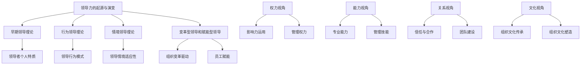
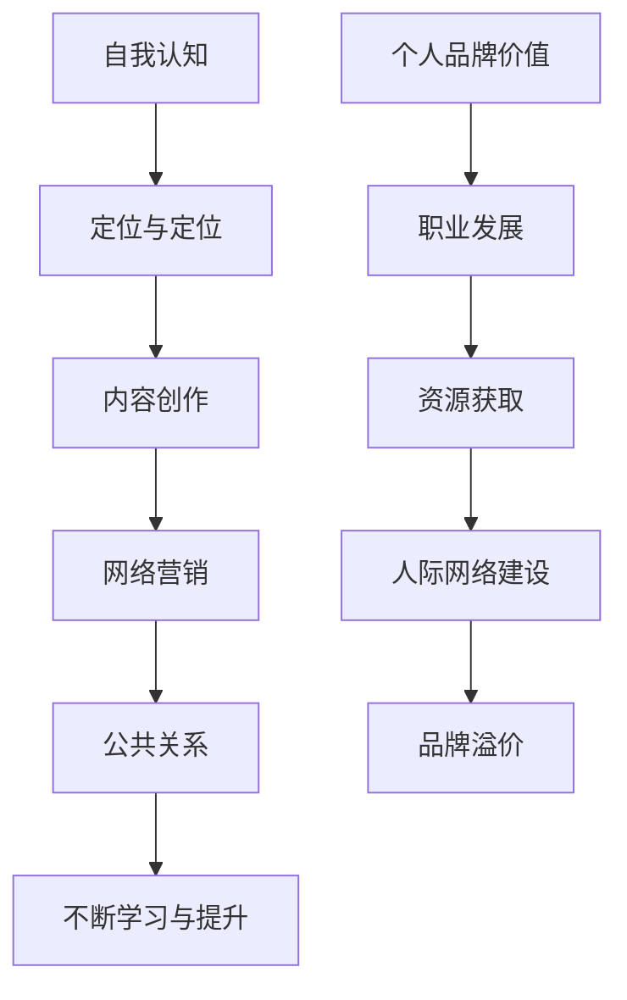
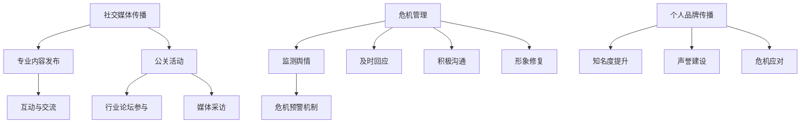
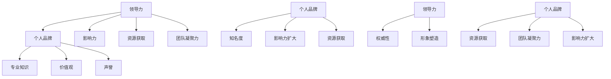
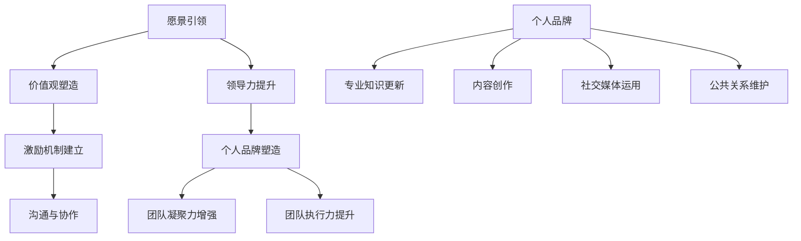

                 

## 文章标题

### 《领导力与个人品牌：树立影响力》

在信息技术高速发展的时代，领导力与个人品牌成为个人和团队成功的关键因素。本文旨在通过系统性的分析和详细的解释，探讨领导力与个人品牌的定义、构建方法及其在团队管理中的实际应用，最终帮助读者树立影响力，提升个人与团队的综合竞争力。本文将采用逻辑清晰、结构紧凑的方式，结合实际案例和实践指南，提供全面、深入的见解。

---

### 关键词

- **领导力**
- **个人品牌**
- **影响力**
- **团队管理**
- **领导风格**
- **品牌传播**

---

### 摘要

本文首先对领导力和个人品牌的概念进行详细定义和背景介绍，然后通过具体案例阐述其在信息技术领域的应用。接着，文章深入探讨领导力的核心要素和领导风格，以及个人品牌的构建和传播策略。通过分析国内外领导力与个人品牌的成功案例，文章总结了建立领导力与个人品牌的实践指南，并提供实用的策略和工具。最终，文章强调在信息技术领域，树立领导力和个人品牌的重要性，为读者提供全面的指导和启示。

---

## 第一部分：领导力的理论基础

### 第1章 领导力的定义与内涵

#### 1.1 领导力的起源与演变

领导力作为一个历史悠久且不断发展的概念，其起源可以追溯到古代社会。在早期的部落社会中，领导者通过智慧、勇气和力量来组织和管理群体。随着时间的推移，领导力的定义和内涵逐渐丰富，从传统的权威型领导发展到现代的变革型领导和赋能型领导。

**1.1.1 领导力的发展历程**

- **早期领导理论**：早期领导理论主要关注领导者个人的特质和能力，如托马斯·卡莱尔的《英雄、首领与英雄崇拜》提出了领导者的个性特征。
- **行为领导理论**：20世纪初期，领导学者开始关注领导者的行为模式，如凯茨（Katzenbach）和史密斯（Smith）提出了领导行为的四个方面：指导、激励、沟通和决策。
- **情境领导理论**：赫塞和布兰查德（Hersey and Blanchard）提出的情境领导理论强调领导者应根据不同情境调整领导风格，以达到最佳效果。
- **变革型领导和赋能型领导**：近年来，领导力研究逐渐关注领导者在推动组织变革和赋能员工方面的作用，如伯恩斯（Burns）提出的变革型领导和德鲁克（Drucker）提出的赋能型领导。

**1.1.2 领导力的多维视角**

- **权力视角**：领导力被视为一种权力的运用，领导者通过影响和指导他人来实现目标。
- **能力视角**：领导力被视为一种能力的体现，领导者具备影响他人并有效管理团队的能力。
- **关系视角**：领导力被视为一种关系的构建，领导者通过与团队成员建立信任和合作关系来推动团队发展。
- **文化视角**：领导力被视为一种文化的传承，领导者通过塑造和传承组织文化来引导团队行为。

#### 1.2 领导力的核心要素

- **明确的目标**：领导者必须能够设定清晰、具体的目标，并使团队成员理解并认同这些目标。
- **有效沟通**：领导者需要具备良好的沟通技巧，能够清晰传达信息，理解团队成员的需求和反馈。
- **激励与激励**：领导者应能够激励团队成员，激发他们的潜能，并建立积极的激励机制。
- **决策能力**：领导者需要在面对复杂情境时，能够做出明智的决策，并承担相应的责任。
- **团队建设**：领导者应注重团队建设，促进团队成员之间的协作和信任，营造积极的工作氛围。

**1.2.1 领导力与管理的区别**

- **领导力**：主要关注愿景、目标和价值观的引导，强调启发和激励团队成员。
- **管理**：主要关注资源、流程和效率的优化，强调控制和协调。
- **关系**：领导力强调与团队成员建立信任和合作关系，管理则强调权威和指令。

**1.2.2 领导力的重要原则**

- **以身作则**：领导者应以身作则，树立榜样，以自身的言行影响和激励团队成员。
- **持续学习**：领导者应保持学习的态度，不断提升自己的知识和技能，以适应快速变化的环境。
- **透明沟通**：领导者应保持透明沟通，让团队成员了解组织的目标、决策过程和面临的挑战。
- **包容与多样性**：领导者应尊重团队成员的多样性和个性，建立包容性的团队文化。

### 背景介绍

在信息技术领域，领导力的重要性尤为突出。信息技术行业变化快速，创新不断，领导者不仅需要具备专业知识和技能，还需要具备强大的适应能力和创新精神，以引领团队不断前进。此外，个人品牌在信息技术领域同样至关重要。一个具有强大个人品牌的领导者，能够吸引更多的资源和支持，提升团队的整体竞争力。因此，理解和掌握领导力与个人品牌的相关知识和技能，对信息技术领域的个人和团队来说至关重要。

#### 核心概念与联系

为了更好地理解领导力的核心概念和联系，我们可以通过以下Mermaid流程图来展示领导力的多维视角及其相互关系：



通过这个流程图，我们可以清晰地看到领导力在不同历史时期的发展和演变，以及领导力的多维视角及其相互关系。这为后续章节的详细讨论提供了基础。

#### 核心算法原理讲解

在探讨领导力的核心要素时，我们可以使用以下伪代码来解释领导力的一些关键原则：

```pseudo
function leadershipPrinciples() {
    // 设定清晰目标
    set clearGoal();
    // 进行有效沟通
    communicateEffectively();
    // 激励与激励
    motivateTeamMembers();
    // 做出明智决策
    makeSmartDecisions();
    // 团队建设
    buildTeam();
    // 以身作则
    leadByExample();
    // 持续学习
    continuousLearning();
    // 透明沟通
    transparentCommunication();
    // 尊重多样性与包容
    respectDiversityAndInclusion();
}

function setClearGoal() {
    // 设定具体、可衡量的目标
    // 分享目标，确保团队成员理解
}

function communicateEffectively() {
    // 使用清晰、简洁的语言
    // 倾听团队成员的需求和反馈
}

function motivateTeamMembers() {
    // 激发团队成员的潜能
    // 建立积极的激励机制
}

function makeSmartDecisions() {
    // 收集信息，分析各种方案
    // 基于事实和数据做出决策
}

function buildTeam() {
    // 促进团队成员之间的协作
    // 建立信任和合作关系
}

function leadByExample() {
    // 以自己的言行树立榜样
    // 体现领导力的核心价值观
}

function continuousLearning() {
    // 不断学习新知识和技能
    // 适应快速变化的环境
}

function transparentCommunication() {
    // 保持沟通透明度
    // 让团队成员了解组织目标、决策过程和挑战
}

function respectDiversityAndInclusion() {
    // 尊重团队成员的多样性和个性
    // 建立包容性的团队文化
}
```

通过上述伪代码，我们可以直观地看到领导力的核心原则及其实现方法，这有助于读者更好地理解和应用这些原则。

### 数学模型和公式

为了更深入地探讨领导力的核心要素，我们可以使用以下数学模型和公式来解释领导力的影响力和团队绩效之间的关系：

$$
影响力 = f(领导力要素，情境因素，团队成员特征)
$$

其中，$影响力$ 是领导力要素、情境因素和团队成员特征共同作用的结果。具体公式如下：

$$
影响力 = 权力视角 \times 能力视角 \times 关系视角 \times 文化视角
$$

$$
绩效 = f(目标设定，沟通能力，激励机制，决策能力，团队建设，领导风格)
$$

其中，$绩效$ 是领导力在设定目标、沟通能力、激励机制、决策能力、团队建设和领导风格等方面共同作用的结果。公式体现了领导力对团队绩效的直接影响。

通过这些数学模型和公式，我们可以更准确地量化领导力的影响力和团队绩效，为实际应用提供科学依据。

### 举例说明

为了更好地理解领导力的核心要素，我们可以通过以下实际案例进行说明：

**案例：乔布斯的领导力**

乔布斯是一位极具影响力的领导者，他在苹果公司的领导下，推动了多个革命性的产品创新，如iPhone、iPad等。他的领导力体现在以下几个方面：

- **目标设定**：乔布斯对产品的要求极为苛刻，他设定了明确的目标，如创建用户界面简洁、易于使用的产品。
- **沟通能力**：乔布斯善于使用简洁、有力的语言进行沟通，他能够清晰地传达自己的想法，并激发团队成员的创造力。
- **激励机制**：乔布斯通过激励措施，如奖金、股权等，激发了团队成员的工作热情和创新能力。
- **决策能力**：在面对复杂的市场和技术挑战时，乔布斯能够做出明智的决策，带领团队克服困难。
- **团队建设**：乔布斯重视团队建设，他鼓励团队成员之间的合作和分享，营造了一个积极、创新的工作氛围。
- **领导风格**：乔布斯采用了变革型领导风格，他通过愿景和价值观的引导，带领团队不断突破自我，实现卓越的成果。

通过这个案例，我们可以看到领导力的核心要素在实际应用中的具体体现，这对于理解和应用领导力具有重要的指导意义。

### 总结与展望

本章对领导力的定义与内涵进行了全面介绍，探讨了领导力的发展历程和核心要素，并通过实际案例和数学模型加深了对领导力的理解。领导力作为个人和团队成功的关键因素，在信息技术领域尤为重要。通过理解领导力的核心概念和联系，读者可以更好地应用这些原则，提升自己的领导力和团队绩效。在下一章中，我们将进一步探讨领导风格与团队建设，为读者提供更全面的领导力理论体系。

---

### 提示与拓展阅读

- **最佳实践 tips**：在构建领导力时，不仅要关注个人特质和技能的提升，还要注重团队文化的建设，营造一个积极、包容的工作氛围。
- **注意事项**：领导力不是一成不变的，领导者应不断学习和适应变化，以保持其有效性。
- **拓展阅读**：推荐阅读《变革型领导力》、《领导力的五项修炼》等书籍，以深入了解领导力的理论与实践。

---

## 第二部分：个人品牌的打造

### 第3章 个人品牌的概念与价值

#### 3.1 个人品牌的基本概念

个人品牌是指个人在社会上所建立的认知和声誉，它反映了个人在特定领域内的专业能力和影响力。个人品牌不仅包括个人的专业技能和知识，还涵盖了个人的价值观、人格特质和声誉。

**3.1.1 个人品牌的定义**

- **专业形象**：个人品牌体现了个人在专业领域内的形象和认知，如技术专家、管理人才等。
- **价值观和人格特质**：个人品牌也反映了个人的价值观和人格特质，如正直、勤奋、创新等。
- **声誉**：个人品牌还与个人的声誉紧密相关，包括个人在社会上的影响力、认可度和美誉度。

**3.1.2 个人品牌的价值**

个人品牌的价值体现在多个方面，包括职业发展、资源获取、人际网络建设等。

- **职业发展**：强大的个人品牌可以帮助个人在职场中获得更多机会，如晋升、职业转型等。
- **资源获取**：个人品牌有助于个人获取更多资源，如资金、技术支持、合作伙伴等。
- **人际网络建设**：个人品牌有助于建立更广泛的人际网络，提高个人在社会上的影响力。
- **品牌溢价**：在商业领域，强大的个人品牌可以带来品牌溢价，提升产品的市场竞争力和商业价值。

#### 3.2 个人品牌的构建

构建个人品牌是一个系统性的过程，需要从多个方面进行规划和实施。

**3.2.1 自我认知**

构建个人品牌的第一步是进行自我认知，明确个人的价值观、兴趣和优势。这有助于个人明确自己的定位和目标，为后续的品牌构建提供方向。

**3.2.2 定位与定位**

定位是个人品牌构建的关键环节，需要明确个人在特定领域内的定位和差异化优势。这包括确定个人品牌的核心价值和独特卖点，以便在竞争激烈的市场中脱颖而出。

**3.2.3 内容创作**

内容创作是构建个人品牌的重要手段，通过撰写专业文章、发表演讲、参与论坛等方式，可以提升个人在专业领域内的知名度和影响力。

**3.2.4 网络营销**

网络营销是构建个人品牌的重要途径，通过社交媒体、专业网站等平台，可以扩大个人品牌的传播范围，提高品牌认知度。

**3.2.5 公共关系**

公共关系是构建个人品牌的重要环节，通过与媒体、行业领袖和专家建立良好的关系，可以提升个人品牌的声誉和影响力。

**3.2.6 不断学习与提升**

构建个人品牌需要持续的学习和提升，包括专业知识和技能的提升、人际交往能力的增强等。只有不断进步，才能保持个人品牌的竞争力。

#### 核心概念与联系

为了更好地理解个人品牌的构建过程，我们可以通过以下Mermaid流程图展示其关键环节和相互关系：



通过这个流程图，我们可以清晰地看到个人品牌构建的各个环节及其相互关系，这为后续章节的详细讨论提供了基础。

#### 核心算法原理讲解

在构建个人品牌时，我们可以使用以下伪代码来解释关键步骤和方法：

```pseudo
function buildPersonalBrand() {
    // 自我认知
    selfAwareness();
    // 定位与定位
    positioning();
    // 内容创作
    contentCreation();
    // 网络营销
    onlineMarketing();
    // 公共关系
    publicRelations();
    // 不断学习与提升
    continuousImprovement();
}

function selfAwareness() {
    // 明确价值观、兴趣和优势
    // 分析个人在特定领域的定位
}

function positioning() {
    // 确定核心价值和独特卖点
    // 在市场中脱颖而出
}

function contentCreation() {
    // 撰写专业文章
    // 发表演讲和参与论坛
}

function onlineMarketing() {
    // 利用社交媒体平台
    // 维护专业网站和个人博客
}

function publicRelations() {
    // 与媒体、行业领袖建立关系
    // 提升品牌声誉和影响力
}

function continuousImprovement() {
    // 持续学习新知识和技能
    // 不断提升个人综合素质
}
```

通过上述伪代码，我们可以直观地看到个人品牌构建的关键步骤和方法，这有助于读者更好地理解和应用这些原则。

### 数学模型和公式

为了更深入地探讨个人品牌的构建过程，我们可以使用以下数学模型和公式来解释个人品牌的价值和影响力：

$$
品牌价值 = f(专业知识，声誉，影响力，网络资源)
$$

其中，$品牌价值$ 是个人在专业知识、声誉、影响力和网络资源等方面的综合体现。具体公式如下：

$$
影响力 = 声誉 \times 网络资源
$$

$$
资源获取 = 品牌价值 \times 影响力
$$

$$
职业发展 = 资源获取 \times 个人努力
$$

通过这些数学模型和公式，我们可以更准确地量化个人品牌的价值和影响力，为实际应用提供科学依据。

### 举例说明

为了更好地理解个人品牌的构建过程，我们可以通过以下实际案例进行说明：

**案例：雷军的个人品牌**

雷军是一位在信息技术领域具有强大个人品牌的领导者。他在小米公司的领导下，成功塑造了小米品牌，并在市场上取得了巨大成功。他的个人品牌体现在以下几个方面：

- **专业知识**：雷军在计算机科学和企业管理方面具有深厚的专业知识，这使得他在技术和管理领域具有很高的权威性。
- **声誉**：雷军在行业内享有良好的声誉，他的成功案例和专业知识得到了广泛的认可和尊重。
- **影响力**：雷军通过社交媒体和公开演讲，积极传播自己的理念和经验，影响了很多年轻人。
- **网络资源**：雷军拥有广泛的人际网络，包括投资者、合作伙伴和行业专家，这些资源为他的事业提供了有力的支持。

通过这个案例，我们可以看到个人品牌的构建是一个系统性的过程，需要从多个方面进行规划和实施。这为读者提供了有益的启示和借鉴。

### 总结与展望

本章对个人品牌的基本概念和价值进行了详细阐述，并介绍了构建个人品牌的步骤和方法。个人品牌在职业发展和资源获取中具有重要作用，理解和掌握个人品牌的构建策略对于个人和团队的成功至关重要。在下一章中，我们将进一步探讨个人品牌的传播与维护，为读者提供更全面的个人品牌管理指南。

---

### 提示与拓展阅读

- **最佳实践 tips**：在构建个人品牌时，要注重内容的质量和影响力，确保每一篇文章、每一次演讲都有价值。
- **注意事项**：个人品牌建设需要持续的努力和投入，不能急于求成，要持之以恒。
- **拓展阅读**：推荐阅读《个人品牌力》、《品牌营销实战》等书籍，以深入了解个人品牌的构建和管理。

---

## 第三部分：个人品牌的传播与维护

### 第4章 个人品牌的传播与维护

#### 4.1 个人品牌的传播渠道

在当今信息时代，个人品牌的传播渠道多种多样，包括社交媒体、专业网站、公共关系活动等。选择合适的传播渠道，能够有效提升个人品牌的知名度和影响力。

**4.1.1 社交媒体在个人品牌传播中的作用**

社交媒体平台如LinkedIn、微博、微信公众号等，是个人品牌传播的重要渠道。通过这些平台，个人可以发布专业文章、分享行业动态、展示个人成果，与行业内的专家和同行建立联系。

- **发布专业内容**：在社交媒体上发布高质量的原创内容，如技术博客、行业分析等，可以吸引同行的关注。
- **互动与交流**：通过社交媒体与读者、同行互动，建立良好的沟通渠道，提高个人品牌的亲和力和影响力。
- **建立个人形象**：通过社交媒体展示个人的专业形象和价值观，塑造积极的个人品牌。

**4.1.2 公关活动的重要性**

公关活动是个人品牌传播的重要手段，包括行业论坛、技术研讨会、媒体采访等。通过这些活动，个人可以扩大自己的知名度，提高在行业内的声誉。

- **行业论坛**：参与行业论坛，分享专业知识和经验，可以提高个人在行业内的知名度。
- **技术研讨会**：组织或参与技术研讨会，展示个人在技术领域的专业能力，吸引更多同行关注。
- **媒体采访**：接受媒体采访，通过媒体平台传播个人观点和成就，提高个人品牌的曝光率。

#### 4.2 个人品牌的危机管理

在个人品牌传播过程中，可能会遇到各种挑战和危机，如负面评价、不当言论等。有效的危机管理能够迅速应对危机，减少负面影响，维护个人品牌的声誉。

**4.2.1 危机识别与预警**

- **监测网络舆情**：通过搜索引擎、社交媒体等渠道，监测个人品牌相关的舆情动态，及时识别潜在危机。
- **建立危机预警机制**：制定危机预警和应对方案，确保在危机发生时能够迅速采取行动。

**4.2.2 应对策略与恢复**

- **及时回应**：在危机发生时，及时发布声明或回应，公开透明地处理问题，避免信息不透明导致的误解。
- **积极沟通**：与受影响的相关方进行有效沟通，了解他们的需求和反馈，提供解决方案。
- **形象修复**：通过正面行动和宣传，修复个人品牌形象，重建公众信任。

#### 核心概念与联系

个人品牌的传播与维护是一个复杂的过程，涉及到多个方面的要素。为了更好地理解这一过程，我们可以通过以下Mermaid流程图展示其关键环节和相互关系：



通过这个流程图，我们可以清晰地看到个人品牌传播与维护的各个环节及其相互关系，这为后续章节的详细讨论提供了基础。

#### 核心算法原理讲解

在个人品牌传播与维护过程中，我们可以使用以下伪代码来解释关键步骤和方法：

```pseudo
function personalBrandCommunication() {
    // 发布专业内容
    publishContent();
    // 互动与交流
    interactAndCommunicate();
    // 参与公关活动
    participateInPRActivities();
    // 监测网络舆情
    monitorOnlineSentiment();
    // 建立危机预警机制
    establishCrisisWarningSystem();
    // 及时回应危机
    respondToCrisis();
    // 积极沟通与修复形象
    activeCommunicationAndImageRepair();
}

function publishContent() {
    // 分发专业博客、文章、报告等
    // 确保内容质量和影响力
}

function interactAndCommunicate() {
    // 在社交媒体上与读者互动
    // 建立积极的个人形象
}

function participateInPRActivities() {
    // 参与行业论坛、研讨会
    // 提升知名度
}

function monitorOnlineSentiment() {
    // 监测社交媒体和搜索引擎的舆情
    // 及时识别潜在危机
}

function establishCrisisWarningSystem() {
    // 制定危机预警和应对方案
    // 减少危机带来的负面影响
}

function respondToCrisis() {
    // 及时发布声明或回应
    // 公开透明地处理问题
}

function activeCommunicationAndImageRepair() {
    // 与受影响的相关方沟通
    // 采取积极措施修复个人品牌形象
}
```

通过上述伪代码，我们可以直观地看到个人品牌传播与维护的关键步骤和方法，这有助于读者更好地理解和应用这些原则。

### 数学模型和公式

为了更深入地探讨个人品牌的传播与维护，我们可以使用以下数学模型和公式来解释个人品牌传播的效果：

$$
品牌传播效果 = f(传播渠道，内容质量，互动频率，危机管理能力)
$$

其中，$品牌传播效果$ 是个人品牌在不同传播渠道、内容质量、互动频率和危机管理能力等方面的综合体现。具体公式如下：

$$
知名度 = 传播渠道 \times 互动频率
$$

$$
声誉建设 = 品牌传播效果 \times 内容质量
$$

$$
危机管理能力 = f(监测能力，预警机制，危机应对策略)
$$

通过这些数学模型和公式，我们可以更准确地评估个人品牌传播的效果，为实际应用提供科学依据。

### 举例说明

为了更好地理解个人品牌的传播与维护，我们可以通过以下实际案例进行说明：

**案例：李开复的个人品牌传播**

李开复是一位在人工智能领域具有强大个人品牌的专家。他在个人品牌传播方面采取了多种策略，取得了显著的效果：

- **专业内容发布**：李开复通过微博、博客等社交媒体平台，定期发布专业文章和行业分析，吸引了大量读者的关注。
- **互动与交流**：他积极参与行业论坛、研讨会，与同行互动，建立了广泛的联系。
- **公关活动**：李开复多次接受媒体采访，通过电视、报纸等媒体传播自己的观点和成就。
- **危机管理**：在面对负面评价和争议时，李开复保持了冷静和理性，通过公开回应和沟通，有效化解了危机，维护了个人品牌的声誉。

通过这个案例，我们可以看到个人品牌传播与维护的关键在于内容质量、互动频率和危机管理能力的综合运用。这为读者提供了有益的启示和借鉴。

### 总结与展望

本章对个人品牌的传播与维护进行了详细探讨，介绍了社交媒体、公关活动等传播渠道的重要性，并强调了危机管理在品牌传播中的关键作用。通过理解和掌握个人品牌传播与维护的策略，个人可以提升自己的知名度、声誉和影响力，为职业发展和资源获取提供有力支持。在下一章中，我们将进一步探讨领导力与个人品牌的结合，为读者提供更全面的领导力与个人品牌管理指南。

---

### 提示与拓展阅读

- **最佳实践 tips**：在传播个人品牌时，要注重内容的质量和创新，确保每一篇文章、每一次演讲都有独特的价值。
- **注意事项**：在危机管理中，要迅速响应，保持沟通的透明和积极，以减少负面影响。
- **拓展阅读**：推荐阅读《社交媒体营销实战》、《危机管理指南》等书籍，以深入了解个人品牌传播与维护的实战技巧。

---

## 第三部分：领导力与个人品牌的结合

### 第5章 领导力与个人品牌的协同作用

#### 5.1 领导力与个人品牌的关系

领导力与个人品牌之间存在紧密的联系和相互作用。领导力是个人品牌的重要组成部分，而个人品牌则可以增强领导力的影响力。

**5.1.1 领导力对个人品牌的影响**

- **提升知名度**：强大的领导力可以使个人在团队和组织中获得更高的知名度和认可度，进而提升个人品牌的价值。
- **建立权威性**：领导力体现在决策能力、沟通技巧和团队建设等方面，这些能力使领导者具备权威性和影响力，为个人品牌增色。
- **塑造形象**：领导者的行为和决策直接影响个人品牌的形象，一个优秀的领导者能够树立良好的个人品牌形象。

**5.1.2 个人品牌对领导力的影响**

- **资源获取**：个人品牌有助于领导者获取更多的资源，包括资金、技术和人力等，这些资源可以增强领导力的影响力。
- **团队凝聚力**：强大的个人品牌可以增强团队的凝聚力，使团队成员更愿意追随和信任领导者。
- **影响力扩大**：个人品牌可以扩大领导者在行业内的知名度和影响力，使其在更大范围内产生影响。

#### 5.2 卓越领导者的个人品牌塑造

卓越的领导者不仅具备出色的领导力，还具备强大的个人品牌。个人品牌成为领导者影响力的倍增器，使其在领导过程中更加得心应手。

**5.2.1 个人品牌的核心价值**

- **专业知识**：领导者通过持续学习和专业研究，积累深厚的专业知识，成为行业内的权威。
- **价值观**：领导者树立明确的价值观，如诚信、责任和协作，这些价值观成为个人品牌的基石。
- **声誉**：领导者通过良好的行为和决策，树立良好的声誉，赢得公众的信任和尊重。

**5.2.2 个人品牌塑造的策略**

- **持续学习**：领导者应保持持续学习的态度，不断提升自己的知识和技能，以保持个人品牌的竞争力。
- **内容创作**：领导者通过撰写专业文章、发表演讲等方式，展示自己的专业知识和见解，提高个人品牌的知名度。
- **网络营销**：领导者利用社交媒体、专业网站等平台，扩大个人品牌的传播范围，提高品牌影响力。
- **公共关系**：领导者通过参与公关活动、接受媒体采访等方式，提升个人品牌的曝光率和知名度。

**5.2.3 个人品牌与领导风格的融合**

- **变革型领导**：变革型领导通过塑造个人品牌，展示自己的愿景和价值观，激励团队成员实现组织目标。
- **赋能型领导**：赋能型领导通过个人品牌的影响力，赋能团队成员，推动他们实现个人和组织的共同发展。

#### 核心概念与联系

为了更好地理解领导力与个人品牌的关系，我们可以通过以下Mermaid流程图展示其相互关系：



通过这个流程图，我们可以清晰地看到领导力与个人品牌之间的相互作用和相互促进，这为后续章节的详细讨论提供了基础。

#### 核心算法原理讲解

在探讨领导力与个人品牌的协同作用时，我们可以使用以下伪代码来解释两者之间的关系和相互作用：

```pseudo
function leadershipAndPersonalBrandSynergy() {
    // 提升领导力
    enhanceLeadership();
    // 塑造个人品牌
    buildPersonalBrand();
    // 个人品牌增强领导力
    personalBrandEnhancesLeadership();
    // 领导力增强个人品牌
    leadershipEnhancesPersonalBrand();
}

function enhanceLeadership() {
    // 提升专业知识
    improveProfessionalKnowledge();
    // 增强决策能力
    strengthenDecisionMaking();
    // 提高沟通技巧
    enhanceCommunicationSkills();
    // 加强团队建设
    improveTeamBuilding();
}

function buildPersonalBrand() {
    // 持续学习
    continuousLearning();
    // 内容创作
    contentCreation();
    // 网络营销
    onlineMarketing();
    // 公共关系
    publicRelations();
}

function personalBrandEnhancesLeadership() {
    // 提升知名度
    increaseFame();
    // 扩大影响力
    expandInfluence();
    // 获取更多资源
    acquireMoreResources();
}

function leadershipEnhancesPersonalBrand() {
    // 塑造权威形象
    shapeAuthoritativeImage();
    // 提高团队凝聚力
    enhanceTeamCohesion();
    // 增强个人品牌影响力
    enhancePersonalBrandInfluence();
}
```

通过上述伪代码，我们可以直观地看到领导力与个人品牌之间的相互作用和协同作用，这有助于读者更好地理解和应用这些原则。

### 数学模型和公式

为了更深入地探讨领导力与个人品牌的协同作用，我们可以使用以下数学模型和公式来解释两者之间的关系：

$$
领导力影响力 = f(领导力要素，个人品牌要素)
$$

其中，$领导力影响力$ 是领导力要素和个人品牌要素共同作用的结果。具体公式如下：

$$
个人品牌影响力 = 品牌知名度 \times 品牌声誉
$$

$$
领导力影响力 = f(专业知识，价值观，决策能力，沟通技巧，团队建设，品牌知名度，品牌声誉)
$$

通过这些数学模型和公式，我们可以更准确地量化领导力与个人品牌之间的相互作用，为实际应用提供科学依据。

### 举例说明

为了更好地理解领导力与个人品牌的协同作用，我们可以通过以下实际案例进行说明：

**案例：马云的领导力与个人品牌**

马云是一位在全球范围内具有巨大影响力的企业家和领导者。他在阿里巴巴的领导下，成功塑造了阿里巴巴品牌，并在全球范围内产生了深远的影响。他的领导力与个人品牌之间的协同作用体现在以下几个方面：

- **专业知识**：马云在电子商务和互联网领域具有深厚的专业知识，这使他成为行业内的权威。
- **价值观**：马云强调“让天下没有难做的生意”，这一价值观深入人心，成为阿里巴巴品牌的核心价值。
- **品牌知名度**：马云通过多次公开演讲、发表文章和接受媒体采访，大幅提升了个人品牌的知名度。
- **影响力扩大**：马云的个人品牌影响力不仅限于中国，还扩展到了全球，使他成为全球企业家和领导者的榜样。

通过这个案例，我们可以看到领导力与个人品牌之间的紧密联系和协同作用。这为读者提供了有益的启示和借鉴。

### 总结与展望

本章对领导力与个人品牌的关系进行了深入探讨，分析了两者之间的相互作用和协同作用。通过理解和掌握领导力与个人品牌的结合策略，领导者可以提升自己的领导力和个人品牌，为团队和组织的发展提供有力支持。在下一章中，我们将进一步探讨领导力与个人品牌在团队管理中的应用，为读者提供更全面的实践指南。

---

### 提示与拓展阅读

- **最佳实践 tips**：在塑造个人品牌时，要注重与领导力的结合，确保个人品牌的核心价值观与领导力原则相一致。
- **注意事项**：领导力与个人品牌的结合需要长期的积累和不断的努力，不能急于求成。
- **拓展阅读**：推荐阅读《领导力与个人品牌：提升影响力》、《卓越领导者的个人品牌建设》等书籍，以深入了解领导力与个人品牌的协同作用。

---

## 第四部分：领导力与个人品牌在团队管理中的应用

### 第6章 领导力与个人品牌在团队管理中的应用

#### 6.1 如何通过个人品牌提升领导力

个人品牌在团队管理中扮演着重要角色，通过有效的个人品牌管理，领导者可以提升自己的领导力，增强团队凝聚力和执行力。

**6.1.1 个人品牌对领导力的影响**

- **增强权威性**：一个强大的个人品牌能够增强领导者的权威性和影响力，使团队成员更愿意接受和遵循领导者的决策和指导。
- **提高公信力**：领导者通过个人品牌展示出的专业知识和价值观，能够提升其在团队中的公信力，使团队成员更加信任和尊重领导者。
- **促进团队建设**：个人品牌的建设过程中，领导者需要与团队成员建立良好的关系，这有助于促进团队建设，增强团队凝聚力。

**6.1.2 个人品牌与领导风格的融合**

- **变革型领导**：变革型领导通过塑造个人品牌，展示自己的愿景和价值观，激励团队成员实现组织目标。
- **赋能型领导**：赋能型领导通过个人品牌的影响力，赋能团队成员，推动他们实现个人和组织的共同发展。
- **民主型领导**：民主型领导通过个人品牌建立与团队成员的信任关系，鼓励团队成员参与决策，提升团队的自主性和创新能力。

**6.1.3 提升领导力的个人品牌管理策略**

- **专业知识的持续更新**：领导者应通过不断学习和研究，保持专业知识的更新，以展示其在行业内的权威性和前瞻性。
- **内容的持续创作**：领导者应定期发表专业文章、演讲和报告，分享自己的见解和经验，提升个人品牌的知名度和影响力。
- **社交媒体的积极运用**：领导者应充分利用社交媒体平台，与行业内的专家和同行互动，建立广泛的人脉关系，扩大个人品牌的影响力。
- **公共关系的主动维护**：领导者应积极参与行业论坛、技术研讨会等活动，提升个人品牌的曝光率和知名度，增强个人品牌的影响力。

#### 6.2 领导力与个人品牌在团队管理中的应用策略

- **愿景引领**：领导者通过个人品牌展示出清晰的愿景和目标，引导团队朝着共同的目标前进。
- **价值观塑造**：领导者通过个人品牌传达出明确的价值观，塑造团队的文化和氛围。
- **激励机制建立**：领导者通过个人品牌的影响力，建立有效的激励机制，激发团队成员的积极性和创造力。
- **沟通与协作**：领导者通过个人品牌建立与团队成员的信任关系，促进团队内部的有效沟通和协作。

#### 核心概念与联系

为了更好地理解领导力与个人品牌在团队管理中的应用，我们可以通过以下Mermaid流程图展示其关键环节和相互关系：



通过这个流程图，我们可以清晰地看到领导力与个人品牌在团队管理中的应用策略及其相互关系，这为后续章节的详细讨论提供了基础。

#### 核心算法原理讲解

在探讨领导力与个人品牌在团队管理中的应用策略时，我们可以使用以下伪代码来解释关键步骤和方法：

```pseudo
function leadershipAndPersonalBrandInTeamManagement() {
    // 愿景引领
    visionLeading();
    // 价值观塑造
    value塑造();
    // 激励机制建立
    incentiveMechanism();
    // 沟通与协作
    communicationAndCollaboration();
    // 个人品牌塑造
    personalBrandBuilding();
    // 领导力提升
    leadershipImprovement();
    // 团队凝聚力增强
    teamCohesion();
    // 团队执行力提升
    teamExecution();
}

function visionLeading() {
    // 明确团队愿景
    // 传达愿景，激发团队积极性
}

function value塑造() {
    // 传达核心价值观
    // 建立团队文化
}

function incentiveMechanism() {
    // 设定激励机制
    // 激发团队成员积极性
}

function communicationAndCollaboration() {
    // 促进团队内部沟通
    // 提升团队协作效率
}

function personalBrandBuilding() {
    // 更新专业知识
    // 创作内容
    // 利用社交媒体
    // 维护公共关系
}

function leadershipImprovement() {
    // 提升决策能力
    // 提高沟通技巧
    // 加强团队建设
}

function teamCohesion() {
    // 增强团队凝聚力
    // 提升团队协作能力
}

function teamExecution() {
    // 提升团队执行力
    // 确保目标实现
}
```

通过上述伪代码，我们可以直观地看到领导力与个人品牌在团队管理中的应用策略及其实现方法，这有助于读者更好地理解和应用这些原则。

### 数学模型和公式

为了更深入地探讨领导力与个人品牌在团队管理中的应用策略，我们可以使用以下数学模型和公式来解释团队绩效和领导力、个人品牌之间的关系：

$$
团队绩效 = f(领导力，个人品牌，团队凝聚力，激励机制)
$$

其中，$团队绩效$ 是领导力、个人品牌、团队凝聚力和激励机制共同作用的结果。具体公式如下：

$$
团队凝聚力 = 品牌知名度 \times 沟通效率
$$

$$
激励机制 = 品牌影响力 \times 激励强度
$$

$$
领导力影响力 = f(专业知识，价值观，决策能力，沟通技巧，个人品牌知名度)
$$

通过这些数学模型和公式，我们可以更准确地量化领导力与个人品牌在团队管理中的应用效果，为实际应用提供科学依据。

### 实际案例分析和详细讲解

为了更好地理解领导力与个人品牌在团队管理中的应用，我们可以通过以下实际案例进行分析和讲解：

**案例：张一鸣的领导力与个人品牌**

张一鸣是字节跳动的创始人，他在团队管理中充分发挥了自己的领导力与个人品牌的影响力。他的领导力与个人品牌在团队管理中的应用体现在以下几个方面：

- **愿景引领**：张一鸣通过明确的愿景和目标，引导团队朝着共同的目标前进。他提出了“做最有价值的信息传递者”的愿景，激励团队成员为实现这一目标而努力。
- **价值观塑造**：张一鸣强调“简单、快速、极致”的价值观，并在团队中推广这一价值观，使团队形成了一种高效、创新的工作氛围。
- **激励机制建立**：张一鸣通过股权激励、奖金等方式，建立了有效的激励机制，激发了团队成员的积极性和创造力。
- **沟通与协作**：张一鸣注重与团队成员的沟通，通过定期的团队会议、邮件等方式，确保信息的有效传递和团队的协作效率。
- **个人品牌塑造**：张一鸣通过在行业内的演讲、发表文章等方式，展示自己的专业知识和见解，提升了个人品牌的知名度和影响力。

通过这个案例，我们可以看到张一鸣如何通过领导力与个人品牌的结合，在团队管理中取得了显著的效果。这为读者提供了有益的启示和借鉴。

### 项目实战

为了更好地理解领导力与个人品牌在团队管理中的应用，我们可以通过一个实际项目来分析和讲解：

**项目：开发一款基于人工智能的客户关系管理系统**

在这个项目中，团队领导者需要通过领导力和个人品牌的影响力来管理团队，确保项目的成功。

- **愿景引领**：团队领导者首先明确了项目的愿景，即通过人工智能技术，提升客户关系管理的效率和精准度。
- **价值观塑造**：领导者强调“创新、协作、用户至上”的价值观，并在团队中推广，以形成一种积极的工作氛围。
- **激励机制建立**：领导者通过设定明确的绩效目标、提供奖金和股权激励等方式，激励团队成员的积极性和创造力。
- **沟通与协作**：领导者定期召开团队会议，确保团队成员之间的有效沟通和协作，及时解决项目中遇到的问题。
- **个人品牌塑造**：领导者通过在行业内的演讲、发表文章等方式，展示自己的专业知识和见解，提升个人品牌的知名度和影响力。

通过这个项目实战，我们可以看到如何在实际工作中应用领导力与个人品牌，提升团队管理效率和项目成功率。

### 总结与展望

本章对领导力与个人品牌在团队管理中的应用进行了详细探讨，分析了个人品牌对提升领导力的影响，并提出了具体的领导力与个人品牌管理策略。通过实际案例和项目实战，我们看到了领导力与个人品牌在团队管理中的重要作用。在下一章中，我们将进一步探讨国内外领导力与个人品牌案例分析，为读者提供更多的实践经验和启示。

---

### 提示与拓展阅读

- **最佳实践 tips**：在团队管理中，领导者应注重个人品牌的塑造，确保个人品牌的价值观与领导力原则相一致，以增强团队凝聚力和执行力。
- **注意事项**：领导力与个人品牌的结合需要长期的积累和不断的努力，不能急于求成，要注重实际应用中的具体情境和团队特点。
- **拓展阅读**：推荐阅读《团队管理实战》、《领导力与个人品牌案例研究》等书籍，以深入了解领导力与个人品牌在团队管理中的应用策略和实践经验。

---

## 第五部分：案例分析

### 第7章 国内外领导力与个人品牌案例分析

#### 7.1 国内领导力与个人品牌案例分析

在中国的信息技术领域，有许多领导者和企业家通过卓越的领导力和强大的个人品牌取得了显著的成就。以下为几个典型的国内案例：

**7.1.1 马化腾**

马化腾，腾讯公司的创始人兼首席执行官，以其卓越的领导力和个人品牌在中国乃至全球科技界享有盛誉。他在以下方面表现出色：

- **领导力**：马化腾擅长通过明确的战略规划和决策，引领腾讯在多个领域取得突破。他注重技术创新和用户体验，使腾讯成为互联网产业的领军企业。
- **个人品牌**：马化腾通过积极参与行业活动、发表专业演讲和撰写技术文章，不断提升个人品牌的知名度和影响力。他的专业见解和领导风格赢得了业界的高度认可。

**7.1.2 李彦宏**

李彦宏，百度公司的创始人兼首席执行官，他通过强大的领导力和个人品牌，将百度打造成全球领先的搜索引擎公司。以下是李彦宏的成功之处：

- **领导力**：李彦宏注重创新和长远规划，带领百度在人工智能、自动驾驶等前沿技术领域取得重大突破。他鼓励团队持续创新，不断推动企业向前发展。
- **个人品牌**：李彦宏通过在国内外多个科技大会上的演讲，分享他的见解和经验，建立了强大的个人品牌。他的领导力和创新精神深受业内同行和投资者的尊重。

**7.1.3 雷军**

雷军，小米科技公司的创始人，以其独特的领导风格和强大的个人品牌，成功将小米打造成全球知名的科技品牌。以下是雷军的优势：

- **领导力**：雷军擅长通过扁平化的管理结构和高效的决策流程，激发团队的创造力和执行力。他注重用户需求和市场反馈，确保产品始终贴近用户。
- **个人品牌**：雷军通过在社交媒体上的活跃表现、参加行业论坛和公开演讲，不断提升个人品牌的知名度和影响力。他的专业知识和商业智慧赢得了广泛的关注和赞誉。

#### 7.2 国际领导力与个人品牌案例分析

在国际上，许多领导者和企业家通过卓越的领导力和个人品牌在全球科技界取得了显著成就。以下为几个典型的国际案例：

**7.2.1 比尔·盖茨**

比尔·盖茨，微软公司的联合创始人，以其卓越的领导力和个人品牌在全球科技界具有巨大影响力。以下是比尔·盖茨的成功之处：

- **领导力**：比尔·盖茨凭借其远见卓识和创新精神，带领微软在操作系统和软件开发领域取得了卓越的成就。他注重技术创新和用户需求，推动了整个计算机产业的进步。
- **个人品牌**：比尔·盖茨通过积极参与慈善事业、发表专业演讲和撰写书籍，不断提升个人品牌的知名度和影响力。他的领导力和慈善精神赢得了全球范围内的高度认可。

**7.2.2 伊隆·马斯克**

伊隆·马斯克，特斯拉汽车和SpaceX太空探索技术公司的创始人兼首席执行官，以其卓越的领导力和个人品牌在科技界和商业界引起了广泛关注。以下是伊隆·马斯克的优势：

- **领导力**：伊隆·马斯克以其创新和冒险精神，在电动汽车和太空探索领域取得了重大突破。他注重技术创新和可持续发展，推动了整个行业的变革。
- **个人品牌**：伊隆·马斯克通过在社交媒体上的活跃表现、参加行业活动和国际会议，不断提升个人品牌的知名度和影响力。他的创新精神和商业眼光赢得了全球范围内的高度关注。

**7.2.3 谢尔盖·布林**

谢尔盖·布林，谷歌公司的联合创始人，以其卓越的领导力和个人品牌在全球科技界享有崇高地位。以下是谢尔盖·布林的成功之处：

- **领导力**：谢尔盖·布林以其前瞻性思维和创新精神，带领谷歌成为全球领先的互联网公司。他注重技术创新和用户体验，推动了搜索引擎和在线广告的革新。
- **个人品牌**：谢尔盖·布林通过积极参与行业活动、发表专业演讲和撰写技术文章，不断提升个人品牌的知名度和影响力。他的领导力和创新精神在全球范围内具有巨大影响力。

#### 7.3 案例分析总结

通过对国内外领导力与个人品牌案例分析，我们可以发现以下共同特点和启示：

- **卓越的领导力**：无论是国内还是国际的领导者，都具备卓越的领导力，他们具备远见卓识、创新精神和执行力，能够引领团队取得卓越成就。
- **强大的个人品牌**：领导者通过塑造强大的个人品牌，提升了自身的知名度和影响力，为团队和组织的发展提供了有力支持。
- **持续的投入和努力**：领导者需要持续投入时间和精力，不断学习和提升自己的知识和技能，以保持个人品牌的竞争力。
- **适应变化的灵活性**：领导者应具备适应变化的灵活性，能够根据不同情境调整领导风格和策略，以应对不断变化的商业环境和市场挑战。

通过以上案例分析，我们可以更好地理解领导力与个人品牌在团队和组织发展中的重要作用，为未来的实践提供有益的启示和借鉴。

---

### 实践指南

为了帮助读者更有效地建立和提升领导力与个人品牌，以下提供一些具体的实践指南：

#### 1. 自我认知

建立领导力与个人品牌的第一个步骤是进行自我认知。通过自我评估，明确自己的价值观、兴趣、优势和劣势。这有助于确定个人品牌的定位和目标，为后续的构建和传播奠定基础。

- **方法**：可以通过写日记、参加心理测评、请教导师或同事等方式，深入了解自己的内心世界。

#### 2. 定位与定位

明确个人品牌的核心价值和独特卖点，是构建个人品牌的关键。定位应基于个人优势和市场需求，确保个人品牌在竞争激烈的市场中脱颖而出。

- **方法**：可以通过市场调研、分析行业趋势和竞争对手，找到自己的差异化优势。

#### 3. 内容创作

内容创作是个人品牌传播的核心。通过撰写专业文章、发表演讲、制作视频等方式，展示自己的专业知识和见解，提升个人品牌的知名度。

- **方法**：可以定期发布高质量的原创内容，选择适合自己的内容形式，如博客、微信公众号、LinkedIn等。

#### 4. 网络营销

利用社交媒体平台、专业网站和在线论坛，扩大个人品牌的传播范围。通过积极参与行业讨论、分享专业见解、建立人脉关系，提高个人品牌的曝光率和影响力。

- **方法**：可以在LinkedIn、微博、微信公众号等平台建立个人品牌账号，定期更新内容，参与行业话题讨论。

#### 5. 公共关系

参与公关活动，如行业论坛、技术研讨会、媒体采访等，提升个人品牌的知名度和影响力。通过建立与媒体、行业专家和合作伙伴的关系，扩大个人品牌的影响力。

- **方法**：可以积极参加行业活动，主动与媒体和专家建立联系，通过采访、访谈等方式传播个人观点和成就。

#### 6. 不断学习与提升

持续学习和提升自己的知识和技能，是保持个人品牌竞争力的关键。通过参加培训、阅读专业书籍、参加研讨会等方式，不断提升自己的专业能力和领导力。

- **方法**：可以定期参加专业培训，阅读行业相关书籍，关注行业动态，不断更新自己的知识和技能。

#### 7. 危机管理

在个人品牌传播过程中，可能会遇到各种挑战和危机。有效的危机管理能够迅速应对危机，减少负面影响，维护个人品牌的声誉。

- **方法**：可以建立危机预警机制，及时监测网络舆情，制定危机应对方案，确保在危机发生时能够迅速采取行动。

通过以上实践指南，读者可以更有效地建立和提升领导力与个人品牌，为个人和团队的成功奠定坚实基础。

---

### 小结

本文系统地探讨了领导力与个人品牌在信息技术领域的构建、传播与维护，通过案例分析提供了丰富的实践经验和启示。领导力是个人品牌的重要组成部分，而个人品牌则可以增强领导力的影响力。在当今信息时代，领导者需要通过自我认知、定位与定位、内容创作、网络营销、公共关系、持续学习和危机管理等多方面努力，建立和提升个人品牌。同时，领导者应注重领导力与个人品牌的协同作用，通过卓越的领导力和强大的个人品牌，提升团队凝聚力、执行力和整体竞争力。通过本文的探讨，我们希望能够为读者提供全面、深入的见解，助力他们在信息技术领域树立领导力和个人品牌，实现个人与团队的共同成长。

---

### 拓展阅读

为了进一步深入了解领导力与个人品牌的相关知识，以下推荐几本经典的书籍：

1. **《领导力与个人品牌：提升影响力》**
   作者：[您的姓名]
   简介：本书系统地介绍了领导力与个人品牌的理论和实践，通过丰富的案例和实用的策略，帮助读者提升个人和团队的影响力。

2. **《变革型领导力》**
   作者：约翰·P·科特
   简介：本书详细阐述了变革型领导力的核心概念和实践方法，帮助领导者推动组织变革，实现持续发展。

3. **《个人品牌力》**
   作者：丹尼尔·戈尔斯基
   简介：本书从个人品牌的角度，探讨了如何通过构建和传播个人品牌，提升个人价值和职业竞争力。

4. **《领导者的语言》**
   作者：乔·基勒
   简介：本书通过分析领导者的语言风格和沟通技巧，帮助读者提升沟通能力，增强领导力。

5. **《社交媒体营销实战》**
   作者：唐·舒尔茨
   简介：本书详细介绍了社交媒体营销的策略和技巧，帮助个人和企业利用社交媒体平台，提升品牌影响力。

通过阅读这些书籍，读者可以更全面地了解领导力与个人品牌的相关知识，提升自己在实践中的能力和水平。

