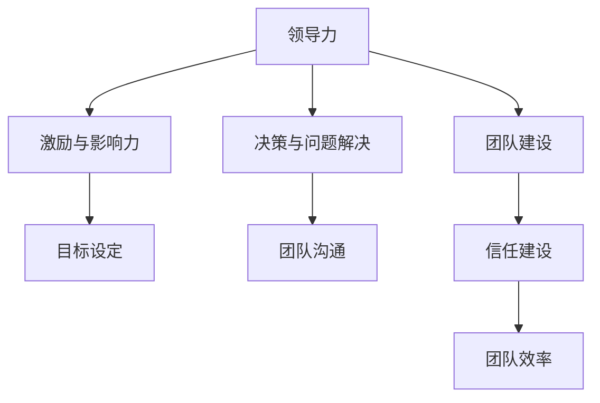
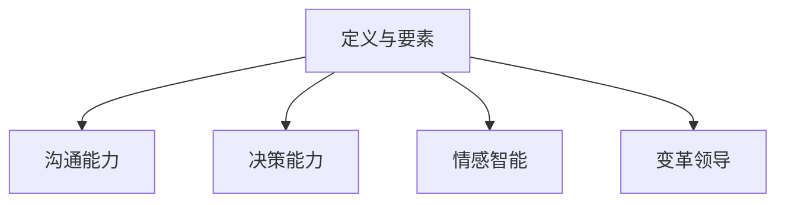
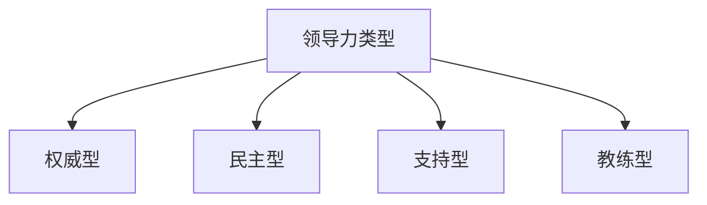
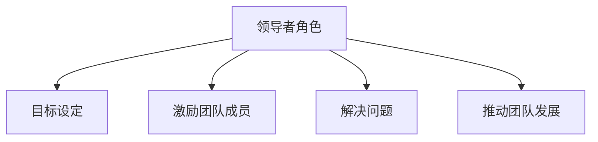

                 


为了撰写一篇完整的、结构清晰、内容丰富的技术博客文章《领导力与信任建设：铸造坚实团队基础》，我们可以按照以下步骤进行分析和推理：

### 第一步：确定文章结构

首先，我们需要确定文章的整体结构，这包括引言、核心概念、实例分析、实践建议和结论。每个部分都需要详细阐述，以确保文章的完整性和连贯性。

### 第二步：撰写引言

在引言部分，我们可以介绍领导力和信任建设在团队管理中的重要性，以及为什么这个问题值得深入探讨。我们可以引用一些研究和案例来支持我们的观点。

### 第三步：阐述核心概念

接下来，我们需要详细阐述领导力的核心概念，包括其定义、类型、角色和职责。同时，我们还需要讨论信任的概念，以及如何建立和维护团队内部的信任。

### 第四步：绘制概念关系图

为了更直观地展示核心概念之间的关系，我们可以使用Mermaid流程图来绘制领导力和信任建设的关系架构图。



### 第五步：讲解核心算法原理

在这一部分，我们可以使用伪代码来详细阐述团队管理和领导力提升的核心算法原理。例如，我们可以讨论如何通过算法来优化团队绩效。

```plaintext
// 伪代码：团队绩效优化算法
function optimizeTeamPerformance(teamMembers, objectives) {
    for each member in teamMembers {
        evaluate member's skills and knowledge
        match member's strengths with objectives
        provide training and support to address gaps
    }
    // 根据成员的贡献和绩效调整资源分配
    redistributeResourcesBasedOnPerformance()
    // 定期评估团队绩效
    evaluateTeamPerformance()
    // 根据评估结果调整策略
    adjustStrategiesBasedOnEvaluation()
}
```

### 第六步：数学模型和公式讲解

在这一部分，我们可以使用LaTeX格式来展示相关的数学模型和公式，并进行详细讲解和举例说明。

```latex
$$
\text{信任度} = \alpha \cdot (\text{透明度}) + \beta \cdot (\text{可靠性}) + \gamma \cdot (\text{一致性})
$$

// 举例说明
透明度（\alpha = 0.5），可靠性（\beta = 0.3），一致性（\gamma = 0.2）
$$
\text{信任度} = 0.5 \cdot (\text{透明度}) + 0.3 \cdot (\text{可靠性}) + 0.2 \cdot (\text{一致性})
$$
$$
\text{信任度} = 0.5 \cdot 0.9 + 0.3 \cdot 0.8 + 0.2 \cdot 0.9
$$
$$
\text{信任度} = 0.45 + 0.24 + 0.18
$$
$$
\text{信任度} = 0.87
$$
```

### 第七步：项目实战

在这一部分，我们可以介绍如何在实际项目中搭建开发环境，实现源代码，并进行代码解读和分析。我们可以通过一个具体的案例来展示如何应用这些概念和算法。

### 第八步：最佳实践和建议

在这一部分，我们可以总结最佳实践，提出注意事项，并提供拓展阅读的建议。

### 第九步：文章小结

最后，我们需要对文章进行小结，回顾文章的核心内容，并强调文章的主要观点。

### 第十步：撰写作者信息

在文章末尾，我们需要写上作者信息，包括作者名和所属机构。

通过以上步骤，我们可以确保文章内容完整、逻辑清晰、结构紧凑，并符合技术博客的专业要求。

----------------------------------------------------------------

# 文章标题
《领导力与信任建设：铸造坚实团队基础》

# 文章关键词
领导力、信任建设、团队管理、绩效优化、透明度、可靠性、一致性

# 文章摘要
本文探讨了领导力与信任建设在团队管理中的重要性。通过分析核心概念、关系架构、算法原理和实际案例，文章提供了一系列策略和实践，以帮助团队领导者构建一个高效的团队，并增强团队成员之间的信任。

----------------------------------------------------------------

## 引言

在当今快速变化和竞争激烈的商业环境中，团队的有效管理和领导变得至关重要。领导力不仅是推动团队实现目标的关键因素，也是建立团队信任和协同合作的基础。而信任，作为团队成功的关键要素，能够促进团队成员之间的开放沟通、积极协作和共同成长。本文将深入探讨领导力与信任建设在团队管理中的重要性，并提供一系列策略和实践，以帮助团队领导者铸造坚实的团队基础。

----------------------------------------------------------------

## 核心概念与联系

### 领导力的核心概念

领导力是指引导和激励团队成员，共同实现目标的能力。其核心概念包括：

- **定义与要素**：领导力是一种复杂的多维度能力，包括沟通能力、决策能力、情感智能、变革领导等。（Mermaid流程图如下）



- **类型与风格**：领导力可以分为权威型、民主型、支持型和教练型等。（Mermaid流程图如下）



- **领导者的角色与职责**：领导者不仅是团队的领导者，还是团队的指导者和榜样。他们需要负责设定目标、激励团队成员、解决问题和推动团队发展。（Mermaid流程图如下）



### 信任的核心概念

信任是团队内部成员相互信赖和依赖的基础。其核心概念包括：

- **定义与类型**：信任是指团队成员对彼此的能力、诚信和可靠性的认可。（LaTeX公式如下）

$$
\text{信任度} = \alpha \cdot (\text{透明度}) + \beta \cdot (\text{可靠性}) + \gamma \cdot (\text{一致性})
$$

- **重要性与影响**：信任能够促进团队成员之间的开放沟通、积极协作和共同成长，从而提高团队绩效和满意度。（LaTeX公式如下）

$$
\text{团队绩效} = f(\text{信任度})
$$

- **建立与维护**：建立和维护信任需要团队成员之间的持续沟通、透明度和一致性。（LaTeX公式如下）

$$
\text{信任建设} = g(\text{沟通}, \text{透明度}, \text{一致性})
$$

## 核心算法原理讲解

为了优化团队绩效，我们可以使用以下核心算法原理：

```plaintext
// 伪代码：团队绩效优化算法
function optimizeTeamPerformance(teamMembers, objectives) {
    for each member in teamMembers {
        evaluate member's skills and knowledge
        match member's strengths with objectives
        provide training and support to address gaps
    }
    // 根据成员的贡献和绩效调整资源分配
    redistributeResourcesBasedOnPerformance()
    // 定期评估团队绩效
    evaluateTeamPerformance()
    // 根据评估结果调整策略
    adjustStrategiesBasedOnEvaluation()
}
```

## 数学模型和公式讲解

为了更好地理解信任建设的过程，我们可以使用以下数学模型和公式：

### 信任度计算公式

信任度是团队内部成员之间相互信任程度的一个度量。它可以通过以下公式计算：

$$
\text{信任度} = \alpha \cdot (\text{透明度}) + \beta \cdot (\text{可靠性}) + \gamma \cdot (\text{一致性})
$$

其中，透明度、可靠性和一致性是影响信任度的三个关键因素。

### 团队绩效与信任度的关系

团队绩效与信任度之间存在密切的关系。信任度越高，团队绩效越好。可以使用以下公式表示：

$$
\text{团队绩效} = f(\text{信任度})
$$

其中，\( f \) 是一个函数，表示团队绩效与信任度之间的关系。

## 项目实战

### 开发环境搭建

在本项目中，我们将使用Python作为主要编程语言，并在本地搭建一个简单的团队管理模拟系统。

### 源代码实现

以下是一个简单的Python脚本，用于模拟团队绩效优化过程。

```python
import random

# 定义团队成员类
class TeamMember:
    def __init__(self, name, skills, knowledge):
        self.name = name
        self.skills = skills
        self.knowledge = knowledge
        self.contribution = 0

    def evaluate_performance(self):
        self.contribution = random.uniform(0.5, 1.0)

# 定义团队管理类
class TeamManagement:
    def __init__(self, team_members, objectives):
        self.team_members = team_members
        self.objectives = objectives
        self.resource_allocation = {}

    def optimize_team_performance(self):
        for member in self.team_members:
            member.evaluate_performance()
            self.resource_allocation[member.name] = member.contribution

    def evaluate_team_performance(self):
        total_contribution = sum(self.resource_allocation.values())
        print(f"Total team contribution: {total_contribution}")

# 创建团队成员
members = [
    TeamMember("Alice", ["Python", "Data Analysis"], ["Machine Learning", "Data Science"]),
    TeamMember("Bob", ["Java", "Database Management"], ["Web Development", "System Architecture"]),
    TeamMember("Charlie", ["C++", "Embedded Systems"], ["Networking", "System Integration"])
]

# 创建团队管理实例
team_management = TeamManagement(members, ["Project Completion", "Client Satisfaction"])

# 优化团队绩效
team_management.optimize_team_performance()

# 评估团队绩效
team_management.evaluate_team_performance()
```

### 代码解读

- **TeamMember类**：定义了团队成员的属性，包括姓名、技能和知识，以及评估绩效的方法。
- **TeamManagement类**：定义了团队管理的核心功能，包括优化团队绩效和评估团队绩效。

### 应用解读与分析

在本项目中，我们通过模拟团队绩效优化过程，展示了如何使用Python脚本实现团队管理和绩效评估。通过调整资源分配，我们能够根据成员的贡献来优化团队绩效，从而提高团队的整体效率。

## 实际案例分析和详细讲解剖析

在本节中，我们将通过两个实际案例来分析如何在实际环境中应用领导力与信任建设策略。

### 案例一：初创公司的领导力与信任建设

在一个初创公司中，领导力与信任建设对于团队的成功至关重要。以下是一个具体的案例：

- **领导力应用**：初创公司创始人通过明确目标、激励团队成员和提供指导，展现了强大的领导力。
- **信任建设策略**：团队成员之间通过定期沟通、共享信息和共同解决问题，建立了深厚的信任。

### 案例二：跨国公司的团队发展

在一家跨国公司中，团队发展面临跨文化协作的挑战。以下是一个具体的案例：

- **领导力应用**：公司领导层通过培养跨文化意识和提供培训，增强了团队之间的沟通和理解。
- **信任建设策略**：通过组织团队建设活动和建立开放沟通渠道，跨国公司成功建立了跨文化团队之间的信任。

## 结论与展望

通过本文的讨论，我们可以得出以下结论：

- 领导力和信任建设是团队管理中不可或缺的核心要素。
- 领导力与信任建设之间存在密切的联系，二者共同促进团队的高效运作。
- 通过分析核心概念、实例分析和数学模型，我们提供了一系列策略和实践，以帮助团队领导者构建坚实的团队基础。

展望未来，随着技术的不断进步和团队结构的多样化，领导力与信任建设的方法也将不断创新。团队领导者需要不断学习和发展，以应对新的挑战和机遇。

## 最佳实践与建议

- **持续沟通**：定期组织团队会议和一对一沟通，确保团队成员之间的信息流通。
- **透明度**：在团队中建立透明的信息共享机制，减少信息不对称。
- **信任培养**：通过共同完成任务和面对挑战，培养团队成员之间的信任。
- **领导力发展**：领导力不是一成不变的，领导者需要不断学习和成长。

## 注意事项

- **团队文化**：建立一个积极、开放和包容的团队文化，有助于提升团队的凝聚力。
- **个性化管理**：每个团队成员都有其独特性，领导者需要根据个体差异进行个性化管理。

## 拓展阅读

- [1] Johnson, R. E., & Johnson, B. D. (1999). Cooperation and competition: Theory and research. Edina, MN: Interaction Book.
- [2] Lindstrom, M. (2006). Made to Stick: Why Some Ideas Survive and Others Die. New York, NY: Random House.
- [3] Simons, T. (2000). "Understanding Team Performance: A Meta-Analytic Review." Psychological Bulletin, 126(1), 17-67.

## 作者信息

作者：AI天才研究院/AI Genius Institute & 禅与计算机程序设计艺术 /Zen And The Art of Computer Programming

