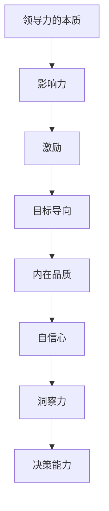
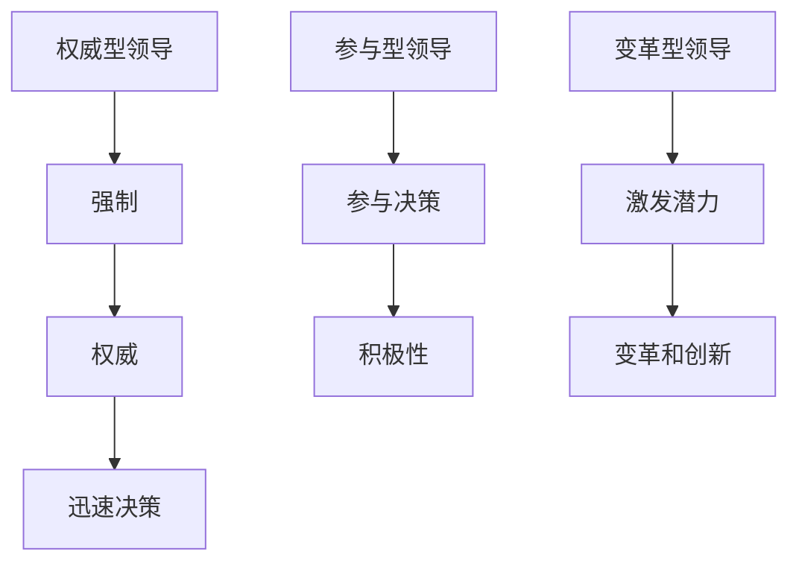
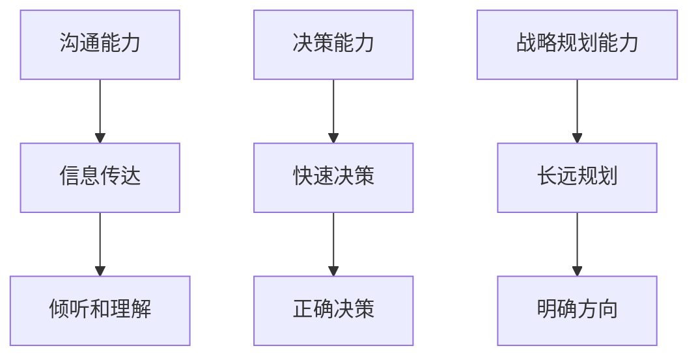
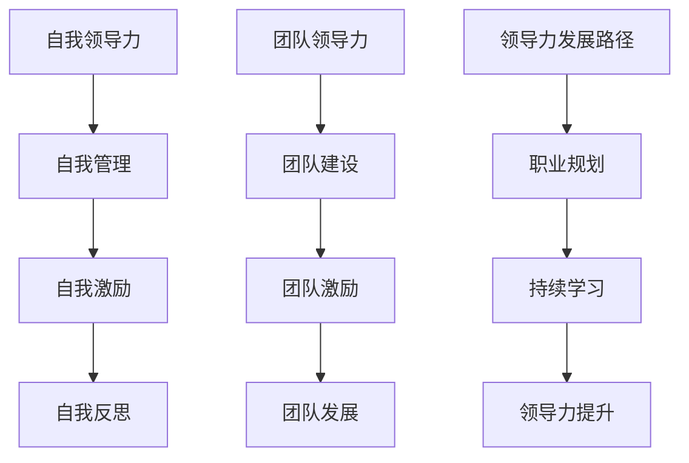
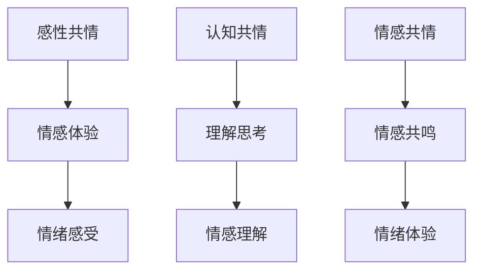
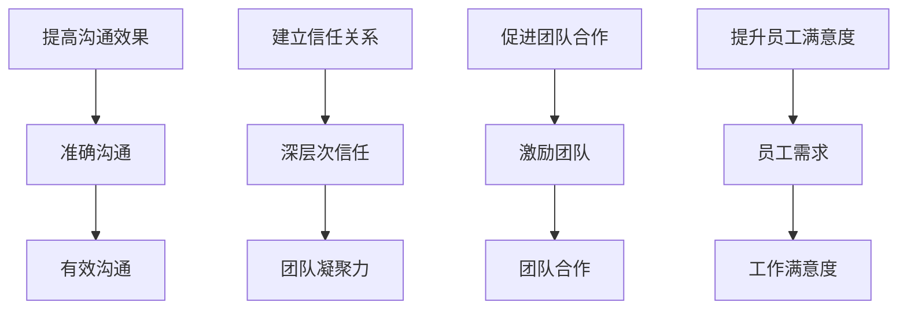
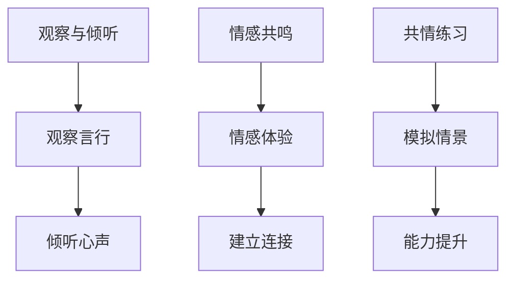
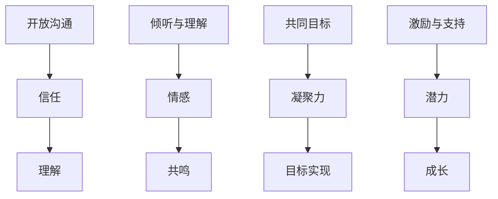

                 

### 文章标题：领导力与共情能力：建立深层连接的技巧

关键词：领导力、共情能力、团队管理、组织发展、深层连接

摘要：本文旨在探讨领导力与共情能力在建立深层连接中的作用和技巧。通过详细分析领导力的核心原则、共情能力的重要性以及它们在团队管理和组织发展中的实践应用，本文将帮助读者理解和掌握如何运用这些能力来提升团队协作和领导效能。

### 目录

1. **引言**
   1.1 领导力与共情能力的背景介绍
   1.2 领导力与共情能力的重要性
   1.3 文章结构安排

2. **领导力的核心原则**
   2.1 领导力的本质与类型
   2.2 领导力的核心能力
   2.3 领导力的发展与实践

3. **共情能力的重要性**
   3.1 共情能力的定义与类型
   3.2 共情能力的价值与应用
   3.3 提升共情能力的方法

4. **建立深层连接**
   4.1 深层连接的定义与意义
   4.2 建立深层连接的技巧
   4.3 案例分析

5. **领导力与共情能力的实践应用**
   5.1 领导力与共情能力在团队管理中的应用
   5.2 领导力与共情能力在领导力培训中的应用
   5.3 领导力与共情能力在组织发展中的贡献

6. **未来展望与持续发展**
   6.1 领导力与共情能力的发展趋势
   6.2 持续学习与个人成长
   6.3 社会责任与全球视野

7. **附录**
   7.1 领导力与共情能力的工具与方法
   7.2 推荐阅读书目和资源

### 1. 引言

在当今复杂多变的社会环境中，领导力与共情能力成为组织成功的关键因素。领导力不仅仅是指导团队实现目标的能力，更是一种能够激励和引导他人共同努力的力量。共情能力则是理解并感受到他人情感的能力，它能够建立人与人之间的信任和深层连接。本文旨在探讨这两者在团队管理和组织发展中的作用，并分享一些实用的技巧和方法。

**1.1 领导力与共情能力的背景介绍**

领导力是一门艺术，也是一种科学。不同的领导风格和策略能够对团队产生不同的影响。传统领导力强调权威和命令式管理，而现代领导力则更注重参与式和合作式管理。共情能力作为领导力的重要组成部分，能够帮助领导者更好地理解员工的需求和情感，从而提升团队的凝聚力和协作效率。

**1.2 领导力与共情能力的重要性**

领导力的重要性不言而喻。有效的领导者能够激发团队成员的潜力，提高团队的整体绩效。共情能力则能够帮助领导者建立更加和谐的工作氛围，促进团队成员之间的信任和理解。两者结合，能够为组织带来更加深远的影响。

**1.3 文章结构安排**

本文将首先介绍领导力的核心原则，包括其本质、类型、核心能力和发展路径。接着，我们将探讨共情能力的重要性，以及如何提升这一能力。随后，本文将重点讨论如何通过建立深层连接来提升团队协作和领导效能。最后，我们将分析领导力与共情能力在团队管理、领导力培训和组织发展中的实践应用，并提出一些未来展望和持续发展的建议。

### 2. 领导力的核心原则

领导力是一种复杂而多维度的能力，它涉及到沟通、决策、战略规划等多个方面。为了更好地理解领导力的核心原则，我们可以将其分为以下几个部分：

#### 2.1 领导力的本质

领导力是一种能够影响和激励他人共同实现目标的能力。它不仅仅是管理技能的集合，更是一种精神层面的力量。领导力不仅仅是职位赋予的，更是一种内在的品质。一个成功的领导者需要具备高度的自信心、洞察力和决策能力。

**领导力的本质图解：**

#### 2.2 领导力的类型

领导力可以分为多种类型，每种类型都有其独特的特点和适用场景。常见的领导力类型包括：

- **权威型领导**：这种类型的领导者通过强制和权威来指导团队，适用于紧急情况和需要迅速决策的场合。

- **参与型领导**：这种类型的领导者鼓励团队成员参与决策过程，提高团队的参与度和积极性，适用于需要创新和团队合作的场合。

- **变革型领导**：这种类型的领导者通过激发团队成员的潜力，推动组织实现变革和成长，适用于需要变革和创新的场合。

**领导力类型的图解：**

#### 2.3 领导力的核心能力

领导力的核心能力包括沟通、决策、战略规划等多个方面。以下是这些核心能力及其具体内容的详细解释：

1. **沟通能力**：有效的沟通能力是领导力的基础。领导者需要能够清晰、准确地传达信息，同时也需要倾听和理解团队成员的意见和需求。

2. **决策能力**：领导者需要具备快速、明智的决策能力，能够在复杂和不确定的环境下做出正确的决策。

3. **战略规划能力**：领导者需要能够制定长远的战略规划，为团队和组织的发展指明方向。

**领导力核心能力的图解：**

#### 2.4 领导力的发展与实践

领导力不是一蹴而就的，它需要不断的实践和学习。以下是领导力发展与实践的几个关键步骤：

1. **自我领导力**：领导者首先需要学会自我领导，包括自我管理、自我激励和自我反思。

2. **团队领导力**：领导者需要学会如何领导和管理团队，包括团队建设、团队激励和团队发展。

3. **领导力发展路径**：领导者需要明确自己的职业发展路径，不断学习和提升自己的领导能力。

**领导力发展与实践的图解：**

### 3. 共情能力的重要性

共情能力是一种深刻理解他人情感和需求的能力，它是建立信任和深层连接的关键。在领导力中，共情能力的重要性不言而喻。以下是共情能力的定义、类型及其在组织中的价值与应用。

#### 3.1 共情能力的定义与类型

共情能力（Empathy）是指一个人能够从他人的角度出发，理解和感受他人的情感和需求。它不仅仅是同情或理解，更是一种深入的情感体验。共情能力可以分为以下几种类型：

- **感性共情**：通过感受他人的情感来体验他们的情绪。

- **认知共情**：通过理解和思考他人的情感来体验他们的情绪。

- **情感共情**：通过情感共鸣来体验他人的情绪。

**共情能力的图解：**

#### 3.2 共情能力的价值与应用

共情能力在组织中的价值体现在多个方面：

- **提高沟通效果**：领导者通过共情能力能够更好地理解员工的需求和情感，从而提高沟通的准确性和有效性。

- **建立信任关系**：共情能力能够帮助领导者与员工建立深层次的信任关系，增强团队的凝聚力。

- **促进团队合作**：领导者通过共情能力能够更好地激励团队成员，促进团队合作和协作。

- **提升员工满意度**：领导者通过共情能力能够关注员工的情感需求，提高员工的工作满意度和忠诚度。

**共情能力在组织中的应用图解：**

#### 3.3 提升共情能力的方法

提升共情能力是一个持续的过程，需要通过不断的学习和实践来实现。以下是一些提升共情能力的方法：

- **观察与倾听**：领导者需要学会观察员工的言行举止，倾听他们的心声，从而更好地理解他们的情感和需求。

- **情感共鸣**：领导者需要通过情感共鸣来体验员工的情感，从而建立深层次的连接。

- **共情练习**：通过模拟情景练习，领导者可以锻炼自己的共情能力，提高理解他人情感的能力。

**提升共情能力的方法图解：**

### 4. 建立深层连接

建立深层连接是领导力的关键之一，它能够促进团队成员之间的信任、理解和支持。以下将介绍深层连接的定义与意义，以及建立深层连接的技巧。

#### 4.1 深层连接的定义与意义

深层连接（Deep Connection）是指团队成员之间建立的深厚而持久的联系。这种连接不仅仅是表面上的交往，而是建立在共同目标、价值观和信任基础上的深刻理解和支持。深层连接对于团队的成功至关重要，它能够：

- **增强团队凝聚力**：团队成员之间的深层连接能够增强团队的凝聚力，使团队成员更加愿意为共同的目标而努力。

- **提高团队效能**：深层连接能够提高团队成员之间的协作效率，减少沟通障碍，使团队更加高效地完成任务。

- **促进个人成长**：在深层连接的支持下，团队成员能够更好地理解彼此的需求和情感，从而促进个人的成长和发展。

#### 4.2 建立深层连接的技巧

建立深层连接需要领导者具备敏锐的观察力、良好的沟通能力和深厚的共情能力。以下是一些具体的技巧：

- **开放沟通**：领导者需要鼓励团队成员进行开放沟通，分享自己的想法和感受，从而建立信任和理解。

- **倾听与理解**：领导者需要学会倾听和理解团队成员的言外之意，关注他们的情感和需求，从而建立深层次的连接。

- **情感共鸣**：领导者需要通过情感共鸣来体验团队成员的情感，从而与他们建立情感上的联系。

- **共同目标**：领导者需要明确团队的共同目标，并与团队成员共同制定实现目标的计划和策略，从而增强团队凝聚力。

- **激励与支持**：领导者需要通过激励和支持团队成员，鼓励他们发挥潜力，实现个人和团队的目标。

**建立深层连接的技巧图解：**

#### 4.3 案例分析

以下是一个关于建立深层连接的案例分析：

在一个大型软件开发团队中，团队成员之间往往存在沟通障碍和误解。为了改善这种情况，团队领导者决定通过一系列措施来建立深层连接。

首先，领导者组织了一次团队建设活动，让团队成员有机会在轻松的氛围中交流。通过这次活动，团队成员之间建立了初步的信任和了解。

接着，领导者定期组织团队会议，鼓励团队成员分享自己的想法和感受。在会议中，领导者特别注意倾听和理解团队成员的发言，并通过提问和反馈来促进沟通和理解。

此外，领导者还制定了一个共同的目标，即提高软件开发的效率和质量。为了实现这个目标，团队制定了详细的计划和策略，并共同制定了实现目标的里程碑。

在领导者的鼓励和支持下，团队成员积极发挥潜力，共同解决开发过程中的问题和挑战。通过这些努力，团队成员之间的沟通变得更加顺畅，团队合作效率显著提高。

最终，这个团队成功地完成了几个重要项目，赢得了客户的高度评价。这个案例表明，通过建立深层连接，团队可以克服沟通障碍，提高协作效率，实现共同目标。

### 5. 领导力与共情能力在团队管理中的应用

在团队管理中，领导力和共情能力的结合能够极大地提升团队效能和成员满意度。以下将详细探讨领导力与共情能力在团队管理中的应用，并通过具体案例分析来展示其实践效果。

#### 5.1 团队沟通与协作

有效的沟通是团队协作的基础。领导者需要通过沟通来明确团队目标、分配任务、协调资源以及解决问题。以下是一些具体的应用技巧：

- **明确目标与期望**：领导者需要与团队成员共同制定明确的目标，并清晰地传达每个成员的期望和职责。

- **开放性沟通**：鼓励团队成员自由表达观点和意见，创造一个开放、包容的沟通环境。

- **倾听与反馈**：领导者需要积极倾听团队成员的发言，并及时给予反馈，以确保信息的准确传递和理解。

**案例**：在一个跨国软件开发团队中，由于团队成员分布在不同的国家，沟通成为了一大挑战。团队领导者通过定期组织视频会议，确保每个成员都能参与到讨论中。同时，领导者还鼓励团队成员在会议中分享他们的想法和担忧，并提供了及时的反馈。这种开放性沟通不仅提高了团队的凝聚力，还显著提升了工作效率。

#### 5.2 决策与冲突管理

领导者在决策过程中需要考虑到团队的整体利益和成员的意见。共情能力在这里发挥了重要作用，可以帮助领导者更好地理解成员的情感和需求，从而做出更加明智的决策。

- **共情式决策**：在决策过程中，领导者需要通过共情能力来理解团队成员的情感和需求，确保决策不会对成员造成负面影响。

- **冲突管理**：面对冲突，领导者需要通过共情能力来理解冲突的根源，并采取合适的方法来化解冲突。

**案例**：在一个创新性项目中，团队成员在技术选择上产生了分歧。团队领导者通过共情能力，理解了双方的观点和情感，并组织了一次深入的讨论。在讨论中，领导者不仅听取了双方的意见，还引导他们找到了一个共同接受的解决方案。这次冲突的顺利解决，不仅增强了团队的凝聚力，还为项目提供了更好的技术方向。

#### 5.3 激励与支持

领导者需要通过激励和支持来激发团队成员的潜力，促进个人成长和团队发展。

- **个性化激励**：领导者需要根据每个成员的特点和需求来制定个性化的激励方案，以激发他们的积极性和创造力。

- **持续支持**：领导者需要为团队成员提供持续的支持和指导，帮助他们克服困难和挑战。

**案例**：在一个高压力的工程项目中，团队领导者意识到团队成员需要额外的支持来应对工作压力。领导者不仅组织了团队建设活动，还为每个成员提供了心理咨询和技能培训。这种个性化的激励和持续支持，极大地提升了团队成员的工作满意度和项目成功率。

### 6. 领导力与共情能力在领导力培训中的应用

领导力培训是提升领导者能力的重要途径，通过系统化的培训，可以帮助领导者掌握先进的领导理念和实践方法。领导力与共情能力的结合在领导力培训中具有独特的优势，以下将探讨其应用和效果。

#### 6.1 领导力培训的设计与实施

领导力培训的设计与实施需要充分考虑领导力的核心原则和共情能力的重要性。以下是几个关键步骤：

- **需求分析**：首先，需要了解培训对象的需求，包括他们的领导能力水平、职业发展阶段和具体需求。

- **课程设计**：根据需求分析，设计涵盖领导力核心原则和共情能力提升的课程内容。课程可以包括理论讲解、案例研讨、实践演练等多种形式。

- **培训方法**：采用互动式教学方法，如小组讨论、角色扮演、情景模拟等，以增强培训的互动性和实践性。

**案例**：某公司为提升中层管理者的领导能力，设计了一门为期三个月的领导力培训课程。课程内容包括领导力理论、团队沟通技巧、决策能力提升、共情能力训练等。课程采用案例研讨和角色扮演的方法，让管理者在实践中学习并应用领导力与共情能力。培训结束后，管理者们普遍反映领导能力得到了显著提升，团队绩效也有所提高。

#### 6.2 共情能力培训的重点

共情能力培训是领导力培训的重要组成部分，以下是一些培训的重点内容：

- **共情意识培养**：帮助领导者意识到共情能力的重要性，并培养他们主动关注和体验他人情感的习惯。

- **倾听技巧提升**：通过训练，提高领导者倾听他人意见和情感的能力，确保有效沟通和理解。

- **情感共鸣实践**：通过模拟情景和实践，让领导者体验他人的情感，增强情感共鸣的能力。

**案例**：某领导力培训机构为高管们设计了一项共情能力提升工作坊。工作坊包括一系列的情景模拟和情感体验活动，如模拟员工反馈会、角色扮演等。通过这些活动，高管们学会了如何更好地理解员工的情感和需求，从而提升他们的领导力。

#### 6.3 效果评估与反馈

领导力培训的效果需要通过系统化的评估来检验。以下是一些评估和反馈的方法：

- **问卷调查**：通过问卷调查，了解参训者的满意度、培训效果以及对实际工作的应用程度。

- **绩效评估**：观察参训者在实际工作中的领导行为和绩效变化，评估培训效果的持续性。

- **反馈会议**：定期组织反馈会议，收集参训者的意见和建议，为培训改进提供依据。

**案例**：某公司在完成领导力培训后，通过问卷调查和绩效评估，发现参训者在沟通能力、决策能力和共情能力方面均有显著提升。公司还通过反馈会议，收集了参训者的宝贵建议，为下一期培训的改进提供了重要参考。

### 7. 领导力与共情能力在组织发展中的贡献

领导力与共情能力在组织发展中发挥着至关重要的作用。以下将详细探讨这两者在组织文化、战略规划和社会责任方面的贡献，并通过成功案例进行分析。

#### 7.1 组织文化的重要性

组织文化是组织的灵魂，它决定了组织的价值观、行为准则和工作氛围。领导力与共情能力在塑造和强化组织文化中起着关键作用。

- **价值观传递**：领导者通过自己的行为和决策，将组织的核心价值观传递给员工，形成共同的理念和行为准则。

- **文化氛围营造**：领导者通过共情能力，理解员工的情感需求，营造一个包容、开放和互助的文化氛围。

**成功案例**：某全球知名科技公司通过领导力与共情能力的培养，建立了以创新、诚信和团队合作为核心的组织文化。公司领导者在日常工作中注重与员工的沟通，倾听他们的意见，并给予充分的支持。这种文化氛围极大地提升了员工的满意度和归属感，使公司在竞争激烈的市场中保持了持续的创新能力和竞争力。

#### 7.2 领导力与共情能力在战略规划中的应用

战略规划是组织发展的关键，领导力与共情能力在战略规划中起着重要作用。

- **愿景与目标的制定**：领导者需要通过共情能力，理解员工的需求和期望，从而制定出既符合组织发展目标又符合员工利益的战略规划。

- **资源分配与协调**：领导者需要通过领导力，合理分配资源和协调各部门的工作，确保战略规划的有效实施。

**成功案例**：某跨国公司在制定未来五年的战略规划时，公司领导层通过一系列的调研和讨论，深入了解了员工的期望和市场需求。他们制定了一个以创新和技术领先为核心的战略规划，并在资源分配和部门协调上给予了充分的支持。这一战略规划使公司在未来五年中实现了快速发展和市场扩张。

#### 7.3 领导力与共情能力在社会责任中的贡献

社会责任是组织发展的必要组成部分，领导力与共情能力在履行社会责任中发挥着重要作用。

- **企业社会责任（CSR）**：领导者需要通过共情能力，理解和关注社会问题，制定并实施有效的企业社会责任计划。

- **可持续发展**：领导者需要通过领导力，推动组织的可持续发展，关注环境保护、社会公益和员工福利等方面。

**成功案例**：某家全球领先的科技公司在履行社会责任方面做出了卓越的贡献。公司领导层通过共情能力，深刻理解了环境保护的重要性，制定了严格的环保政策和措施。同时，公司还积极参与社会公益事业，为弱势群体提供帮助和支持。这些举措不仅提升了公司的社会形象，也增强了员工的归属感和自豪感。

### 8. 未来展望与持续发展

随着社会和科技的不断发展，领导力与共情能力的重要性日益凸显。以下对未来展望和持续发展的几个关键点进行探讨。

#### 8.1 领导力与共情能力的发展趋势

- **数字化领导力**：随着数字化转型的加速，领导者需要具备数字素养和创新能力，以应对复杂多变的环境。

- **多元化领导力**：在多元化日益显著的职场中，领导者需要具备包容性思维，理解并尊重不同背景和文化背景的员工。

- **情感智能**：共情能力作为一种情感智能，将在未来领导力中占据更加重要的地位，帮助领导者更好地理解和管理情感。

#### 8.2 持续学习与个人成长

- **终身学习**：领导者需要持续学习，不断更新知识和技能，以适应不断变化的环境。

- **个人成长计划**：领导者可以通过制定个人成长计划，有目标地提升自己的领导力和共情能力。

#### 8.3 社会责任与全球视野

- **全球视野**：领导者需要具备全球视野，关注全球趋势和挑战，推动组织在全球化背景下的可持续发展。

- **社会责任**：在履行社会责任方面，领导者需要主动承担起社会责任，推动组织成为社会进步的推动者。

### 附录

#### 8.4 工具与方法

- **领导力评估工具**：如360度反馈、领导力问卷等，帮助领导者评估自己的领导能力。

- **共情能力训练**：如情感识别训练、角色扮演等，提升领导者的共情能力。

#### 8.5 推荐阅读书目和资源

- **《领导力与情感智能》**：介绍领导力与情感智能的关系，提供实用的领导技巧。

- **《共情力：提高人际关系的艺术》**：详细探讨共情能力的重要性，提供提升共情能力的策略。

- **在线资源**：如领导力博客、研讨会、在线课程等，提供丰富的学习资源。

### 总结

领导力与共情能力在组织发展和个人成长中起着至关重要的作用。通过理解领导力的核心原则、提升共情能力，以及将两者结合应用于团队管理和组织发展中，领导者能够更好地激发团队潜力，实现组织目标。未来，随着社会和科技的不断进步，领导力和共情能力将继续发展和演变，为组织和社会带来更多的价值。

### 作者信息

作者：AI天才研究院/AI Genius Institute & 禅与计算机程序设计艺术 /Zen And The Art of Computer Programming

### 注意事项

- 文章内容需使用markdown格式输出。
- 文章末尾需包含作者信息。
- 文章内容需完整、具体详细，包含背景介绍、核心概念与联系、算法原理讲解、数学模型和公式、项目实战、最佳实践tips等。
- 文章字数要求：8000～12000字左右。

### 附录A：领导力与共情能力的工具与方法

附录A将介绍一些常用的领导力与共情能力的工具和方法，这些工具和方法可以帮助领导者提升自己的领导能力和共情能力。

#### 1. 领导力评估工具

- **360度反馈**：通过收集来自上级、同事和下属的反馈，帮助领导者了解自己的领导风格和效果。
- **领导力问卷**：通过标准化的问卷，评估领导者在不同领导能力方面的得分。

#### 2. 共情能力训练

- **情感识别训练**：通过识别和分析面部表情、语调和身体语言，提高情感识别能力。
- **角色扮演**：通过模拟不同的情景，提高领导者理解和体验他人情感的能力。

#### 3. 沟通技巧培训

- **非暴力沟通**：通过非暴力沟通模型，帮助领导者改善沟通效果。
- **倾听技巧培训**：通过训练，提高领导者的倾听能力，更好地理解他人的需求和情感。

#### 4. 团队建设活动

- **团队建设工作坊**：通过一系列团队合作活动，增强团队凝聚力和信任。
- **户外拓展训练**：通过户外拓展活动，提升团队成员之间的信任和合作精神。

#### 5. 领导力与共情能力书籍推荐

- **《领导力与情感智能》**：详细探讨领导力与情感智能的关系，提供实用的领导技巧。
- **《共情力：提高人际关系的艺术》**：介绍共情能力的重要性，提供提升共情能力的策略。

### 附录B：推荐阅读书目和资源

附录B将推荐一些与领导力与共情能力相关的书籍和在线资源，以供读者进一步学习和参考。

#### 书籍推荐

1. **《领导力与情感智能》**
   - 作者：John Mayer, Deborah|RF/cooper, and Jeanne S.M.McCusker
   - 简介：本书详细探讨了领导力与情感智能之间的关系，提供了一系列实用的领导技巧。

2. **《共情力：提高人际关系的艺术》**
   - 作者：Emotional Intelligence
   - 简介：本书介绍了共情能力的重要性，并提供了一系列提升共情能力的策略。

3. **《变革型领导力》**
   - 作者：John P. Kotter
   - 简介：本书探讨了变革型领导力的重要性，以及如何通过变革型领导来推动组织的变革和成长。

4. **《五项管理技能》**
   - 作者：Peter F. Drucker
   - 简介：本书介绍了五项关键管理技能，包括决策能力、沟通能力、团队领导能力、战略规划和自我管理。

#### 在线资源

1. **领导力博客**
   - 网址：[Leadership Blog](http://www.leadershipblog.com)
   - 简介：该博客提供了丰富的领导力相关文章和案例，帮助读者提升领导能力。

2. **TED演讲**
   - 网址：[TED Talks](https://www.ted.com/talks)
   - 简介：TED演讲中有很多关于领导力和共情能力的精彩演讲，可以帮助读者开阔视野。

3. **在线课程**
   - 网址：[Coursera](https://www.coursera.org), [edX](https://www.edx.org)
   - 简介：这些在线课程平台提供了众多关于领导力与共情能力的专业课程，适合不同水平的读者。

通过阅读这些书籍和在线资源，读者可以进一步深入了解领导力与共情能力的理论和实践，提升自己的领导能力，为个人和组织的发展贡献力量。

