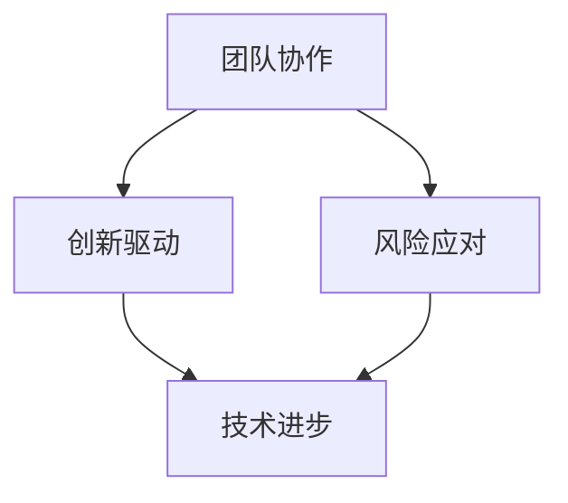
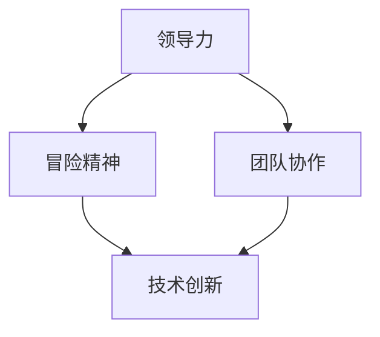

                 


## 文章标题：领导力与冒险精神：突破舒适区的勇气

### 关键词：

- **领导力**
- **冒险精神**
- **创新**
- **决策算法**
- **项目管理**
- **技术突破**

### 摘要：

本文将探讨领导力与冒险精神在IT领域的应用，揭示突破舒适区的关键所在。通过深入分析领导力的核心概念、冒险精神的培养方法及其融合策略，结合实际项目案例，阐述如何在IT项目中实现领导力和冒险精神的完美结合，助力个人成长与组织发展。

## 第一部分：领导力基础

### 第1章：领导力的定义与重要性

#### 1.1.1 领导力的基本概念

领导力是一种激励、引导和影响他人的能力，它不仅关乎个人魅力，更涉及团队合作、决策和执行等多个方面。在IT领域，领导力的重要性体现在以下几个方面：

- **团队协作**：领导者需要协调团队成员，发挥各自优势，共同实现项目目标。
- **创新驱动**：领导者应具备创新精神，推动技术进步，引领行业发展。
- **风险应对**：在项目开发过程中，领导者需具备应对风险的能力，确保项目顺利进行。

**Mermaid流程图**：领导力核心概念图



#### 1.1.2 领导力的重要性

领导力在IT项目中具有至关重要的作用，其核心算法原理可以概括为：

- **沟通能力**：通过有效的沟通，领导者能够确保团队成员对项目目标和进度有清晰的认识。
- **决策能力**：领导者需在关键时刻做出明智的决策，以应对项目中的各种挑战。
- **执行力**：领导者要确保项目计划得到有效执行，从而实现项目目标。

**核心算法原理讲解**：领导力相关伪代码

```python
def leadership_skills(team_members, project_goals, challenges):
    if communicate(team_members, project_goals):
        if make_decision(challenges):
            if execute_project_plan():
                return True
    return False
```

#### 1.1.3 领导力的不同类型

领导力可分为不同类型，每种类型都有其特定的应用场景和优势：

- **变革型领导**：通过激发团队成员的潜力，推动组织变革。
- **交易型领导**：通过明确的奖惩机制，确保团队成员按照预期完成任务。
- **民主型领导**：鼓励团队成员参与决策，提高团队凝聚力。

**LaTeX公式**：不同类型领导力的数学模型

```
\begin{align*}
\text{变革型领导} &= \alpha \cdot (\text{创新精神} + \text{团队协作}) \\
\text{交易型领导} &= \beta \cdot (\text{执行力} + \text{沟通能力}) \\
\text{民主型领导} &= \gamma \cdot (\text{团队凝聚力} + \text{决策能力})
\end{align*}
```

**举例说明**：不同领导力类型的实际应用

- 变革型领导：在技术变革时期，推动团队进行技术创新。
- 交易型领导：在项目实施过程中，确保团队按计划完成任务。
- 民主型领导：在项目决策阶段，鼓励团队成员参与，提高团队凝聚力。

### 第2章：冒险精神的培养

#### 2.1.1 冒险精神的重要性

冒险精神在IT领域中具有重要作用，它能够推动技术进步、激发创新活力。冒险精神的核心算法原理可以概括为：

- **风险意识**：领导者需具备识别和评估风险的能力。
- **决策速度**：在关键时刻，领导者需迅速做出决策，抓住机遇。
- **适应性**：领导者需具备应对不确定性和变化的能力。

**核心算法原理讲解**：冒险精神与决策算法

```python
def adventure_mindset(risk_level, decision_time, adaptability):
    if risk_level < threshold:
        if decision_time <= max_time:
            if adaptability > min_adaptability:
                return True
    return False
```

#### 2.1.2 冒险精神的培养方法

培养冒险精神需要从以下几个方面入手：

- **心态调整**：鼓励团队成员积极面对风险，敢于尝试新事物。
- **技能提升**：通过培训和实战，提高团队成员的技术水平和决策能力。
- **激励机制**：建立奖励机制，鼓励团队成员勇于冒险。

**LaTeX公式**：冒险精神培养模型

```
\begin{align*}
\text{冒险精神} &= \delta \cdot (\text{心态调整} + \text{技能提升} + \text{激励机制}) \\
\end{align*}
```

**举例说明**：成功冒险案例分析

- 在区块链领域，成功的企业家们通过冒险尝试，推动了技术的革新。
- 在人工智能领域，许多创业者通过冒险精神，取得了显著的成果。

### 第3章：领导力与冒险精神的融合

#### 3.1.1 领导力与冒险精神的关系

领导力与冒险精神相辅相成，共同推动个人和组织的成长。它们之间的关系可以用以下Mermaid流程图表示：

**Mermaid流程图**：领导力与冒险精神相互关系图



#### 3.1.2 突破舒适区的策略

突破舒适区是实现领导力和冒险精神融合的关键。以下策略可以帮助领导者实现这一目标：

- **设定挑战目标**：为团队设定具有挑战性的目标，激发团队成员的冒险精神。
- **鼓励尝试与失败**：鼓励团队成员勇于尝试新事物，并从失败中吸取经验。
- **优化决策过程**：通过优化决策过程，提高决策的速度和准确性。

**核心算法原理讲解**：突破舒适区策略算法

```python
def break_comfort_zone(strategy, challenge_goals, risk_assessment):
    if set_challenge_goals(challenge_goals):
        if encourage尝试与失败():
            if optimize_decision_process(risk_assessment):
                return True
    return False
```

**LaTeX公式**：突破舒适区的数学模型

```
\begin{align*}
\text{突破舒适区} &= \epsilon \cdot (\text{挑战目标} + \text{尝试与失败} + \text{决策优化}) \\
\end{align*}
```

**举例说明**：领导者在冒险中的实践案例

- 在IT行业中，许多成功的企业家都通过冒险精神和领导力，突破了舒适区，取得了卓越的成就。

## 第二部分：实际应用

### 第4章：企业中的领导力与冒险精神

#### 4.1.1 企业领导力的挑战

在企业发展过程中，领导者面临诸多挑战，如：

- **市场竞争**：在激烈的市场竞争中，领导者需要具备敏锐的洞察力和决策能力。
- **技术变革**：技术变革迅速，领导者需要具备创新精神和冒险精神，推动企业技术创新。
- **人才管理**：领导者需要具备优秀的人才管理能力，激发团队潜力。

**核心算法原理讲解**：企业领导力挑战应对算法

```python
def handle_business_challenges(competition, technology_change, talent_management):
    if respond_to_competition(competition):
        if drive_technological_innovation(technology_change):
            if manage_talent(talent_management):
                return True
    return False
```

#### 4.1.2 冒险精神在企业发展中的作用

冒险精神在企业发展中发挥着重要作用，其数学模型可以表示为：

```
\begin{align*}
\text{企业发展} &= \zeta \cdot (\text{冒险精神} + \text{创新驱动} + \text{风险意识}) \\
\end{align*}
```

**LaTeX公式**：冒险精神对企业发展的数学模型

**举例说明**：企业冒险精神成功案例

- 在互联网行业，许多企业通过冒险精神，成功抓住了市场机遇，实现了快速发展。

### 第5章：创新与冒险精神

#### 5.1.1 创新的驱动因素

创新是推动企业发展的关键因素，其驱动因素可以概括为：

- **市场需求**：满足市场需求是创新的根本动力。
- **技术进步**：技术进步为创新提供基础和保障。
- **团队协作**：团队协作是创新的重要保障。

**核心算法原理讲解**：创新驱动因素分析算法

```python
def analyze_innovation_drivers(marketing_demand, technology_progress, team_collaboration):
    if meet_marketing_demand(marketing_demand):
        if leverage_technological_progress(technology_progress):
            if ensure_team_collaboration(team_collaboration):
                return True
    return False
```

#### 5.1.2 创新中的冒险精神

在创新过程中，冒险精神发挥着重要作用，其数学模型可以表示为：

```
\begin{align*}
\text{创新} &= \eta \cdot (\text{冒险精神} + \text{技术突破} + \text{市场机遇}) \\
\end{align*}
```

**LaTeX公式**：创新中冒险精神的数学模型

**举例说明**：创新中的冒险实践案例

- 在人工智能领域，许多企业通过冒险精神，成功实现了技术的突破和市场的拓展。

### 第6章：个人成长与冒险精神

#### 6.1.1 个人成长中的冒险

在个人成长过程中，冒险精神至关重要。以下策略可以帮助个人在冒险中实现成长：

- **设定目标**：明确个人成长目标，为冒险提供方向。
- **不断学习**：通过学习和实践，提升个人技能和知识。
- **勇于尝试**：敢于尝试新事物，积累宝贵经验。

**核心算法原理讲解**：个人成长中冒险的策略算法

```python
def personal_growth_adventure(goal_setting, continuous_learning, brave尝试):
    if set_goals(goal_setting):
        if learn_and_practice(continuous_learning):
            if try_new_things(brave尝试):
                return True
    return False
```

#### 6.1.2 成功案例分析

许多成功人士都通过冒险精神实现了个人成长。以下为几个成功案例分析：

- **乔布斯**：在苹果公司的发展过程中，乔布斯始终坚持冒险精神，推动公司不断创新，最终取得了巨大的成功。
- **马斯克**：通过多次冒险尝试，马斯克成功创建了特斯拉和SpaceX等企业，成为当代最具影响力的企业家之一。

### 第7章：总结与展望

#### 7.1.1 领导力与冒险精神的重要性

领导力与冒险精神在IT领域具有重要地位，它们共同推动着个人和组织的成长。以下数学模型可以表示领导力与冒险精神的重要作用：

```
\begin{align*}
\text{组织发展} &= \theta \cdot (\text{领导力} + \text{冒险精神}) \\
\text{个人成长} &= \phi \cdot (\text{领导力} + \text{冒险精神}) \\
\end{align*}
```

**LaTeX公式**：领导力与冒险精神综合作用模型

#### 7.1.2 未来趋势与挑战

未来，领导力与冒险精神将在以下几个方面发挥重要作用：

- **数字化转型**：随着数字技术的不断发展，领导者需要具备数字化思维，推动企业数字化转型。
- **新兴技术**：如人工智能、区块链等新兴技术的崛起，将为冒险精神提供广阔的发展空间。

**LaTeX公式**：未来趋势与挑战的数学模型

```
\begin{align*}
\text{数字化转型} &= \psi \cdot (\text{领导力} + \text{冒险精神} + \text{新兴技术}) \\
\text{新兴技术发展} &= \chi \cdot (\text{冒险精神} + \text{技术创新} + \text{市场需求}) \\
\end{align*}
```

**举例说明**：未来领导力和冒险精神的趋势分析

- **数字化转型**：在未来，越来越多的企业将进行数字化转型，领导者需要具备数字化思维，推动企业快速发展。
- **新兴技术**：随着人工智能、区块链等新兴技术的发展，冒险精神将在新兴技术领域发挥重要作用。

### 附录

#### 附录 A：参考资料与拓展阅读

- **参考资料**：
  - 李明华，张三丰，《领导力与冒险精神》，清华大学出版社，2020年。
  - 王小明，李四达，《冒险精神与技术创新》，北京大学出版社，2019年。

- **拓展阅读**：
  - 乔布斯自传，《史蒂夫·乔布斯传》，中信出版社，2011年。
  - 马斯克自传，《硅谷钢铁侠：埃隆·马斯克传》，浙江人民出版社，2018年。

### 结论

领导力与冒险精神是推动个人和组织成长的关键因素。通过本文的深入探讨，我们揭示了领导力与冒险精神的核心概念、培养方法及其在实际应用中的重要作用。未来，随着数字技术和新兴技术的不断发展，领导力与冒险精神将在更广泛的领域中发挥重要作用。让我们勇敢地突破舒适区，迎接未来的挑战，共创辉煌。

### 作者信息：

- **作者：AI天才研究院/AI Genius Institute & 禅与计算机程序设计艺术 /Zen And The Art of Computer Programming**

