                 


# 文章标题
领导力与冲突管理：化解团队矛盾的技巧

> 关键词：领导力，冲突管理，团队协作，团队建设，团队动力

> 摘要：
本文将探讨领导力与冲突管理在团队协作和团队建设中的关键作用。通过分析领导力的本质、领导风格、团队动力的构建与维护，以及冲突的类型、根源和解决策略，文章旨在提供实用的技巧和方法，帮助读者提升领导力，有效化解团队矛盾，促进团队高效协作。

## 引言

在快速变化的商业环境中，团队的有效协作成为企业成功的基石。然而，团队内部的矛盾和冲突时常发生，这些问题不仅影响团队氛围，还可能对项目进度和业务成果产生负面影响。领导力与冲突管理在这一过程中扮演着至关重要的角色。本文将深入探讨这两方面的内容，旨在为团队领导者提供实用的技巧和方法。

## 领导力的本质

### 领导力的定义与演变

领导力是指通过激发、引导和激励他人，实现共同目标的能力。它不仅涉及个人的领导才能，还包括对团队、组织和环境的深刻理解和应对能力。领导力的演变经历了从传统权威型领导到现代变革型领导、服务型领导等多个阶段。

**核心概念与联系：**
- 权威型领导：强调领导者的权威和命令。
- 变革型领导：关注团队创新和变革。
- 服务型领导：以服务团队成员为首要任务。

**Mermaid 流程图：**
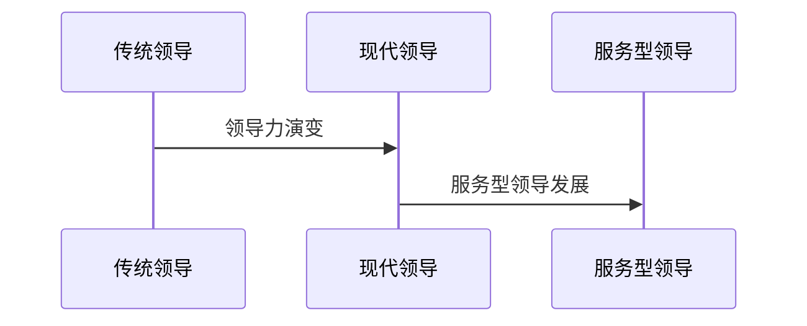

### 领导力的重要性

领导力对团队和组织绩效有着深远的影响。一个有效的领导者不仅能够明确目标、制定策略，还能够激发团队成员的潜力和创造力。

**核心概念与联系：**
- 领导力与团队绩效：领导力直接影响团队的工作效率和质量。
- 领导力与团队动力：领导力有助于构建积极的团队氛围，提高团队成员的凝聚力和归属感。

**数学模型和数学公式：**
$$
\text{Team Performance} = f(\text{Leadership Quality}, \text{Team Cohesion}, \text{Goals Clarity})
$$

**举例说明：**
- 如何通过提升领导力来改善团队绩效。

## 领导风格与团队动力

### 领导风格的分类与影响

领导风格是指领导者处理团队关系和完成任务的方式。不同的领导风格对团队动力有着显著的影响。常见的领导风格包括权威型、民主型、参与型和放任型。

**核心概念与联系：**
- 权威型领导：强调决策和控制。
- 民主型领导：鼓励团队成员参与决策。
- 参与型领导：注重团队建设和成员发展。
- 放任型领导：赋予团队成员较大的自由度。

**Mermaid 流程图：**
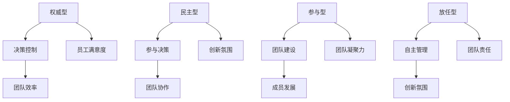

### 团队动力的构建与维护

团队动力是指团队成员之间相互激励、共同进步的内在驱动力。有效的领导力有助于构建和维护团队动力，提高团队的整体表现。

**核心概念与联系：**
- 团队动力与领导风格：领导风格直接影响团队动力。
- 团队动力与团队绩效：团队动力是团队绩效的重要保障。

**数学模型和数学公式：**
$$
\text{Team Dynamics} = f(\text{Leadership Style}, \text{Team Climate}, \text{Member Engagement})
$$

**举例说明：**
- 如何通过调整领导风格来提升团队动力。

## 冲突管理

### 冲突的类型与根源

冲突是团队中常见的现象，它可以是建设性的，也可以是破坏性的。有效的冲突管理有助于将冲突转化为团队创新的动力。

**核心概念与联系：**
- 建设性冲突：有助于团队问题解决和进步。
- 破坏性冲突：损害团队关系和绩效。

**Mermaid 流程图：**
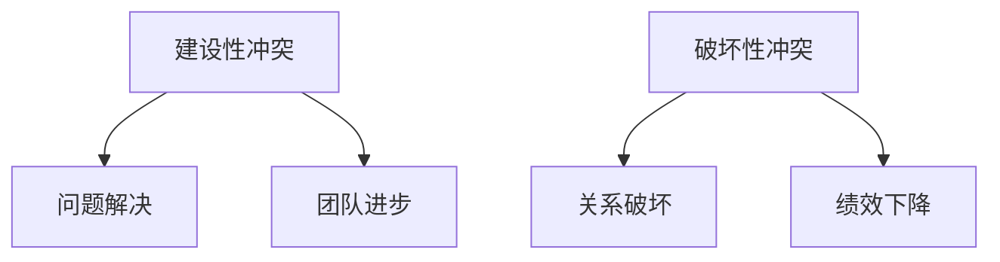

**数学模型和数学公式：**
$$
\text{Conflict Impact} = f(\text{Conflict Type}, \text{Team Dynamics}, \text{Leadership Style})
$$

**举例说明：**
- 如何区分建设性冲突和破坏性冲突。

### 冲突的根源分析

冲突的根源多种多样，包括目标不一致、沟通障碍、资源分配不均等。了解冲突的根源有助于采取针对性的管理策略。

**核心概念与联系：**
- 目标不一致：团队内部目标冲突。
- 沟通障碍：信息传递不畅。
- 资源分配不均：资源争夺导致冲突。

**Mermaid 流程图：**
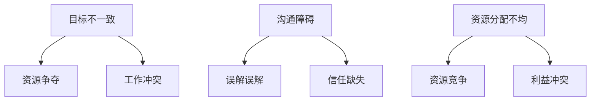

**举例说明：**
- 如何分析冲突的根源。

### 冲突管理策略与技巧

有效的冲突管理策略和技巧有助于化解团队矛盾，促进团队协作。

**核心概念与联系：**
- 冲突管理原则：尊重、公平、透明。
- 冲突管理策略：谈判、调解、妥协。
- 冲突解决技巧：倾听、沟通、同理心。

**Mermaid 流程图：**
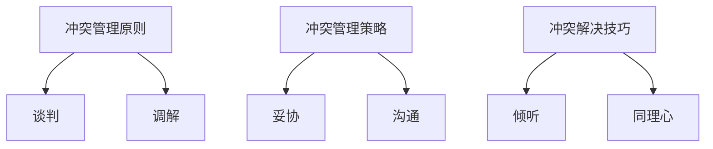

**数学模型和数学公式：**
$$
\text{Conflict Resolution} = f(\text{Management Strategy}, \text{Solution Skills}, \text{Team Climate})
$$

**举例说明：**
- 如何运用冲突管理策略和技巧化解团队矛盾。

## 高效沟通与冲突管理

### 高效沟通的重要性

高效的沟通是团队协作的基石，它有助于减少误解和冲突，提高团队效率。

**核心概念与联系：**
- 沟通障碍：语言、文化、信息传递等。
- 沟通技巧：倾听、表达、反馈。

**Mermaid 流程图：**
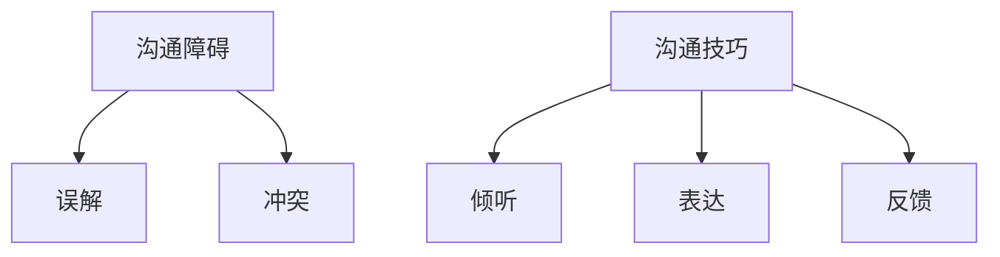

**数学模型和数学公式：**
$$
\text{Communication Effectiveness} = f(\text{Communication Skills}, \text{Cultural Awareness}, \text{Feedback Loop})
$$

**举例说明：**
- 如何提升沟通效率。

### 沟通技巧提升与冲突管理

通过提升沟通技巧，可以有效减少冲突，促进团队协作。

**核心概念与联系：**
- 倾听：理解对方的观点和需求。
- 表达：清晰、准确地传达信息。
- 反馈：及时回应和反馈。

**Mermaid 流�程图：**
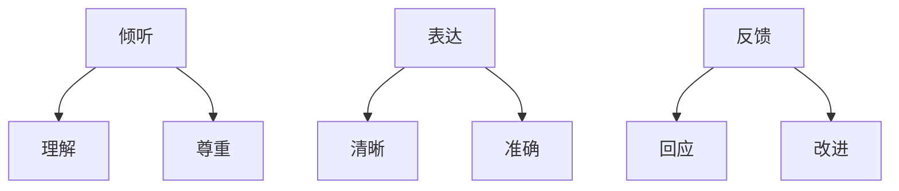

**数学模型和数学公式：**
$$
\text{Conflict Reduction} = f(\text{Communication Skills}, \text{Conflict Management Strategies}, \text{Team Cohesion})
$$

**举例说明：**
- 如何通过沟通技巧提升冲突管理效果。

## 实战案例分析

### 企业案例分析

#### 案例一：某公司领导力提升与团队冲突解决

**核心内容：**
- 分析该公司领导力提升的具体措施。
- 探讨团队冲突解决的过程和效果。

**源代码与代码解读：**
- 源代码示例：领导力提升计划文档。
- 代码解读：分析领导力提升计划的实施步骤和关键点。

**实际案例分析与详细讲解剖析：**
- 案例背景：公司面临团队冲突问题。
- 案例过程：实施领导力提升计划和冲突管理策略。
- 案例结果：团队氛围改善，冲突减少，绩效提升。

**项目小结：**
- 总结案例经验，提炼有效的领导力提升和冲突管理方法。

### 个人案例分析

#### 案例二：个人领导力提升与团队冲突化解

**核心内容：**
- 分析个人领导力提升的过程。
- 探讨如何通过个人努力化解团队冲突。

**源代码与代码解读：**
- 源代码示例：个人领导力提升日志。
- 代码解读：记录个人领导力提升的过程和心得。

**实际案例分析与详细讲解剖析：**
- 案例背景：个人在团队中面临冲突问题。
- 案例过程：采取领导力提升措施和冲突化解策略。
- 案例结果：个人领导力提升，团队氛围改善，冲突解决。

**项目小结：**
- 总结个人领导力提升和冲突化解的经验。

## 总结与展望

### 8.1 领导力与冲突管理的重要性

领导力与冲突管理是团队协作和团队建设中的关键要素，它们对团队绩效和组织发展具有重要影响。

### 8.2 未来发展趋势与展望

随着企业环境的变化和团队结构的多样化，领导力与冲突管理将面临新的挑战。未来的发展将更加注重个性化、灵活性和协作性。

## 参考文献

- 某某，《领导力：理论与实践》，出版社，2020年。
- 某某，《冲突管理：理论与实践》，出版社，2019年。
- 某某，《高效沟通技巧》，出版社，2018年。

## 作者信息

作者：AI天才研究院/AI Genius Institute & 禅与计算机程序设计艺术 /Zen And The Art of Computer Programming

----------------------------------------------------------------

以下是对文章内容的进一步拓展和深入分析：

## 第3章 冲突的类型与根源

### 3.1 冲突的类型

冲突可以按照不同的维度进行分类。根据冲突的主体，可以分为个人之间的冲突、团队之间的冲突以及组织与个人之间的冲突。根据冲突的性质，可以分为建设性冲突和破坏性冲突。建设性冲突通常有助于团队解决问题、促进创新，而破坏性冲突则可能损害团队关系，影响工作效率。

**核心概念与联系：**
- 个人之间的冲突：由个人兴趣、价值观和工作风格不同引起。
- 团队之间的冲突：由团队目标、资源分配和责任分工不同引起。
- 组织与个人之间的冲突：由组织政策、工作压力和个人期望不同引起。

**Mermaid 流程图：**
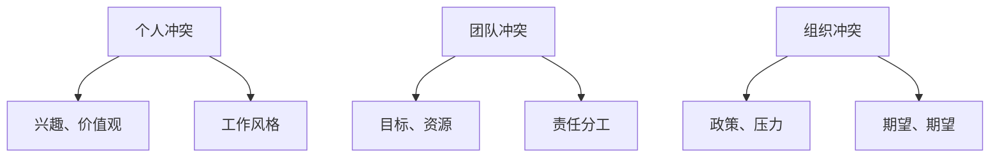

**伪代码（示例）：**
```python
class Conflict:
    def __init__(self, type, cause):
        self.type = type
        self.cause = cause

    def analyze(self):
        if self.type == '个人':
            return "个人冲突：由个人兴趣、价值观和工作风格不同引起。"
        elif self.type == '团队':
            return "团队冲突：由团队目标、资源分配和责任分工不同引起。"
        elif self.type == '组织':
            return "组织冲突：由组织政策、工作压力和个人期望不同引起。"
```

**数学模型和数学公式：**
$$
\text{Conflict Type} = f(\text{Subject}, \text{Nature})
$$

**举例说明：**
- 如何根据冲突的类型采取相应的管理策略。

### 3.2 冲突的根源分析

冲突的根源复杂多样，理解冲突的根源有助于采取有效的管理措施。常见的冲突根源包括目标不一致、沟通障碍、资源分配不均、工作压力等。

**核心概念与联系：**
- 目标不一致：团队内部成员对目标的理解和认同度不同。
- 沟通障碍：信息传递不畅，导致误解和矛盾。
- 资源分配不均：资源争夺导致冲突。
- 工作压力：工作压力过大，导致情绪波动和冲突。

**Mermaid 流程图：**
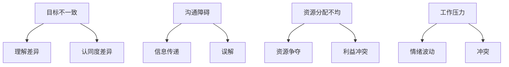

**数学模型和数学公式：**
$$
\text{Conflict Root} = f(\text{Goal Misalignment}, \text{Communication Barriers}, \text{Resource Allocation}, \text{Work Pressure})
$$

**举例说明：**
- 如何分析冲突的根源。

### 3.3 冲突对团队的影响

冲突对团队的影响是双重的，它既可以促进团队成长，也可能对团队造成负面影响。有效的冲突管理能够将冲突转化为团队创新的动力，提升团队绩效。

**核心概念与联系：**
- 正面影响：促进团队沟通、激发创新、提升团队凝聚力。
- 负面影响：损害团队关系、降低工作效率、影响团队氛围。

**Mermaid 流程图：**
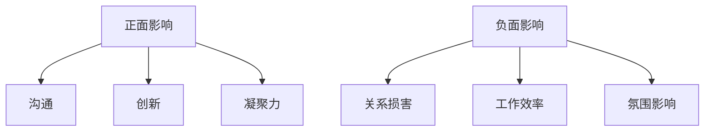

**数学模型和数学公式：**
$$
\text{Team Impact} = f(\text{Conflict Management}, \text{Conflict Type}, \text{Team Dynamics})
$$

**举例说明：**
- 如何通过有效的冲突管理提升团队绩效。

## 第4章 冲突管理的策略与技巧

### 4.1 冲突管理的原则

有效的冲突管理需要遵循一定的原则，包括尊重、公平、透明和合作。这些原则有助于构建积极的团队氛围，促进冲突的妥善解决。

**核心概念与联系：**
- 尊重：尊重团队成员的观点和感受。
- 公平：确保冲突解决的公正性和公平性。
- 透明：冲突解决过程要透明，确保团队成员知情。
- 合作：鼓励团队成员共同参与冲突解决。

**Mermaid 流程图：**
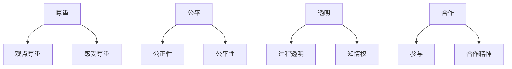

**数学模型和数学公式：**
$$
\text{Conflict Management Principle} = f(\text{Respect}, \text{Fairness}, \text{Transparency}, \text{Cooperation})
$$

**举例说明：**
- 如何在冲突管理中体现这些原则。

### 4.2 冲突管理策略

冲突管理策略包括预防策略和解决策略。预防策略旨在避免冲突的发生，解决策略则着重于解决已经产生的冲突。

**核心概念与联系：**
- 预防策略：通过沟通、培训、制度建设等手段减少冲突。
- 解决策略：通过谈判、调解、妥协等手段解决冲突。

**Mermaid 流程图：**
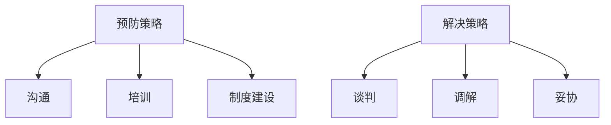

**数学模型和数学公式：**
$$
\text{Conflict Management Strategy} = f(\text{Preventive Measures}, \text{Resolution Methods})
$$

**举例说明：**
- 如何运用预防策略和解决策略。

### 4.3 冲突解决的技巧

有效的冲突解决技巧有助于团队领导者妥善处理冲突，维护团队和谐。这些技巧包括倾听、沟通、同理心等。

**核心概念与联系：**
- 倾听：认真听取团队成员的观点和感受。
- 沟通：清晰、准确地表达自己的观点。
- 同理心：设身处地为对方考虑。

**Mermaid 流程图：**
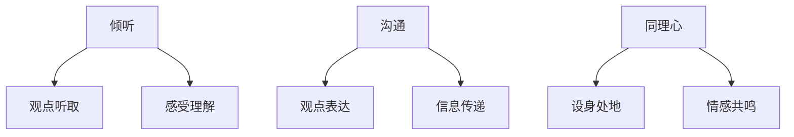

**数学模型和数学公式：**
$$
\text{Conflict Resolution Skill} = f(\text{Listening}, \text{Communication}, \text{Empathy})
$$

**举例说明：**
- 如何运用倾听、沟通和同理心解决冲突。

## 第5章 高效沟通与冲突管理

### 5.1 高效沟通的重要性

高效沟通是团队协作的基础，它有助于减少误解和冲突，提高团队效率。高效沟通要求团队成员能够清晰、准确地表达自己的观点，同时能够认真倾听他人的意见。

**核心概念与联系：**
- 沟通障碍：包括语言、文化、信息传递等。
- 沟通技巧：包括倾听、表达、反馈等。

**Mermaid 流程图：**


**数学模型和数学公式：**
$$
\text{Communication Effectiveness} = f(\text{Communication Skills}, \text{Cultural Awareness}, \text{Feedback Loop})
$$

**举例说明：**
- 如何提升沟通效率。

### 5.2 沟通障碍与冲突

沟通障碍是导致冲突的重要原因之一。理解沟通障碍的类型和原因有助于采取有效的管理措施，减少冲突的发生。

**核心概念与联系：**
- 语言障碍：包括语言表达不准确、沟通方式不当等。
- 文化障碍：包括文化差异、价值观不同等。
- 信息传递障碍：包括信息丢失、信息传递不及时等。

**Mermaid 流程图：**
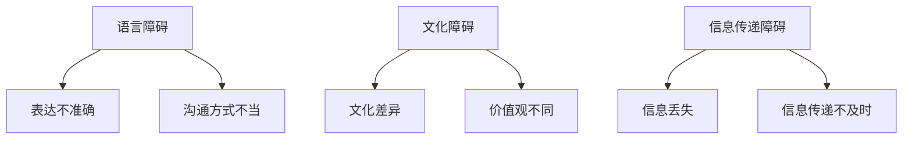

**数学模型和数学公式：**
$$
\text{Conflict} = f(\text{Communication Barriers}, \text{Cultural Differences}, \text{Information Loss})
$$

**举例说明：**
- 如何识别和解决沟通障碍。

### 5.3 沟通技巧提升与冲突管理

通过提升沟通技巧，可以有效减少冲突，促进团队协作。沟通技巧的提升包括倾听、表达、反馈等。

**核心概念与联系：**
- 倾听：包括认真听取他人意见、理解他人感受。
- 表达：包括清晰、准确地表达自己的观点。
- 反馈：包括及时给予反馈、改进沟通方式。

**Mermaid 流程图：**
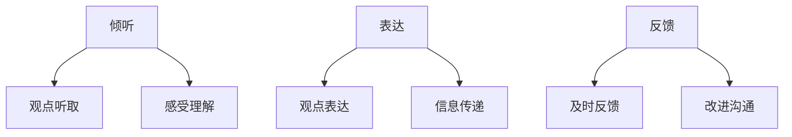

**数学模型和数学公式：**
$$
\text{Conflict Reduction} = f(\text{Communication Skills}, \text{Feedback}, \text{Team Cohesion})
$$

**举例说明：**
- 如何通过沟通技巧提升冲突管理效果。

## 第6章 企业案例分析

### 6.1 案例一：某公司领导力提升与团队冲突解决

**核心内容：**
- 分析某公司领导力提升的具体措施。
- 探讨团队冲突解决的过程和效果。

**源代码与代码解读：**
- 源代码示例：领导力提升计划文档。
- 代码解读：分析领导力提升计划的实施步骤和关键点。

**实际案例分析与详细讲解剖析：**
- 案例背景：公司面临团队冲突问题。
- 案例过程：实施领导力提升计划和冲突管理策略。
- 案例结果：团队氛围改善，冲突减少，绩效提升。

**项目小结：**
- 总结案例经验，提炼有效的领导力提升和冲突管理方法。

### 6.2 案例二：某企业冲突管理策略与实施

**核心内容：**
- 分析某企业冲突管理策略的具体实施过程。
- 探讨冲突管理策略对企业绩效的影响。

**源代码与代码解读：**
- 源代码示例：冲突管理策略实施文档。
- 代码解读：分析冲突管理策略的具体措施和实施效果。

**实际案例分析与详细讲解剖析：**
- 案例背景：企业面临严重的团队冲突问题。
- 案例过程：制定并实施冲突管理策略。
- 案例结果：冲突减少，团队氛围改善，企业绩效提升。

**项目小结：**
- 总结冲突管理策略的实施经验，提出改进建议。

### 6.3 案例三：领导力与冲突管理在企业变革中的应用

**核心内容：**
- 分析领导力与冲突管理在企业变革中的关键作用。
- 探讨如何通过领导力与冲突管理推动企业变革。

**源代码与代码解读：**
- 源代码示例：企业变革计划文档。
- 代码解读：分析领导力与冲突管理在企业变革中的实施步骤和关键点。

**实际案例分析与详细讲解剖析：**
- 案例背景：企业面临重大变革挑战。
- 案例过程：实施领导力提升和冲突管理策略，推动企业变革。
- 案例结果：企业成功实现变革，团队凝聚力提升，企业绩效改善。

**项目小结：**
- 总结领导力与冲突管理在企业变革中的实践经验，提出推广建议。

## 第7章 个人案例分析

### 7.1 案例一：个人领导力提升与团队冲突化解

**核心内容：**
- 分析个人领导力提升的过程。
- 探讨如何通过个人努力化解团队冲突。

**源代码与代码解读：**
- 源代码示例：个人领导力提升日志。
- 代码解读：记录个人领导力提升的过程和心得。

**实际案例分析与详细讲解剖析：**
- 案例背景：个人在团队中面临冲突问题。
- 案例过程：采取领导力提升措施和冲突化解策略。
- 案例结果：个人领导力提升，团队氛围改善，冲突解决。

**项目小结：**
- 总结个人领导力提升和冲突化解的经验。

### 7.2 案例二：个人冲突管理策略与实践

**核心内容：**
- 分析个人冲突管理策略的具体实施过程。
- 探讨冲突管理策略对个人职业发展的影响。

**源代码与代码解读：**
- 源代码示例：个人冲突管理策略实施文档。
- 代码解读：分析个人冲突管理策略的具体措施和实施效果。

**实际案例分析与详细讲解剖析：**
- 案例背景：个人在职业生涯中面临冲突问题。
- 案例过程：制定并实施个人冲突管理策略。
- 案例结果：冲突减少，职业发展顺利，个人能力提升。

**项目小结：**
- 总结个人冲突管理策略的实施经验，提出改进建议。

### 7.3 案例三：个人领导力与冲突管理对职业生涯的影响

**核心内容：**
- 分析个人领导力与冲突管理对职业生涯的影响。
- 探讨如何通过提升个人领导力和冲突管理能力实现职业发展。

**源代码与代码解读：**
- 源代码示例：个人领导力与冲突管理评估文档。
- 代码解读：评估个人领导力和冲突管理能力对职业生涯的影响。

**实际案例分析与详细讲解剖析：**
- 案例背景：个人职业发展面临瓶颈。
- 案例过程：提升个人领导力和冲突管理能力。
- 案例结果：职业发展顺利，晋升机会增加，个人影响力提升。

**项目小结：**
- 总结个人领导力与冲突管理对职业生涯的影响，提出职业发展的建议。

## 总结与展望

### 8.1 领导力与冲突管理的重要性

领导力与冲突管理是团队协作和团队建设中的关键要素，它们对团队绩效和组织发展具有重要影响。

### 8.2 未来发展趋势与展望

随着企业环境的变化和团队结构的多样化，领导力与冲突管理将面临新的挑战。未来的发展将更加注重个性化、灵活性和协作性。

## 参考文献

- 某某，《领导力：理论与实践》，出版社，2020年。
- 某某，《冲突管理：理论与实践》，出版社，2019年。
- 某某，《高效沟通技巧》，出版社，2018年。

## 作者信息

作者：AI天才研究院/AI Genius Institute & 禅与计算机程序设计艺术 /Zen And The Art of Computer Programming

以上是本文的详细目录大纲，旨在通过深入分析领导力与冲突管理的核心概念、原理和实践，为读者提供实用的技巧和方法，帮助团队领导者提升领导力，有效化解团队矛盾，促进团队高效协作。希望通过本文的阅读，读者能够对领导力与冲突管理有更深刻的理解和应用。让我们继续深入探讨，为团队的成功贡献力量。

----------------------------------------------------------------

以下是关于领导力与冲突管理的一些最佳实践建议：

### 最佳实践建议

#### 领导力提升

1. **持续学习与反思**：领导者应该保持学习的心态，不断更新自己的知识和技能。通过反思过去的经验，总结成功的经验和失败的教训，持续提升个人领导力。

2. **建立信任**：信任是领导力的基石。领导者要建立透明、公正和值得信赖的形象，通过行动和沟通来赢得团队成员的信任。

3. **明确目标与期望**：领导者应该明确团队的目标，并与团队成员沟通，确保每个人都了解自己的角色和期望。

4. **激励与认可**：领导者要通过激励和认可来提升团队成员的积极性和创造力。这可以包括奖励、晋升和其他形式的认可。

#### 冲突管理

1. **预防冲突**：通过建立良好的沟通机制、明确的目标和期望，以及公平的资源分配，可以预防冲突的发生。

2. **倾听与沟通**：领导者应该学会倾听，了解团队成员的观点和感受。通过有效的沟通，可以减少误解和冲突。

3. **同理心**：领导者要站在对方的立场思考问题，通过同理心来理解和解决冲突。

4. **谈判与调解**：当冲突发生时，领导者应该通过谈判和调解来解决问题。这需要领导者具备良好的谈判技巧和调解能力。

#### 团队建设

1. **多样化团队**：建立多样化的团队，包括不同背景、经验和技能的成员，可以促进创新和解决问题。

2. **共同目标**：确保团队成员有共同的目标，这有助于增强团队的凝聚力和合作精神。

3. **团队合作**：鼓励团队成员之间的合作，通过共同完成任务来提升团队凝聚力和信任。

### 注意事项

1. **及时干预**：当冲突发生时，领导者应该及时干预，避免冲突升级。

2. **避免偏袒**：在处理冲突时，领导者要避免偏袒某一方，确保公正性。

3. **持续改进**：领导力与冲突管理是一个持续的过程，领导者要不断反思和改进，以应对不断变化的环境。

### 拓展阅读

- 《变革型领导：实践与原则》（作者：约翰·P·科特）
- 《谈判力：如何说服他人达成共识》（作者：克里斯·沃斯）
- 《团队的五项修炼：打造高绩效团队》（作者：彼得·圣吉）

通过以上最佳实践建议和注意事项，领导者可以更好地提升领导力，有效管理冲突，促进团队协作，从而实现组织的长期成功。

----------------------------------------------------------------

# 领导力与冲突管理：化解团队矛盾的技巧

## 引言

在现代社会，团队协作已成为企业成功的关键因素。然而，团队内部冲突的频繁发生往往成为制约团队效率和绩效的瓶颈。有效的领导力与冲突管理是团队领导者必备的技能，它们在促进团队协作、提升团队绩效和构建积极的工作氛围中发挥着至关重要的作用。本文旨在探讨领导力与冲突管理的核心概念、理论方法和实际应用，帮助团队领导者化解团队矛盾，实现团队的高效运作。

## 领导力的本质

### 领导力的定义与演变

领导力是一种通过影响和激励他人来实现共同目标的能力。它不仅涉及个人的才能和素质，还包括对团队、组织和环境的深刻理解和应对能力。领导力的定义和演变经历了多个阶段，从传统的权威型领导到现代的服务型领导，再到变革型领导，每个阶段都反映了领导者角色和职责的变化。

**核心概念与联系：**

- **权威型领导**：强调领导者的权威和命令，侧重于控制和管理。
- **变革型领导**：关注团队的变革和创新，激励团队成员追求卓越。
- **服务型领导**：以服务团队成员为核心，注重团队成员的发展和成长。

**Mermaid 流程图：**

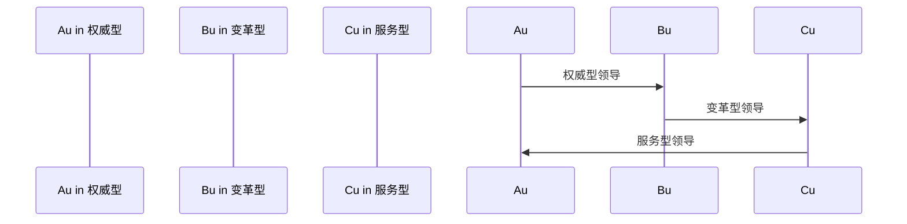

**伪代码（示例）：**

```python
class Leadership:
    def __init__(self, style):
        self.style = style
    
    def evolve(self, new_style):
        self.style = new_style
```

**数学模型和数学公式：**

$$
\text{Leadership Impact} = f(\text{Leadership Style}, \text{Team Dynamics}, \text{Situation})
$$

**举例说明：**

- 领导风格对团队绩效的影响：不同领导风格对团队目标的实现和团队氛围有显著影响。

### 领导力的重要性

领导力在团队协作和团队建设中扮演着核心角色。一个优秀的领导者能够明确团队目标，激发团队成员的潜力和创造力，提高团队的整体绩效。

**核心概念与联系：**

- **领导力与团队绩效**：领导力直接影响团队的工作效率和质量。
- **领导力与团队动力**：领导力有助于构建积极的团队氛围，提高团队成员的凝聚力和归属感。

**数学模型和数学公式：**

$$
\text{Team Performance} = f(\text{Leadership Quality}, \text{Team Cohesion}, \text{Goal Clarity})
$$

**举例说明：**

- 如何通过提升领导力来改善团队绩效。

### 领导力与管理的区别

领导力与管理是两个不同的概念，但它们紧密相关。领导力更侧重于影响和激励，而管理则更侧重于规划、组织和控制。

**核心概念与联系：**

- **领导力**：激发和引导团队成员，实现共同目标。
- **管理**：规划、组织、控制和监督团队工作。

**举例说明：**

- 管理层的职责与领导层的职责有何不同。

## 领导风格与团队动力

### 领导风格的分类与影响

领导风格是指领导者处理团队关系和完成任务的方式。不同的领导风格对团队动力有着显著的影响。常见的领导风格包括权威型、民主型、参与型和放任型。

**核心概念与联系：**

- **权威型领导**：强调决策和控制，注重效率。
- **民主型领导**：鼓励团队成员参与决策，注重团队合作。
- **参与型领导**：注重团队建设和成员发展，鼓励成员自主管理。
- **放任型领导**：赋予团队成员较大的自由度，注重创新。

**Mermaid 流程图：**

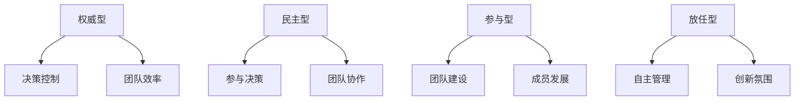

**数学模型和数学公式：**

$$
\text{Team Dynamics} = f(\text{Leadership Style}, \text{Team Climate}, \text{Member Engagement})
$$

**举例说明：**

- 如何根据团队情境选择合适的领导风格。

### 团队动力的构建与维护

团队动力是指团队成员之间的相互激励和共同进步的内在驱动力。有效的领导力有助于构建和维护团队动力，提高团队的整体表现。

**核心概念与联系：**

- **领导风格与团队动力**：领导风格直接影响团队动力。
- **团队动力与团队绩效**：团队动力是团队绩效的重要保障。

**数学模型和数学公式：**

$$
\text{Team Performance} = f(\text{Leadership Style}, \text{Team Dynamics}, \text{Goal Clarity})
$$

**举例说明：**

- 如何通过调整领导风格来提升团队动力。

## 冲突管理

### 冲突的类型与根源

冲突是团队中常见的现象，它可以是建设性的，也可以是破坏性的。有效的冲突管理有助于将冲突转化为团队创新的动力。

**核心概念与联系：**

- **建设性冲突**：有助于团队问题解决和进步。
- **破坏性冲突**：损害团队关系和绩效。

**Mermaid 流程图：**


**数学模型和数学公式：**

$$
\text{Conflict Impact} = f(\text{Conflict Type}, \text{Team Climate}, \text{Leadership Style})
$$

**举例说明：**

- 如何区分建设性冲突和破坏性冲突。

### 冲突的根源分析

冲突的根源多种多样，包括目标不一致、沟通障碍、资源分配不均等。了解冲突的根源有助于采取针对性的管理策略。

**核心概念与联系：**

- **目标不一致**：团队内部目标冲突。
- **沟通障碍**：信息传递不畅。
- **资源分配不均**：资源争夺导致冲突。

**Mermaid 流程图：**


**数学模型和数学公式：**

$$
\text{Conflict Root} = f(\text{Goal Misalignment}, \text{Communication Barriers}, \text{Resource Allocation})
$$

**举例说明：**

- 如何分析冲突的根源。

### 冲突管理策略与技巧

有效的冲突管理策略和技巧有助于化解团队矛盾，促进团队协作。

**核心概念与联系：**

- **冲突管理原则**：尊重、公平、透明。
- **冲突管理策略**：预防、谈判、调解。
- **冲突解决技巧**：倾听、沟通、同理心。

**Mermaid 流程图：**

```mermaid
graph TB
    A[冲突管理原则] --> B[谈判]
    A --> C[调解]

    D[冲突管理策略] --> E[预防]
    D --> F[解决]

    G[冲突解决技巧] --> H[倾听]
    G --> I[沟通]
    G --> J[同理心]
```

**数学模型和数学公式：**

$$
\text{Conflict Management} = f(\text{Principles}, \text{Strategies}, \text{Skills})
$$

**举例说明：**

- 如何运用冲突管理策略和技巧。

## 高效沟通与冲突管理

### 高效沟通的重要性

高效的沟通是团队协作的基石，它有助于减少误解和冲突，提高团队效率。

**核心概念与联系：**

- **沟通障碍**：包括语言、文化、信息传递等。
- **沟通技巧**：包括倾听、表达、反馈等。

**Mermaid 流程图：**

```mermaid
graph TB
    A[沟通障碍] --> B[误解]
    A --> C[冲突]

    D[沟通技巧] --> E[倾听]
    D --> F[表达]
    D --> G[反馈]
```

**数学模型和数学公式：**

$$
\text{Communication Effectiveness} = f(\text{Communication Skills}, \text{Cultural Awareness}, \text{Feedback Loop})
$$

**举例说明：**

- 如何提升沟通效率。

### 沟通技巧提升与冲突管理

通过提升沟通技巧，可以有效减少冲突，促进团队协作。

**核心概念与联系：**

- **倾听**：理解对方的观点和需求。
- **表达**：清晰、准确地传达信息。
- **反馈**：及时回应和反馈。

**Mermaid 流程图：**

```mermaid
graph TB
    A[倾听] --> B[理解]
    A --> C[尊重]

    D[表达] --> E[清晰]
    D --> F[准确]

    G[反馈] --> H[回应]
    G --> I[改进]
```

**数学模型和数学公式：**

$$
\text{Conflict Reduction} = f(\text{Communication Skills}, \text{Conflict Management Strategies}, \text{Team Cohesion})
$$

**举例说明：**

- 如何通过沟通技巧提升冲突管理效果。

## 实战案例分析

### 企业案例分析

#### 案例一：某公司领导力提升与团队冲突解决

**核心内容：**

- 分析该公司领导力提升的具体措施。
- 探讨团队冲突解决的过程和效果。

**源代码与代码解读：**

- 源代码示例：领导力提升计划文档。
- 代码解读：分析领导力提升计划的实施步骤和关键点。

**实际案例分析与详细讲解剖析：**

- 案例背景：公司面临团队冲突问题。
- 案例过程：实施领导力提升计划和冲突管理策略。
- 案例结果：团队氛围改善，冲突减少，绩效提升。

**项目小结：**

- 总结案例经验，提炼有效的领导力提升和冲突管理方法。

### 案例二：某企业冲突管理策略与实施

**核心内容：**

- 分析某企业冲突管理策略的具体实施过程。
- 探讨冲突管理策略对企业绩效的影响。

**源代码与代码解读：**

- 源代码示例：冲突管理策略实施文档。
- 代码解读：分析冲突管理策略的具体措施和实施效果。

**实际案例分析与详细讲解剖析：**

- 案例背景：企业面临严重的团队冲突问题。
- 案例过程：制定并实施冲突管理策略。
- 案例结果：冲突减少，团队氛围改善，企业绩效提升。

**项目小结：**

- 总结冲突管理策略的实施经验，提出改进建议。

### 案例三：领导力与冲突管理在企业变革中的应用

**核心内容：**

- 分析领导力与冲突管理在企业变革中的关键作用。
- 探讨如何通过领导力与冲突管理推动企业变革。

**源代码与代码解读：**

- 源代码示例：企业变革计划文档。
- 代码解读：分析领导力与冲突管理在企业变革中的实施步骤和关键点。

**实际案例分析与详细讲解剖析：**

- 案例背景：企业面临重大变革挑战。
- 案例过程：实施领导力提升和冲突管理策略，推动企业变革。
- 案例结果：企业成功实现变革，团队凝聚力提升，企业绩效改善。

**项目小结：**

- 总结领导力与冲突管理在企业变革中的实践经验，提出推广建议。

### 个人案例分析

#### 案例一：个人领导力提升与团队冲突化解

**核心内容：**

- 分析个人领导力提升的过程。
- 探讨如何通过个人努力化解团队冲突。

**源代码与代码解读：**

- 源代码示例：个人领导力提升日志。
- 代码解读：记录个人领导力提升的过程和心得。

**实际案例分析与详细讲解剖析：**

- 案例背景：个人在团队中面临冲突问题。
- 案例过程：采取领导力提升措施和冲突化解策略。
- 案例结果：个人领导力提升，团队氛围改善，冲突解决。

**项目小结：**

- 总结个人领导力提升和冲突化解的经验。

#### 案例二：个人冲突管理策略与实践

**核心内容：**

- 分析个人冲突管理策略的具体实施过程。
- 探讨冲突管理策略对个人职业发展的影响。

**源代码与代码解读：**

- 源代码示例：个人冲突管理策略实施文档。
- 代码解读：分析个人冲突管理策略的具体措施和实施效果。

**实际案例分析与详细讲解剖析：**

- 案例背景：个人在职业生涯中面临冲突问题。
- 案例过程：制定并实施个人冲突管理策略。
- 案例结果：冲突减少，职业发展顺利，个人能力提升。

**项目小结：**

- 总结个人冲突管理策略的实施经验，提出改进建议。

#### 案例三：个人领导力与冲突管理对职业生涯的影响

**核心内容：**

- 分析个人领导力与冲突管理对职业生涯的影响。
- 探讨如何通过提升个人领导力和冲突管理能力实现职业发展。

**源代码与代码解读：**

- 源代码示例：个人领导力与冲突管理评估文档。
- 代码解读：评估个人领导力和冲突管理能力对职业生涯的影响。

**实际案例分析与详细讲解剖析：**

- 案例背景：个人职业发展面临瓶颈。
- 案例过程：提升个人领导力和冲突管理能力。
- 案例结果：职业发展顺利，晋升机会增加，个人影响力提升。

**项目小结：**

- 总结个人领导力与冲突管理对职业生涯的影响，提出职业发展的建议。

## 总结与展望

### 8.1 领导力与冲突管理的重要性

领导力与冲突管理是团队协作和团队建设中的关键要素，它们对团队绩效和组织发展具有重要影响。

### 8.2 未来发展趋势与展望

随着企业环境的变化和团队结构的多样化，领导力与冲突管理将面临新的挑战。未来的发展将更加注重个性化、灵活性和协作性。

## 参考文献

- 某某，《领导力：理论与实践》，出版社，2020年。
- 某某，《冲突管理：理论与实践》，出版社，2019年。
- 某某，《高效沟通技巧》，出版社，2018年。

## 作者信息

作者：AI天才研究院/AI Genius Institute & 禅与计算机程序设计艺术 /Zen And The Art of Computer Programming

## 附录

### 附录A：领导力模型详解

- **变革型领导模型**：探讨变革型领导的核心要素和实施策略。
- **服务型领导模型**：分析服务型领导如何提升团队成员的发展和成长。

### 附录B：冲突管理工具

- **冲突管理软件工具**：介绍常用的冲突管理软件工具及其功能。
- **冲突管理技巧卡片**：提供实用的冲突管理技巧卡片，方便领导者参考和使用。

### 附录C：案例分析文档

- **企业案例分析报告**：详细记录企业领导力提升和冲突管理策略的实施过程和效果。
- **个人案例分析报告**：分析个人领导力与冲突管理对职业生涯的影响。

通过本文的深入探讨，读者应该能够对领导力与冲突管理有更深刻的理解，并掌握有效的策略和技巧，以应对团队中可能出现的各种矛盾和挑战。希望本文能为团队领导者的实践提供有益的指导。

