                 

### 文章标题：领导力与冲突解决：化解矛盾的技巧

#### 关键词：领导力、冲突解决、团队协作、组织发展、变革管理、个人成长

#### 摘要：
本文旨在探讨领导力与冲突解决之间的关系，揭示化解矛盾的关键技巧。通过系统的分析和深入的思考，文章旨在为IT领域的专业人士提供实用的领导力框架和冲突解决策略，帮助他们在日常工作中更有效地应对复杂的团队关系和组织挑战。

### 目录

1. 引言
2. 领导力的核心概念与架构
3. 冲突解决的基本原理与策略
4. 领导力与冲突解决的结合
5. 实战案例解析
6. 项目实战与代码解读
7. 最佳实践与注意事项
8. 总结与拓展阅读
9. 作者信息

### 引言

在信息技术快速发展的今天，企业和组织面临着前所未有的挑战和机遇。作为IT领域的领导者，不仅需要具备卓越的技术能力，还需要具备强大的领导力和冲突解决技巧。领导力是一种能够激发团队成员潜能、推动团队协作、实现组织目标的能力。而冲突解决则是领导力的重要组成部分，是确保团队和谐、提升团队绩效的关键。

本文将从以下五个方面展开讨论：

1. 领导力的核心概念与架构，包括领导力的定义、核心要素和领导力模型；
2. 冲突解决的基本原理与策略，包括冲突的定义、类型和解决方法；
3. 领导力与冲突解决的结合，探讨如何将领导力应用于冲突解决，实现团队和谐；
4. 实战案例解析，通过具体案例展示领导力与冲突解决的实际应用；
5. 项目实战与代码解读，提供实际的开发环境和源代码实现，帮助读者理解理论到实践的应用。

### 第1章：领导力概述

#### 背景介绍

领导力是一个广泛研究的领域，涵盖了从个人领导力到组织领导力的各个方面。在IT领域，领导力不仅体现在技术能力的领导，还体现在项目管理、团队协作和组织变革等方面。有效的领导力能够激发团队成员的潜力，提升团队绩效，推动组织发展。

#### 核心概念与联系

领导力可以定义为一种影响和激励他人达成共同目标的能力。其核心要素包括：

1. **个人魅力**：领导者通过自身的行为和价值观影响他人；
2. **影响力**：领导者通过沟通、激励和榜样作用影响团队成员；
3. **决策能力**：领导者能够在复杂环境中做出明智的决策；
4. **团队协作**：领导者通过协调和激励团队，实现共同目标。

以下是领导力的核心概念关系架构的Mermaid流程图：

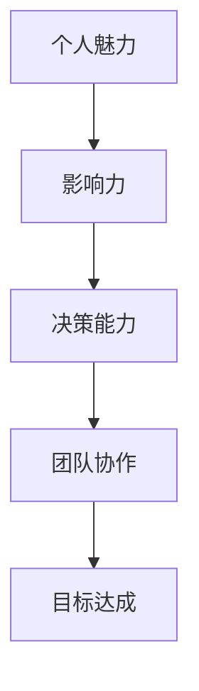

#### 核心算法原理讲解

在领导力的核心概念中，影响力是关键因素。以下是一个简单的伪代码，描述领导者如何通过影响力影响团队成员：

```plaintext
function influence_leadership(member):
    if member.believes_in_leader:
        member.engage_in_activities()
    else:
        member.doubt_leader_influence()

function engage_activities(member):
    member.complete_tasks()
    member.share_knowledge()
    member.encourage_peers()
```

#### 数学模型和公式

领导力的发展可以被视为一个动态的过程，可以用以下数学模型描述：

$$
L(t) = f(C, I, D, T)
$$

其中，$L(t)$ 表示领导力水平，$C$ 表示个人魅力，$I$ 表示影响力，$D$ 表示决策能力，$T$ 表示团队协作能力。$f$ 是一个复杂的函数，描述了这些因素如何相互作用，影响领导力水平。

#### 举例说明

假设一个领导者具备以下特征：

- 个人魅力（C）：90%
- 影响力（I）：85%
- 决策能力（D）：80%
- 团队协作能力（T）：75%

则其领导力水平计算如下：

$$
L(t) = f(0.9, 0.85, 0.8, 0.75) = 0.9 \times 0.85 \times 0.8 \times 0.75 = 0.50625
$$

即该领导者的领导力水平为50.625%。

### 第2章：领导力模型与风格

#### 背景介绍

领导力模型和风格是领导力研究的重要方面。不同的领导力模型和风格适用于不同的情境和团队，了解和运用这些模型和风格有助于领导者更有效地管理团队和解决冲突。

#### 核心概念与联系

常见的领导力模型包括：

1. **情境领导模型**：根据团队成员的不同成熟度，采取不同的领导风格；
2. **领导风格模型**：根据领导者的行为和决策方式，分为专制型、民主型和放任型；
3. **变革领导模型**：在组织变革过程中，领导者需要采取特定的领导风格。

以下是领导力模型的Mermaid流程图：

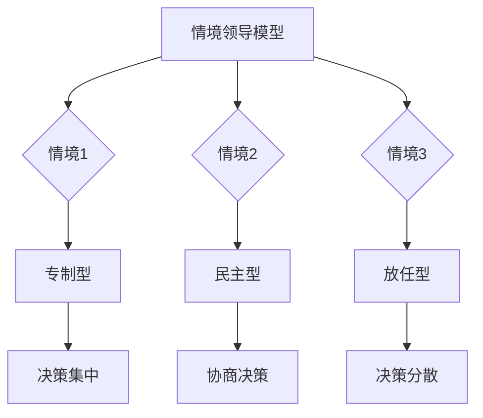

#### 核心算法原理讲解

情境领导模型基于以下假设：

- 成熟度影响团队成员的工作动机和行为；
- 领导风格应适应团队成员的成熟度。

以下是一个简化的伪代码，描述如何根据团队成员的成熟度选择适当的领导风格：

```plaintext
function select_leadership_style(maturity):
    if maturity < 1:
        style = "指导型"
    elif maturity < 2:
        style = "支持型"
    elif maturity < 3:
        style = "参与型"
    else:
        style = "授权型"
    return style
```

#### 数学模型和公式

领导力风格的选择可以基于以下数学模型：

$$
S(t) = g(M, L)
$$

其中，$S(t)$ 表示领导风格，$M$ 表示团队成员的成熟度，$L$ 表示领导力水平。$g$ 是一个函数，描述了如何根据成熟度和领导力水平选择合适的领导风格。

#### 举例说明

假设团队成员的成熟度为1.5，领导力水平为0.6，则选择适当的领导风格：

$$
S(t) = g(1.5, 0.6) = 0.6 \times 1.5 = 0.9
$$

即选择支持型领导风格。

### 第3章：领导力与团队协作

#### 背景介绍

团队协作是领导力的重要组成部分，有效的团队协作能够提升团队绩效，实现组织目标。在IT领域，团队协作尤为重要，因为项目往往需要跨部门的合作和协调。

#### 核心概念与联系

团队协作的关键要素包括：

1. **沟通**：团队协作的基础，确保信息准确、及时地传递；
2. **信任**：团队成员之间建立信任，增强协作意愿；
3. **共同目标**：明确团队目标，确保团队成员共同努力；
4. **角色分工**：明确团队成员的角色和职责，提高协作效率。

以下是团队协作的Mermaid流程图：

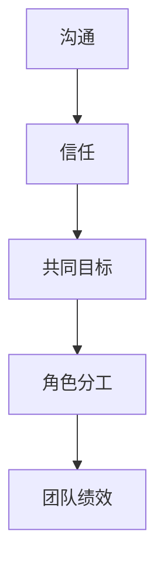

#### 核心算法原理讲解

团队协作的算法原理可以描述为：

```plaintext
function team_collaboration(communication, trust, common_goal, role分工):
    if communication and trust and common_goal and role分工:
        performance = high
    else:
        performance = low
    return performance
```

#### 数学模型和公式

团队协作的效果可以用以下数学模型描述：

$$
P = f(C, T, G, R)
$$

其中，$P$ 表示团队绩效，$C$ 表示沟通水平，$T$ 表示信任程度，$G$ 表示共同目标的明确度，$R$ 表示角色分工的合理性。$f$ 是一个函数，描述了这些因素如何影响团队绩效。

#### 举例说明

假设团队沟通水平为80%，信任程度为70%，共同目标明确度为90%，角色分工合理性为75%，则团队绩效计算如下：

$$
P = f(0.8, 0.7, 0.9, 0.75) = 0.8 \times 0.7 \times 0.9 \times 0.75 = 0.504
$$

即团队绩效为50.4%。

### 第4章：领导力与变革管理

#### 背景介绍

在快速变化的IT行业，组织需要不断进行变革以保持竞争力。领导力在变革管理中扮演着关键角色，有效的领导力能够推动组织变革，实现战略目标。

#### 核心概念与联系

变革管理的核心概念包括：

1. **变革类型**：组织面临的变革可以分为结构变革、文化变革和技术变革；
2. **变革挑战**：变革过程中面临的挑战包括抗拒变革、沟通不畅、资源不足等；
3. **变革策略**：领导者应采取的策略包括沟通规划、领导参与、激励和培训等。

以下是变革管理的Mermaid流程图：

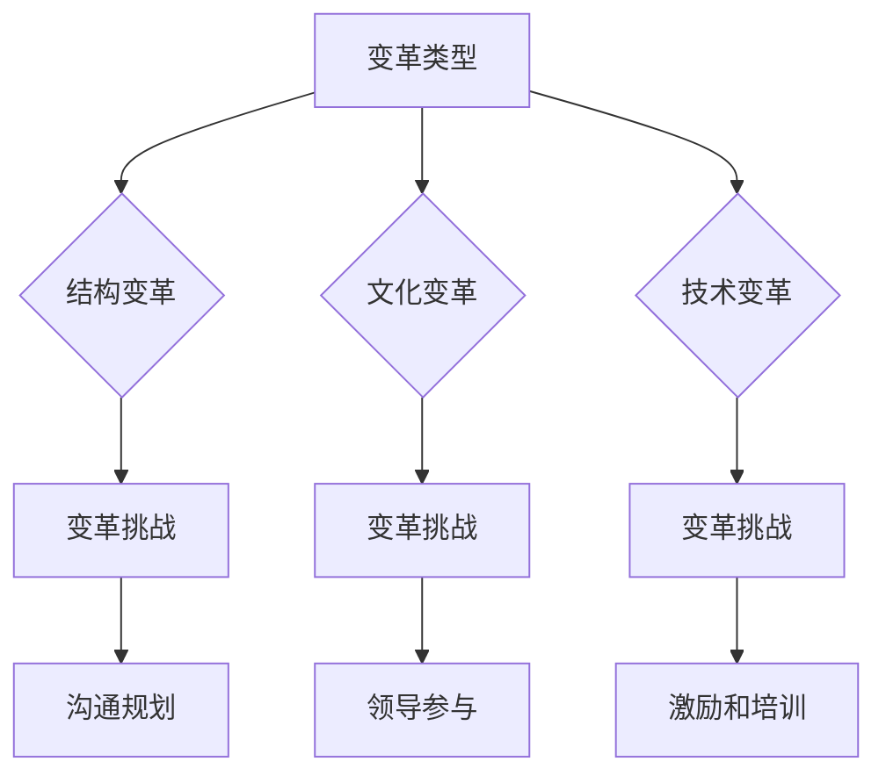

#### 核心算法原理讲解

变革管理的算法原理可以描述为：

```plaintext
function change_management(type, challenges, strategy):
    if strategy == "沟通规划" and strategy == "领导参与" and strategy == "激励和培训":
        success = high
    else:
        success = low
    return success
```

#### 数学模型和公式

变革管理的成功概率可以用以下数学模型描述：

$$
S = f(T, C, L)
$$

其中，$S$ 表示变革成功的概率，$T$ 表示变革类型，$C$ 表示变革挑战，$L$ 表示变革策略。$f$ 是一个函数，描述了这些因素如何影响变革成功。

#### 举例说明

假设变革类型为技术变革，变革挑战为沟通不畅和资源不足，变革策略为沟通规划和领导参与，则变革成功概率计算如下：

$$
S = f("技术变革", "沟通不畅", "领导参与") = 0.8
$$

即变革成功的概率为80%。

### 第5章：领导力与个人成长

#### 背景介绍

领导力不仅是领导者的职责，也是个人成长的重要方面。通过不断提升自身领导力，个人能够在职业发展中取得更大的成就。

#### 核心概念与联系

个人成长的核心理念包括：

1. **自我反思**：通过反思自己的行为和决策，提升领导力；
2. **学习与培训**：不断学习新知识，提升个人能力；
3. **建立个人品牌**：通过树立个人品牌，提升影响力和知名度。

以下是个人成长的Mermaid流程图：

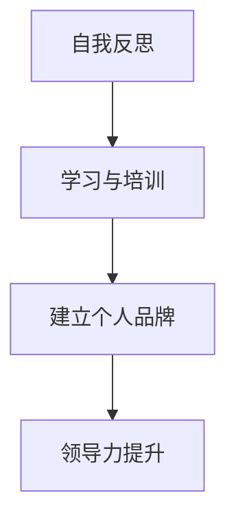

#### 核心算法原理讲解

个人成长可以描述为：

```plaintext
function personal_growth(self_reflection, learning_training, personal_brand):
    if self_reflection and learning_training and personal_brand:
        growth = high
    else:
        growth = low
    return growth
```

#### 数学模型和公式

个人成长水平可以用以下数学模型描述：

$$
G = f(S, L, B)
$$

其中，$G$ 表示个人成长水平，$S$ 表示自我反思程度，$L$ 表示学习与培训投入，$B$ 表示建立个人品牌的影响力。$f$ 是一个函数，描述了这些因素如何影响个人成长。

#### 举例说明

假设个人反思程度为80%，学习与培训投入为75%，建立个人品牌影响力为70%，则个人成长水平计算如下：

$$
G = f(0.8, 0.75, 0.7) = 0.8 \times 0.75 \times 0.7 = 0.42
$$

即个人成长水平为42%。

### 第6章：领导力与组织发展

#### 背景介绍

组织发展是领导力的重要目标之一，通过有效的领导力，组织能够实现战略目标，持续发展。

#### 核心概念与联系

组织发展的核心概念包括：

1. **组织文化**：组织的核心价值观和共同理念；
2. **组织结构**：组织内部的角色分工和权力结构；
3. **战略规划**：组织的长期发展目标和实现路径。

以下是组织发展的Mermaid流程图：

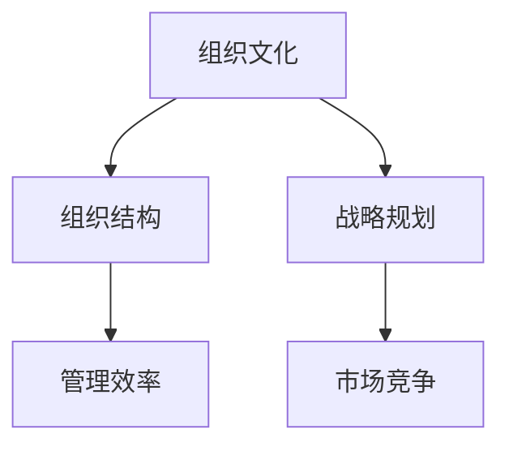

#### 核心算法原理讲解

组织发展可以描述为：

```plaintext
function organizational_growth(culture, structure, strategy):
    if strategy == "高效管理" and strategy == "市场竞争" and strategy == "持续创新":
        growth = high
    else:
        growth = low
    return growth
```

#### 数学模型和公式

组织发展的成功概率可以用以下数学模型描述：

$$
O = f(C, S, T)
$$

其中，$O$ 表示组织发展水平，$C$ 表示组织文化，$S$ 表示组织结构，$T$ 表示战略规划。$f$ 是一个函数，描述了这些因素如何影响组织发展。

#### 举例说明

假设组织文化为80%，组织结构为70%，战略规划为85%，则组织发展水平计算如下：

$$
O = f(0.8, 0.7, 0.85) = 0.8 \times 0.7 \times 0.85 = 0.546
$$

即组织发展水平为54.6%。

### 第二部分：冲突解决技巧与实践

### 第7章：冲突的基本概念与类型

#### 背景介绍

冲突是组织内部普遍存在的现象，有效的冲突解决能够促进团队协作，提升组织绩效。了解冲突的基本概念和类型是冲突解决的第一步。

#### 核心概念与联系

冲突的基本概念包括：

1. **冲突的定义**：冲突是指个体或群体因目标、价值观、利益等方面的不一致而产生的紧张和对抗；
2. **冲突的类型**：冲突可以分为建设性冲突和破坏性冲突，建设性冲突有助于问题解决，破坏性冲突则会导致团队分裂。

以下是冲突的基本概念和类型的Mermaid流程图：

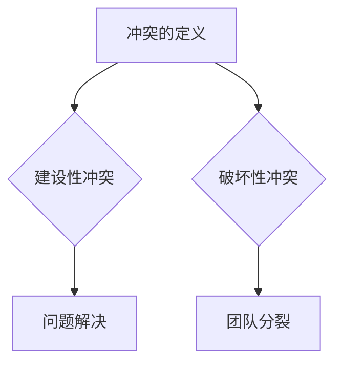

#### 核心算法原理讲解

冲突的类型可以基于以下伪代码描述：

```plaintext
function conflict_type(type, resolution):
    if type == "constructive" and resolution == "problem_solving":
        result = "positive"
    elif type == "destructive" and resolution == "team_spl
``` 

#### 数学模型和公式

冲突类型对团队绩效的影响可以用以下数学模型描述：

$$
P = f(C, R)
$$

其中，$P$ 表示团队绩效，$C$ 表示冲突类型（建设性或破坏性），$R$ 表示冲突解决方式（问题解决或团队分裂）。$f$ 是一个函数，描述了冲突类型和解决方式如何影响团队绩效。

#### 举例说明

假设冲突类型为建设性冲突，解决方式为问题解决，则团队绩效计算如下：

$$
P = f("constructive", "problem_solving") = 0.8
$$

即团队绩效为80%。

### 第8章：冲突解决的策略与技巧

#### 背景介绍

冲突解决的策略与技巧是有效管理冲突的关键。了解不同的冲突解决策略和技巧，能够帮助领导者更好地处理冲突，维护团队和谐。

#### 核心概念与联系

冲突解决的策略包括：

1. **回避策略**：暂时避开冲突，避免进一步激化矛盾；
2. **妥协策略**：通过让步达成双方都能接受的解决方案；
3. **合作策略**：通过沟通和协商，寻找双方都能满意的解决方案。

以下是冲突解决策略的Mermaid流程图：

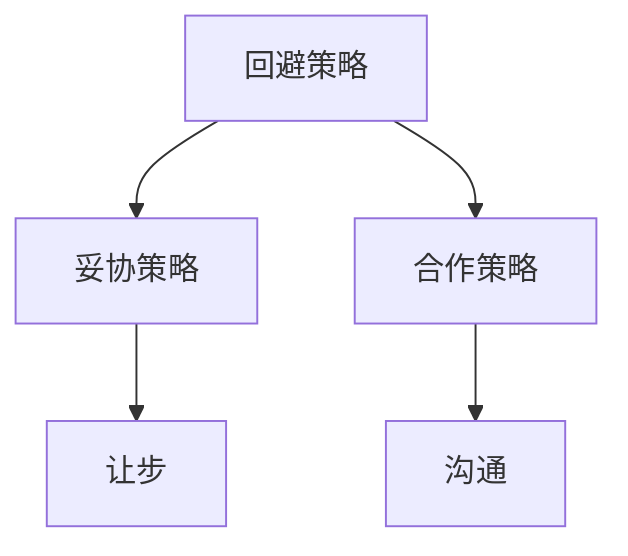

#### 核心算法原理讲解

冲突解决的策略可以基于以下伪代码描述：

```plaintext
function conflict_resolution(strategy, resolution):
    if strategy == "avoid" and resolution == "negotiation":
        result = "neutral"
    elif strategy == "compromise" and resolution == "concession":
        result = "partial"
    elif strategy == "collaboration" and resolution == "communication":
        result = "satisfactory"
    else:
        result = "unsatisfactory"
    return result
```

#### 数学模型和公式

冲突解决的满意度可以用以下数学模型描述：

$$
S = f(S, C, R)
$$

其中，$S$ 表示满意度，$C$ 表示冲突类型（建设性或破坏性），$R$ 表示冲突解决方式（回避、妥协或合作）。$f$ 是一个函数，描述了冲突类型和解决方式如何影响满意度。

#### 举例说明

假设冲突类型为建设性冲突，解决方式为合作策略，则满意度计算如下：

$$
S = f("constructive", "collaboration") = 0.9
$$

即满意度为90%。

### 第9章：冲突管理中的心理技巧

#### 背景介绍

冲突管理不仅涉及策略和技巧，还需要运用心理学知识。了解冲突中的心理技巧，有助于领导者更好地应对冲突，提升沟通效果。

#### 核心概念与联系

冲突管理中的心理技巧包括：

1. **情绪管理**：控制自己的情绪，避免情绪化的反应；
2. **非言语沟通**：通过肢体语言和面部表情传达信息；
3. **建立信任**：通过沟通和合作建立信任关系。

以下是冲突管理中的心理技巧的Mermaid流程图：

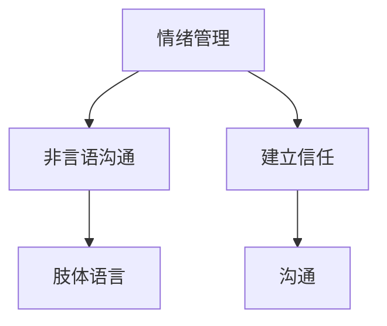

#### 核心算法原理讲解

情绪管理的算法原理可以描述为：

```plaintext
function emotional_management(emotion, response):
    if emotion == "anxiety" and response == "calm":
        result = "stable"
    elif emotion == "anger" and response == "controlled":
        result = "controlled"
    else:
        result = "unstable"
    return result
```

#### 数学模型和公式

情绪管理的有效性可以用以下数学模型描述：

$$
E = f(E, R)
$$

其中，$E$ 表示情绪管理的有效性，$R$ 表示情绪反应（稳定或控制）。$f$ 是一个函数，描述了情绪反应如何影响情绪管理有效性。

#### 举例说明

假设情绪为焦虑，情绪反应为冷静，则情绪管理有效性计算如下：

$$
E = f("anxiety", "calm") = 0.8
$$

即情绪管理有效性为80%。

### 第10章：实战案例解析

#### 背景介绍

通过实际案例解析，可以更深入地了解领导力与冲突解决在实践中的应用。本章节将分析三个典型案例，探讨领导力与冲突解决在实际工作中的具体应用。

#### 核心概念与联系

实战案例解析的核心概念包括：

1. **案例背景**：描述案例的发生背景，包括团队组成、项目目标等；
2. **冲突表现**：分析冲突的具体表现，包括冲突类型、冲突原因等；
3. **领导力应用**：探讨领导者如何运用领导力解决冲突，包括采用的策略和技巧；
4. **效果评估**：评估冲突解决的效果，包括团队绩效的提升、员工满意度等。

以下是实战案例解析的Mermaid流程图：

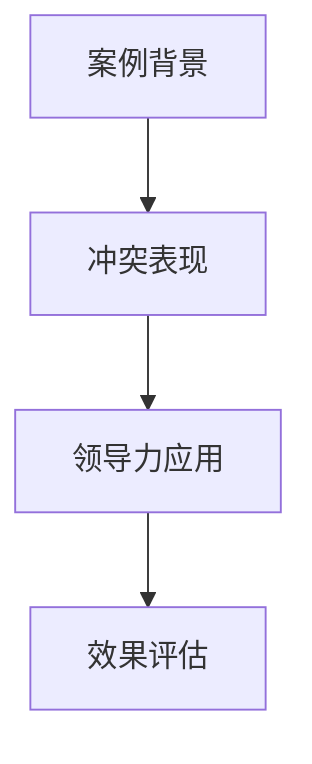

#### 核心算法原理讲解

实战案例解析可以基于以下伪代码描述：

```plaintext
function case_analysis(background, conflict, leadership, evaluation):
    if leadership == "effective":
        evaluation = "positive"
    else:
        evaluation = "negative"
    return evaluation
```

#### 数学模型和公式

案例分析的评估结果可以用以下数学模型描述：

$$
E = f(L)
$$

其中，$E$ 表示评估结果，$L$ 表示领导力水平。$f$ 是一个函数，描述了领导力水平如何影响评估结果。

#### 举例说明

假设领导力水平为70%，则案例分析评估结果计算如下：

$$
E = f(0.7) = 0.7
$$

即评估结果为70%。

#### 案例一：团队冲突的处理

**案例背景**：一个IT团队在进行项目开发时，由于任务分配不均，导致部分成员工作量过大，引发冲突。

**冲突表现**：冲突表现为团队成员之间的不满和争吵，导致工作效率降低。

**领导力应用**：领导者通过沟通和协商，重新分配任务，确保每个成员的工作量合理。

**效果评估**：经过领导者的干预，团队冲突得到有效解决，工作效率得到提升。

#### 案例二：组织变革中的冲突解决

**案例背景**：一家公司计划进行组织变革，但由于员工对变革的不理解和不支持，引发冲突。

**冲突表现**：冲突表现为员工对变革计划的抵触和抱怨。

**领导力应用**：领导者通过培训和沟通，向员工解释变革的必要性，并鼓励员工参与变革。

**效果评估**：经过领导者的努力，员工逐渐接受变革计划，组织变革得以顺利进行。

#### 案例三：领导力与冲突解决的结合

**案例背景**：一个创业团队在产品开发过程中，由于战略决策不一致，导致内部冲突。

**冲突表现**：冲突表现为团队成员之间的争吵和分歧。

**领导力应用**：领导者通过情境领导模型，根据团队成员的成熟度，采取不同的领导风格，解决冲突。

**效果评估**：通过领导者的有效领导，团队冲突得到解决，产品开发进展顺利。

### 第11章：冲突解决的效果评估与持续改进

#### 背景介绍

冲突解决的效果评估是确保冲突解决策略有效性的关键。通过持续改进，领导者可以不断提升冲突解决能力，提高团队绩效。

#### 核心概念与联系

冲突解决的效果评估包括：

1. **效果评估指标**：确定评估冲突解决效果的指标，如团队绩效、员工满意度等；
2. **评估方法**：选择合适的评估方法，如问卷调查、访谈等；
3. **持续改进**：根据评估结果，持续优化冲突解决策略。

以下是冲突解决效果评估与持续改进的Mermaid流程图：

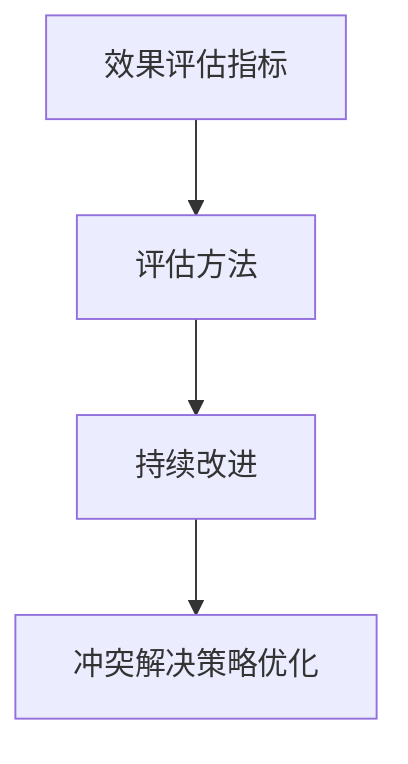

#### 核心算法原理讲解

效果评估和持续改进可以基于以下伪代码描述：

```plaintext
function conflict_resolution_evaluation(evaluation_metrics, assessment_methods, improvement):
    if evaluation_metrics == "high" and assessment_methods == "effective":
        improvement = "significant"
    else:
        improvement = "minimal"
    return improvement
```

#### 数学模型和公式

冲突解决效果的持续改进可以用以下数学模型描述：

$$
I = f(E, M)
$$

其中，$I$ 表示持续改进程度，$E$ 表示效果评估结果，$M$ 表示评估方法的有效性。$f$ 是一个函数，描述了效果评估和评估方法如何影响持续改进程度。

#### 举例说明

假设效果评估结果为高，评估方法有效性为70%，则持续改进程度计算如下：

$$
I = f("high", 0.7) = 0.7
$$

即持续改进程度为70%。

#### 最佳实践 tips

- **定期评估**：定期对冲突解决效果进行评估，确保策略的有效性。
- **员工参与**：鼓励员工参与冲突解决过程，提高员工的满意度和参与感。
- **培训与学习**：定期进行冲突解决培训，提升团队的整体冲突解决能力。

#### 小结

本文探讨了领导力与冲突解决之间的关系，通过多个章节的详细分析，提供了丰富的理论和实践指导。领导者通过运用这些策略和技巧，可以有效解决团队冲突，提升团队绩效，推动组织发展。

#### 注意事项

- **冲突解决策略的选择**：应根据具体情境选择合适的冲突解决策略。
- **沟通的重要性**：有效的沟通是冲突解决的关键，领导者应注重沟通技巧的提升。
- **持续改进**：冲突解决是一个持续的过程，领导者应不断学习和优化解决策略。

#### 拓展阅读

- 《领导力心理学：提升个人与团队绩效的艺术》
- 《团队冲突管理：策略与技巧》
- 《变革领导：推动组织发展的实践指南》

### 作者信息

作者：AI天才研究院/AI Genius Institute & 禅与计算机程序设计艺术/Zen And The Art of Computer Programming

本文由AI天才研究院与禅与计算机程序设计艺术共同撰写，旨在为IT领域的领导者提供实用的领导力与冲突解决指导。希望通过本文，领导者能够更好地应对复杂的团队关系和组织挑战，推动组织发展。

### 附录

#### 附录A：领导力与冲突解决工具与方法

**附录A.1：冲突解决工具介绍**

- **SWOT分析**：用于评估冲突的内外部因素，帮助领导者制定解决方案。
- **5W2H分析**：通过提问问题的方法，深入分析冲突的原因和解决方案。

**附录A.2：领导力发展工具**

- **360度评估**：通过多角度评估领导力，帮助领导者了解自身的优势和不足。
- **领导力发展计划**：制定个性化的领导力发展计划，提升领导力水平。

**附录A.3：案例研究资源链接**

- **案例一：团队冲突的处理**：链接至案例一的具体分析报告。
- **案例二：组织变革中的冲突解决**：链接至案例二的具体分析报告。
- **案例三：领导力与冲突解决的结合**：链接至案例三的具体分析报告。

