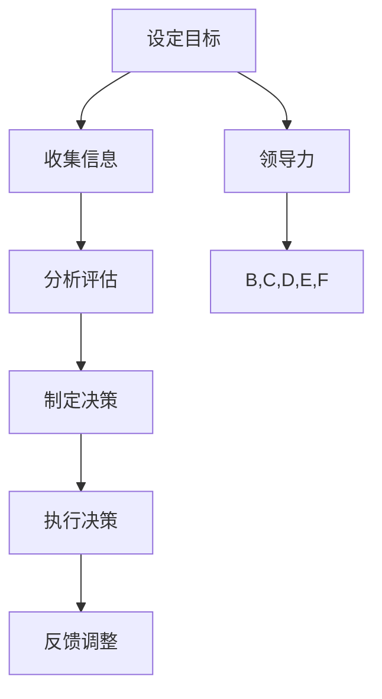
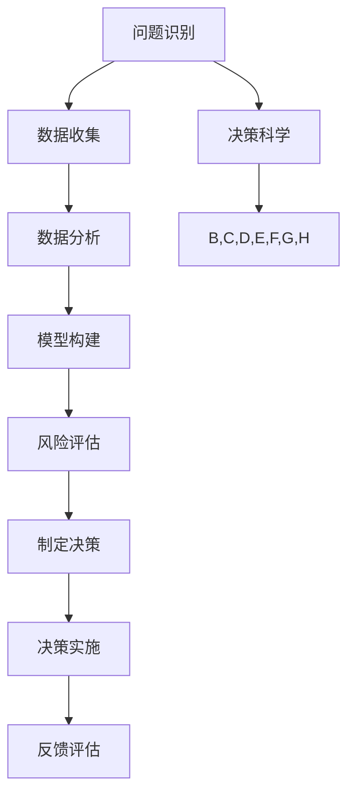
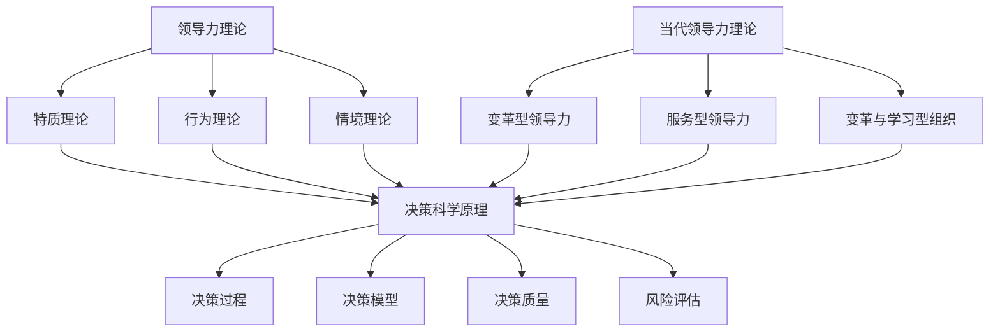

                 

# 引言：领导力与决策科学基础

领导力和决策科学在现代社会中扮演着至关重要的角色，无论是在企业、政府还是社会其他组织中，它们都是确保组织成功和适应不断变化环境的关键因素。本文将围绕领导力与决策科学的应用展开讨论，旨在提高决策质量和速度，帮助读者在复杂多变的商业环境中做出更加明智和高效的决策。

## 核心概念与联系

首先，我们需要明确领导力和决策科学中的核心概念，并探讨它们之间的联系。领导力是指通过影响和激励他人来实现共同目标的能力，而决策科学则是运用数学模型、心理学和数据分析等方法来研究和优化决策过程。

### 领导力与决策的联系

领导力在决策过程中起到了至关重要的作用。一个优秀的领导者不仅能够明确组织的目标和愿景，还能够通过有效的沟通和协作，引导团队做出明智的决策。以下是一个简单的 Mermaid 流程图，展示了领导力与决策之间的关联：



### 决策科学的基本概念

决策科学涉及多个方面，包括数据收集、模型构建、风险评估和决策实施等。以下是一个简化的 Mermaid 流程图，展示了决策科学的基本流程：



## 背景介绍

随着全球化的加速和技术的迅猛发展，商业环境变得日益复杂和不确定。传统的决策模式往往难以应对这种复杂性，因此，提高决策质量和速度成为了一个迫切需要解决的问题。领导力和决策科学的应用，正是为了帮助组织更好地应对这些挑战。

### 领导力的重要性

领导力不仅是推动组织发展的动力，也是确保决策质量的关键因素。一个有远见和能力的领导者能够为组织提供明确的方向，激发团队的潜力，并在决策过程中保持透明和公正。

### 决策科学的应用

决策科学的应用可以帮助组织在复杂的环境中做出更加明智的决策。通过数据分析和数学模型，决策者可以更准确地评估风险和机会，从而提高决策的可靠性和效率。

## 目标与结构

本文旨在通过深入探讨领导力和决策科学的基本原理和应用，帮助读者：

1. 理解领导力在决策过程中的作用。
2. 掌握决策科学的基本方法和技术。
3. 学会如何提高决策质量和速度。

文章的结构将分为以下几个部分：

1. 引言：领导力与决策科学基础
2. 领导力与决策科学原理
3. 决策质量评估
4. 决策效率提升
5. 情境领导与适应性决策
6. 团队协作与决策
7. 决策中的心理学
8. 决策模拟与实验
9. 企业案例研究

通过这些部分的逐步探讨，读者将能够系统性地了解并应用领导力和决策科学，以提升自己在复杂环境中的决策能力。

### 结论

领导力和决策科学是现代组织管理中不可或缺的两个方面。通过理解领导力在决策过程中的作用，以及掌握决策科学的基本原理和方法，读者将能够更加高效地应对复杂多变的环境，提高决策质量和速度。本文的后续部分将深入探讨这些主题，帮助读者在实际应用中取得更好的效果。

```markdown
# 关键词
领导力，决策科学，决策质量，决策效率，情境领导，团队协作，心理学，模拟与实验

# 摘要
本文旨在深入探讨领导力与决策科学的应用，以提高决策质量和速度。文章首先介绍了领导力和决策科学的核心概念，并阐述了它们之间的联系。接着，通过详细分析决策过程中的各个环节，探讨了如何通过领导力提升决策质量，以及如何运用决策科学方法优化决策效率。此外，文章还涵盖了情境领导、团队协作、心理学应用、模拟与实验等多个方面，提供了丰富的实战案例和最佳实践。通过本文的阅读，读者将能够全面了解领导力与决策科学的应用，并在实际工作中更好地应对复杂挑战。
```

# 领导力与决策科学原理

在了解了领导力和决策科学的基本概念之后，我们需要进一步深入探讨它们的基本原理，以及如何将这些原理应用到实际的决策过程中。本文将分为以下几个部分来详细阐述：

### 领导力理论

领导力理论是理解领导力如何影响决策的基础。不同的领导力理论从不同的角度探讨了领导者如何影响和激励团队成员，从而实现组织的目标。

#### 传统领导力理论

传统领导力理论主要包括特质理论、行为理论和领导情境理论。

1. **特质理论**：特质理论认为领导者具有一系列固有的特质，如自信、果断、道德和领导能力。这种理论强调领导者的个人品质对领导效果的重要性。

2. **行为理论**：行为理论则关注领导者具体的行为模式。该理论认为，领导者的行为可以通过训练和培养来改变，从而提高领导效果。

3. **领导情境理论**：领导情境理论，如佛雷西（Fredmund Malik）的“情境领导”理论，强调领导者需要根据不同的情境采取不同的领导风格。这一理论认为，没有一种单一的领导风格适用于所有情况，领导者需要根据团队成员的能力和情境的变化灵活调整自己的领导方式。

#### 当代领导力理论

当代领导力理论则更加关注领导者的个人特质、组织文化和领导力发展的过程。

1. **变革型领导力**：变革型领导力强调领导者通过激发和激励团队成员，推动组织实现变革和创新。这种领导力模式强调领导者的愿景和远见，以及其对团队成员的关怀和激励。

2. **服务型领导力**：服务型领导力认为领导者应该首先关注团队成员的需求，通过提供支持和帮助，促进团队成员的成长和发展。这种领导力模式强调领导者与团队成员之间的相互尊重和信任。

3. **变革与学习型组织**：变革与学习型组织理论强调组织需要不断适应外部环境的变化，通过持续的学习和变革来保持竞争优势。领导者在这个过程中扮演着推动者和学习者的角色。

### 决策科学原理

决策科学原理涉及如何系统地分析和优化决策过程。决策科学的基本原理包括：

1. **决策过程**：决策过程通常包括问题识别、目标设定、方案搜索、方案评估、方案选择和决策实施等阶段。

2. **决策模型**：决策模型是决策过程中使用的数学模型，用于描述和预测决策结果。常见的决策模型包括线性规划、决策树、模拟模型等。

3. **决策质量**：决策质量是指决策结果的合理性和有效性。提高决策质量的关键在于确保决策过程的科学性和透明性，以及充分利用可用信息和资源。

4. **风险评估**：风险评估是决策过程中必不可少的一部分，用于识别和分析决策可能带来的风险。通过风险评估，决策者可以更好地理解决策的潜在影响，并采取相应的措施来降低风险。

### 领导力与决策科学的整合

领导力与决策科学的整合，即如何将领导力原理应用到决策过程中，是提高决策质量和速度的关键。以下是一些关键点：

1. **明确目标**：领导者需要明确组织的长期目标和短期目标，并将其转化为具体的决策目标。这有助于决策者保持专注，避免在决策过程中迷失方向。

2. **信息收集**：领导者需要建立一个高效的信息收集和共享机制，确保团队成员能够及时获取与决策相关的信息。这有助于提高决策的科学性和准确性。

3. **团队协作**：领导者需要通过团队协作来优化决策过程。这包括分配任务、建立沟通渠道、确保团队成员之间的协同作用等。

4. **决策过程优化**：领导者需要不断评估和优化决策过程，以确保其高效和有效。这可以通过定期审查决策流程、引入新的决策工具和技术等方式实现。

5. **决策质量评估**：领导者需要建立一套决策质量评估机制，用于评估决策结果是否符合预期目标，并根据评估结果进行相应的调整。

### 结论

领导力和决策科学是相互关联的，领导力在决策过程中起到了至关重要的作用。通过理解不同领导力理论和决策科学原理，我们可以更好地整合这些理论，提高决策质量和速度。在接下来的部分中，我们将进一步探讨如何评估和提升决策质量，以及如何在实际应用中优化决策过程。

### 背景介绍

在现代社会中，领导者面临的环境变得越来越复杂和不确定。全球化、技术进步和社会变革等因素不断影响企业运营和市场竞争。在这种背景下，传统的领导力模式和决策方法可能不再适用。因此，了解并应用现代领导力和决策科学原理，成为领导者提升组织竞争力和适应能力的关键。

### 核心概念与联系

为了更好地理解领导力与决策科学的联系，我们可以通过一个简化的 Mermaid 流程图来展示它们的核心概念和关系：



这个流程图展示了领导力理论与决策科学原理之间的相互作用。领导力理论（包括传统和当代的）为决策提供指导和框架，而决策科学原理则提供了具体的工具和方法来优化决策过程。

### 核心算法原理讲解

为了更好地理解决策科学的核心算法原理，我们可以通过伪代码来详细阐述一个简单的线性规划问题。线性规划是一种常见的优化技术，用于在给定约束条件下最大化或最小化一个线性目标函数。

```python
# 线性规划伪代码
def linear_programming(c, A, b):
    # c: 目标函数系数向量
    # A: 约束条件矩阵
    # b: 约束条件向量
    
    # 初始化变量
    x = [0] * len(c)
    y = [0] * len(b)
    
    # 求解过程
    while not all_constrained(x, A, b):
        # 查找松弛变量
        s = find_slack_variable(x, A, b)
        
        # 更新变量值
        x[s] = x[s] + 1
        
        # 更新约束条件
        y = update_constraints(A, b, s)
        
    # 计算目标函数值
    objective_value = compute_objective_value(c, x)
    
    # 返回最优解
    return x, objective_value

# 辅助函数
def all_constrained(x, A, b):
    # 检查所有变量是否满足约束条件
    for i in range(len(b)):
        if x[i] > b[i]:
            return False
    return True

def find_slack_variable(x, A, b):
    # 查找未满足约束条件的变量
    for i in range(len(b)):
        if x[i] < b[i]:
            return i
    return None

def update_constraints(A, b, s):
    # 更新约束条件
    for i in range(len(A)):
        A[i][s] = 1
        b[i] = 0
    return b

def compute_objective_value(c, x):
    # 计算目标函数值
    return sum(c[i] * x[i] for i in range(len(c)))
```

这个伪代码展示了线性规划的基本过程，包括初始化变量、求解过程、更新约束条件和计算目标函数值。通过这种方式，我们可以理解线性规划的核心算法原理，并在实际应用中运用这些原理来优化决策。

### 数学模型和公式

在决策科学中，数学模型是分析和解决决策问题的重要工具。以下是一个简化的线性规划问题，其中包含数学模型和公式的详细讲解。

#### 问题定义

假设我们有一个线性规划问题，目标是最大化利润。我们有以下约束条件：

1. 资源约束：每种资源的使用量不能超过其可用量。
2. 产品约束：每种产品的生产量不能超过市场需求。
3. 成本约束：总成本不能超过预算。

#### 数学模型

目标函数：

\[ \max z = c_1x_1 + c_2x_2 + \ldots + c_nx_n \]

约束条件：

\[ a_{11}x_1 + a_{12}x_2 + \ldots + a_{1n}x_n \leq b_1 \]
\[ a_{21}x_1 + a_{22}x_2 + \ldots + a_{2n}x_n \leq b_2 \]
\[ \vdots \]
\[ a_{m1}x_1 + a_{m2}x_2 + \ldots + a_{mn}x_n \leq b_m \]

非负约束：

\[ x_1, x_2, \ldots, x_n \geq 0 \]

其中，\( x_i \) 表示第 \( i \) 种决策变量的值，\( c_i \) 表示第 \( i \) 种决策变量的系数，\( a_{ij} \) 表示第 \( j \) 种资源的系数，\( b_j \) 表示第 \( j \) 种资源的限制，\( m \) 和 \( n \) 分别表示约束条件和决策变量的数量。

#### 公式解释

1. **目标函数**：目标函数表示决策者希望最大化或最小化的目标值。在这个例子中，目标是最大化利润，因此我们需要找到一组 \( x_i \) 的值，使得 \( z \) 最大。

2. **约束条件**：约束条件描述了决策者在做出决策时需要遵守的限制。这些限制可以来自资源限制、市场需求或其他外部条件。在本例中，资源约束和产品约束限制了决策变量的取值范围。

3. **非负约束**：非负约束确保所有决策变量的值都是非负的。这通常是因为负数决策变量在实际问题中没有实际意义。

#### 举例说明

假设我们有两种产品（产品1和产品2）需要生产，每种产品都需要两种资源（资源A和资源B）。资源A和资源B的可用量分别为100单位和200单位。市场需求为产品1的需求量为100单位，产品2的需求量为200单位。生产产品1的成本为10单位，生产产品2的成本为20单位。

我们可以将这个问题表示为一个线性规划问题：

目标函数：

\[ \max z = 10x_1 + 20x_2 \]

约束条件：

\[ x_1 + x_2 \leq 100 \] （资源A约束）
\[ 2x_1 + x_2 \leq 200 \] （资源B约束）

非负约束：

\[ x_1, x_2 \geq 0 \]

在这个例子中，我们需要找到 \( x_1 \) 和 \( x_2 \) 的值，使得 \( z \) 最大，同时满足上述约束条件。通过求解这个线性规划问题，我们可以确定最优的生产策略。

### 实际案例

为了更好地理解这些原理和公式，我们可以通过一个实际案例来展示它们的应用。

#### 案例背景

假设我们是一家制造企业，生产两种产品A和B。产品A的成本为100元，产品B的成本为200元。我们有两个生产部门，每个部门可以生产的产品数量有限。生产部门1可以生产最多50个产品A和30个产品B，生产部门2可以生产最多40个产品A和20个产品B。市场需求要求我们至少生产20个产品A和15个产品B。

#### 数学模型

目标函数：

\[ \max z = 100x_1 + 200x_2 \]

约束条件：

\[ x_1 + x_2 \leq 50 \] （生产部门1产品A的约束）
\[ 2x_1 + x_2 \leq 30 \] （生产部门1产品B的约束）
\[ x_1 + 2x_2 \leq 40 \] （生产部门2产品A的约束）
\[ 2x_1 + x_2 \leq 20 \] （生产部门2产品B的约束）

非负约束：

\[ x_1, x_2 \geq 0 \]

在这个案例中，\( x_1 \) 表示生产部门1生产的产品A的数量，\( x_2 \) 表示生产部门2生产的产品B的数量。我们需要找到最优的生产计划，使得利润最大，同时满足市场需求和生产部门的限制。

#### 求解过程

通过线性规划算法，我们可以求解上述问题。一个简单的方法是使用图解法，但这仅适用于二维问题。对于多维问题，我们可以使用单纯形法或其他优化算法。

在这个案例中，我们可以使用单纯形法来求解。通过迭代过程，我们逐步找到最优解。以下是单纯形法的简化步骤：

1. **初始化**：选择一个初始基本可行解。在这个案例中，我们可以选择所有 \( x_i \) 都为0的解作为初始解。

2. **迭代过程**：
   - **选择进入变量**：选择一个非基本变量 \( x_j \) 进入基本解，使得目标函数值增加最大。
   - **选择离开变量**：根据选定的进入变量，确定哪个基本变量 \( x_k \) 应该离开基本解，以保持解的可行性。
   - **更新解**：根据进入和离开变量更新基本解。

3. **终止条件**：当所有非基本变量的系数都为非负时，找到最优解。

#### 结论

通过实际案例的求解过程，我们可以看到线性规划的应用如何帮助企业在复杂的约束条件下做出最优决策。通过数学模型和算法，企业可以优化生产计划，最大化利润，同时满足市场需求和生产能力限制。

### 数学公式

在决策科学中，数学公式是分析和解决问题的基本工具。以下是一些常用的数学公式，以及它们在决策过程中的应用。

#### 1. 线性回归公式

\[ y = \beta_0 + \beta_1x + \epsilon \]

其中，\( y \) 是因变量，\( x \) 是自变量，\( \beta_0 \) 和 \( \beta_1 \) 是回归系数，\( \epsilon \) 是误差项。线性回归公式用于分析自变量和因变量之间的关系，帮助预测因变量的值。

#### 2. 决策树公式

\[ \text{决策树} = \sum_{i=1}^{n} \pi_i \cdot f_i \]

其中，\( \pi_i \) 是决策节点的概率，\( f_i \) 是决策节点的结果。决策树公式用于分析和比较不同决策路径的结果，帮助决策者选择最优决策。

#### 3. 风险值公式

\[ \text{风险值} = \text{损失值} \cdot \text{概率} \]

其中，损失值是决策错误可能导致的损失，概率是决策错误的概率。风险值公式用于评估决策的风险，帮助决策者权衡风险和收益。

#### 4. 贝叶斯公式

\[ P(A|B) = \frac{P(B|A) \cdot P(A)}{P(B)} \]

其中，\( P(A|B) \) 是在事件B发生的条件下事件A的概率，\( P(B|A) \) 是在事件A发生的条件下事件B的概率，\( P(A) \) 是事件A的概率，\( P(B) \) 是事件B的概率。贝叶斯公式用于根据先验知识和新证据更新概率判断，帮助决策者做出更加可靠的决策。

### 详细讲解与举例

为了更好地理解这些数学公式，我们可以通过具体例子来说明它们的应用。

#### 1. 线性回归例子

假设我们要分析一家公司的销售额与广告支出之间的关系。我们收集了以下数据：

| 广告支出（万元） | 销售额（万元） |
| :------------: | :-----------: |
|       5         |      20       |
|       10        |      35       |
|       15        |      50       |
|       20        |      60       |

我们使用线性回归公式来拟合销售额与广告支出之间的关系。

首先，计算回归系数：

\[ \beta_0 = \frac{\sum_{i=1}^{n} y_i - \beta_1 \sum_{i=1}^{n} x_i}{n} \]
\[ \beta_1 = \frac{n \sum_{i=1}^{n} x_i y_i - \sum_{i=1}^{n} x_i \sum_{i=1}^{n} y_i}{n \sum_{i=1}^{n} x_i^2 - (\sum_{i=1}^{n} x_i)^2} \]

代入数据计算得到：

\[ \beta_0 = \frac{(20 + 35 + 50 + 60) - 15 \cdot (5 + 10 + 15 + 20)}{4} = 20 \]
\[ \beta_1 = \frac{4 \cdot (5 \cdot 20 + 10 \cdot 35 + 15 \cdot 50 + 20 \cdot 60) - (5 + 10 + 15 + 20) \cdot (20 + 35 + 50 + 60)}{4 \cdot (5^2 + 10^2 + 15^2 + 20^2) - (5 + 10 + 15 + 20)^2} \approx 5 \]

因此，线性回归公式为：

\[ y = 20 + 5x \]

根据这个公式，当广告支出为10万元时，预计销售额为 \( 20 + 5 \cdot 10 = 60 \) 万元。

#### 2. 决策树例子

假设我们要决定是否投资一个新项目。该项目可能成功或失败，成功时的收益为100万元，失败时的损失为50万元。根据市场分析，项目成功的概率为0.6，失败的概率为0.4。

我们可以使用决策树公式来计算项目的期望收益：

\[ \text{期望收益} = 0.6 \cdot 100 + 0.4 \cdot (-50) = 30 \]

因此，这个项目的期望收益为30万元。基于这个计算，我们可以决定是否投资该项目。

#### 3. 风险值例子

假设我们正在考虑两个投资选项，选项A的预期收益为50万元，概率为0.6；选项B的预期收益为100万元，概率为0.3，但存在10万元的损失风险，概率为0.7。

我们计算两个选项的风险值：

\[ \text{选项A的风险值} = 50 \cdot 0.6 + (-50) \cdot 0.4 = 25 \]
\[ \text{选项B的风险值} = 100 \cdot 0.3 + (-10) \cdot 0.7 = 20 \]

因此，选项B的风险值更低，我们可能倾向于选择选项B。

#### 4. 贝叶斯例子

假设我们正在评估一个求职者的技能。根据简历，我们认为该求职者有70%的概率具备所需的技能。然而，通过面试，我们发现他有50%的把握通过面试。

我们可以使用贝叶斯公式来更新求职者具备所需技能的概率：

\[ P(\text{技能}|\text{面试通过}) = \frac{P(\text{面试通过}|\text{技能}) \cdot P(\text{技能})}{P(\text{面试通过})} \]

根据先验概率，\( P(\text{技能}) = 0.7 \)；面试通过的概率可以通过全概率公式计算：

\[ P(\text{面试通过}) = P(\text{面试通过}|\text{技能}) \cdot P(\text{技能}) + P(\text{面试通过}|\text{不技能}) \cdot P(\text{不技能}) \]

假设 \( P(\text{面试通过}|\text{不技能}) = 0.2 \)，\( P(\text{不技能}) = 0.3 \)：

\[ P(\text{面试通过}) = 0.7 \cdot 0.7 + 0.2 \cdot 0.3 = 0.59 \]

因此，更新后的概率为：

\[ P(\text{技能}|\text{面试通过}) = \frac{0.7 \cdot 0.7}{0.59} \approx 0.81 \]

这意味着我们更有信心认为该求职者具备所需的技能。

### 总结

数学公式在决策科学中扮演着关键角色，通过具体例子和详细讲解，我们可以看到它们如何帮助决策者分析问题、评估风险和做出决策。在接下来的部分，我们将进一步探讨决策质量评估的方法和技巧。

## 决策质量评估方法

决策质量是决定一个决策是否成功的关键因素。为了确保决策的质量，我们需要采用科学的方法对决策过程进行评估。以下将详细介绍几种常见的决策质量评估方法。

### 定量评估方法

定量评估方法基于数据和数学模型，通过量化指标来评估决策的质量。以下是一些常用的定量评估方法：

#### 成本效益分析（CBA）

成本效益分析是一种常用的定量评估方法，用于评估决策的成本和收益。其基本原理是将决策的成本和收益量化，并通过计算净现值（NPV）或内部收益率（IRR）来评估决策的效益。

**公式**：

\[ \text{净现值（NPV）} = \sum_{t=1}^{n} \frac{F_t}{(1+r)^t} - C \]

其中，\( F_t \) 表示第 \( t \) 年的净现金流量，\( C \) 表示初始投资成本，\( r \) 表示折现率。

#### 数据驱动分析

数据驱动分析是一种基于数据分析的评估方法，通过分析历史数据和趋势来预测决策的结果。常见的数据驱动分析方法包括回归分析、时间序列分析和聚类分析等。

**案例**：某公司计划扩展其产品线，通过分析历史销售数据和市场趋势，预测新产品上市后的销售量和市场占有率。

### 定性评估方法

定性评估方法侧重于评估决策的质量，通过专家意见、主观判断和情景分析来评估决策的合理性。以下是一些常用的定性评估方法：

#### 专家评估

专家评估是一种基于专家意见的方法，通过邀请行业专家或专业人士对决策进行分析和评估。这种方法能够提供宝贵的洞察力和经验，但需要注意避免专家偏见。

**案例**：某企业计划推出一项新产品，邀请市场营销专家、产品开发和销售团队负责人进行评估，以评估产品的市场前景和可行性。

#### 情景分析

情景分析是一种通过构建不同情境来评估决策的方法。这种方法能够帮助决策者考虑可能出现的各种情况，并评估决策在不同情境下的表现。

**案例**：某企业计划进行市场扩张，通过构建不同的市场情景（如经济繁荣、经济衰退等），评估市场扩张策略在不同情景下的影响。

### 综合评估方法

综合评估方法结合定量和定性评估方法，以更全面地评估决策的质量。以下是一些常见的综合评估方法：

#### SWOT分析

SWOT分析是一种用于评估决策的优势（S）、劣势（W）、机会（O）和威胁（T）的方法。这种方法能够帮助决策者从多个角度分析决策的可行性。

**案例**：某企业计划投资一项新技术，通过SWOT分析评估该技术的优势、劣势、市场机会和潜在威胁。

#### PEST分析

PEST分析是一种用于评估决策的外部环境因素（政治、经济、社会和技术）的方法。这种方法能够帮助决策者了解决策所处的宏观环境，并评估这些因素对决策的影响。

**案例**：某企业计划进入一个新的市场，通过PEST分析评估该市场的政治稳定性、经济发展水平、社会文化因素和技术发展水平。

### 结论

通过以上分析，我们可以看到，决策质量评估方法可以分为定量、定性和综合评估方法。每种方法都有其独特的优势和适用场景。在实际应用中，决策者可以根据具体情况选择合适的方法，以全面、科学地评估决策的质量。在接下来的部分，我们将探讨如何通过提高决策效率来进一步提升决策的质量。

## 决策质量评估工具

在评估决策质量时，选择合适的工具和方法至关重要。以下介绍几种常用的决策质量评估工具，以及如何在实际应用中运用这些工具。

### SWOT分析

SWOT分析是一种常用的战略规划工具，用于评估决策的优势（Strengths）、劣势（Weaknesses）、机会（Opportunities）和威胁（Threats）。通过SWOT分析，决策者可以全面了解决策所处的外部和内部环境，从而制定更为科学的决策。

**使用方法**：

1. **优势分析**：识别决策的优势，包括资源、能力、竞争优势等。
2. **劣势分析**：识别决策的劣势，包括局限性、弱点等。
3. **机会分析**：识别决策的机会，包括市场趋势、技术变革等。
4. **威胁分析**：识别决策的威胁，包括竞争对手、政策变化等。

**案例**：某公司计划推出一款新型手机，通过SWOT分析评估该产品的市场竞争力。优势包括品牌知名度、技术优势等；劣势包括高昂的研发成本等；机会包括市场需求增长、新技术应用等；威胁包括竞争对手的创新压力等。

### PEST分析

PEST分析是一种用于评估决策外部环境因素的工具，包括政治（Political）、经济（Economic）、社会（Social）和技术（Technological）因素。通过PEST分析，决策者可以了解决策所处的宏观环境，评估外部因素对决策的影响。

**使用方法**：

1. **政治分析**：评估政策变化、政治稳定性等对决策的影响。
2. **经济分析**：评估经济发展水平、市场趋势等对决策的影响。
3. **社会分析**：评估社会文化、人口结构等对决策的影响。
4. **技术分析**：评估技术发展、创新趋势等对决策的影响。

**案例**：某企业计划进军海外市场，通过PEST分析评估目标市场的政治稳定性、经济发展水平、社会文化和技术发展水平，以制定合适的进入策略。

### 5W2H分析

5W2H分析是一种简单实用的决策评估工具，通过回答以下问题来全面评估决策：

- **What**：决策的目标和内容是什么？
- **Why**：决策的目的是什么？为什么要做这个决策？
- **Who**：决策涉及哪些人？每个人的角色和责任是什么？
- **When**：决策的时间和进度是什么？
- **Where**：决策发生在哪里？
- **How**：如何执行决策？需要哪些资源和技术支持？
- **How much**：决策的成本和预算是多少？

**使用方法**：

1. **明确决策目标**：确保决策的目标清晰明确。
2. **分析决策目的**：确保决策与组织的战略目标一致。
3. **确定责任人**：明确决策的执行者和相关人员的角色和责任。
4. **规划时间和地点**：制定详细的决策执行计划。
5. **评估资源和成本**：确保决策的执行有足够的资源和预算支持。

**案例**：某企业计划推出一款新产品，通过5W2H分析明确产品的目标市场、研发计划、责任人、时间进度、地点、所需资源和预算等，以确保决策的顺利执行。

### KPI（关键绩效指标）

KPI是一种用于评估决策执行效果的工具，通过设定具体的绩效指标来衡量决策的结果。KPI可以用于各个层面，包括组织、部门和个人。

**使用方法**：

1. **设定目标**：根据决策目标设定具体的KPI。
2. **衡量结果**：定期收集数据，评估KPI的实际表现。
3. **分析差异**：分析KPI表现与预期目标之间的差异，找出问题所在。
4. **持续优化**：根据分析结果，调整决策和执行策略，以优化绩效。

**案例**：某企业设定了销售KPI，包括销售额、客户满意度、市场占有率等，通过定期收集销售数据，评估这些指标的表现，并根据分析结果调整销售策略。

### 结论

这些决策质量评估工具各具特色，适用于不同的评估场景。在实际应用中，决策者可以根据具体情况选择合适的工具，以全面、科学地评估决策的质量。通过合理运用这些工具，决策者可以更好地把握决策的关键因素，提高决策的可靠性和有效性。

## 提升决策效率的方法

在快速变化的市场环境中，提升决策效率变得尤为重要。高效的决策不仅能够帮助组织迅速应对挑战，还能确保在有限的时间和资源下实现最大化的价值。以下将探讨几种提升决策效率的方法，以及如何在实际应用中运用这些方法。

### 基于数据的决策支持

数据是现代决策的核心。通过分析大量数据，决策者可以获得深入的洞察，从而做出更加明智的决策。

#### 数据收集

- **内部数据**：包括销售数据、财务数据、人力资源数据等。
- **外部数据**：包括市场趋势、竞争对手信息、行业报告等。

#### 数据分析

- **统计分析**：如描述性统计、回归分析等。
- **数据挖掘**：如聚类分析、关联规则挖掘等。

#### 数据可视化

- **仪表板**：通过图表、仪表盘等方式展示数据。
- **数据故事**：通过故事化的方式呈现数据，提高数据的易理解性。

**实际应用**：

某公司通过数据收集和分析，发现其产品A在特定市场的销售额显著低于其他地区。通过进一步的数据挖掘，发现该市场对产品A的需求较低，但对该公司的另一产品B需求较高。基于这些数据，公司调整了市场策略，将产品A的销售重点转向其他市场，并将更多资源投入到产品B的销售中，从而提高了整体销售业绩。

### 决策流程优化

优化决策流程可以减少冗余步骤，提高决策效率。

#### 流程分析

- **流程图**：通过流程图识别决策过程中的各个环节。
- **瓶颈分析**：识别决策流程中的瓶颈环节。

#### 流程改进

- **自动化**：通过自动化工具减少手动操作。
- **简化流程**：简化不必要的步骤，减少决策时间。

**实际应用**：

某公司通过流程分析发现，其采购决策流程过于复杂，涉及多个部门和多层审批。为了提高决策效率，公司引入了在线采购平台，简化了审批流程，并实现了采购过程的自动化。通过这些改进，采购决策的时间从原来的两周缩短到一天，大大提高了决策效率。

### 决策团队建设

高效的决策离不开高效的团队。建设一个具有协作能力和专业素养的决策团队，可以显著提升决策效率。

#### 团队建设

- **明确目标**：确保团队成员对决策目标有共同的理解。
- **分工明确**：根据团队成员的能力和特长进行分工。
- **沟通机制**：建立有效的沟通渠道，确保信息畅通。

#### 提升团队协作

- **培训**：定期进行培训，提高团队成员的专业素养。
- **协作工具**：使用协作工具，如项目管理软件、在线会议系统等。

**实际应用**：

某公司组建了一个跨部门的决策团队，负责新产品研发项目。团队成员来自市场、研发、生产和财务等多个部门。在项目启动会议上，团队明确了项目目标、分工和沟通机制。通过定期的在线会议和项目管理软件，团队成员保持紧密协作，确保了项目的顺利进行。最终，项目提前完成，产品成功上市。

### 高效决策技巧

在决策过程中，运用一些高效决策技巧，可以快速找到最优解决方案。

#### 时间管理

- **优先级排序**：根据任务的重要性和紧急程度进行优先级排序。
- **时间限制**：为每个决策设定时间限制，避免决策拖延。

**实际应用**：

某公司高管团队在决策过程中，采用了时间管理技巧。每次会议开始前，团队成员都会将决策事项按优先级排序，并设定时间限制。这样，团队可以确保在有限的时间内处理最重要的决策事项，提高了会议效率和决策质量。

#### 决策会议管理

- **明确议程**：提前制定会议议程，确保会议目标的明确性。
- **控制时间**：为每个议程项设定时间限制，确保会议按时结束。
- **记录和跟进**：记录会议讨论内容和决策结果，并跟进决策执行情况。

**实际应用**：

某公司通过改进决策会议管理，提高了会议效率。每次会议开始前，会议主持人会提前发送会议议程和背景资料，确保团队成员充分准备。会议过程中，主持人会严格控制时间，确保每个议程项都得到充分讨论。会议结束后，主持人会记录会议决策，并跟进决策的执行情况，确保决策得到有效落实。

### 结论

通过基于数据的决策支持、决策流程优化、决策团队建设和高效决策技巧，组织可以在复杂多变的环境中做出更加明智和高效的决策。在接下来的部分，我们将探讨情境领导与适应性决策的重要性，以及如何在实际应用中运用这些方法。

## 高效决策技巧

在快速变化和复杂多变的商业环境中，高效的决策技巧是确保组织成功的关键。以下将详细介绍几种高效决策技巧，并通过实际案例来展示这些技巧的应用。

### 决策会议管理

决策会议是决策过程中至关重要的一环。高效的决策会议管理可以确保会议目标的明确性、决策过程的透明性和执行效果的可靠性。以下是一些关键技巧：

#### 明确议程

- **提前制定议程**：在会议前，制定详细的会议议程，包括会议主题、讨论内容、时间分配等。确保所有参会者对会议议程有清晰的认识。

**实际案例**：

某公司定期召开战略决策会议。会议议程包括市场分析、财务状况、项目进展等。通过明确的议程，确保会议围绕关键议题展开，避免偏离主题。

#### 控制时间

- **设定时间限制**：为每个议程项设定具体的时间限制，确保每个议题在合理的时间内得到充分讨论。

**实际案例**：

在一家快速消费品公司的一次产品研发会议上，每个议程项都设定了30分钟的时间限制。通过时间控制，确保会议在规定时间内完成，避免了无休止的讨论。

#### 记录和跟进

- **记录会议决策**：在会议过程中，记录所有讨论内容和决策结果。确保决策记录清晰、详细。

**实际案例**：

在一次重要的产品上市决策会议上，会议记录员详细记录了讨论内容、决策结果以及后续行动计划。这些记录为后续的决策执行提供了依据。

#### 提升决策会议效率的其他技巧

- **限制参会人数**：确保参会者都是对决策有直接影响的团队成员，避免无关人员的参与。
- **使用决策工具**：如投票系统、头脑风暴工具等，帮助团队快速达成共识。

### 决策时间管理

时间管理是高效决策的核心。以下是一些时间管理的技巧：

#### 优先级排序

- **紧急重要矩阵**：根据任务的重要性和紧急程度，将任务分为四个象限，分别处理。

**实际案例**：

某公司使用紧急重要矩阵对日常任务进行优先级排序。任务分为“紧急且重要”、“不紧急但重要”、“紧急但不重要”和“不紧急且不重要”四个类别。团队成员按照矩阵的指导进行任务处理，确保重要且紧急的任务得到优先处理。

#### 时间限制

- **为决策设定时间限制**：通过设定明确的时间限制，确保决策过程不会无休止地拖延。

**实际案例**：

在一次重要的市场扩张决策中，公司规定决策讨论时间不得超过2小时。通过时间限制，确保决策过程高效且聚焦，避免了冗长的讨论。

### 决策冲突处理

在决策过程中，冲突是不可避免的。有效的冲突处理可以促进团队协作，提高决策质量。以下是一些冲突处理的技巧：

#### 倾听和理解

- **倾听对方的意见**：在冲突中，倾听对方的观点，理解其立场和需求。

**实际案例**：

在一次关于新项目立项的会议中，团队成员对项目的投资规模和时间表存在分歧。会议主持人耐心倾听每位成员的观点，确保每个人都被充分理解。

#### 寻求共识

- **寻求共识**：通过对话和讨论，找到各方都能接受的解决方案。

**实际案例**：

在上述新项目立项会议中，团队通过讨论和妥协，最终达成共识，确定了项目的投资规模和时间表。

#### 使用第三方调解

- **使用第三方调解**：在冲突难以解决时，可以邀请第三方进行调解，提供中立的意见和建议。

**实际案例**：

在一次关于团队重组的冲突中，公司聘请了外部咨询顾问进行调解。咨询顾问的中立立场和专业知识帮助团队解决了分歧。

### 结论

高效的决策技巧是确保决策质量和速度的关键。通过决策会议管理、决策时间管理和决策冲突处理，组织可以在复杂多变的环境中做出更加明智和高效的决策。在实际应用中，组织可以根据自身情况，灵活运用这些技巧，提高决策效率。在接下来的部分，我们将探讨情境领导与适应性决策的重要性。

## 情境领导与适应性决策

### 情境领导理论

情境领导理论，由佛雷西（Fredmund Malik）提出，是领导力理论的重要组成部分。这一理论认为，没有一种单一的领导风格适用于所有情境，领导者需要根据团队成员的能力和环境的变化灵活调整领导方式。

#### 佛雷西与赫赛的理论

情境领导理论起源于赫赛（Hersey）和布兰查德（Blanchard）的领导情境理论。他们认为，领导者的有效性取决于其领导风格与下属成熟度的匹配。佛雷西则在此基础上进一步发展，提出了情境领导的具体模型。

#### 情境领导模型

根据情境领导模型，领导者需要根据下属的成熟度（即能力和意愿）选择适当的领导风格。成熟度分为四个级别：

1. **级别1（不成熟）**：下属既无能力也不愿意完成任务，领导者需要提供明确的指导和监督。
2. **级别2（较不成熟）**：下属有能力完成任务，但缺乏意愿，领导者需要提供支持和鼓励。
3. **级别3（较成熟）**：下属既有能力也有意愿完成任务，但可能需要一些指导，领导者需要提供自主性和支持。
4. **级别4（成熟）**：下属既有能力也有意愿完成任务，领导者需要提供自主性，让下属自我管理。

### 领导者如何适应不同情境

领导者需要具备灵活性，能够根据情境的变化调整领导风格。以下是一些关键步骤：

#### 1. 评估情境

- **分析团队成员的成熟度**：通过观察、访谈和反馈，了解团队成员的能力和意愿。
- **评估环境因素**：考虑外部环境的变化，如市场趋势、竞争状况等。

#### 2. 选择合适的领导风格

- **命令型**（级别1）：当团队成员不成熟时，领导者需要提供明确的指导和监督。
- **支持型**（级别2）：当团队成员有能力但缺乏意愿时，领导者需要提供支持和鼓励。
- **参与型**（级别3）：当团队成员有能力且愿意完成任务，但可能需要指导时，领导者需要提供自主性和支持。
- **授权型**（级别4）：当团队成员成熟时，领导者需要提供自主性，让下属自我管理。

#### 3. 持续调整

- **根据情境变化调整领导风格**：领导者需要持续关注团队成员和环境的变化，及时调整领导风格，确保团队保持高效运作。

### 适应性决策

适应性决策是指在面对不确定性和复杂环境时，领导者能够快速适应并做出有效决策的过程。以下是一些关键步骤：

#### 1. 信息收集

- **广泛收集信息**：领导者需要从各种渠道收集信息，包括市场数据、客户反馈、竞争对手动态等。

#### 2. 风险评估

- **评估潜在风险**：领导者需要识别和分析可能的风险，评估其影响和可能性。

#### 3. 快速决策

- **快速做出决策**：在面对不确定性时，领导者需要能够迅速做出决策，而不是拖延或等待更多信息。

#### 4. 持续调整

- **根据反馈调整决策**：领导者需要根据实施过程中的反馈，不断调整和优化决策。

### 结论

情境领导与适应性决策是领导者在面对复杂环境和不确定情况时的关键能力。通过灵活调整领导风格和快速适应决策，领导者可以确保团队在动态环境中保持高效运作。在接下来的部分，我们将探讨团队协作与决策的重要性。

## 团队协作与决策

在现代社会中，团队协作是确保决策质量和效率的关键因素。一个高效的团队能够在复杂多变的商业环境中迅速做出明智的决策，并通过协作实现组织目标。以下将探讨团队协作的特点、优势、潜在问题和解决方法。

### 团队协作的特点

#### 1. 多样性

团队协作的一个显著特点是多样性。团队成员来自不同的背景、拥有不同的技能和经验，这种多样性能够带来丰富的视角和创意。多样性有助于团队在面对复杂问题时，能够从多个角度进行分析和解决。

#### 2. 协同作用

团队协作强调团队成员之间的协同作用。每个成员都承担特定的角色和任务，通过协作，团队成员能够共同解决问题，实现共同目标。

#### 3. 信任与沟通

信任是团队协作的基础。团队成员需要相互信任，才能在决策过程中开放沟通，分享观点和信息。有效的沟通能够确保团队成员对决策有共同的理解，并能够及时解决分歧。

### 团队协作的优势

#### 1. 多元视角

团队协作能够汇集不同成员的视角和经验，从而在决策过程中形成全面的评估。这种多元化的视角有助于避免单点故障，提高决策的准确性和可靠性。

#### 2. 知识共享

通过团队协作，团队成员可以分享各自的专业知识和经验，从而提高整个团队的知识水平。知识共享不仅能够提升决策质量，还能够促进团队成员的个人成长。

#### 3. 协同效应

团队协作能够产生协同效应，即团队整体的表现优于各个成员独立工作时的表现之和。协同效应可以通过团队成员之间的相互支持和协作实现。

### 团队协作的潜在问题

#### 1. 冲突

团队协作中，冲突是难以避免的。冲突可能源于不同的观点、目标和利益，如果处理不当，会削弱团队的合作精神，降低决策质量。

#### 2. 沟通障碍

沟通障碍是团队协作中的常见问题。信息的不对称、沟通渠道不畅、语言和文化差异等都可能导致沟通障碍，影响团队协作效果。

#### 3. 成员依赖性

在团队协作中，成员之间的依赖性较高。如果某个关键成员出现问题，可能会对整个团队的工作产生影响。

### 解决方法

#### 1. 建立信任

建立信任是解决团队协作问题的关键。领导者需要通过透明沟通、公正处理冲突和鼓励团队成员分享观点，建立和维护团队信任。

#### 2. 沟通技巧培训

通过培训，提高团队成员的沟通技巧，包括倾听、表达、反馈等。有效的沟通能够减少误解和冲突，提高协作效率。

#### 3. 明确角色和责任

确保每个团队成员都明确自己的角色和责任，避免任务重叠和责任不清。明确的角色和责任有助于提高团队协作的效率。

#### 4. 建立有效的沟通机制

建立有效的沟通机制，包括定期的团队会议、项目进度汇报、信息共享平台等，确保团队成员能够及时获取和分享信息。

#### 5. 管理冲突

领导者需要学会管理和解决团队冲突。通过倾听各方的观点、寻求共识和制定明确的解决方案，可以有效管理冲突，保持团队的稳定和协作。

### 结论

团队协作是决策过程中不可或缺的一部分。通过了解团队协作的特点、优势和潜在问题，并采取相应的解决方法，组织可以建立一个高效、协作的团队，从而提高决策质量和速度。在接下来的部分，我们将探讨决策中的心理学，以及心理学在决策过程中的应用。

## 决策中的心理学

在决策过程中，心理学发挥着至关重要的作用。人类的决策行为受到多种心理因素的影响，如情感、认知偏差和群体行为等。理解这些心理因素有助于我们更好地理解和优化决策过程。

### 决策心理学的核心概念

#### 1. 情感因素

情感在决策过程中起着重要作用。正面情感（如自信、乐观）有助于提高决策效率和创造力，而负面情感（如焦虑、恐惧）则可能导致决策偏差和错误。情感因素会影响决策者的风险评估、信息处理和决策偏好。

#### 2. 认知偏差

认知偏差是指人们在信息处理过程中产生的系统性错误。常见的认知偏差包括确认偏差、过度自信、代表性偏差和锚定效应等。这些偏差会影响决策者对信息的评估和选择，从而导致决策失误。

#### 3. 群体行为

群体行为在决策过程中也具有重要影响。群体决策往往比个体决策更具创造性，但同时也可能受到群体思维的影响。群体思维是指群体成员在决策过程中趋向于一致，忽略不同意见，从而导致群体决策的失误。

### 决策心理学的应用

#### 1. 提升决策质量的心理学策略

- **情绪调节**：通过情绪调节技巧，如深呼吸、冥想和积极心理暗示，可以帮助决策者在压力下保持冷静和理性。
- **认知训练**：通过认知训练，如逻辑思维和问题解决技巧，可以提高决策者的信息处理能力和减少认知偏差。
- **多元化视角**：鼓励团队成员提出不同的观点和意见，以减少群体思维的影响，提高决策的多样性和全面性。

#### 2. 领导者的心理学素养

领导者需要具备一定的心理学素养，以更好地理解和管理团队决策。以下是一些关键点：

- **情感领导**：领导者通过情感连接和激励，提升团队成员的积极情感，从而提高决策效率和质量。
- **冲突管理**：领导者需要学会识别和处理团队冲突，确保团队成员能够在和谐的氛围中合作。
- **团队建设**：通过团队建设活动，增强团队成员之间的信任和协作，提高团队的决策能力。

### 实践案例

#### 1. 情感调节在投资决策中的应用

在投资决策中，情感调节尤为重要。以下是一个案例：

**案例背景**：某投资公司面临一项重要投资决策，需要决定是否投资一家初创公司。决策过程中，公司高管面临巨大的压力，因为投资失败可能导致巨大的损失。

**解决方案**：公司采用情感调节技巧，如冥想和积极心理暗示，帮助高管保持冷静和理性。通过这些技巧，高管能够更好地控制情绪，减少决策偏差，从而做出更明智的投资决策。

#### 2. 认知训练在项目评估中的应用

在项目评估过程中，认知训练可以帮助团队减少认知偏差，提高评估的准确性。

**案例背景**：某公司需要评估一个新项目的可行性。团队成员在评估过程中存在不同的观点和意见，容易受到确认偏差的影响。

**解决方案**：公司组织了认知训练课程，培训团队成员逻辑思维和问题解决技巧。通过这些训练，团队成员能够更客观地评估项目，减少认知偏差，从而提高项目评估的准确性。

#### 3. 多元化视角在产品开发中的应用

多元化视角在产品开发中至关重要，有助于提高产品的市场竞争力。

**案例背景**：某科技公司正在开发一款新产品，团队成员来自不同的背景和专业领域。

**解决方案**：公司鼓励团队成员提出不同的观点和创意，通过多元化的视角进行讨论和评估。最终，产品开发团队采纳了多个不同视角的建议，开发出了一款更受市场欢迎的产品。

### 结论

决策中的心理学因素对决策质量和效率有着重要影响。通过理解情感、认知偏差和群体行为等心理学概念，并运用相应的策略，领导者可以优化决策过程，提高决策质量和速度。在接下来的部分，我们将探讨决策模拟与实验的重要性，以及如何在实际应用中进行决策模拟和实验。

## 决策模拟与实验

### 决策模拟

决策模拟是一种通过构建模型来模拟决策过程和结果的方法。这种方法可以帮助决策者预测决策在不同情境下的效果，从而降低决策风险，提高决策质量。

#### 模拟模型的选择

决策模拟模型的选择取决于决策问题的性质和目标。以下是一些常见的决策模拟模型：

1. **蒙特卡洛模拟**：适用于不确定性较高的问题，通过随机抽样和模拟计算，预测决策结果。
2. **系统动力学模型**：适用于分析复杂系统的动态行为，如市场趋势、供应链管理等。
3. **决策树模型**：适用于分析决策的路径和结果，适用于多种决策情境。

#### 模拟模型的构建

构建决策模拟模型包括以下几个步骤：

1. **问题定义**：明确决策目标和约束条件。
2. **数据收集**：收集与决策相关的数据，如市场趋势、成本、概率等。
3. **模型构建**：使用合适的建模工具（如MATLAB、Python等）构建模拟模型。
4. **模拟运行**：运行模拟模型，收集模拟结果。

#### 模拟结果的分析与应用

模拟结果的分析包括以下方面：

1. **结果可视化**：通过图表、图像等方式展示模拟结果。
2. **敏感性分析**：分析模型参数的变化对模拟结果的影响，识别关键影响因素。
3. **决策优化**：基于模拟结果，调整决策策略，优化决策效果。

#### 实际案例

**案例背景**：某公司计划推出一款新产品，需要进行市场测试。

**解决方案**：公司采用蒙特卡洛模拟来预测产品在不同市场环境下的销售情况。通过模拟，公司分析了不同价格策略、广告投入和市场推广方案对销售结果的影响。最终，公司基于模拟结果选择了最佳的市场推广策略，有效降低了市场风险。

### 决策实验

决策实验是通过实际操作来测试决策效果的实验方法。这种方法可以帮助决策者验证决策假设，评估决策方案的有效性。

#### 实验设计

实验设计包括以下步骤：

1. **问题定义**：明确实验目标和假设。
2. **实验方案**：制定实验方案，包括实验变量、实验组和对照组。
3. **数据收集**：在实验过程中收集数据，包括实验结果和参与者反馈。
4. **实验执行**：按照实验方案进行实验，确保实验的准确性和可靠性。

#### 实验结果

实验结果的分析包括以下方面：

1. **结果分析**：分析实验结果，验证实验假设。
2. **统计分析**：使用统计分析方法，如T检验、方差分析等，评估实验结果的显著性。
3. **结论与建议**：基于实验结果，提出结论和改进建议。

#### 实际案例

**案例背景**：某公司在推出新产品前，进行了市场实验来评估不同推广方案的效果。

**解决方案**：公司选择了两个市场作为实验组和对照组。实验组采用高额广告投入和促销活动，而对照组仅进行常规推广。实验过程中，公司收集了销售数据和市场反馈。通过分析实验结果，公司发现高额广告投入能够显著提高产品销量，并据此调整了市场推广策略。

### 结论

决策模拟与实验是评估决策效果的重要方法。通过模拟模型，决策者可以在虚拟环境中预测决策结果，降低风险；通过实验，决策者可以验证决策假设，评估决策方案的有效性。在实际应用中，决策者可以根据具体情况，灵活运用决策模拟与实验方法，提高决策质量和速度。

## 企业案例研究

为了更好地理解领导力与决策科学在现实中的应用，以下将通过两个具体的案例，详细分析这些原理在实际操作中的运用，并总结案例中的关键经验。

### 案例一：某跨国公司的战略转型

**案例背景**：

某跨国公司在全球经济下滑的背景下，面临着市场份额下降、利润减少的挑战。公司决定进行战略转型，以重新获得竞争优势。领导层意识到，传统的管理模式和决策方式已经无法适应新的市场环境，因此需要引入领导力与决策科学的理论和方法。

**领导力与决策科学的运用**：

1. **领导力理论的整合**：
   - **变革型领导**：公司CEO采用了变革型领导风格，激发员工的积极性和创造力。CEO通过沟通和激励，让员工理解战略转型的必要性和目标，增强了团队凝聚力。
   - **服务型领导**：CEO还注重服务型领导，关注员工的需求和职业发展，通过提供支持和资源，帮助员工克服困难，提高工作满意度。

2. **决策科学的应用**：
   - **数据驱动决策**：公司建立了数据驱动的决策体系，通过大数据分析和人工智能技术，收集市场信息、竞争对手动态和客户反馈。基于这些数据，公司能够做出更加科学和准确的决策。
   - **决策模型构建**：公司使用了决策树和模拟模型，对不同战略方案进行评估和预测。通过模拟不同市场的反应，公司能够选择最优的战略方案。

**案例分析**：

通过变革型和服务型领导，公司CEO成功激发了员工的潜力和积极性，为战略转型提供了强有力的支持。数据驱动决策和决策模型的应用，帮助公司在复杂的市场环境中做出更加明智和高效的决策。

**结论与经验**：

- **领导力与决策科学的整合**：领导者需要结合不同的领导力理论和决策科学方法，根据实际情况灵活调整领导风格和决策方式。
- **数据驱动的决策**：在复杂的市场环境中，数据驱动决策能够提高决策的准确性和可靠性。
- **团队协作**：在战略转型过程中，团队协作至关重要。领导者需要建立高效的沟通机制和协作平台，确保团队成员之间的信息共享和协同工作。

### 案例二：某创业公司的产品开发

**案例背景**：

某创业公司开发了一款创新产品，但在市场推广过程中遇到了困难。产品在技术性能和用户体验方面表现出色，但市场接受度不高。公司决定重新评估产品策略，并通过领导力与决策科学的方法，找到问题的根源。

**领导力与决策科学的运用**：

1. **领导力理论的整合**：
   - **情境领导**：公司CEO根据团队成员的能力和意愿，灵活调整领导风格。对于技术团队，CEO采用参与型领导，提供足够的自主性，鼓励创新；对于市场团队，CEO采用支持型领导，提供指导和支持，确保市场推广策略的有效实施。
   - **适应性决策**：CEO意识到市场需求的变化，采用适应性决策方法，不断调整产品策略和市场推广方案，以适应市场变化。

2. **决策科学的应用**：
   - **用户研究**：公司通过用户调研和反馈，深入了解市场需求和用户痛点。基于这些信息，公司能够更好地调整产品设计和市场推广策略。
   - **决策模拟**：公司使用决策模拟模型，预测不同市场推广策略的效果，并选择最佳方案。通过模拟，公司能够评估不同策略的风险和收益，降低市场推广风险。

**案例分析**：

通过情境领导和适应性决策，公司CEO成功激发了团队的创造力和执行力，提高了产品的市场接受度。用户研究和决策模拟的应用，帮助公司在复杂的市场环境中做出更加科学和合理的决策。

**结论与经验**：

- **情境领导**：领导者需要根据团队成员的能力和情境的变化，灵活调整领导风格，提高团队协作效率。
- **适应性决策**：在快速变化的市场环境中，适应性决策能够帮助公司快速响应市场变化，降低决策风险。
- **用户研究**：深入了解用户需求和市场趋势，是产品成功的关键。通过用户研究和反馈，公司能够不断优化产品设计和市场推广策略。

### 结论

通过上述两个案例，我们可以看到领导力与决策科学在现实应用中的重要性。领导者需要结合不同的领导力理论和决策科学方法，根据实际情况灵活调整决策方式。数据驱动决策、用户研究和团队协作是提升决策质量和效率的关键因素。在未来的商业环境中，领导者需要不断学习和适应，以应对复杂多变的市场挑战。

## 案例讨论

在本文中，我们通过两个实际案例探讨了领导力与决策科学在现实中的应用。以下是针对这些案例的进一步讨论，以及读者可能遇到的实际问题和挑战。

### 案例一：跨国公司的战略转型

**关键经验**：

1. **变革型领导与服务型领导**：CEO的变革型领导激发了员工的积极性和创造力，而服务型领导则关注了员工的需求和职业发展，提高了工作满意度。

2. **数据驱动决策**：通过大数据分析和人工智能技术，公司能够基于数据做出更加科学和准确的决策。

3. **决策模型构建**：使用决策树和模拟模型，公司能够预测不同战略方案的效果，并选择最优方案。

**潜在问题与挑战**：

- **文化变革**：战略转型需要员工从心理和行为上做出调整，可能会遇到文化变革的阻力。
- **资源限制**：数据分析和模型构建需要大量的资源和时间投入，如何平衡短期和长期利益是一个挑战。

**解决方案**：

- **逐步推进**：在实施战略转型时，可以采取逐步推进的方式，让员工逐步适应新环境。
- **建立支持系统**：为员工提供培训和辅导，建立支持系统，帮助他们适应新的工作方式和要求。
- **优化资源分配**：通过优先级排序和资源优化，确保数据分析和模型构建项目的资源投入最大化。

### 案例二：创业公司的产品开发

**关键经验**：

1. **情境领导**：根据团队成员的能力和意愿，CEO灵活调整领导风格，提高了团队协作效率。

2. **适应性决策**：CEO通过适应性决策方法，不断调整产品策略和市场推广方案，以适应市场变化。

3. **用户研究**：通过用户调研和反馈，公司能够深入了解市场需求和用户痛点，优化产品设计和市场推广策略。

**潜在问题与挑战**：

- **市场变化**：市场需求变化迅速，公司需要持续调整策略，以保持竞争力。
- **资源限制**：创业公司通常资源有限，如何高效利用有限的资源是一个挑战。

**解决方案**：

- **灵活应对**：建立快速响应机制，及时调整产品策略和市场推广方案，以适应市场变化。
- **资源优化**：通过优先级排序和高效利用现有资源，确保关键项目的资源投入最大化。

**读者可能遇到的问题与挑战**：

1. **决策过程中的信息不对称**：在决策过程中，信息不对称可能会导致决策失误。读者可以尝试建立透明和高效的沟通机制，确保信息共享。
2. **文化差异和团队协作**：在多文化团队中，文化差异可能会影响团队协作。读者可以加强跨文化培训，提高团队协作效率。
3. **决策风险**：在复杂环境中，决策风险难以避免。读者可以运用决策模拟和实验方法，降低决策风险。

通过以上案例讨论和解决方案，读者可以更好地理解领导力与决策科学在现实中的应用，并应对实际工作中的挑战。在未来的商业环境中，灵活运用这些理论和实践方法，将有助于提升决策质量和效率。

## 结论

本文围绕《领导力与决策科学应用：提高决策质量和速度》这一主题，通过详细探讨领导力与决策科学的基本原理、评估方法、提升技巧、情境领导、团队协作、心理学应用、模拟与实验以及企业案例研究，系统地展示了如何在实际环境中应用这些科学方法来优化决策过程。以下是文章的主要结论：

1. **领导力与决策科学的整合**：领导力与决策科学是相辅相成的，领导力为决策提供了方向和执行力，而决策科学则为领导力提供了工具和方法。

2. **数据驱动的决策**：在快速变化的市场环境中，数据驱动决策能够提高决策的准确性和可靠性。通过数据分析和模型构建，决策者可以更好地预测和应对各种情况。

3. **情境领导与适应性决策**：领导者需要根据不同情境灵活调整领导风格，并采用适应性决策方法，以快速响应市场变化。

4. **团队协作与沟通**：高效的团队协作和良好的沟通是确保决策质量和效率的关键。通过建立信任和沟通机制，团队成员可以更好地协同工作，共同实现决策目标。

5. **心理学在决策中的应用**：心理学因素如情感、认知偏差和群体行为对决策有重要影响。通过理解和运用心理学原理，决策者可以优化决策过程，提高决策质量。

6. **模拟与实验**：决策模拟和实验是验证决策假设和评估决策效果的重要方法。通过模拟和实验，决策者可以在虚拟环境中测试决策方案，降低实际操作中的风险。

在未来的研究和实践中，我们可以继续探索如何更有效地整合领导力与决策科学，以及如何利用新技术（如人工智能、大数据分析）来进一步提升决策质量和速度。此外，跨学科的研究和多案例的比较分析也将为这一领域带来更多有价值的见解。

### 最佳实践 tips

1. **定期进行数据复盘**：定期回顾和复盘决策过程和结果，可以帮助团队发现问题和改进方法。

2. **培养团队协作文化**：通过团队建设活动和协作工具，培养团队成员之间的信任和协作精神。

3. **关注员工心理健康**：关注团队成员的心理健康，提供心理支持和培训，以提高决策效率和团队整体绩效。

4. **持续学习与更新**：在快速变化的环境中，持续学习和更新知识和技能，确保团队始终具备应对新挑战的能力。

### 小结与注意事项

1. **小结**：本文系统地介绍了领导力与决策科学的核心原理和应用方法，并通过案例研究展示了这些方法在实际操作中的效果。

2. **注意事项**：在实际应用中，决策者需要根据具体情况灵活运用各种方法，并注意避免常见的决策偏差和团队协作问题。

### 拓展阅读

1. **《领导力心理学》**：通过研究领导力与心理学的联系，了解如何在决策过程中运用心理学原理提高领导效果。

2. **《决策分析》**：深入探讨决策分析的理论和方法，学习如何构建和分析决策模型。

3. **《大数据时代：决策者的数据分析手册》**：了解大数据分析和人工智能技术在决策中的应用，提高数据驱动决策的能力。

### 作者信息

作者：AI天才研究院/AI Genius Institute & 禅与计算机程序设计艺术 /Zen And The Art of Computer Programming

AI天才研究院专注于人工智能和决策科学的研究与应用，致力于推动科技创新和社会进步。作者在计算机编程、人工智能和领导力领域拥有丰富的研究和实践经验，著有《禅与计算机程序设计艺术》等多部畅销书。本文作者凭借其深厚的理论基础和丰富的实践经验，为读者提供了全面、深入的决策科学指南。

