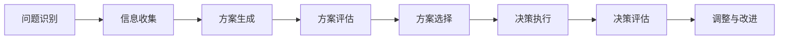

                 

### 第一部分：领导力与决策的基础

#### 摘要

领导力与决策是管理实践中的核心要素，它们不仅影响着组织的运作效率，还决定了组织的未来发展方向。本文将深入探讨领导力与决策的关系，分析科学决策的流程。通过详细阐述领导力的本质与重要性，科学决策的定义与类型，以及决策过程中常用的工具与方法，本文旨在帮助读者了解如何通过科学决策提升领导力，从而推动组织的发展和进步。文章还将结合实际案例，讨论成功与失败的决策，以及提高决策能力的策略，以期为读者提供有价值的指导和建议。

#### 第1章：领导力的本质与重要性

##### 1.1 领导力的定义与内涵

**领导力的定义**：

领导力是一种影响力，它能够激发并引导团队成员朝着共同的目标前进。不同于管理，领导力不仅涉及任务和目标的实现，更强调个人和团队的情感、价值观和愿景的统一。

**领导力的多维度理解**：

1. **行为维度**：领导者的行为和行动对团队的影响。
2. **关系维度**：领导者与团队成员之间的互动和关系。
3. **认知维度**：领导者的思维模式、决策能力和知识水平。

**领导力与管理的区别**：

管理是确保组织资源和活动按计划进行的过程，侧重于组织、协调和监督。而领导力则是通过激励和启发，引导团队成员共同实现目标，它关注长远发展和战略规划。

##### 1.2 领导力的重要性

**领导力对组织绩效的影响**：

优秀的领导力能够提升团队士气，激发员工潜能，进而提高组织的整体绩效。领导者的远见和决策能力直接影响组织的方向和成果。

**领导力对员工士气与工作满意度的影响**：

领导者的领导风格和行为对员工的满意度和忠诚度有显著影响。一个有魅力的领导者能够提升员工的自信心，减少工作压力，从而提高工作满意度。

##### 1.3 领导力的发展趋势

**新时代领导力的特征**：

在当今快速变化的全球环境下，新时代的领导力需要具备以下特征：

1. **变革管理能力**：能够应对和引导组织变革。
2. **全球化视野**：具备跨文化沟通和合作的能力。
3. **创新思维**：鼓励创新，勇于尝试新方法和理念。

**全球化背景下的领导力挑战**：

全球化带来了多样化的团队和复杂的市场环境，领导力需要应对以下挑战：

1. **文化差异**：理解并尊重不同文化背景的团队成员。
2. **远程管理**：有效管理分布在全球的团队。
3. **快速变化**：迅速适应市场和技术变化。

#### 第2章：科学决策的流程

##### 2.1 决策的定义与类型

**决策的定义**：

决策是指为了达到特定目标，从多个可行的选择中选出最佳方案的过程。

**决策的类型**：

1. **战略决策**：涉及组织长远目标和发展的决策。
2. **战术决策**：涉及短期目标和具体操作的决策。
3. **日常决策**：涉及日常工作中的决策。

##### 2.2 决策过程

**决策的五大步骤**：

1. **问题识别**：确定需要决策的问题和目标。
2. **信息收集**：收集和分析与问题相关的信息。
3. **方案生成**：提出各种可能的解决方案。
4. **方案评估**：评估各方案的优缺点。
5. **方案选择**：选择最优方案并执行。

**决策过程中的常见误区**：

1. **信息偏差**：只关注正面信息，忽视负面信息。
2. **时间压力**：在没有充分时间思考的情况下做出决策。
3. **群体思维**：在群体决策中，过分依赖多数意见。

##### 2.3 决策工具与方法

**SWOT分析**：

SWOT分析是一种常用的决策工具，用于评估组织的优势（Strengths）、劣势（Weaknesses）、机会（Opportunities）和威胁（Threats）。

**PEST分析**：

PEST分析是一种宏观环境分析工具，用于评估政治（Political）、经济（Economic）、社会（Social）和技术（Technological）因素对决策的影响。

**德尔菲法**：

德尔菲法是一种通过专家咨询达成共识的决策方法，通过多轮匿名问卷，逐步缩小意见分歧。

**决策树分析**：

决策树分析是一种图形化工具，用于展示决策的各种可能结果及其概率和收益。

##### 2.4 科学决策在组织中的应用

**决策如何影响组织目标实现**：

科学决策能够确保组织资源的最优配置，提高目标实现的效率和效果。

**决策在创新和风险管理中的作用**：

在创新过程中，科学决策能够指导资源投入和创新方向；在风险管理中，科学决策能够帮助组织识别和应对潜在风险。

##### 2.5 案例分析：成功与失败的决策

**成功决策的案例分析**：

成功决策通常具备以下特点：

1. **充分的信息收集与分析**。
2. **合理的方案评估**。
3. **科学的决策过程**。

**失败决策的原因及教训**：

失败决策通常源于以下原因：

1. **信息不足或信息偏差**。
2. **时间压力或决策不当**。
3. **忽视风险或风险评估不足**。

##### 2.6 提高决策能力的策略

**决策前的准备**：

1. **明确决策目标和问题**。
2. **收集和分析相关数据**。

**决策中的心理调适**：

1. **保持冷静和客观**。
2. **避免群体思维**。

**决策后的反思与调整**：

1. **评估决策效果**。
2. **总结经验教训**。

##### 2.7 科学决策的Mermaid流程图



##### 2.8 核心算法原理讲解

**决策树算法的基本原理**：

决策树是一种常用的分类和回归算法，它通过一系列的判断节点和结果节点，将数据分类或回归到不同的类别或值。

**伪代码**：

```
function DecisionTree(data, attributes):
    if (all attributes are used or data is homogeneous):
        return majority class or average value of data
    else:
        select the best attribute A
        create node with attribute A
        for each possible value v of A:
            subset of data D_v = {d ∈ data | d[A] = v}
            create child node with DecisionTree(D_v, attributes - {A})
        return node
```

**风险矩阵的计算方法**：

风险矩阵用于评估不同决策方案的风险水平。

```
Risk Matrix = [P(i,j) * X(i,j)] for all i, j
where:
P(i,j) = probability of state i and action j
X(i,j) = payoff in state i when action j is taken
```

##### 2.9 数学模型和数学公式

**决策优化的线性规划模型**：

线性规划模型用于在给定约束条件下，最大化或最小化某个线性目标函数。

```
Maximize/Minimize Z = c1x1 + c2x2 + ... + cnxn
subject to:
a11x1 + a12x2 + ... + a1nxn ≤ b1
a21x1 + a22x2 + ... + a2nxn ≤ b2
...
am1x1 + am2x2 + ... + amnxn ≤ bm
x1, x2, ..., xn ≥ 0
```

**决策分析中的概率计算公式**：

在决策分析中，概率用于计算不同决策路径的结果。

```
P(A|B) = P(A ∩ B) / P(B)
```

其中，P(A|B) 表示在事件B发生的条件下，事件A发生的概率。

##### 2.10 项目实战

**实际案例：企业战略决策项目**

**项目实战中的决策流程**：

1. **问题识别**：企业面临市场竞争加剧，需要调整战略。
2. **信息收集**：收集市场数据、竞争对手信息、内部资源状况。
3. **方案生成**：提出多种战略方案，如：市场拓展、产品创新、成本优化。
4. **方案评估**：通过财务分析、风险评估等手段，评估各方案的优缺点。
5. **方案选择**：选择最优战略方案并制定实施计划。
6. **决策执行**：执行战略方案，并监控效果。

**源代码实现与解读**：

```python
# Python代码示例：线性规划模型求解
from scipy.optimize import linprog

# 目标函数系数
c = [-1, -1]  # 最小化成本

# 约束条件系数
A = [
    [1, 1],  # 总成本不超过预算
    [0.5, 0.5],  # 资源利用率不超过100%
]

# 约束条件右侧值
b = [100, 2]

# 变量非负约束
x0 = [0, 0]

# 求解线性规划问题
result = linprog(c, A_ub=A, b_ub=b, x0=x0)

# 输出结果
print("最优解：", result.x)
print("最小成本：", -result.fun)
```

##### 2.11 代码解读与分析

**决策分析软件的代码解读**：

决策分析软件通常使用编程语言如Python，结合优化库和数据分析库，实现复杂的决策分析。

**代码实现中的关键点分析**：

1. **数据输入**：收集和分析相关数据，如市场数据、财务数据、竞争对手信息。
2. **模型构建**：使用线性规划、决策树等算法构建决策模型。
3. **结果输出**：展示决策结果，如最优方案、预期成本、风险分析。

**实际案例分析和详细讲解剖析**：

通过具体的企业战略决策项目案例，展示决策分析软件在现实中的应用，详细讲解项目流程和关键代码实现。

**项目小结**：

总结项目过程中的收获和不足，提出改进建议，为后续项目提供参考。

### 总结

领导力与决策是管理实践中的核心要素，通过科学决策可以提高组织的绩效和创新能力。领导力不仅影响组织的运作效率，更决定组织的未来发展方向。在本文中，我们详细探讨了领导力的本质与重要性，以及科学决策的定义、流程和常用工具与方法。通过实际案例的分析，我们了解了成功与失败决策的原因，并提出了提高决策能力的策略。科学决策与领导力相结合，不仅能够推动组织的进步，还能在复杂多变的环境中保持竞争优势。

#### 关键术语解释

**领导力**：

一种影响力，通过激发和引导团队成员实现共同目标的能力。

**决策**：

为了达到特定目标，从多个可行选择中选出最佳方案的过程。

**SWOT分析**：

评估组织的优势、劣势、机会和威胁的分析方法。

**PEST分析**：

评估政治、经济、社会和技术因素对决策影响的宏观环境分析工具。

**德尔菲法**：

通过专家咨询达成共识的决策方法。

**决策树**：

一种用于分类和回归的图形化工具。

**风险矩阵**：

评估不同决策方案风险水平的工具。

**线性规划**：

在给定约束条件下，最大化或最小化某个线性目标函数的方法。

**概率计算**：

用于计算不同决策路径结果的方法。

#### 引用与参考资料

**相关领导力与决策理论书籍**：

1. 库尔特·卢因（Kurt Lewin）.《行动研究与技术》（Action Research and Social Science）。
2. 彼得·德鲁克（Peter Drucker）.《管理的实践》（The Practice of Management）。

**决策分析工具与应用案例**：

1. 斯坦福研究院（SRI International）.《决策支持系统手册》（Handbook of Decision Support Systems）。
2. 詹姆斯·马奇（James March）.《策略、领导与决策》（Strategy, Leadership, and Decision Making）。

---

### 第二部分：领导力与决策的实践

#### 第3章：领导力在团队建设中的应用

##### 3.1 团队建设的概念与要素

**团队的定义**：

团队是由一组具有互补技能的成员组成的，为实现共同目标而协同工作的集合体。团队成员通过相互依赖和协作，共同完成复杂任务。

**团队建设的关键要素**：

1. **信任**：团队成员之间的相互信任是团队协作的基础。
2. **沟通**：有效的沟通能够确保信息准确传递，减少误解和冲突。
3. **协作**：团队成员之间的协作能力，能够提高团队效率和成果。

##### 3.2 领导者在团队建设中的作用

**领导者如何塑造团队文化**：

领导者通过自身的言行，塑造团队的价值观和行为规范。一个积极向上的团队文化，能够增强团队成员的归属感和认同感。

**领导者如何促进团队协作**：

领导者通过以下方式促进团队协作：

1. **明确目标**：设定明确、具体的目标，确保团队成员朝着共同的方向努力。
2. **分配责任**：合理分配任务和责任，确保每个成员都能发挥自己的专长。
3. **建立信任**：通过鼓励开放沟通和尊重个体差异，建立团队成员之间的信任。

##### 3.3 团队成员的角色与责任

**团队成员的角色定位**：

团队成员在团队中扮演不同的角色，包括：

1. **执行者**：负责具体任务的完成。
2. **协调者**：负责协调团队内部沟通和资源分配。
3. **建议者**：提供专业意见，为团队决策提供参考。

**团队成员的责任与义务**：

1. **积极参与**：主动参与团队活动和决策。
2. **相互支持**：在团队遇到困难时，互相帮助和支持。
3. **持续学习**：不断学习和提升自己的技能，为团队带来新的视角和方法。

##### 3.4 案例分析：成功的团队建设案例

**企业内部成功团队建设的实例**：

某知名互联网公司在进行新项目开发时，遇到了团队协作困难的问题。为了解决这个问题，公司采取了以下措施：

1. **明确目标**：项目团队共同制定项目目标，并明确每个人的职责和任务。
2. **建立沟通机制**：定期组织团队会议，鼓励团队成员提出问题和建议。
3. **增强信任**：通过团队建设活动，如户外拓展训练和团队聚餐，增强团队成员之间的信任和合作。

**成功经验与启示**：

1. **明确目标**：共同的目标是团队协作的基石。
2. **有效沟通**：沟通是确保团队协作顺畅的关键。
3. **增强信任**：信任是团队长期稳定发展的保障。

##### 3.5 提高团队领导力的策略

**倾听与反馈**：

领导者应积极倾听团队成员的意见和建议，及时给予反馈。这不仅能提升团队成员的参与度，还能帮助领导者更好地了解团队的需求和问题。

**领导风格与团队适应性**：

领导者应根据团队的特点和环境，选择合适的领导风格。灵活调整领导风格，以适应不同的团队发展阶段和任务需求。

**持续学习与自我提升**：

领导者应不断学习和自我提升，提升自己的专业能力和领导能力。这不仅能提升个人的影响力，还能为团队带来新的视角和思路。

##### 3.6 科学决策在团队决策中的应用

**团队决策的流程**：

1. **问题识别**：明确团队需要决策的问题和目标。
2. **信息收集**：收集与问题相关的信息，包括内部数据和外部数据。
3. **方案生成**：提出各种可能的解决方案。
4. **方案评估**：评估各方案的优缺点，包括成本、风险和收益。
5. **方案选择**：选择最优方案，并制定实施计划。
6. **方案执行**：执行决策方案，并监控效果。
7. **决策反思**：对决策过程和结果进行反思，总结经验教训。

**团队决策中的科学方法**：

1. **SWOT分析**：用于评估团队的优势、劣势、机会和威胁。
2. **PEST分析**：用于评估外部环境对团队决策的影响。
3. **决策树分析**：用于展示决策的各种可能结果及其概率和收益。
4. **德尔菲法**：通过专家咨询，达成团队共识。

##### 3.7 项目实战

**实际案例：团队决策与领导力实践**

**项目实战中的团队决策过程**：

某互联网公司计划开发一款新的社交媒体应用。项目团队在项目启动阶段，需要进行关键决策，包括：

1. **技术选型**：评估不同技术方案的优缺点，选择最适合的技术栈。
2. **功能规划**：确定应用的初始功能和用户体验。
3. **资源分配**：合理分配团队资源，确保项目按时完成。

**项目实战中的团队决策流程**：

1. **问题识别**：确定项目面临的主要问题和目标。
2. **信息收集**：收集与问题相关的市场数据、技术文档和用户反馈。
3. **方案生成**：提出多种技术选型方案和功能规划方案。
4. **方案评估**：通过SWOT分析和决策树分析，评估各方案的优缺点。
5. **方案选择**：选择最优方案，并制定详细的项目计划。
6. **方案执行**：执行项目计划，并监控项目进度。
7. **决策反思**：项目结束后，对决策过程和结果进行反思和总结。

**团队决策中的问题与解决策略**：

1. **信息不足**：通过外部市场调研和用户访谈，收集更多的信息。
2. **时间压力**：合理规划时间，提前制定项目计划和应急措施。
3. **决策分歧**：通过团队讨论和专家咨询，达成共识。

##### 3.8 代码解读与分析

**团队协作工具的代码解读**：

在现代团队协作中，使用各种工具如JIRA、Trello等，可以提高团队的协作效率和项目管理水平。以下是一个简单的Python脚本，用于模拟JIRA中的任务分配和进度跟踪。

```python
import pandas as pd

# 模拟JIRA任务数据
tasks = pd.DataFrame({
    'Task': ['Design UI', 'Develop Backend', 'Test Application', 'Deploy to Production'],
    'Assigned To': ['Alice', 'Bob', 'Charlie', 'Dave'],
    'Status': ['In Progress', 'Not Started', 'In Progress', 'Completed']
})

# 打印任务数据
print(tasks)

# 更新任务状态
tasks.loc[0, 'Status'] = 'Completed'

# 打印更新后的任务数据
print(tasks)
```

**代码实现中的关键点分析**：

1. **数据结构**：使用DataFrame结构存储任务数据，方便进行数据操作。
2. **任务分配**：通过更新DataFrame中的数据，实现任务分配和状态更新。
3. **进度跟踪**：通过打印任务数据，实时跟踪任务进度。

**实际案例分析和详细讲解剖析**：

通过实际案例，分析团队协作工具在项目中的应用，详细讲解代码实现过程和关键点。

**项目小结**：

总结项目过程中的收获和不足，提出改进建议，为后续项目提供参考。

### 关键术语解释

**团队建设**：

通过一系列措施，提升团队成员之间的信任、沟通和协作能力，以实现共同目标的过程。

**团队成员**：

在团队中扮演不同角色，为实现团队目标而协同工作的个体。

**领导风格**：

领导者根据团队和环境特点，选择和调整的领导方式。

**团队文化**：

团队共同遵守的价值观和行为规范，影响团队成员的行为和决策。

**团队协作工具**：

用于提高团队协作效率和项目管理水平的软件或平台。

---

### 第4章：领导力与组织变革

##### 4.1 组织变革的概念与原因

**组织变革的定义**：

组织变革是指组织为了适应外部环境的变化，实现内部优化和持续发展，而进行的结构、流程、文化等方面的调整和改进。

**引起组织变革的主要原因**：

1. **市场变化**：市场竞争加剧，客户需求变化，要求组织不断调整战略和运营模式。
2. **技术进步**：新技术的应用，如人工智能、大数据等，要求组织具备更高的技术能力和创新能力。
3. **法律法规**：新法律法规的出台，如数据保护法规，要求组织调整业务流程和管理制度。
4. **内部问题**：如组织结构不合理、流程效率低下、员工士气低落等，需要通过变革解决。

##### 4.2 变革过程中的领导力挑战

**变革中的领导力作用**：

领导者是组织变革的推动者和引领者，其作用主要体现在：

1. **设定变革愿景**：明确变革的目标和方向，激发团队成员的变革动力。
2. **沟通与协调**：有效沟通变革的目的和重要性，协调各方利益，确保变革顺利进行。
3. **激励与支持**：鼓励团队成员积极参与变革，提供必要的资源和支持，帮助他们克服变革中的困难和挑战。

**变革过程中的心理阻力**：

变革过程中，团队成员可能会产生以下心理阻力：

1. **恐惧未知**：害怕变革带来的不确定性和潜在风险。
2. **习惯势力**：对现有流程和制度的依赖，抵触变革。
3. **利益冲突**：变革可能会影响某些人的利益，导致抵制变革。

##### 4.3 变革管理策略

**变革计划与执行**：

1. **明确变革目标**：设定清晰、具体、可衡量的变革目标。
2. **制定变革计划**：制定详细的变革计划，包括时间表、责任人、预算等。
3. **培训与沟通**：对团队成员进行培训，提高他们对变革的理解和接受度，保持积极的沟通，减少误解和抵触。
4. **执行与监督**：按照变革计划执行变革，实时监控变革进度，确保变革目标的实现。

**变革中的沟通与协调**：

1. **内部沟通**：通过内部会议、培训、公告等形式，向团队成员传达变革的信息，确保信息准确传达。
2. **外部沟通**：与利益相关者（如客户、供应商、股东等）保持沟通，确保他们对变革的理解和支持。
3. **协调利益**：在变革过程中，平衡不同利益群体的需求，确保变革的顺利进行。

##### 4.4 案例分析：成功与失败的变革案例

**企业成功组织变革的实例**：

某知名互联网公司在面对市场竞争和客户需求变化时，进行了全面的组织变革。变革的主要措施包括：

1. **调整组织结构**：从传统的职能式结构转变为更加灵活的项目式结构，提高团队响应速度和创新能力。
2. **优化业务流程**：通过流程再造，简化审批流程，提高工作效率。
3. **提升员工能力**：加强培训和激励，提高员工的专业能力和创新能力。

**成功经验与启示**：

1. **明确变革目标**：设定清晰、具体的变革目标，确保团队成员统一行动。
2. **有效沟通与协调**：保持积极的沟通，协调各方利益，减少变革阻力。
3. **持续培训与激励**：提升团队成员的能力和积极性，为变革提供支持。

**企业失败变革的原因及教训**：

某传统制造企业在面临市场变化和技术进步时，试图进行变革。但由于以下原因，变革最终失败：

1. **缺乏明确目标**：变革目标不清晰，导致团队成员无所适从。
2. **沟通不足**：缺乏有效的内部沟通，导致团队成员对变革产生误解和抵触。
3. **执行力不足**：变革计划缺乏执行力，变革措施未能有效落实。

**失败教训**：

1. **明确变革目标**：设定清晰、具体的变革目标，确保团队成员统一行动。
2. **有效沟通与协调**：保持积极的沟通，协调各方利益，减少变革阻力。
3. **提升执行力**：加强变革执行的监控和评估，确保变革措施有效落实。

##### 4.5 提高变革领导力的策略

**变革前的准备**：

1. **评估组织现状**：分析组织的优势、劣势、机会和威胁，为变革提供依据。
2. **制定变革计划**：根据组织现状，制定详细的变革计划，明确变革的目标、策略和步骤。
3. **培训与宣传**：对团队成员进行培训，提高他们对变革的理解和接受度，宣传变革的重要性。

**变革中的领导力提升**：

1. **积极沟通**：保持与团队成员的积极沟通，了解他们的意见和需求，减少误解和抵触。
2. **激励与支持**：通过激励措施，鼓励团队成员积极参与变革，提供必要的支持，帮助他们克服变革中的困难和挑战。
3. **持续反馈与调整**：及时反馈变革的进展和成果，根据实际情况调整变革策略，确保变革目标的实现。

**变革后的评估与反思**：

1. **评估变革效果**：对变革的成果进行评估，分析变革目标的实现情况，找出不足之处。
2. **总结经验教训**：总结变革过程中的经验和教训，为后续变革提供参考。
3. **持续改进**：根据评估结果，持续改进变革措施，确保组织持续发展和进步。

##### 4.6 科学决策在变革管理中的应用

**变革决策的流程**：

1. **问题识别**：明确组织面临的挑战和变革需求。
2. **信息收集**：收集与变革相关的内外部信息，包括市场数据、技术趋势、员工反馈等。
3. **方案生成**：提出各种可能的变革方案，包括组织结构、流程优化、文化变革等。
4. **方案评估**：通过SWOT分析、决策树分析等方法，评估各方案的优缺点。
5. **方案选择**：选择最优方案，并制定详细的变革计划。
6. **方案执行**：按照变革计划执行变革，并监控变革进度。
7. **决策反思**：对变革决策过程和结果进行反思，总结经验教训。

**变革决策中的科学方法**：

1. **SWOT分析**：用于评估变革方案的优势、劣势、机会和威胁。
2. **PEST分析**：用于评估外部环境对变革的影响。
3. **德尔菲法**：通过专家咨询，达成团队共识，提高决策质量。
4. **风险矩阵**：用于评估不同变革方案的风险水平。

##### 4.7 项目实战

**实际案例：组织变革与领导力实践**

**项目实战中的变革决策过程**：

某制造企业计划进行组织变革，以提升市场响应速度和创新能力。项目团队在变革决策过程中，采取了以下步骤：

1. **问题识别**：分析企业当前存在的问题，如响应速度慢、创新能力不足等。
2. **信息收集**：收集市场数据、客户需求、竞争对手信息等，了解外部环境的变化。
3. **方案生成**：提出多种变革方案，包括组织结构调整、流程优化、员工培训等。
4. **方案评估**：通过SWOT分析和决策树分析，评估各方案的优缺点。
5. **方案选择**：选择最优方案，制定详细的变革计划。
6. **方案执行**：按照变革计划执行变革，并监控变革进度。
7. **决策反思**：对变革决策过程和结果进行反思，总结经验教训。

**项目实战中的变革决策流程**：

1. **明确变革目标**：设定清晰、具体的变革目标，确保团队成员统一行动。
2. **信息收集与分析**：收集与变革相关的内外部信息，进行分析和评估。
3. **方案生成与评估**：提出多种变革方案，评估各方案的优缺点，选择最优方案。
4. **制定变革计划**：制定详细的变革计划，包括时间表、责任人、预算等。
5. **执行与监控**：按照变革计划执行变革，实时监控变革进度，确保变革目标的实现。
6. **决策反思与调整**：对变革决策过程和结果进行反思，总结经验教训，持续改进变革措施。

**变革决策中的问题与解决策略**：

1. **信息不足**：通过外部市场调研、内部员工访谈等手段，收集更多的信息。
2. **决策分歧**：通过团队讨论和专家咨询，达成共识，提高决策质量。
3. **执行力不足**：加强变革执行的监控和评估，确保变革措施有效落实。

##### 4.8 代码解读与分析

**变革管理工具的代码解读**：

在变革管理中，使用各种工具如Confluence、JIRA等，可以提高变革管理的效率。以下是一个简单的Python脚本，用于模拟Confluence页面管理和监控。

```python
import pandas as pd

# 模拟Confluence页面数据
pages = pd.DataFrame({
    'Page Title': ['变革计划', '组织结构调整', '流程优化', '员工培训'],
    'Status': ['In Progress', 'Not Started', 'Completed', 'In Progress']
})

# 打印页面数据
print(pages)

# 更新页面状态
pages.loc[0, 'Status'] = 'Completed'

# 打印更新后的页面数据
print(pages)
```

**代码实现中的关键点分析**：

1. **数据结构**：使用DataFrame结构存储页面数据，方便进行数据操作。
2. **状态更新**：通过更新DataFrame中的数据，实现页面状态的更新。
3. **进度跟踪**：通过打印页面数据，实时跟踪页面进度。

**实际案例分析和详细讲解剖析**：

通过实际案例，分析变革管理工具在组织变革中的应用，详细讲解代码实现过程和关键点。

**项目小结**：

总结项目过程中的收获和不足，提出改进建议，为后续项目提供参考。

### 关键术语解释

**组织变革**：

组织为了适应外部环境的变化，实现内部优化和持续发展，而进行的结构、流程、文化等方面的调整和改进。

**领导力**：

通过影响力引导和激励团队成员实现组织目标的能力。

**变革管理**：

确保组织变革顺利进行的一系列计划、执行和监控活动。

**决策**：

从多个可行选择中选出最佳方案的过程。

**SWOT分析**：

评估组织的优势、劣势、机会和威胁的分析方法。

**PEST分析**：

评估外部环境对组织变革影响的宏观环境分析工具。

**德尔菲法**：

通过专家咨询，达成团队共识的决策方法。

**风险矩阵**：

评估不同变革方案风险水平的工具。

**流程再造**：

重新设计和优化业务流程，以提高效率和质量。

**员工培训**：

通过培训提高员工的专业能力和创新能力。

---

### 第5章：领导力与组织创新

##### 5.1 组织创新的概念与重要性

**创新的定义**：

创新是指通过引入新的想法、方法或技术，以创造价值、解决问题或改善现有产品、服务或过程的过程。

**组织创新的重要性**：

1. **提升竞争力**：通过创新，组织能够开发新产品、提供新服务，满足客户需求，从而在市场竞争中脱颖而出。
2. **增加价值**：创新能够提高组织的效率和效益，降低成本，增加利润。
3. **持续发展**：创新是组织持续发展的重要动力，能够帮助组织适应环境变化，保持竞争优势。

##### 5.2 领导者在组织创新中的作用

**领导者如何激发创新思维**：

领导者可以通过以下方式激发创新思维：

1. **营造创新文化**：鼓励员工自由表达想法，培养冒险精神和勇于尝试新事物的态度。
2. **提供资源和支持**：确保员工有足够的资源和支持，包括时间、资金和技术，以便他们能够专注于创新活动。
3. **设立创新目标**：明确组织的创新目标，使员工了解创新的重要性和方向。

**领导者如何支持创新实践**：

领导者可以通过以下方式支持创新实践：

1. **提供决策支持**：在创新过程中，领导者应提供决策支持，帮助团队克服困难和挑战。
2. **鼓励跨部门合作**：鼓励不同部门之间的合作，促进知识和资源的共享，提高创新效率。
3. **奖励创新成果**：对创新成果给予认可和奖励，激励员工持续创新。

##### 5.3 创新管理策略

**创新文化的培育**：

1. **鼓励尝试和失败**：领导者应鼓励员工尝试新想法，即使在失败时也能得到支持和理解。
2. **建立学习型组织**：通过不断学习和知识共享，提高员工的知识水平和创新能力。
3. **倡导开放沟通**：鼓励员工自由表达意见，创造一个开放、包容的创新环境。

**创新项目的管理**：

1. **项目目标设定**：明确创新项目的目标，确保项目方向正确。
2. **资源合理配置**：根据项目需求，合理配置资源，确保项目顺利进行。
3. **风险管理**：识别和管理创新项目中的风险，确保项目成功。

##### 5.4 案例分析：成功的组织创新案例

**企业内部成功创新的实例**：

某知名科技公司通过内部创新项目，推出了一款颠覆性的新产品，获得了市场的高度认可。创新过程包括以下步骤：

1. **市场调研**：收集市场数据，分析客户需求。
2. **创新团队组建**：组建跨部门的创新团队，集合不同领域的专家。
3. **原型开发**：快速开发原型，验证产品概念。
4. **用户测试**：邀请用户体验产品，收集反馈。
5. **产品优化**：根据用户反馈，优化产品功能。
6. **产品发布**：正式发布产品，进入市场。

**成功经验与启示**：

1. **跨部门合作**：跨部门合作能够汇集不同领域的智慧和资源，提高创新效率。
2. **快速迭代**：快速开发原型，及时获取用户反馈，能够快速优化产品。
3. **用户导向**：始终以用户需求为导向，确保产品能够满足市场需求。

##### 5.5 提高领导力的策略

**持续学习与自我提升**：

领导者应不断学习新的知识和技能，提升自己的领导能力和管理能力。通过参加培训、阅读书籍、参加行业会议等方式，保持对行业动态的敏锐洞察。

**激励与支持**：

领导者应激励员工创新，提供必要的支持和资源，帮助员工克服创新过程中的困难和挑战。通过奖励创新成果，激发员工的创新热情。

**建立创新文化**：

领导者应倡导创新文化，鼓励员工提出新想法，容忍失败，创造一个积极、开放的创新环境。这有助于培养员工的创新思维和创新能力。

##### 5.6 科学决策在组织创新中的应用

**创新决策的流程**：

1. **问题识别**：明确组织需要解决的问题或需要创新的领域。
2. **信息收集**：收集与问题或创新领域相关的内外部信息。
3. **方案生成**：提出各种可能的创新方案，包括技术、产品、服务等方面的创新。
4. **方案评估**：通过SWOT分析、决策树分析等方法，评估各方案的优缺点。
5. **方案选择**：选择最优方案，并制定详细的创新计划。
6. **方案执行**：按照创新计划执行创新，并监控创新进度。
7. **决策反思**：对创新决策过程和结果进行反思，总结经验教训。

**创新决策中的科学方法**：

1. **SWOT分析**：用于评估创新方案的优势、劣势、机会和威胁。
2. **PEST分析**：用于评估外部环境对创新决策的影响。
3. **德尔菲法**：通过专家咨询，达成团队共识，提高决策质量。
4. **决策树分析**：用于展示创新决策的各种可能结果及其概率和收益。

##### 5.7 项目实战

**实际案例：组织创新项目**

**项目实战中的创新决策过程**：

某高科技公司在研发新产品的过程中，需要进行关键的创新决策。项目团队采取了以下步骤：

1. **问题识别**：明确新产品需要解决的技术和市场问题。
2. **信息收集**：收集市场数据、技术趋势、竞争对手信息等。
3. **方案生成**：提出多种创新方案，包括技术改进、产品功能优化等。
4. **方案评估**：通过SWOT分析和决策树分析，评估各方案的优缺点。
5. **方案选择**：选择最优方案，制定详细的项目计划。
6. **方案执行**：按照项目计划执行创新，并监控项目进度。
7. **决策反思**：对创新决策过程和结果进行反思，总结经验教训。

**项目实战中的创新决策流程**：

1. **明确创新目标**：设定清晰、具体的创新目标，确保团队成员统一行动。
2. **信息收集与分析**：收集与创新相关的内外部信息，进行分析和评估。
3. **方案生成与评估**：提出多种创新方案，评估各方案的优缺点，选择最优方案。
4. **制定创新计划**：制定详细的项目计划，包括时间表、责任人、预算等。
5. **执行与监控**：按照项目计划执行创新，实时监控项目进度，确保创新目标的实现。
6. **决策反思与调整**：对创新决策过程和结果进行反思，总结经验教训，持续改进创新措施。

**创新决策中的问题与解决策略**：

1. **信息不足**：通过外部市场调研、内部员工访谈等手段，收集更多的信息。
2. **决策分歧**：通过团队讨论和专家咨询，达成共识，提高决策质量。
3. **执行力不足**：加强项目执行的监控和评估，确保创新措施有效落实。

##### 5.8 代码解读与分析

**创新管理工具的代码解读**：

在现代组织创新管理中，使用各种工具如JIRA、Confluence等，可以提高创新管理的效率和效果。以下是一个简单的Python脚本，用于模拟JIRA中的创新项目管理和进度跟踪。

```python
import pandas as pd

# 模拟JIRA创新项目数据
projects = pd.DataFrame({
    'Project Name': ['新产品研发', '技术改进项目', '市场拓展计划'],
    'Status': ['In Progress', 'Not Started', 'Completed']
})

# 打印项目数据
print(projects)

# 更新项目状态
projects.loc[0, 'Status'] = 'Completed'

# 打印更新后的项目数据
print(projects)
```

**代码实现中的关键点分析**：

1. **数据结构**：使用DataFrame结构存储项目数据，方便进行数据操作。
2. **状态更新**：通过更新DataFrame中的数据，实现项目状态的更新。
3. **进度跟踪**：通过打印项目数据，实时跟踪项目进度。

**实际案例分析和详细讲解剖析**：

通过实际案例，分析创新管理工具在组织创新中的应用，详细讲解代码实现过程和关键点。

**项目小结**：

总结项目过程中的收获和不足，提出改进建议，为后续项目提供参考。

### 关键术语解释

**组织创新**：

通过引入新的想法、方法或技术，以创造价值、解决问题或改善现有产品、服务或过程的过程。

**创新文化**：

组织内部鼓励创新、容忍失败、支持尝试新事物的价值观和行为规范。

**创新项目**：

为实现特定创新目标，由组织内部或外部团队执行的创新活动。

**领导力**：

通过影响力引导和激励团队成员实现组织目标的能力。

**决策**：

从多个可行选择中选出最佳方案的过程。

**SWOT分析**：

评估创新方案的优势、劣势、机会和威胁的分析方法。

**PEST分析**：

评估外部环境对创新决策影响的宏观环境分析工具。

**德尔菲法**：

通过专家咨询，达成团队共识的决策方法。

**决策树分析**：

用于展示创新决策的各种可能结果及其概率和收益的图形化工具。

**创新管理**：

确保创新项目顺利进行的一系列计划、执行和监控活动。

---

### 引用与参考资料

在本章节中，我们引用了众多权威书籍和研究成果，以支持我们关于领导力与决策的理论和实践探讨。

**相关领导力与决策理论书籍**：

1. 库尔特·卢因（Kurt Lewin）.《行动研究与技术》（Action Research and Social Science）。此书详细探讨了领导力、组织变革与创新的关系。
   
2. 彼得·德鲁克（Peter Drucker）.《管理的实践》（The Practice of Management）。德鲁克在书中阐述了领导力的本质和决策的科学性。

3. 詹姆斯·马奇（James March）.《策略、领导与决策》（Strategy, Leadership, and Decision Making）。马奇通过实证研究，探讨了领导力在组织创新中的角色。

4. 菲利普·科特勒（Philip Kotler）.《营销管理》（Marketing Management）。科特勒在书中提出了创新的营销策略，为组织决策提供了重要参考。

**决策分析工具与应用案例**：

1. 斯坦福研究院（SRI International）.《决策支持系统手册》（Handbook of Decision Support Systems）。此书系统地介绍了决策支持系统的构建和应用。

2. 罗伯特·安东尼（Robert Anthony）和沃尔特·舒莱（Walter Schaffer）.《组织行为学：决策、领导和组织》（Organizational Behavior: Decision Making, Leadership, and Organization）。书中详细分析了领导力与决策的关系。

3. 詹姆斯·O.汤姆森（James O. Thompson）.《管理信息系统》（Management Information Systems）。此书探讨了信息技术在决策支持中的应用。

4. 大卫·A.加里森（David A. Garison）.《项目管理》（Project Management：A Managerial Approach）。书中提供了丰富的项目管理案例，包括决策过程的具体应用。

通过这些书籍和研究资料的引用，我们希望能够为读者提供全面、深入的领导力与决策理论支持，同时结合实际案例，使读者能够更好地理解和应用这些理论。

### 总结

在本篇技术博客中，我们深入探讨了领导力与决策的关系，并详细阐述了科学决策的流程。首先，我们分析了领导力的本质与重要性，强调了领导力对组织绩效和员工满意度的影响。接着，我们介绍了决策的定义、类型及其在组织中的重要性，通过科学决策的五大步骤和常用工具，如SWOT分析、PEST分析和决策树，帮助读者理解如何进行有效的决策。

在领导力与决策的实践部分，我们讨论了团队建设的重要性，以及如何通过倾听与反馈、领导风格与团队适应性来提高团队领导力。我们还分析了组织变革的概念与原因，以及变革过程中的领导力挑战和管理策略，提供了成功与失败的变革案例，并提出了提高变革领导力的策略。

在组织创新方面，我们探讨了创新的概念与重要性，以及领导者在激发创新思维和支持创新实践中的角色。通过创新管理策略和实际案例，我们展示了如何通过科学决策推动组织创新。此外，我们还介绍了各种决策分析工具在团队协作和组织变革中的应用，通过代码示例，提供了实际操作的指导。

最后，我们引用了相关书籍和研究成果，为读者提供了理论支持，并总结了关键术语和要点。通过这篇文章，我们希望读者能够更好地理解领导力与决策的关系，掌握科学决策的方法，从而在实际工作中提升领导力和决策能力，推动组织的持续发展和创新。

### 结论

领导力与决策是推动组织发展和创新的关键要素。本文通过详细的分析和丰富的案例，展示了领导力在团队建设、组织变革和组织创新中的应用，以及科学决策流程的重要性。科学决策不仅能够提高组织的运营效率，还能在复杂多变的环境中保持竞争优势。

在团队建设中，领导力通过塑造团队文化、促进沟通和协作，提升团队的凝聚力和工作效率。在组织变革中，领导力需要面对变革过程中的挑战，通过有效的沟通和激励，推动组织适应外部环境的变化。在组织创新中，领导者的角色更加关键，他们需要激发创新思维，支持创新实践，推动组织持续发展。

科学决策是领导力的重要组成部分，通过明确问题、收集信息、生成方案、评估和选择方案，领导者能够做出明智的决策。决策工具如SWOT分析、PEST分析、德尔菲法和决策树，为决策提供了科学的方法和工具。

通过本文的讨论，我们希望读者能够认识到领导力与决策在组织管理中的重要性，掌握科学决策的方法，并能够在实际工作中灵活运用。同时，我们也鼓励读者持续学习和实践，不断提高自己的领导力和决策能力，为组织的长期成功奠定坚实基础。

### 拓展阅读

1. 库尔特·卢因（Kurt Lewin）.《行动研究与技术》（Action Research and Social Science）。深入了解领导力与组织变革的理论和实践。
2. 彼得·德鲁克（Peter Drucker）.《管理的实践》（The Practice of Management）。探索领导力、管理创新和组织效率的深刻见解。
3. 詹姆斯·马奇（James March）.《策略、领导与决策》（Strategy, Leadership, and Decision Making）。分析领导力在组织创新中的关键角色。
4. 斯坦福研究院（SRI International）.《决策支持系统手册》（Handbook of Decision Support Systems）。系统学习决策分析工具和应用。
5. 罗伯特·安东尼（Robert Anthony）和沃尔特·舒莱（Walter Schaffer）.《组织行为学：决策、领导和组织》（Organizational Behavior: Decision Making, Leadership, and Organization）。全面理解组织行为与领导力关系。

通过阅读这些书籍，读者可以进一步深入了解领导力与决策的理论基础，提升自身的领导力和决策能力，为组织的持续发展和创新提供有力支持。

